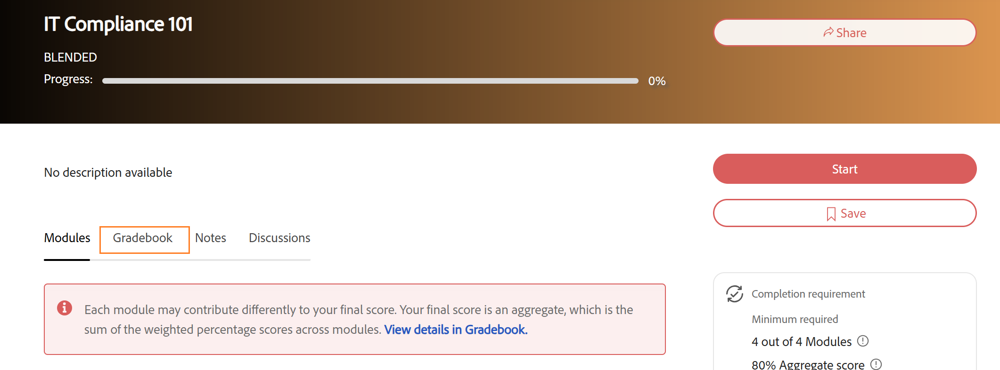

# Schulungskalender für Teilnehmer

## Kurs mit Schulungsunterlagen beginnen

Wenn das Schulungsbuch für einen Kurs in Adobe Learning Manager aktiviert und sichtbar ist, wird auf der Kursübersichtsseite eine Registerkarte **Schulungsbuch** angezeigt. Verwenden Sie diese Option, um Ihre gewichtete Punktzahl für jedes Modul, Ihre aktuelle Gesamtpunktzahl und ob Sie einen größeren Teil des Kurses bestanden haben oder noch absolvieren müssen, anzuzeigen.

## Wenn das Schulungsbuch verfügbar ist

Die Registerkarte **Gradebook** wird im Kurs-Player neben **Modulen**, **Anmerkungen** und **Diskussionen** angezeigt, wenn Ihr Autor oder Administrator die Gradebook-Sichtbarkeit für den Kurs aktiviert hat. Wenn die Registerkarte nicht angezeigt wird, wurde das Schulungsbuch für diesen Kurs nicht aktiviert oder der Administrator hat die Sichtbarkeit der Teilnehmer deaktiviert. Punktzahlen können weiterhin aufgezeichnet und für den Administrator sichtbar sein.

Sie können die Registerkarte **Gradebook** während der Registrierung jederzeit öffnen:

* **Bevor Sie beginnen:** Nach der Registrierung sehen Sie die vollständige Liste der bewertbaren Module mit ihren Gewichtungsprozentsätzen, den Höchstwerten für jedes Modul und den vom Autor festgelegten Kriterien für das Bestehen. Dies zeigt Ihnen genau, wie der Kurs bewertet wird, bevor Sie beginnen.
* **In Bearbeitung:** Während Ihre Module und Ergebnisse aufgezeichnet werden, wird das Notenbuch aktualisiert, um Ihre Ergebnisse neben den Modulen anzuzeigen, die noch nicht getestet wurden oder auf eine Bewertung warten.
* **Nach Abschluss:** Das Schulungsbuch zeigt alle endgültigen Modulergebnisse, Ihre berechnete Gesamtkursbewertung und ein **Ergebnis mit bestandenen** Ergebnissen im Header an.

## Schulungskalender anzeigen

* Wählen Sie unter **Eigenes Lernen** Ihren Kurs aus.
* Wählen Sie die Registerkarte **Gradebook** auf der Kursseite.

  Der Gradebook-Header zeigt Folgendes:

  

* Die **Kriterien für das Bestehen:** Die erforderliche Mindestgesamtpunktzahl und Anzahl von Modulen
* Die Anzahl der erforderlichen Module, die Sie von der Gesamtzahl abgeschlossen haben
* Ihr aktuelles **Aggregatergebnis** in Prozent
* Ihr aktueller Kursstatus: **Nicht gestartet**, **Abschluss ausstehend**, **Bestanden** oder **Nicht bestanden**

Die Modultabelle unter der Kopfzeile zeigt die folgenden Spalten für jedes Modul an:

| **Spalte** | **Was angezeigt wird** |
|------------|-------------------|
| **Modul** | Modulname und -typ |
| **Status** | Ihr Abschluss- oder Punktestatus für dieses Modul (siehe Statusreferenz unten) |
| **Gewicht** | Der Prozentsatz, den dieses Modul zu Ihrer Gesamtpunktzahl beiträgt |
| **Ergebnis** | Ihr Ergebnis für dieses Modul (z. B. 40/100) |
| **Beitrag** | Die tatsächlichen Prozentpunkte, die dieses Modul bisher zu Ihrer Gesamtpunktzahl hinzugefügt hat |

## Modulgewicht auf der Registerkarte &quot;Module&quot; anzeigen

Sie können die Gewichtung jedes Moduls auch auf der Registerkarte **Module** anzeigen, ohne das Schulungsbuch zu öffnen.

Wählen Sie auf der Kursseite die Registerkarte **Module**.

Auf der Registerkarte **Module** werden der Gewichtungsprozentsatz für jedes Modul und die Anzahl der Module angezeigt, die zum Abschließen des Kurses erforderlich sind.

## Modulbewertungen mit mehreren Versuchen

Wenn ein Modul mehrere Versuche zulässt, hängt die in Ihrem Notizbuch angezeigte Punktzahl davon ab, wie der Kursverfasser es konfiguriert hat:

* **Höchste Punktzahl:** Die beste Punktzahl aus jedem Versuch wird angezeigt. Eine niedrigere Punktzahl bei einem späteren Versuch verringert Ihre aufgenommene Punktzahl nicht.
* **Aktuell:** Die Punktzahl aus Ihrem letzten Versuch wird immer angezeigt. Ein niedrigerer Wert bei einem späteren Versuch ersetzt den vorherigen.

## Modulstatus verstehen

Jedes Modul im Notenbuch zeigt einen der folgenden Status:

| **Status** | **Interpretation** |
| ------------ | ------------------- |
| **Bestanden** | Modul beendet und Punktzahl aufgezeichnet |
| **Wird ausgeführt** | Modul gestartet, aber noch nicht beendet |
| **Nicht gestartet** | Modul noch nicht geöffnet |
| **Fehler** | Das Modul wurde bewertet und die Punktzahl erfüllte nicht den Mindestwert zum Bestehen des Moduls. |

## Berechnung der Gesamtpunktzahl

Ihre Gesamtpunktzahl ist die Summe des gewichteten Beitrags jedes bewerteten Moduls:

(Punktzahl erreicht ÷ Höchstpunktzahl) × Gewicht % = Modulanteil

Die Spalte **Beitrag** im Gradebook zeigt den Beitrag jedes Moduls zu Ihrem aktuellen Aggregat an. Module, die mit **Keine Gewichtung** markiert sind, werden von dieser Berechnung ausgeschlossen.

Die Bewertungsskala muss nicht in allen Modulen gleich sein. Ein Modul hat einen Wert von 100, und ein Modul hat einen Wert von 10, beide tragen richtig bei. Die Formel normalisiert jede einzelne vor Anwendung der Gewichtung.
