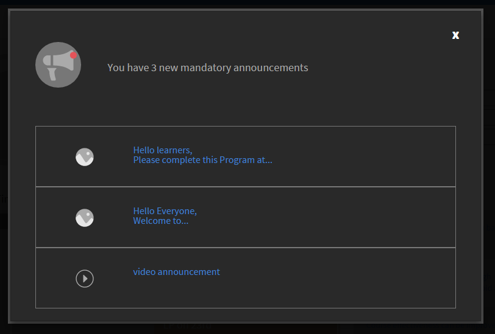

# Ankündigungen

Eine Ankündigung ist eine Multimedia-Nachricht (Text, Bild oder Video), die ein Administrator an eine definierte Gruppe von Benutzern übermittelt.

Der Administrator kann Ankündigungen an Teilnehmer senden, um sie auf ein eintretendes Ereignis oder eine Aktivität hinzuweisen. Wenn eine Ankündigung an die Benutzer in einer bestimmten Gruppe oder für ein bestimmtes Lernobjekt gesendet wird, erhalten alle zur Zielgruppe gehörigen Teilnehmer entsprechende Benachrichtigungen.

## Benachrichtigung zu Ankündigung {#announcementsnotification}

Eine Nachricht zur Übermittlung von Benachrichtigungen wird im Dashboard des Teilnehmers als hervorgehobene Titelleiste angezeigt. Wenn Teilnehmende zum Zeitpunkt der Ankündigung nicht online sind, wird diese Benachrichtigung angezeigt, wenn sie sich bei der Learning Manager-Anwendung anmelden. Teilnehmer können darüber hinaus frühere Ankündigungen über die Benachrichtigungen anzeigen.

*Benachrichtigung über ausstehende Ankündigung*

Wenn Sie auf „Anzeigen“ klicken, wird eine Liste der Ankündigungen angezeigt. Hier wird ein Beispiel für eine Ankündigungsliste gezeigt:

*Alle Ankündigungen anzeigen*

## Beispielankündigung {#asampleannouncement}

Unten wird eine Beispielankündigung als Referenz gezeigt.

*Details einer Ankündigung anzeigen*
