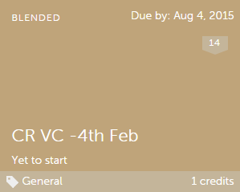
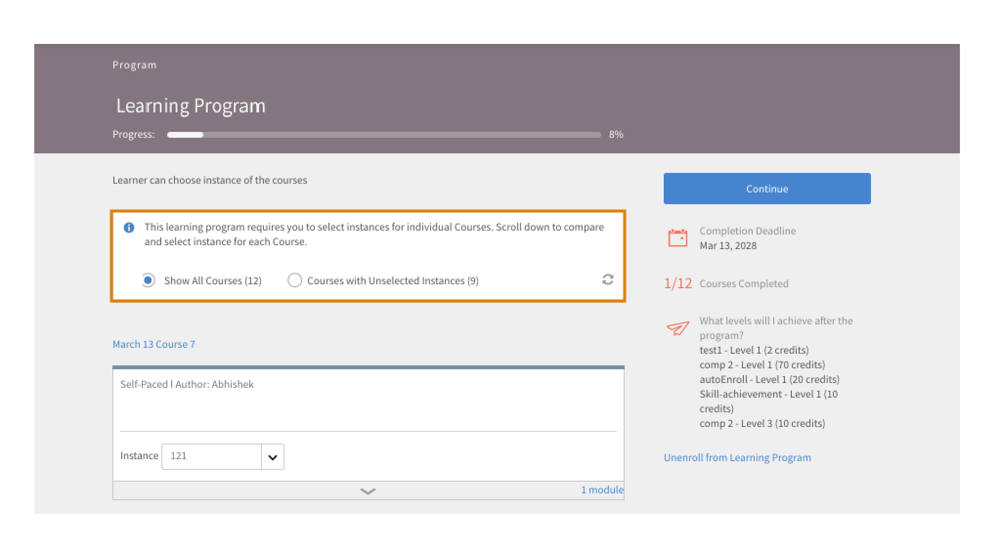
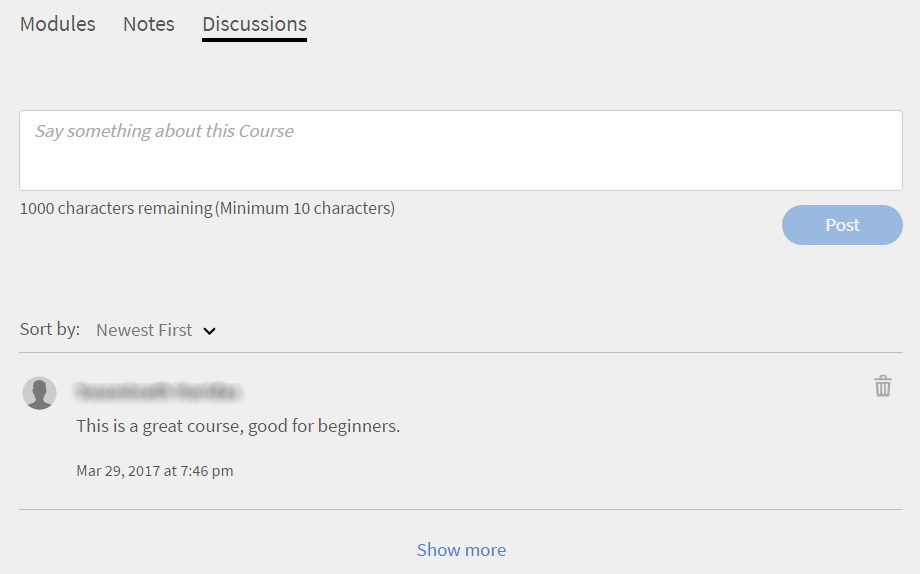

# Kurse

Lesen Sie die folgenden Artikel, um zu erfahren, wie Sie Kurse in Learning Manager anzeigen und nutzen. Nehmen Sie an den Diskussionen teil und geben Sie Feedback.

Autoren erstellen Kurse. Teilnehmer können Kurse absolvieren und Administratoren können die Leistung der Teilnehmer basierend darauf, ob und wie die Kurse konsumiert werden, verfolgen.

## Übersicht {#overview}

Mit Adobe Learning Manager können Teilnehmende auf Kurse, Lernprogramme und Zertifizierungen zugreifen. Teilnehmer können über den Katalog alle verfügbaren Kurse durchsuchen oder sich selbst für Kurse ihrer Wahl registrieren. Teilnehmer können alle eingeschriebenen Kurse und die ihnen zugewiesenen Kurse auf der Registerkarte &quot;Lernen&quot; anzeigen.

>[!NOTE]
>
>Teilnehmer können auch die Learning Manager iPad-App aus dem Apple Store und die Android-App Learning Manager von Google Play installieren und auf Kurse auf mobilgeräten zugreifen. Alle Funktionen für die Teilnehmerrolle sind auch in der App verfügbar. Teilnehmer können Kurse auch offline absolvieren und haben einen nahtlosen Zugriff, wenn sie online gehen. Weitere Informationen findest du auf  [der iPad- und Android-App](ipad-android-tablet-users.md) .

## Anzeigen von Kursen {#viewingcourses}

Sie können als Teilnehmer eine Liste aller verfügbaren Kurse anzeigen. Klicke auf der Startseite auf &quot;Mein Lernen&quot; oder im Bedienfeld links, um alle Kurse anzuzeigen, an denen du dich angemeldet hast.

*Zugewiesene Kurse anzeigen*

Wenn Sie den Kurs noch nicht gestartet haben, können Sie neben dem Kurs auf die Start-Schaltfläche klicken. Wenn Sie bereits mit dem Kurs begonnen haben, können Sie auf die Schaltfläche „Weiter“ klicken.

Um einen bereits abgeschlossenen Kurs anzuzeigen, klicken Sie neben dem Kurs auf die Schaltfläche „Erneut aufrufen“.

Es kann für einen Kurs mehrere Instanzen geben. Klicken Sie auf den Namen des Kurses, um ausführliche Informationen dazu abzurufen. Im rechten Bereich sehen Sie das Datum, an dem die Frist für jede Instanz des Kurse abläuft.

*Abgeschlossenen Kurs anzeigen*

## Kurseffektivität {#courseeffectiveness}

Die Bewertung der Kurseffektivität hilft Teilnehmern dabei, die Kurse mit der größten Effektivität für ihren Lernbedarf zu wählen. Die Kurseffektivität wird ausgewertet, um festzustellen, wie nützlich die Kurse für die Teilnehmer sind. Sie wird auf Basis des Feedbacks berechnet, das entsprechend der Anzahl von Teilnehmern an einem Kurs gesammelt wurde. Wenn der Prozentsatz an Teilnehmern, die Feedback geben, höher ist, ist die Bewertung der Kurseffektivität hoch.

Es handelt sich um eine Kombination aus Ergebnissen aus dem Feedback der Teilnehmer zu den Kursinhalten, den Kurs-Testergebnissen für einen Teilnehmer und dem Feedback des Managers, das einen Teilnehmer basierend auf den Erkenntnissen aus dem Kurs bewertet.

Auf der Seite „Kurse“ kann der Teilnehmer die Bewertung der Kurseffektivität auf den Kurs-Miniaturbildern sehen, wie in der Abbildung unten gezeigt. Die Bewertung für diesen Kurs ist in diesem Fall 14.

*Bewertung der Kurseffektivität anzeigen*

Um genauere Informationen über die Kurseffektivität abzurufen, klicken Sie auf den Kurseffektivitätswert. Ein Popup-Fenster erscheint, wie unten gezeigt.

*Effektivität von Kursen anzeigen*

Klicken Sie in der rechten unteren Ecke des Popupmenüs auf den Abwärtspfeil, um anzuzeigen, wie die Kurseffektivität berechnet wird.

*Berechnung der Kurseffektivität*

## Kurse und Lernprogramme suchen {#searchingcoursesandlearningprograms}

Mit Adobe Learning Manager fällt es Ihnen leichter, Kurse Ihrer Wahl schnell zu finden. Sie können Ihre Kurse auf die folgenden Arten suchen:

1. Klicken Sie auf das Suchsymbol in der rechten oberen Ecke. Ein Suchfeld erscheint. Gib den Namen des Kurs-/Lernprogramms oder alle stichwörter ein, die deinen Kursen zugeordnet sind. Sie können nach Kursen nach Metadaten, Notizen, Qualifikationen, Abzeichen oder Tags suchen. Nach Tags können Sie im Suchfeld suchen, was bedeutet, dass die Tags im Suchfeld angezeigt werden, während Sie tippen.
1. Der Teilnehmer kann die Suchergebnisse auf der Katalogseite mit Typ, Fähigkeiten, Tags und Status verfeinern.

Du kannst die Kurse nach Relevanz, Namen oder Veröffentlichungsdatum sortieren, indem du auf Sortieren nach und aus dem Dropdown-Menü wählst.

Auf der Seite mit den Suchergebnissen kannst du die Kurse nach Dauer **** und **Format** der Kurse filtern. So können Sie flexibler nach Kursen suchen und die für Sie geeigneten Kurse finden.

## Registrierung für Kurse {#enrollingforcourses}

Es gibt drei Möglichkeiten zum Registrieren von Teilnehmern für Kurse:

1. Der Administrator registriert einige Teilnehmer gemäß den Anforderungen des Unternehmens für obligatorische Kurse.
1. Manager teilen ihren Teammitgliedern einige Kurse zu. Sie erhalten eine Benachrichtigung mit der Möglichkeit, den Kurs/das Lernprogramm entweder anzunehmen oder abzulehnen. Wenn Teilnehmer die Nominierung annehmen, werden sie für den Kurs/das Lernprogramm registriert.
1. Teilnehmer können sich selbst direkt für einen Kurs/ein Lernprogramm registrieren:

   1. Wenn es sich um einen Kurs/ein Lernprogramm mit Selbstregistrierung handelt, wird der Teilnehmer unverzüglich registriert.
   1. Wenn das Kurs-/Lernprogramm vom vom Manager genehmigten Typ ist, wechselt der Teilnehmer in **den ausstehenden** Genehmigungsstatus. Nach der Genehmigung durch den Manager wird der Teilnehmer für den Kurs angemeldet.
   1. Wenn Teilnehmer sich für einen Kurs registrieren, für den es bereits eine Warteliste gibt (bei Präsenzkursen), müssen sie warten, bis jemand aus dem Kurs ausscheidet oder der Administrator sie für den Kurs zulässt.

Teilnehmer können sich nach ihren eigenen Wünschen für eine breite Palette an Lernprogrammen registrieren. Die Registerkarte „Kurse“ zeigt alle Ihre registrierten/zugewiesenen Kurse an.

Sie haben jedoch die Möglichkeit, einen der im Katalog aufgeführten Kurse zu durchlaufen, indem ihr mit der Maus darüber geht und auf &quot;Durchsuchen&quot; klickt. Anmeldeseite wird angezeigt. Klicken Sie auf „Registrieren“ in der rechten oberen Ecke der Seite, damit der Kurs in die Liste der Kurse einbezogen wird.

Es kann für einen Kurs/ein Lernprogramm mehrere Instanzen/Sitzungen geben. Klicken Sie im Katalog auf Namen der Kachel für den Kurs/das Lernprogramm, um ausführliche Informationen dazu abzurufen. Sie sehen die Registrierung für die Instanz des Kurses/Lernprogramms anhand des Datums, zu dem die Frist für die jeweilige Kurs-/Lernprogramminstanz abläuft.

**Interesse für einen Kurs registrieren**

Sie können Interesse an der Teilnahme an Präsenzkursen anmelden, für die keine geplanten Sitzungen vorhanden sind. Sie erhalten eine Benachrichtigung, wann immer die Kurssitzung beginnt, damit Sie am Kurs teilnehmen können.

>[!NOTE]
>
>Teilnehmer sollten eine Konfliktmeldung sehen, wenn sie sich gleichzeitig oder überschneidend an zwei verschiedenen Sitzungen anmelden.

## Arbeitsablauf als Teilnehmer

Als Teilnehmer können Sie einen Kurs nur nach der Registrierung bewerten. Sie können die durchschnittlichen Star-Bewertungen für jeden Kurs auf der Startseite **,** auf meiner Lernseite **und** auf dem **Katalog** sehen.

1. Melde dich als Teilnehmer an ****. Dadurch wird die **Startseite geladen**.

1. Suchen Sie nach einem Kurs, indem Sie den Kursnamen in die Suchleiste eingeben. Alternativ kannst du aus der angezeigten Kursliste wählen, indem du im Bedienfeld links auf &quot;Mein Lernen&quot; oder **&quot;Katalog**&quot; klickst **.**

1. Nachdem du einen Kurs ausgewählt hast, klicke auf &quot;Anmelden&quot;****.

   
   *Kurs anmelden*

1. Wählen Sie die Anzahl der Sterne aus, um einen Kurs entsprechend zu bewerten, wobei 1 die niedrigste und 5 die beste Wertung ist. Klicke dann auf &quot;Absenden&quot;****.

   
   *Kursbewertung einreichen*

   Ein Teilnehmer kann das Feedback erneut einreichen, indem er mehrmals eine Sternebewertung abgibt, da nur die neueste Bewertung berücksichtigt wird.

1. Nach der Übermittlung wird eine Bestätigungsmeldung angezeigt.

   
   *Bestätigungsmeldung zu Feedback*

   Wenn Sie das Feedback erneut senden möchten, klicken Sie dazu auf die Meldung. Nachdem die Bewertung gesendet wurde, wird die Meldung drei Sekunden lang angezeigt. Anschließend wird die Bewertung angezeigt. Wenn Sie die Bewertung ändern möchten, können Sie eine andere Sternbewertung auswählen und senden.

Kurse können anhand der durchschnittlichen Bewertungen sortiert werden. Sie können die Fälle im Dropdown-Menü &quot;Nach sortieren&quot; oben rechts **im Katalog** sortieren.

## Teilnahme an einem Kurs {#consumingnbspacourse}

Nach der Registrierung für einen Kurs können Sie mit dem Kurs beginnen, indem Sie beim Kurs auf „Start“ klicken. Alternativ kannst du auch auf &quot;Kurse ]**&quot; auf der**[!UICONTROL  Registerkarte &quot;Lernen ]**&quot; klicken**[!UICONTROL . Wählen Sie einen Kurs aus, den Sie absolvieren möchten.

Wenn Sie den Kurs noch nicht gestartet haben, klicken Sie neben dem Kurstitel auf die Start-Schaltfläche.

Sie können alle Module für den Kurs in einem Browserfenster anzeigen.

**Player-Funktionen**

**** Inhaltsverzeichnis: Während der Aufnahme eines Kurses zeigt der Player links im Fenster ein Inhaltsverzeichnis für diesen Kurs an. Sie können auf jedes Thema klicken und direkt dorthin navigieren.

**Lesezeichen** : Wenn eines der Kursmodule über eine Modul-Inhaltsverzeichnis verfügt, können Themen im Modul TOC mit Lesezeichen versehen werden, um später zu referenzieren. Wenn Themen mit einem Lesezeichen versehen wurden, sehen Sie neben dem Eintrag im Inhaltsverzeichnis ein Bannersymbol. Lesezeichen können gelöscht werden, indem man erneut auf das Bannersymbol klickt.

**Notizen** : Während der Teilnahme am Kurs ist eine Bestimmung zur Aufzeichnung verfügbar. Wenn Sie Anmerkungen aufgezeichnet haben, können Sie sie als PDF herunterladen oder per E-Mail an die E-Mail-IDs registrierter Teilnehmer schicken. Wenn Sie auf „Speichern“ klicken, können Sie den Speicherort für die PDF-Datei wählen.

*Kursnotizen*

**Untertitel** : Wenn bei Adobe Captivate Kursen die Untertitel aktiviert sind, können die Teilnehmer die Untertitel anzeigen. Klicken Sie auf „CC“ unten im Player. Die Option für Bilduntertitel ist nur für HTML-Inhalte von Captivate 8.0.2 verfügbar. Für alle anderen Arten von Modulen erscheint die CC-Option in der Wiedergabeleiste nicht.

**** Kurs erneut besuchen : Sie können einen Kurs in zwei Modi in zwei möglichen Szenarien erneut besuchen:

* Klicken Sie auf „Erneut aufrufen“ wenn sich der Kurs im Status „Abgeschlossen“ befindet.
* Klicken Sie auf „Fortfahren“ wenn der Kurs noch nicht abgeschlossen ist.

**Vollbild** . Klicke rechts unten auf das Vollbildsymbol, um den Kurs im Vollbildfenster anzuzeigen.

**Navigations-Buttons** . Klicke auf die Pfeile nach oben oder unten, um in PDF-, Docx- und PPTX-Inhalten über Folien hinweg zu wechseln. Die Pfeile „Nächste Seite“ oder „Vorherige Seite“ können verwendet werden, um zum nächsten Thema aller Arten von Inhalten zu navigieren.

**Kurs schließen** Klicken Sie auf das Symbol zum Schließen (x) in der rechten oberen Ecke des Players, um den Kurs zu beenden.

*Nachdem du den Kurs beendet hast, kannst du den Kurs erneut aufrufen, indem du auf der Kursbeschreibungsseite auf &quot;Erneut aufrufen&quot; klickst.*

## Sternebewertung

Erst nach der Anmeldung zu einem Kurs kann ein Teilnehmer dem Kurs ein Star-Feedback geben. Auf der Kursübersichtsseite eines Kurses kann der Teilnehmer den Kurs als Sterne bewerten (1-niedrigste, 5-höchste).

*Sternbewertung als Feedback geben*

Ein Teilnehmer kann einen bestimmten Stern (von 5) auswählen und die Bewertung einreichen. Der Teilnehmer kann die Auswahl auch bearbeiten, indem er auf einen anderen Stern klickt. Sobald du das Dokument eingereicht hast, wird ein Danke für deine Feedback-Nachricht angezeigt.

Wenn der Teilnehmer das Feedback erneut senden möchte, klickt er dazu auf die Meldung. Die **Schaltfläche &quot;Absenden** &quot; wird erneut aktiviert. Ein Teilnehmer kann nach der Anmeldung zu einem Kurs mehrfach eine Sternbewertung angeben. Es wird immer die neueste Bewertung berücksichtigt.

Sobald der Teilnehmer eine Bewertung abgegeben hat, werden die durchschnittliche Sternbewertung und die Anzahl der Teilnehmer, die die Sternbewertungen auf der **Kursübersichtsseite** bereitgestellt haben, angegeben.

*Kursüberblick*

Bei allen vorhandenen Konten ist diese Funktion deaktiviert. Administratoren können sie unter „Einstellungen“ aktivieren. Nur dann können die Teilnehmer Sternebewertungen sehen.

## Inhalts-Marketplace

Die Option „Inhalts-Marketplace“ wird im linken Bereich der Teilnehmer-App angezeigt. Wenn du auf die Option klickst, siehst du alle Kurse/Gesamter Katalog und kuratierte Wiedergabelisten.

Auf der folgenden Seite sehen Sie die Kurse, die im gesamten Katalog vorhanden sind. Bei jedem Kurs werden die Dauer und das allgemeine Thema angezeigt. Sie können das Thema über den Filter auf der linken Seite auswählen.

Sie können eine Vorschau eines Kurses genau zwei Minuten lang anzeigen.

*Vorschaukurs auf Marketplace*

Wenn der Administrator Sie dazu einlädt, die unterschiedlichsten Kurse zu entdecken und eine Vorschau für sie anzuzeigen, erhalten Sie eine Benachrichtigung.

Als Teilnehmer kannst du interesse an einem gesamten Katalog oder einer kuratierten Playlist im **Abschnitt Kuratierte Playlist** ausdrücken.

*Kuratierte Playlist anzeigen*

Nachdem Sie Ihr Interesse an einem Kurs/einer Schulung bekundet haben, wird das Interesse erfasst und der Administrator kann den Datensatz abrufen.

In der Learner-App haben alle Administratoren Zugriff auf die Inhalte Marketplace. Wird der Zugriff vom Administrator gesperrt, können Teilnehmer die Registerkarte &quot;Inhalte Marketplace&quot; nicht anzeigen.

Teilnehmer, die vom Administrator eingeladen wurden, können den Inhalts-Marketplace durchsuchen.

>[!NOTE]
>
>Inhalt Marketplace wird in Internet Explorer 11 nicht unterstützt.

Alle Filter und andere Optionen werden im folgenden Video gezeigt.

### Inhaltsvorschau

Sie können den Kurs durchsuchen und in der Vorschau anzeigen und prüfen, ob er Ihren Lernanforderungen entspricht. Klicke auf die **Schaltfläche &quot;Vorschau** &quot;, und sieh dir die Kursvorschau an. Die Vorschau ist zwei Minuten lang verfügbar.

*Vorschau von Content auf dem Marktplatz*

## Materialien-Hub

Mit Content Hub können Administratoren und Fachexperten (KMUs) die erforderlichen Playlists aus der Teilnehmer-App in die engere Auswahl setzen. Nach der Shortlist können Administratoren das Formular zur Kaufanfrage herunterladen und an den Adobe-Vertriebsmitarbeiter weitergeben.

Ein Administrator kann SMEs einladen, die Wiedergabeliste, an der sie interessiert sind, in die Auswahlliste aufzunehmen.

Content Hub ist in der Rolle &quot;Teilnehmer&quot; für alle Administratoren verfügbar. Administratoren ermöglichen es SMEs, die Wiedergabeliste, die sie erwerben möchten, in die Auswahlliste aufzunehmen.

Die Seite „Materialien-Hub“ ist für Administratoren in ihrer Teilnehmerrolle ständig sichtbar, damit sie unkompliziert Wiedergabelisten in Auswahllisten aufnehmen können. Um Sie beim Aufnehmen der richtigen Wiedergabeliste in die Auswahlliste zu unterstützen, können Administratoren diese Seite für eingeschränkte SMEs in ihrem Konto zugänglich machen. Rufen Sie dazu einfach auf der Administratorseite die Seite „Unternehmensschulung“ auf und führen Sie die erforderlichen Schritte aus, um den Zugriff zu gewähren.

## Kursinstanz wählen {#choosecourseinstance}

Wenn Sie als Teilnehmer bei einer Kursinstanz registriert sind, deren Sitzung abgelaufen ist, können Sie jetzt zu einer anderen Sitzung wechseln und dort Fortschritte erzielen. Dies ist nur bei flexiblen LPs möglich.

Um die Kursinstanz zu wechseln, führen Sie die folgenden Schritte aus:

1. Öffnen Sie „Kataloge“ > „Lernprogramm“.

   
   *Lernprogramm auswählen*

1. Wähle mit den Optionsfeldern aus, ob alle Kurse oder Kurse mit nicht ausgewählten Instanzen angezeigt werden sollen. Wenn der Teilnehmer die Instanz abgeschlossen hat, kann er nicht zu einer anderen Instanz wechseln.

   
   *Alle Kurse oder Kurse mit nicht ausgewählten Instanzen anzeigen*

1. In der Dropdown-Liste mit den Instanzen des Kurs werden die verfügbaren Instanzen angezeigt. Wählen Sie die Instanz aus der Dropdown-Liste aus.

   
   *Instanz auswählen*

1. Um zur ausgewählten Instanz zu wechseln, klicken Sie oben auf **[!UICONTROL Registrierung aktualisieren]**. Die Option „Registrierung aktualisieren“ ist rechts oben auf der Seite verfügbar.

   Die neu ausgewählte Instanz wird registriert. Wenn ein Teilnehmer bei einer Kursinstanz angemeldet ist, die Teil einer anderen LO ist, und er die Kursinstanz aktualisiert, die Teil des flexiblen Lernprogramms ist, wird er nach einer Warnung automatisch von den anderen Lernobjekten abgerollt.

## Abschließen eines Kurses {#completingacourse}

Als Teilnehmer können Sie die erforderliche Anzahl von Modulen in einen Kurs für den Kursabschluss abschließen. Die Kursabschlusskriterien hängen davon ab, wie viele Module vom Autor als obligatorisch festgelegt wurden. Beim Registrieren für einen Kurs mit Mindestabschlusskriterien können Sie die Abschlusskriterien im rechten Bereich der Kursseite anzeigen.

*Abschlusskriterien anzeigen*

Wenn zum Beispiel für einen bestimmter Kurs die Abschlusskriterien als eines von zwei Modulen festgelegt wurden, haben Sie den Kurs abgeschlossen, sobald Sie nur ein Modul abgeschlossen haben. In diesem Fall wird nach Abschluss des ersten Moduls der Fortschritt als zu 100 % abgeschlossen angezeigt.

Wenn der Autor eine bestimmte Reihenfolge für die Module festgelegt hat, müssen Sie die erforderliche Anzahl von Modulen in dieser Reihenfolge abschließen. Sind die Module unsortiert, können Sie die angegebene Anzahl von Modulen in beliebiger Reihenfolge ausführen.

Wenn Sie die optionalen Module abschließen möchten, nachdem Sie einen Kurs mit der erforderlichen Anzahl von Modulen abgeschlossen haben, können Sie den Kurs noch einmal besuchen.

## Anzeigen und Teilnahme an Diskussionen {#viewingandpariticpatingindiscussions}

Als Teilnehmer können Sie über die Registerkarte „Diskussionen“ mit anderen Teilnehmern und mit Ihrem Kursleiter interagieren. Sie können die Beiträge zu allen Kursen anzeigen, die für Sie sichtbar sind oder für die Sie sich registriert haben. Wenn ein Administrator Diskussionen für einen Kurs aktiviert hat, können Sie die Registerkarte „Diskussionen“ neben der Registerkarte „Hinweise“ für den betreffenden Kurs anzeigen.

Sobald Sie auf die Registerkarte „Diskussionen“ klicken, sehen Sie die vorhandenen Beiträge und Kommentare zu diesem Kurs. Wenn Sie sich bereits für den Kurs registriert haben, können Sie auch Beiträge oder Kommentare eingeben, die dann für andere Benutzer sichtbar sind. Nachdem Sie die Nachricht eingegeben, klicken Sie auf „Veröffentlichen“. Ihr Beitrag muss mindestens 10 Zeichen enthalten.

Der Beitrag wird sofort auf der Registerkarte „Diskussionen“ angezeigt. Du kannst die Posts als &quot;Neueste Erste&quot; oder &quot;Ältesten zuerst&quot; sortieren und die posts löschen, die du geschrieben hast. Auch nachdem Sie die Registrierung für den Kurs widerrufen haben, können Sie weiterhin alle Beiträge anzeigen und Ihre eigenen Beiträge löschen.

*Diskussionen mit Teilnehmern anzeigen*

Die Registerkarte „Diskussionen“ wird nicht für externe Benutzer aktiviert.

*Registerkarte Diskussion*

## Lebenszyklus von Kursen {#courselifecycle}

Ein typischer Lebenszyklus von Kursen sieht wie folgt aus:

**Entwurf** – Wenn ein Autor die Erstellung eines Kurses abgeschlossen und gespeichert hat In diesem Status ist der Kurs für Teilnehmer noch nicht verfügbar.

**Veröffentlicht** – Wenn ein Autor die Veröffentlichung eines Kurses abgeschlossen hat In diesem Status ist der Kurs für Teilnehmer verfügbar. Sie können sich für einen solchen Kurs registrieren.

**Im Ruhestand** : Nach der Veröffentlichung eines Kurses kann ein Autor ihn in einen Ruhezustand verschieben, wenn er nicht möchte, dass der Kurs im Kurskatalog für Teilnehmer angezeigt wird.

**Gelöscht** : Ein Kurs unter dem gelöschten Status ist der, wenn er vollständig aus der Adobe Learning Manager-Anwendung entfernt wird. Kurse können nur von Autoren gelöscht werden, wenn sie im Status „Entwurf“ oder „Eingestellt“ sind.

*Überblick über den Lebenszyklus eines Kurses*
