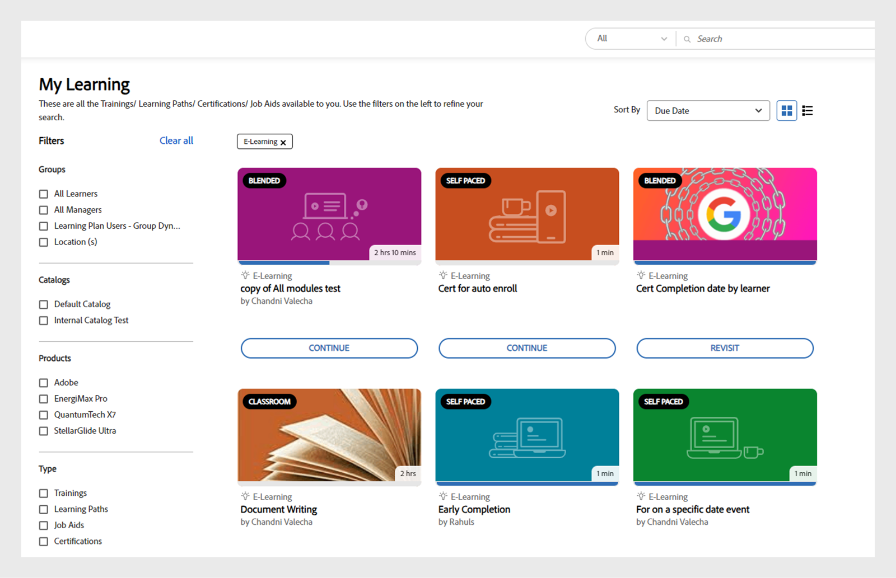
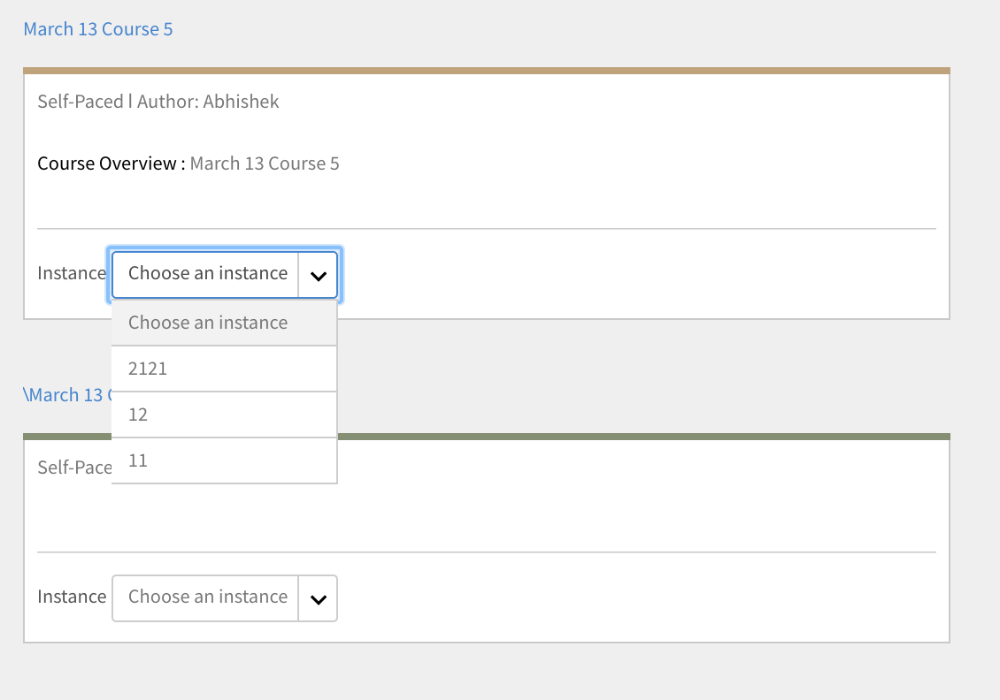

# Kurse

Lesen Sie diesen Artikel, um zu erfahren, wie Sie Kurse im Learning Manager anzeigen und nutzen. Nehmen Sie an den Diskussionen teil und geben Sie Feedback.

Autoren erstellen Kurse. Teilnehmer können Kurse absolvieren und Administratoren können die Leistung der Teilnehmer basierend auf der Kursnutzung verfolgen.

## Übersicht {#overview}

Mit dem Adobe Learning Manager können Teilnehmer auf Kurse, Lernprogramme und Zertifizierungen zugreifen. Teilnehmer können über den Katalog alle verfügbaren Kurse durchsuchen oder sich selbst für Kurse ihrer Wahl registrieren. Teilnehmer können alle Kurse, für die sie registriert sind, und die Kurse, die ihnen zugewiesen wurden, auf der Registerkarte &quot;Lernen&quot; anzeigen.

>[!NOTE]
>
>Teilnehmer können die Learning Manager iPad-App aus dem Apple Store und die Learning Manager Android-App aus Google Play installieren und auf mobilen Geräten auf die Kurse zugreifen. Alle Funktionen für die Teilnehmerrolle sind auch in der App verfügbar. Teilnehmer können Kurse auch offline absolvieren und haben einen nahtlosen Zugriff, wenn sie online gehen. Siehe  [Benutzer von iPad- und Android-Tablets](ipad-android-tablet-users.md) finden Sie weitere Informationen.

## Anzeigen von Kursen {#viewingcourses}

Sie können als Teilnehmer eine Liste aller verfügbaren Kurse anzeigen. Klicken Sie auf der Startseite oder im linken Teilfenster auf &quot;Eigenes Lernen&quot;, um alle Kurse anzuzeigen, für die Sie sich registriert haben.

*Zugewiesene Kurse anzeigen*

Wenn Sie den Kurs noch nicht gestartet haben, können Sie neben dem Kurs auf die Schaltfläche &quot;Start&quot; klicken. Wenn Sie bereits mit dem Kurs begonnen haben, können Sie auf die Schaltfläche &quot;Weiter&quot; klicken.

Um einen abgeschlossenen Kurs anzuzeigen, klicken Sie neben dem Kurs auf die Schaltfläche &quot;Erneut aufrufen&quot; .

Es kann für einen Kurs mehrere Instanzen geben. Klicken Sie auf den Kursnamen, um ausführliche Informationen dazu abzurufen. Im rechten Bereich sehen Sie das Fristablaufdatum für jede Instanz des Kurses.

*Anzeigen eines abgeschlossenen Kurses*

## Kurseffektivität {#courseeffectiveness}

Die Bewertung der Kurseffektivität hilft Teilnehmern dabei, die Kurse mit der größten Effektivität für ihren Lernbedarf zu wählen. Die Kurseffektivität wird ausgewertet, um festzustellen, wie nützlich ein Kurs für den Teilnehmer ist. Es wird auf der Grundlage des Feedbacks berechnet, das von der Anzahl der Benutzer für einen bestimmten Kurs erhalten wurde. Wenn der Prozentsatz an Teilnehmern, die Feedback geben, höher ist, ist die Bewertung der Kurseffektivität hoch.

Dies ist eine Kombination der Ergebnisse des Teilnehmer-Feedbacks zu den Kursinhalten, der Ergebnisse des Kursquiz für einen Teilnehmer und des vom Manager gegebenen Feedbacks, mit dem die Lernfortschritte des Teilnehmers im Kurs bewertet werden.

Auf der Seite &quot;Kurse&quot; kann der Teilnehmer die Bewertung der Kurseffektivität auf den Kurs-Miniaturbildern sehen, wie in der Abbildung unten gezeigt. Sie können die Bewertung für diesen Kurs als 14 anzeigen.

*Bewertung der Kurseffektivität anzeigen*

Um Details zur Bewertung der Kurseffektivität anzuzeigen, klicken Sie auf den Wert für die Kurseffektivität. Ein Popup-Fenster wird angezeigt (siehe unten).

*Kurseffektivität anzeigen*

Klicken Sie in der rechten unteren Ecke des Popupmenüs auf den Abwärtspfeil, um anzuzeigen, wie die Kurseffektivität berechnet wird.

*Berechnung der Kurseffektivität*

## Kurse und Lernprogramme suchen {#searchingcoursesandlearningprograms}

Adobe Learning Manager erleichtert Ihnen das schnelle Auffinden von Kursen Ihrer Wahl. Sie können Ihre Kurse auf folgende Weise suchen:

1. Klicken Sie auf das Suchsymbol in der rechten oberen Ecke. Ein Suchfeld wird angezeigt. Geben Sie den Namen des Kurses/Lernprogramms oder zu Ihrem Kurs passende Schlüsselwörter ein. Sie können nach Kursen mithilfe von Metadaten, Hinweisen, Kenntnissen, Abzeichen oder Tags suchen. Nach Tags können Sie im Suchfeld suchen, was bedeutet, dass die Tags im Suchfeld angezeigt werden, während Sie tippen.
1. Der Teilnehmer kann die Suchergebnisse auf der Katalogseite mit Typ, Kenntnissen, Tags und Status verfeinern.

Sie können die Kurse nach Relevanz, Name oder Veröffentlichungsdatum sortieren, indem Sie auf &quot;Sortieren nach&quot; klicken und im Dropdown-Menü auswählen.

Auf der Seite mit den Suchergebnissen können Sie die Kurse nach folgenden Kriterien filtern: **Dauer** der Kurse und der **formatieren** der Kurse. Dies gibt Ihnen mehr Flexibilität bei der Suche nach Kursen und stellt sicher, dass Sie die für Sie geeigneten Kurse finden.

## Registrierung für Kurse {#enrollingforcourses}

Die Registrierung von Teilnehmern für Kurse ist auf die folgenden drei Arten möglich:

1. Der Administrator/Manager registriert einige Teilnehmer gemäß den Anforderungen des Unternehmens für obligatorische Kurse.
1. Manager teilen ihren Teammitgliedern einige Kurse zu. Sie erhalten eine Benachrichtigung mit der Möglichkeit, den Kurs/das Lernprogramm zu akzeptieren oder abzulehnen. Wenn Teilnehmer die Nominierung annehmen, werden sie für den Kurs/das Lernprogramm registriert.
1. Teilnehmer können sich selbst direkt für einen Kurs/ein Lernprogramm registrieren:

   1. Wenn es sich um einen Kurs/ein Lernprogramm mit Selbstregistrierung handelt, wird der Teilnehmer sofort registriert.
   1. Wenn es sich um einen Kurs/ein Lernprogramm handelt, der/das vom Manager genehmigt werden muss, wechselt der Teilnehmer zu **Genehmigung ausstehend** Status. Nach der Genehmigung durch den Manager wird der Teilnehmer für den Kurs registriert.
   1. Wenn Teilnehmer sich für einen Kurs registrieren, für den es bereits eine Warteliste gibt (bei Präsenzkursen), müssen sie warten, bis jemand aus dem Kurs ausscheidet oder der Administrator sie für den Kurs zulässt.

Teilnehmer können sich nach ihren eigenen Wünschen für eine breite Palette an Kursen registrieren. Die Registerkarte Kurse zeigt alle Ihre registrierten/zugewiesenen Kurse an.

Sie haben jedoch die Möglichkeit, alle Kurse, die im Katalog aufgeführt sind, zu durchsuchen, indem Sie die Maus darauf bewegen und auf &quot;Durchsuchen&quot; klicken. Die Registrierungsseite wird angezeigt. Klicken Sie in der rechten oberen Ecke der Seite auf &quot;Registrieren&quot;, um den Kurs in die Liste der Kurse aufzunehmen.

Es kann für einen Kurs/ein Lernprogramm mehrere Instanzen/Sitzungen geben. Klicken Sie im Katalog auf den Namen der Kachel für den Kurs/das Lernprogramm, um ausführliche Informationen dazu abzurufen. Sie sehen die Registrierung für die Instanz des Kurses/Lernprogramms basierend auf dem Datum, an dem die Frist für jede Instanz des Kurses/Lernprogramms abläuft.

**Interesse für Kurse registrieren**

Sie können Interesse an Präsenzkursen anmelden, für die keine geplanten Sitzungen vorhanden sind. Sie erhalten eine Benachrichtigung, wann immer die Kurssitzung beginnt, damit Sie am Kurs teilnehmen können.

## Arbeitsablauf als Teilnehmer

Als Teilnehmer können Sie einen Kurs nur nach der Registrierung bewerten. Sie können die durchschnittliche Sternebewertung für jeden Kurs auf der Seite &quot; **Startseite** Seite, **Eigenes Lernen** und **Katalog**.

1. Melden Sie sich als **Teilnehmer**. Dadurch wird die Datei **Startseite**.

1. Suchen Sie nach einem Kurs, indem Sie den Kursnamen in die Suchleiste eingeben. Alternativ können Sie aus der angezeigten Kursliste auswählen, indem Sie auf **Eigenes Lernen** oder **Katalog** im linken Bereich.

1. Nachdem Sie einen Kurs ausgewählt haben, klicken Sie auf **[!UICONTROL Registrieren]**.

   
   *Registrierung für einen Kurs*

1. Wählen Sie die Anzahl der Sterne aus, um einen Kurs entsprechend zu bewerten, wobei 1 die niedrigste und 5 die beste Wertung ist. Klicken Sie anschließend auf **[!UICONTROL Senden]**.

   
   *Kursbewertung senden*

   Ein Teilnehmer kann das Feedback erneut einreichen, indem er mehrmals eine Sternebewertung abgibt, da die neueste Bewertung berücksichtigt wird.

1. Nach der Übermittlung wird eine Bestätigungsmeldung angezeigt.

   
   *Feedback-Bestätigungsmeldung*

   Wenn Sie das Feedback erneut senden möchten, klicken Sie dazu auf die Meldung. Nachdem die Bewertung gesendet wurde, wird die Meldung drei Sekunden lang angezeigt und anschließend die Bewertung angezeigt. Wenn Sie die Bewertung ändern möchten, können Sie einen anderen Stern auswählen und senden.

Kurse können anhand der durchschnittlichen Bewertungen sortiert werden. Sie können die Fälle in der Dropdown-Liste &quot;Sortieren nach&quot; in der oberen rechten Ecke sortieren, die in **Katalog**.

## Einen Kurs belegen {#consumingnbspacourse}

Nachdem Sie sich für einen Kurs registriert haben, können Sie mit dem Kurs beginnen, indem Sie beim Kurs auf &quot;Start&quot; klicken. Alternativ klicken Sie auf **[!UICONTROL Kurse]** in **[!UICONTROL Lernressourcen]** &quot; ändern. Wählen Sie einen Kurs aus, den Sie absolvieren möchten.

Wenn Sie den Kurs noch nicht gestartet haben, klicken Sie neben dem Kurstitel auf die Schaltfläche Start .

Sie können alle Module für den Kurs in einem Browserfenster anzeigen.

**Player-Funktionen**

**Inhaltsverzeichnis** - Wenn ein Kurs belegt wird, zeigt der Player ein Inhaltsverzeichnis des entsprechenden Kurses im linken Bereich des Fensters an. Sie können auf jedes Thema klicken und direkt dorthin navigieren.

**Lesezeichen** - Wenn ein Kursmodul ein Modul-Inhaltsverzeichnis hat, können die Themen im Modul-Inhaltsverzeichnis mit einem Lesezeichen versehen werden, sodass später darauf verwiesen werden kann. Wenn Themen mit einem Lesezeichen versehen wurden, wird neben dem Eintrag im Inhaltsverzeichnis ein Bannersymbol angezeigt. Lesezeichen können durch erneutes Klicken auf das Menüband gelöscht werden.

**Hinweise** - Eine Anmerkungsfunktion ist während der Bearbeitung des Kurses verfügbar. Nachdem Sie die Anmerkungen aufgezeichnet haben, können Sie sie speichern und als PDF herunterladen oder per E-Mail an die E-Mail-IDs registrierter Teilnehmer senden. Wenn Sie auf &quot;Speichern&quot; klicken, können Sie den Speicherort für die PDF-Datei auswählen.

*Kursnotizen erstellen*

**Untertitel** - Wenn während der Kursentwicklung die Untertitel für von Adobe Captivate entwickelte Kurse aktiviert sind, können die Teilnehmer die Untertitel anzeigen. Klicken Sie unten im Player auf &quot;CC&quot;. Die Option für Bilduntertitel ist nur für HTML-Inhalte von Captivate 8.0.2 verfügbar. Für alle anderen Modultypen wird die CC-Option nicht in der Wiedergabeleiste angezeigt.

**Kurs erneut aufrufen** - Sie können einen Kurs in zwei möglichen Szenarien mit zwei Verfahren erneut aufrufen:

* Klicken Sie auf Erneut aufrufen, während der Kurs abgeschlossen ist.
* Klicken Sie auf &quot;Fortfahren&quot;, während der Kurs noch nicht abgeschlossen ist.

**Vollbild** Klicken Sie auf das Vollbild-Symbol in der rechten unteren Ecke des Players, um den Kurs auf dem Vollbildschirm anzuzeigen.

**Navigationsschaltflächen** Sie können die Pfeile nach oben/nach unten anklicken, um im pdf-, docx- und pptx-Format durch die Folien zu navigieren. Mit den Folienpfeilen können Sie zu den nächsten Themen für alle Inhaltstypen wechseln.

**Kurs schließen** Klicken Sie auf das Symbol zum Schließen (x) in der oberen rechten Ecke des Players, um den Kurs zu beenden.

*Wenn Sie den Kurs verlassen, können Sie ihn erneut aufrufen, indem Sie auf der Seite mit der Kursbeschreibung auf die Schaltfläche &quot;Erneut aufrufen&quot; klicken.*

## Sternebewertung

Erst nach der Registrierung für einen Kurs kann ein Teilnehmer dem Kurs ein Sternefeedback geben. Auf der Seite &quot;Kursübersicht&quot; eines Kurses kann der Teilnehmer den Kurs mit Sternen bewerten (1 als niedrigste, 5 als höchste Wertung).

*Sternebewertung als Feedback angeben*

Ein Teilnehmer kann einen bestimmten Stern auswählen (von 5) und die Bewertung senden. Der Teilnehmer kann die Auswahl auch bearbeiten, indem er auf einen anderen Stern klickt. Nach der Übermittlung wird die Meldung &quot;Vielen Dank für Ihr Feedback!&quot; angezeigt.

Wenn der Teilnehmer das Feedback erneut senden möchte, klickt er dazu auf die Meldung. Die Schaltfläche **Senden **wird erneut aktiviert. Ein Teilnehmer kann nach der Registrierung für einen Kurs mehrmals eine Sternebewertung abgeben. Die aktuellste Bewertung wird immer berücksichtigt.

Sobald der Teilnehmer eine Bewertung abgegeben hat, werden die durchschnittliche Sternebewertung und die Anzahl der Teilnehmer, die die Sternebewertung abgegeben haben, in der **Kursübersicht** angezeigt.

*Kursübersicht*

Bei allen vorhandenen Konten ist diese Funktion deaktiviert. Administratoren können sie über &quot;Einstellungen&quot; aktivieren. Nur dann werden den Teilnehmern Sternebewertungen angezeigt.

## Content Marketplace

Die Option &quot;Inhalts-Marketplace&quot; wird im linken Bereich der Teilnehmer-App angezeigt. Wenn Sie auf die Option klicken, werden alle Kurse/der gesamte Katalog und kuratierte Wiedergabelisten angezeigt.

Auf der folgenden Seite sehen Sie die Kurse, die im gesamten Katalog vorhanden sind. Jeder Kurs zeigt seine Dauer und das allgemeine Thema an, zu dem er gehört. Sie können das Thema über den Filter auf der linken Seite auswählen.

Sie können eine Vorschau eines Kurses genau zwei Minuten lang anzeigen.

*Kursvorschau in Adobe Exchange*

Wenn der Administrator Sie einlädt, eine Vielzahl von Kursen zu entdecken und eine Vorschau anzuzeigen, wird eine Benachrichtigung angezeigt.

Als Teilnehmer können Sie Interesse für einen gesamten Katalog oder eine kuratierte Wiedergabeliste im **Kuratierte Wiedergabeliste** Abschnitt.

*Kuratierte Wiedergabeliste anzeigen*

Nachdem Sie Ihr Interesse an einem Kurs/einer Schulung bekundet haben, wird das Interesse erfasst und der Administrator kann den Datensatz abrufen.

In der Teilnehmer-App haben alle Administratoren Zugriff auf den Inhalts-Marketplace. Wenn der Zugriff vom Administrator widerrufen wird, können die Teilnehmer die Registerkarte &quot;Inhalts-Marketplace&quot; nicht sehen.

Teilnehmer, die vom Administrator eingeladen wurden, können den Inhalts-Marketplace durchsuchen.

>[!NOTE]
>
>Der Inhalts-Marketplace wird in Internet Explorer 11 nicht unterstützt.

Alle Filter und andere Optionen werden im folgenden Video angezeigt.

### Inhaltsvorschau

Sie können den Kurs durchsuchen, in der Vorschau anzeigen und sehen, ob er Ihren Lernanforderungen entspricht. Klicken Sie auf die Schaltfläche **Vorschau **und die Kursvorschau wird angezeigt. Die Vorschau ist zwei Minuten lang verfügbar.

*Content-Vorschau auf dem Marktplatz.*

## Materialien-Hub

Mit dem Materialien-Hub können Administratoren und Fachexperten (Subject Matter Experts, SMEs) benötigte Wiedergabelisten aus der Teilnehmer-App in die Auswahlliste aufnehmen. Nach der Aufnahme in die Auswahlliste können Administratoren das Kaufanfrageformular herunterladen und es für den Adobe-Vertriebsmitarbeiter freigeben.

Ein Administrator kann SMEs einladen, die Wiedergabeliste, an der sie interessiert sind, in die Auswahlliste aufzunehmen.

Das Materialien-Hub ist in der Teilnehmerrolle für alle Administratoren verfügbar. Administratoren ermöglichen es SMEs, die Wiedergabeliste, die sie erwerben möchten, in die Auswahlliste aufzunehmen.

Die Seite &quot;Materialien-Hub&quot; ist für Administratoren in ihrer Teilnehmerrolle ständig sichtbar, da sie so die Möglichkeit hat, Wiedergabelisten einfach in Auswahllisten aufzunehmen. Um Ihnen beim Aufnehmen der richtigen Wiedergabeliste in die Auswahlliste zu helfen, können Administratoren diese Seite für eingeschränkte Fachexperten in ihrem Konto zugänglich machen. Besuchen Sie die Seite Unternehmensschulung auf der Administratorseite und unternehmen Sie die erforderlichen Schritte, um den Zugriff zu gewähren.

## Kursinstanz wählen {#choosecourseinstance}

Wenn Sie als Teilnehmer bei einer Kursinstanz registriert sind, deren Sitzung abgelaufen ist, können Sie jetzt zu einer anderen Sitzung wechseln und dort Fortschritte erzielen. Dies ist nur bei flexiblen LPs möglich.

Um die Kursinstanz zu ändern, führen Sie die folgenden Schritte aus:

1. Öffnen Sie &quot;Kataloge&quot; > &quot;Lernprogramm&quot;.

   
   *Lernprogramm auswählen*

1. Verwenden Sie die Optionsfelder, um auszuwählen, ob Sie alle Kurse oder Kurse mit nicht ausgewählten Instanzen anzeigen möchten. Beachten Sie, dass der Teilnehmer nach Abschluss der Instanz nicht zu einer anderen Instanz wechseln kann.

   
   *Alle Kurse oder Kurse mit nicht ausgewählten Instanzen anzeigen*

1. Im Dropdown-Menü mit den Instanzen des Kurses werden die verfügbaren Instanzen angezeigt. Wählen Sie die Instanz aus der Dropdownliste aus.

   
   *Instanz auswählen*

1. Um die ausgewählte Instanz anzuwenden, klicken Sie auf **[!UICONTROL Registrierung aktualisieren]**. Die Option &quot;Registrierung aktualisieren&quot; ist rechts oben auf der Seite verfügbar.

   Die neu ausgewählte Instanz wird registriert. Wenn ein Teilnehmer bei einer Kursinstanz registriert ist, die Teil eines anderen LO ist, und er die Kursinstanz aktualisiert, die Teil des flexiblen Lernprogramms ist, wird er nach einer Warnung automatisch von den anderen Lernobjekten abgemeldet.

## Abschließen eines Kurses {#completingacourse}

Als Teilnehmer können Sie die erforderliche Anzahl von Modulen in einem Kurs für den Kursabschluss abschließen. Die Kursabschlusskriterien hängen davon ab, wie viele Module vom Autor als obligatorisch festgelegt wurden. Wenn Sie sich für einen Kurs mit Mindestabschlusskriterien registrieren, können Sie die Abschlusskriterien im rechten Bereich der Kursseite anzeigen.

*Abschlusskriterien anzeigen*

Wenn beispielsweise für einen bestimmten Kurs die Abschlusskriterien als eines von zwei Modulen festgelegt wurden, haben Sie den Kurs abgeschlossen, wenn Sie nur ein Modul abgeschlossen haben. Wenn Sie das erste Modul abschließen, zeigt die Fortschrittsleiste den Status &quot;100 % abgeschlossen&quot; an.

Wenn der Autor eine bestimmte Reihenfolge für die Module festgelegt hat, müssen Sie die erforderliche Anzahl von Modulen in dieser Reihenfolge abschließen. Wenn die Module unsortiert sind, können Sie die angegebene Anzahl von Modulen in beliebiger Reihenfolge abschließen.

Wenn Sie die optionalen Module abschließen möchten, nachdem Sie einen Kurs mit der erforderlichen Anzahl von Modulen abgeschlossen haben, können Sie den Kurs erneut besuchen.

## Anzeigen von und Teilnehmen an Diskussionen {#viewingandpariticpatingindiscussions}

Als Teilnehmer können Sie über die Registerkarte &quot;Diskussionen&quot; mit anderen Teilnehmern und mit Ihren Kursleitern interagieren. Sie können die Beiträge zu allen Kursen anzeigen, die Sie anzeigen oder für die Sie sich registriert haben. Wenn ein Administrator Diskussionen für einen Kurs aktiviert hat, können Sie die Registerkarte &quot;Diskussionen&quot; neben der Registerkarte &quot;Hinweise&quot; für diesen Kurs anzeigen.

Wenn Sie auf die Registerkarte &quot;Diskussionen&quot; klicken, werden die vorhandenen Beiträge und Kommentare zu diesem Kurs angezeigt. Wenn Sie sich bereits für den Kurs registriert haben, können Sie auch Beiträge oder Kommentare eingeben, die dann für andere Benutzer sichtbar sind. Nachdem Sie die Nachricht eingegeben, klicken Sie auf &quot;Veröffentlichen&quot;. Ihr Beitrag muss mindestens 10 Zeichen enthalten.

Der Beitrag wird sofort auf der Registerkarte &quot;Diskussionen&quot; angezeigt. Sie können die Beiträge nach &quot;Neueste zuerst&quot; oder &quot;Älteste zuerst&quot; sortieren und die Beiträge löschen, die Sie geschrieben haben. Auch nachdem Sie die Registrierung für den Kurs widerrufen haben, können Sie weiterhin alle Beiträge anzeigen und Ihre eigenen Beiträge löschen.

*Teilnehmerdiskussionen anzeigen*

Die Registerkarte &quot;Diskussionen&quot; ist nicht für externe Benutzer aktiviert.

*Registerkarte &quot;Diskussionen&quot;*

## Lebenszyklus von Kursen {#courselifecycle}

Ein typischer Lebenszyklus von Kursen sieht wie folgt aus:

**Entwurf** - Wenn ein Autor einen Kurs fertig erstellt und gespeichert hat. In diesem Status ist der Kurs für Teilnehmer noch nicht verfügbar.

**Veröffentlicht** - Wenn ein Autor einen Kurs veröffentlicht hat. In diesem Status ist der Kurs für Teilnehmer verfügbar, die sich registrieren können.

**Rentner** - Nach der Veröffentlichung kann der Autor den Kurs wieder einstellen, wenn er ihn aus dem Kurskatalog für die Teilnehmer entfernen möchte.

**Gelöscht** - Ein Kurs hat den Status &quot;Gelöscht&quot;, wenn er vollständig aus der Adobe Learning Manager-Anwendung entfernt wurde. Kurse können nur von Autoren gelöscht werden, wenn sie im Status &quot;Entwurf&quot; oder &quot;Eingestellt&quot; sind.

*Übersicht über den Lebenszyklus von Kursen*
