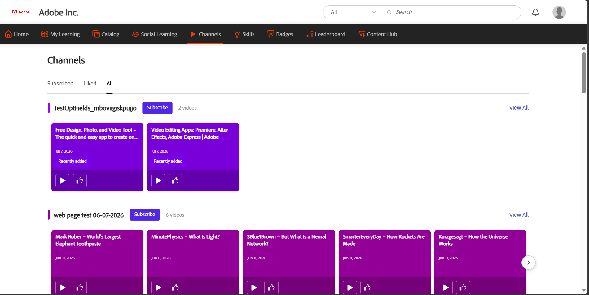
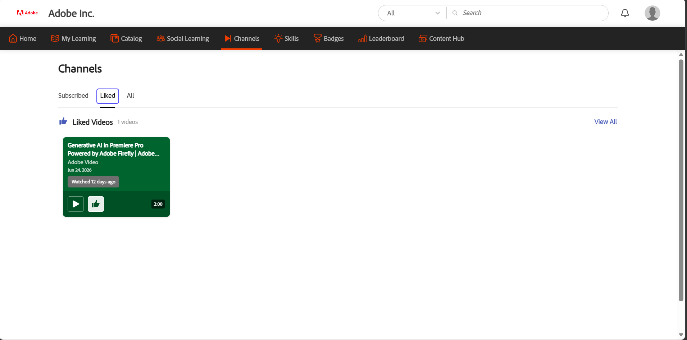

# Kanäle entdecken und mit ihnen interagieren (Beta)

>[!IMPORTANT]
>
>Beta-Funktionen können Mängel enthalten und werden &quot;wie besehen&quot; ohne jegliche Gewährleistung bereitgestellt. Adobe hat das alleinige Ermessen, ob Betafunktionen allgemein verfügbar gemacht werden sollen. Adobe ist nicht verpflichtet, die Beta-Funktionen zu verwalten, zu korrigieren, zu aktualisieren, zu ändern, zu ändern oder auf andere Weise (über Adobe Support Services oder auf andere Weise) zu unterstützen. Sollte eine Beta-Funktion allgemein verfügbar werden, kann sie zusätzlichen Nutzungsbedingungen einschließlich ggf. anfallender Gebühren unterliegen. Beta-Funktionen können sich ohne vorherige Ankündigung ändern, einschließlich der Kündigung. Kunden wird empfohlen, mit Vorsicht vorzugehen und sich in keiner Weise auf die ununterbrochene oder fehlerfreie Funktion oder Leistung der Betafunktionen zu verlassen. Dementsprechend erfolgt jede Nutzung der Beta-Funktionen auf eigenes Risiko des Kunden. Die Produktfunktionen und die zugehörige Dokumentation können sich mit der Weiterentwicklung der Funktion ändern. Diese Dokumentation spiegelt die aktuelle Beta-Erfahrung wider und sollte nicht als endgültige oder vollständige Produktdokumentation betrachtet werden.

Kanäle helfen Teilnehmern dabei, videobasierte informelle Lerninhalte zu entdecken und darauf zuzugreifen, die in Web- und Cloud Confluence-Seiten innerhalb der Adobe Learning Manager kuratiert sind. Administratoren erstellen Kanäle, indem sie sie mit Unternehmens-Web-Seiten oder Cloud Confluence-Seiten verbinden, die aufgezeichnete Wissensaustausch- und Wissenstransfersitzungen hosten.

Anstatt auf mehreren internen Sites zu suchen, können Sie Kanalinhalte direkt im Lern-Manager durchsuchen. Kanäle bieten einen zentralen Ort, an dem Sie relevante Videos entdecken, über neue Inhalte auf dem Laufenden bleiben und mit den zum Selbststudium verfügbaren Lernressourcen Ihres Unternehmens interagieren können.

**Wichtigste Vorteile**

- Greife an einem zentralen Ort auf Videoinhalte von Unternehmens-Web-Seiten und Cloud Confluence-Seiten zu.
- Entdecken Sie Lernressourcen, ohne auf mehreren internen Websites navigieren zu müssen.
- Abonnieren Sie Kanäle, um informiert zu bleiben, wenn neue Inhalte hinzugefügt werden.
- Videos direkt in Adobe Learning Manager ansehen und mögen.
- Nehmen Sie an Diskussionen teil und arbeiten Sie mit anderen Teilnehmern an freigegebenen Inhalten zusammen.
- Entdecke ausgewählte Sammlungen von Videos, die für deine Rolle und deine Interessen relevant sind.

## Kanäle suchen

Verwenden Sie die Seite **Kanäle**, um neue Inhalte zu entdecken, auf abonnierte Kanäle zuzugreifen und Videos anzuzeigen, die Ihnen gefallen haben.

1. Melden Sie sich bei Adobe Learning Manager an.

1. Wählen Sie in der oberen Navigationsleiste **Kanäle** aus.

   >[!NOTE]
   >
   >Wenn Sie die Registerkarte **Kanäle** in der Navigationsleiste nicht anzeigen können, wenden Sie sich an Ihren Administrator.

     Die Seite **Kanäle** wird geöffnet. Die Registerkarte **Alle** wird standardmäßig angezeigt.

   

   *Die Registerkarte &quot;Alle&quot; der Seite &quot;Kanäle&quot;, auf der Sie verfügbare Kanäle entdecken und abonnieren.*

1. Verwenden Sie die folgenden Registerkarten, um Kanalinhalte zu durchsuchen:

   | **Registerkarte** | **Beschreibung** |
   |----|----|
   | **Alle** | Zeigt alle verfügbaren Kanäle an. Über diese Registerkarte können Sie neue Kanäle entdecken und abonnieren. |
   | **Abonniert** | Zeigt nur die Kanäle an, die Sie abonniert haben. |
   | **Gefällt mir** | Zeigt alle Videos an, die Ihnen auf allen Kanälen gefallen haben. |

1. Wählen Sie **Alle anzeigen** für einen Kanal aus, um alle in diesem Kanal verfügbaren Videos anzuzeigen.

## Kanal abonnieren

Abonnieren Sie Kanäle, um schnell auf die Inhalte zuzugreifen, die für Sie am relevantesten sind, und bleiben Sie auf dem Laufenden, wenn neue Videos hinzugefügt werden.

1. Navigieren Sie auf der Registerkarte **Alle** zu dem Kanal, den Sie abonnieren möchten.

1. Wählen Sie die Schaltfläche **Abonnieren**.

     Der Kanal wird der Registerkarte **Abonniert** hinzugefügt.

1. Wählen Sie die Registerkarte **Abonniert**.

     Hiermit werden alle Kanäle angezeigt, die Sie abonniert haben.

   

   *Ihre abonnierten Kanäle wurden auf der Registerkarte &quot;Abonniert&quot; gesammelt, um schnell darauf zugreifen zu können.*

### Kanal abbestellen

Wenn Sie einem Kanal nicht mehr folgen möchten, wählen Sie erneut die Schaltfläche **Abonniert**. Der Kanal wird von der Registerkarte **Abonniert** entfernt und bleibt unter der Registerkarte **Alle** verfügbar, auf die Sie jederzeit zugreifen können.

## Video abspielen

Sehen Sie sich Videos aus den Kanälen Ihres Unternehmens an, um auf kuratierte Wissens- und Lerninhalte zuzugreifen.

Um ein Video anzusehen, navigieren Sie zu einem Kanal und wählen Sie die Video-Miniaturansicht oder das Wiedergabesymbol aus. Wählen Sie auf der Videodetailseite die Schaltfläche **Video abspielen** aus, um das Video zu öffnen und wiederzugeben.

## Wie in einem Video

Gefällt mir Videos, um sie auf Ihrer **Registerkarte Gefällt mir** zu speichern und später schnell zu finden.

Wenn Sie ein Video mögen möchten, wählen Sie die Schaltfläche **Gefällt mir** auf einer Grafikkarte oder auf der Videodetailseite aus. Die Anzahl der &quot;Gefällt mir&quot;-Angaben wird aktualisiert und das Video wird zur Registerkarte **Gefällt mir** hinzugefügt, um den Zugriff zu erleichtern.

Die Registerkarte &quot;Gefällt mir&quot;, auf der Videos, die Ihnen gefallen, gespeichert werden, sodass Sie sie später finden können.

## Anwenderforum

In den Diskussionen zu jedem Video könnt ihr Erkenntnisse austauschen, Feedback geben und Fragen stellen. Jedes Video hat seinen eigenen Diskussionsfaden.

So veröffentlichen Sie einen Kommentar:

1. Öffnen Sie das Video, das Sie besprechen möchten.

1. Navigieren Sie zum Abschnitt **Diskussion starten**.

1. Geben Sie Ihren Kommentar im Feld &quot;**Kommentar hinzufügen**&quot; ein.

1. Wählen Sie **Post** aus.

     Der Kommentar wird dem Diskussionsthread hinzugefügt und ist für andere Teilnehmer, die das Video anzeigen, sichtbar.

   

   *Sehen Sie sich ein Video an, zeigen Sie die Anzahl der &quot;Gefällt mir&quot;-Angaben an und zeigen Sie sie an, und nehmen Sie über die Videodetailseite an der Diskussion teil.*
