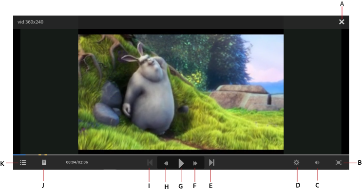

# Fluidic Player

In diesem Artikel finden Sie Informationen zur Verwendung des Fluidic Players für Kurse.

Der Fluidic Player ist eine Plattform für Teilnehmer, auf der sie Inhalte mit ununterbrochener und gemischter Lernerfahrung nutzen können. Alle unterstützten Formate werden in diesem Player konsistent wiedergegeben. Autoren und Administratoren können mit dem Player eine Vorschau der Inhalte abrufen.

## Player-Funktionen {#playerfeatures}

<!---->

**Inhaltsverzeichnis** - Während der Bearbeitung eines Kurses zeigt der Player ein Inhaltsverzeichnis für diesen Kurs im linken Fensterbereich an. Sie können auf jedes Thema klicken und direkt dorthin navigieren.

**Lesezeichen** - Wenn ein Kursmodul ein Modul-Inhaltsverzeichnis hat, können die Themen im Modul-Inhaltsverzeichnis mit einem Lesezeichen versehen werden, sodass später darauf verwiesen werden kann. Wenn Themen mit einem Lesezeichen versehen wurden, sehen Sie neben dem Eintrag im Inhaltsverzeichnis ein Sternsymbol. Lesezeichen können durch erneutes Klicken auf das Sternsymbol gelöscht werden.

**Anmerkungen** - Eine Anmerkungsfunktion ist während der Bearbeitung des Kurses verfügbar. Wenn Sie Anmerkungen aufgezeichnet haben, können Sie sie als PDF herunterladen oder per E-Mail an die E-Mail-IDs registrierter Teilnehmer schicken. Wenn Sie auf „Speichern“ klicken, können Sie den Speicherort für die PDF-Datei wählen.

*Kursnotizen erstellen*

**Untertitel** - Wenn während der Kursentwicklung die Untertitel für von Adobe Captivate entwickelte Kurse aktiviert sind, kann der Teilnehmer die Untertitel anzeigen. Klicken Sie auf „CC“ unten im Player.

**Kurs erneut aufrufen** - Sie können einen Kurs in zwei möglichen Szenarien in zwei Modi erneut aufrufen:

* Klicken Sie auf „Erneut aufrufen“ wenn sich der Kurs im Status „Abgeschlossen“ befindet.
* Klicken Sie auf „Fortfahren“ wenn der Kurs noch nicht abgeschlossen ist.

**Vollbild** Klicken Sie auf das Vollbild-Symbol in der unteren rechten Ecke des Players, um den Kurs auf dem Vollbildschirm anzuzeigen.

**Navigationsschaltflächen** Sie können auf die Pfeile nach oben/nach unten klicken, um im PDF-, DOCX- und PPTX-Format durch die Folien zu navigieren. Die Pfeile „Nächste Seite“ oder „Vorherige Seite“ können für alle Arten von Inhalt dazu verwendet werden, zum nächsten Thema zu navigieren.

**Vorspringen/Zurückspringen** Beim Abspielen eines Kurses können Sie mithilfe des Symbols  zehn Sekunden zurück- und mithilfe des Symbols  zehn Sekunden vorspringen.

**Ändern der Wiedergabegeschwindigkeit** Klicken Sie auf das -Symbol, um das Dialogfeld „Einstellungen“ zu öffnen. Ein Popupmenü mit der Meldung „Geschwindigkeit“ wird anzeigt. Klicken Sie auf „Geschwindigkeit“, um die fünf verfügbaren Geschwindigkeitseinstellungen anzuzeigen: 0.25x, 0.5x, 1x, 1.5x und 2x. 1x ist die normale Standard-Wiedergabegeschwindigkeit.

*Auswählen der richtigen Wiedergabegeschwindigkeit*

**Lautstärke-Einstellungen ändern:** Bei der Teilnahme an einem Kurs können Sie die Lautstärke über die Schaltfläche zur Lautstärkeregelung ändern. Ziehen Sie die Lautstärkeregelung nach oben oder nach unten, um die Lautstärke-Einstellungen zu ändern.

*Volume anpassen*

**Kurs schließen** Klicken Sie auf das Symbol zum Schließen (x) in der rechten oberen Ecke des Players, um den Kurs zu beenden.

Nach dem Beenden des Kurses können Sie den Kurs erneut aufrufen, indem Sie auf der Seite mit der Kursbeschreibung auf die Schaltfläche **Erneut aufrufen** / **Weiter** klicken.

Der Fluidic Player kann auch mithilfe der Learning Manager-API in eine externe Website oder Anwendung eingebettet werden.

Der mobile Fluidic Player verfügt über die folgenden Funktionen:

* Das Berühren oder Tippen des Bildschirms sollte den Player nicht anhalten. Stattdessen sollte die Navigationsleiste des Players geöffnet werden.
* Wenn mit der Navigationsleiste nicht interagiert wird, verschwindet sie nach 3 Sekunden.
* Die Navigationsleiste bleibt so lange aktiv, bis die Navigationsmenüelemente (Inhaltsverzeichnis, Hinweise, Einstellungen) geschlossen sind.
