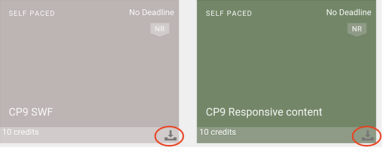

# Einstieg in Captivate Prime als Teilnehmer

Erste Schritte mit der Teilnehmer-App in Learning Manager.

Die Teilnehmer-App in Learning Manager basiert vollkommen auf Widgets, sodass Sie mit nur einem oder zwei Klicks zu den verschiedenen Funktionen wechseln können.

Nachdem Sie sich als Teilnehmer angemeldet haben, können Sie die folgenden Widgets auf der Startseite der Learning Manager-Webanwendung anzeigen:

**„Eigenes Lernen“**: Sie können die Lernobjekte nach Typ und nach Termin anzeigen und darauf klicken. Klicken Sie auf den Kreis in dem Widget „Eigenes Lernen“, um direkt zum Lernobjekttyp zu navigieren, oder um die Lernobjekte nach Termin anzuzeigen.

**Eigene Kenntnisse**:Sie können das Diagramm mit den Qualifikationen auch in der rechten oberen Ecke der Seite abrufen. Siehe  [Kenntnisdiagramm](skills-levels.md)finden Sie weitere Informationen.

**Lernobjekt-Widget**: Dies befindet sich rechts unterhalb von „Eigenes Lernen“ und es zeigt die Lernobjekte für den Benutzer an. Unter &quot;Eigenes Lernen&quot; können Sie alle [Kurse](courses.md), [Lernprogramme](learning-programs.md) und [Zertifizierungen](certifications.md) die von Ihnen registriert wurden oder Ihnen zugewiesen wurden. Sie können Lernobjekte direkt nutzen oder sie von diesem Widget aus verwenden.

**Lernkalender**: Dieses Widget zeigt eine Liste der bevorstehenden und geplanten Lernprogramme in Ihrem Unternehmen für jedes Quartals an. Der Registrierungsstatus ist „Registriert“, wenn Sie sich für einen bestimmten Kurs registriert haben.

**Empfohlene Lernprogramme**: In diesem Widget sehen Sie alle Kurse, die vom Administrator/Manager Ihres Unternehmens für Ihr Profil empfohlen werden. Sie können auf diese Links klicken, um zu den Kursseiten zu navigieren.

**Eigene Leistungen**: Sie erhalten Abzeichen, wenn Sie Kurse absolviert haben. Diese Abzeichen werden neben Ihrem Profil oben auf der Seite angezeigt. Klicken Sie auf „Abzeichen“, um genauere Informationen zu erhalten. Weitere Informationen zu Abzeichen finden Sie unter  [Ausweise](badges.md) Funktion.

Dieses Widget zeigt außerdem die Gamification-Punkte für den Benutzer an. Klicken Sie auf den Gamification-Link, um die detaillierten Punkte und andere Funktionen in Gamification anzuzeigen. Weitere Informationen zu Gamification-Punkten und dem Leaderboard finden Sie unter  [Gamification](gamification.md) Funktion.

Wenn Sie mit einem iPad- oder Android-Tablet auf Learning Manager zugreifen, lesen Sie die Themen zu iPad- oder Android-Tablet-Apps unten auf dieser Seite.

## Lernzeitleiste {#learningtimeline}

Die Lernzeitleiste zeigt den Zeitplan des Teilnehmers mit den Kursen, die er zu absolvieren hat. In diesem Bereich sehen Sie Alarme für all Ihre Kurse, Zertifizierungen und Lernprogramme in ansteigender Reihenfolge der Fristen. Die Fristen für Ihre Lernaktivitäten werden im linken Bereich angezeigt.

Klicken Sie bei den Lernobjekten auf die linke Kachel, um die entsprechenden Informationen als Kurskarte im rechten Bereich aufzurufen. Sie können auf die Kachel &quot;Kurs/Lernprogramm/Zertifizierung&quot; klicken, um die vollständigen Informationen zu jedem Lernobjekt anzuzeigen.

Bewegen Sie die Maus auf den Bereich der Zeitleiste, um die Bildlaufleiste auf der rechten Seite zu sehen. Verwenden Sie die Bildlaufleiste, um sich nach oben oder unten zu bewegen und mehr Alarme zu sehen.

## Benutzer der iPad- und Android-Anwendung {#ipadandandroidappusers}

In der Learning Manager-App auf iPad- oder Android-Tablet können Sie, nachdem Sie sich als Teilnehmer angemeldet haben, die Informationen wie folgt auf der Registerkarte &quot;Startseite&quot; sehen:

Um zu den Lern- und Katalogfunktionen zu navigieren, tippen Sie auf das **Menü** &quot; und wählen Sie die entsprechende Option aus.

### Offline auf die App zugreifen

Sie können auf iPad- und Android-Tablets auch offline auf die Learning Manager-App zugreifen. Laden Sie Kurse herunter und bearbeiten Sie sie im Offlinemodus. Wenn Sie wieder mit dem Netzwerk verbunden sind, synchronisieren Sie sie mit der Online-App.

1. Tippen Sie oben auf das Dropdown-Menü und dann auf die Option Lernen . Eine Liste aller verfügbaren Kurse wird in Form von Kacheln angezeigt.
1. Tippen Sie auf das Download-Symbol unten auf jeder Lernobjekt-Kachel, um die Lerninhalte herunterzuladen.

   

1. Wenn Sie online sind, wird am oberen Rand der App in einer Leiste eine Eingabeaufforderung angezeigt und nachgefragt, ob Sie Ihre Inhalte online synchronisieren möchten. Tippen Sie auf die rote Leiste, wenn Ihre Antwort „Ja“ ist. Eine grüne Leiste zeigt an, dass Ihr Inhalt mit der Online-App synchron ist.

**Gerätespeicher verfolgen**

Sie können Ihren Gerätespeicher regelmäßig überprüfen.\
Tippen Sie auf das Profilsymbol in der rechten oberen Ecke der App und tippen Sie auf **Gerätespeicher** aus.

Das folgende Dialogfeld mit Informationen zum App-Speicher wird angezeigt.

Anhand der Informationen zum App-Speicher können Sie den gesamten Speicher des Geräts, der App und der heruntergeladenen Kurse überprüfen. Mit diesen Informationen können Sie Kurse entsprechend herunterladen. Um heruntergeladene Kurse vom Gerät zu löschen, tippen Sie neben dem entsprechenden Kursnamen auf das X-Symbol.
