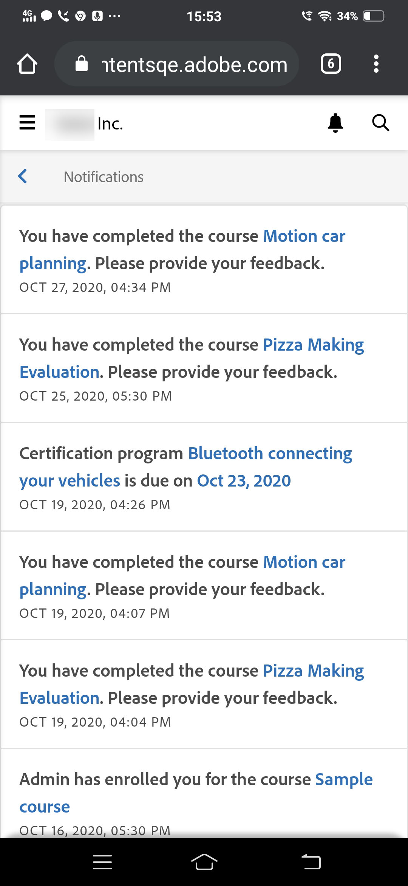
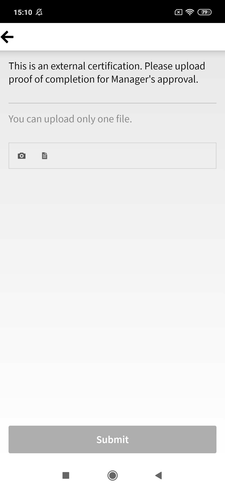

# Teilnehmer-App für Smartphones und Tablets

In diesem Artikel finden Sie Informationen zum Herunterladen der Learning Manager-App für Teilnehmende für Smartphones und Tablets. Erfahren Sie, wie Sie Kurse auf Ihrem Smartphone oder Tablet absolvieren können.

## Übersicht {#overview}

Die Learning Manager-App für Teilnehmer ist sowohl für Android-Smartphones als auch für iPhones erhältlich. Laden Sie die Learning Manager-App aus dem Google Play Store (Android OS) bzw. von iTunes (macOS) herunter.

Nach dem Herunterladen und Installieren dieser App können Sie sich mit Ihren Teilnehmer-Anmeldedaten anmelden. Wenn du die Mobile App von Learning Manager öffnest, wird standardmäßig der folgende Bildschirm angezeigt.

*Die Homepage der Learning Manager-App*

## Startseite {#homepage}

Für alle Konten, die die Option &quot;Immersives Layout&quot; aktiviert haben, gibt es eine brandneue Homepage, die die Konfiguration immersiver Layouts unterstützt. Die Homepage ist als Kartenliste für die folgenden Themen geordnet:

|  |  |
|---|---|
|  |  |

*Liste der Karten auf der Homepage*

*Social-Feed des Teilnehmers*

## Feedback-Bewertung {#feedbackrating}

Learning Manager fordert den Teilnehmer auf, Feedback zu seiner Erfahrung mit der Mobilanwendung abzugeben. Dieses Feedback wird einmal im Monat angezeigt und bietet genügend Zeit, damit Benutzer die App erleben und dann feedback geben können.

<!--
|  | |
|---|---|
-->

Bestehende Anwender sollten das Feedback-Popup sehen, sobald sie den Player nach dem Aktualisieren der App auf die neueste Version zum ersten Mal schließen.

Hinweis: Die Erfassung von Feedback ist anonym und wird nur für Benutzer angezeigt, die die Option **Nutzungsdaten** über eine Konfiguration in den App-Einstellungen freigeben aktiviert haben.

## Abzeichen herunterladen {#downloadbadge}

Teilnehmer können ihre Abzeichen im PDF- und Bildformat herunterladen. Scrolle im Profilbereich &quot;Benutzer&quot; nach unten, und klicke auf einen Link, um ein Abzeichen herunterzuladen. Das heruntergeladene Abzeichen wird im Standard-Geräteordner gespeichert. Mit der App kannst du den Ordner oder die Datei unmittelbar nach dem Download öffnen.

|  |
|---|

*Abzeichen herunterladen*

## Layout mit automatischer Anpassung für Mobilgeräte {#responsive}

Ein vollständig responsives Mobile-Web-Erlebnis, das sicherstellt, dass Teilnehmer ihre Geräte nutzen, um Schulungen zu absolvieren, selbst wenn sie die Mobile App nicht installiert haben.

Wenn Sie sich zum ersten Mal über den Browser auf Ihrem Gerät bei der Teilnehmer-App anmelden, wird die Teilnehmer-App in Form eines für Mobilgeräte geeigneten Layouts mit automatischer Anpassung angezeigt.

Die Benutzeroberfläche mit automatischer Anpassung für Mobilgeräte ist nur verfügbar, wenn ein Konto **nur für immersive Layouts konfiguriert ist**. Die Benutzeroberfläche mit automatischer Anpassung ist **nicht für das klassische Layout** verfügbar.

<!--
<table>
 <tbody>
  <tr>
   <td>
    
<strong>Home page</strong>

    
<strong>View options</strong>

    
<strong>Start course</strong>
</td>
   <td>
    
<strong>My Learning List</strong>

    
<strong>View catalog</strong>

    
<strong>Apply filters</strong>
</td>
   <td>
    
<strong>Recommendations based on interest</strong>

    
<strong>View notifications</strong>

    
<strong>Share url</strong>
</td>
  </tr>
 </tbody>
</table>
-->

## Aufforderung zum Herunterladen im ALM-Web

Wenn Anwender einen ALM-Link öffnen oder das ALM-Web auf ihren Mobilgeräten nutzen, sollten sie aufgefordert werden, die App herunterzuladen, um ein besseres Erlebnis zu bieten.

_ALM-App herunterladen_

## In immersiven Mobilgeräte-Benutzeroberflächen nicht unterstützte Funktionen {#unsupportedfeaturesinmobileimmersiveexperience}

Die folgenden Arbeitsabläufe werden in der klassischen Benutzeroberflächen für einen Teilnehmer angezeigt:

* Mehrere Versuche
* Flexi-LP
* Dateiuploadszenarien
* L1-Feedback geben

Andere App-Funktionen, die nicht unterstützt werden:

* Sozial-App: Ein Teilnehmer wird zur klassischen Benutzeroberfläche umgeleitet, wenn er auf der Startseite auf das Sozial-Widget klickt
* Profileinstellungen/Profil bearbeiten
* Abzeichen/Kenntnisse anzeigen
* Leaderboard: Ein Teilnehmer wird zur klassischen Benutzeroberfläche umgeleitet, wenn er auf der Startseite auf das Leaderboard-Widget klickt
* Arbeitshilfen werden heruntergeladen.
* Filteroptionen in der Suche.

Social Learning unterstützt jetzt immersive Web-Erlebnisse für Mobilgeräte.

Es gibt einige Funktionen, die von der Mobile Immersive App nicht unterstützt werden. Dies sind:

| **Fläche** | **Nicht unterstützt** |
|---|---|
| Board | Vorstandserstellung, Vorstandsbearbeitung, Text URL, Löschen, Bericht, Sortieren, Filter |
| Veröffentlichen | Erstellung von Abstimmungstypen, Bearbeiten, Mehrere Anhänge, URL kopieren, nach oben anheften |
| Kommentieren/Antworten | Bearbeiten, Als antworte rechts markieren, Bild/Video/Audio als Kommentar oder Antwort hochladen |
| Medien | Audio erfassen; nur Hochladen von Audiodateien |
| Sonstiges | Benachrichtigungen, Beitragsansicht, Soziale Rangliste, Personen, denen ich folge, Benutzerprofil |

## Teilnehmern das Herunterladen der Arbeitshilfe ermöglichen {#download-job-aid}

Im immersiven Modus für Mobilgeräte kann ein Teilnehmer eine Arbeitshilfe herunterladen. Tippe auf **&quot;Einstellungen&quot;** und dann auf &quot;Kataloge **&quot;**. Lade eine Arbeitshilfe von der angezeigten Liste herunter.

|  |
|---|

*Job Aid herunterladen*

## Teilnehmern das Herunterladen des Teilnehmertranskripts ermöglichen {#download-learner-transcript}

Im immersiven Mobile-Modus können Teilnehmer die Teilnehmerprotokolle herunterladen.

|  |  |
|---|---|

*Teilnehmerprotokolle herunterladen*

## Abzeichen und Kenntnisse anzeigen {#viewbadgesandskills}

**Anzeigen von Abzeichen, Kenntnisseen und Gamification-Punkten**

Der Standardbildschirm zeigt Ihre kürzlich erreichten Abzeichen, Fertigkeiten und Gamification-Punkte direkt unter Ihren Profilinformationen an. Auf einem Mobiltelefon werden die kürzlich erreichten Abzeichen angezeigt. Streichen Sie nach rechts, um weitere Informationen anzuzeigen.

**Eigenes ausstehendes Lernen**

Auf dem Bildschirm werden standardmäßig die Kurse angezeigt, für die Sie registriert sind. Das Kreisdiagramm zeigt die überfällige Lernaktivität, die Lernaktivitäten kurz vor dem Abgabetermin und fristgemäßen Lernaktivitäten.

Tippen Sie auf einen Kurs, um dessen Details sowie (falls zutreffend) Ihr Abschlussdatum anzuzeigen. Vor diesem Bildschirm aus können Sie entweder fortfahren oder einen Kurs erneut aufrufen, je nach Abschlussstatus.

*Ausstehende Schulungen anzeigen*

**Anzeigen von Katalogen**

Tippen Sie unten auf dem Bildschirm auf das Symbol neben dem Buchsymbol. Sie können sofort den Katalog mit allen zugeordneten Lernobjekten anzeigen. Du kannst sie im Raster-Layout anzeigen oder die Detailansicht auswählen. Wählt Empfehlungen aus, um Kursempfehlungen basierend auf eurem Lernverlauf einsehen zu können.

*Kursempfehlungen anzeigen*

## Sortieren und Filtern von Lernobjekten {#sortandfilterlearningobjects}

**Sortieren und Filtern**

Klicken Sie in der rechten oberen Ecke des Kurse- oder Katalogbildschirms auf das Sortiersymbol, um die Lernobjekte alphabetisch (in aufsteigender oder absteigender Reihenfolge) oder nach Veröffentlichungsdatum zu sortieren. Außerdem können Sie die Lernobjekte nach Typ, Abschlussstatus oder Kenntnissen sowie nach Tags filtern. Tippen Sie auf den Filter, um ihn auszuwählen, und tippen Sie auf „Anwenden“, um ihn anzuwenden.

**Verwenden der Suchfunktion**

Oben rechts auf dem Bildschirm sehen Sie ein Suchsymbol. Tippen Sie auf dieses Symbol, um nach Lernobjekten zu suchen und dabei Kurs-Metadaten, eindeutige ID, Kenntnisse usw. als Kriterien zu verwenden.

**Verwalten von Profil, Einstellungen und Benachrichtigung**

Tippe  oben links auf das Menü, um dein Profil, deine Benachrichtigungen und Kontoeinstellungen anzuzeigen.

In diesem Menü können Sie außerdem den QR-Code scannen, um Ihre Teilnahme an Kursen zu vermerken.

Tippe einfach auf die **Option &quot;QR-Code** scannen&quot; und scanne den Code.

**Offline-Nutzung von Kursen**

Wenn ihr während des Online-Geschäfts heruntergeladene Kurse konsumiert, greift Learning Manager auf den heruntergeladenen Kurs zu, anstatt Server-Aufrufe zu tätigen.

## QR-Code zum Registrieren scannen {#qrcode}

Sie können einen QR-Code scannen und sich für einen Kurs anmelden. Nachdem der Lern-Administrator einen QR-Code generiert hat, können Sie den QR-Code aus der App scannen und sich für einen Kurs anmelden. 

1. Tippe oben links auf den Bildschirm,  um den QR-Code einzuscannen.
1. Tippen Sie auf **QR-Code scannen**.

Die Scan-QR-Funktion ermöglicht es einem Teilnehmer, eine der unten genannten Aktionen durchzuführen, abhängig vom QR-Code, der vom Lern-Administrator generiert wird:

* **Anmeldung:** Dadurch kann sich der Teilnehmer durch Scannen des QR-Codes für einen Kurs anmelden.
* **Abschluss:** Auf diese Weise kann der Teilnehmer die Schulung durch Scannen des QR-Codes als abgeschlossen markieren.
* **Registrierung und Abschluss:** Dies ermöglicht es dem Teilnehmer, sich anzumelden und gleichzeitig den Abschluss zu markieren, indem er den QR-Code scannt.
* **Teilnahme markieren:** Die Teilnehmer können die Teilnahme an einer bestimmten Session durch Scannen des QR-Codes markieren.

## Umbenennen von Lernobjekten {#renaminglearningobjects}

Administratoren können die Terminologie von Lernobjekten umbenennen. Informationen zum Umbenennen finden Sie unter [Lernobjekte umbenennen](../../administrators/feature-summary/settings.md#main-pars_header_1570157145).

## Soziales Lernen {#socialmobile}

In diesem Update werden die folgenden Funktionen nicht unterstützt. Folgendes ist nicht möglich:

* ein Board erstellen oder einem Board folgen
* eine URL in einen Beitrag kopieren
* Füge Post als Story hinzu, oder füge sie als Favoriten hinzu, oder füge sie als Pin nach oben hinzu.
* Social Leader Board ansehen.

Soziales Lernen ist eine Plattform in der Learning Manager-App, auf der Benutzer Ideen und wichtige Erkenntnisse in einer informellen Umgebung austauschen können. Es ist eine Methodik, die die Idee des traditionellen Lernens ergänzt.

Mithilfe des Sozialen Lernens können Benutzer das Fachwissen in ihrer Umgebung nutzen, um korrekte und präzise Informationen zu erhalten. Teilnehmer können diese Informationen schnell anwenden, um eine Aufgabe abzuschließen und ein Ziel zu erreichen.

Mithilfe der mobilen App können Benutzer miteinander interagieren, indem sie Inhalte freigeben und eine Validierung für die freigegebenen Inhalte erhalten.

Auf dieser Plattform können verschiedene Inhalte geteilt werden: Video, Audio, Screenshot, Text, Frage und Umfrage. Benutzer können ihre Online-Lernergebnisse auch mit ihren teilen.

Diese Funktion ist nur in der Geräte-App verfügbar, wenn der **Administrator das Soziale Lernen für das Konto** aktiviert hat.

## Starten Sie Soziales Lernen auf der App {#launchsociallearningontheapp}

Tippen Sie beim Starten der App auf das Symbol **Sozial**.

*Social Learning ansehen*

## Erstellen Sie einen Beitrag in einem Board {#createapostinaboard}

Wie bei jeder anderen sozialen Plattform können Sie in der mobilen Learning Manager-App einen Beitrag in einem Forum erstellen, sodass alle Teilnehmenden, die Teil desselben Forums sind, Ihren Beitrag anzeigen, kommentieren und eine Datei zusammen mit dem Kommentar hochladen können.

Tippe rechts unten auf das  zum Hinzufügen, um einen Post zu erstellen.

Der folgende Bildschirm wird angezeigt:

*Post hinzufügen*

<table>
 <tbody>
  <tr>
   <td>
    

</td>
   <td>
    
Schreiben Sie einen Beitrag oder fügen Sie eine beliebige URL ein.
</td>
  </tr>
  <tr>
   <td>
    

</td>
   <td>
    
Machen Sie ein Foto mit Ihrer Handy-Kamera und laden Sie es mit Ihrem Beitrag hoch.
</td>
  </tr>
  <tr>
   <td>
    

</td>
   <td>
    
Nehmen Sie ein Video mit Ihrer Handy-Kamera auf.
</td>
  </tr>
  <tr>
   <td>
    
 
</td>
   <td>
    
Nehmen Sie Audio mit Ihrem Handy auf.
</td>
  </tr>
  <tr>
   <td>
    

</td>
   <td>
    
Laden Sie ein Dokument oder eine Datei auf das Board hoch.
</td>
  </tr>
  <tr>
   <td>
    
 
</td>
   <td>
    
Frage stellen
</td>
  </tr>
  <tr>
   <td>
    
 
</td>
   <td>
    
Umfrage mit deinem Beitrag erstellen.
</td>
  </tr>
 </tbody>
</table>

## Unterstütztes Inhaltsformat {#supportedcontentformat}

<table>
 <tbody>
  <tr>
   <td>
    
<strong>Inhaltstyp</strong>
</td>
   <td>
    
<strong>Erweiterungen</strong>
</td>
  </tr>
  <tr>
   <td>
    
Video
</td>
   <td>
    
wmv, f4v, asf, 3gp, 3g2, avi, mov, h264, m4v, mp4, MPEG, mpg
</td>
  </tr>
  <tr>
   <td>
    
Audio
</td>
   <td>
    
mp3, amr, m4a, wav, wma, aac
</td>
  </tr>
  <tr>
   <td>
    
Statische Dateien
</td>
   <td>
    
PDF, ppt, pptx, doc, docx, xls, xlsx
</td>
  </tr>
  <tr>
   <td>
    
Bild
</td>
   <td>
    
jpg, jpeg, png, bmp, gif
</td>
  </tr>
 </tbody>
</table>

Wählen Sie nach dem Erstellen eines Beitrags das Forum aus, in das Sie den Beitrag hochladen möchten. Tippen Sie auf „Board auswählen“ und suchen Sie nach dem gewünschten Board.

Nachdem du einen Beitrag erstellt hast, tippe auf &quot;Posten&quot; und poste deinen Kommentar, damit andere Teilnehmer deinen Beitrag anzeigen können.

In der mobilen App können Sie kein Board erstellen. Um ein Board zu erstellen, müssen Sie sich als Teilnehmer bei der Web-App anmelden. Weitere Informationen zum Sozialen Lernen in Learning Manager finden Sie unter [Learning Manager](/help/migrated/learners/feature-summary/social-learning-web-user.md).

## Aktionen, die für einen Beitrag ausgeführt werden können {#actionsthatcanbeperformedonapost}

* Kommentieren Sie einen Beitrag und zeigen Sie ihn basierend auf den Berechtigungen in einem Board an.
* Kommentare in einem Board bearbeiten oder löschen.
* Bearbeiten oder löschen Sie einen Beitrag basierend auf Berechtigungen.
* Melde Sie einen Missbrauch eines Beitrags, wenn er gegen die Privatsphäre verstößt oder sein Inhalt unangemessen ist. Sobald ein Beitrag gemeldet wurde, wird eine Benachrichtigung an den Board-Administrator und die Moderatoren für weitere Aktionen gesendet.
* Post    mag oder magst du nicht     .
* Kommentare   mögen oder missfallen  .

## Erstellen Sie einen Beitrag in anderen Boards {#createapostinotherboards}

Sie können auch einen Beitrag in anderen Boards erstellen.

Tippen Sie auf **Alle Boards** und Sie können die Aktivitäten anderer Teilnehmer im Board sehen.

*Alle Vorstandsaktivitäten anzeigen*

Navigieren Sie zum gewünschten Board und veröffentlichen Sie Ihren Kommentar.

## Medien auf einem Board teilen {#sharemedia}

<!---->

Teilen Sie Bilder, Dokumente oder Audio- oder Videodateien auf einem beliebigen Board, damit andere Board-Mitglieder Ihren Beitrag sehen und eine Interaktion starten können. Teilen von Medien:

1. Öffne die Medien, die du teilen möchtest.
1. Tippe auf den Freigabe-Button, und wähle &quot;Learning Manager&quot;.
1. Wähle den Vorstand aus, in dem du die Medien teilen möchtest.
1. Tippe auf **&quot;Posten&quot;**.

Sie können auch Inhalte aus einer externen App veröffentlichen. Sie können beispielsweise einen Kommentar von Reddit oder Quora teilen.

## Laden Sie Assets in externes Zertifikat als Nachweis der Fertigstellung {#externalcert}

Führen Sie die unten genannten Schritte aus: 

1. Melden Sie sich mit Ihren Teilnehmerdetails bei der Geräte-App an.
1. Suchen Sie nach dem Zertifikat, das der Autor erstellt hat.
1. Wählen Sie aus der Liste der externen Zertifikate das gewünschte Zertifikat aus und registrieren Sie sich für das Zertifikat.
1. Tippe auf **&quot;Abschlussnachweis&quot;** , und lade eine Datei hoch, z. B. eine PDF-Datei oder ein Bild.

   |  |  |
   |---|---|

*Nachweis der Fertigstellung hochladen*

1. Nach dem Hochladen einer Datei, tippen Sie auf **Einreichen**. Eine Bestätigungsnachricht erscheint.

**Hochladen einer Datei**

1. Nachdem Sie eine Datei hochgeladen haben, tippen Sie auf **Senden**.

   Sie können nur eine Datei hochladen. Wenn Sie versuchen, mehrere Dateien hochzuladen, wird die folgende Meldung angezeigt:

   **Die von Ihnen vorgenommenen Änderungen gehen verloren. Möchten Sie fortfahren?**

1. Der Status ändert sich in **Ausstehende Genehmigung** und wird in Orange angezeigt.

   Sie können die hochgeladene Datei nicht in der mobilen App anzeigen oder herunterladen.

Nachdem der Manager die Übermittlung genehmigt hat, ändert sich der Status in **Genehmigt** und wird grün.

Wenn der Manager die Übermittlung ablehnt, ändert sich der Status in **Abgelehnt** und wird rot markiert.

|  |  |  |
|---|---|---|

*Bewerbungsstatus anzeigen*

Nach der Ablehnung können Sie eine Datei als Nachweis der Fertigstellung hochladen.

* Du kannst eine Datei nur einreichen, wenn der Status &quot;Ausstehender Antrag auf Einreichung&quot; und &quot;Abgelehnt&quot; lautet ****.
* Du kannst keine Datei einreichen, wenn der Status &quot;Ausstehend&quot; und &quot;Genehmigt&quot;**ist**.

## Aufrufen von Kursen aus LinkedIn Learning {#linkedin}

Learning Manager unterstützt bereits LinkedIn Learning-Kurse innerhalb der Lernplattform. Jetzt können Teilnehmer solche LinkedIn Learning-Kurse in der mobilen Learning Manager-App absolvieren. Suchen Sie in der Geräte-App nach einem Kurs und starten Sie ihn.

Wenn Sie die LinkedIn-App bereits installiert haben, wird der Kurs in der App geöffnet. Andernfalls wird der Kurs im Standardbrowser geöffnet, in dem Sie sich mit Ihren LinkedIn-Anmeldedaten anmelden müssen.

Wenn du den Kurs über die LinkedIn-App teilnehmst, wird dein Fortschritt nicht in Learning Manager verfolgt. Daher wird empfohlen, den Kurs im Browser anstelle der LinkedIn Lern-App zu starten.

>[!NOTE]
>
>Sie können die Kurse nur mit einer aktiven Internet-Verbindung absolvieren.

|  |  |  |
|---|---|---|

*Kurse für LinkedIn Learning anmelden*

Die in LinkedIn-Lernkursen verbrachte Lernzeit wird von der LinkedIn-Plattform content/LinkedIn an die Learning Manager-Lernplattform übermittelt.

Wenn LinkedIn Learning die Lernzeit nicht sendet, kann sie nicht von unserer Lernplattform aufgezeichnet werden. In einem solchen Fall ist die von Learning Manager verbrachte Lernzeit null.

## Datei für Unterrichts- und Aktivitätsmodule einreichen {#submitfile}

Als Teilnehmer können Sie Ihrem Kursleiter Dateien als Nachweis für die Vervollständigung des Kurses senden. Der Kursleiter kann dann Ihre Einreichung basierend auf dem Inhalt der Datei genehmigen oder ablehnen.

Ein Autor kann nur Unterrichts- und Aktivitätsmodule erstellen, die ein Teilnehmer in der Mobile App verwenden kann.

NachDem der Teilnehmer einen Kurs begonnen hat, kann der Teilnehmer den Status **&quot;Einreichung** von Dateien&quot; sowie den Link zum Hochladen der Datei auf dem Bildschirm sehen, wie im unten stehenden Screenshot zu sehen.

*Status der Einreichung von Dateien*

Klicken Sie zum Hochladen der Datei auf **Datei hochladen**.

Lade eine beliebige Datei hoch, und klicke auf &quot; **Absenden** &quot;.

 

*Datei einreichen*

## Unterstützte Dateitypen für den Upload {#supportedfiletypesforupload}

<table>
 <tbody>
  <tr>
   <td>
    
<b>Inhaltstyp</b>
</td>
   <td>
    
<b>Erweiterungen</b>
</td>
  </tr>
  <tr>
   <td>
    
Video
</td>
   <td>
    
wmv, f4v, asf, 3gp, 3g2, avi, mov, h264, m4v, mp4, MPEG, mpg
</td>
  </tr>
  <tr>
   <td>
    
Audio
</td>
   <td>
    
mp3, amr, m4a, wav, wma, aac
</td>
  </tr>
  <tr>
   <td>
    
Statische Dateien
</td>
   <td>
    
PDF, ppt, pptx, doc, docx, xls, xlsx
</td>
  </tr>
  <tr>
   <td>
    
Bild
</td>
   <td>
    
jpg, jpeg, png, bmp, gif
</td>
  </tr>
 </tbody>
</table>

## Genehmigung oder Ablehnung der Einreichung {#approvalorrejectionofsubmission}

Nachdem du die Datei hochgeladen hast, ändert sich der Status in &quot; **Ausstehende Genehmigung&quot;.**. Der Kursleiter betrachtet dann die Liste [der ausstehenden Anträge](/help/migrated/instructors/feature-summary/learners.md) und genehmigt oder weist den Antrag über die Web-App des Instructors ab.

Wenn der Kursleiter die Einreichung genehmigt, ändert sich der Status in der Teilnehmer-Mobilanwendung in **Genehmigt**.

<!---->

Wenn der Kursleiter die Bewerbung abweist, ändert sich der Status der Teilnehmer-App in **&quot;Abgelehnt**&quot;.

<!---->

Um die Datei erneut zu senden, klicken Sie auf den Link **Datei hochladen**.

## Learning Manager für iPad und Tablets {#captivateforipadandtablets}

In der Learning Manager-App auf dem iPad oder dem Android-Tablet kannst du nach der Anmeldung als Teilnehmer den folgenden **Startbildschirm** anzeigen:

<!---->

Um zu den Lern- und Katalogfunktionen zu navigieren, tippe auf das **** Dropdown-Menü, und wähle die passende Option aus.

<!---->

Sie haben die Möglichkeit, einen Satz von Kursen in einer Listenansicht anstatt einer Kachel-/Kartenansicht anzuzeigen.

## Offline auf die App zugreifen {#accesstheappoffline}

Sie können auf iPad- und Android-Tablets auch offline auf die Learning Manager-App zugreifen. Sie können Kurse und Lernprogramme herunterladen. Nehmen Sie an Kursen teil, absolvieren Sie die Lernprogramme im Offlinemodus und synchronisieren Sie den Inhalt mit der Online-App, wenn Sie eine Verbindung mit dem Netzwerk herstellen.

1. Tippe **oben auf &quot;Menü** &quot;, und tippe auf **&quot;Lernen** &quot;. Eine Liste aller verfügbaren Kurse wird in Form von Kacheln angezeigt.
1. Tippen Sie auf das Download-Symbol unten auf jeder Lernobjekt-Kachel, um die Lerninhalte herunterzuladen.

   

   *Inhalte herunterladen*

   Am oberen Rand der App wird in einer Leiste eine Eingabeaufforderung mit dem Netzwerkstatus des Geräts angezeigt.

   * Der rote Balken zeigt an, dass das Netzwerk für das Gerät nicht verfügbar ist.
   * Die grüne Leiste gibt an, dass das Netzwerk wieder online ist.

Der Anwender kann zum Online-Modus zurückkehren, indem er auf die Schaltfläche &quot;Online-Inhalte **anzeigen&quot; auf der grünen Leiste klickt**. Die Inhalte im Gerät werden synchronisiert, wenn der Anwender in den Online-Modus wechselt.

## Multi-Item-Warenkorb-Unterstützung auf Mobilgeräten

Teilnehmer können nun mehrere Kurse, Lernpfade oder Zertifizierungen in den Warenkorb legen und sie gemeinsam erwerben. Warenkorb mit mehreren Artikeln in ALM anzeigen 

<!--## Track device storage {#trackdevicestorage}

You can monitor your device storage periodically.

Tap the profile icon at the upper-right corner of the app and tap **Device Storage** menu option.

An app storage information dialog appears as shown below.

Using the app storage information, you can check the total space of device, app and the downloaded courses. This information enables you to download courses accordingly. To delete the downloaded courses in the device, tap delete icon adjacent to each course name.-->
