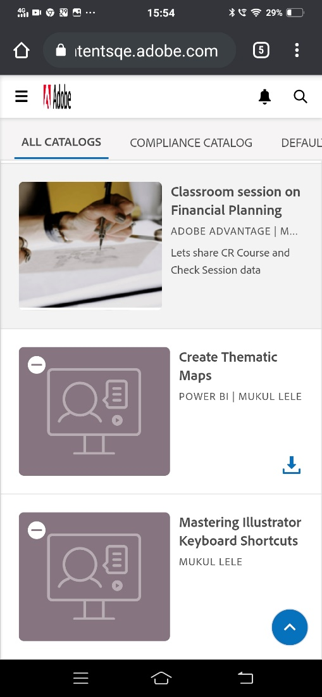
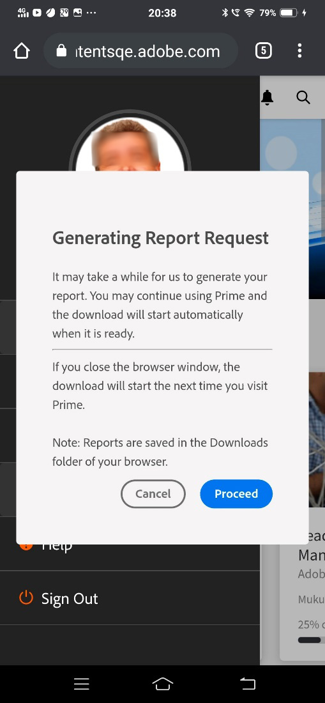
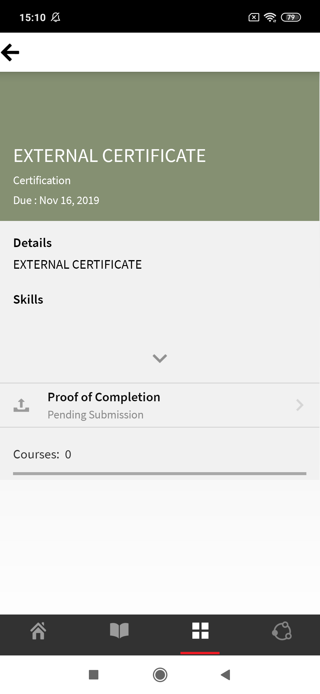
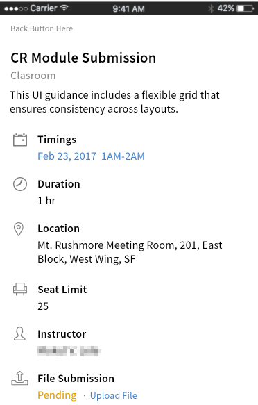
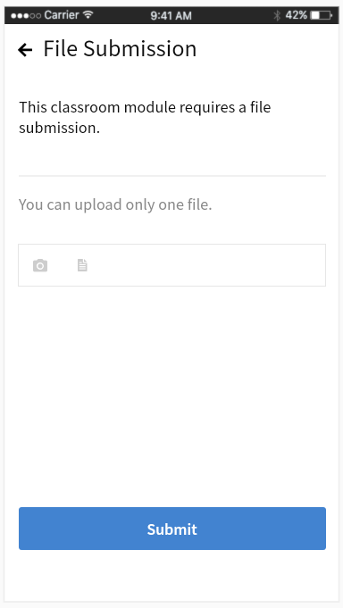
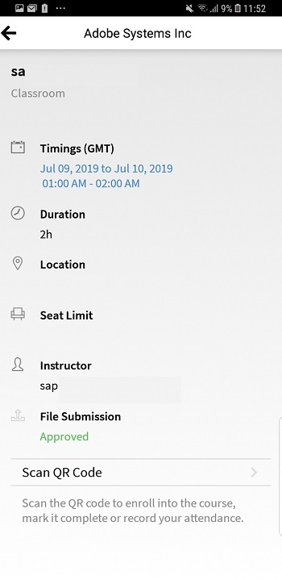

# Teilnehmer-App für Smartphones und Tablets

In diesem Artikel finden Sie Informationen zum Herunterladen der Learning Manager-App für Teilnehmende für Smartphones und Tablets. Erfahren Sie, wie Sie Kurse auf Ihrem Smartphone oder Tablet absolvieren können.

## Übersicht {#overview}

Die Learning Manager-App für Teilnehmer ist sowohl für Android-Smartphones als auch für iPhones erhältlich. Laden Sie die Learning Manager-App aus dem Google Play Store (Android OS) bzw. von iTunes (macOS) herunter.

Nach dem Herunterladen und Installieren dieser App können Sie sich mit Ihren Teilnehmer-Anmeldedaten anmelden. Wenn Sie die mobile Learning Manager-App öffnen, wird standardmäßig der folgende Bildschirm angezeigt.

*Die Startseite der Learning Manager-App*

## Startseite {#homepage}

Für alle Konten, für die die Option &quot;Immersives Layout&quot; aktiviert ist, gibt es eine brandneue Startseite, auf der die Konfiguration des immersiven Layouts unterstützt wird. Die Startseite ist als eine Liste mit Karten für Folgendes angeordnet:

|  |  |
|---|---|
|  |  |

*Liste der Karten auf der Startseite*

*Sozialer Feed des Teilnehmers*

## Feedback-Bewertung {#feedbackrating}

Learning Manager fordert den Teilnehmer auf, Feedback zu seiner Erfahrung mit der Mobilanwendung abzugeben. Dieses Feedback erscheint einmal im Monat und gibt Benutzern genügend Zeit, Erfahrungen mit der App zu sammeln und anschließend Feedback zu geben.

<!--
|  | |
|---|---|
-->

Bei vorhandenen Benutzern wird das Popup-Fenster für Feedback angezeigt, sobald sie den Player nach der Aktualisierung der App auf die neueste Version zum ersten Mal schließen.

Beachten Sie, dass die Feedbacksammlung anonym ist und nur für Benutzer angezeigt wird, die die Option **Nutzungsdaten freigeben** über eine Konfiguration in den App-Einstellungen aktiviert haben.

## Abzeichen herunterladen {#downloadbadge}

Teilnehmer können ihre Abzeichen im PDF- und Bildformat herunterladen. Scrollen Sie im Abschnitt Benutzerprofil nach unten und klicken Sie auf einen beliebigen Link, um ein Abzeichen herunterzuladen. Das heruntergeladene Abzeichen wird im Ordner des Standardgeräts gespeichert. Mit der App können Sie den Ordner oder die Datei direkt nach Abschluss des Downloads öffnen.

|  |
|---|

*Abzeichen herunterladen*

## Layout mit automatischer Anpassung für Mobilgeräte {#responsive}

Eine Mobilgerät-Benutzererfahrung mit vollständiger automatischer Anpassung, die sicherstellt, dass Teilnehmer ihre Geräte verwenden, um Schulungen selbst dann zu nutzen, wenn sie die mobile App nicht installiert haben.

Wenn Sie sich zum ersten Mal über den Browser auf Ihrem Gerät bei der Teilnehmer-App anmelden, wird die Teilnehmer-App in Form eines für Mobilgeräte geeigneten Layouts mit automatischer Anpassung angezeigt.

Die Benutzeroberfläche mit automatischer Anpassung für Mobilgeräte ist nur verfügbar, wenn ein Konto **nur für immersive Layouts konfiguriert ist**. Die Benutzeroberfläche mit automatischer Anpassung ist **nicht für das klassische Layout** verfügbar.

<!--
<table>
 <tbody>
  <tr>
   <td>
    
<strong>Home page</strong>

    
<strong>View options</strong>

    
<strong>Start course</strong>
</td>
   <td>
    
<strong>My Learning List</strong>

    
<strong>View catalog</strong>

    
<strong>Apply filters</strong>
</td>
   <td>
    
<strong>Recommendations based on interest</strong>

    
<strong>View notifications</strong>

    
<strong>Share url</strong>
</td>
  </tr>
 </tbody>
</table>
-->

## Download-Eingabeaufforderung in ALM-Web

Wenn Benutzer einen ALM-Link öffnen oder das ALM-Web auf ihren Mobilgeräten verwenden, sollten sie eine Eingabeaufforderung sehen, die App herunterzuladen, damit sie das Erlebnis besser nutzen können.

_ALM-App herunterladen_

## In immersiven Mobilgeräte-Benutzeroberflächen nicht unterstützte Funktionen {#unsupportedfeaturesinmobileimmersiveexperience}

Die folgenden Arbeitsabläufe werden in der klassischen Benutzeroberflächen für einen Teilnehmer angezeigt:

* Mehrere Versuche
* Flexi-LP
* Dateiuploadszenarien
* L1-Feedback geben

Andere App-Funktionen, die nicht unterstützt werden:

* Sozial-App: Ein Teilnehmer wird zur klassischen Benutzeroberfläche umgeleitet, wenn er auf der Startseite auf das Sozial-Widget klickt
* Profileinstellungen/Profil bearbeiten
* Abzeichen/Kenntnisse anzeigen
* Leaderboard: Ein Teilnehmer wird zur klassischen Benutzeroberfläche umgeleitet, wenn er auf der Startseite auf das Leaderboard-Widget klickt
* Arbeitshilfen werden heruntergeladen.
* Filteroptionen in der Suche.

Social Learning unterstützt jetzt immersive Web-Erlebnisse für Mobilgeräte.

Es gibt einige Funktionen, die von der Mobile Immersive App nicht unterstützt werden. Dies sind:

| **Bereich** | **Nicht unterstützt** |
|---|---|
| Board | Board-Erstellung, Board-Bearbeitung, URL kopieren, Löschen, Bericht, Sortieren, Filter |
| Veröffentlichen | Abstimmungstyp nach Erstellung, Bearbeitung , Mehrere Anhänge zum Beitrag, URL kopieren, Nach oben anheften |
| Kommentar/Antwort | Bearbeiten, Als richtige Antwort markieren, Hochladen von Bild, Video oder Audio in Kommentar oder Antwort |
| Medien | Audio erfassen; nur Hochladen von Audiodateien |
| Sonstiges | Benachrichtigungen, Beitragsansicht, Soziale Rangliste, Personen, denen ich folge, Benutzerprofil |

## Teilnehmern das Herunterladen der Arbeitshilfe ermöglichen {#download-job-aid}

Im immersiven Modus für Mobilgeräte kann ein Teilnehmer eine Arbeitshilfe herunterladen. Tippen Sie auf **Einstellungen** und anschließend auf **Kataloge**. Laden Sie eine Arbeitshilfe aus der angezeigten Liste herunter.

|  |
|---|

*Arbeitshilfe herunterladen*

## Teilnehmern das Herunterladen des Teilnehmertranskripts ermöglichen {#download-learner-transcript}

Im immersiven Modus für Mobilgeräte kann ein Teilnehmer die Teilnehmertranskripte herunterladen.

|  |  |
|---|---|

*Teilnehmertranskripte herunterladen*

## Abzeichen und Kenntnisse anzeigen {#viewbadgesandskills}

**Anzeigen von Abzeichen, Kenntnisseen und Gamification-Punkten**

Der Standardbildschirm zeigt Ihre kürzlich erreichten Abzeichen, Fertigkeiten und Gamification-Punkte direkt unter Ihren Profilinformationen an. Auf einem Mobiltelefon werden die kürzlich erreichten Abzeichen angezeigt. Streichen Sie nach rechts, um weitere Informationen anzuzeigen.

**Eigenes ausstehendes Lernen**

Auf dem Bildschirm werden standardmäßig die Kurse angezeigt, für die Sie registriert sind. Das Kreisdiagramm zeigt die überfällige Lernaktivität, die Lernaktivitäten kurz vor dem Abgabetermin und fristgemäßen Lernaktivitäten.

Tippen Sie auf einen Kurs, um dessen Details sowie (falls zutreffend) Ihr Abschlussdatum anzuzeigen. Vor diesem Bildschirm aus können Sie entweder fortfahren oder einen Kurs erneut aufrufen, je nach Abschlussstatus.

*Ausstehende Lernergebnisse anzeigen*

**Anzeigen von Katalogen**

Tippen Sie unten auf dem Bildschirm auf das Symbol neben dem Buchsymbol. Sie können sofort den Katalog mit allen zugeordneten Lernobjekten anzeigen. Sie können sie entweder im Rasterlayout oder in der Detailansicht anzeigen. Wählen Sie Empfehlungen aus, um Kursempfehlungen basierend auf Ihrem Lernverlauf anzuzeigen.

*Kursempfehlungen anzeigen*

## Sortieren und Filtern von Lernobjekten {#sortandfilterlearningobjects}

**Sortieren und Filtern**

Klicken Sie in der rechten oberen Ecke des Kurse- oder Katalogbildschirms auf das Sortiersymbol, um die Lernobjekte alphabetisch (in aufsteigender oder absteigender Reihenfolge) oder nach Veröffentlichungsdatum zu sortieren. Außerdem können Sie die Lernobjekte nach Typ, Abschlussstatus oder Kenntnissen sowie nach Tags filtern. Tippen Sie auf den Filter, um ihn auszuwählen, und tippen Sie auf „Anwenden“, um ihn anzuwenden.

**Verwenden der Suchfunktion**

Oben rechts auf dem Bildschirm sehen Sie ein Suchsymbol. Tippen Sie auf dieses Symbol, um nach Lernobjekten zu suchen und dabei Kurs-Metadaten, eindeutige ID, Kenntnisse usw. als Kriterien zu verwenden.

**Verwalten von Profil, Einstellungen und Benachrichtigung**

Tippen Sie in der linken oberen Ecke des Bildschirms auf das Menü , um Ihr Profil, Ihre Benachrichtigungen sowie Ihre Kontoeinstellungen anzuzeigen.

In diesem Menü können Sie außerdem den QR-Code scannen, um Ihre Teilnahme an Kursen zu vermerken.

Sie müssen lediglich auf die Option **QR-Code scannen** tippen und den Code scannen.

**Offline-Nutzung von Kursen**

Wenn Sie heruntergeladene Kurse nutzen, während Sie online sind, greift Learning Manager auf den heruntergeladenen Kurs zu, anstatt Serveranrufe zu tätigen.

## QR-Code zum Registrieren scannen {#qrcode}

Sie können einen QR-Code scannen und sich für einen Kurs anmelden. Nachdem der Lern-Administrator einen QR-Code generiert hat, können Sie den QR-Code aus der App scannen und sich für einen Kurs anmelden. 

1. Um den QR-Code zu scannen, tippen Sie auf  in der linken oberen Ecke des Bildschirms.
1. Tippen Sie auf **QR-Code scannen**.

Die Scan-QR-Funktion ermöglicht es einem Teilnehmer, eine der unten genannten Aktionen durchzuführen, abhängig vom QR-Code, der vom Lern-Administrator generiert wird:

* **Registrierung:** Auf diese Weise kann sich der Teilnehmer durch Scannen des QR-Codes für einen Kurs anmelden.
* **Abschluss:** Auf diese Weise kann der Teilnehmer die Schulung durch Scannen des QR-Codes als abgeschlossen markieren.
* **Registrierung und Abschluss:** Dies ermöglicht es dem Teilnehmer, sich anzumelden und gleichzeitig den Abschluss zu markieren, indem er den QR-Code scannt.
* **Anwesenheit markieren:** Dies ermöglicht es dem Teilnehmer, die Teilnahme an einer bestimmten Sitzung durch Scannen des QR-Codes zu markieren.

## Umbenennen von Lernobjekten {#renaminglearningobjects}

Administratoren können die Terminologie von Lernobjekten umbenennen. Informationen zum Umbenennen finden Sie unter [Lernobjekte umbenennen](../../administrators/feature-summary/settings.md#main-pars_header_1570157145).

## Soziales Lernen {#socialmobile}

In diesem Update werden die folgenden Funktionen nicht unterstützt. Folgendes ist nicht möglich:

* ein Board erstellen oder einem Board folgen
* eine URL in einen Beitrag kopieren
* einen Beitrag als Story hinzufügen oder als Beitrag als Favorit oder Pin oben hinzufügen
* Zeigen Sie ein soziales Leaderboard an.

Soziales Lernen ist eine Plattform in der Learning Manager-App, auf der Benutzer Ideen und wichtige Erkenntnisse in einer informellen Umgebung austauschen können. Es ist eine Methodik, die die Idee des traditionellen Lernens ergänzt.

Mithilfe des Sozialen Lernens können Benutzer das Fachwissen in ihrer Umgebung nutzen, um korrekte und präzise Informationen zu erhalten. Teilnehmer können diese Informationen schnell anwenden, um eine Aufgabe abzuschließen und ein Ziel zu erreichen.

Mithilfe der mobilen App können Benutzer miteinander interagieren, indem sie Inhalte freigeben und eine Validierung für die freigegebenen Inhalte erhalten.

Auf dieser Plattform können verschiedene Inhalte geteilt werden: Video, Audio, Screenshot, Text, Frage und Umfrage. Benutzer können ihre Online-Lernergebnisse auch mit ihren teilen.

Diese Funktion ist nur in der Geräte-App verfügbar, wenn der **Administrator das Soziale Lernen für das Konto** aktiviert hat.

## Starten Sie Soziales Lernen auf der App {#launchsociallearningontheapp}

Tippen Sie beim Starten der App auf das Symbol **Sozial**.

*Soziales Lernen anzeigen*

## Erstellen Sie einen Beitrag in einem Board {#createapostinaboard}

Wie bei jeder anderen sozialen Plattform können Sie in der mobilen Learning Manager-App einen Beitrag in einem Forum erstellen, sodass alle Teilnehmenden, die Teil desselben Forums sind, Ihren Beitrag anzeigen, kommentieren und eine Datei zusammen mit dem Kommentar hochladen können.

Tippen Sie zum Erstellen eines Beitrags auf das Symbol  unten rechts auf dem Bildschirm.

Der folgende Bildschirm wird angezeigt:

*Beitrag hinzufügen*

<table>
 <tbody>
  <tr>
   <td>
    

</td>
   <td>
    
Schreiben Sie einen Beitrag oder fügen Sie eine beliebige URL ein.
</td>
  </tr>
  <tr>
   <td>
    

</td>
   <td>
    
Machen Sie ein Foto mit Ihrer Handy-Kamera und laden Sie es mit Ihrem Beitrag hoch.
</td>
  </tr>
  <tr>
   <td>
    

</td>
   <td>
    
Nehmen Sie ein Video mit Ihrer Handy-Kamera auf.
</td>
  </tr>
  <tr>
   <td>
    
 
</td>
   <td>
    
Nehmen Sie Audio mit Ihrem Handy auf.
</td>
  </tr>
  <tr>
   <td>
    

</td>
   <td>
    
Laden Sie ein Dokument oder eine Datei auf das Board hoch.
</td>
  </tr>
  <tr>
   <td>
    
 
</td>
   <td>
    
Frage stellen
</td>
  </tr>
  <tr>
   <td>
    
 
</td>
   <td>
    
Umfrage mit deinem Beitrag erstellen.
</td>
  </tr>
 </tbody>
</table>

## Unterstütztes Inhaltsformat {#supportedcontentformat}

<table>
 <tbody>
  <tr>
   <td>
    
<strong>Inhaltstyp</strong>
</td>
   <td>
    
<strong>Erweiterungen</strong>
</td>
  </tr>
  <tr>
   <td>
    
Video
</td>
   <td>
    
wmv, f4v, asf, 3gp, 3g2, avi, mov, h264, m4v, mp4, MPEG, mpg
</td>
  </tr>
  <tr>
   <td>
    
Audio
</td>
   <td>
    
mp3, amr, m4a, wav, wma, aac
</td>
  </tr>
  <tr>
   <td>
    
Statische Dateien
</td>
   <td>
    
PDF, ppt, pptx, doc, docx, xls, xlsx
</td>
  </tr>
  <tr>
   <td>
    
Bild
</td>
   <td>
    
jpg, jpeg, png, bmp, gif
</td>
  </tr>
 </tbody>
</table>

Wählen Sie nach dem Erstellen eines Beitrags das Forum aus, in das Sie den Beitrag hochladen möchten. Tippen Sie auf „Board auswählen“ und suchen Sie nach dem gewünschten Board.

Nachdem Sie einen Beitrag erstellt haben, tippen Sie auf Veröffentlichen und geben Sie Ihren Kommentar ein, damit andere Teilnehmer Ihren Beitrag sehen können.

In der mobilen App können Sie kein Board erstellen. Um ein Board zu erstellen, müssen Sie sich als Teilnehmer bei der Web-App anmelden. Weitere Informationen zum Sozialen Lernen in Learning Manager finden Sie unter [Learning Manager](/help/migrated/learners/feature-summary/social-learning-web-user.md).

## Aktionen, die für einen Beitrag ausgeführt werden können {#actionsthatcanbeperformedonapost}

* Kommentieren Sie einen Beitrag und zeigen Sie ihn basierend auf den Berechtigungen in einem Board an.
* Kommentare in einem Board bearbeiten oder löschen.
* Bearbeiten oder löschen Sie einen Beitrag basierend auf Berechtigungen.
* Melde Sie einen Missbrauch eines Beitrags, wenn er gegen die Privatsphäre verstößt oder sein Inhalt unangemessen ist. Sobald ein Beitrag gemeldet wurde, wird eine Benachrichtigung an den Board-Administrator und die Moderatoren für weitere Aktionen gesendet.
*  mögen oder  nicht mögen   einen Beitrag.
* Liken Sie  oder disliken Sie  einen Kommentar.

## Erstellen Sie einen Beitrag in anderen Boards {#createapostinotherboards}

Sie können auch einen Beitrag in anderen Boards erstellen.

Tippen Sie auf **Alle Boards** und Sie können die Aktivitäten anderer Teilnehmer im Board sehen.

*Alle Board-Aktivitäten anzeigen*

Navigieren Sie zum gewünschten Board und veröffentlichen Sie Ihren Kommentar.

## Medien auf einem Board teilen {#sharemedia}

<!---->

Teilen Sie Bilder, Dokumente oder Audio- oder Videodateien auf einem beliebigen Board, damit andere Board-Mitglieder Ihren Beitrag sehen und eine Interaktion starten können. Teilen von Medien:

1. Öffnen Sie die Medien, die Sie freigeben möchten.
1. Tippen Sie auf die Schaltfläche &quot;Teilen&quot; und wählen Sie &quot;Lernmanager&quot;.
1. Wählen Sie das Board aus, in dem Sie die Medien freigeben möchten.
1. Tippen Sie auf **Beitrag**.

Sie können auch Inhalte aus einer externen App veröffentlichen. Sie können beispielsweise einen Kommentar von Reddit oder Quora teilen.

## Laden Sie Assets in externes Zertifikat als Nachweis der Fertigstellung {#externalcert}

Führen Sie die unten genannten Schritte aus: 

1. Melden Sie sich mit Ihren Teilnehmerdetails bei der Geräte-App an.
1. Suchen Sie nach dem Zertifikat, das der Autor erstellt hat.
1. Wählen Sie aus der Liste der externen Zertifikate das gewünschte Zertifikat aus und registrieren Sie sich für das Zertifikat.
1. Tippen Sie auf **Abschlussnachweis** und laden Sie eine Datei hoch, z. B. eine PDF-Datei oder ein Bild.

   |  |  |
   |---|---|

*Abschlussnachweis hochladen*

1. Nach dem Hochladen einer Datei, tippen Sie auf **Einreichen**. Eine Bestätigungsnachricht erscheint.

**Hochladen einer Datei**

1. Nachdem Sie eine Datei hochgeladen haben, tippen Sie auf **Senden**.

   Sie können nur eine Datei hochladen. Wenn Sie versuchen, mehrere Dateien hochzuladen, wird die folgende Meldung angezeigt:

   **Die von Ihnen vorgenommenen Änderungen gehen verloren. Möchten Sie fortfahren?**

1. Der Status ändert sich in **Ausstehende Genehmigung** und wird in Orange angezeigt.

   Sie können die hochgeladene Datei nicht in der mobilen App anzeigen oder herunterladen.

Nachdem der Manager die Übermittlung genehmigt hat, ändert sich der Status in **Genehmigt** und wird grün.

Wenn der Manager die Übermittlung ablehnt, ändert sich der Status in **Abgelehnt** und wird rot markiert.

|  |  |  |
|---|---|---|

*Übermittlungsstatus anzeigen*

Nach der Ablehnung können Sie eine Datei als Nachweis der Fertigstellung hochladen.

* Sie können eine Datei nur übermitteln, wenn der Status &quot;**Ausstehende Übermittlung&quot; und &quot;Abgelehnt**&quot; lautet.
* Sie können keine Datei übermitteln, wenn der Status **Genehmigung ausstehend und genehmigt** lautet.

## Aufrufen von Kursen aus LinkedIn Learning {#linkedin}

Learning Manager unterstützt bereits LinkedIn Learning-Kurse innerhalb der Lernplattform. Jetzt können Teilnehmer solche LinkedIn Learning-Kurse in der mobilen Learning Manager-App absolvieren. Suchen Sie in der Geräte-App nach einem Kurs und starten Sie ihn.

Wenn Sie die LinkedIn-App bereits installiert haben, wird der Kurs in der App geöffnet. Andernfalls wird der Kurs im Standardbrowser geöffnet, in dem Sie sich mit Ihren LinkedIn-Anmeldedaten anmelden müssen.

Wenn Sie den Kurs über die LinkedIn-App aufrufen, wird Ihr Fortschritt nicht im Lernmanager verfolgt. Daher wird empfohlen, den Kurs im Browser anstatt in der LinkedIn Learning-App zu starten.

>[!NOTE]
>
>Sie können die Kurse nur aufrufen, wenn Sie über eine aktive Internetverbindung verfügen.

|  |  |  |
|---|---|---|

*Kurse für LinkedIn Learning registrieren*

Die in LinkedIn-Lernkursen verbrachte Lernzeit wird von der LinkedIn-Plattform content/LinkedIn an die Learning Manager-Lernplattform übermittelt.

Wenn LinkedIn Learning die Lernzeit nicht sendet, kann sie nicht von unserer Lernplattform aufgezeichnet werden. In diesem Fall beträgt die vom Lern-Manager angezeigte Lernzeit null.

## Datei für Unterrichts- und Aktivitätsmodule einreichen {#submitfile}

Als Teilnehmer können Sie Ihrem Kursleiter Dateien als Nachweis für die Vervollständigung des Kurses senden. Der Kursleiter kann dann Ihre Einreichung basierend auf dem Inhalt der Datei genehmigen oder ablehnen.

Ein Autor kann nur Klassenzimmer- und Aktivitätsmodule erstellen, die ein Teilnehmer in der mobilen App nutzen kann.

Nachdem der Teilnehmer einen Kurs gestartet hat, kann der Teilnehmer den Status **Dateiübertragung** als &quot;ausstehend&quot; zusammen mit dem Link zum Hochladen der Datei auf dem Bildschirm sehen, wie im folgenden Screenshot gezeigt.

*Status der Dateiübermittlung*

Klicken Sie zum Hochladen der Datei auf **Datei hochladen**.

Laden Sie eine beliebige Datei hoch und klicken Sie auf die Schaltfläche **Senden**.

 

*Datei senden*

## Unterstützte Dateitypen für den Upload {#supportedfiletypesforupload}

<table>
 <tbody>
  <tr>
   <td>
    
<b>Inhaltstyp</b>
</td>
   <td>
    
<b>Erweiterungen</b>
</td>
  </tr>
  <tr>
   <td>
    
Video
</td>
   <td>
    
wmv, f4v, asf, 3gp, 3g2, avi, mov, h264, m4v, mp4, MPEG, mpg
</td>
  </tr>
  <tr>
   <td>
    
Audio
</td>
   <td>
    
mp3, amr, m4a, wav, wma, aac
</td>
  </tr>
  <tr>
   <td>
    
Statische Dateien
</td>
   <td>
    
PDF, ppt, pptx, doc, docx, xls, xlsx
</td>
  </tr>
  <tr>
   <td>
    
Bild
</td>
   <td>
    
jpg, jpeg, png, bmp, gif
</td>
  </tr>
 </tbody>
</table>

## Genehmigung oder Ablehnung der Einreichung {#approvalorrejectionofsubmission}

Nach dem Hochladen der Datei ändert sich der Status in &quot;**Genehmigung ausstehend&quot;.** Der Kursleiter zeigt dann die Liste von [ausstehenden Einreichungen](/help/migrated/instructors/feature-summary/learners.md) an und genehmigt oder lehnt die Übermittlung über die Kursleiter-Web-App ab.

Wenn der Kursleiter die Einreichung genehmigt, ändert sich der Status in der Teilnehmer-Mobilanwendung in **Genehmigt**.

<!---->

Wenn der Kursleiter die Einreichung ablehnt, ändert sich der Status in der Teilnehmer-Mobilanwendung in **Abgelehnt**.

<!---->

Um die Datei erneut zu senden, klicken Sie auf den Link **Datei hochladen**.

## Learning Manager für iPad und Tablets {#captivateforipadandtablets}

In der Learning Manager-App auf iPad- oder Android-Tablet sehen Sie nach der Anmeldung als Teilnehmer den folgenden **Start**-Bildschirm:

<!---->

Um zu den Lern- und Katalogfunktionen zu navigieren, tippen Sie auf das Dropdown-Menü **Menü** und wählen Sie die entsprechende Option aus.

<!---->

Sie haben die Möglichkeit, einen Satz von Kursen in einer Listenansicht anstatt einer Kachel-/Kartenansicht anzuzeigen.

## Offline auf die App zugreifen {#accesstheappoffline}

Sie können auf iPad- und Android-Tablets auch offline auf die Learning Manager-App zugreifen. Sie können Kurse und Lernprogramme herunterladen. Nehmen Sie an Kursen teil, absolvieren Sie die Lernprogramme im Offlinemodus und synchronisieren Sie den Inhalt mit der Online-App, wenn Sie eine Verbindung mit dem Netzwerk herstellen.

1. Tippen Sie oben auf das Dropdown-Menü **Menü** und tippen Sie auf die Option **Lernen**. Eine Liste aller verfügbaren Kurse wird in Form von Kacheln angezeigt.
1. Tippen Sie auf das Download-Symbol unten auf jeder Lernobjekt-Kachel, um die Lerninhalte herunterzuladen.

   

   *Inhalt herunterladen*

   Am oberen Rand der App wird in einer Leiste eine Eingabeaufforderung mit dem Netzwerkstatus des Geräts angezeigt.

   * Rote Leiste zeigt an, dass das Netzwerk für das Gerät nicht verfügbar ist.
   * Grüne Leiste zeigt an, dass das Netzwerk wieder online ist.

Der Benutzer kann wieder in den Online-Modus wechseln, indem er auf der grünen Leiste auf die Schaltfläche **Onlineinhalt anzeigen** klickt. Der Inhalt auf dem Gerät wird synchronisiert, wenn der Benutzer in den Online-Modus wechselt.

## Unterstützung mehrerer Warenkorbe auf mobilen immersiven Geräten

Teilnehmer können jetzt mehrere Kurse, Lernpfade oder Zertifizierungen zum Warenkorb hinzufügen und zusammen erwerben. [Warenkorb mit mehreren Elementen in ALM anzeigen](/help/migrated/learners/feature-summary/multi-item-cart.md)

<!--## Track device storage {#trackdevicestorage}

You can monitor your device storage periodically.

Tap the profile icon at the upper-right corner of the app and tap **Device Storage** menu option.

An app storage information dialog appears as shown below.

Using the app storage information, you can check the total space of device, app and the downloaded courses. This information enables you to download courses accordingly. To delete the downloaded courses in the device, tap delete icon adjacent to each course name.-->
