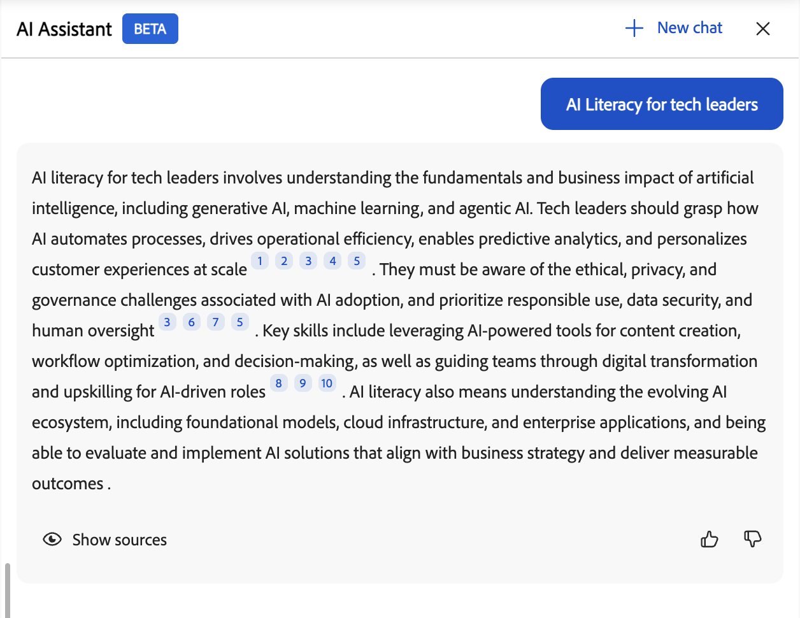

# KI-Assistent für Teilnehmende

Mit dem AI Assistant (Beta) für Teilnehmer können sie schnell Antworten auf die zugewiesenen Lerninhalte finden, ohne sich durch ganze Kurse bewegen zu müssen. Sie können Fragen in verständlicher Sprache stellen und erhalten präzise, zielgerichtete Antworten mit Quell-Links zu den relevanten Kursinhalten.

>[!IMPORTANT]
>
>Der AI Assistant für Teilnehmer ist derzeit als Betafunktion verfügbar. Funktionen, unterstützte Szenarien und Einschränkungen können sich mit der Weiterentwicklung der Funktion ändern.

## Was ist der KI-Assistent für Teilnehmer?

Der AI Assistant ist ein generativer KI-gestützter Chat-Begleiter in Adobe Learning Manager, der schnelle, präzise Antworten mithilfe Ihrer vertrauenswürdigen Lerninhalte bereitstellt. Sie enthält Zitate, damit Sie immer wissen, aus welcher Quelle die Informationen stammen.

### Funktionen

- **Intelligente Frageantwort**
   - Gespräche mit einer und mehreren Gängen
   - Natürliches Sprachverständnis auf Englisch
   - Antworten auf Kurse, Zertifizierungen, Lernpfade und Arbeitshilfen
   - Intelligente Klärung von Fragen bei mehrdeutigen Abfragen

- **Inhaltsquellen und Zitate**
   - Ruft Antworten aus verfügbaren Ressourcen in unterstützten Katalogen ab
   - Bietet Zitaten direkte Verknüpfungen zu Quellmaterialien
   - Unterstützt alle (statischen und interaktiven) Learning Manager-Inhaltsformate: PDF, DOCX, PPTX, XLSX, Audio (MP3, WAV, M4A), Video (MP4, MOV, WMV), HTML, SCORM 2004 und SCORM 1.2

- **Benutzererlebnis**
   - Seitenbedienfeld, über alle Teilnehmerseiten zugänglich
   - Responsives Design, das sich an den Inhaltsbereich anpasst
   - Chat-Verlauf in der Browsersitzung beibehalten
   - Löschen von Schiefer bei neuer Anmeldung oder Seitenaktualisierung
   - Freundlicher, klarer und pädagogisch solider Ton

- **Administratorsteuerung**
   - Aktivieren oder Deaktivieren der Funktion auf Kontoebene
   - Zugriff durch Benutzergruppen steuern
   - Auswählen, welche Kataloge für AI-Antworten enthalten sind
   - Akzeptieren der Nutzungsbedingungen gemäß den Adobe AI-Richtlinien

## Unterstützte Inhaltstypen

Der AI Assistant ruft Informationen aus Lerninhalten ab, die Ihnen zugewiesen wurden, darunter:

- **Dokumente:** PDF, Word, PowerPoint, Excel, HTML
- **Medien:** Audio (MP3, WAV, M4A), Video (MP4, MOV, WMV)
- **Interaktiver Inhalt:** SCORM 1.2, SCORM 2004
- **Lernobjekttypen:** Kurse, Lernpfade, Zertifizierungen, Arbeitshilfen

Adobe verarbeitet Ihre Lerninhalte sicher mit vertrauenswürdigen Diensten.

### Einschränkungen bei Katalogen und Inhaltsquellen

Der AI-Assistent verwendet nur Inhalte aus **internen** Katalogen, die explizit von Administratoren konfiguriert wurden.

Die folgenden Inhaltsquellen werden in der aktuellen Version nicht unterstützt:

- **Freigegebene** Kataloge
- **Erworbene** Kataloge
- **Externe** Kataloge
- **Standard**-Kataloge
- Inhaltsbibliotheken von Drittanbietern (z. B. LinkedIn Learning oder Go1)

Wenn Sie keinen Zugriff auf einen Kurs oder eine Arbeitshilfe haben, zeigt der AI-Assistent keine Informationen aus diesen Inhalten an, und Zitat-Links sind nicht zugänglich.

## Anwendungsszenarien

### Technischer Teilnehmer

Sarah ist Vertriebsingenieurin und beschäftigt sich mit Grafikkarten. Sie muss schnell die technischen Spezifikationen und Vorteile verstehen, um Kundenfragen zuverlässig beantworten zu können.

Die KI-Assistentin unterstützt Sarah bei folgenden Aufgaben:

- Klare, technische Erklärung der komplexen GPU-Architektur
- Vertiefen Sie das Verständnis für die verschiedenen Grafikkarten und ihre Unterschiede
- Erläuterung von Beispielen, damit Sarah Funktionen mit Anwendungsfällen aus der realen Welt in Beziehung setzen kann

### Support

Marcus ist Supportspezialist bei einer Partnerfirma. Er braucht schnelle Antworten auf seine Fragen zu Produktfunktionen, um Kunden zu helfen, ohne zu Entwicklungs-Teams zu eskalieren.

Der KI-Assistent unterstützt Marcus bei folgenden Aufgaben:

- Relevante Support-Inhalte für häufig gestellte Kundenanfragen finden
- Klärende Fragen stellen, wenn die erste Antwort nicht spezifisch genug ist
- Finden von Empfehlungen für verwandte Fehlerbehebungskurse, um seine Kenntnisse zu verbessern

### Onboarding neuer Mitarbeiter

Jennifer ist gerade dem Unternehmen beigetreten und wird von der Menge an Schulungsmaterial überwältigt. Sie benötigt eine Möglichkeit, bestimmte Informationen zu finden, ohne den gesamten Kurs zu überprüfen.

Die KI-Assistentin unterstützt Jennifer bei folgenden Aufgaben:

- Abrufen einer schrittweisen Anleitung zum Einreichen von Spesenabrechnungen
- Ermitteln von Kursen zu Unternehmensrichtlinien, ohne den gesamten Katalog durchsuchen zu müssen
- Sie wird zum entsprechenden Abschnitt eines Kurses geleitet, ohne stundenlanges Video zu sehen

## Verwendung von Inhalten durch den AI Assistant

Der KI-Assistent findet präzise Antworten auf Ihre Lerninhalte. So funktioniert es.

### Welche Inhalte der KI-Assistent verwendet

Der AI Assistant beantwortet Fragen ausschließlich mit den vom Kontoadministrator aktivierten Lerninhalten. Der Inhalt aus den ausgewählten Katalogen wird indiziert.

Der AI Assistant analysiert Ihre zugewiesenen Lerninhalte, um zielgerichtete, kontextbezogene Antworten zu generieren:

- Jede Antwort enthält Zitate, die auf den ursprünglichen Quellinhalt verweisen.
- Sie können eine Erwähnung auswählen, um direkt zum entsprechenden Kurs, Modul oder Dokument zu navigieren.
- Zitate helfen Ihnen dabei, Informationen zu verifizieren und bei Bedarf zusätzlichen Kontext zu erkunden.

### Streaming-Antworten

Der AI Assistant liefert Antworten während der Generierung nach und nach, sodass Sie sofort mit dem Lesen beginnen können, ohne auf die gesamte Antwort zu warten.

### Zitate und Quellentransparenz

Jede Antwort des AI Assistant umfasst Zitate, die direkt mit dem ursprünglichen Kurs, Modul oder Lernobjekt verknüpft sind. Mit Zitaten können Sie:

- Wählen Sie eine Inline-Zitatnummer aus, um zum exakt referenzierten Abschnitt zu springen.
- Öffnen Sie die vollständige Quellliste, indem Sie unten in der Antwort **Quellen anzeigen** auswählen.
- Überprüfen Sie die Informationen und sehen Sie sich zusätzlichen Kontext aus der maßgeblichen Quelle an.

> **WICHTIG**
> Der AI-Assistent bietet Antworten auf Basis von durch den Administrator aktiviertem Inhalt. Wenn Sie keinen Zugriff auf ein referenziertes Element haben, wird beim Versuch, es zu öffnen, die Meldung &quot;Nicht unterstützt&quot; angezeigt.

## Integrierte Eingabeaufforderungen

Der AI Assistant enthält integrierte Eingabeaufforderungen, die Ihnen den schnellen Einstieg in häufige Fragen und Szenarien erleichtern. Diese Eingabeaufforderungen zeigen Ihnen, wie Sie mit dem Assistenten interagieren und welche Arten von Fragen Sie stellen können.

Organisationen können integrierte Eingabeaufforderungen anpassen, um ihre Lernziele, Rollen, Terminologie oder spezifischen Anwendungsfälle widerzuspiegeln. Administratoren können mit ihrem Customer Success Manager integrierte Eingabeaufforderungen konfigurieren oder aktualisieren. In der aktuellen Version können Sie Aufforderungen nicht direkt in der Adobe Learning Manager-Oberfläche anpassen.

## AI-Assistenten einrichten (Administratoren)

Administratoren wählen aus, welche Benutzergruppen und **interne** Kataloge auf die AI Assistant-Funktion zugreifen können. Stellen Sie sicher, dass die Kataloge, die Sie zuweisen, nur die Lerninhalte enthalten, die für AI-Antworten und Zitate geeignet sind, und dass diese Kataloge **intern** (nicht **Freigegeben**, **Erworben** oder **Extern**) sind.

Bevor Sie den AI-Assistenten konfigurieren, vergewissern Sie sich, dass Sie über Administratoranmeldeinformationen verfügen und identifiziert haben, auf welche Benutzergruppen und Kataloge Zugriff haben sollen.

### Konfigurieren des Zugriffs auf den AI Assistant

So aktivieren Sie den AI-Assistenten für Teilnehmer:

1. Melden Sie sich bei Adobe Learning Manager als Administrator an.

2. Wählen Sie **Einstellungen** auf der Startseite aus.
   

3. Wählen Sie im Menü **Einstellungen** die Option **Teilnehmer-AI-Assistent (Beta)**.
   

4. Wählen Sie den Umschalter, um den **Teilnehmer-AI-Assistenten (Beta)** zu aktivieren.
   

5. Wählen Sie eine oder mehrere Benutzergruppen aus der Option **Berechtigte Benutzergruppen** aus.

6. Wählen Sie **Speichern**, um die Benutzergruppeneinstellungen anzuwenden.

7. Wählen Sie einen oder mehrere Kataloge aus der Option **Kataloge**, für die Sie berechtigt sind.

8. Wählen Sie **Speichern**, um die Katalogeinstellungen anzuwenden.

>[!IMPORTANT]
>
>Nur **interne** Kataloge werden unterstützt. Wenn ein **freigegebener**, **erworbener**, **externer** oder anderer nicht interner Katalog ausgewählt ist, wird sein Inhalt nicht vom AI-Assistenten angezeigt, selbst wenn er in der Liste **Zugelassene Kataloge** angezeigt wird.

## Starten des AI-Assistenten (Teilnehmer)

So starten Sie den AI-Assistenten:

1. Melden Sie sich bei Adobe Learning Manager als Teilnehmer an.

2. Wählen Sie auf der Startseite **AI Assistant fragen**.
   

3. Wenn der Bildschirm **Teilnehmer-AI-Assistent** angezeigt wird, wählen Sie **Erste Schritte**.
   

>[!NOTE]
>
>Wenn Sie den AI Assistant zum ersten Mal starten, müssen Sie Ihre Zustimmung geben, bevor Sie ihn verwenden können. Das Zustimmungsdialogfeld wird nur während dieses ersten Starts angezeigt. Für alle nachfolgenden Starts werden Sie direkt zum AI Assistant weitergeleitet, wo Sie Ihre Eingabeaufforderungen eingeben können.

&#x200B;4. Geben Sie die Eingabeaufforderung in das Textfeld ein.
<!--  -->

5.Drücken Sie **Enter**, um eine Antwort zu erhalten. Prüft eure Antworten, Quellen und Empfehlungen.

Sie haben folgende Möglichkeiten:

- Wählen Sie die Zitatnummer inline aus, um zum exakt referenzierten Abschnitt zu springen.
- Öffnen Sie die vollständige Liste der Quellen, indem Sie unten in der Antwort **Quellen anzeigen** auswählen.

Der AI Assistant enthält Zitate mit allen Antworten, um zu zeigen, woher die Informationen stammen. Jede Erwähnung wird direkt mit dem ursprünglichen Kurs, Modul oder Lernobjekt verknüpft, mit dem die Antwort generiert wurde.

Sie können ein beliebiges Zitat auswählen, um die Kursseite in Adobe Learning Manager zu öffnen und den gesamten Inhalt im Kontext zu prüfen. Zitate helfen Ihnen dabei, Informationen zu verifizieren, zusätzliche Details zu erkunden und weiterhin von der maßgeblichen Quelle zu lernen.

## Zugriff auf den AI Assistant über die Suche

Sie können den AI-Assistenten auch direkt über die Suchleiste starten. Geben Sie Ihre Frage in das Suchfeld ein und wählen Sie dann **AI-Assistenten fragen** aus den angezeigten Optionen aus.

## Feedback zu Antworten von AI Assistant geben

Ihr Feedback zu den vom AI Assistant (Beta) generierten Antworten trägt dazu bei, die Genauigkeit, Relevanz und Gesamtleistung des Assistenten zu verbessern.

### Antwort mögen oder ablehnen

- Wählen Sie **Minimieren**, wählen Sie aus, was Ihnen in der Antwort hilfreich war, fügen Sie optional Kommentare hinzu, und wählen Sie dann **Senden** aus.
- Wählen Sie **Minimieren**, wählen Sie den Grund aus, aus dem die Antwort nicht hilfreich war, fügen Sie Kommentare hinzu, und wählen Sie dann **Senden** aus.

## Neuen Chat starten

Mit einem neuen Chat können Sie eine neue Unterhaltung beginnen und den vorherigen Kontext löschen, sodass sich der Assistent auf das neue Thema konzentrieren kann, ohne auf vorherige Interaktionen zu verweisen.

Um die aktuelle Unterhaltung zu löschen und neu zu starten, wählen Sie **Neuer Chat** auf dem Bildschirm des AI-Assistenten aus, und wählen Sie dann **Ja**.

Der AI-Assistent bietet Teilnehmern schnelle, kontextbezogene Antworten, unterstützt mehrere Inhaltstypen und bietet Inline-Zitate für mehr Transparenz. Administratoren können den Zugriff steuern und stellen sicher, dass der AI Assistant auf die organisatorischen Anforderungen zugeschnitten ist und das Lernerlebnis verbessert.

## Beheben von Problemen mit dem AI-Assistenten

> **HINWEIS**
> Nachdem Sie einen neuen Katalog konfiguriert haben, warten Sie 4 bis 5 Stunden, bis der Inhalt indiziert und für die Antworten des AI-Assistenten verfügbar ist.

### Kein Zugriff auf Inhalte

**Problem:** Ein Teilnehmer hat Zugriff auf den AI-Assistenten, erhält aber Antworten zum Thema &quot;Ich habe keine Antwort auf diese Frage&quot;.

**Mögliche Ursachen:**

- Die Kataloge der Teilnehmer sind nicht in der AI Assistant-Konfiguration enthalten.
- Der Inhalt, der mit der Frage verknüpft ist, befindet sich nicht in den ausgewählten Katalogen, oder die Kataloge sind leer.
- Der Teilnehmer hat keine Sichtbarkeit für den relevanten Inhalt.

**Lösung:**

- Überprüfen Sie den Katalogzugriff des Teilnehmers.
- Überprüfen Sie, welche Kataloge in den Einstellungen des AI-Assistenten aktiviert sind.
- Stellen Sie sicher, dass relevante Inhalte in diesen Katalogen vorhanden sind.
- Warten Sie einige Stunden nach dem Hinzufügen neuer Inhalte, bis sie indiziert werden.

### Irrelevante oder qualitativ schlechte Antworten

**Problem:** Der AI-Assistent stellt Antworten bereit, die nicht mit der Frage übereinstimmen oder von geringer Qualität sind.

**Mögliche Ursachen:**

- Die Frage ist zu weit gefasst oder zu unklar.
- Relevante Inhalte haben schlechte Metadaten (Beschreibungen, Tags).
- Die Inhaltsstruktur erschwert das Extrahieren von Informationen.

**Lösung:**

- Ermutigen Sie Teilnehmer, spezifischere Fragen zu stellen.
- Überprüfen und verbessern Sie Kursbeschreibungen und Metadaten.
- Vergewissern Sie sich, dass die Inhalte klare Überschriften und Strukturen aufweisen.
- Überprüfen Sie den detaillierten Nutzungsbericht, um Muster zu identifizieren.
- Erwägen Sie die Erstellung von Arbeitshilfen für häufig gestellte Fragen.

### Nicht in den Zuständigkeitsbereich fallende Fragen

**Problem:** Ein Teilnehmer stellt Fragen, die nichts mit Schulungsinhalten zu tun haben.

**Beispiele:**

- Allgemeine Wissensfragen (&quot;Wer ist der Präsident?&quot;)
- Persönliche Meinungen (&quot;Was halten Sie von X?&quot;)
- Unangemessene Inhalte

Der AI Assistant ist darauf ausgelegt, Fragen nur auf der Grundlage zugewiesener Lerninhalte zu beantworten, und antwortet nicht auf Anfragen außerhalb des Zuständigkeitsbereichs.
