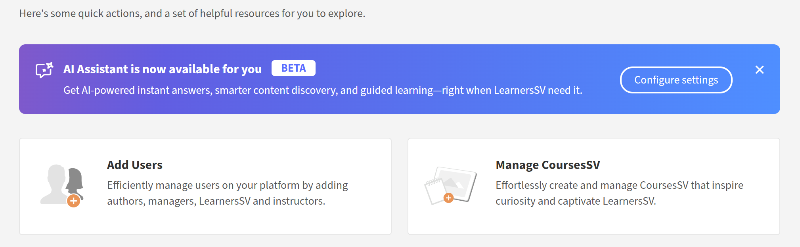

# KI-Assistent für Teilnehmende

## Einführung

Mit dem KI-Assistenten können Sie schnelle, genaue Antworten auf Ihre zugewiesenen Lerninhalte erhalten, Kurszusammenfassungen generieren, Lernobjekte vergleichen, Anleitungen finden und personalisierte Lernpfade erstellen, ohne durch ganze Kurse zu blättern.

>[!IMPORTANT]
>
>Der AI Assistant für Teilnehmer ist derzeit als Betafunktion verfügbar. Funktionen, unterstützte Szenarien und Einschränkungen können sich mit der Weiterentwicklung der Funktion ändern.

>[!NOTE]
>
>Diese Funktion ist in FedRAMP-autorisierten Umgebungen nicht verfügbar. Weitere Informationen finden Sie unter [Verfügbarkeit von Funktionen in FedRAMP-Umgebungen](/help/migrated/feature-availability-in-fedramp-authorized-environment.md).

## Was ist der KI-Assistent für Teilnehmer?

Der AI Assistant ist ein generativer KI-gestützter Chat-Begleiter in Adobe Learning Manager, der schnelle, präzise Antworten mithilfe Ihrer vertrauenswürdigen Lerninhalte bereitstellt. Sie enthält Zitate, damit Sie immer wissen, aus welcher Quelle die Informationen stammen.

### Funktionen

- **Intelligente Frageantwort**
  - Gespräche mit einer und mehreren Gängen
  - Natürliches Sprachverständnis auf Englisch
  - Antworten auf Kurse, Zertifizierungen, Lernpfade und Arbeitshilfen
  - Intelligente Klärung von Fragen bei mehrdeutigen Abfragen

- **Inhaltsquellen und Zitate**
  - Ruft Antworten aus verfügbaren Ressourcen in unterstützten Katalogen ab
  - Bietet Zitaten direkte Verknüpfungen zu Quellmaterialien
  - Unterstützt alle Learning Manager-Inhaltsformate (statisch und interaktiv): PDF, DOCX, PPTX, XLSX, Audio (MP3, WAV, M4A), Video (MP4, MOV, WMV), HTML, SCORM 2004 und SCORM 1.2

- **Benutzererlebnis**
  - Seitenbedienfeld, über alle Teilnehmerseiten zugänglich
  - Responsives Design, das sich an den Inhaltsbereich anpasst
  - Chat-Verlauf in der Browsersitzung beibehalten
  - Löschen von Schiefer bei neuer Anmeldung oder Seitenaktualisierung
  - Freundlicher, klarer und pädagogisch solider Ton

- **Administratorsteuerung**
  - Aktivieren oder Deaktivieren der Funktion auf Kontoebene
  - Auswählen, welche Kataloge für AI-Antworten enthalten sind
  - Akzeptieren der Nutzungsbedingungen gemäß den Adobe AI-Richtlinien

## Funktionen des AI Assistant.

Der AI Assistant ist ein generativer KI-gestützter Chat-Begleiter, der Fragen mithilfe Ihrer zugewiesenen Lerninhalte beantwortet. Jede Antwort umfasst Zitate mit direkten Links zum Quellmaterial, sodass Sie Informationen überprüfen und das Lernen im Kontext fortsetzen können.

Zusätzlich zur Beantwortung von Fragen kann der AI Assistant:

- **Lernobjekte zusammenfassen** - Erstellen Sie eine kurze Übersicht über alle Kurse, Arbeitshilfen, Lernpfade oder Zertifizierungen in Ihrem Katalog, ohne sie zu öffnen.
- **Lernobjekte vergleichen** — Unterschiede zwischen zwei Kursen nebeneinander identifizieren, um zu entscheiden, welcher Kurs zu Ihren Lernzielen passt
- **Beantwortung von Fragen zur Vorgehensweise** — Quellantworten von Adobe Experience League, der offiziellen Hilfedokumentation der Adobe, für Fragen zur Verwendung von Adobe Learning Manager als Teilnehmer
- **Inhalte von Drittanbietern abfragen** — Fragen zu Go1- oder LinkedIn Learning-Kursen stellen, wenn Ihr Administrator diese Kataloge hinzugefügt hat
- **Erstellen eines personalisierten Lernpfads** - Führen Sie eine geführte Unterhaltung mit dem AI-Assistenten, um einen benutzerdefinierten, sequenziellen Lernplan basierend auf Ihren Zielen, Ihrem Hintergrund und der verfügbaren Zeit zu erstellen.

Ihr Administrator steuert, welche Kataloge der AI-Assistent verwendet. Wenn Sie keinen Zugriff auf einen Kurs haben, zeigt der AI Assistant keine Informationen aus diesem Kurs an.

## Unterstützte Inhaltstypen

Der AI Assistant ruft Informationen aus Lerninhalten ab, die Ihnen zugewiesen wurden, darunter:

- **Dokumente:** PDF, Word, PowerPoint, Excel, HTML
- **Medien:** Audio (MP3, WAV, M4A), Video (MP4, MOV, WMV)
- **Interaktiver Inhalt:** SCORM 1.2, SCORM 2004
- **Lernobjekttypen:** Kurse, Lernpfade, Zertifizierungen, Arbeitshilfen

Adobe verarbeitet Ihre Lerninhalte sicher mit vertrauenswürdigen Diensten.

### Einschränkungen bei Katalogen und Inhaltsquellen

Der AI-Assistent verwendet nur Inhalte aus **internen** Katalogen, die explizit von Administratoren konfiguriert wurden.

Die folgenden Inhaltsquellen werden in der aktuellen Version nicht unterstützt:

- **Freigegebene** Kataloge
- **Erworbene** Kataloge
- **Externe** Kataloge
- **Standard**-Kataloge
- Inhaltsbibliotheken von Drittanbietern (z. B. LinkedIn Learning oder Go1)

Wenn Sie keinen Zugriff auf einen Kurs oder eine Arbeitshilfe haben, zeigt der AI-Assistent keine Informationen aus diesen Inhalten an, und Zitat-Links sind nicht zugänglich.

## Anwendungsszenarien

### Technischer Teilnehmer

Sarah ist Vertriebsingenieurin und beschäftigt sich mit Grafikkarten. Sie muss schnell die technischen Spezifikationen und Vorteile verstehen, um Kundenfragen zuverlässig beantworten zu können.

Die KI-Assistentin unterstützt Sarah bei folgenden Aufgaben:

- Klare, technische Erklärung der komplexen GPU-Architektur
- Vertiefen Sie das Verständnis für die verschiedenen Grafikkarten und ihre Unterschiede
- Erläuterung von Beispielen, damit Sarah Funktionen mit Anwendungsfällen aus der realen Welt in Beziehung setzen kann

### Support

Marcus ist Supportspezialist bei einer Partnerfirma. Er braucht schnelle Antworten auf seine Fragen zu Produktfunktionen, um Kunden zu helfen, ohne zu Entwicklungs-Teams zu eskalieren.

Der KI-Assistent unterstützt Marcus bei folgenden Aufgaben:

- Relevante Support-Inhalte für häufig gestellte Kundenanfragen finden
- Klärende Fragen stellen, wenn die erste Antwort nicht spezifisch genug ist
- Finden von Empfehlungen für verwandte Fehlerbehebungskurse, um seine Kenntnisse zu verbessern

### Onboarding neuer Mitarbeiter

Jennifer ist gerade dem Unternehmen beigetreten und wird von der Menge an Schulungsmaterial überwältigt. Sie benötigt eine Möglichkeit, bestimmte Informationen zu finden, ohne den gesamten Kurs zu überprüfen.

Die KI-Assistentin unterstützt Jennifer bei folgenden Aufgaben:

- Abrufen einer schrittweisen Anleitung zum Einreichen von Spesenabrechnungen
- Ermitteln von Kursen zu Unternehmensrichtlinien, ohne den gesamten Katalog durchsuchen zu müssen
- Sie wird zum entsprechenden Abschnitt eines Kurses geleitet, ohne stundenlanges Video zu sehen

## Verwendung von Inhalten durch den AI Assistant

Der KI-Assistent findet präzise Antworten auf Ihre Lerninhalte. So funktioniert es.

### Welche Inhalte der KI-Assistent verwendet

Der AI Assistant beantwortet Fragen ausschließlich mit den vom Kontoadministrator aktivierten Lerninhalten. Der Inhalt aus den ausgewählten Katalogen wird indiziert.

Der AI Assistant analysiert Ihre zugewiesenen Lerninhalte, um zielgerichtete, kontextbezogene Antworten zu generieren:

- Jede Antwort enthält Zitate, die auf den ursprünglichen Quellinhalt verweisen.
- Sie können eine Erwähnung auswählen, um direkt zum entsprechenden Kurs, Modul oder Dokument zu navigieren.
- Zitate helfen Ihnen dabei, Informationen zu verifizieren und bei Bedarf zusätzlichen Kontext zu erkunden.

### Streaming-Antworten

Der AI Assistant liefert Antworten während der Generierung nach und nach, sodass Sie sofort mit dem Lesen beginnen können, ohne auf die gesamte Antwort zu warten.

### Zitate und Quellentransparenz

Jede Antwort des AI Assistant umfasst Zitate, die direkt mit dem ursprünglichen Kurs, Modul oder Lernobjekt verknüpft sind. Mit Zitaten können Sie:

- Wählen Sie eine Inline-Zitatnummer aus, um zum exakt referenzierten Abschnitt zu springen.
- Öffnen Sie die vollständige Quellliste, indem Sie unten in der Antwort **Quellen anzeigen** auswählen.
- Überprüfen Sie die Informationen und sehen Sie sich zusätzlichen Kontext aus der maßgeblichen Quelle an.

> **WICHTIG**
> Der AI-Assistent bietet Antworten auf der Grundlage von Inhalten, die vom Administrator aktiviert wurden. Wenn Sie keinen Zugriff auf ein referenziertes Element haben, wird beim Versuch, es zu öffnen, die Meldung &quot;Nicht unterstützt&quot; angezeigt.

## Integrierte Eingabeaufforderungen

Der AI Assistant enthält integrierte Eingabeaufforderungen, die Ihnen den schnellen Einstieg in häufige Fragen und Szenarien erleichtern. Diese Eingabeaufforderungen zeigen Ihnen, wie Sie mit dem Assistenten interagieren und welche Arten von Fragen Sie stellen können.

Organisationen können integrierte Eingabeaufforderungen anpassen, um ihre Lernziele, Rollen, Terminologie oder spezifischen Anwendungsfälle widerzuspiegeln. Administratoren können mit ihrem Customer Success Manager integrierte Eingabeaufforderungen konfigurieren oder aktualisieren. In der aktuellen Version können Sie Aufforderungen nicht direkt in der Adobe Learning Manager-Oberfläche anpassen.

## AI-Assistenten einrichten (Administratoren)

Administratoren wählen aus, welche **internen** Kataloge auf die AI Assistant-Funktion zugreifen können. Stellen Sie sicher, dass die Kataloge, die Sie zuweisen, nur die Lerninhalte enthalten, die für AI-Antworten und Zitate geeignet sind, und dass diese Kataloge **intern** (nicht **Freigegeben**, **Erworben** oder **Extern**) sind.

Bevor Sie den AI-Assistenten konfigurieren, vergewissern Sie sich, dass Sie über Administratoranmeldeinformationen verfügen und identifiziert haben, dass Kataloge Zugriff haben sollten.

### Konfigurieren des Zugriffs auf den AI Assistant

So aktivieren Sie den AI-Assistenten für Teilnehmer:

&#x200B;1. Melden Sie sich bei Adobe Learning Manager als Administrator an.

&#x200B;2. Wählen Sie **Einstellungen** auf der Startseite aus.

&#x200B;3. Wählen Sie im Menü **Einstellungen** die Option **Teilnehmer-AI-Assistent (Beta)**.

&#x200B;4. Wählen Sie den Umschalter, um den **Teilnehmer-AI-Assistenten (Beta)** zu aktivieren.
2
3
4<!----><!--5. Select one or more user groups from the **Eligible user groups** option.--><!--5. Select **Save** to apply the user group settings.-->

&#x200B;5. Wählen Sie einen oder mehrere Kataloge aus der Option &quot;**Berechtigte Kataloge**&quot;.

&#x200B;6. Wählen Sie **Speichern**, um die Katalogeinstellungen anzuwenden.

>[!IMPORTANT]
>
>Nur **interne** Kataloge werden unterstützt. Wenn ein **freigegebener**, **erworbener**, **externer** oder anderer nicht interner Katalog ausgewählt ist, wird sein Inhalt nicht vom AI-Assistenten angezeigt, selbst wenn er in der Liste **Zugelassene Kataloge** angezeigt wird.

## Starten des AI-Assistenten (Teilnehmer)

So starten Sie den AI-Assistenten:

1. Melden Sie sich bei Adobe Learning Manager als Teilnehmer an.

2. Wählen Sie auf der Startseite **AI Assistant fragen**.
   

3. Wenn der Bildschirm **Teilnehmer-AI-Assistent** angezeigt wird, wählen Sie **Erste Schritte**.
   

>[!NOTE]
>
>Wenn Sie den AI Assistant zum ersten Mal starten, müssen Sie Ihre Zustimmung geben, bevor Sie ihn verwenden können. Das Zustimmungsdialogfeld wird nur während dieses ersten Starts angezeigt. Für alle nachfolgenden Starts werden Sie direkt zum AI Assistant weitergeleitet, wo Sie Ihre Eingabeaufforderungen eingeben können.

&#x200B;4. Geben Sie die Eingabeaufforderung in das Textfeld ein.
<!--  -->

5.Drücken Sie **Enter**, um eine Antwort zu erhalten. Prüft eure Antworten, Quellen und Empfehlungen.

Sie haben folgende Möglichkeiten:

- Wählen Sie die Zitatnummer inline aus, um zum exakt referenzierten Abschnitt zu springen.
- Öffnen Sie die vollständige Liste der Quellen, indem Sie unten in der Antwort **Quellen anzeigen** auswählen.

Der AI Assistant enthält Zitate mit allen Antworten, um zu zeigen, woher die Informationen stammen. Jede Erwähnung wird direkt mit dem ursprünglichen Kurs, Modul oder Lernobjekt verknüpft, mit dem die Antwort generiert wurde.

Sie können ein beliebiges Zitat auswählen, um die Kursseite in Adobe Learning Manager zu öffnen und den gesamten Inhalt im Kontext zu prüfen. Zitate helfen Ihnen dabei, Informationen zu verifizieren, zusätzliche Details zu erkunden und weiterhin von der maßgeblichen Quelle zu lernen.

## Zugriff auf den AI Assistant über die Suche

Sie können den AI-Assistenten auch direkt über die Suchleiste starten. Geben Sie Ihre Frage in das Suchfeld ein und wählen Sie dann **AI-Assistenten fragen** aus den angezeigten Optionen aus.

## Feedback zu Antworten von AI Assistant geben

Ihr Feedback zu den vom AI Assistant (Beta) generierten Antworten trägt dazu bei, die Genauigkeit, Relevanz und Gesamtleistung des Assistenten zu verbessern.

### Antwort mögen oder ablehnen

- Wählen Sie **Minimieren**, wählen Sie aus, was Ihnen in der Antwort hilfreich war, fügen Sie optional Kommentare hinzu, und wählen Sie dann **Senden** aus.
- Wählen Sie **Minimieren**, wählen Sie den Grund aus, aus dem die Antwort nicht hilfreich war, fügen Sie Kommentare hinzu, und wählen Sie dann **Senden** aus.

## Neuen Chat starten

Mit einem neuen Chat können Sie eine neue Unterhaltung beginnen und den vorherigen Kontext löschen, sodass sich der Assistent auf das neue Thema konzentrieren kann, ohne auf vorherige Interaktionen zu verweisen.

Um die aktuelle Unterhaltung zu löschen und neu zu starten, wählen Sie **Neuer Chat** auf dem Bildschirm des AI-Assistenten aus, und wählen Sie dann **Ja**.

Der AI-Assistent bietet Teilnehmern schnelle, kontextbezogene Antworten, unterstützt mehrere Inhaltstypen und bietet Inline-Zitate für mehr Transparenz. Administratoren können den Zugriff steuern und stellen sicher, dass der AI Assistant auf die organisatorischen Anforderungen zugeschnitten ist und das Lernerlebnis verbessert.

## Erhalten Sie Zusammenfassungen und Antworten von bestimmten Lernobjekten im Lernassistenten

Der Lernassistent von Adobe Learning Manager kann eine Zusammenfassung aller Kurse, Arbeitshilfen, Lernpfade oder Zertifizierungen in Ihrem Katalog generieren\. Die Zusammenfassung basiert auf den Kursinhalten und Modultranskripten, die im Katalog gespeichert sind.

### Nach einem Kurs suchen

1. Öffnen Sie _Lernassistent_ von Ihrer Teilnehmer-Startseite aus.
2. Geben Sie im Chat-Bedienfeld / ein, um eine Inhaltssuche zu starten.

>[!NOTE]
>
>Lernobjekte, die nicht dem Katalog hinzugefügt wurden, können nicht durchsucht werden. Sie können auf alle Inhalte zugreifen, auf die Sie Zugriff haben, aber der Teilnehmer-Assistent ruft nur die Zusammenfassung vom Inhalt des Moduls ab.

1. Geben Sie den Namen des Kurses, der Arbeitshilfe, des Lernpfads oder der Zertifizierung ein, die Sie zusammenfassen möchten\. Eine Typ\-Ahead-Liste der entsprechenden Katalogelemente wird angezeigt.
2. Wählen Sie das Lernobjekt aus der Liste aus.

### Kursübersicht erstellen

Verwenden Sie diese Funktion, wenn Sie einen schnellen, zuverlässigen Schnappschuss eines Kurses benötigen, ohne ihn vollständig zu öffnen\. Häufige Szenarien:

- Erneuern oder Aufpolieren des Lernens
  *Szenario:* Ein Vertriebsmitarbeiter hat vor sechs Monaten einen Kurs zu den &quot;Verhandlungsgrundlagen&quot; abgeschlossen und morgen nun einen großen Aufruf zur Kundenerneuerung. Anstatt alle vier Module erneut anzusehen, bitten sie den Lernassistenten, den Kurs zusammenzufassen und eine schnelle Auffrischung der wichtigsten Verhandlungstaktiken zu erhalten\.
- Entscheidung über die Registrierung_
  *Szenario:* Für einen neuen Manager wird &quot;Durchführende Änderung&quot; in seinem Katalog empfohlen, er ist sich jedoch nicht sicher, ob er für seine aktuelle Teamsituation geeignet ist. Sie bitten zunächst um eine Zusammenfassung, achten darauf, dass der Schwerpunkt auf dem Remote-Management von Teamänderungen liegt, und entscheiden sich für eine Registrierung, da sie genau dem entspricht, was sie benötigen.
- Vorbereiten oder Verweisen auf ein Thema_
  *Szenario:* Ein Supportingenieur ist im Begriff, einem Kundenanruf über eine Produktfunktion beizutreten, die er seit einer Weile nicht mehr berührt hat. Anstatt einen 45-minütigen Schulungskurs durchzuarbeiten, bitten sie den Learning Assistant, den entsprechenden Kurs zusammenzufassen, damit er die wichtigsten Schritte und die Terminologie vor dem Anruf schnell aktualisieren kann.

1. Geben Sie in der Chat-Eingabe eine Abfrage ein, z. B. diesen Kurs zusammenfassen oder mir eine Zusammenfassung dieses Kurses zukommen zu lassen.
2. Wählen Sie **Senden**, um Ihre Abfrage zu senden.
3. Der Lern-Assistent generiert eine Zusammenfassung basierend auf den Kursmodulen und den im Katalog gespeicherten Inhalten und zeigt diese an.

### Best Practices

- Verwenden Sie bei der Suche bestimmte Kursnamen, um genaue Type-Ahead-Ergebnisse zu erhalten.
- Sie können Zusammenfassungen für Kurse, Arbeitshilfen, Lernprogramme und Zertifizierungen anfordern.
- Überprüfen Sie die Zusammenfassung, um schnell festzustellen, ob ein Kurs Ihre Lernziele erfüllt, bevor Sie sich registrieren.

## Lernobjekte im Lernassistenten vergleichen

Mit dem Lernassistenten von Adobe Learning Manager können Sie bis zu zwei Lernobjekte aus Ihrem Katalog nebeneinander vergleichen. Verwenden Sie diese Funktion, um die Unterschiede in Inhalt, Umfang oder Fokus zwischen zwei Kursen zu verstehen, bevor Sie sich registrieren.

### Auswählen von Lernobjekten zum Vergleichen

1. Öffnen Sie _Lernassistent_ von Ihrer Teilnehmer-Startseite aus.
2. Geben Sie im Chat-Bedienfeld / ein, um eine Inhaltssuche zu starten.
3. Geben Sie den Namen des ersten Lernobjekts ein. Eine Type-Ahead-Liste der entsprechenden Katalogelemente wird angezeigt.
4. Wählen Sie das erste Lernobjekt aus der Liste aus.
5. Geben Sie / erneut ein und suchen Sie nach dem zweiten Lernobjekt.
6. Wählen Sie das zweite Lernobjekt aus der Liste aus.

>[!NOTE]
>
>Sie können maximal zwei Lernobjekte in einer einzigen Abfrage vergleichen.

### Vergleich anfordern

1. Geben Sie in der Chat-Eingabe eine Abfrage ein, z. B. was der Unterschied zwischen diesen beiden Kursen ist, oder vergleichen Sie diese Lernobjekte.
2. Wählen Sie _Senden_, um Ihre Abfrage zu senden.
3. Der Lernassistent generiert einen Vergleich und zeigt ihn an, der die Unterschiede im Inhalt zwischen den beiden Lernobjekten hervorhebt.

### Best Practices

- Überprüfen Sie einzelne Kurszusammenfassungen, bevor Sie sie vergleichen, um die einzelnen Kurse kurz zu verstehen.
- Verwenden Sie das Vergleichsergebnis, um herauszufinden, welcher Kurs Themen abdeckt, die für Ihre Rolle oder Ihren Qualifikationsdefizit am relevantesten sind.
- Wenn Katalogelemente nicht im Typ\-ahead angezeigt werden, bestätigen Sie mit Ihrem Administrator, dass beide Lernobjekte Teil des zugewiesenen Katalogs sind.

## Experience League von Antworten im Lernassistenten

Erfahren Sie, wie der Lernassistent von Adobe Learning Manager Teilnehmern mithilfe von Inhalten aus Adobe Experience League, einschließlich Links zu relevanten Hilfeartikeln, Fragen beantworten kann.

### Wie der Lernassistent Experience League verwendet

Der Learning Assistant von Adobe Learning Manager kann Antworten von [Adobe Experience League](/help/migrated/user-guide.md), der offiziellen Hilfs- und Dokumentationsseite der Adobe, erhalten. Wenn ein Teilnehmer eine prozedurale oder eine Gewusst-wie-Frage stellt, kann der Lernassistent eine relevante Antwort abrufen und einen Link zum vollständigen Experience League-Artikel hinzufügen.

### Welche Fragen kann der Learning Assistant beantworten?

Der Lern-Assistent kann Fragen zur Verwendung von Adobe Learning Manager als Teilnehmer beantworten. Beispiele:

- Registrierung für einen Kurs, der von einem Manager nominiert wurde
- So greifen Sie auf ein Lernprogramm oder eine Zertifizierung zu
- So finden und sehen Sie Ihre abgeschlossenen Kurse

Wenn der Lern-Assistent auf Experience League eine relevante Antwort findet, enthält die Antwort einen Link zum Quellartikel, damit Sie die vollständige Dokumentation durchsehen können.

### Unterschiede zum Admin Assistant

Der [Admin Assistant](/help/migrated/administrators/feature-summary/alm-ai-assistant.md) in Adobe Learning Manager bietet Administratoren seit früheren Versionen Antworten auf Experience League-Ressourcen. Durch die Verbesserung vom August 2026 wird diese Funktion auf den lernorientierten Lernassistenten erweitert, sodass Teilnehmer auch Hilfe erhalten können, ohne die Plattform zu verlassen.

Sowohl der Admin-Assistent als auch der dem Teilnehmer zugewandte Lernassistent verwenden den gleichen zugrunde liegenden Experience League-Inhalt, um Antworten zu generieren.

## Unterstützung für Inhalte von Drittanbietern im Lernassistenten

Der Lernassistent von Adobe Learning Manager kann Teilnehmerfragen zu Lernobjekten aus beliebigen Inhalten von Drittanbietern, die auf der Plattform verfügbar sind, sowie native Adobe Learning Manager-Inhalte beantworten. Bevor Teilnehmer diese Kurse abfragen können, muss ein Administrator Adobe Learning Manager den Lernkatalog Go1 oder LinkedIn hinzufügen.

### Funktionsweise der Katalogunterstützung von Drittanbietern

>[!IMPORTANT]
>
>Voraussetzung ist, dass ein Administrator die erforderlichen Kataloge dem Teilnehmer-Assistenten hinzufügt. Weitere Informationen finden Sie unter [Zugriff auf AI Assistant konfigurieren](https://experienceleague.adobe.com/de/docs/learning-manager/using/learner/learner-ai-assistant#configure-ai-assistant-access).

Wenn ein Administrator einen Go1- oder LinkedIn-Lernkatalog zu Adobe Learning Manager hinzufügt, durchläuft der Kataloginhalt einen geplanten Aufnahmeprozess. Nach Abschluss der Aufnahme sind die Lernobjekte aus diesem Katalog für die Abfrage durch den Lernassistenten verfügbar.

Die Aufnahme wird in der Regel innerhalb von ein bis zwei Stunden nach dem Hinzufügen des Katalogs durch den Administrator abgeschlossen.

Nach Abschluss der Aufnahme können Teilnehmer Fragen zu den Go1- oder LinkedIn Learning-Kursen auf die gleiche Weise stellen, wie sie native Adobe Learning Manager-Inhalte abfragen\. Beispielsweise kann ein Teilnehmer eine Zusammenfassung eines Go1-Kurses anfordern oder einen LinkedIn Learning-Kurs mit einem Adobe Learning Manager-Kurs vergleichen, indem er den Befehl / verwendet.

- Adobe Learning Manager verfügt über keine Inhaltsabschriften für Inhalte von Drittanbietern, daher werden keine Transkripte verwendet, um Antworten abzurufen. Antworten werden nur aus verfügbaren Metadaten wie Titel, Beschreibung und Übersicht abgerufen.
- Derzeit wird nur _Englisch_ unterstützt.

### Voraussetzungen

Der Lern-Assistent kann Lerninhalte zu Go1 oder LinkedIn abfragen:

- Ein Administrator muss der Adobe Learning Manager den entsprechenden Go1- oder LinkedIn-Lernkatalog hinzufügen.
- Die geplante Katalogaufnahme muss abgeschlossen sein, bevor die Kurse für die Abfrage verfügbar sind.
- Die Lernobjekte müssen Teil des dem Teilnehmer zugewiesenen Katalogs sein.

## Beheben von Problemen mit dem AI-Assistenten

> **HINWEIS**
> Nachdem Sie einen neuen Katalog konfiguriert haben, warten Sie 4 bis 5 Stunden, bis der Inhalt indiziert und für Antworten des AI-Assistenten verfügbar ist.

### Kein Zugriff auf Inhalte

**Problem:** Ein Teilnehmer hat Zugriff auf den AI-Assistenten, erhält aber Antworten zum Thema &quot;Ich habe keine Antwort auf diese Frage&quot;.

**Mögliche Ursachen:**

- Die Kataloge der Teilnehmer sind nicht in der AI Assistant-Konfiguration enthalten.
- Der Inhalt, der mit der Frage verknüpft ist, befindet sich nicht in den ausgewählten Katalogen, oder die Kataloge sind leer.
- Der Teilnehmer hat keine Sichtbarkeit für den relevanten Inhalt.

**Lösung:**

- Überprüfen Sie den Katalogzugriff des Teilnehmers.
- Überprüfen Sie, welche Kataloge in den Einstellungen des AI-Assistenten aktiviert sind.
- Stellen Sie sicher, dass relevante Inhalte in diesen Katalogen vorhanden sind.
- Warten Sie einige Stunden nach dem Hinzufügen neuer Inhalte, bis sie indiziert werden.

### Irrelevante oder qualitativ schlechte Antworten

**Problem:** Der AI-Assistent stellt Antworten bereit, die nicht mit der Frage übereinstimmen oder von geringer Qualität sind.

**Mögliche Ursachen:**

- Die Frage ist zu weit gefasst oder zu unklar.
- Relevante Inhalte haben schlechte Metadaten (Beschreibungen, Tags).
- Die Inhaltsstruktur erschwert das Extrahieren von Informationen.

**Lösung:**

- Ermutigen Sie Teilnehmer, spezifischere Fragen zu stellen.
- Überprüfen und verbessern Sie Kursbeschreibungen und Metadaten.
- Vergewissern Sie sich, dass die Inhalte klare Überschriften und Strukturen aufweisen.
- Überprüfen Sie den detaillierten Nutzungsbericht, um Muster zu identifizieren.
- Erwägen Sie die Erstellung von Arbeitshilfen für häufig gestellte Fragen.

### Nicht in den Zuständigkeitsbereich fallende Fragen

**Problem:** Ein Teilnehmer stellt Fragen, die nichts mit Schulungsinhalten zu tun haben.

**Beispiele:**

- Allgemeine Wissensfragen (&quot;Wer ist der Präsident?&quot;)
- Persönliche Meinungen (&quot;Was halten Sie von X?&quot;)
- Unangemessene Inhalte

Der AI Assistant ist darauf ausgelegt, Fragen nur auf der Grundlage zugewiesener Lerninhalte zu beantworten, und antwortet nicht auf Anfragen außerhalb des Zuständigkeitsbereichs.

### Go1- oder LinkedIn-Lernkurse werden nicht in der Lernassistentensuche angezeigt

Bestätigen Sie mit Ihrem Administrator, dass der Katalog &quot;Go1&quot; oder &quot;LinkedIn Learning&quot; zu Adobe Learning Manager hinzugefügt wurde und dass die Katalogaufnahme abgeschlossen ist. Die Aufnahme kann bis zu ein bis zwei Stunden nach dem Hinzufügen des Katalogs dauern.

### Ein kürzlich hinzugefügter Kurs ist noch nicht verfügbar

Warten Sie, bis die geplante Katalogsynchronisierung abgeschlossen ist. Wenn der Kurs nach zwei Stunden immer noch nicht angezeigt wird, wenden Sie sich an Ihren Administrator, um zu bestätigen, dass die Katalogverbindung aktiv ist.
