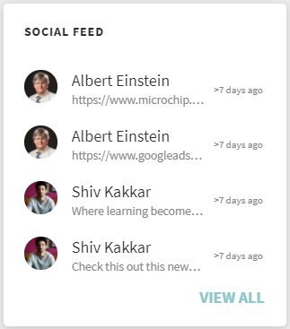

# Teilnehmer-Startseite

## Übersicht {#overview}

Nachdem der Administrator das immersive Layout aktiviert hat, wird der Teilnehmer nach der Anmeldung bei der App mit einer komplett überarbeiteten Benutzeroberfläche begrüßt.

>[!NOTE]
>
>Das immersive Layout wird im IE11-Browser nicht unterstützt.

Je nachdem, ob ein Widget aktiviert wurde, sieht der Teilnehmer Folgendes:

## Mastertitel {#masthead}

Enthält ein Video- oder Bildkarussell mit eingebetteter URL. Die [Administrator kann ein beliebiges Bild oder Video hochladen](../../administrators/feature-summary/announcements.md#masthead) Asset als Mastertitel und legen seine Sichtbarkeit für eine Gruppe von Teilnehmern fest.

*Ansicht masthead*

## Meine Lernliste {#mylearninglist}

Zeigt die Schulung an, die der Teilnehmer absolviert hat. Diese Schulungen werden als horizontal angeordnete Karten angezeigt. Sie können auf die rechte oder linke Schaltfläche klicken, um die Kurse zu durchsuchen.

*Meine Lernliste anzeigen*

Sie können auch nach links und rechts wischen, um durch die Liste zu navigieren.

Um einen Kurs fortzusetzen, klicken Sie auf **[!UICONTROL Weiter]** auf einer Karte, und der Player wird gestartet.

Das Erscheinungsbild der Symbole auf jeder Schulungskarte wird vom Administrator über die Admin-App (**Einstellungen** > **Allgemein** > **Symbole der Schulungskarte aktivieren**).

**Zu meiner Lernliste hinzufügen**

Wenn Sie den Mauszeiger in **Empfehlungen basierend auf Ihren Interessenbereichen** und **Empfehlungen basierend auf Peer-Aktivitätslisten** auf eine Kurskarte bewegen, wird eine Option angezeigt, um den Kurs zu **Meine Lernliste** hinzuzufügen. Klicken **[!UICONTROL +]** auf der Kurskarte und der Kurs wird zur Kurskarte **Meine Lernliste**.

*Zu meiner Lernliste hinzufügen*

## Auswählen von Qualifikationsstufen {#chooseskilllevels}

Als Teilnehmer können Sie den Kurskatalog nach folgenden Stufen filtern:

* Anfänger
* Fortgeschrittene
* Experten

Wenn Sie eine Option auswählen, können Sie den Kurskatalog entsprechend der Auswahl anzeigen.

*Auswählen von Kenntnisstufen*

## Kalender {#calendar}

Zeigt Ihre geplanten Sitzungen und Schulungen an. Durchsuchen Sie den Kalender, um die Schulungen für die folgenden Monate anzuzeigen.

*Kalender für geplante Sitzungen anzeigen*

Das Kalender-Widget bietet die folgenden Funktionen. Sie können Folgendes anzeigen:

* Schulung nach Monat. Scrollen Sie nach links oder rechts.
* Bevorstehende Schulung im Schulungsraum oder VC-Schulung, für die Sie sich registrieren können.
* Bevorstehende Schulung im Schulungsraum oder VC-Schulung, für die Sie sich registriert haben.
* Vom Manager genehmigte Schulung im Schulungsraum oder VC-Schulung.

## Sozialer Feed {#socialfeed}

*Social-Feed anzeigen*

Sehen Sie, worüber andere Benutzer sprechen.

Das Widget fasst die Aktivität für einen Zeitraum zusammen. Im Einzelnen:

* Es zeigt aktive Benutzer und Aktivitäten der Benutzer an, die sich in Ihrem Bereich oder Ihrer Gruppe befinden.
* Es zeigt Beiträge an, die in den letzten zwei Wochen erstellt wurden.

## Profilkenntnisse {#profileskills}

Profilkenntnisse werden für Kursempfehlungen verwendet. Wenn der Administrator einem Benutzer oder einer Gruppe von Benutzern Kenntnisse zuweist, werden die Kenntnisse den Profilkenntnissen des Teilnehmers hinzugefügt. Wenn der Teilnehmer seinem Profil eine Kenntnis hinzufügt, werden alle Stufen der Kenntnis den Profilkenntnissen des Teilnehmers hinzugefügt. Wenn ein Teilnehmer den Mauszeiger über eine Kenntnis bewegt, kann er den Namen der Kenntnis, die Methode zum Hinzufügen der Kenntnis, die Stufe, den Prozentsatz der Durchführung des Kenntniserwerbs und Credits sehen.

*Profilkenntnisse anzeigen*

Wenn sich ein Teilnehmer für einen Kurs registriert, werden nur die externen Kenntnisse, die auf einer Punktzahl basieren, den Profilkenntnissen hinzugefügt. Darüber hinaus kann ein Teilnehmer sein Profil durchsuchen, auswählen und ihm externe Kenntnisse hinzufügen. Wenn sich ein Teilnehmer zum ersten Mal bei der Teilnehmer-App angemeldet hat und die Kenntnisse des Teilnehmers bereits vorhanden sind, werden die Kenntnisse in &quot;Mein Profil&quot; angezeigt.

## Empfehlung basierend auf Ihrem Interessensbereich {#recommendationbasedonyourareaofinterest}

Zeigt Schulungen basierend auf Ihrem ausgewählten Interessensbereich an. Die Empfehlung basiert auf einem Machine Learning-Algorithmus.

*Empfohlene Kurse*

Für zielgerichtetere Empfehlungen können Sie Ihre Kenntnisse aktualisieren, indem Sie auf **Anzeigen/Aktualisieren**.

Nachdem Sie Kenntnisse hinzugefügt haben, werden zukünftige Empfehlungen zielgerichteter und auf Ihre Voreinstellungen konzentriert sein.

Wenn der Administrator die Option **Neue Fähigkeiten erschließen** deaktiviert hat, können Sie Ihren Kenntnissen Interesse hinzufügen.

Die empfohlenen Kurse werden als Karten angezeigt. Wenn Sie mit der Maus auf eine Karte zeigen, werden weitere Details zum Kurs angezeigt.

Produktterminologie wird ebenfalls unterstützt.

**Branchenspezifische Qualifikationen**

Wenn der Administrator in der Admin-App die Option **Branchenspezifisch** aktiviert hat, wird das Netzwerkdiagramm angezeigt.

Diese Kenntnis kann nur angezeigt werden, wenn der Administrator für den Schulungstyp „Branchenspezifisch“ festlegt.

In der Kenntnisdiagramm-Visualisierung können Sie nach einer Qualifikation oder Qualifikationen suchen und diese hinzufügen.

*Visualisierung von Kenntnisdiagrammen*

Option aktivieren **Kenntnisse anzeigen, für die Schulungen in meinem Konto vorhanden sind**, wenn Sie alle Kenntnisse anzeigen möchten, die in Ihrem Konto vorhanden sind.

Nachdem Sie eine Qualifikation hinzugefügt haben, können Sie das ausgerichtete Diagramm mit der ausgewählten Qualifikation als primärem Scheitelpunkt und den zugehörigen Kenntnissen als kleinere Scheitelpunkte sehen.

Die ausgewählten Kenntnisse werden auch im Abschnitt **Ausgewählte Kenntnisse** angezeigt.

*Ausgewählte Kenntnisse*

Um die Qualifikationen hinzuzufügen, klicken Sie auf **[!UICONTROL Hinzufügen]**.

## Empfehlung auf der Grundlage von Peer-Aktivitäten {#recommendationbasedonpeeractivity}

Zeigt Schulungen basierend auf den Aktivitäten Ihrer Kollegen an. Dies wird wiederum von einem Machine Learning-Algorithmus gesteuert. Die Empfehlungen basieren sowohl auf Schulungen für &quot;Benutzerdefiniert&quot;- als auch &quot;Branchenspezifisch&quot;-Teilnehmer.
