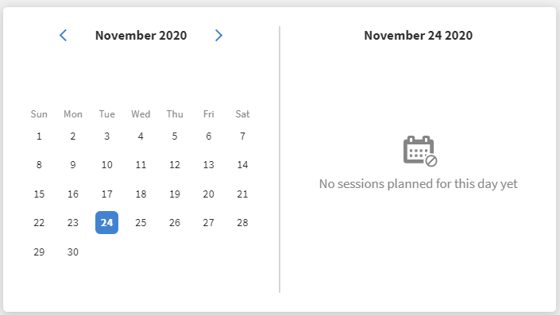

# Teilnehmer-Startseite

## Übersicht {#overview}

Nachdem der Administrator ein immersives Layout aktiviert hat, erhält der Teilnehmer bei der Anmeldung in der App eine komplett überarbeitete Benutzeroberfläche.

>[!NOTE]
>
>Der IE11-Browser unterstützt kein immersives Layout.

## Neue UI für Lernende für immersives Layout

>[!IMPORTANT]
>
>Wir werden die benutzeroberfläche für neue Teilnehmer in Phasen freigeben.

Wir haben die Benutzeroberfläche der Teilnehmer mit einem eleganteren und aktualisierten Design aktualisiert. Die neue Benutzeroberfläche soll für ein konsistentes Anwendererlebnis auf **[!UICONTROL den Landingpages &quot;Learner Home]**&quot;, **[!UICONTROL &quot;My Learning]**&quot;, **[!UICONTROL &quot;Catalog]**&quot; und **[!UICONTROL &quot;Course Overview&quot;]** sorgen. Die neuen visuellen Elemente folgen aktuellen Design-Stilen, sodass das Produkt einfacher zu bedienen und attraktiver wirkt. Dieses Update enthält einen neuen Kopf, ein Seitenfenster und moderne Widgets.

>[!NOTE]
>
>Die überarbeitete Benutzeroberfläche gilt nur für immersives Layout. Das Mobile Web/App unterstützt diese Änderungen noch nicht und wird sie in einem zukünftigen Release aktualisieren.

_Alte Benutzeroberfläche_

_Neue Benutzeroberfläche_

### Homepage

Die Homepage hat ein neues Design mit einem verbesserten Seitenfenster, oberen Kopfzeilen, erweiterten Kurskarten und Widgets.

_Neue Homepage_

### Katalogseite

Die Katalogseiten haben einen neuen Look mit organisierten Filtern und erweiterten Kurskarten, um ein besseres Anwendererlebnis zu bieten.

_Katalogseite_

### Seite „Kursübersicht“

Die Kursübersicht hat einen neuen Look mit mehr Details zum Kurs. Diese Seite hilft Teilnehmern, alle informationen zu erhalten, die sie benötigen.

_Kursüberblick_

### Kurskarten

Kurskarten verfügen außerdem über ein überarbeitetes Layout, um Details effektiver anzuzeigen. Überarbeitete Kurskarten zeigen relevante Metadaten an, die für die Anmeldung erforderlich sind. Diese Metadaten umfassen korrekte Veröffentlichungs- oder Fälligkeitsdaten, Bewertungen und Beschreibungen zusammen mit ihren Autoren oder Anbietern.

_Alte Kurskarte_

_Neue Kurskarte_

Bei Kursen, die aus **LinkedIn und der** Go1-Plattform **importiert werden, werden die ursprünglichen Veröffentlichungsdaten von** LinkedIn **und** Go1 **** angezeigt. Sie können diese spezifischen Veröffentlichungstermine auch auf der Benutzeroberfläche anzeigen.

### Seitenleiste und Suchleiste

Die Seitenleiste wird mit neuen UI-Elementen aktualisiert, um einen saubereren Look zu erzielen. Die neue Suchleiste verfügt über keinen Such-Button, sodass er sauberer aussieht. Teilnehmer können ein Keyword eingeben und die Eingabetaste drücken, um die Suche zu starten oder die Ergebnisse unterhalb der Suchleiste auszuwählen.

_Seitenleiste und Suchleiste_

### Mastertitel {#masthead}

Enthält ein Video- oder Bildkarussell mit eingebettetem URL. Der [Administrator kann jedes Bild oder Video-Asset](../../administrators/feature-summary/announcements.md#masthead) als Ausgangspunkt hochladen und seine Sichtbarkeit für eine Gruppe von Teilnehmern festlegen.

*Kopf anzeigen*

### Meine Lernliste {#mylearninglist}

Zeigt die Schulung an, die der Teilnehmer absolviert hat. Diese Schulungen werden als horizontale Karten dargestellt. Klicke auf die Schaltfläche rechts oder links, um die Kurse zu durchsuchen.

*Meine Lernliste anzeigen*

Du kannst auch nach links und rechts wischen, um durch die Liste zu navigieren.

Um einen Kurs fortzusetzen, klicke auf &quot;Fortfahren&quot; **** auf einer Karte, und der Player wird gestartet.

Das Erscheinungsbild von Icons auf jeder Schulungskarte wird vom Administrator über die Admin-App aktiviert/deaktiviert (**Einstellungen** > **Allgemein** > **Icons** für Schulungskarten aktivieren).

**Zu meiner Lernliste hinzufügen**

Wenn Sie den Mauszeiger in **Empfehlungen basierend auf Ihren Interessenbereichen** und **Empfehlungen basierend auf Peer-Aktivitätslisten** auf eine Kurskarte bewegen, wird eine Option angezeigt, um den Kurs zu **Meine Lernliste** hinzuzufügen. Klicke auf die Kurskarte auf **[!UICONTROL +]** und der Kurs wird zur **My Learning List** hinzugefügt.

*Zu meiner Lernliste hinzufügen*

## Auswählen von Qualifikationsstufen {#chooseskilllevels}

Als Teilnehmer können Sie den Kurskatalog nach folgenden Stufen filtern:

* Anfänger
* Fortgeschrittene
* Experten

Wenn Sie eine Option auswählen, können Sie den Kurskatalog entsprechend der Auswahl anzeigen.

*Kompetenzstufen auswählen*

## Compliance-Dashboard-Widget

Das Compliance-Dashboard-Widget ermöglicht es Teilnehmern, Kurse/Lernpfade/Zertifizierungen mit anstehenden Terminen mithilfe des Compliance-Labels zu filtern. Diese Funktion ist für alle Teilnehmerprogramme verfügbar, einschließlich ALM Teams-App, AEM, Mobile App, Immersive und SF-App.

_Compliance-Dashboard-Widget_

## Kalender {#calendar}

Zeigt Ihre geplanten Sitzungen und Schulungen an. Durchsuche den Kalender, um die Schulungen für die nächsten Monate zu sehen.

*Kalender für terminierte Sessions anzeigen*

Das Kalender-Widget bietet die folgenden Funktionen. Sie können Folgendes anzeigen:

* Schulung nach Monat. Scrollen Sie nach links oder rechts.
* Bevorstehende Schulung im Schulungsraum oder VC-Schulung, für die Sie sich registrieren können.
* Bevorstehende Schulung im Schulungsraum oder VC-Schulung, für die Sie sich registriert haben.
* Vom Manager genehmigte Schulung im Schulungsraum oder VC-Schulung.

## Sozialer Feed {#socialfeed}

*Social-Feed anzeigen*

Sehen Sie, worüber andere Benutzer sprechen.

Das Widget fasst die Aktivität für einen Zeitraum zusammen. Im Einzelnen:

* Es zeigt aktive Benutzer und Aktivitäten der Benutzer an, die sich in Ihrem Bereich oder Ihrer Gruppe befinden.
* Es zeigt Beiträge an, die in den letzten zwei Wochen erstellt wurden.

## Profilkenntnisse {#profileskills}

Profilkenntnisse werden für Kursempfehlungen verwendet. Wenn der Administrator einem Benutzer oder einer Gruppe von Benutzern Kenntnisse zuweist, werden die Kenntnisse den Profilkenntnissen des Teilnehmers hinzugefügt. Wenn der Teilnehmer seinem Profil eine Kenntnis hinzufügt, werden alle Stufen der Kenntnis den Profilkenntnissen des Teilnehmers hinzugefügt. Wenn ein Teilnehmer den Mauszeiger über eine Kenntnis bewegt, kann er den Namen der Kenntnis, die Methode zum Hinzufügen der Kenntnis, die Stufe, den Prozentsatz der Durchführung des Kenntniserwerbs und Credits sehen.

*Profilfähigkeiten anzeigen*

Wenn sich ein Teilnehmer für einen Kurs registriert, werden nur die externen Kenntnisse, die auf einer Punktzahl basieren, den Profilkenntnissen hinzugefügt. Darüber hinaus kann ein Teilnehmer sein Profil durchsuchen, auswählen und externe Fähigkeiten hinzufügen. Wenn sich ein Teilnehmer zum ersten Mal bei der Teilnehmer-App angemeldet hat und die Fähigkeiten des Teilnehmers bereits vorhanden sind, werden die Fähigkeiten in &quot;Mein Profil&quot; angezeigt.

## Empfehlung basierend auf Ihrem Interessensbereich {#recommendationbasedonyourareaofinterest}

Zeigt Schulungen basierend auf Ihrem ausgewählten Interessensbereich an. Die Empfehlung basiert auf einem Machine-Learning-Algorithmus.

*Empfohlene Kurse anzeigen*

Um zielgerichtetere Empfehlungen zu erhalten, kannst du deine Skills aktualisieren, indem du auf **Ansicht/Aktualisierung** klickst.

Nachdem Sie Kenntnisse hinzugefügt haben, werden zukünftige Empfehlungen zielgerichteter und auf Ihre Voreinstellungen konzentriert sein.

Wenn der Administrator die Option **Neue Fähigkeiten erschließen** deaktiviert hat, können Sie Ihren Kenntnissen Interesse hinzufügen.

Die empfohlenen Kurse werden als Karten angezeigt. Wenn du mit der Maus eine Karte bewegst, siehst du weitere Details des Kurses.

Produktterminologie wird ebenfalls unterstützt.

**Branchenspezifische Qualifikationen**

Wenn der Administrator in der Admin-App die Option **Branchenspezifisch** aktiviert hat, wird das Netzwerkdiagramm angezeigt.

Diese Kenntnis kann nur angezeigt werden, wenn der Administrator für den Schulungstyp „Branchenspezifisch“ festlegt.

In der Kenntnisdiagramm-Visualisierung können Sie nach einer Qualifikation oder Qualifikationen suchen und diese hinzufügen.

*Visualisierung von Kompetenz-Maps*

Aktiviere die Option **&quot;Skills anzeigen&quot;, für die Schulungen in meinem Konto** verfügbar sind, wenn du alle Skills in deinem Konto anzeigen möchtest.

Nachdem Sie eine Qualifikation hinzugefügt haben, können Sie das ausgerichtete Diagramm mit der ausgewählten Qualifikation als primärem Scheitelpunkt und den zugehörigen Kenntnissen als kleinere Scheitelpunkte sehen.

Die ausgewählten Kenntnisse werden auch im Abschnitt **Ausgewählte Kenntnisse** angezeigt.

*Ausgewählte Skills*

Um die Qualifikationen hinzuzufügen, klicken Sie auf **[!UICONTROL Hinzufügen]**.

## Empfehlung auf der Grundlage von Peer-Aktivitäten {#recommendationbasedonpeeractivity}

Zeigt Schulungen an, die von Kollegen absolviert wurden. Dies wird wiederum von einem Machine Learning-Algorithmus gesteuert. Die Empfehlungen basieren auf Schulungen für Teilnehmer, die auf der Ausrichtung auf kundenspezifische und branchenspezifische Anforderungen ausgerichtet sind.
