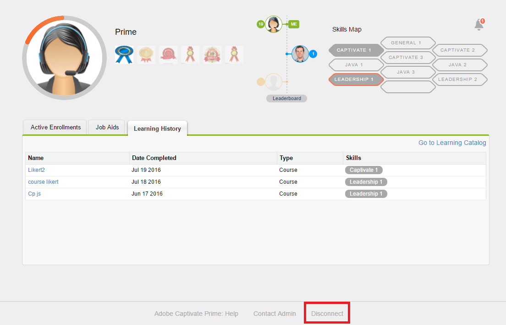

# Learning Manager-App für Salesforce

## Überblick {#overview}

Salesforce™ ist die beliebteste CRM-Lösung unter Vertriebs- und Marketing-Teams. Indem Sie die Adobe Learning Manager-App in Salesforce verwenden, ermöglichen Sie ihren Benutzern den Zugriff auf ihre gesamten Lerninhalte direkt über die Salesforce-Benutzeroberfläche. Teilnehmer können über Salesforce auf ihre zugewiesenen Lerninhalte (z. B. Kurse, Lernprogramme und Arbeitshilfen) zugreifen. Benutzer können außerdem Benachrichtigungen über ihre Registrierungen und Ankündigungen vom Administrator erhalten.

Diese App steht Ihnen in Salesforce nur dann zur Verfügung, wenn der Administrator Ihres Learning Manager-Kontos die erforderlichen Einrichtungen abgeschlossen hat. Weitere Informationen finden Sie unter [Learning Manager-App für Salesforce](../../integration-admin/feature-summary/sfdc-app.md) und bitten Sie Ihren Administrator, die Learning Manager-App für Salesforce zu installieren.

## App in Salesforce suchen {#locateappinsalesforce}

Als Teilnehmer können Sie auf das Dropdown-Menü **Apps** in der rechten Ecke der Seite klicken und Adobe Learning Manager auswählen.

Wenn Sie die App nicht in der Dropdownliste finden können, wenden Sie sich an Ihren Salesforce-Administrator.

Sobald Sie die App ausgewählt haben, können Sie wie im folgenden Screenshot gezeigt zur Adobe Learning Manager-App wechseln.

<!---->

## Anmelde- und Nutzungshinweise {#loginandusageinstructions}

Klicken Sie in der Adobe Learning Manager auf **[!UICONTROL Mit dem Learning Manager verbinden]**, wie im obigen Screenshot gezeigt, und melden Sie sich mit Ihren Learning Manager-Kontoanmeldeinformationen an.

Sie können eine Verbindung zur Learning Manager-App herstellen und diese in Salesforce verwenden.

Alternativ dazu können Sie sich auch in Salesforce über die Adobe Learning Manager-Benachrichtigungskomponente im linken Teilfenster der Startseite beim Learning Manager-Konto anmelden. Teilnehmer können diese Komponente nur anzeigen, wenn der Administrator die Adobe Learning Manager-Benachrichtigungskomponente in Salesforce konfiguriert.

Ein repräsentativer Screenshot der Teilnehmeransicht der Adobe Learning Manager-App wird unten als Referenz gezeigt.

*Ansicht der Adobe Learning Manager-App*

## Trennen von der App {#disconnectfromtheapp}

Sie können auf den Link „Verbindung trennen“ unten auf der Teilnehmerseite klicken, wie im obigen Screenshot markiert, um die Verbindung zur Adobe Learning Manager-App zu **Trennen**. Sobald Sie die Verbindung trennen, werden Sie auf die Startseite der Adobe Learning Manager-App weitergeleitet.

Sie können die Verbindung zur App beliebig oft herstellen oder trennen.

## Empfehlungen in der Salesforce-App zurücksetzen

Teilnehmer können ihre Rollen und Lernvoreinstellungen zurücksetzen, ohne Salesforce verlassen oder sich bei der nativen Adobe Learning Manager-App anmelden zu müssen. Die Adobe Learning Manager Salesforce-App enthält jetzt die Schaltfläche **[!UICONTROL Interessen zurücksetzen]**.

So setzen Sie die Interessen und Empfehlungen aus der Salesforce-App zurück:

1. Melden Sie sich als Teilnehmer bei der Adobe Learning Manager-App für Salesforce an.
2. Wählen Sie unten die Option **[!UICONTROL Interessen zurücksetzen]**.

Die Empfehlung oder das Interesse des Teilnehmers wird über die Adobe Learning Manager Salesforce-App zurückgesetzt.
