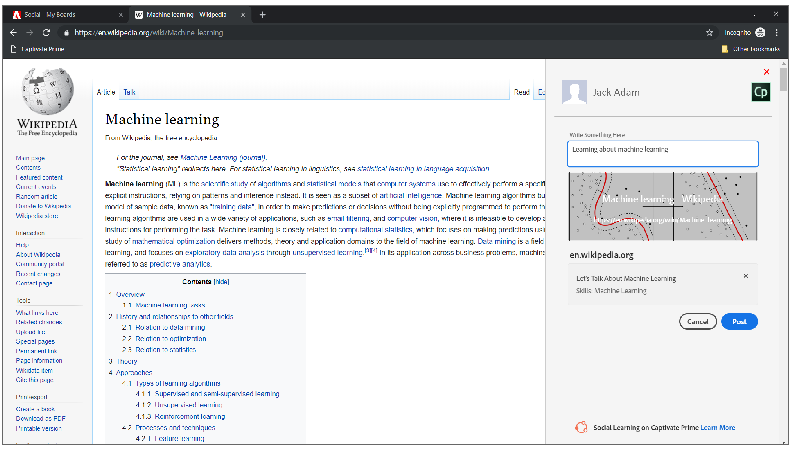

# Teilen auf Soziales Lernen

Erfahren Sie, wie Sie das Social Bookmark-let verwenden, um die Online-Lernergebnisse eines Benutzers sofort im Social Web zu teilen.

&quot;Teilen auf Soziales Lernen&quot; ist ein Bookmarklet, mit dem Teilnehmer ihre Online-Lernergebnisse wie Webseiten und Blogs mit ihren Kollegen teilen können. Diese Funktion wird nur in Desktop-Browsern unterstützt.

Wenn Sie auf dieses Lesezeichen in der Lesezeichenleiste klicken, wird es als Popup-Fenster mit oder innerhalb der Webseite geöffnet, je nachdem, welcher Browser freigegeben werden soll.

<!---->

Stellen Sie sicher, dass Sie Popup-Fenster in Ihrem Browser zulassen.

Wenn Sie bei Learning Manager angemeldet sind, meldet sich das Bookmarklet automatisch bei Ihrem Konto an. Andernfalls müssen Sie sich mit Ihren Learning Manager-Anmeldedaten als Teilnehmer anmelden.

Fügen Sie eine Beschreibung für Ihren Beitrag hinzu und wählen Sie dann das Board aus, in dem Sie Beiträge veröffentlichen möchten, und klicken Sie auf **[!UICONTROL Post]**. Das Board wird auf Ihrem Dashboard veröffentlicht, das angezeigt werden kann, indem Sie auf klicken **Zum Beitrag**.

## Teilen zu sozialem Lesezeichen hinzufügen - links auf der Lesezeichenleiste {#addsharetosocialbookmarklettothebookmarksbar}

**Gehen Sie wie folgt vor, um dieses Lesezeichen der Lesezeichenleiste in Ihrem Browser hinzuzufügen:**

1. Stellen Sie sicher, dass die Registerkarte &quot;Lesezeichen&quot; im Browser aktiviert ist.
1. Melden Sie sich als Teilnehmer beim Learning Manager an.
1. Klicken Sie im linken Navigationsbereich auf Soziales Lernen . Wenn es nicht sichtbar ist, wenden Sie sich an Ihren Administrator.
1. Ziehen Sie die **Teilen auf Sozial** -Symbol in der Lesezeichenleiste Ihres Browsers.

   Drag-and-Drop funktioniert in Mac und Microsoft Edge unter Windows nicht mit wenigen Browsern wie Chrome. Weitere Informationen: [hier klicken](share-to-social.md#add%20bookmarkl-let%20manually).

   <!---->

## Aktivieren der Lesezeichenleiste auf verschiedenen Browsern {#enablingthebookmarksbarondifferentbrowsers}

## Chrome {#chrome}

* Klicken Sie auf die Hauptmenüschaltfläche, die durch drei Punkte in der oberen rechten Ecke des Browserfensters dargestellt wird.
* Wählen Sie Einstellungen aus dem Dropdown-Menü aus. Sie können auch den Einstellungsbildschirm öffnen, indem Sie **chrome://settings** in die Adressleiste des Browsers ein.
* Gehen Sie zum Abschnitt Erscheinungsbild, der die Option Lesezeichenleiste zusammen mit einem Kontrollkästchen anzeigen enthält. Um sicherzustellen, dass die Lesezeichenleiste immer angezeigt wird, wenn Sie eine Seite laden, aktivieren Sie das Kontrollkästchen, indem Sie einmal darauf klicken. Um diese Funktion zu deaktivieren, entfernen Sie einfach das Häkchen.

## Mozilla Firefox {#mozillafirefox}

* Klicken Sie auf die Menüschaltfläche und wählen Sie &quot;Anpassen&quot;.
* Klicken Sie am unteren Bildschirmrand auf das Dropdown-Menü &quot;Symbolleisten&quot;, und wählen Sie die Lesezeichen-Symbolleiste aus.
* Klicken Sie auf Fertig.

## Internet Explorer {#internetexplorer}

* Klicken Sie mit der rechten Maustaste auf das Einstellungssymbol in der oberen rechten Ecke des Browsers. Oder verwenden Sie **Alt + C** auf der Tastatur, damit das Fenster der Favoritenleiste geöffnet wird.
* Um die Favoritenleiste im Browser sichtbar zu machen, klicken Sie auf **[!UICONTROL Favoritenleiste]**.

## Microsoft Edge {#microsoftedge}

* Klicken Sie auf die Hauptmenüschaltfläche, die durch drei Punkte in der oberen rechten Ecke dargestellt wird, und wählen Sie &quot;Einstellungen&quot; > &quot;Favoritenleiste&quot;.
* Um die Favoritenleiste zu aktivieren, klicken Sie auf den Ein-/Ausschalter.

## Safari {#safari}

* Klicken Sie auf das Menü Ansicht > Favoritenleiste anzeigen. (Tastaturbefehl: **Befehl + Umschalt + B**)

## So fügen Sie Lesezeichen-Lesezeichen manuell der Lesezeichenleiste in verschiedenen Browsern hinzu {#add-bookmark-let-manually}

Um der Lesezeichenleiste manuell Lesezeichen-Lesezeichen hinzuzufügen, klicken Sie mit der rechten Maustaste auf das **Teilen auf Sozial** Symbol > **Verknüpfungsadresse kopieren**, und führen Sie das folgende Verfahren aus:

## Chrome in Mac OS {#chromeinmacos}

1. Klicken Sie in Ihrem Browser auf das ausgeblendete Menüsymbol >  **Lesezeichen** > **Lesezeichen-Manager.**
1. Klicken Sie auf &quot;Lesezeichen&quot; > **Neues Lesezeichen hinzufügen.**
1. Es werden zwei Eingabefelder im Popup-Dialogfeld angezeigt. Geben Sie einen gewünschten Namen für das Lesezeichen ein, z. B. **Teilen auf Sozial** im ersten Feld.
1. Fügen Sie die **In sozialen Medien teilen** Verknüpfungsadresse im zweiten Feld.

## Microsoft Edge unter Windows {#microsoftedgeinwindows}

1. Vergewissern Sie sich, dass Ihre Favoritenleiste sichtbar ist. Klicken Sie mit der rechten Maustaste auf die Favoritenleiste > **Neuen Ordner erstellen**.
1. Um die URL zu Ihrem gewünschten Ordner in der Favoritenleiste hinzuzufügen, klicken Sie auf das Symbol **Lesezeichenhub** Symbol > **Lesezeichensymbol**.
1. Speichern Sie eine beliebige Onlineseite in dem Ordner und benennen Sie sie in &quot;In Social Media freigeben&quot; um.
1. Wählen Sie das Symbol für den Lesezeichen-Hub > In Social Media freigeben > URL bearbeiten.
1. Fügen Sie die Verknüpfungsadresse ein und klicken Sie auf die Schaltfläche &quot;Enter&quot;.
