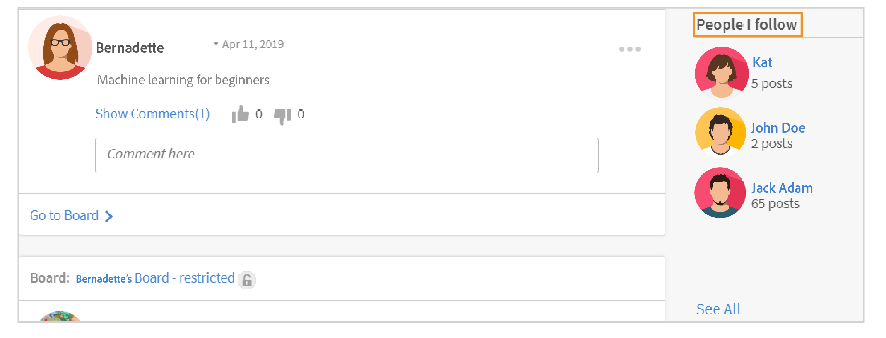
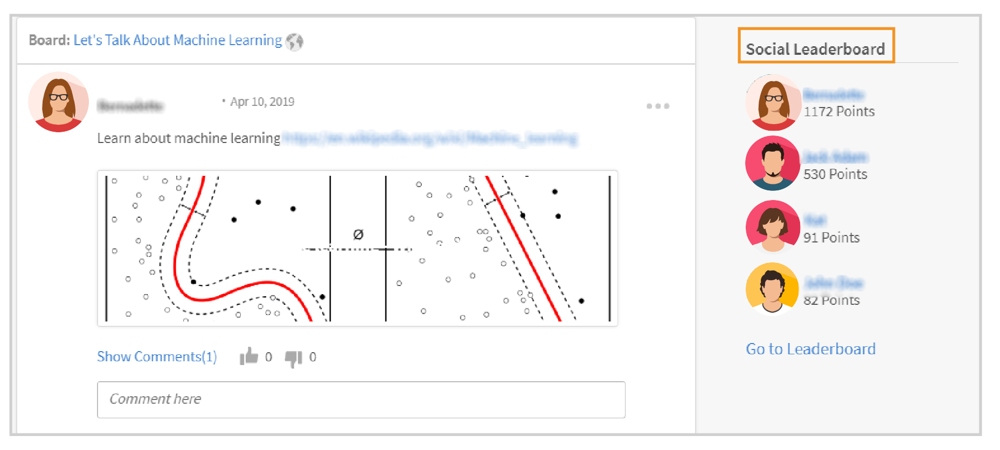
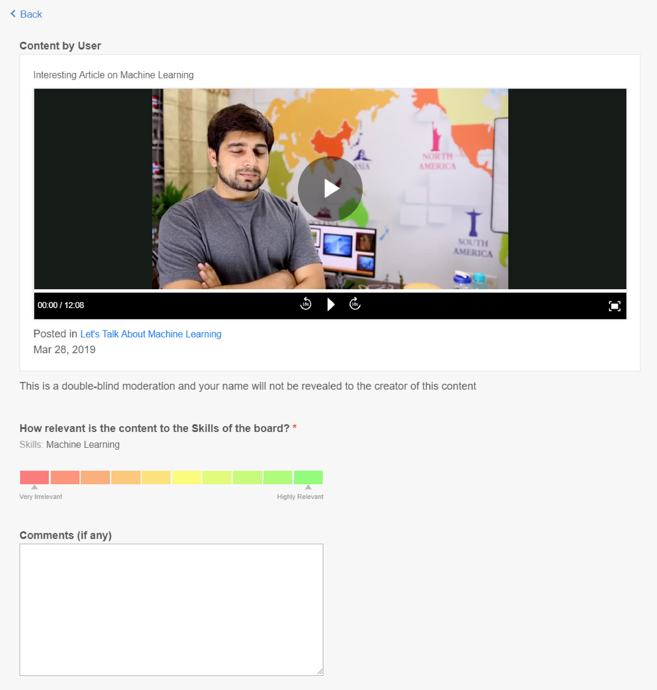

# Soziales Lernen im Learning Manager

Erfahren Sie, wie Sie Soziales Lernen-Web als Teilnehmer verwenden

Soziales Lernen ist eine Plattform im Learning Manager, auf der Benutzer Ideen und wichtige Erkenntnisse in einer informellen Umgebung austauschen können. Es ist eine Methodik, die die Idee des traditionellen Lernens ergänzt. Die Teilnahme an einem Online-Kurs bietet den Benutzern keinen Vorteil, auf sozialer Ebene mit ihren Kollegen zu interagieren.

Durch die bloße Teilnahme an einer Schulung ist nicht gewährleistet, dass die Benutzer alles behalten, was unterrichtet wird. Auf der anderen Seite ermöglicht Soziales Lernen den Benutzern, das Wissen um sich herum zu nutzen, um genau die Informationen zu erhalten, die sie benötigen. Benutzer wiederum können diese Informationen schnell anwenden, um eine Aufgabe abzuschließen und ein Ziel zu erreichen.

In ähnlicher Weise ermöglicht die Learning Manager-Funktion &quot;Soziales Lernen&quot; Benutzern, miteinander zu interagieren, indem sie Inhalte teilen und daraus lernen können.

Auf dieser Plattform können verschiedene Inhalte geteilt werden: Video, Audio, Screenshot, Text, Frage und Umfrage. Benutzer können ihre Online-Lernergebnisse auch mit ihren Kollegen teilen, indem sie die **Bookmarklet &quot;Teilen auf Sozial&quot;**. Weitere Informationen finden Sie unter  [Teilen auf Soziales Lernen](share-to-social.md).

Inhalte können auch in einem Board mithilfe der **Adobe Learning Manager Desktop-Anwendung**. Weitere Informationen finden Sie unter  [Adobe Learning Manager-App für Desktop](../adobe-learning-manager-app-for-desktop.md).

Nur wenn der Administrator Soziales Lernen aktiviert, ist die Funktion für einen Teilnehmer sichtbar.

 

*Lern-Dashboard anzeigen*

<table>
 <tbody>
  <tr>
   <td>
    
<b>Sl Nein.</b>
</td>
   <td>
    
<b>Terminologie oder Konzept</b>
</td>
   <td>
    
<b>Kurze Erklärung</b>
</td>
  </tr>
  <tr>
   <td>
    
1
</td>
   <td>
    
Eigene Boards
</td>
   <td>
    
Ein Board ist <code>
      collection
     </code> von Beiträgen erstellt von einem Benutzer. In meinen Boards werden alle Beiträge angezeigt, an denen der Benutzer teilgenommen, erstellt und verfolgt hat.
</td>
  </tr>
  <tr>
   <td>
    
2
</td>
   <td>
    
Alle Boards
</td>
   <td>
    
Auf der Seite "Alle Boards" können Benutzer die Boards anzeigen, die von allen Teilnehmern erstellt wurden, die den Aktivitätsbereich gemeinsam nutzen.
</td>
  </tr>
  <tr>
   <td>
    
3
</td>
   <td>
    
Kommentar
</td>
   <td>
    
Benutzer können in Foren erstellte Beiträge kommentieren und anzeigen. 
</td>
  </tr>
  <tr>
   <td>
    
4
</td>
   <td>
    
Antwort
</td>
   <td>
    
Benutzer können auf Kommentare antworten, die zu Beiträgen in einem Board gemacht wurden.
</td>
  </tr>
  <tr>
   <td>
    
5
</td>
   <td>
    
Upvote/Downvote
</td>
   <td>
    
Klicken Sie auf die Schaltfläche "Aufwerten" und "Abstimmen", um einen Beitrag zu mögen oder nicht zu mögen.
</td>
  </tr>
  <tr>
   <td>
    
6
</td>
   <td>
    
Soziales Leaderboard
</td>
   <td>
    
Im sozialen Leaderboard können Benutzer die Namen der Teilnehmer mit der Anzahl der Punkte anzeigen, die sie durch die Teilnahme am sozialen Lernen erworben haben.
</td>
  </tr>
  <tr>
   <td>
    
7
</td>
   <td>
    
Leute, denen ich folge
</td>
   <td>
    
Hier können Benutzer die Namen anderer Teilnehmer anzeigen, denen sie folgen, und die Anzahl der von ihnen erstellten Beiträge.
</td>
  </tr>
  <tr>
   <td>
    
8
</td>
   <td>
    
Beliebte Kenntnisse
</td>
   <td>
    
In den Abschnitten "Alle Boards" können die von Teilnehmern häufig verwendeten Kenntnisse zusammen mit der Anzahl der Beiträge angezeigt werden, die sie mit diesen Kenntnissen erstellt haben.
</td>
  </tr>
  <tr>
   <td>
    
9
</td>
   <td>
    
In sozialen Medien teilen
</td>
   <td>
    
"Teilen auf Sozial" ist ein Bookmarklet, mit dem Benutzer ihre Online-Lernergebnisse wie Webseiten und Blogs direkt in Learning Manager Social Learning teilen können.
</td>
  </tr>
  <tr>
   <td>
    
10
</td>
   <td>
    
Neuer Beitrag
</td>
   <td>
    
Mit der neuen Schaltfläche "Beitrag" können Benutzer Inhalte in Boards erstellen und veröffentlichen.
</td>
  </tr>
 </tbody>
</table>

## Inhalte als Beitrag erstellen {#creatingcontentasapost}

Der Inhalt wird als Beitrag in einem Board erstellt. Um einen Beitrag zu erstellen, führen Sie die folgenden Schritte aus:

1. Klicken **[!UICONTROL Neuer Beitrag].**

   
   *Neuen Beitrag auswählen*

1. Wählen Sie einen der folgenden Inhaltstypen aus, die veröffentlicht werden sollen: Text, Frage, Video, Audio, Umfrage und Screenshot. Bestehende Inhalte können vom Benutzersystem oder aus der Galerie der Adobe Learning Manager-Desktop-Anwendung hochgeladen werden.

   Verwenden Sie den Adobe Learning Manager-Client, um ein Video oder einen Bildschirm und Audio aufzuzeichnen und einen Screenshot zu erstellen. Weitere Informationen finden Sie unter [Adobe Learning Manager Desktop-Anwendung](../adobe-learning-manager-app-for-desktop.md).

   <!---->

1. Suchen Sie nach einem Board oder Kenntnissen, die sich auf den Beitrag beziehen. Wenn das Board nicht vorhanden ist, klicken Sie auf **[!UICONTROL Neues Board erstellen]**.

   

   *Board erstellen*

   Wenn Sie ein externer oder interner Benutzer sind und der Administrator Ihnen Zugriff zum Erstellen eines Boards gewährt hat, können Sie ein Board erstellen. Wenn Sie nicht über die Berechtigung zum Erstellen eines Boards verfügen, wird der Link **Neues Board erstellen** wird nicht angezeigt.

1. Geben Sie im Popup-Dialogfeld die Details ein und wählen Sie den folgenden Board-Typ aus:

   * **Öffentlich** - Die Teilnahme und Sichtbarkeit der Beiträge steht allen Benutzern zur Verfügung.
   * **Privat** - Der Beitrag ist nur für den Ersteller des Boards, Moderatoren und Benutzer, die dem Board hinzugefügt wurden, sichtbar.
   * **Beschränkt** - Nur der Board-Eigentümer, der Administrator und Board-Moderatoren können Beiträge erstellen. Andere Benutzer können durch Kommentieren/Antworten, Aufwertung/Abwertung usw. teilnehmen.

   <!---->

   >[!NOTE]
   >
   >In der &quot;Social Learner&quot;-App gibt es nur eine **Administrator** kann ein privates Board mit (internen/externen) Benutzergruppen erstellen.
   >
   >Alle anderen Benutzer außer Administrator, Autor, Teilnehmer, Manager, Kursleiter usw. **kann** Erstellen Sie private Boards mit Benutzergruppen. Sie können den Abschnitt der **Benutzergruppen** in während der Schaffung von privaten Board.

   Nur Administrator: Wenn Sie **Privat** werden zwei Optionen angezeigt: **Benutzer** und **Benutzergruppen**. Wählen Sie die Option **Benutzergruppen** und fügen Sie dann die Benutzergruppen hinzu, für die Sie das private Board freigeben möchten.

   Im Feld &quot;Benutzergruppen&quot; können Sie interne, externe oder benutzerdefinierte Gruppen auswählen. Ihr privates Board ist dann unabhängig von den Bereichseinstellungen für alle angegebenen Benutzergruppen sichtbar.

1. Um Inhalte freizugeben, klicken Sie auf **[!UICONTROL Post]**. Wenn Sie auf &quot;Beitrag&quot; klicken, erhält der Benutzer eine Benachrichtigung.

   Der Inhalt wird basierend auf der Kurationseinstellung veröffentlicht, die vom Administrator für Inhalte für Soziales Lernen festgelegt wurde, die von kuratiert werden kann  [Board-Moderatoren/Fachexperten](social-learning-web-user.md#HowtobecomeaSubjectMatterExpertSME).

   <!---->

1. Benutzer erhalten Benachrichtigungen, wenn ihr Beitrag genehmigt oder abgelehnt wurde, wenn der Administrator die Kurationseinstellung auf &quot;Manuelles Kuratieren&quot; festgelegt hat. Wenn der Beitrag abgelehnt wird, klicken Sie auf die Schaltfläche **Klicken, um zu überprüfen** Hyperlink zu den Kommentaren der Board-Moderatoren oder Fachexperten (SMEs).

   Von Benutzern erstellte Inhalte werden von Board-Moderatoren oder Fachexperten kuratiert.

   <!---->

Wenn Sie einen Beitrag in Soziales Lernen erstellen oder darauf antworten, können Sie einen Beitrag mit dem Rich-Text-Editor verfassen und verschiedene Formatierungstypen anwenden.

*Verwenden des Rich-Text-Editors zum Erstellen eines Beitrags*

Darüber hinaus haben Sie beim Erstellen eines Boards im Rich-Text-Editor Zugriff auf dieselben Optionen.

*Verwenden des Rich-Text-Editors zum Erstellen eines Beitrags*

## Anzeigen genehmigter Inhalte {#viewingapprovedcontent}

Sobald ein Beitrag genehmigt wurde, wird er in einem Board für Soziales Lernen angezeigt. Benutzer können jetzt den Beitrag kommentieren, antworten, einen Kommentar abgeben oder einen Kommentar abgeben.

Benutzer können den folgenden Inhaltstyp verwenden, um einen Kommentar abzugeben: Bildschirm aufzeichnen, Webcam oder beides, Audio aufzeichnen, Screenshot erstellen, Datei hochladen, Lernmanager-Galerie.

<!---->

## Inhalt im Sozialen Player {#contentinsocialplayer}

Im Lern-Manager werden Videos, statische Inhalte wie Präsentationen und Bilder im Sozialen Player auf einem Board veröffentlicht. Sie können eine Datei von Ihrem System hochladen, ein Video/einen Bildschirm aufnehmen und mithilfe der Adobe Learning Manager-Desktopanwendung einen Screenshot aufnehmen.

Sobald der Benutzer mit einigen Inhalten fertig ist, kann sie von anderen Teilnehmern in ihrem Aktivitätsbereich angezeigt werden. Im Sozialen Player können Teilnehmer anzeigen, kommentieren/antworten, einen Kommentar abgeben oder Missbrauch melden.

<!---->

**Um einen Kommentar/eine Antwort zu erhalten, geben Sie folgende Schritte ein:**

1. Klicken Sie in der rechten unteren Ecke des Social-Media-Players auf die Schaltfläche für den Vollbildmodus.
1. Um die Steuerelemente des Players auf dem Bildschirm anzuzeigen, klicken Sie auf den nach unten zeigenden Pfeil.
1. Um den Kommentarbereich anzuzeigen, klicken Sie in der linken unteren Ecke des Bildschirms auf das Kommentarsymbol .
1. Benutzer können kommentieren/antworten, einen Kommentar abgeben oder Missbrauch melden.
1. Mit der Esc-Taste beenden Sie den Vollbildmodus.

## Board-Ansicht in Soziales Lernen {#board-view-social}

Ein Teilnehmer kann alle Boards in einer Listenansicht anzeigen. Melden Sie sich bei Ihrer Teilnehmer-App an und klicken Sie auf der Seite &quot;Soziales Lernen&quot; auf die Schaltfläche, wie unten gezeigt:

*Board-Ansicht in Soziales Lernen*

Wenn Sie die Beiträge in einem Board-Format anzeigen, können Sie die Beiträge nach **Post** und **Mitwirkender**.

* Wenn Sie **Beiträge** werden die Boards entsprechend der Anzahl der Beiträge im Board sortiert.
* Wenn Sie **Mitwirkende** werden die Boards entsprechend der Anzahl der Benutzer sortiert, die in den Threads Kommentare abgegeben oder geantwortet haben.

### Kenntnisfilter {#skillfilter}

*Beiträge sortieren*

Mit dem Kenntnisfilter können Sie mehrere Kenntnisse auswählen, um die Boards zu filtern. Sie können die Filter auch löschen, nachdem Sie die Kenntnisse ausgewählt haben.

### Aktivitätsstufenfilter {#activitylevelfilter}

*Filtern von Aktivitätsstufen*

Mit dem Aktivitätsfilter können Sie die Boards entsprechend dem Umfang der Interaktionen in einem Board sortieren. Sie können diese nach folgenden Kriterien sortieren:

* Hohe Aktivität
* Normale Aktivität
* Niedrige Aktivität

In der Board-Ansicht können Sie die üblichen Aktionen auf Board-Ebene ausführen.

<!---->

## Beiträge herunterladen {#downloadposts}

Teilnehmer können den Inhalt mit Anlagen von der Plattform für soziales Lernen herunterladen, sodass sie diesen Inhalt offline verwenden können.

*Beitrag in sozialen Medien herunterladen*

Sie können den Inhalt aus den Bereichen &quot;Beiträge&quot;, &quot;Kommentare&quot; oder &quot;Antworten&quot; herunterladen. Sie können jeweils nur eine Datei herunterladen.

Beide Benutzertypen (intern oder extern) müssen in der Lage sein, den Inhalt herunterzuladen.

Die Schaltfläche Herunterladen kann auch in Suchergebnissen für Beiträge, Kommentare oder Antworten angezeigt werden.

Sie können noch keinen Beitrag in die Geräte-App herunterladen. Diese Funktion wird in Kürze verfügbar sein.

## Unterstützte Inhaltsformate {#supportedcontentformats}

<table>
 <tbody>
  <tr>
   <td>
    
<b>Inhaltstyp</b>
</td>
   <td>
    
<b>Erweiterungen</b>
</td>
  </tr>
  <tr>
   <td>
    
Video
</td>
   <td>
    
wmv, f4v, asf, 3gp, 3g2, avi, mov, h264, m4v, mp4, MPEG, mpg
</td>
  </tr>
  <tr>
   <td>
    
Audio
</td>
   <td>
    
mp3, amr, m4a, wav, wma, aac
</td>
  </tr>
  <tr>
   <td>
    
Statische Dateien
</td>
   <td>
    
PDF, ppt, pptx, doc, docx, xls, xlsx
</td>
  </tr>
  <tr>
   <td>
    
Bild
</td>
   <td>
    
jpg, jpeg, png, bmp, gif
</td>
  </tr>
 </tbody>
</table>

## Board nur für ausgewählte Benutzer sichtbar {#selected-users}

Ein Teilnehmer, der auch ein **admin** kann eine Benutzergruppe zu einem privaten Board hinzufügen. Jede Benutzergruppe kann dem privaten Board hinzugefügt werden und die Benutzer, die der Benutzergruppe angehören, haben nur Zugriff auf das Board.

Wenn der Benutzergruppe ein neuer Benutzer hinzugefügt wird, können beide Benutzer das private Board sehen.

Wenn ein Benutzer aus dem privaten Board entfernt wird, kann der Benutzer das private Board nicht mehr sehen.

Wenn dem privaten Board mehrere Benutzergruppen hinzugefügt werden, erhalten alle Benutzer der Gruppen Zugriff auf die privaten Boards.

<!---->

## Aktionen, die für einen Beitrag ausgeführt werden können {#actionsthatcanbedoneonapost}

Klicken Sie auf das ausgeblendete Menüsymbol in der oberen rechten Ecke eines Beitrags, um seine Optionen anzuzeigen. Die folgende Menüliste wird angezeigt: Bearbeiten, Zu meiner Story hinzufügen, URL kopieren, Löschen und Bericht erstellen.

Nur einige Benutzer haben die Berechtigung, bestimmte Aufgaben auszuführen. Die folgenden Benutzertypen sind Inhaltseigentümer, Board-Moderatoren und der Administrator der Organisation.

<table>
 <tbody>
  <tr>
   <td>
    
<b>Sl Nein.</b>
</td>
   <td>
    
<b>Aktion</b>
</td>
   <td>
    
<b>Erläuterung</b>
</td>
  </tr>
  <tr>
   <td>
    
1
</td>
   <td>
    
Bearbeiten
</td>
   <td>
    
Bearbeiten ermöglicht dem Ersteller des Inhalts, seinen Beitrag zu korrigieren oder zu ändern.
</td>
  </tr>
  <tr>
   <td>
    
2
</td>
   <td>
    
Zu meiner Story hinzufügen
</td>
   <td>
    
Eine Story ist eine Sammlung von Inhalten, die von einem Benutzer kuratiert werden. Benutzer können die Sichtbarkeit des Inhalts auf "Privat" oder "Öffentlich" festlegen.
</td>
  </tr>
  <tr>
   <td>
    
3
</td>
   <td>
    
URL kopieren
</td>
   <td>
    
Mit dieser Option können alle Benutzer die URL eines Boards oder Beitrags kopieren und freigeben.
</td>
  </tr>
  <tr>
   <td>
    
4
</td>
   <td>
    
Löschen
</td>
   <td>
    
Mit der Option Löschen wird der Beitrag nach Bestätigung durch den Benutzer entfernt.
</td>
  </tr>
  <tr>
   <td>
    
5
</td>
   <td>
    
Bericht
</td>
   <td>
    
Jeder Benutzer hat die Berechtigung, einen Missbrauch eines Beitrags zu melden, wenn er gegen seine Privatsphäre verstößt oder sein Inhalt unangemessen ist.

    
Sobald ein Beitrag gemeldet wurde, wird eine Benachrichtigung an den Board-Administrator und die Moderatoren für weitere Aktionen gesendet.
</td>
  </tr>
 </tbody>
</table>

**Zu meiner Story hinzufügen**

&quot;Soziale Story&quot; ermöglicht Benutzern das Hinzufügen oder Erstellen von Storys mit Beiträgen, die von ihnen oder anderen Benutzern erstellt wurden.

Um einen Beitrag zu einer Story hinzuzufügen, führen Sie die folgenden Schritte aus:

1. Klicken Sie auf das ausgeblendete Menüsymbol in der oberen rechten Ecke eines Beitrags, und klicken Sie auf **[!UICONTROL Zu meiner Story hinzufügen]**.

   

   *Einer Story hinzufügen*

1. Im Fenster &quot; **Textabschnitt auswählen** eine relevante Story aus, um den Beitrag hinzuzufügen. Wenn keine relevanten Storys vorhanden sind, erstellen Sie eine Story, indem Sie auf **Neue Story**.

   

   *Eine Story erstellen.*

1. Füllen Sie im Dialogfeld &quot;Neue Story&quot; die Felder &quot;Story-Name&quot; und &quot;Beschreibung&quot; aus. Sie können die Sichtbarkeit der Story auch auf &quot;Öffentlich&quot; oder &quot;Privat&quot; festlegen.

   

   *Textabschnittsnamen und Beschreibung hinzufügen*

   Klicken Sie zum Anzeigen der von Benutzern erstellten Storys in den Profilmenüoptionen auf den Benutzernamen.

## Benutzerberechtigungen zum Ausführen der Aktionen für einen Beitrag {#userprivilegesforperformingtheactionsonapost}

<table>
 <tbody>
  <tr>
   <td>
    
 
</td>
   <td>
    
<b>Inhaltseigentümer</b>
</td>
   <td>
    
<b>Beliebiger Benutzer</b>
</td>
   <td>
    
<b>Board-Moderatoren</b>
</td>
   <td>
    
<b>Administrator</b>
</td>
  </tr>
  <tr>
   <td>
    
<b>Bearbeiten</b>
</td>
   <td>
    
Ja
</td>
   <td>
    
Nein
</td>
   <td>
    
Nein
</td>
   <td>
    
Nein
</td>
  </tr>
  <tr>
   <td>
    
<b>Zu meiner Story hinzufügen</b>
</td>
   <td>
    
Ja
</td>
   <td>
    
Ja
</td>
   <td>
    
Ja
</td>
   <td>
    
Ja
</td>
  </tr>
  <tr>
   <td>
    
<b>URL kopieren</b>
</td>
   <td>
    
Ja
</td>
   <td>
    
Ja
</td>
   <td>
    
Ja
</td>
   <td>
    
Ja
</td>
  </tr>
  <tr>
   <td>
    
<b>Löschen</b>
</td>
   <td>
    
Ja
</td>
   <td>
    
Nein
</td>
   <td>
    
Ja
</td>
   <td>
    
Ja
</td>
  </tr>
  <tr>
   <td>
    
<b>Bericht</b>
</td>
   <td>
    
Ja
</td>
   <td>
    
Ja
</td>
   <td>
    
Ja
</td>
   <td>
    
Ja
</td>
  </tr>
 </tbody>
</table>

## Anzeigen von Inhalten in Boards {#viewingcontentinboards}

Boards sind eine Sammlung von Beiträgen. Jedes Board im Sozialen Lernen basiert auf Kenntnissen. Im Sozialen Lernen können Benutzer die **Alle Boards** und **Eigene Boards** angezeigt.

Auf der Seite &quot;Alle Boards&quot; sind Beiträge oder Boards sichtbar, die von allen Benutzern in einem Aktivitätsbereich erstellt wurden. Auf der Seite &quot;Eigene Boards&quot; sind jedoch nur Boards sichtbar, die von einem Benutzer erstellt, gefolgt und bei denen ein Benutzer teilgenommen hat.

Auf der Seite &quot;Eigene Boards&quot; können die sichtbaren Boards nach folgenden Kriterien gefiltert werden: **Alle**, **Erstellt von mir**, **Kommentiert von mir**, **Gefolgt von mir**.

*Sichtbare Boards filtern*

In &quot;Meine Boards&quot; und &quot;Alle Boards&quot;, können Benutzer die Boards nach **Relevanz** oder **Datum**.

*Sortieren Sie Boards nach Relevanz und Datum*

Wenn beim Erstellen eines Beitrags keine relevanten Boards für den Beitrag vorhanden sind, klicken Sie auf [Neues Board erstellen](social-learning-web-user.md#Creatingcontentasapost).  Um eine URL anzuzeigen, zu bearbeiten, zu löschen, zu melden, zu kopieren und ein Board zu Ihrer bevorzugten Boardliste hinzuzufügen, führen Sie die folgenden Schritte aus:

1. Klicken Sie auf den Boardnamen oder klicken Sie auf **[!UICONTROL Zum Board]**.
1. Klicken Sie auf der Boardseite auf das ausgeblendete Menüsymbol und wählen Sie eine Option aus der Dropdown-Liste aus.

   <!---->

**Benutzer können die folgenden Optionen auf einer Boardseite anzeigen:**

* Die Anzahl der Beiträge, Ansichten und Personen, die dem Board folgen, wird auf dieser Seite angezeigt. Der Name des Board-Erstellers und das Erstellungsdatum des Boards werden zusammen mit den Top-SMEs für das Board angezeigt.

* Die Namen der Boards, die der Favoritenliste eines Benutzers hinzugefügt wurden, werden ebenfalls angezeigt.

<!---->

## Teilen auf Sozial {#sharetosocial}

&quot;Teilen auf Sozial&quot; ist ein Bookmarklet, mit dem Benutzer ihre Online-Lernergebnisse wie Webseiten und Blogs direkt auf der sozialen Seite als einen Beitrag teilen können. Weitere Informationen finden Sie unter [Teilen auf Soziales Lernen](share-to-social.md).

*Teilen auf Soziales Lernen*

## Eigene Kenntnisse {#myskills}

Benutzer können die Kenntnisse und die Anzahl der Beiträge oder Boards anzeigen, die mit Kenntnissen auf der Seite &quot;Eigene Boards&quot; erstellt wurden. Um alle Kenntnisse anzuzeigen, die der Benutzer beim Erstellen eines Boards verwendet hat, klicken Sie auf **[!UICONTROL Alle Kenntnisse anzeigen]**.

*Alle Kenntnisse anzeigen*

## Leute, denen ich folge {#peopleifollow}

Auf der Seite &quot;Eigene Boards&quot; können Benutzer die Namen der Personen anzeigen, denen sie folgen, und die Anzahl der von ihnen erstellten Beiträge.

*Personen, denen ein Teilnehmer folgt*

Um anderen Benutzern zu folgen, führen Sie die folgenden Schritte aus:

1. Um die Profilseite eines anderen Benutzers anzuzeigen, klicken Sie auf dessen Namen.
1. Klicken Sie auf die Schaltfläche Folgen/Entfolgen , um die gewünschte Aktion auszuführen.

   

   *Einem Benutzer folgen oder ihm folgen*

## Soziales Leaderboard {#socialleaderboard}

Soziales Leaderboard verbessert die Gamification. Aktivitätspunkte werden Benutzern bei der Erstellung eines neuen Beitrags/Boards, beim Erhalten einer Aufwertung für seinen/ihren Beitrag, bei der Bereitstellung der richtigen Antwort auf eine Frage und bei anderen Beteiligungen am sozialen Lernen vergeben.

Die Gesamtzahl der Punkte und neuen Beiträge für alle Benutzer desselben Bereichs wird in der Liste des sozialen Leaderboards angezeigt. Der Teilnehmer mit der maximalen Punktzahl wird oben in der Liste des sozialen Leaderboards angezeigt, gefolgt von den anderen Teilnehmern.

Klicken **[!UICONTROL Zum Leaderboard]** in der &quot; **Eigene Boards** &quot; alle Teilnehmer und die Anzahl der Punkte an, die sie erhalten haben.

*Alle Teilnehmer anzeigen*

## Aktivitätspunkte {#activitypoints}

Die Anzahl der den Benutzern zugewiesenen Aktivitätspunkte basiert auf den durchgeführten sozialen Aktivitäten.

**Aktivitätspunkte werden an Benutzer für Folgendes vergeben:**

* 5 Punkte zum Erstellen eines Boards.
* 5 Punkte, um einen Beitrag als Text oder Fragentyp hinzuzufügen.
* 2 Punkte für Kommentare zu jedem Beitrag.
* 1 Punkt wird dem Benutzer zugewiesen, der als erster ein Board verwendet. Benutzer erhalten insgesamt 20 Punkte für die ersten 20 neuen Beiträge in diesem Board.

## So werden Sie Fachexperte (SME) {#howtobecomeasubjectmatterexpertsme}

Ein Fachexperte (SME) ist eine Person, die über das Fachwissen in Bezug auf bestimmte Kenntnisse verfügt. Im Sozialen Lernen für den Lernmanager werden Benutzer basierend auf der maximalen Anzahl von Aktivitätspunkten, die ihnen für Kenntnisse erteilt werden, als SME festgelegt.

Top-SMEs haben das Privileg, die Inhalte von Teilnehmern zu kuratieren, bevor sie in einem Board im Bereich Soziales Lernen veröffentlicht werden.

Der Administrator der Organisation hat auch das Recht, einem Teilnehmer mehr Punkte hinzuzufügen, um ihn zu einem SME für Kenntnisse zu machen.

## Wie kuratiere ich als SME Inhalte? {#howtocuratecontentasasme}

1. Bei der Erstellung eines neuen Beitrags oder eines neuen Boards durch einen Benutzer erhält der SME eine Benachrichtigung, dass ein Beitrag auf einem Board auf Kuration wartet.

   <!---->

1. Um den Beitrag zu moderieren, klicken Sie auf das **Klicken Sie hier, um zu überprüfen** Link. Diese Aktion leitet den SME zur Inhaltsmoderationsseite, die wie im folgenden Screenshot aussieht.

   <!---->

1. Um den Inhalt basierend auf dem Prozentsatz der Relevanz, den er hat, zu bewerten, wählen Sie die Farbe in der Relevanzskala aus. Die erste Farbe wird als irrelevant eingestuft (10 % Relevanz) und die letzte Farbe stellt eine sehr relevante Farbe dar (100 % Relevanz).
1. Es wird empfohlen, dass der SME einen Kommentar auf der Grundlage einer bestimmten Relevanzbewertung eingibt. Benutzer erhalten ein besseres Verständnis, warum ihr Beitrag beim Lesen des Kommentars abgelehnt wird.

<!--## AI-enabled auto curation {#autocuration}-->

## Suchen Sie im formellen und informellen Lernprogramm {#searchinformalandinformallearning}

Jede Seite im Sozialen Lernen verfügt über ein Suchfeld, in dem Benutzer nach Boards, Kenntnissen oder Inhalten suchen können. Suchen Sie durch Eingabe in das Suchfeld und klicken Sie auf das Suchsymbol oder drücken Sie die Eingabetaste auf der Tastatur.

<!---->

Die folgenden Seiten des informellen Lernprogramms verfügen über ein Suchfeld: **Eigene Boards**, **Alle Boards**, **Boards-Seite**, der **Profilseite** und **Profilseite anderer Teilnehmer**.

Wenn ein Benutzer nach Inhalten im informellen Lernen sucht, wird die Gesamtzahl der Suchergebnisse für den Inhalt im informellen und formellen Lernen des Lern-Managers angezeigt.

In ähnlicher Weise wird die Anzahl der im informellen Lernen gefundenen Suchergebnisse angezeigt, wenn Inhalte auf einer Seite für formelles Lernen durchsucht werden.

*Suchergebnisse für learning*

Auf der Seite des informellen Lern-Boards können nur Suchen im Zusammenhang mit dem Board durchgeführt werden. Eine Suche, die sich nicht auf ein Board bezieht, wird nicht angezeigt.

## Benutzerprofil anzeigen {#viewuserprofile}

Wenn Soziales Lernen für einen Teilnehmer aktiviert ist, kann der Benutzer sein Profil anzeigen, indem er auf sein Profilbild in der oberen rechten Ecke von Soziales Lernen und dann auf seinen Namen in der Dropdown-Liste klickt.

*Benutzerprofil anzeigen*

Auf der Profilseite können die Teilnehmer die Gesamtzahl der erzielten Punkte, die Anzahl der erstellten Beiträge und die Anzahl der Follower sehen.

Die Teilnehmer können auch die Kenntnisse anzeigen, für die sie als Fachexperten festgelegt sind.

Die Seite des Teilnehmers zeigt auch die **kuratierte Berichte**, **Neuerscheinungen** durchgeführt und die **Leute folgten** verwenden.

## Benachrichtigungen {#notifications}

Bei der Genehmigung oder Ablehnung eines Beitrags durch SME erhalten Benutzer eine Benachrichtigung, die angezeigt werden kann, wenn Sie auf das Benachrichtigungssymbol in der oberen rechten Ecke des Fensters klicken. Benutzer können Benachrichtigungen zum Sozialen Lernen und zum Formellen Lernen anzeigen.

<!---->
