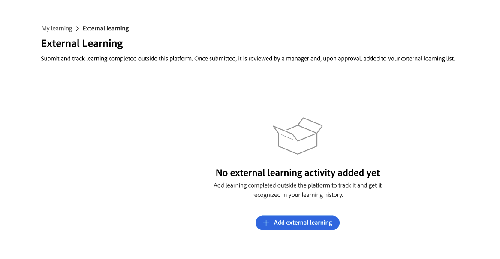
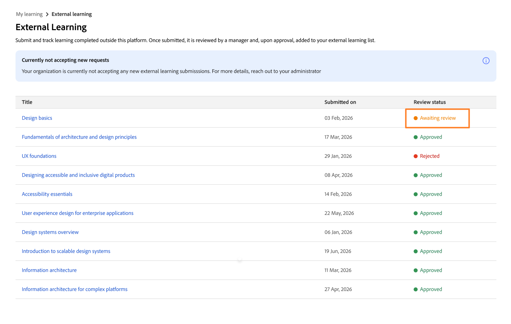

# Externes Lernen als Teilnehmer einreichen

In Adobe Learning Manager können Sie Schulungen, die Sie außerhalb der Plattform absolviert haben, mithilfe der Funktion **Externes Lernen** protokollieren, z. B. einen Workshop, eine Zertifizierungsprüfung, ein Seminar oder einen Online-Kurs. Jede Einreichung wird zur Prüfung an Ihren Vorgesetzten gesendet. Nach der Genehmigung wird die Aktivität in Ihrem Teilnehmertranskript angezeigt.

## Funktionsweise des externen Lern-Einreichungsprozesses

Einreichungen für externe Lernaktivitäten erfolgen in drei Schritten:

1. Sie füllen ein Einreichungsformular mit Details zu der Schulung aus, die Sie abgeschlossen haben, und laden optional einen Nachweis hoch.

2. Ihr Manager erhält eine plattforminterne Benachrichtigung und überprüft Ihre Einreichung.

3. Ihr Manager genehmigt die Anforderung oder lehnt sie ab. Sie erhalten eine plattforminterne Benachrichtigung über die Entscheidung.

Genehmigte Einreichungen werden in Ihrem **Teilnehmertranskript** als abgeschlossene externe Lernaktivitäten angezeigt.

Sie können so viele externe Lernanforderungen senden, wie Sie benötigen. Die Anzahl der Einreichungen ist unbegrenzt.

**Externes Lernen wird in der Navigation gefunden**

Externes Lernen ist in **Eigenes Lernen** in der Hauptnavigation verfügbar. Wählen Sie **Externes Lernen**, um Ihren Übermittlungsverlauf anzuzeigen und neue Übermittlungen zu erstellen.

<!---->

Wenn die Option **Externes Lernen** nicht angezeigt wird, hat Ihr Administrator die Funktion für Ihr Konto möglicherweise nicht aktiviert. Unterstützung erhalten Sie von Ihrem Administrator.

### Externe Lernanforderung senden

1. Wählen Sie in der linken Navigation **Eigenes Lernen** aus.

2. Wählen Sie die Option **Externes Lernen** aus.

3. Wählen Sie **Externes Lernen hinzufügen**.
   

4. Füllen Sie das Einreichungsformular aus:

   1. **Titel:** Geben Sie den Namen der Schulung ein. Dieses Feld ist erforderlich.

   2. **Beschreibung/Anmerkungen:** Fügen Sie Details hinzu, die Ihrem Manager helfen, die Schulung zu verstehen, z. B. den Namen des Anbieters oder die Lernziele.

   3. **Anfangsdatum:** Wählen Sie das Datum aus, an dem die Schulung begonnen hat.

   4. **Enddatum:** Wählen Sie das Datum aus, an dem die Schulung abgeschlossen wurde.

   5. **Dauer:** Geben Sie die Gesamtzeit (in Stunden) ein, die Sie für die Schulung aufgewendet haben.

   6. **Punktzahl:** Geben Sie Ihre Punktzahl ein, wenn die Schulung eine Bewertung enthält.

   7. **Anhänge:** Laden Sie ein Zertifikat, ein Transkript oder ein anderes Dokument als Beweis hoch. Die unterstützten Dateitypen sind PDF, DOC, DOCX, PNG, JPEG und JPG. Die maximale Dateigröße beträgt 50 MB.
      

   8. Füllen Sie alle zusätzlichen benutzerdefinierten Felder aus, die Ihr Administrator konfiguriert hat.

5. Wählen Sie **Senden**.

Ihr Manager erhält eine In-App-Benachrichtigung, dass eine neue externe Lernanforderung auf ihre Überprüfung wartet. Ihre Einreichung wird in Ihrer Liste **Externes Lernen** mit dem Status **Überprüfung wird erwartet** angezeigt.
4<!---->

>[!NOTE]
>
>Sie erhalten eine plattforminterne Benachrichtigung, wenn Ihr Manager Ihre Einreichung genehmigt oder ablehnt.

### Ausstehende Einreichung bearbeiten

Sie können eine Übermittlung bearbeiten, deren Status **Genehmigung wird erwartet**. Sobald Ihr Manager es genehmigt oder ablehnt, können Sie diese Übermittlung nicht mehr bearbeiten.

1. Suchen Sie auf der Registerkarte **Externes Lernen** nach der Übermittlung, die Sie aktualisieren möchten.

2. Wählen Sie die Einreichung aus, um sie zu öffnen.

3. Wählen Sie **Bearbeiten**.

4. Aktualisieren Sie nach Bedarf alle Felder. Das Formular zeigt die neueste Feldkonfiguration an, die von Ihrem Administrator festgelegt wurde. Dies kann Felder enthalten, die bei der ursprünglichen Übermittlung nicht vorhanden waren.

5. Wählen Sie **Senden**.

Ihr Manager erhält eine neue Benachrichtigung und überprüft Ihre aktualisierte Einreichung.

**Wenn Ihre Einreichung abgelehnt wurde:** Sie können eine abgelehnte Einreichung nicht bearbeiten. Um erneut zu senden, erstellen Sie eine neue externe Lernanforderung und verweisen Sie auf Feedback, das Ihr Manager in seinem Prüfkommentar abgegeben hat.

### Übermittlungsstatus des externen Lernprogramms

| **Status** | **Was es bedeutet** | **Können Sie etwas bearbeiten?** |
|-----------------|----------------------------------------------------------------------------------|---------------------------------------------------------|
| Warten auf Überprüfung | Ihre Einreichung steht zur Prüfung durch den Manager aus. | Ja. Wählen Sie **Bearbeiten** auf der Seite mit den Übermittlungsdetails aus. |
| Genehmigt | Ihr Manager hat die Einreichung genehmigt; Es ist in Ihrem Teilnehmertranskript enthalten. | Anzahl |
| Abgelehnt | Ihr Manager hat die Einreichung abgelehnt. Lesen Sie ihren Kommentar, um Hinweise zu erhalten. | Anzahl Erstellen Sie eine neue externe Lernanforderung, die erneut eingereicht werden soll. |
