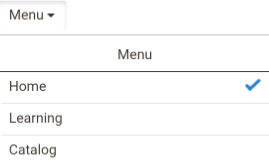

# Benutzer von iPad- und Android-Tablets

In der Learning Manager-App auf dem iPad oder Android-Tablet sehen Sie, nachdem Sie sich als Teilnehmer angemeldet haben: **Startseite** angezeigt:

Um zu den Lern- und Katalogfunktionen zu navigieren, tippen Sie auf das **Menü** &quot; und wählen Sie die entsprechende Option aus.

## Offline auf die App zugreifen {#accesstheappoffline}

Sie können offline auf die Lernmanager-App auf iPad- und Android-Tablets zugreifen. Laden Sie Kurse herunter, absolvieren Sie sie im Offline-Modus und synchronisieren Sie den Inhalt mit der Online-App, wenn Sie eine Verbindung zum Netzwerk herstellen.

1. Tippen Sie oben auf das Dropdown-Menü und dann auf die Option Lernen . Eine Liste aller verfügbaren Kurse wird in Kacheln angezeigt.
1. Tippen Sie auf das Downloadsymbol unten auf jeder Lernobjektkachel, um die Lerninhalte herunterzuladen.

1. Wenn Sie online sind, wird in einer Leiste oben in der App eine Eingabeaufforderung angezeigt, um zu überprüfen, ob Sie Ihre Inhalte online synchronisieren möchten. Tippen Sie auf den roten Balken, wenn Ihre Antwort &quot;Ja&quot; ist. Ein grüner Balken zeigt an, dass Ihre Inhalte mit der Online-App synchronisiert sind.

## Gerätespeicher verfolgen {#nbsptrackdevicestorage}

Sie können Ihren Gerätespeicher regelmäßig überwachen.

Tippen Sie auf das Profilsymbol in der rechten oberen Ecke der App und tippen Sie auf **Gerätespeicher** aus.

Das Dialogfeld mit den App-Speicherinformationen wird wie unten gezeigt angezeigt.

Mithilfe der App-Speicherinformationen können Sie den gesamten Speicherplatz des Geräts, der App und der heruntergeladenen Kurse überprüfen. Diese Informationen ermöglichen es Ihnen, Kurse entsprechend herunterzuladen. Um die heruntergeladenen Kurse auf dem Gerät zu löschen, tippen Sie auf das X-Symbol neben jedem Kursnamen.
