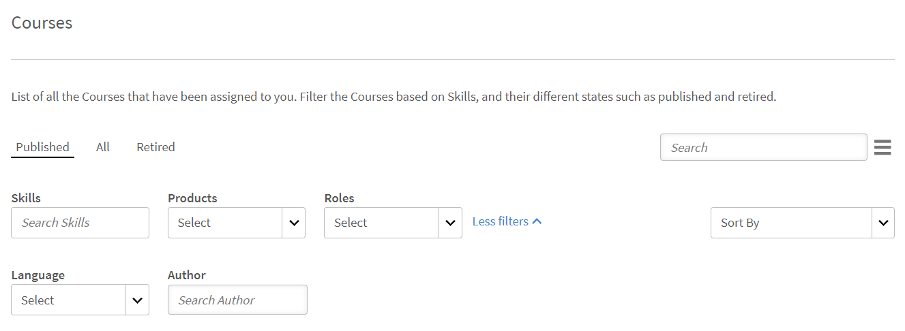
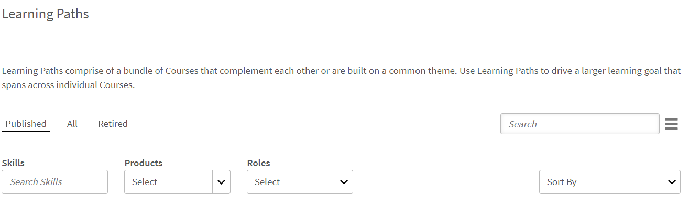

# Lernobjekte

Dieses Dokument enthält Informationen zu Lernobjekten für Manager.

Ein Manager kann die ihm unterstellten Teilnehmer für Kurse, Lernpfade und Zertifizierungen registrieren. Weitere Informationen und Anweisungen zu den Schritten für die Registrierung finden Sie unter [Registrieren von Teilnehmern](../../administrators/feature-summary/courses.md#main-pars_header_1058138132).

## Kurse {#courses}

## Anzeigen von Kursen {#viewingcourses}

Als Manager können Sie eine Liste aller verfügbaren Kurse anzeigen. Klicken **[!UICONTROL Kurse]** im linken Teilfenster, um die Liste der Kurse mit Such- und Filteroptionen anzuzeigen. In den Kursminiaturansichten können Sie darüber hinaus die Effektivität der einzelnen Kurse als Prozentwert anzeigen. Beachten Sie, dass Sie Teammitglieder nur zu Kursen anmelden können, die für Sie unter der Lernanwendung sichtbar sind.

*Kurse anzeigen*

>[!NOTE]
>
>Eine Liste aller eingestellten Kurse kann angezeigt werden, indem Sie auf das Symbol **Rentner** &quot; ändern.

## Punktzahl für Quiz anzeigen {#viewquizscores}

1. Klicken Sie in der Kursminiaturansicht auf den Kursnamen.
1. Klicken Sie im linken Fensterbereich auf „Punktzahl für Quiz“.

Sie können die Quiz-Punktzahlen eines bestimmten Kurses nach Benutzernamen oder Frage anzeigen. Wählen Sie dafür die Registerkarten „Nach Benutzer“ oder „Nach Frage“. Sie können jedoch nur die Quizpunktzahl Ihrer Teammitglieder abrufen.

Wählen Sie den Instanzentyp aus der Dropdownliste, um die Ergebnisse nach den Instanzen des Kurses anzuzeigen.

## Verwalten der Teilnehmerliste für einen Kurs {#managelearnerslistforacourse}

Als Manager können Sie die Teilnehmerliste für Ihre Teammitglieder verwalten.

1. Klicken Sie in der Kursminiaturansicht auf den Kursnamen.
1. Klicken Sie im linken Teilfenster auf **[!UICONTROL Teilnehmer]**.

*Teilnehmeraktion auswählen*

>[!NOTE]
>
>**Ausstehende Genehmigungen exportieren** können Sie in der Teilnehmer-App ausführen.

Sie können die folgenden Aktionen auf der Seite „Teilnehmer“ durchführen:

* Wählen Sie die Teilnehmer aus, die Sie entfernen möchten, und klicken Sie auf „Aktionen“ > „Entfernen“.
* Wählen Sie die Teilnehmer aus, deren Teilnahme Sie vermerken wollen und klicken Sie auf „Aktionen“ > „Als abgeschlossen markieren“.

Wenn Sie Teilnehmern die Möglichkeit geben, ein Modul zurückzusetzen und wieder zu nutzen, klicken Sie auf „Zurücksetzen“. Klicken Sie im angezeigten Dialogfeld auf „Ja“, um das Zurücksetzen zu bestätigen. Module, die abgeschlossen wurden, können nicht zurückgesetzt werden. Nur fehlgeschlagene oder unvollständige Module können zurückgesetzt werden.

Sie können die Teilnehmerliste auch in ein Excel-Arbeitsblatt exportieren. Um die Teilnehmerliste zu exportieren, klicken Sie auf „Aktionen“ > „Exportieren“.

>[!NOTE]
>
>Wenn es mehrere Instanzen eines Kurses gibt, wird die Excel-Teilnehmerliste jeweils auf getrennten Registerkarten angezeigt. Die Teilnehmerliste enthält Namen, Status und Auswahlkriterien der Teilnehmer. Der Teilnehmerstatus kann **Nicht gestartet** oder **In Bearbeitung** oder **Abgeschlossen**.

## L1- und L3-Feedback anzeigen {#viewl1andl3feedback}

Sie können das L1-Feedback der Teilnehmer zu einem Kurs und das L3-Feedback für die Mitglieder Ihres Teams anzeigen.

1. Klicken Sie auf eine beliebige Kurskachel der Kursliste.
1. Klicken Sie im linken Teilfenster auf L1-Feedback oder L3-Feedback, um das erhaltene Feedback anzuzeigen.
1. Wählen Sie in der Dropdownliste die Instanz aus, für die Sie Feedback anzeigen möchten.

## Kursvorschau {#previewcourses}

Manager kann eine Vorschau der Kurse anzeigen, indem er auf das Symbol **Vorschau als Teilnehmer** beim Anzeigen der Kursmodule.

1. Klicken **[!UICONTROL Kurse]** im linken Bereich, nachdem Sie sich angemeldet haben.
1. Klicken Sie auf der Seite auf eine beliebige Kachel der Kursliste.
1. Klicken Sie im linken Teilfenster auf „Vorschau als Teilnehmer“ und klicken Sie auf der Seite auf den Modulnamen, um im Player eine Vorschau des Kursmoduls anzuzeigen.

## Kurseffektivität {#courseeffectiveness}

Die Kurseffektivität wird ausgewertet, um festzustellen, wie nützlich die Kurse für die Teilnehmer sind. Dies ist eine Kombination der Ergebnisse des Teilnehmer-Feedbacks zu den Kursinhalten, der Ergebnisse des Kursquiz für einen Teilnehmer und des vom Manager gegebenen Feedbacks, mit dem die Lernfortschritte des Teilnehmers im Kurs bewertet werden.

Sie können die Bewertung der Kurseffektivität in den Kursminiaturansichten anzeigen, siehe die nachfolgende Abbildung. Dieser Kurs hat eine Bewertung von „100“.

<!---->

Der Wert der Kurseffektivität wird auf Basis der Werte der L1-, L2- und L3-Feedbacks berechnet. Um die Aufschlüsselung für jedes Feedback zu sehen, klicken Sie auf den Kurseffektivitätswert. Es wird ein Popupfenster angezeigt (siehe unten).

*Kurseffektivität für Feedback anzeigen*

Im Beispiel dieser Abbildung hat 1 von 1 Benutzer alle drei Feedbacks erhalten, daher lautet das Ergebnis 100/100. Die folgende Tabelle zeigt, inwiefern sich das Fehlen eines der drei Feedbacks (L1, L2 und L3) negativ auf die Gesamteffektivität auswirkt. Klicken Sie in der rechten unteren Ecke des Popupmenüs auf den Abwärtspfeil, um anzuzeigen, wie die Kurseffektivität berechnet wird.

*Berechnung der Kurseffektivität*

Wie aus dem obigen Kreisdiagramm hervorgeht, wird das L3-Feedback des Managers am höchsten gewichtet.

## Kurse, Lernpfade und Zertifizierungen suchen {#searchingcourseslearningprogramsandcertifications}

Adobe Learning Manager erleichtert Ihnen das schnelle Auffinden der Kurse/Lernpfade Ihrer Wahl. Für die Suche nach Kursen haben Sie zwei Möglichkeiten:

1. Über das Suchfeld. Klicken Sie auf das Suchsymbol in der rechten oberen Ecke. Ein Suchfeld erscheint. Geben Sie den Kursnamen oder zu Ihren Kursen passende Schlüsselwörter ein, um Ihre Kurse/Lernpfade zu finden. Sie können auch mit vordefinierten Tags wie Captivate, C, Java und HTML suchen. Nach Tags können Sie im Suchfeld suchen, was bedeutet, dass die Tags im Suchfeld angezeigt werden, während Sie tippen. Die Suche kann kann auch mit einer eindeutigen ID ausgeführt werden.
1. Filtern Sie die Liste der Kurse/Lernpfade/Zertifizierungen mithilfe der Filter. Sie können die Kurse nach Status filtern, z. B. Alle, Veröffentlicht und Eingestellt.

Sie können nach Kompetenzen suchen, indem Sie **Kompetenzen** und die gewünschten Bilder auswählen. Als Manager können Sie die Kurse auf vier Arten sortieren, um den gewünschten Kurs besser zu finden. Klicken Sie auf Sortieren nach und wählen Sie alphabetisch aufsteigende Reihenfolge, alphabetisch absteigende Reihenfolge, Datum der Kursaktualisierung, Erstellungsdatum des Kurses oder Kurseffektivität:

* Name (a - z)
* Name (z - a)
* Datum der Aktualisierung
* Datum der Erstellung
* Kurseffektivität

*Kurse filtern*

Sie können Lernpfade auf drei Arten sortieren: in alphabetisch aufsteigender Reihenfolge, in alphabetisch absteigender Reihenfolge und basierend auf dem aktualisierten Datum.

*Lernpfad filtern*

## Registrieren von Teilnehmern in Kurse {#enrollinglearnersintocourses}

Gemäß den Vorgaben des Unternehmens registriert der Manager einige Teilnehmer für obligatorische Kurse:

1. Bewegen Sie die Maus über alle veröffentlichten Kurskacheln und klicken Sie auf &quot;Teilnehmer registrieren&quot;.

   Alternativ können Sie auf die Kachel eines veröffentlichten Kurses klicken und auf Teilnehmer im linken Teilfenster klicken. Es wird eine Seite mit einer Teilnehmerliste angezeigt. Klicken Sie auf „Registrieren“.\
   Das Dialogfeld &quot;Teilnehmer registrieren&quot; wird angezeigt.

1. Wählen Sie die Teilnehmer aus, indem Sie ihren Namen oder ihr Profil eingeben, und klicken Sie auf „Speichern“.

>[!NOTE]
>
>Sie können nur Teilnehmer registrieren, die Ihrem Team angehören.

## Lernpläne {#learningprograms}

Der Manager kann nur die ihm unterstellten Teilnehmer registrieren, ihre Quizergebnisse und ihr L1- und L3-Feedback anzeigen und ihre Registrierung aufheben.

## Hinzufügen von Teilnehmern zu einem Lernpfad {#addlearnerstoalearningprogram}

1. Klicken Sie im Manager-Modus im linken Teilfenster auf &quot;Lernpfade&quot;.
1. Wählen Sie den veröffentlichten Lernpfad aus der Liste der Kacheln aus, denen Sie Teilnehmer hinzufügen möchten.
1. Klicken Sie im linken Teilfenster unter der Kategorie „Programmberichte“ auf „Teilnehmer“. Hinweis: Bevor dem Lernprogramm Teilnehmer hinzugefügt werden können, muss es veröffentlicht werden.
1. Klicken Sie auf der Seite auf den Link „Registrieren“.
1. Beginnen Sie mit der Eingabe der Teilnehmernamen oder -profile und wählen Sie die Teilnehmer aus der Dropdownliste mit Teilnehmern aus. Klicken Sie auf „Speichern“.

## Punktzahl für Quiz anzeigen {#Viewquizscores-1}

1. Klicken Sie auf eine beliebige Lernpfadkachel.
1. Klicken Sie im linken Fensterbereich auf „Punktzahl für Quiz“.

Sie können die Quizpunktzahlen eines bestimmten Lernpfads basierend auf dem Benutzernamen oder basierend auf jeder Frage anzeigen. Wählen Sie dafür die Registerkarten „Nach Benutzer“ oder „Nach Frage“. Die Quizpunktzahlen werden jeweils nur für einen Kurs angezeigt. Um die Quizpunktzahlen für andere Kurse anzuzeigen, ändern Sie den Kursnamen in der Dropdownliste. Sie können die Quizpunktzahlen der Kurse auch exportieren. Wählen Sie den Instanztyp aus der Dropdown-Liste aus, um die Ergebnisse basierend auf jeder Instanz des Lernpfads anzuzeigen.

## Registrierung für Teilnehmer aufheben {#unenrollmentforlearners}

Der Manager kann einen Teilnehmer abmelden, wenn der Teilnehmer den Lernpfad noch nicht gestartet hat.

## Als abgeschlossen markieren {#markcompletion}

Ein Manager kann ein LP für Teilnehmer als abgeschlossen markieren. Weitere Informationen finden Sie unter [Als abgeschlossen markieren](../../administrators/feature-summary/learning-paths.md).

## Zertifizierungen {#certifications}

## Teilnehmer für eine Zertifizierung registrieren {#enrolllearnerstothecertification}

Sie können Teilnehmer auf zweierlei Art für eine Zertifizierung registrieren. Führen Sie die unten genannten Schritte aus, um Teilnehmer zu registrieren:

1. Klicken Sie im linken Teilfenster auf &quot;Zertifizierungen&quot;, nachdem Sie sich als Manager angemeldet haben. Bewegen Sie in der Liste auf der Registerkarte Veröffentlicht die Maus auf jede Zertifizierung und klicken Sie auf Teilnehmer registrieren. Alternativ können Sie auf eine veröffentlichte Zertifizierungskachel klicken und im linken Teilfenster auf Teilnehmer klicken. Klicken Sie auf + Registrieren auf der rechten Seite der Teilnehmerseite, um mit dem Hinzufügen der Teilnehmer zu beginnen.
1. Sie können das Popup-Dialogfeld &quot;Teilnehmer registrieren&quot; anzeigen, nachdem Sie in jedem der beiden oben genannten Schritte auf die Option &quot;Teilnehmer registrieren&quot; geklickt haben. Beginnen Sie mit der Eingabe des Namens und des Profils des Teilnehmers, wählen Sie den Namen des Teilnehmers aus der Dropdown-Liste aus und klicken Sie auf Speichern.

## Registrierung für Teilnehmer widerrufen {#Unenrollmentforlearners-1}

Der Manager kann einen Teilnehmer abmelden, wenn der Teilnehmer das Lernprogramm noch nicht gestartet hat.

## Als abgeschlossen markieren {#Markcompletion-1}

Ein Manager kann den Abschluss einer Zertifizierung vermerken. Weitere Informationen finden Sie unter [Als abgeschlossen markieren](../../administrators/feature-summary/certifications.md#main-pars_header_303097138).

## Manager-Benachrichtigungen für die Genehmigung von Teilnehmerkursen {#manager-notifications-course-approval}

Bei dem Versuch, einen Teilnehmer für die Registrierung zu akzeptieren oder abzulehnen, kann ein Manager jetzt die Details der Sitzung anzeigen (**Videokonferenzen** oder **Klassenzimmer**) im Popupfenster.

*Registrierungsanforderung eines Teilnehmers genehmigen oder ablehnen*

Die folgenden Sitzungsdetails werden angezeigt:

* Sitzungsname
* Kursleitername
* Standort
* Datum und Uhrzeit

Dies ist der Workflow:

1. Der Manager erhält eine Benachrichtigung, nachdem ein Teilnehmer die Genehmigung eines Kurses angefordert hat.

1. Der Manager klickt auf **Sitzungsdetails**.

   

   *Ausstehende Aufgaben anzeigen*

1. Der Manager genehmigt dann die Anforderung oder lehnt sie ab.
1. Der Manager erhält eine Bestätigungs- oder Fehlermeldung, wenn die Genehmigung oder Ablehnung nicht wie erwartet erfolgte.
1. Der Teilnehmer erhält eine Benachrichtigung über Genehmigung oder Ablehnung der Kursregistrierung.

## Optionale Einreichung für externe Zertifizierungen {#optional}

In früheren Versionen von Learning Manager akzeptierte ein Manager die Datei, die ein Teilnehmer eingereicht hatte, um eine externe Zertifizierung abzuschließen. Der Manager erhält eine Benachrichtigung erst, nachdem der Teilnehmer die Datei eingereicht hat.

Ein Manager kann jetzt eine Liste der Teilnehmer, die sich für die externe Zertifizierung angemeldet haben, auf einer Übermittlungsseite innerhalb der externen Zertifizierung anzeigen lassen und die Seite selbst akzeptieren oder ablehnen, ohne auf eine Benachrichtigung zu warten.

Wenn der Manager akzeptiert, ohne auf die Übermittlung der Datei zu warten, wird dem Teilnehmer eine neue Nachricht angezeigt, die der Manager akzeptiert hat, und der Teilnehmer muss die Datei nicht übermitteln. Für den Fall, dass Manager ohne die Übermittlung der Datei ablehnt, hat der Manager die Option, die Datei erneut zu akzeptieren, ohne auf sie zu warten.

Wenn der Teilnehmer die Datei einreicht, kann der Manager die Datei auf der Einreichungsseite anzeigen und sie basierend auf der eingereichten Datei annehmen oder ablehnen.

*Akzeptieren oder Ablehnen basierend auf Dateiübermittlung*

Wenn Kurse als obligatorisch festgelegt sind:

* Auf der Einreichungsseite werden die Teilnehmer erst aufgelistet, nachdem sie die Kurse abgeschlossen haben.
* Der Teilnehmer kann eine Datei erst nach Abschluss des Kurses hochladen.

## Arbeitshilfen {#jobaids}

Der Manager kann die Zuweisung von Arbeitshilfen für die ihm unterstellten Teilnehmer verwalten. Als Manager können Sie jedoch nur die veröffentlichten Arbeitshilfen sehen, während ein Administrator auch eingestellte Arbeitshilfen anzeigen kann.
