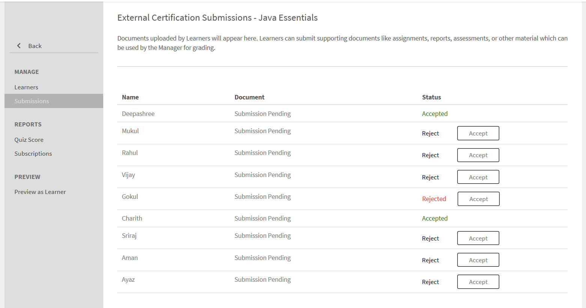

# Lernobjekte

Dieses Dokument enthält Informationen zu Lernobjekten für Manager.

Ein Manager kann die ihm unterstellten Teilnehmer für Kurse, Lernprogramme und Zertifizierungen registrieren. Weitere Informationen und die Schritte zur Registrierung finden Sie unter [Registrieren Sie Teilnehmer.](../../administrators/feature-summary/courses.md#main-pars_header_1058138132)

## Kurse {#courses}

## Anzeigen von Kursen {#viewingcourses}

Als Manager können Sie eine Liste aller verfügbaren Kurse anzeigen. Klicken **[!UICONTROL Kurse]** im linken Teilfenster, um die Liste der Kurse mit Such- und Filteroptionen anzuzeigen. Sie können den Prozentsatz der Kurseffektivität für jeden Kurs auch in den Kursminiaturansichten anzeigen. Beachten Sie, dass Sie Teammitglieder nur für Kurse registrieren können, die für Sie in der Teilnehmeranwendung sichtbar sind.

>[!NOTE]
>
>Eine Liste aller eingestellten Kurse kann angezeigt werden, indem Sie auf das Symbol **Rentner** &quot; ändern.

## Quizergebnisse anzeigen {#viewquizscores}

1. Klicken Sie auf der Miniaturansicht des Kurses auf den Kursnamen.
1. Klicken Sie im linken Teilfenster auf &quot;Quizpunktzahl&quot;.

Sie können die Quizpunktzahlen eines bestimmten Kurses basierend auf dem Benutzernamen oder basierend auf jeder Frage anzeigen. Wählen Sie entsprechend die Registerkarten &quot;Nach Benutzer&quot; oder &quot;Nach Frage&quot;. Sie können nur die Quizpunktzahl Ihrer Teammitglieder sehen.

Wählen Sie den Instanztyp aus der Dropdown-Liste, um die Punktzahl für jede Instanz des Kurses anzuzeigen.

## Verwalten der Teilnehmerliste für einen Kurs {#managelearnerslistforacourse}

Als Manager können Sie die Teilnehmerliste für Ihre Teammitglieder verwalten.

1. Klicken Sie auf der Miniaturansicht des Kurses auf den Kursnamen.
1. Klicken Sie im linken Teilfenster auf **[!UICONTROL Teilnehmer]**.

*Teilnehmeraktion auswählen*

Sie können die folgenden Aktionen auf der Teilnehmerseite ausführen:

* Wählen Sie den Teilnehmer aus, den Sie entfernen möchten, und klicken Sie auf Aktionen > Entfernen.
* Wählen Sie den Teilnehmer aus, dessen Anwesenheit Sie markieren möchten, und klicken Sie auf Aktionen > Als abgeschlossen markieren.

Damit Teilnehmer ein Modul zurücksetzen und erneut nutzen können, klicken Sie auf &quot;Zurücksetzen&quot;. Klicken Sie im Popup-Dialogfeld auf Ja , um das Zurücksetzen zu bestätigen. Abgeschlossene Module können nicht zurückgesetzt werden. Nur fehlgeschlagene oder unvollständige Module können zurückgesetzt werden.

Sie können die Teilnehmerliste auch in ein Excel-Arbeitsblatt exportieren. Um die Teilnehmerliste zu exportieren, klicken Sie auf Aktionen > Exportieren.

>[!NOTE]
>
>Wenn es mehrere Instanzen eines Kurses gibt, wird die Excel-Teilnehmerliste jeweils auf getrennten Registerkarten angezeigt. Die Teilnehmerliste enthält den Namen des Teilnehmers, den Status und Auswahlkriterien. Der Teilnehmerstatus kann **Nicht gestartet** oder **In Bearbeitung** oder **Abgeschlossen**.

## L1- und L3-Feedback anzeigen {#viewl1andl3feedback}

Sie können das L1-Feedback der Teilnehmer für einen Kurs und das L3-Feedback der Mitglieder Ihres Teams anzeigen.

1. Klicken Sie auf eine beliebige Kurskachel in der Kursliste.
1. Klicken Sie auf L1-Feedback oder L3-Feedback im linken Bereich, um das erhaltene Feedback anzuzeigen.
1. Wählen Sie die Instanz aus der Dropdown-Liste aus, um das Feedback für diese bestimmte Instanz anzuzeigen.

## Kursvorschau {#previewcourses}

Manager kann eine Vorschau der Kurse anzeigen, indem er auf das Symbol **Vorschau als Teilnehmer** beim Anzeigen der Kursmodule.

1. Klicken **[!UICONTROL Kurse]** im linken Bereich, nachdem Sie sich angemeldet haben.
1. Klicken Sie auf eine beliebige Kurskachel in der Kursliste auf der Seite.
1. Klicken Sie im linken Teilfenster auf &quot;Vorschau als Teilnehmer&quot; und klicken Sie auf der Seite auf den Modulnamen, um eine Vorschau des Kursmoduls im Player anzuzeigen.

## Kurseffektivität {#courseeffectiveness}

Die Kurseffektivität wird ausgewertet, um festzustellen, wie nützlich ein Kurs für den Teilnehmer ist. Dies ist eine Kombination der Ergebnisse des Teilnehmer-Feedbacks zu den Kursinhalten, der Ergebnisse des Kursquiz für einen Teilnehmer und des vom Manager gegebenen Feedbacks, mit dem die Lernfortschritte des Teilnehmers im Kurs bewertet werden.

Sie können die Bewertung der Kurseffektivität auf den Kursminiaturansichten anzeigen, wie in der Abbildung unten gezeigt. Sie können die Bewertung für diesen Kurs als 100 anzeigen.

<!---->

Der Wert für die Kurseffektivität wird unter Berücksichtigung der L1-, L2- und L3-Feedbackwerte ermittelt. Um die Aufschlüsselung jedes Feedbacks anzuzeigen, klicken Sie auf den Kurseffektivitätswert. Ein Popup-Fenster wird angezeigt (siehe unten).

*Kurseffektivität für Feedback anzeigen*

In diesem Beispiel erhielt 1 von 1 Benutzer alle drei Feedbacks, daher ist die Punktzahl 100/100. Aus dieser Tabelle können Sie entnehmen, dass sich negative Auswirkungen auf die Gesamteffektivität ergeben, wenn eines der drei Feedbacks (L1, L2 und L3) nicht für einen Kurs bereitgestellt wird. Klicken Sie in der rechten unteren Ecke des Popupmenüs auf den Abwärtspfeil, um anzuzeigen, wie die Kurseffektivität berechnet wird.

*Berechnung der Kurseffektivität*

Wie in dem oben gezeigten Kreisdiagramm gezeigt, wird L3-Feedback vom Manager stärker gewichtet.

## Kurse, Lernprogramme und Zertifizierungen suchen {#searchingcourseslearningprogramsandcertifications}

Adobe Learning Manager erleichtert Ihnen das schnelle Auffinden der Kurse/Lernprogramme Ihrer Wahl. Sie können auf zwei Arten nach Kursen suchen:

1. Verwenden des Suchfelds. Klicken Sie auf das Suchsymbol in der rechten oberen Ecke. Ein Suchfeld wird angezeigt. Geben Sie den Kursnamen oder beliebige zu Ihren Kursen passende Schlüsselwörter ein, um nach Ihren Kursen/Lernprogrammen zu suchen. Sie können auch mit vordefinierten Tags wie Captivate, C, Java und HTML suchen. Nach Tags können Sie im Suchfeld suchen, was bedeutet, dass die Tags im Suchfeld angezeigt werden, während Sie tippen. Die Suche kann auch mit einer eindeutigen ID ausgeführt werden.
1. Filtern der Liste der Kurse/Lernprogramme/Zertifizierungen mithilfe der Filter. Sie können die Kurse nach Status filtern, z. B. &quot;Alle&quot;, &quot;Veröffentlicht&quot; und &quot;Eingestellt&quot;.

Sie können nach Kompetenzen suchen, indem Sie auf &quot;Kompetenzen&quot; klicken und diese auswählen. Als Manager können Sie die Kurse auf vier Arten sortieren, um den gewünschten Kurs besser zu finden. Klicken Sie auf Sortieren nach und wählen Sie alphabetisch aufsteigende Reihenfolge, alphabetisch absteigende Reihenfolge, Aktualisierungsdatum des Kurses oder Kurseffektivität:

*Suche auf der Grundlage von Kompetenzen*

Sie können Lernprogramme auf drei Arten sortieren: in alphabetisch aufsteigender Reihenfolge, in alphabetisch absteigender Reihenfolge und basierend auf dem aktualisierten Datum.

## Registrieren von Teilnehmern für Kurse {#enrollinglearnersintocourses}

Manager registrieren einige Teilnehmer für obligatorische Kurse gemäß den Anforderungen des Unternehmens:

1. Bewegen Sie die Maus über alle veröffentlichten Kurskacheln und klicken Sie auf &quot;Teilnehmer registrieren&quot;.

   Alternativ können Sie auf die Kachel eines veröffentlichten Kurses klicken und auf Teilnehmer im linken Teilfenster klicken. Eine Seite mit einer Liste von Teilnehmern wird angezeigt. Klicken Sie auf Registrieren.\
   Das Dialogfeld &quot;Teilnehmer registrieren&quot; wird angezeigt.

1. Geben Sie den Namen oder das Profil der Teilnehmer ein, um sie auszuwählen, und klicken Sie auf &quot;Speichern&quot;.

>[!NOTE]
>
>Sie können nur Teilnehmer registrieren, die Ihrem Team angehören.

## Lernprogramme {#learningprograms}

Der Manager kann nur seine Reporter registrieren, Quizpunktzahlen, L1- und L3-Feedback anzeigen und die Registrierung aufheben.

## Teilnehmer zu einem Lernprogramm hinzufügen {#addlearnerstoalearningprogram}

1. Klicken Sie im Managermodus im linken Teilfenster auf &quot;Lernprogramme&quot;.
1. Wählen Sie das veröffentlichte Lernprogramm aus der Liste der Kacheln aus, denen Sie Teilnehmer hinzufügen möchten.
1. Klicken Sie im linken Teilfenster unter der Kategorie &quot;Programmberichte&quot; auf Teilnehmer. Hinweis: Das Lernprogramm muss veröffentlicht werden, bevor Teilnehmer hinzugefügt werden.
1. Klicken Sie auf der Seite auf den Link Registrieren .
1. Beginnen Sie mit der Eingabe des Namens oder Profils der Teilnehmer und wählen Sie die Teilnehmer aus der Dropdown-Liste der Teilnehmer aus. Klicken Sie auf Speichern.

## Quizergebnisse anzeigen {#Viewquizscores-1}

1. Klicken Sie auf eine beliebige Lernprogrammkachel.
1. Klicken Sie im linken Teilfenster auf &quot;Quizpunktzahl&quot;.

Sie können die Quizpunktzahlen eines bestimmten Lernprogramms basierend auf dem Benutzernamen oder basierend auf jeder Frage anzeigen. Wählen Sie entsprechend die Registerkarten &quot;Nach Benutzer&quot; oder &quot;Nach Frage&quot;. Quizpunktzahlen werden jeweils für einen Kurs angezeigt. Ändern Sie den Kursnamen aus der Dropdown-Liste, um die Quizergebnisse für andere Kurse anzuzeigen. Sie können auch Quizpunktzahlen für jeden Kurs exportieren. Wählen Sie den Instanztyp aus der Dropdown-Liste aus, um die Punktzahl für jede Instanz des Lernprogramms anzuzeigen.

## Registrierung für Teilnehmer aufheben {#unenrollmentforlearners}

Der Manager kann einen Teilnehmer abmelden, wenn der Teilnehmer das Lernprogramm noch nicht gestartet hat.

## Als abgeschlossen markieren {#markcompletion}

Ein Manager kann ein LP für Teilnehmer als abgeschlossen markieren. Weitere Informationen finden Sie unter [Als abgeschlossen markieren](../../administrators/feature-summary/learning-paths.md).

## Zertifikationen {#certifications}

## Teilnehmer für die Zertifizierung registrieren {#enrolllearnerstothecertification}

Sie können Teilnehmer auf zwei Arten für die Zertifizierung registrieren. Führen Sie die folgenden Schritte aus, um Teilnehmer zu registrieren.

1. Klicken Sie im linken Teilfenster auf &quot;Zertifizierungen&quot;, nachdem Sie sich als Manager angemeldet haben. Bewegen Sie in der Liste auf der Registerkarte Veröffentlicht die Maus auf jede Zertifizierung und klicken Sie auf Teilnehmer registrieren. Alternativ können Sie auf eine veröffentlichte Zertifizierungskachel klicken und im linken Teilfenster auf Teilnehmer klicken. Klicken Sie auf + Registrieren auf der rechten Seite der Teilnehmerseite, um mit dem Hinzufügen der Teilnehmer zu beginnen.
1. Sie können das Popup-Dialogfeld &quot;Teilnehmer registrieren&quot; anzeigen, nachdem Sie in jedem der beiden oben genannten Schritte auf die Option &quot;Teilnehmer registrieren&quot; geklickt haben. Beginnen Sie mit der Eingabe des Namens und des Profils des Teilnehmers, wählen Sie den Namen des Teilnehmers aus der Dropdown-Liste aus und klicken Sie auf Speichern.

## Registrierung für Teilnehmer aufheben {#Unenrollmentforlearners-1}

Der Manager kann einen Teilnehmer abmelden, wenn der Teilnehmer die Zertifizierung noch nicht gestartet hat.

## Als abgeschlossen markieren {#Markcompletion-1}

Ein Manager kann den Abschluss der Zertifizierung markieren. Weitere Informationen finden Sie unter [Als abgeschlossen markieren](../../administrators/feature-summary/certifications.md#main-pars_header_303097138).

## Manager-Benachrichtigungen für die Genehmigung von Teilnehmerkursen {#manager-notifications-course-approval}

Bei dem Versuch, einen Teilnehmer für die Registrierung zu akzeptieren oder abzulehnen, kann ein Manager jetzt die Details der Sitzung anzeigen (**Videokonferenzen** oder **Klassenzimmer**) im Popupfenster.

*Registrierungsanforderung eines Teilnehmers genehmigen oder ablehnen*

Die folgenden Sitzungsdetails werden angezeigt:

* Sitzungsname
* Kursleitername
* Speicherort
* Datum und Uhrzeit

Dies ist der Workflow:

1. Der Manager erhält eine Benachrichtigung, nachdem ein Teilnehmer die Genehmigung eines Kurses angefordert hat.

1. Der Manager klickt auf **Sitzungsdetails**.

   

   *Ausstehende Aufgaben anzeigen*

1. Der Manager genehmigt dann die Anforderung oder lehnt sie ab.
1. Der Manager erhält eine Bestätigungs- oder Fehlermeldung, wenn die Genehmigung oder Ablehnung nicht wie erwartet erfolgte.
1. Der Teilnehmer erhält eine Benachrichtigung über Genehmigung oder Ablehnung der Kursregistrierung.

## Optionale Einreichung für externe Zertifizierungen {#optional}

In früheren Versionen von Learning Manager akzeptierte ein Manager die Datei, die ein Teilnehmer eingereicht hatte, um eine externe Zertifizierung abzuschließen. Der Manager erhält eine Benachrichtigung erst, nachdem der Teilnehmer die Datei gesendet hat.

Ein Manager kann jetzt eine Liste von Teilnehmern sehen, die sich auf einer Seite &quot;Einreichung&quot; auf der Seite &quot;Externe Zertifizierung&quot; für die externe Zertifizierung registriert haben, und kann auf der Seite selbst akzeptieren oder ablehnen, ohne auf eine Benachrichtigung zu warten.

Wenn der Manager akzeptiert, ohne auf die Dateiübermittlung zu warten, wird dem Teilnehmer eine neue Meldung angezeigt, die der Manager akzeptiert hat, und der Teilnehmer muss die Datei nicht übermitteln. Wenn der Manager ohne Dateiübermittlung ablehnt, hat der Manager die Möglichkeit, den Vorgang erneut zu akzeptieren, ohne auf die Datei zu warten.

Wenn ein Teilnehmer die Datei sendet, kann der Manager die Datei auf der Seite zur Einreichung anzeigen und sie basierend auf der eingereichten Datei akzeptieren oder ablehnen.

*Akzeptieren oder Ablehnen basierend auf Dateiübermittlung*

Wenn Kurse als obligatorisch festgelegt sind:

* Auf der Einreichungsseite werden die Teilnehmer erst aufgelistet, nachdem sie die Kurse abgeschlossen haben.
* Der Teilnehmer kann eine Datei erst nach Abschluss des Kurses hochladen.

## Arbeitshilfen {#jobaids}

Der Manager kann die Zuweisung von Arbeitshilfen für seine Reporter verwalten. Als Manager können Sie jedoch nur die veröffentlichten Arbeitshilfen sehen, während ein Administrator auch zurückgenommene Arbeitshilfen sehen kann.
