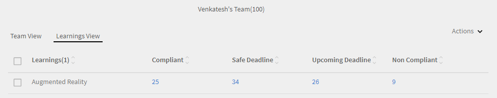

# Manager-Dashboard

Erfahren Sie, wie Sie Lernergebnisse über das Manager-Dashboard anzeigen und verfolgen können.

Führungskräfte spielen eine wichtige Rolle bei den Lerninitiativen eines Teams. Zur besseren Orientierung bietet die Lernplattform dem Manager eine Dashboard-Ansicht, um die Lernergebnisse in seinem Team zu verfolgen.

*Dashboard-Bericht für einen Manager*

Um die Details eines Diagramms anzuzeigen, klicken Sie auf das Diagramm oder auf den Hyperlink **[!UICONTROL Details]**.

Manager können auch das Dashboard des Teams ihres Managers der nächsten Ebene anzeigen. Beispiel: Benutzer A ist der Manager von Benutzer B, Benutzer C, Benutzer D und Benutzer E. Benutzer B und Benutzer C sind Manager ihrer jeweiligen Teams. Benutzer A kann Berichte zu seinen direkten Berichten (Benutzer B, Benutzer C, Benutzer D und Benutzer E) sowie zu den von Benutzer B und Benutzer C verwalteten Teams anzeigen.

## Übersicht zu Lernprogrammen {#learningsummary}

Ein Manager kann die Zusammenfassung der Lernaktivitäten für sein Team über einen ausgewählten Zeitraum anzeigen. Wählen Sie Monat, Quartal oder Jahr aus dem Dropdown-Menü aus.

„Monat“ und „Jahr“ basieren auf dem Kalenderjahr, während „Quartal“ auf dem Geschäftsjahr basiert, das vom Administrator in den Kontoeinstellungen konfiguriert wurde.

*Anzeigen von Lernaktivitäten über einen bestimmten Zeitraum*

## Teamansicht {#teamview}

In der Teamansicht werden die Teams, ihre Mitglieder und ihre jeweiligen Registrierungen, Fortschritte und Abschlüsse für Lernobjekte angezeigt.

*In der Team-Ansicht werden die Teams, ihre Mitglieder und ihre jeweiligen Registrierungen angezeigt*

Wenn Sie auf die Teamnamen klicken, z. B. &quot;Venkatesh&#39;s Team&quot;, können Sie die Mitglieder im Team von Venkatesh zusammen mit der Gesamtzahl der Registrierungen, Fortschritte und Abschlüsse für ein Lernobjekt anzeigen.

*Team-Mitglied auswählen*

Um die Lernzusammenfassung für jedes Teammitglied anzuzeigen, klicken Sie auf die Nummer in der jeweiligen Spalte, die dem Teammanager entspricht. Eine Tabelle wird geöffnet, in der die Liste der Lernobjekte mit Informationen zum Registrierungsdatum, Fälligkeitsdatum und Fortschritt angezeigt wird.

*Team-Manager auswählen*

Auf ähnliche Weise können Sie die Lernobjekte zusammen mit der Anzahl der Registrierungen, Fortschritte oder Abschlüsse anzeigen, indem Sie auf die Werte unter den entsprechenden Spalten klicken.

*Kurse und Lernzusammenfassung anzeigen*

Wenn Sie weiter auf die Anzahl der Registrierungen, Fortschritte oder Abschlüsse für jedes Lernen klicken, können Sie die folgenden Details anzeigen: Personen, Anmelde-/Abschlussdatum, Fälligkeitsdatum und Fortschritt.

*Anmelde-/Abschlussdatum, Fälligkeitsdatum und erreichter Fortschritt anzeigen*

## Lernansicht {#learningsview}

Die Lernansicht zeigt die Anzahl der Registrierungen, Fortschritte und Abschlüsse für ein Lernobjekt an.

Klicken Sie auf die entsprechenden Werte in den Spalten „Registrierung“, „Fortschritt“ und „Abschluss“, um Details wie Personen, Datum der Registrierung, Fälligkeitsdatum und Fortschritt der jeweiligen Lernobjekte anzuzeigen.

*Lernaktivitäten*

## Bericht exportieren {#exportreport}

Um einen Excel-Bericht zu generieren, wählen Sie **[!UICONTROL Aktionen] > [!UICONTROL Bericht]**

## Compliance-Status {#compliancestatus}

Im Kompatibilitäts-Dashboard können Manager den allgemeinen Konformitätsstatus des Teams für konfigurierte Lernergebnisse für bestimmte Kategorien (z. B. Vertrieb, Marketing und Rechtsabteilung) anzeigen. Administratoren können ein Dashboard mit Compliance-Kursen, Lernpfaden oder Zertifizierungen erstellen und diese an die Manager weitergeben. Manager können das vom Administrator freigegebene Dashboard in ihren Instanzen anzeigen.

### Dashboard anzeigen

Um das Dashboard anzuzeigen, wählen Sie **[!UICONTROL Kompatibilitäts-Dashboard]** in der Manager-App.

_Kompatibilitäts-Dashboard-Manager-App_

Das Kompatibilitäts-Dashboard umfasst die folgenden Kompatibilitätsstatus:

* **[!UICONTROL Nicht konforme Teilnehmer]**: Anzahl der Teilnehmer, die Fristen nicht eingehalten haben.
* **[!UICONTROL Teilnehmer nähern sich Fristen]**: Zeigt die Anzahl der Teilnehmer mit Fristen in weniger als 30 Tagen an.
* **[!UICONTROL Teilnehmer mit sicheren Fristen]**: Zeigt die Anzahl der Teilnehmer mit weiter entfernten Fristen (mehr als 30 Tage) an.
* **[!UICONTROL Vollständig kompatible Teilnehmer]**: Zeigt die Anzahl der vollkompatiblen Teilnehmer an.
* **[!UICONTROL Teilnehmer nirgendwo registriert]**: Zeigt die Anzahl der Teilnehmer an, die nicht für Kurse, Lernpfade oder Zertifizierungen registriert sind.

### E-Mail-Manager und Teilnehmer

**Mehrere Teams verwalten**

Wenn Sie mehrere Teams verwalten, können Sie Ihre Manager über den Lernstatus ihrer Teammitglieder benachrichtigen, indem Sie die Option **[!UICONTROL E-Mail-Manager]** auswählen, die im Abschnitt **[!UICONTROL Teamansicht]** verfügbar ist.

_E-Mail-Manager_

Der **[!UICONTROL E-Mail-Manager]** bietet Ihnen die folgenden Optionen:

* **[!UICONTROL E-Mail-Manager von nicht konformen Teilnehmern]**: Benachrichtigen Sie Manager, deren Teammitglieder Fristen versäumt haben.
* **[!UICONTROL E-Mail-Manager von Teilnehmern erreichen Fristen]**: Benachrichtigen Sie Manager, deren Teammitglieder bevorstehende Fristen haben.

**Einzelnes Team verwalten**

Wenn Sie ein einzelnes Team verwalten, können Sie die Teilnehmer über ihren Lernstatus benachrichtigen, indem Sie die Option **[!UICONTROL E-Mail-Teilnehmer]** auswählen, die im Abschnitt **[!UICONTROL Teamansicht]** verfügbar ist.

_E-Mail an Teilnehmer_

Die Option **[!UICONTROL E-Mail-Teilnehmer]** bietet Ihnen die folgenden Optionen:

* **[!UICONTROL Nicht konforme Teilnehmer per E-Mail benachrichtigen]**: Benachrichtigen Sie Teilnehmer, die Fristen versäumt haben.
* **[!UICONTROL E-Mail-Teilnehmer, die Fristen erreichen]**: Benachrichtigen Sie Teilnehmer, die bevorstehende Fristen haben.

### Bericht herunterladen

Führen Sie die folgenden Schritte aus, um den Bericht herunterzuladen:

1. Wechseln Sie in der Manager-App zu **[!UICONTROL Kompatibilitäts-Dashboard]** > **[!UICONTROL Teamansicht]**.
1. Wählen Sie **[!UICONTROL Bericht herunterladen]**, um Ihr Dashboard als Bericht zu speichern.
Auf diese Weise können Sie den allgemeinen Lernfortschritt Ihres Teams verfolgen.

_Berichte herunterladen_

<!--On this dashboard, managers can also view the learners who are compliant, in a safe deadline, approaching deadline, and non-compliant for a selected learning object. 

Learning Objects with completion deadlines can be configured in compliance dashboard for tracking. 

**Compliant**: Displays the number of learners who have completed the learning object within completion deadline.

**Safe deadline**: Displays the number of learners who have less than 30 days available to complete a learning object.

**Upcoming Deadline**: Displays the number of learners with more than 30 days available to complete a learning object.

**Non-compliant**: Displays the number of learners who did not complete the learning object within the completion deadline.

*View compliance dashboard*

## Team View {#TeamView-1}

Displays the compliance status of a course for respective teams. Compliant, Safe Deadline, Upcoming Deadline, and Non-Compliant are columns in the Team View table.

*compliance status of a course for respective teams*

To display names of the members in a team and the individual number of courses for which their status is Compliant, in Safe Deadline, reaching Upcoming Deadline, and Non Compliant, click the corresponding values in the table.

*Select individual teams*

On further clicking the values in the compliant, safe deadline, upcoming deadline, and non-compliant column, the corresponding course details are displayed: Learning object name, enrollment/ completion date, due date, and progress in percentage.

 

*View progress of courses*

## Learnings View {#LearningsView-1}

In the Compliance Status Learnings View, the list of Learning Objects and the corresponding number of team members that are Compliant, within a Safe Deadline, have an Upcoming Deadline, or are Non Compliant is displayed.

*View deadline and compliance status*

On further clicking the values in the compliant, safe deadline, upcoming deadline, and non compliant columns, the following data is displayed: People, Enrollment Date, Completion date, and Progress.

*View details of compliance*

## Export data & send emails {#exportdataampsendemails}

* To export the compliance status for team and learnings view, click **[!UICONTROL Actions]** > **[!UICONTROL Export]**.

* To send an email to team members, click **[!UICONTROL Actions]** > **[!UICONTROL Send Email]**.

*Export and email data*-->

## Team-Kenntnisse {#teamskills}

Manager können das Kenntnis-Abschlussdiagramm anzeigen und eine Kenntnis-Abschlussprognose auf verschiedenen Ebenen konfigurieren. Die Dropdown-Liste &quot;Kenntnisse&quot; enthält fünf Kenntnisse. Der Manager lernt die von den Teammitgliedern erworbenen Fachkenntnisse kennen und identifiziert starke Talente in bestimmten Fähigkeiten.

Manager können auch bestimmte Fähigkeiten in einem Team fördern, indem sie ein Ziel festlegen und vorhersagen, wie lange es dauern würde, eine Qualifikation für einen bestimmten Prozentsatz eines Teams innerhalb einer Timeline zu erreichen.

Diese Prognose basiert auf Systemberechnungen, die einen Ausblick auf den Fortschritt dieser spezifischen Kenntnisse geben.

*Qualifikationsvorhersage anzeigen*

Um den Kenntnisstatus eines Teams anzuzeigen, führen Sie die folgenden Schritte aus:

1. Klicken Sie im linken Teilfenster im Abschnitt &quot;Ansicht &quot;Mein Team&quot; auf **[!UICONTROL Team-Kenntnisse]**.
1. Um die Kenntnisse anzuzeigen, klicken Sie auf den Filter für Kenntnisse und wählen Sie einen aus der Dropdown-Liste aus.
1. Um eine Ebene auszuwählen (Ebene 1, Ebene 2 oder Ebene 3), klicken Sie auf das Dropdown-Menü der Ebene.
1. Basierend auf den ausgewählten Kenntnissen und der ausgewählten Ebene wird eine Grafik mit ihrem Kenntnisstatus angezeigt. Wenn Sie mit der Maus über das Diagramm fahren, können Sie die folgenden Prozentsätze des Kenntnisstatus anzeigen: **In Bearbeitung** und **Erreicht**.

   

   *Prozentsatz des Kenntnisstatus anzeigen*

## Wie man den Teamabschluss in % für Kenntnisse voraussagt {#howtoforecasttheteamcompletionforaskill}

Folgen Sie den nachstehenden Schritten, um den Teamabschluss in % für Kenntnisse vorauszusagen

1. Um den Konfigurations-Tracker anzuzeigen, klicken Sie auf den Hyperlink zum Konfigurieren.

   

   *Wählen Sie den Hyperlink &quot;Konfigurieren&quot; aus*

1. Geben Sie im Popup-Dialogfeld &quot;Konfigurieren&quot; für die Kenntnisse, die Sie konfigurieren möchten, einen Prozentwert in das Feld **Zielabschluss %** und das Datum ein, bis zu dem Sie den Zielabschluss % im Feld **Zieldatum** erreichen möchten.****

   

   *Zielabschlussprozentsatz eingeben*

1. Klicken Sie auf die Schaltfläche **Schätzen**, um die Ausgabe für Ihre Prognose anzuzeigen . Die Ausgabe sieht wie im folgenden Screenshot aus.

   

   *Ausgabe des Qualifikationsnachzeichners anzeigen*

## Prognose für Kenntnisstufenabschluss {#skilllevelcompletionforecast}

Der Manager eines Teams kann den Prozentsatz des Team-Abschlusses von Kenntnissen für einen bestimmten Zeitraum anzeigen und konfigurieren, basierend auf dem Ziel-Abschluss-Prozentsatz und der im Kenntnis-Tracker angegebenen Datumszeit. 

Im Prognosediagramm gibt es zwei Arten von Linien (durchgezogene und gepunktete Linie) mit jeweils drei Scheitelpunkten.

In der durchgezogenen Linie zeigt der erste Punkt das Datum für die erste Registrierung für eine Kenntnisstufe an.

*Erste Registrierung für Kenntnisstufe anzeigen*

Der zweite Punkt zeigt das aktuelle Datum und den Abschlussgrad von Kenntnissen in % an.

*Aktuelles Datum und Teamabschluss % Stufe der Kenntnisse anzeigen*

Der dritte Punkt in der Zeile zeigt den erwarteten Abschlussgrad und den Abschlusszeitpunkt.

*Erwartetes Zielabschlussdatum % und Zielabschlussdatum anzeigen*

## Prognoselinie {#forecastline}

Die gepunktete Linie ist die Prognoselinie, in der die Prognose für Kenntnisse in einem bestimmten Zeitraum in Abhängigkeit vom aktuellen Teamabschluss in % angezeigt wird.

Der erste Punkt auf der gepunkteten Linie repräsentiert den Team-Abschluss in % und den voraussichtlichen Team-Abschluss in % für Kenntnisse an diesem Datum.

*Teamabschluss % und voraussichtlicher Teamabschluss % für Kenntnisse anzeigen*

Der zweite Punkt zeigt das Datum, an dem der geplante Teamabschluss in % für Kenntnisse erreicht wurde.

*Datum anzeigen, an dem der projizierte Teamabschluss % für Kenntnisse erreicht wurde*

Der dritte Punkt in der Prognoselinie zeigt den Teamabschluss in % an, der am Stichtag im Kenntnis-Tracker erreicht wurde.

*Teamabschluss % anzeigen, der am Zieldatum erreicht wurde, das im Kenntnistracker angegeben ist*

Unter dem Diagramm wird eine Tabelle mit der Teamansicht und der Anzahl der registrierten, erreichten und in Bearbeitung befindlichen Kenntnisse angezeigt. Wenn ein Lernprogramm ein Abschlussdatum hat, wird auch das erwartete Abschlussdatum angezeigt.

*Tabelle mit der Ansicht des Teams und der Anzahl der Kenntnisse, die registriert, erreicht und in Bearbeitung sind*

Wenn Sie auf den Teamnamen klicken, werden die Liste der Mitglieder, die sich für die Kenntnisse angemeldet haben, sowie deren Status und Abschlussdatum angezeigt.

*Liste der Mitglieder anzeigen*

Wenn Sie auf das Team klicken, können Sie die darin enthaltenen Mitglieder und die entsprechenden Details zu den ausgewählten Kenntnissen anzeigen, z. B. ob registriert, der Status (ob in Bearbeitung oder erreicht) und das Abschlussdatum, sofern festgelegt.

*Kenntnisse der Mitglieder anzeigen*

Bei der Auswahl der Werte für ein Team in den Spalten „Registrierung“, „Erreicht“ und „In Bearbeitung“ können Sie die Anzahl der Benutzer anzeigen, die sich für die Kenntnisse registriert haben. Sie können auch das Datum anzeigen, an dem sich der Benutzer für die Kenntnisse angemeldet hat, den Status und das Abschlussdatum, wenn die Kenntnisse vom Benutzer abgeschlossen wurden.

<!-- -->

## Bericht exportieren {#Exportreport-1}

* Klicken Sie auf **[!UICONTROL Aktionen]** > **[!UICONTROL Exportieren]**, um die Daten als Excel-Datei zu exportieren.

*Daten exportieren*
