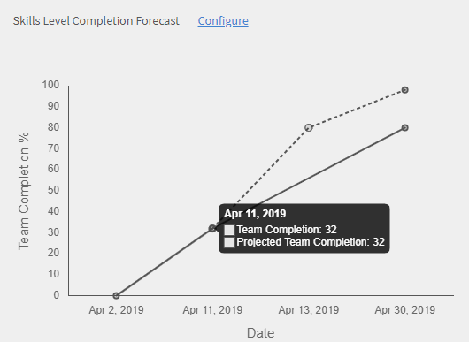

# Manager-Dashboard

Erfahren Sie, wie Sie Lernergebnisse über das Manager-Dashboard anzeigen und verfolgen können.

Manager spielen eine wichtige Rolle bei den Lerninitiativen eines Teams. Zur besseren Orientierung bietet die Lernplattform dem Manager eine Dashboard-Ansicht, um die Lernergebnisse in seinem Team zu verfolgen.

*Dashboard-Bericht für einen Manager*

Um die Details eines Diagramms anzuzeigen, klicken Sie auf das Diagramm oder auf den Hyperlink **[!UICONTROL Details]**.

## Übersicht zu Lernprogrammen {#learningsummary}

Ein Manager kann die Zusammenfassung der Lernaktivitäten für sein Team über einen ausgewählten Zeitraum anzeigen. Wählen Sie Monat, Quartal oder Jahr aus dem Dropdown-Menü aus.

„Monat“ und „Jahr“ basieren auf dem Kalenderjahr, während „Quartal“ auf dem Geschäftsjahr basiert, das vom Administrator in den Kontoeinstellungen konfiguriert wurde.

*Lernaktivitäten im Laufe einer Zeit ansehen*

## Teamansicht {#teamview}

In der Teamansicht werden die Teams, ihre Mitglieder und ihre jeweiligen Registrierungen, Fortschritte und Abschlüsse für Lernobjekte angezeigt.

*In der Team-Ansicht werden die Teams, ihre Mitglieder und ihre anmeldungen angezeigt.*

Wenn du auf die Namen des Teams klickst, z. B. das Team von Venkatesh, siehst du die Mitglieder im Team von Venkatesh zusammen mit der Gesamtzahl der Anmeldungen, Fortschritte und Fertigstellungen für ein Lernobjekt.

*Team-Mitglied auswählen*

Um die Lernzusammenfassung für jedes Teammitglied anzuzeigen, klicken Sie auf die Nummer in der jeweiligen Spalte, die dem Teammanager entspricht. Eine Tabelle wird geöffnet, in der die Liste der Lernobjekte mit Informationen zum Registrierungsdatum, Fälligkeitsdatum und Fortschritt angezeigt wird.

*Team-Manager auswählen*

Auf ähnliche Weise können Sie die Lernobjekte zusammen mit der Anzahl der Registrierungen, Fortschritte oder Abschlüsse anzeigen, indem Sie auf die Werte unter den entsprechenden Spalten klicken.

*Kurs- und Lernzusammenfassung anzeigen*

Wenn du weiter auf die Anzahl der Anmeldungen, Fortschritte oder Abgeschlossenheiten für die einzelnen Schulungen klickst, siehst du die folgenden Details: Personen, Anmeldung/Abschlussdatum, Fälligkeitsdatum und erzielter Fortschritt.

*Anmeldung/Abschlussdatum, Fälligkeitsdatum und erzielter Fortschritt anzeigen*

## Lernansicht {#learningsview}

Die Lernansicht zeigt die Anzahl der Registrierungen, Fortschritte und Abschlüsse für ein Lernobjekt an.

Klicken Sie auf die entsprechenden Werte in den Spalten „Registrierung“, „Fortschritt“ und „Abschluss“, um Details wie Personen, Datum der Registrierung, Fälligkeitsdatum und Fortschritt der jeweiligen Lernobjekte anzuzeigen.

*Ansicht &quot;Lerninhalte&quot;.*

## Bericht exportieren {#exportreport}

Um einen Excel-Bericht zu generieren, wähle &quot;Aktionen] > [!UICONTROL Report&quot; **[!UICONTROL aus.]**

## Compliance-Status {#compliancestatus}

Im Compliance-Dashboard können Manager den Compliance-Status des Teams für konfigurierte Schulungen in verschiedenen Kategorien (z. B. Vertrieb, Marketing und Rechtsabteilung) anzeigen. Administratoren können ein Dashboard mit Compliance-Kursen, Lernpfaden oder Zertifizierungen erstellen und an Manager weitergeben. Manager können das Vom Administrator freigegebene Dashboard in ihren Instanzen anzeigen.

### Dashboard anzeigen

Um das Dashboard anzuzeigen, wähle **[!UICONTROL &quot;Compliance-Dashboard]** &quot; aus der Manager-App aus.

_Compliance Dashboard-Manager-App_

Das Compliance-Dashboard umfasst die folgenden Compliance-Status:

* **[!UICONTROL Nicht konforme Teilnehmer]**: Zeigt die Anzahl der Teilnehmer an, die Termine verpasst haben.
* **[!UICONTROL Teilnehmer, die sich einem Stichtag]** nähern: Zeigt die Anzahl der Teilnehmer mit Stichtagsterminen in weniger als 30 Tagen an.
* **[!UICONTROL Teilnehmer mit sicheren Deadlines]**: Zeigt die Anzahl der Teilnehmer an, wobei die Termine weiter aus sind (mehr als 30 Tage).
* **[!UICONTROL Vollständig konforme Teilnehmer]**: Zeigt die Anzahl der vollständig standardkonformen Teilnehmer an.
* **[!UICONTROL Teilnehmer, die nirgends]** angemeldet sind: Zeigt die Anzahl der Teilnehmer an, die nicht an Kursen, Lernpfaden oder Zertifizierungen angemeldet sind.

### E-Mail-Manager und Teilnehmer

**Verwaltung mehrerer Teams**

Wenn ihr mehrere Teams verwaltet, könnt ihr eure Manager über den Lernstatus ihrer Team-Mitglieder informieren, indem ihr die **[!UICONTROL Option &quot;E-Mail-Manager]** &quot; in der **[!UICONTROL Team-Ansicht]** auswählt.

_E-Mail-Manager_

Die **[!UICONTROL E-Mail-Manager]** bieten Ihnen die folgenden Optionen:

* **[!UICONTROL E-Mail-Manager nicht konformer]** Teilnehmer: Benachrichtigung von Managern, deren Team-Mitglieder Termine verpasst haben.
* **[!UICONTROL E-Mail-Manager von Teilnehmern, die sich an Termine]** nähern: Benachrichtigung von Managern, deren Team-Mitglieder anstehende Termine haben.

**Verwaltung eines einzelnen Teams**

Wenn ihr ein einzelnes Team verwaltet, könnt ihr die Teilnehmer über ihren Lernstatus benachrichtigen, indem ihr die **[!UICONTROL Option &quot;E-Mail-Teilnehmer]** &quot; auswählt, die **[!UICONTROL im Team-Ansichtsabschnitt verfügbar ist]** .

_E-Mail-Teilnehmer_

Die **[!UICONTROL Option &quot;E-Mail-Teilnehmer&quot;]** bietet Ihnen die folgenden Optionen:

* **[!UICONTROL E-Mail an nicht konforme Teilnehmer]**: Teilnehmer benachrichtigen, die Termine verpasst haben.
* **[!UICONTROL E-Mail-Teilnehmer, die sich an Termine]** nähern: Benachrichtigung von Teilnehmern, die anstehende Termine haben.

### Bericht herunterladen

So ladest du den Report herunter:

1. In der Manager-App kannst du zur **[!UICONTROL Ansicht &quot;Compliance Dashboard]** > **[!UICONTROL Team&quot;]** gehen.
1. Wähle **[!UICONTROL &quot;Bericht]** herunterladen&quot;, um das Dashboard als Bericht zu speichern.
So könnt ihr den Lernfortschritt eures Teams verfolgen.

_Berichte herunterladen_

<!--On this dashboard, managers can also view the learners who are compliant, in a safe deadline, approaching deadline, and non-compliant for a selected learning object. 

Learning Objects with completion deadlines can be configured in compliance dashboard for tracking. 

**Compliant**: Displays the number of learners who have completed the learning object within completion deadline.

**Safe deadline**: Displays the number of learners who have less than 30 days available to complete a learning object.

**Upcoming Deadline**: Displays the number of learners with more than 30 days available to complete a learning object.

**Non-compliant**: Displays the number of learners who did not complete the learning object within the completion deadline.

*View compliance dashboard*

## Team View {#TeamView-1}

Displays the compliance status of a course for respective teams. Compliant, Safe Deadline, Upcoming Deadline, and Non-Compliant are columns in the Team View table.

*compliance status of a course for respective teams*

To display names of the members in a team and the individual number of courses for which their status is Compliant, in Safe Deadline, reaching Upcoming Deadline, and Non Compliant, click the corresponding values in the table.

*Select individual teams*

On further clicking the values in the compliant, safe deadline, upcoming deadline, and non-compliant column, the corresponding course details are displayed: Learning object name, enrollment/ completion date, due date, and progress in percentage.

 

*View progress of courses*

## Learnings View {#LearningsView-1}

In the Compliance Status Learnings View, the list of Learning Objects and the corresponding number of team members that are Compliant, within a Safe Deadline, have an Upcoming Deadline, or are Non Compliant is displayed.

*View deadline and compliance status*

On further clicking the values in the compliant, safe deadline, upcoming deadline, and non compliant columns, the following data is displayed: People, Enrollment Date, Completion date, and Progress.

*View details of compliance*

## Export data & send emails {#exportdataampsendemails}

* To export the compliance status for team and learnings view, click **[!UICONTROL Actions]** > **[!UICONTROL Export]**.

* To send an email to team members, click **[!UICONTROL Actions]** > **[!UICONTROL Send Email]**.

*Export and email data*-->

## Team-Kenntnisse {#teamskills}

Manager können das Kenntnis-Abschlussdiagramm anzeigen und eine Kenntnis-Abschlussprognose auf verschiedenen Ebenen konfigurieren. Die Dropdown-Liste &quot;Skills&quot; umfasst fünf Skills. Der Manager lernt das Know-how der Team-Mitglieder kennen und identifiziert starke Talente in bestimmten Bereichen.

Manager können auch bestimmte Kompetenzen in einem Team fördern, indem sie ein Ziel festlegen und prognostizieren, wie lange es dauert, um innerhalb einer Zeitleiste eine Fertigkeit für einen bestimmten Prozentsatz eines Teams zu erreichen.

Diese Prognose basiert auf Systemberechnungen, die einen Ausblick auf den Fortschritt dieser spezifischen Kenntnisse geben.

*Kompetenzprognose anzeigen*

Um den Status eines Teams anzuzeigen, führe die folgenden Schritte aus:

1. Klicke **[!UICONTROL im Bedienfeld &quot;Teamfähigkeiten]** &quot; links unter &quot;Teamansicht&quot;.
1. Um die Kenntnisse anzuzeigen, klicken Sie auf den Filter für Kenntnisse und wählen Sie einen aus der Dropdown-Liste aus.
1. Um eine Ebene auszuwählen (Ebene 1, Ebene 2 oder Ebene 3), klicken Sie auf das Dropdown-Menü der Ebene.
1. Basierend auf den ausgewählten Kenntnissen und der ausgewählten Ebene wird eine Grafik mit ihrem Kenntnisstatus angezeigt. Wenn Sie mit der Maus über das Diagramm fahren, können Sie die folgenden Prozentsätze des Kenntnisstatus anzeigen: **In Bearbeitung** und **Erreicht**.

   

   *Prozentsatz des Kompetenzstatus anzeigen*

## Wie man den Teamabschluss in % für Kenntnisse voraussagt {#howtoforecasttheteamcompletionforaskill}

Folgen Sie den nachstehenden Schritten, um den Teamabschluss in % für Kenntnisse vorauszusagen

1. Um den Konfigurations-Tracker anzuzeigen, klicken Sie auf den Hyperlink zum Konfigurieren.

   

   *Hyperlink konfigurieren*

1. Gib im Popup-Dialogfeld &quot;Konfigurieren&quot; für die zu konfigurierenden Kompetenzen einen Prozentwert im **Feld &quot;Target-Fertigstellung %&quot; ein und gib im Feld &quot;Zieldatum**&quot;**einen Prozentwert ein, bis wann du die** Zielerledigung % erreichen willst.***

   

   *Prozentsatz der Zielerledigung eingeben*

1. Klicken Sie auf die Schaltfläche **Schätzen**, um die Ausgabe für Ihre Prognose anzuzeigen . Die Ausgabe sieht wie der folgende Screenshot aus.

   

   *Skill-Tracxker-Ausgabe anzeigen*

## Prognose für Kenntnisstufenabschluss {#skilllevelcompletionforecast}

Der Manager eines Teams kann den Prozentsatz des Team-Abschlusses von Kenntnissen für einen bestimmten Zeitraum anzeigen und konfigurieren, basierend auf dem Ziel-Abschluss-Prozentsatz und der im Kenntnis-Tracker angegebenen Datumszeit. 

Im Prognosediagramm gibt es zwei Arten von Linien (durchgezogene und gepunktete Linie) mit jeweils drei Scheitelpunkten.

In der durchgezogenen Linie zeigt der erste Punkt das Datum für die erste Registrierung für eine Kenntnisstufe an.

*Erste Anmeldung für ein Kompetenzniveau anzeigen*

Der zweite Punkt zeigt das aktuelle Datum und den Abschlussgrad von Kenntnissen in % an.

*Aktuelles Datum und Abschluss des Teams anzeigen – Kompetenzniveau*

Der dritte Punkt in der Zeile zeigt den erwarteten Abschlussgrad und den Abschlusszeitpunkt.

*Anzeigen des erwarteten Zielabschlusses in % und des geplanten Fertigstellungsdatums*

## Prognoselinie {#forecastline}

Die gepunktete Linie ist die Prognoselinie, in der die Prognose für Kenntnisse in einem bestimmten Zeitraum in Abhängigkeit vom aktuellen Teamabschluss in % angezeigt wird.

Der erste Punkt auf der gepunkteten Linie repräsentiert den Team-Abschluss in % und den voraussichtlichen Team-Abschluss in % für Kenntnisse an diesem Datum.

*Anzeige des Team-Abschlusses % und der prognostizierten Team-Fertigstellung % für eine Qualifikation*

Der zweite Punkt zeigt das Datum, an dem der geplante Teamabschluss in % für Kenntnisse erreicht wurde.

*Datum anzeigen, an dem die voraussichtliche Team-Fertigstellung % für eine Fachkompetenz erreicht wurde*

Der dritte Punkt in der Prognoselinie zeigt den Teamabschluss in % an, der am Stichtag im Kenntnis-Tracker erreicht wurde.

*Überblick über den Team-Abschluss % am Zieldatum, der im Kompetenz-Tracker bereitgestellt wird*

Unter dem Diagramm wird eine Tabelle mit der Teamansicht und der Anzahl der registrierten, erreichten und in Bearbeitung befindlichen Kenntnisse angezeigt. Wenn ein Lernprogramm ein Abschlussdatum hat, wird auch das erwartete Abschlussdatum angezeigt.

*Übersicht über die Sicht des Teams und die Anzahl der angemeldeten, erreichten und laufenden Kompetenzen*

Wenn Sie auf den Teamnamen klicken, werden die Liste der Mitglieder, die sich für die Kenntnisse angemeldet haben, sowie deren Status und Abschlussdatum angezeigt.

*Mitgliederliste anzeigen*

Wenn du auf das Team klickst, siehst du die Mitglieder darin und die entsprechenden Details für die ausgewählte Fertigkeit, z. B. wenn sie angemeldet wurden, den Status (in Bearbeitung oder erreicht) und den Abschlusstermin, falls festgelegt.

*Kenntnisse von Mitgliedern anzeigen*

Bei der Auswahl der Werte für ein Team in den Spalten „Registrierung“, „Erreicht“ und „In Bearbeitung“ können Sie die Anzahl der Benutzer anzeigen, die sich für die Kenntnisse registriert haben. Sie können auch das Datum anzeigen, an dem sich der Benutzer für die Kenntnisse angemeldet hat, den Status und das Abschlussdatum, wenn die Kenntnisse vom Benutzer abgeschlossen wurden.

<!-- -->

## Bericht exportieren {#Exportreport-1}

* Klicke auf **[!UICONTROL Aktionen]** > **[!UICONTROL Exportieren]** , um die Daten als Excel-Datei zu exportieren.

*Daten exportieren*
