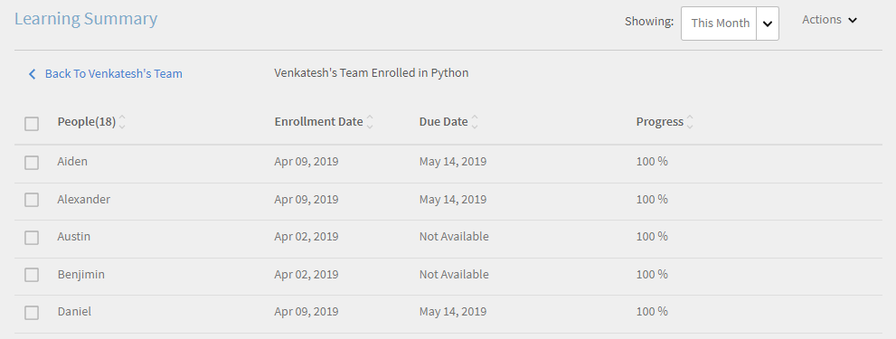
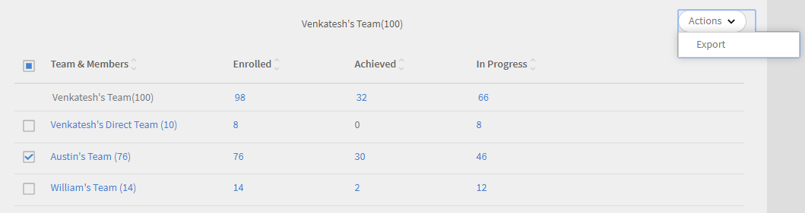

# Manager-Dashboard

Erfahren Sie, wie Sie Lernergebnisse über das Manager-Dashboard anzeigen und verfolgen können.

Führungskräfte spielen eine wichtige Rolle bei den Lerninitiativen eines Teams. Um sie besser zu führen, bietet die Lernplattform dem Manager eine Dashboard-Ansicht, um die Lernergebnisse in seinem Team zu verfolgen.

*Dashboard-Bericht für einen Manager*

Um die Details eines Diagramms anzuzeigen, klicken Sie auf das Diagramm oder auf **[!UICONTROL Details]** Hyperlink.

## Übersicht zu Lernprogrammen {#learningsummary}

Ein Manager kann die Zusammenfassung der Lernaktivitäten für sein Team über einen ausgewählten Zeitraum anzeigen. Wählen Sie im Dropdown-Menü die Option Monat, Quartal oder Jahr aus.

&quot;Monat&quot; und &quot;Jahr&quot; basieren auf dem Kalenderjahr, während &quot;Quartal&quot; auf dem Geschäftsjahr basiert, wie vom Administrator in den Kontoeinstellungen konfiguriert.

*Anzeigen von Lernaktivitäten über einen Zeitraum*

## Teamansicht {#teamview}

In der Team-Ansicht werden die Teams, ihre Mitglieder sowie die jeweiligen Registrierungen, Fortschritte und Abschlüsse für Lernobjekte angezeigt.

*In der Team-Ansicht werden die Teams, ihre Mitglieder und die jeweiligen Registrierungen angezeigt*

Wenn Sie auf die Teamnamen klicken, z. B. &quot;Venkatesh&#39;s Team&quot;, können Sie die Mitglieder im Team von Venkatesh zusammen mit der Gesamtzahl der Registrierungen, Fortschritte und Abschlüsse für ein Lernobjekt anzeigen.

*Team-Mitglied auswählen*

Um die Übersicht zu Lernprogrammen für jedes Teammitglied anzuzeigen, klicken Sie in der entsprechenden Spalte auf die Nummer, die dem Teammanager entspricht. Es wird eine Tabelle geöffnet, in der die Liste der Lernobjekte mit Informationen zum Registrierungsdatum, Fälligkeitsdatum und Fortschritt angezeigt wird.

*Team-Manager auswählen*

Ebenso können Sie die Lernobjekte zusammen mit der Anzahl der Registrierungen, Fortschritte oder Abschlüsse anzeigen, indem Sie auf die Werte unter den entsprechenden Spalten klicken.

*Kurse und Lernzusammenfassung anzeigen*

Wenn Sie weiter auf die Anzahl der Registrierungen, Fortschritte oder Abschlüsse für jedes Lernen klicken, können Sie die folgenden Details anzeigen: Personen, Anmelde-/Abschlussdatum, Fälligkeitsdatum und Fortschritt.

*Anmelde-/Abschlussdatum, Fälligkeitsdatum und Fortschritt anzeigen*

## Lernansicht {#learningsview}

Die Lernobjektansicht zeigt die Anzahl der Registrierungen, Fortschritte und Abschlüsse für ein Lernobjekt an.

Um Details anzuzeigen, einschließlich Personen, Registrierungsdaten, Fälligkeitsdaten und Fortschritt für die jeweiligen Lernobjekte, klicken Sie auf die entsprechenden Werte in den Spalten &quot;Registrierungen&quot;, &quot;Fortschritte&quot; und &quot;Abschlüsse&quot;.

*Lernansicht*

## Bericht exportieren {#exportreport}

Um einen Excel-Bericht zu erstellen, klicken Sie auf **[!UICONTROL Aktionen] > [!UICONTROL Bericht]**

## Konformitätsstatus {#compliancestatus}

Manager können den allgemeinen Konformitätsstatus des Teams für konfigurierte Lernaktivitäten im Kompatibilitäts-Dashboard anzeigen. Die Lernliste ist konfigurierbar, und der Manager kann die Lernergebnisse auswählen, um den Konformitätsstatus zu verfolgen.

Auf diesem Dashboard können Manager auch die Teilnehmer anzeigen, die mit einem sicheren Termin, einem nahenden Termin und nicht mit einem ausgewählten Lernobjekt konform sind.

Lernobjekte mit Abschlussfristen können im Kompatibilitäts-Dashboard für die Verfolgung konfiguriert werden.

**konform**: Zeigt die Anzahl der Teilnehmer an, die das Lernobjekt innerhalb des Abschlusszeitraums abgeschlossen haben.

**Sichere Frist**: Zeigt die Anzahl der Teilnehmer an, für die weniger als 30 Tage zur Verfügung stehen, um ein Lernobjekt abzuschließen.

**Bevorstehende Frist**: Zeigt die Anzahl der Teilnehmer an, für die mehr als 30 Tage verfügbar sind, um ein Lernobjekt abzuschließen.

**Nicht konform**: Zeigt die Anzahl der Teilnehmer an, die das Lernobjekt nicht innerhalb der Abschlussfrist abgeschlossen haben.

*Kompatibilitäts-Dashboard anzeigen*

## Team-Ansicht {#TeamView-1}

Zeigt den Konformitätsstatus eines Kurses für die jeweiligen Teams an. &quot;Kompatibel&quot;, &quot;Sichere Frist&quot;, &quot;Bevorstehende Frist&quot; und &quot;Nicht kompatibel&quot; sind Spalten in der Tabelle &quot;Teamansicht&quot;.

*Konformitätsstatus eines Kurses für die jeweiligen Teams*

Um die Namen der Mitglieder in einem Team und die individuelle Anzahl der Kurse anzuzeigen, deren Status &quot;Konformität&quot; ist, klicken Sie unter &quot;Sichere Frist&quot; auf &quot;Bevorstehende Frist&quot; und &quot;Nicht konform&quot; auf die entsprechenden Werte in der Tabelle.

*Einzelne Teams auswählen*

Wenn Sie weiter auf die Werte in der Spalte für den konformen, sicheren Termin, den bevorstehenden Termin und den nicht konformen Zeitraum klicken, werden die entsprechenden Kursdetails angezeigt: Name des Lernobjekts, Anmelde-/Abschlussdatum, Fälligkeitsdatum und Fortschritt in Prozent.

 

*Anzeigen des Kursfortschritts*

## Lernansicht {#LearningsView-1}

In der Ansicht &quot;Compliance-Status - Lernergebnisse&quot; wird die Liste der Lernobjekte und die entsprechende Anzahl von Teammitgliedern, die innerhalb einer sicheren Frist konform sind, eine bevorstehende Frist haben oder nicht konform sind, angezeigt.

*Abgabetermin und Konformitätsstatus anzeigen*

Wenn Sie weiter auf die Werte in den Spalten für den konformen, sicheren Termin, den bevorstehenden Termin und den nicht konformen Zeitraum klicken, werden die folgenden Daten angezeigt: Personen, Registrierungsdatum, Abschlussdatum und Fortschritt.

*Details zur Compliance anzeigen*

## Daten exportieren und E-Mails senden {#exportdataampsendemails}

* Um den Konformitätsstatus für die Team- und Lernansicht zu exportieren, klicken Sie auf **[!UICONTROL Aktionen]** > **[!UICONTROL Exportieren]**.

* Um eine E-Mail an Teammitglieder zu senden, klicken Sie auf **[!UICONTROL Aktionen]** > **[!UICONTROL E-Mail senden]**.

*Exportieren und E-Mail-Daten*

## Teamkompetenzen {#teamskills}

Manager können das Diagramm für den Abschluss von Kenntnissen anzeigen und eine Prognose für den Abschluss von Kenntnissen auf verschiedenen Ebenen konfigurieren. In der Dropdown-Liste &quot;Kenntnisse&quot; sind fünf Kenntnisse aufgeführt. Der Manager lernt die von den Teammitgliedern erworbenen Fachkenntnisse kennen und erkennt starke Talente in bestimmten Fähigkeiten.

Manager können auch bestimmte Fähigkeiten in einem Team fördern, indem sie ein Ziel festlegen und vorhersagen, wie lange es dauern würde, eine Qualifikation für bestimmte Prozent eines Teams innerhalb einer Timeline zu erreichen.

Diese Prognose basiert auf Systemberechnungen, die einen Ausblick auf den Fortschritt dieser spezifischen Fähigkeiten in der Zukunft geben.

*Qualifikationsvorhersage anzeigen*

Um den Kenntnisstatus eines Teams anzuzeigen, führen Sie die folgenden Schritte aus:

1. Klicken **[!UICONTROL Teamkompetenzen]** im linken Bereich unter dem Abschnitt Ansicht &quot;Mein Team&quot;.
1. Um die angezeigten Qualifikationen anzuzeigen, klicken Sie auf den Qualifikationsfilter und wählen Sie eine Qualifikation aus der Dropdown-Liste aus.
1. Um eine Ebene (Ebene 1, Ebene 2 oder Ebene 3) auszuwählen, klicken Sie auf das Dropdown-Menü &quot;Ebene&quot;.
1. Basierend auf den ausgewählten Kenntnissen und Stufen wird ein Diagramm mit dem Kenntnisstatus angezeigt. Wenn Sie den Mauszeiger über das Diagramm bewegen, können Sie die folgenden Prozentwerte des Kenntnisstatus anzeigen: **In Bearbeitung** und **Erreicht**.

   

   *Prozentsatz des Kenntnisstatus anzeigen*

## Vorhersage des Teamabschlusses in % für Kenntnisse {#howtoforecasttheteamcompletionforaskill}

Um den Teamabschluss in % für Kenntnisse vorherzusagen, führen Sie die folgenden Schritte aus:

1. Klicken Sie auf den Hyperlink zum Konfigurieren, um den configure-Tracker anzuzeigen.

   

   *Wählen Sie den Hyperlink Konfigurieren aus*

1. Geben Sie im Popup-Dialogfeld &quot;Konfigurieren&quot; für die Kenntnisse, die Sie konfigurieren möchten, einen Prozentwert in das Feld &quot; **Zielvervollständigung %** und das Datum, bis zu dem Sie den Zielabschluss % im Dialogfeld &quot; **Zieldatum** field.****

   

   *Zielabschlussprozentsatz eingeben*

1. Um die Ausgabe für Ihre Prognose anzuzeigen, klicken Sie auf das Symbol **Kostenvoranschlag** klicken. Die Ausgabe sieht wie im folgenden Screenshot aus.

   

   *Ausgabe des Qualifikationstraktors anzeigen*

## Qualifikationsstufen-Abschlussvorhersage {#skilllevelcompletionforecast}

Der Manager eines Teams kann den Teamabschlussprozentsatz einer Qualifikation für einen bestimmten Zeitraum basierend auf dem Zielabschlussprozentsatz und der Datumszeit, die im Qualifikationstracker angegeben sind, anzeigen und konfigurieren.

Im Prognosediagramm gibt es zwei Arten von Linien (durchgehende und gepunktete Linie) mit jeweils drei Scheitelpunkten.

Auf der durchgezogenen Linie zeigt der erste Punkt das Datum für die erste Registrierung für eine Kenntnisstufe an.

*Erste Registrierung für Kenntnisstufe anzeigen*

Der zweite Punkt zeigt das aktuelle Datum und den Teamabschluss in % der Kenntnisstufe an.

*Aktuelles Datum und Teamabschluss % Stufe der Kenntnisse anzeigen*

Der dritte Punkt in der Zeile zeigt den erwarteten Zielabschluss in % und das Zielabschlussdatum an.

*Erwartete Zielabschlussrate % und Zielabschlussdatum anzeigen*

## Vorhersageposition {#forecastline}

Die gepunktete Linie ist die Vorhersagelinie, die die Vorhersage in Abhängigkeit vom aktuellen Teamabschlussprozentsatz für Kenntnisse in einem bestimmten Zeitraum anzeigt.

Der erste Punkt auf der gepunkteten Linie stellt den Teamabschluss in % und den voraussichtlichen Teamabschluss in % für eine Qualifikation an diesem Datum dar.

*Teamabschluss % und voraussichtlicher Teamabschluss % für Kenntnisse anzeigen*

Der zweite Punkt zeigt das Datum an, an dem der projizierte Teamabschluss in % für eine Qualifikation erreicht wurde.

*Das Datum anzeigen, an dem der projizierte Teamabschluss in % für Kenntnisse erreicht wurde*

Der dritte Punkt in der Vorhersagezeile zeigt den Teamabschluss in % an, der am Zieldatum erreicht wurde, das in der Kenntnisverfolgung angegeben ist.

*Teamabschluss in % anzeigen, der am Zieldatum im Kenntnistracker erreicht wird*

Unter dem Diagramm wird eine Tabelle mit der Ansicht des Teams und der Anzahl der Kenntnisse angezeigt, die registriert, erreicht und in Bearbeitung sind. Wenn ein Lernen ein Abschlussdatum hat, wird auch das erwartete Abschlussdatum angezeigt.

*Tabelle mit der Ansicht des Teams und der Anzahl der Kenntnisse, die angemeldet, erreicht und in Bearbeitung sind*

Wenn Sie auf den Teamnamen klicken, wird die Liste der Mitglieder, die sich für die Kenntnisse registriert haben, der Kenntnisstatus und das Abschlussdatum angezeigt.

*Mitgliederliste anzeigen*

Wenn Sie auf das Team klicken, können Sie die darin enthaltenen Mitglieder und die entsprechenden Details zu den ausgewählten Kenntnissen anzeigen, z. B. ob registriert, der Status (ob in Bearbeitung oder erreicht) und das Abschlussdatum, sofern festgelegt.

*Kenntnisse der Mitglieder anzeigen*

Wenn Sie die Werte für ein Team in der Spalte &quot;Registrierung, erreicht&quot; und &quot;In Bearbeitung&quot; auswählen, können Sie die Anzahl der Benutzer anzeigen, die sich für die Kenntnisse registriert haben. Sie können auch das Datum anzeigen, an dem sich der Benutzer für Kenntnisse registriert hat, den Status und das Abschlussdatum, wenn die Kenntnisse vom Benutzer abgeschlossen wurden.

<!-- -->

## Bericht exportieren {#Exportreport-1}

* Klicken **[!UICONTROL Aktionen]** > **[!UICONTROL Exportieren]** , um die Daten als Excel-Datei zu exportieren.

*Daten exportieren.*
