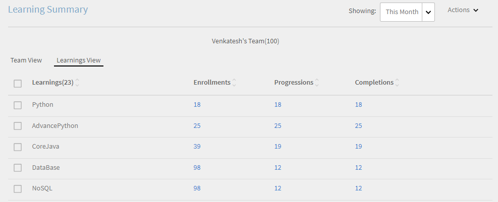
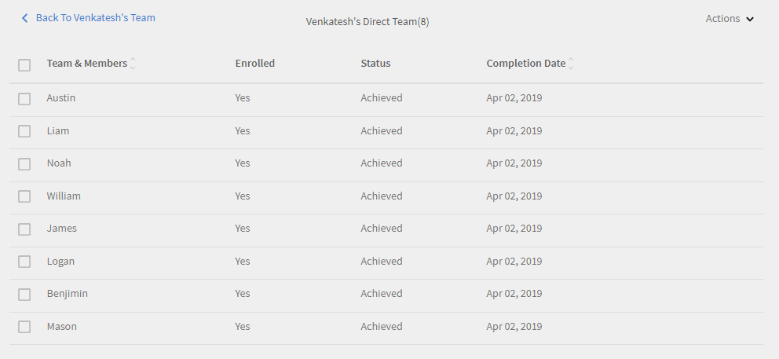

# Manager-Dashboard

Erfahren Sie, wie Sie Lernergebnisse über das Manager-Dashboard anzeigen und verfolgen können.

Führungskräfte spielen eine wichtige Rolle bei den Lerninitiativen eines Teams. Zur besseren Orientierung bietet die Lernplattform dem Manager eine Dashboard-Ansicht, um die Lernergebnisse in seinem Team zu verfolgen.

*Dashboard-Bericht für einen Manager*

Um die Details eines Diagramms anzuzeigen, klicken Sie auf das Diagramm oder auf den Hyperlink **[!UICONTROL Details]**.

## Übersicht zu Lernprogrammen {#learningsummary}

Ein Manager kann die Zusammenfassung der Lernaktivitäten für sein Team über einen ausgewählten Zeitraum anzeigen. Wählen Sie Monat, Quartal oder Jahr aus dem Dropdown-Menü aus.

„Monat“ und „Jahr“ basieren auf dem Kalenderjahr, während „Quartal“ auf dem Geschäftsjahr basiert, das vom Administrator in den Kontoeinstellungen konfiguriert wurde.

*Anzeigen von Lernaktivitäten über einen Zeitraum*

## Teamansicht {#teamview}

In der Teamansicht werden die Teams, ihre Mitglieder und ihre jeweiligen Registrierungen, Fortschritte und Abschlüsse für Lernobjekte angezeigt.

*In der Team-Ansicht werden die Teams, ihre Mitglieder und die jeweiligen Registrierungen angezeigt*

Wenn Sie auf die Teamnamen klicken, z. B. &quot;Venkatesh&#39;s Team&quot;, können Sie die Mitglieder im Team von Venkatesh zusammen mit der Gesamtzahl der Registrierungen, Fortschritte und Abschlüsse für ein Lernobjekt anzeigen.

*Team-Mitglied auswählen*

Um die Lernzusammenfassung für jedes Teammitglied anzuzeigen, klicken Sie auf die Nummer in der jeweiligen Spalte, die dem Teammanager entspricht. Eine Tabelle wird geöffnet, in der die Liste der Lernobjekte mit Informationen zum Registrierungsdatum, Fälligkeitsdatum und Fortschritt angezeigt wird.

*Team-Manager auswählen*

Auf ähnliche Weise können Sie die Lernobjekte zusammen mit der Anzahl der Registrierungen, Fortschritte oder Abschlüsse anzeigen, indem Sie auf die Werte unter den entsprechenden Spalten klicken.

*Kurse und Lernzusammenfassung anzeigen*

Wenn Sie weiter auf die Anzahl der Registrierungen, Fortschritte oder Abschlüsse für jedes Lernen klicken, können Sie die folgenden Details anzeigen: Personen, Anmelde-/Abschlussdatum, Fälligkeitsdatum und Fortschritt.

*Anmelde-/Abschlussdatum, Fälligkeitsdatum und Fortschritt anzeigen*

## Lernansicht {#learningsview}

Die Lernansicht zeigt die Anzahl der Registrierungen, Fortschritte und Abschlüsse für ein Lernobjekt an.

Klicken Sie auf die entsprechenden Werte in den Spalten „Registrierung“, „Fortschritt“ und „Abschluss“, um Details wie Personen, Datum der Registrierung, Fälligkeitsdatum und Fortschritt der jeweiligen Lernobjekte anzuzeigen.

*Lernansicht*

## Bericht exportieren {#exportreport}

Um einen Excel-Bericht zu erstellen, klicken Sie auf **[!UICONTROL Aktionen] > [!UICONTROL Bericht]**

## Compliance-Status {#compliancestatus}

Manager können den allgemeinen Konformitätsstatus des Teams für konfigurierte Lernaktivitäten im Kompatibilitäts-Dashboard anzeigen. Die Lernliste ist konfigurierbar und der Manager kann die Lernergebnisse auswählen, um den Compliance-Status zu verfolgen.

Auf diesem Dashboard können Manager auch die Teilnehmer anzeigen, die konform sind, sich in einer sicheren Frist befinden, kurz vor dem Ablauf der Frist stehen und für ein ausgewähltes Lernobjekt nicht den Anforderungen entsprechen.

Lernobjekte mit Abschlussfristen können im Compliance-Dashboard zur Nachverfolgung konfiguriert werden.

**Konform**: Zeigt die Anzahl der Teilnehmer an, die das Lernobjekt innerhalb der Bearbeitungsfrist abgeschlossen haben.

**Sichere Frist**: Zeigt die Anzahl der Teilnehmer an, denen weniger als 30 Tage zur Verfügung stehen, um ein Lernobjekt fertigzustellen.

**Bevorstehende Frist**: Zeigt die Anzahl der Teilnehmer an, denen mehr als 30 Tage zur Verfügung stehen, um ein Lernobjekt fertigzustellen.

**Nicht konform**: Zeigt die Anzahl der Teilnehmer an, die das Lernobjekt innerhalb der Abschlussfrist nicht abgeschlossen haben.

*Kompatibilitäts-Dashboard anzeigen*

## Teamansicht {#TeamView-1}

Zeigt den Compliance-Status eines Kurses für die jeweiligen Teams an. Konform, sichere Frist, bevorstehende Frist und nicht konform sind Spalten in der Teamansicht-Tabelle.

*Konformitätsstatus eines Kurses für die jeweiligen Teams*

Um die Namen der Mitglieder in einem Team und die individuelle Anzahl der Kurse anzuzeigen, deren Status &quot;Konformität&quot; ist, klicken Sie unter &quot;Sichere Frist&quot; auf &quot;Bevorstehende Frist&quot; und &quot;Nicht konform&quot; auf die entsprechenden Werte in der Tabelle.

*Einzelne Teams auswählen*

Wenn Sie auf die Werte in der Spalte „Konform“, „Sicherer Termin“, „Anstehender Termin“ und „Nicht konform“ klicken, werden die entsprechenden Kursdetails angezeigt: Name des Lernobjekts, Anmeldungs-/Abschlussdatum, Fälligkeitsdatum und Fortschritt in Prozent.

 

*Anzeigen des Kursfortschritts*

## Lernansicht {#LearningsView-1}

In der Ansicht „Compliance-Status“ wird die Liste der Lernobjekte und die entsprechende Anzahl der Teammitglieder angezeigt, die innerhalb einer sicheren Frist, einer bevorstehenden Frist oder nicht konform sind.

*Abgabetermin und Konformitätsstatus anzeigen*

Wenn Sie auf die Werte in den Spalten „Konform“, „Sichere Frist“, „Anstehender Termin“ und „Nicht konform“ klicken, werden folgende Daten angezeigt: Personen, Registrierungsdatum, Abschlussdatum und Fortschritt.

*Details zur Compliance anzeigen*

## Daten exportieren und E-Mails senden {#exportdataampsendemails}

* Um den Konformitätsstatus für die Team- und Lernansicht zu exportieren, klicken Sie auf **[!UICONTROL Aktionen]** > **[!UICONTROL Exportieren]**.

* Um eine E-Mail an Teammitglieder zu senden, klicken Sie auf **[!UICONTROL Aktionen]** > **[!UICONTROL E-Mail senden]**.

*Exportieren und E-Mail-Daten*

## Team-Kenntnisse {#teamskills}

Manager können das Kenntnis-Abschlussdiagramm anzeigen und eine Kenntnis-Abschlussprognose auf verschiedenen Ebenen konfigurieren. Fünf Kenntnisse werden in der Dropdown-Liste für Kenntnisse aufgeführt. Der Manager lernt die von den Teammitgliedern erworbene Expertise kennen und identifiziert starke Talente für bestimmte Kenntnisse.

Manager können auch bestimmte Kenntnisse in einem Team verbessern, indem sie ein Ziel festlegen und vorhersagen, wie lange es dauern würde, um Kenntnisse für einen bestimmten Prozentsatz eines Teams innerhalb einer Zeitleiste zu erreichen.

Diese Prognose basiert auf Systemberechnungen, die einen Ausblick auf den Fortschritt dieser spezifischen Kenntnisse geben.

*Qualifikationsvorhersage anzeigen*

Um den Kenntnisstatus eines Teams anzuzeigen, führen Sie die folgenden Schritte aus:

1. Klicken **[!UICONTROL Teamkompetenzen]** im linken Bereich unter dem Abschnitt Ansicht &quot;Mein Team&quot;.
1. Um die Kenntnisse anzuzeigen, klicken Sie auf den Filter für Kenntnisse und wählen Sie einen aus der Dropdown-Liste aus.
1. Um eine Ebene auszuwählen (Ebene 1, Ebene 2 oder Ebene 3), klicken Sie auf das Dropdown-Menü der Ebene.
1. Basierend auf den ausgewählten Kenntnissen und der ausgewählten Ebene wird eine Grafik mit ihrem Kenntnisstatus angezeigt. Wenn Sie mit der Maus über das Diagramm fahren, können Sie die folgenden Prozentsätze des Kenntnisstatus anzeigen: **In Bearbeitung** und **Erreicht**.

   

   *Prozentsatz des Kenntnisstatus anzeigen*

## Wie man den Teamabschluss in % für Kenntnisse voraussagt {#howtoforecasttheteamcompletionforaskill}

Folgen Sie den nachstehenden Schritten, um den Teamabschluss in % für Kenntnisse vorauszusagen

1. Um den Konfigurations-Tracker anzuzeigen, klicken Sie auf den Hyperlink zum Konfigurieren.

   

   *Wählen Sie den Hyperlink Konfigurieren aus*

1. Geben Sie im Popup-Dialogfeld &quot;Konfigurieren&quot; für die Kenntnisse, die Sie konfigurieren möchten, einen Prozentwert in das Feld &quot; **Zielvervollständigung %** und das Datum, bis zu dem Sie den Zielabschluss % im Dialogfeld &quot; **Zieldatum** field.****

   

   *Zielabschlussprozentsatz eingeben*

1. Klicken Sie auf die Schaltfläche **Schätzen**, um die Ausgabe für Ihre Prognose anzuzeigen . Die Ausgabe sieht wie im folgenden Screenshot aus.

   

   *Ausgabe des Qualifikationstraktors anzeigen*

## Prognose für Kenntnisstufenabschluss {#skilllevelcompletionforecast}

Der Manager eines Teams kann den Prozentsatz des Team-Abschlusses von Kenntnissen für einen bestimmten Zeitraum anzeigen und konfigurieren, basierend auf dem Ziel-Abschluss-Prozentsatz und der im Kenntnis-Tracker angegebenen Datumszeit. 

Im Prognosediagramm gibt es zwei Arten von Linien (durchgezogene und gepunktete Linie) mit jeweils drei Scheitelpunkten.

In der durchgezogenen Linie zeigt der erste Punkt das Datum für die erste Registrierung für eine Kenntnisstufe an.

*Erste Registrierung für Kenntnisstufe anzeigen*

Der zweite Punkt zeigt das aktuelle Datum und den Abschlussgrad von Kenntnissen in % an.

*Aktuelles Datum und Teamabschluss % Stufe der Kenntnisse anzeigen*

Der dritte Punkt in der Zeile zeigt den erwarteten Abschlussgrad und den Abschlusszeitpunkt.

*Erwartete Zielabschlussrate % und Zielabschlussdatum anzeigen*

## Prognoselinie {#forecastline}

Die gepunktete Linie ist die Prognoselinie, in der die Prognose für Kenntnisse in einem bestimmten Zeitraum in Abhängigkeit vom aktuellen Teamabschluss in % angezeigt wird.

Der erste Punkt auf der gepunkteten Linie repräsentiert den Team-Abschluss in % und den voraussichtlichen Team-Abschluss in % für Kenntnisse an diesem Datum.

*Teamabschluss % und voraussichtlicher Teamabschluss % für Kenntnisse anzeigen*

Der zweite Punkt zeigt das Datum, an dem der geplante Teamabschluss in % für Kenntnisse erreicht wurde.

*Das Datum anzeigen, an dem der projizierte Teamabschluss in % für Kenntnisse erreicht wurde*

Der dritte Punkt in der Prognoselinie zeigt den Teamabschluss in % an, der am Stichtag im Kenntnis-Tracker erreicht wurde.

*Teamabschluss in % anzeigen, der am Zieldatum im Kenntnistracker erreicht wird*

Unter dem Diagramm wird eine Tabelle mit der Teamansicht und der Anzahl der registrierten, erreichten und in Bearbeitung befindlichen Kenntnisse angezeigt. Wenn ein Lernprogramm ein Abschlussdatum hat, wird auch das erwartete Abschlussdatum angezeigt.

*Tabelle mit der Ansicht des Teams und der Anzahl der Kenntnisse, die angemeldet, erreicht und in Bearbeitung sind*

Wenn Sie auf den Teamnamen klicken, werden die Liste der Mitglieder, die sich für die Kenntnisse angemeldet haben, sowie deren Status und Abschlussdatum angezeigt.

*Mitgliederliste anzeigen*

Wenn Sie auf das Team klicken, können Sie die darin enthaltenen Mitglieder und die entsprechenden Details zu den ausgewählten Kenntnissen anzeigen, z. B. ob registriert, der Status (ob in Bearbeitung oder erreicht) und das Abschlussdatum, sofern festgelegt.

*Kenntnisse der Mitglieder anzeigen*

Bei der Auswahl der Werte für ein Team in den Spalten „Registrierung“, „Erreicht“ und „In Bearbeitung“ können Sie die Anzahl der Benutzer anzeigen, die sich für die Kenntnisse registriert haben. Sie können auch das Datum anzeigen, an dem sich der Benutzer für die Kenntnisse angemeldet hat, den Status und das Abschlussdatum, wenn die Kenntnisse vom Benutzer abgeschlossen wurden.

<!-- -->

## Bericht exportieren {#Exportreport-1}

* Klicken **[!UICONTROL Aktionen]** > **[!UICONTROL Exportieren]** , um die Daten als Excel-Datei zu exportieren.

*Daten exportieren.*
