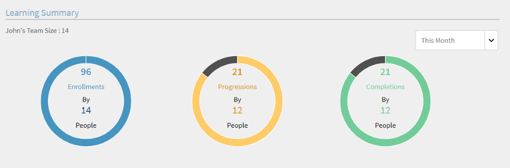
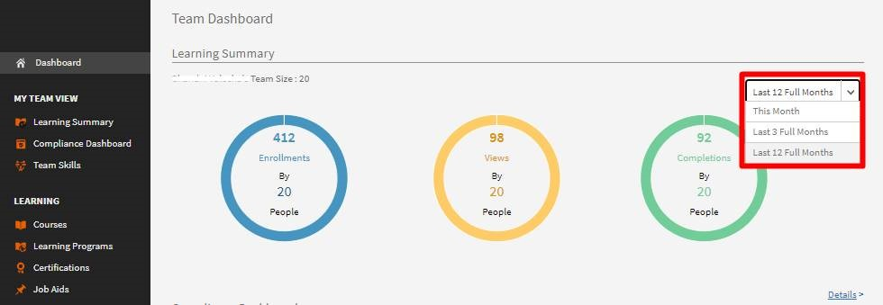
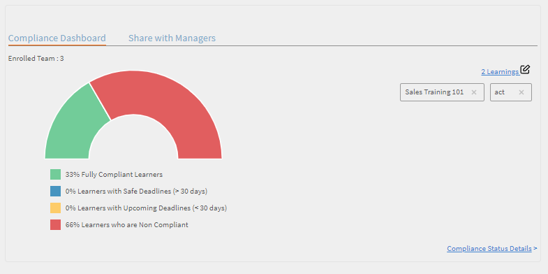
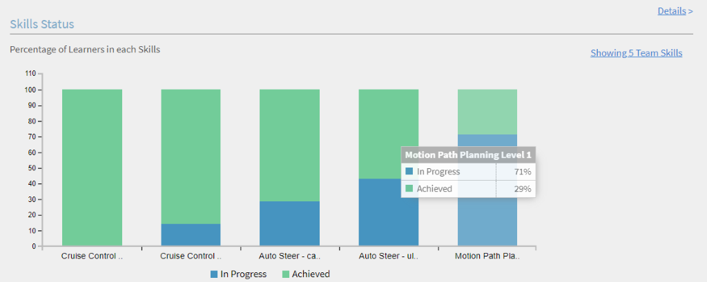
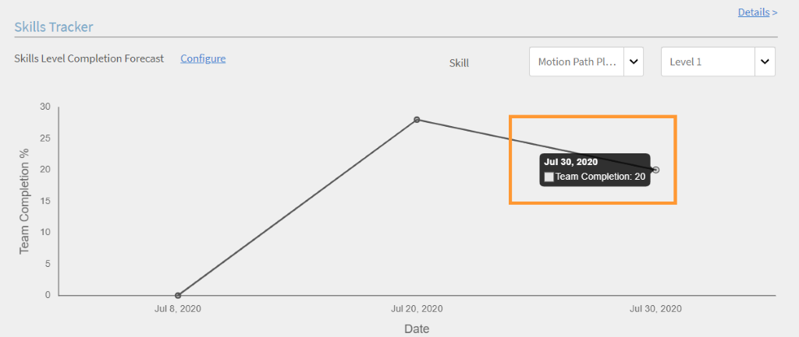
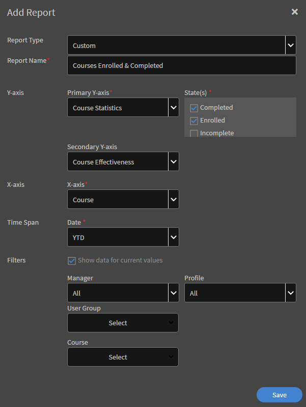
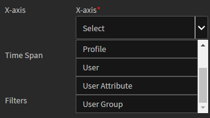
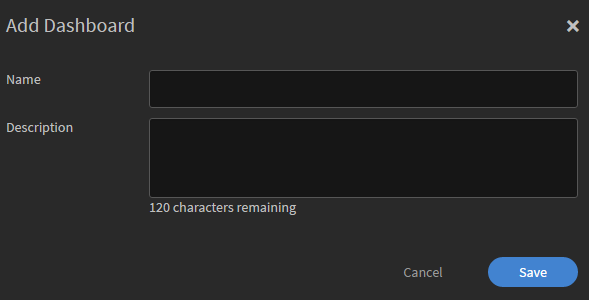
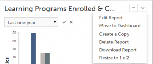

# Berichte

Erstellen und Verwalten von Berichten für Manager.

Mit Adobe Learning Manager können Sie verschiedene Berichte erstellen, um die Aktivitäten der Teilnehmer zu verfolgen, zu überwachen und zu kontrollieren. Aktivitäten von Teilnehmern werden verfolgt und automatisch in der Datenbank erfasst. Manager- und Administratoren-Berichte werden von der Datenbank aus erstellt.

## Übersicht {#overview}

Berichte für Administratoren und Manager werden auf dieselbe Weise erstellt. Manager können Berichte über ihre Mitarbeiter anzeigen, Administratoren hingegen alle Berichte im Unternehmen.

Berichte werden in einem Dashboard generiert. Ein Bericht muss sich in einem Dashboard befinden. Standardmäßig ist auf der Berichtsseite ein **Standard-Dashboard** vorhanden. Alle Berichte, die Sie hinzufügen, werden in dieses Standard-Dashboard verschoben. Um einem einzelnen Dashboard einen Bericht hinzuzufügen, wählen Sie in der Dropdownliste Bericht hinzufügen. Genauere Informationen über das Erstellen von Dashboards finden Sie im Bereich „Dashboards“ auf dieser Seite.

## Manager-Dashboards {#manager-dashboards}

Ein Manager kann Informationen über sein direktes oder indirektes Team als Zusammenfassung anzeigen.

Der Manager kann dann den Bericht nach Bereichen wie Quartal, aktueller Monat, drei letzte gesamte Monate und letzte 12 gesamte Monate filtern.

## Übersicht zu Lernprogrammen {#learningsummary}

*Lernzusammenfassung anzeigen*

*Lernzusammenfassung nach Datum filtern*

## Kompatibilitäts-Dashboard {#compliancedashboard}

Prüfen Sie die Compliance Ihres Teams und bei welchen Teammitgliedern die Compliance gefährdet ist. Wählen Sie die Lernobjekte aus und zeigen Sie den Status der einzelnen Lernobjekte an.

*Kompatibilitäts-Dashboard anzeigen*

## Qualifikationsstatus {#skillsstatus}

Zeigen Sie für jede Qualifikation den Prozentsatz der Teilnehmer an. Wählen Sie höchstens fünf Qualifikationen aus, für die Sie die Kenntnisse für Teilnehmer anzeigen möchten. Die Visualisierung erfolgt in Form eines gestapelten Balkendiagramms. Wenn Sie den Mauszeiger über die einzelnen Balken bewegen, können Sie die Statusaufschlüsselung dieser Qualifikationen anzeigen.

*Status der Kenntnisse eines Teilnehmers anzeigen*

## Kenntnis-Tracker {#skilstracker}

Zeigen Sie eine Qualifikationsabschlussprojektion für ein Team an. Wählen Sie den Zielabschlussprozentsatz und das Datum einer Qualifikation.

Basierend auf Verlaufsdaten können Sie eine grafische Darstellung der Qualifikationsabschlussprojektion am ausgewählten Datum anzeigen.

*Qualifikationsabschlussprojektion anzeigen*

## Erstellen von Projekten {#creatingreports}

1. Klicken Sie auf „Berichte“ im linken Bereich. Die Seite mit der Berichtzusammenfassung wird angezeigt.\
   **Hinweis**
Standardmäßig werden mindestens drei Beispielberichte auf der Seite mit der Berichtszusammenfassung angezeigt. Sie können diese Beispielberichte nicht bearbeiten, sondern nur anzeigen, um zu sehen, wie Sie sie erstellen und anpassen können.

1. Klicken Sie auf der Seite mit der Berichtszusammenfassung auf „Hinzufügen“. Das Dialogfeld „Berichterstellung“ wird angezeigt.
1. Klicken Sie auf „Speichern“, um die Berichterstellung abzuschließen. Nachfolgend sehen Sie einen Beispielbericht.

*Dialogfeld &quot;Bericht hinzufügen&quot;*

Unter „Berichtstyp“ können Sie einen Satz vordefinierter Berichte oder „Benutzerdefiniert“ auswählen. Sie können die folgenden Berichte als Teil der vordefinierten Berichte aufrufen:

* Zugewiesene und erreichte Kenntnisse
* Kursregistrierungen und -abschlüsse
* Effektivität von Kursen
* Lernprogrammregistrierungen und -abschlüsse
* Aufgewandte Lernzeit pro Kurs
* Aufgewandte Lernzeit pro Quartal

Mit den oben genannten Berichtstypen können Sie mehr als 300 unterschiedliche Berichtsvarianten generieren.

Berichtname: Geben Sie einen Titel für den Bericht ein.

**Primäre y-Achse** Wählen Sie aus den Dropdownoptionen die wichtigsten bzw. primären Kriterien für Ihren Bericht aus. Bei einigen der ausgewählten Kriterien haben Sie die Möglichkeit, einen oder mehrere Status aus dem nebenstehenden Dropdownfeld auszuwählen. Beim primären Kriterium der Statistik zur Kursregistrierung können die Status beispielsweise „Abgeschlossen“, „Nicht abgeschlossen“, „Registriert“ usw. lauten. Daten des primären Bereichs werden im Bericht in Form von Balkendiagrammen dargestellt.

**Sekundäre y-Achse** Wählen Sie aus den Dropdownoptionen die Kriterien für die sekundäre y-Achse bzw. den Bereich für Ihren Bericht aus. Wählen Sie beispielsweise bei der Option zur Lernprogrammregistrierung einen oder mehrere Status aus dem nebenstehenden Dropdownfeld aus. Sekundäre Bereichsdaten werden im Bericht in Form von Liniendiagrammen dargestellt.

**x-Achse** Wählen Sie die für Ihren Bericht geeigneten x-Achsen-Kriterien aus den Dropdownoptionen aus. Wenn Sie das Datum als Kriterium für die x-Achse ausgewählt haben, steht Ihnen eine Option zur Gruppierung des x-Achsen-Kriteriums nach Tag, Monat, Quartal und Jahr zur Verfügung.

**Datum**: Wählen Sie die gewünschte Option in der Dropdownliste aus. Optionen: letzter Monat, Quartal, Jahr, QTD (letzte 90 Tage), seit Jahresbeginn (letzte 365 Tage) und Datumsbereich. Wenn Sie Datumsbereich wählen, geben Sie das Start- und Enddatum wie folgt an:

**Von** Wählen Sie das Startdatum, bei dem der Bericht beginnen soll.

**Bis** Wählen Sie das Enddatum für Ihren Bericht.

## Filter {#filters}

Filter werden im Dialogfeld „Bericht hinzufügen“ am unteren Rand basierend auf Berichtstypen, die Sie ausgewählt haben, angezeigt. Einige der wichtigsten Filter sind nachfolgend aufgeführt.

**Manager** Sie können jeden der Manager basierend auf der Hierarchieebene auswählen. Bei einigen Managern können untergeordnete Manager vorhanden sein, denen wiederum mehrere Mitarbeiter unterstellt sind.

**Profil** Wählen Sie die Bezeichnung Ihres Mitarbeiters aus. Das hilft dabei, Berichte von Mitarbeitern basierend auf ihrem Profil/ihrer Einstufung abzurufen. Beispiel: Informatiker, Ingenieur usw.

**Benutzergruppe** Wählen Sie die Benutzergruppe aus, je nachdem, wie Sie die Berichte filtern möchten. Learning Manager ruft die Benutzergruppen auf, die für Ihr Konto definiert wurden, aus der Benutzerfunktion aus.

**Kurs** Sie können Ihren Bericht nach Kursen filtern, indem Sie diese in der Dropdownliste auswählen.

*Kursdiagramm anzeigen, in dem Kurse registriert und abgeschlossen sind*

>[!NOTE]
>
>Über der Legende für das Diagramm können Sie ein Zoomfeld anzeigen Sie können mit dem Cursor darauf zeigen, darauf klicken und das Cursorkreuz über die Bereiche des Zoomfelds ziehen, die Sie vergrößern möchten.

Sie können die Werte der sekundären y-Achse in Form einer Linie durch die Diagrammbalken anzeigen. Im oben angeführten Beispiel sehen Sie beispielsweise die Werte für die Effektivität in einer grauen Linie durch das Diagramm.

## Benutzergruppenberichte {#user-group-reporting}

Verfolgen Sie nach, wie Benutzergruppen wie gut Abteilungen, externe Partner und Rollen im Vergleich zu anderen Benutzergruppen oder im Vergleich zu anderen Lernobjektiven funktionieren.

### Benutzergruppen {#usergroups}

Um Berichte basierend auf Benutzergruppen zu generieren, wählen Sie **Benutzergruppe** auf der X-Achse aus der Liste der Dropdown-Optionen (siehe Screenshot unten).

*Generieren von Benutzergruppenberichten*

Ein anderes Dropdownmenü&#x200B;**Auswahl** wird neben der x-Achse mit einer Liste von Benutzergruppen angezeigt, die für Ihr Konto vorhanden sind. In diesem Dropdownmenü können Sie eine oder mehrere Benutzergruppen wählen.

Wenn Sie mehrere Benutzergruppen ausgewählt haben, wird, nachdem Sie den Bericht speichern und erstellen, der Bericht mit allen Benutzergruppen, die im Balkendiagramm neben jeder x-Achse dargestellt werden, erstellt.

Dieser Benutzergruppebericht ermöglicht Ihnen, die Leistung von einer Abteilung/Division/Rolle von Rolle mit anderen zu vergleichen, um ihre Lernleistungen auszuwerten.

### Benutzerdefinierte Benutzergruppen/Benutzerattribute {#customusergroupsuserattributes}

Sie können eigene Benutzergruppen mit der Funktion „Benutzer/Benutzergruppen hinzufügen“ in Learning Manager erstellen. Nachdem Sie die Benutzergruppen erstellt haben, können Sie die Berichte für die benutzerdefinierten Benutzergruppen mit einer Liste der Attribute wie Ort, Zweigstelle usw. generieren.

Wählen Sie in der X-Achse die Benutzerattributoption und wählen Sie das Attribut aus dem Dropdownmenü &quot;**Auswählen**&quot; daneben. Um einen benutzerdefinierten Benutzergruppebericht zu erstellen, der auf diesen Attributen basiert, müssen Sie auch die entsprechende Benutzergruppe im Filter wählen.

Manager können Benutzergruppeberichte nur für ihre eigenen Teammitglieder als Teilnehmer erstellen.

## Berichtstypen {#typesofreports}

* Statistiken zur Kursbereitstellung für Teilnehmer
* Bericht zur Effektivität von Kursen
* Bericht zu Kenntnissen der Teilnehmer
* Statistik zur Registrierung der Teil für Lernprogramme
* Von den Teilnehmern aufgewandte Lernzeit
* Abschluss der Zertifizierung

## Meine Berichte {#myreports}

Ein Dashboard ist eine Sammlung von Berichten. Sie können die Berichte im Dashboard nach Ihrem Bedarf gruppieren.

**Beispielberichte**

Klicken Sie auf diese Registerkarte, um einige Musterberichte anzuzeigen, die aufgrund von Beispieldaten erstellt wurden. Sehen Sie sich diese Berichte an, um zu verstehen, welche funktionsreichen Berichtsvarianten Sie mit Ihren Kontodaten generieren können.

**Meine Berichte**

Klicken Sie auf diese Dashboard-Registerkarte, um alle von Ihnen erstellten Dashboards anzuzeigen. In der Dropdownliste „Dashboard anzeigen“ können Sie das Standard-Dashboard oder von Ihnen selbst erstellte Dashboards auswählen.

**Zum Dashboard hinzufügen**

1. Klicken Sie im rechten Teil der Seite auf „Dashboard hinzufügen“, um eigene Dashboards zu erstellen.

   

   *Eigenes Board erstellen*

1. Geben Sie den Namen und die Beschreibung des Dashboards ein und klicken Sie auf **[!UICONTROL Speichern]**.

Sie können das kürzlich erstellte Dashboard in der Liste „Meine Dashboards“ sehen.

Um Ihrem Dashboard Berichte hinzuzufügen, klicken Sie in der rechten oberen Ecke Ihres Dashboard-Fensters auf die Dropdownliste und auf Bericht hinzufügen. Der so erstellte Bericht wird mit Ihrem Dashboard verknüpft.

>[!NOTE]
>
>Berichte, die Sie erstellen, indem Sie in der rechten oberen Ecke der Seite &quot;Berichte&quot; auf &quot;Hinzufügen&quot; klicken, werden Ihrem Standard-Dashboard hinzugefügt.

**Freigegebene Berichte**

Freigegebene Berichte sind eine Sammlung von Berichten, die andere Benutzer im Unternehmen für Sie freigegeben haben. Wenn Sie über die Berechtigungen verfügen, können Sie die freigegebenen Berichte herunterladen oder kopieren. Wenden Sie sich an den Administrator Ihres Unternehmens, um Berechtigungen für den Download/für das Kopieren der freigegebenen Berichten zu erhalten.

**Abonnierte Berichte**

Sie können Ihren bevorzugten Berichte abonnieren, indem Sie hier Ihre E-Mail angeben. Ihre abonnierten Berichte werden Ihnen per E-Mail zugesendet.

Klicken Sie auf **Bearbeiten** in der rechten Ecke des Berichtnamens in der Berichteliste, um Ihr Abonnement zu ändern.

## Anzeigen von Berichten {#viewingreports}

Auf der Seite mit der Berichtszusammenfassung können Sie alle Berichte anzeigen. Sie können jeden Bericht minimieren, indem Sie auf das Minussymbol (-) in der rechten oberen Ecke jedes Berichts klicken. Klicken Sie auf das Pluszeichen (+), um den Bericht erneut anzuzeigen.

**Schnellansicht mit unterschiedlichen Kalenderdaten**

Die Kalenderdaten bei der Anzeige des Berichts sind temporär. Wenn Sie die Option „Herunterladen“ wählen, wird diese Berichtsansicht nicht heruntergeladen. Es handelt sich nur um eine temporäre Ansicht.

Sie können den Datumsbereich/-wert für jeden Bericht ändern und diesen schnell für ein anderes Datum anzeigen, ohne dabei den Bericht selbst zu ändern und zu speichern. Klicken Sie auf das Symbol „Bearbeiten“ neben dem Datumsbereich (wie in der Abbildung unten mit dem Pfeil gezeigt), z. B. QTD, letztes Jahr usw. Wählen Sie einen neuen Wert aus dem Dropdown-Menü aus und klicken Sie auf das Häkchen, um die Änderung zu bestätigen. Sie können die Änderungen verwerfen, indem Sie auf „X“ klicken.

**Schnellansicht mit verschiedenen Managern**

Wenn Ihnen mehrere Manager unterstellt sind, können Sie die Berichte für jeden Manager schnell anzeigen. Wählen Sie in der Dropdownliste den Managernamen, um einen spezifischen Bericht für den entsprechenden Manager anzuzeigen.**Berichte bearbeiten/in Dashboard verschieben/Kopie erstellen/löschen/Größe ändern** Klicken Sie auf den Dropdown-Pfeil in der oberen rechten Ecke jedes Berichts, um die Dropdown-Optionen &quot;Bearbeiten&quot;/&quot;In Dashboard verschieben&quot;/&quot;Kopie erstellen&quot;/&quot;Löschen&quot;/&quot;Größe ändern&quot; anzuzeigen.

<!---->

**Bearbeiten** Um nach dem Ändern von Daten zu den Anfangswerten zurückzukehren, klicken Sie auf „Zurücksetzen“. Klicken Sie auf „Speichern“, nachdem Sie die Werte geändert haben.

**Ins Dashboard verschieben** Sie können den aktuellen Bericht in ein anderes Dashboard verschieben, das Sie aus der Liste der Dashboards auswählen.

**Kopie erstellen** Sie können den Bericht in dasselbe oder ein anderes Dashboard kopieren , das Sie aus der Liste der Dashboards auswählen.

**Löschen** Klicken Sie auf „Löschen“, um den Bericht zu entfernen. Bevor Sie den Bericht löschen können, wird eine Warn- bzw. Bestätigungsmeldung angezeigt.

**Größe ändern** Sie können die Größe Ihrer Berichte ändern in 1×1 (mittel) und 2×2 (groß).

## E-Mail-Abonnements {#emailsubscriptions}

Sie erhalten Ihre wichtigsten Berichte per E-Mail, indem Sie sie abonnieren.

Klicken Sie auf der Berichte-Seite neben der Schaltfläche „Hinzufügen“ in der rechten oberen Ecke der Seite auf „E-Mail-Abonnement“. Die Seite zum Abonnieren von Berichten erscheint.

Beginnen Sie damit, den Namen des Berichts im Feld „Berichte“ einzugeben, und wählen Sie den Namen des Berichts aus der Dropdown-Liste aus. Wählen Sie die Häufigkeit aus, mit der Sie die E-Mail erhalten möchten – täglich, wöchentlich, monatlich –, geben Sie einen Betreff für die E-Mail ein und klicken Sie auf „Hinzufügen“, um den Bericht zu abonnieren.

Klicken Sie auf „Bearbeiten“, um das Abonnement zu ändern. Klicken Sie auf „Löschen“, um das Abonnement zu löschen.
