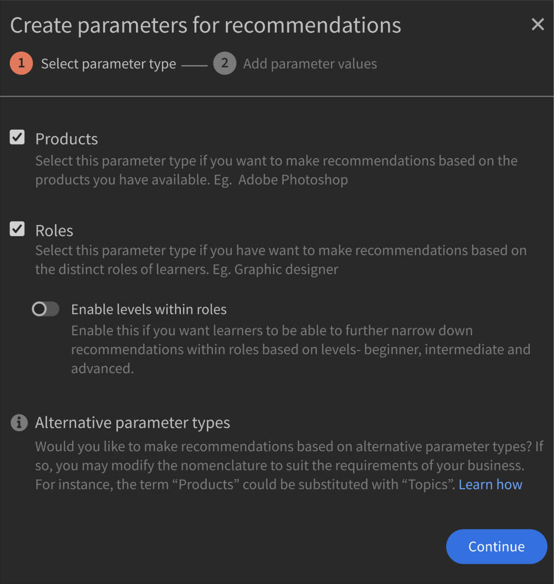

# Recommendations im Adobe-Lernmanager

Der Adobe Learning Manager hat ein neues und überarbeitetes Empfehlungssystem für Kurse eingeführt. Diese Empfehlungsfunktion nutzt KI-Algorithmen und Nutzerinteressen wie Produkte, Rollen und Stufen, um personalisierte Inhaltsempfehlungen bereitzustellen.

Mit dem neuen Empfehlungssystem können Sie benutzerdefinierte Parameter erstellen, die die Teilnehmer auswählen können, um personalisierte Empfehlungen zu erhalten. Diese Empfehlungen werden Teilnehmern auf ihrer Startseite als Kurse, Lernpfade und Zertifizierungen angezeigt.

Um mit dieser Funktion zu beginnen, müssen Sie die Funktion in der Admin-App aktivieren.

## Empfehlungen aktivieren und konfigurieren

1. Laden Sie die Kurs- und Benutzerdaten hoch (optional).
1. Änderungen live schalten.
1. Laden Sie nach dem Aktivieren und Konfigurieren der Empfehlungen die Daten in den Adobe Learning Manager hoch, damit die Empfehlungen funktionieren. Diese Daten umfassen:

   * Kursdaten
   * Benutzerdaten (optional)

## Algorithmus für die Kursrangfolge

Der Kern der Empfehlungs-Engine basiert auf den neuen **[!UICONTROL Algorithmus für die Kursrangfolge]**. Der Algorithmus verwendet 50 Millionen Datenpunkte und fünf Jahre aggregierter Lerndaten über Millionen von Benutzern, um Kurse basierend auf ihrer Wahrscheinlichkeit einer Registrierung zu bewerten. Diese Einstufung stellt sicher, dass die meisten Kurse, für die eine Registrierung möglich ist, den Teilnehmern im Voraus angezeigt werden.

## Schlüsselbegriffe

Die neue AI-basierte Empfehlungs-Engine von Learning Manager bietet Lernenden ein konfigurierbares, parameterbasiertes Empfehlungssystem für die Erstellung eines personalisierten Erlebnisses für Teilnehmer.

Die Parameter sind: **Produkte/Themen**, **Rollen** und **Stufen**. Darüber hinaus können diese Parameter Ihren Anforderungen entsprechend umbenannt werden. So können &quot;Produkte&quot; zu &quot;Themen&quot; oder &quot;Rollen&quot; zu &quot;Region&quot; werden.

## Das Empfehlungssystem einrichten.

Die neue Empfehlungs-Engine von Adobe Learning Manager vereinfacht den Admin-Arbeitsablauf beim Einrichten personalisierter Empfehlungen, da Daten zu Produkten und Rollen, die mit einem Kunden/Partner verknüpft sind, in der Regel Administratoren zur Verfügung stehen (z. B. aus Kaufunterlagen).

Bei der Einrichtung der neuen Empfehlungs-Engine gibt es hauptsächlich drei Arbeitsabläufe:

* Administrator
* Autor
* Teilnehmer

Administratoren konfigurieren die Parameterwerte Produkte, Rollen und Ebenen des Kontos. Ein IT-Lösungsanbieter mit Banken als Hauptkundenbasis kann beispielsweise den Parameter &quot;Product&quot; so konfigurieren, dass Werte wie Payment Gateway, Secure Cloud Storage, Fraud Detection System, Trading Platform usw. und den Parameter &quot;Role&quot; Werte wie Integration Specialist, Network Administrator, Risk Analyst, Compliance Officer usw. aufweisen.

Administratoren erhalten in Learning Manager einen geführten Arbeitsablauf, mit dem sie die Empfehlungs-Engine optimal einrichten und die Engine basierend auf dem Anwendungsfall des Kontos anpassen können. Darüber hinaus haben Administratoren auch die Möglichkeit, PRL-Empfehlungen über einen einmaligen CSV-Upload einzurichten.

1. Auswählen **[!UICONTROL Recommendations]** in der Admin-App.

   

   *Wählen Sie die Option Recommendations*

1. Klicken **[!UICONTROL Upgrade]**.

   

   *Wählen Sie die Upgrade-Option aus*

1. Klicken **[!UICONTROL Fortfahren]** auf das neue Empfehlungssystem zu aktualisieren.

   
   *Schaltfläche &quot;Fortfahren&quot; auswählen*

1. Erstellen Sie die Empfehlungsparameter für Produkte und Rollen.

   
   *Erstellen von Parametern für Empfehlungen*

1. Klicken **[!UICONTROL Weitere Werte hinzufügen.]**.
1. Fügen Sie die Produkte hinzu. Geben Sie den Namen eines Produkts ein und drücken Sie die Eingabetaste.

   Sie müssen mindestens zwei Produkte hinzufügen, damit Sie beginnen können.

   
   *Produkte hinzufügen*

1. Fügen Sie die Rollen hinzu. Geben Sie die Namen der Rollen ein und drücken Sie die Eingabetaste.

   
   *Rollen hinzufügen*

1. Klicken **[!UICONTROL Weiter]**.

   Die Funktionen Produkte und Rollen werden jetzt in der Liste der Parameter angezeigt.

   
   *Liste der Produkte und Rollen*

## Datenaufbereitung

Die Interessensdaten der Benutzer, das Produkt, die Rollen und die Stufen müssen hochgeladen werden, damit die Empfehlungen ordnungsgemäß funktionieren.

**Datenoptionen hochladen**

Die Funktion für Empfehlungen ist konfigurierbar. Anstelle von &quot;products/roles/levels&quot; können Sie &quot;topics/roles/level&quot; verwenden oder eine der folgenden Optionen auswählen: &quot;product/topics only&quot;, &quot;roles only&quot;, &quot;product/topics and roles only&quot;, &quot;roles-levels&quot; oder &quot;products-levels&quot;.

Ändern Sie Ihre Datenblätter entsprechend der von Ihnen gewählten Empfehlungskonfiguration.

Im folgenden Abschnitt wird die umfassendste Option zur Verwendung von Produkten, Rollen und Ebenen erläutert.

Der Administrator muss Benutzerdaten in einem vordefinierten Format hochladen. Die hochgeladenen Daten werden dann in den Empfehlungsalgorithmus eingespeist, sodass ein Teilnehmer Empfehlungen für die richtigen Kurse basierend auf seinen Rollen und Ebenen erhält.

**Voraussetzungen**

Um die Daten hochzuladen, damit die Empfehlungen funktionieren, füllen Sie die Produkte, Rollen und Stufen in die CSVs von Benutzer und Empfehlungs-LO aus.

Im Rahmen der Datenvorbereitung stellen wir zwei CSV-Vorlagen zur Verfügung:

**RecUser.csv**

* Benutzer-ID
* Produkte
* Rollen
* Stufen (Anfänger, Fortgeschrittene oder Fortgeschrittene)

Im Folgenden finden Sie ein Beispiel für Datensätze in der CSV-Datei:

| Benutzer-ID | Produkte | Rollen | Stufen |
|--- |--- |--- |--- |
| 123 | Datenwissenschaft | Analytiker | Analyst: Fortgeschrittene |
| 456 | Aerospace Engg | Techniker | Techniker: Fortgeschritten |

**RecLO.csv**

* Schulungen
* Schulungstyp
* Schulungsname
* Produkte
* Rollen
* Stufen
* Tags
* Kenntnisse

Im Folgenden finden Sie ein Beispiel für Datensätze in der CSV-Datei:

| Schulungs-ID | Schulungstyp | Schulungsname | Produkte | Rollen | Stufen | Tags | Kenntnisse |
|---|---|---|---|---|---|---|---|
| 111 | KURS | Python 101 | Datenwissenschaft | Analytiker | Analyst: Fortgeschrittene | Daten | Allgemein |
| 222 | KURS | Julia 101 | Datenwissenschaft | Analytiker | Analyst: Fortgeschritten | Daten | Allgemein |

Füllen Sie diese CSVs aus und wenden Sie sich an Ihr Customer Success Team, um die Formate herunterzuladen und diese CSVs hochzuladen.

## Empfehlungen live schalten.

Nachdem beide CSV hochgeladen wurden, klicken Sie auf &quot;Go live&quot; (Live loslegen). Dadurch wird das neue Empfehlungssystem für die Teilnehmer sichtbar.

*Empfehlungen live schalten.*

Das Empfehlungssystem ist jetzt für Ihre Teilnehmer verfügbar.

## Parameter bearbeiten

1. Wählen Sie in der Parameterliste das Symbol mit den drei Punkten aus und wählen Sie **[!UICONTROL Parameternamen bearbeiten]**.

   

1. Ändern Sie den Namen des Parameters und klicken Sie auf **[!UICONTROL Speichern]**.

   
   *Parameter bearbeiten*

## Löschen eines Parameters

1. Wählen Sie in der Parameterliste das Symbol mit den drei Punkten aus und wählen Sie **[!UICONTROL Parameter löschen]**.

*Parameter löschen*

## Seite &quot;Kurseinstellungen&quot;

Auf der Seite &quot;Einstellungen&quot; eines Kurses werden die Empfehlungen für Produkte und Rollen aufgeführt. Teilnehmern wird dieser Kurs empfohlen, wenn sie Interesse an diesen Produkten und Rollen bekundet haben.

*Seite &quot;Kurseinstellungen&quot;*

## Teilnehmeransicht

Wenn sich ein Teilnehmer bei einem Konto mit PRL-basierten Empfehlungen bei der Lernplattform anmeldet, hilft ein geführter Arbeitsablauf dem Teilnehmer, Empfehlungen basierend auf seinem Produkt, seiner Rolle und seinen Ebenenvoreinstellungen einzurichten. Dadurch wird das Teilnehmerprofil erstellt, das von der Empfehlungs-Engine analysiert werden kann.

Teilnehmer in Konten, die auf das neue Empfehlungssystem umgestellt haben, können die empfohlenen Kurse und Schulungen anzeigen.

Die Teilnehmer können Folgendes sehen:

* Produkte, Rollen - Ebenen: Teilnehmer werden aufgefordert, zuerst Produkte, Rollen und dann Ebenen für jede der ausgewählten Rollen auszuwählen.
* Produkt - Stufen: Teilnehmer werden aufgefordert, zuerst Produkte und dann Stufen für jedes der ausgewählten Produkte auszuwählen
* Rollen - Ebenen: Teilnehmer werden aufgefordert, zuerst Rollen und dann Ebenen für jede ausgewählte Rolle auszuwählen.
* Produkte und Rollen: Teilnehmer werden aufgefordert, zuerst &quot;Produkte&quot; und dann &quot;Rollen&quot; auszuwählen.
* Produkte: Teilnehmer werden aufgefordert, nur Produkte auszuwählen.
* Rollen: Teilnehmer werden aufgefordert, nur Rollen auszuwählen.

Nachdem der Teilnehmer Recommendations im linken Bereich ausgewählt hat, wird ein Popup-Fenster angezeigt, in dem er die Empfehlungen einrichten kann.

*Teilnehmer richtet Empfehlung ein*

Durch Klicken auf &quot;Recommendations einrichten&quot; gelangt der Teilnehmer zum Popup für die Produktauswahl.

*Produkte auswählen*

Im nächsten Popup kann der Teilnehmer die Rolle auswählen.

*Rollen auswählen*

Der Teilnehmer kann dann die Stufen hinzufügen.

*Ebenen auswählen*

## Lernstreifen in der Teilnehmer-App

Ein Teilnehmer kann die folgenden Streifen in der App sehen:

* Mein Lernstreifen
* Streifen mit Kalender-, Social-Media- und Gamification-Widget
* Von mir gespeichert Streifen
* Super relevanter Streifen
* Produktstreifen - 1
* Produktstreifen - 2
* Erkennungsstreifen
* Vom Administrator empfohlener Streifen
* Nach Katalogstreifen durchsuchen

### Karten auf meinem Lernstreifen

*Karten auf dem Lernstreifen*

Jede Karte verfügt über die Schaltflächen Bewertung, Kartenbild, Titel, Kenntnisse, Veröffentlichungsdatum, Autor, Dauer, Fortschrittsleiste und Fortfahren oder Entdecken .

### Karten auf gespeichert von mir Streifen

*Gespeicherte Karten*

Jede Karte verfügt über die Schaltflächen Bewertung, Kartenbild, Titel, Kenntnisse, Veröffentlichungsdatum, Autor, Dauer, Fortschrittsleiste und Start oder Entdecken, Fortfahren oder Erneut aufrufen.

Es gibt keine Fortschrittsleiste auf der Karte, nachdem ein Teilnehmer den Kurs gestartet hat. Ein Teilnehmer kann auch das Speichern des Kurses rückgängig machen.

### Karten auf superrelevantem Streifen

*Relevante Karten*

Jede Karte verfügt über die Schaltflächen Bewertung, Kartenbild, Titel, Kenntnisse, Veröffentlichungsdatum, Autor, Dauer, Fortschrittsleiste und Start oder Entdecken, Fortfahren oder Erneut aufrufen.

Es gibt keine Fortschrittsleiste auf der Karte, nachdem ein Teilnehmer den Kurs gestartet hat.

Das Menü enthält zwei Optionen: **[!UICONTROL Speichern]** und **[!UICONTROL Empfehlen Sie das nicht]**. Wenn der Teilnehmer auf **[!UICONTROL Speichern]**, der Kurs wird im Streifen &quot;Gespeichert von mir&quot; gespeichert. Wenn der Teilnehmer auf **[!UICONTROL Empfehlen Sie das nicht]** klicken, wird die empfohlene Schulung aus der Liste entfernt.
