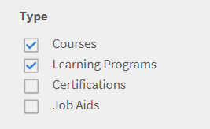
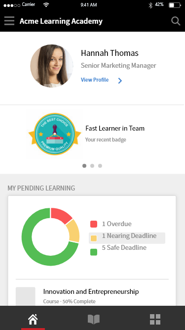

# Überblick über neue Funktionen

<!--<table>
 <tbody>
  <tr>
   <td></td>
   <td>
    
<a href="https://business.adobe.com/products/learning-manager/adobe-learning-manager.html">Adobe Learning Manager</a> was launched in August 2015. As part of our continuous improvement efforts to enhance the product, we have been rolling out regular updates. Read on to know the features enhanced/issues fixed in update releases. 
</td>
  </tr>
 </tbody>
</table>-->

+++Update 95: Die Version November 2023 von Adobe Learning Manager

**Freigabedatum:** 18. November 2023

## Neue Funktionen in dieser Version

Anzeigen [Neue Funktionen im Adobe Learning Manager](/help/migrated/whats-new.md) für weitere Informationen.
+++

+++Update 94

**Freigabedatum:** 23. August 2023

## Neue Funktionen in diesem Update

* Wählen Sie das Zahnrad-Symbol des Spielers, um die Qualität des Videos zu ändern.
* Ändern Sie die Qualität und Geschwindigkeit eines Videos in sozialen Medien.
+++

+++Update 93: Die Version Juli 2023 von Adobe Learning Manager

**Freigabedatum:** 10. Juli 2023

Neue Funktionen in dieser Version

### Verbesserte Recommendations

Der Adobe Learning Manager hat ein neues und überarbeitetes Empfehlungssystem für Kurse eingeführt. Diese Empfehlungsfunktion nutzt KI-Algorithmen und Nutzerinteressen wie Produkte, Rollen und Stufen, um personalisierte Inhaltsempfehlungen bereitzustellen.

### Mehrfacheinschreibung

In dieser Version des Adobe-Lernmanagers führen wir eine Multi-Registrierung für Teilnehmer ein, die es Teilnehmern ermöglicht, sich in mehr als einer Instanz eines Kurses zu einem oder verschiedenen Zeitpunkten zu registrieren.

### Verfall des ExaVault-Connectors

Diese Version von Adobe Learning Manager enthält einen neuen Connector, der das SFTP-Protokoll der AWS Transfer-Familie verwendet.

Weitere Informationen finden Sie unter [Neue Funktionen in der Version Juli 2023 von Adobe Learning Manager](/help/migrated/whats-new-2023-july.md).
+++

+++Update: 92

**Freigabedatum:** 23. Juni 2023

**In diesem Update behobene Fehler**

* Nach Abschluss eines Moduls wird die Grade-API nicht automatisch ausgelöst, was dazu führt, dass das grüne Häkchen nicht wie erwartet auf der Benutzeroberfläche angezeigt wird.
* Nachdem Sie einige Module in einem Lernpfad oder einer Zertifizierung abgeschlossen haben, wird das grüne Häkchen, das auf einen erfolgreichen Abschluss hinweist, nicht wie erwartet angezeigt.
* Adobe Learning Manager wird nach dem Hochladen einer Benutzer-CSV mit falschen Feldern nicht wie erwartet gestartet.
* In der Warnmeldung zur Kontaktaufnahme mit dem Administrator werden auch andere E-Mail-Adressen angezeigt.
* Alle Abzeichen, die ein Teilnehmer erworben hat, werden nicht in der Antwort angezeigt.
* Bei der Benutzerregistrierung muss ein Benutzername mit &quot; &quot; akzeptiert werden.

#### Player

* Fügen Sie ein Menü hinzu, um die Bildschirmauflösung bei der Wiedergabe eines Videos auszuwählen.
+++

+++Update 91

**Freigabedatum:** 1. Juni 2023

### Verbindungen

* Der Adobe Connect-Connector benötigt APIs zum Senden von CSRF-Token. Weitere Informationen finden Sie unter Verbessern der Kontosicherheit für Adobe Connect.

### Zeichenfolgenänderung

* Wir haben die Zeichenfolge Diese Schulung bewerten in &quot;Diesen Kurs bewerten&quot;, &quot;Diesen Lernpfad bewerten&quot; oder &quot;Diese Zertifizierung bewerten&quot; umbenannt, basierend auf der Schulung, die ein Teilnehmer absolviert. Je nach Schulungstyp sieht ein Teilnehmer die Zeichenfolge entsprechend.

### In diesem Update behobene Fehler

* In der Beschreibung der mobilen Adobe Learning Manager-App des Play Store wird fälschlicherweise angegeben, dass ein Teilnehmer einen Kurs offline absolvieren kann.
* Bei der Migration von Inhalten (module_version.csv und course_module.csv) von LinkedIn zum Adobe Learning Manager sind Probleme aufgetreten.
* Wenn ein Konto inaktiv ist und vor mehr als drei Jahren erstellt wurde, werden alle Benutzer des Kontos DSGVO-gelöscht, unabhängig vom Status der Benutzer.
* Wenn Sie in der Kursleiter-App das Limit für die Warteliste in einer Sitzung auf null setzen und die Sitzung speichern, wird in der Benutzeroberfläche fälschlicherweise &quot;Nicht zutreffend&quot; anstelle von Null angezeigt.
* Beim Generieren von Teilnehmertranskripten für den Power BI-Connector zeigt die Spalte &quot;Schulung&quot; oder &quot;Moduldauer (Minuten)&quot; für bestimmte Klassenzimmer- oder VC-Module Nullwerte an.
* Nachdem Sie einen Kurs für Teilnehmer in einer Instanz oder mehreren Instanzen als abgeschlossen markiert haben, werden alle Teilnehmer im Kurs als abgeschlossen markiert, nicht nur die Teilnehmer in der aktuellen Instanz oder in den aktuellen Instanzen.
+++

+++Update 90

**Freigabedatum:** 04. April 2023

### In diesem Update behobene Fehler

Die SAML-Anmeldung schlägt fehl, wenn die SSO-Anmelde-URL die Entity_id enthält.
+++

+++Update 89: Die Version März 2023 von Adobe Learning Manager

**Freigabedatum:** 01. April 2023

### Neue Funktionen in diesem Update

**Verbesserungen am ILT-Erlebnis (Instructor Led Training)**

Mehrere Verbesserungen wurden an der ILT-Schulung (Instructor-Led Training) vorgenommen. Zu den wichtigsten Verbesserungen gehören die Möglichkeit, Klassenzimmersitzungen basierend auf dem Standort zu filtern, die Möglichkeit, Instanzen zu wechseln (VILT), ohne den Fortschritt zu verlieren, ein neuer &quot;Planungsassistent&quot; zum Verwalten von Konflikten bei der Buchung von Kursleitern und Klassenzimmern, die Möglichkeit, &quot;Kenntnisse&quot; an Kursleiter anzuhängen und &quot;Kursleiter&quot; basierend auf den Kenntnissen auszuwählen.

**Verbesserungen an der Beobachtungs-Checkliste**:

Autoren können jetzt &quot;Manager&quot; und &quot;Store Manager&quot; als Beobachter für Checklisten auswählen. Manager können die Checklisten in der Manager-Oberfläche anzeigen und abschließen, ohne die Rolle zu einem Kursleiter wechseln zu müssen. Eine Benachrichtigung wird an einen Manager gesendet, wenn ihm eine Checkliste zugewiesen wurde.

**QR-Codes für Learning Manager mit einer beliebigen App/Smartphone-Kamera scannen**

Teilnehmer können jetzt jede QR-Code-Scan-App oder ihre Smartphone-Kamera verwenden, um die vom Learning Manager generierten QR-Codes zur Kursanmeldung, zum Abschluss und mehr zu scannen.

**Verbesserte Berichterstellung**

Ein neuer Bericht zur Auslastung von Kursleitern, ein Bericht zu Schulungsüberarbeitungen, ein Bericht zu Arbeitshilfen und andere Berichterstattungsverbesserungen.

**Unterstützung für &quot;Hybrid&quot;-Sitzungen**

Adobe Learning Manager unterstützt jetzt die Möglichkeit, &quot;hybride&quot; ILT-Schulungssitzungen (Instructor Led Training) zu erstellen. Virtuelle ILT-Sitzungen können mit optionalen Standortinformationen erstellt werden, sodass Teilnehmer die Sitzung auch persönlich besuchen können, wenn sie am Ort verfügbar sind.

**Bessere Fortschrittsverfolgung für Klassenzimmer und virtuelles ILT**

Klassenzimmer- und virtuelle ILT-Module bieten jetzt die Möglichkeit, den Quizstatus eines Teilnehmers (Bestanden oder Nicht bestanden) zusammen mit dem Teilnahmestatus zu melden. Daher können sowohl die Anwesenheit als auch der Quizerfolg berücksichtigt werden, um den Fortschritt der Teilnehmer zu bestimmen.

**Adobe Learning Manager-App für Microsoft Teams**

Die neue Adobe Learning Manager-App für Microsoft Teams wurde entwickelt, um das Lernen im Arbeitsfluss zu fördern und das soziale Lernen zu fördern. Teilnehmer können auf der Microsoft Teams-Plattform auf die Lerninhalte zugreifen, ohne zu einem Browser wechseln zu müssen. Wenden Sie sich an Ihren CSAM, um die Betaversion der Adobe Learning Manager-App auf MS Teams zu erhalten.

### In diesem Update behobene Fehler

**Kurs**

* Ein benutzerdefinierter Autor kann keine Vorschau eines Moduls anzeigen, wenn sich der Kurs im Status UNDER_CONSTRUCTION befindet. Die Antwort zeigt Fehler 404 an.
* Der Kurstitel auf der Kurs-/Add-Seite einer Autoren-App läuft über, wenn der Kurstitel bestimmte Zeichenbeschränkungen überschreitet.

**Autor**

* In der Autoren-App überschreitet der Titel des Kurses (sofern er lang ist) beim Erstellen eines Kurses die Seitenbegrenzungen.
* Manchmal wird ein Kurs hinzugefügt, obwohl kein Autor ausgewählt ist.

**Dashboard-Berichte**

* QuickInfos werden in Ordnung angezeigt, wenn die Benutzeroberflächensprache Englisch ist, aber es wird ein Konsolenfehler ausgegeben, wenn die Benutzeroberflächensprache unterschiedlich ist.
* Benennen Sie &quot;Erforderlich&quot; im Teilnehmer-Dashboard in &quot;Erforderlich&quot; um.

**Kursleiter-App**

* Das Zeitformat in der Kursleiter-App ist nicht mit den anderen Apps konsistent.

**Social**

* Bei bestimmten Arten von Beiträgen wird der Sozialausschuss nach dem Posten nicht wie erwartet geöffnet.

**Administrator**

* Ein Benutzer mit einer benutzerdefinierten Rolle kann bei der Vorschau eines Kurses keine Ressourcen herunterladen.

**E-Mail-Vorlagen**

* Wenn ein Teilnehmer die Registrierung für ein Lernprogramm widerruft, das einen Klassenzimmer-/VC-Kurs enthält, erhält er keine Stornierungs-E-Mail.

**Arbeitshilfen**

* Der Name des Kurses wird im Widget &quot;Arbeitshilfe&quot; nicht angezeigt.

**Publishing**

* Die in Adobe Captivate hinzugefügte Modulbeschreibung wird im Lern-Manager nicht angezeigt, wenn das Modul in ALM veröffentlicht wird.

**Aktive Felder**

* Wenn eine CSV-Datei mit einer großen Anzahl von Datensätzen verarbeitet wird, dauert es sehr lange. Wenn sich ein Benutzer anmeldet und einen Wert für eines der Attribute eingibt, kann eine neue Benutzergruppe erstellt werden, die zu CSV-Fehlern führen kann. Um dies zu beheben, wenn der CSV-Import ausgeführt wird, wird die Popup-Meldung &quot;Attribut für aktive Felder&quot; deaktiviert und erneut aktiviert, sobald der CSV-Upload abgeschlossen ist.
* Wenn die Spalte in der CSV-Datei &quot;Benutzer&quot; denselben Namen wie das aktive Feld für externe Benutzer hat, schlägt der CSV-Upload fehl.

**API-bezogene Fehlerbehebungen**

* In der learningObjects-Antwort fehlt das Lesezeichenattribut.
* Beim Generieren eines OAuth-Aktualisierungstokens für gelöschte Benutzer wird ein Zugriffseintrag erstellt.
* Die LO-API gibt ein falsches loFormat zurück, da Vorbereitungsmodule für die Berechnung des Kurstyps zusammen mit dem Kerninhalt in Betracht gezogen wurden.

**Bekannte Probleme in diesem Update**

* Die Schaltfläche &quot;Freigeben&quot; im Teilnehmerkatalog funktioniert im Safaribrowser, in der Mobile App und in der iPad MS Teams-App nicht wie erwartet.
* Benachrichtigungen werden nicht auf der Registerkarte Aktivität angezeigt, wenn die App auf anderen Computern entfernt wurde.
Wenn Sie in iPhone 14 auf die Benachrichtigungen auf der Registerkarte Aktivität der App klicken, passiert nichts.
* In der MS Teams-App zeigen die Learning Manager-Benachrichtigungen (abgeschlossen, registriert, Frist und überfällig) den Status und den Namen des Kurses nicht auf der Registerkarte Aktivität an.
* Ein Popup mit XML-Inhalten wird angezeigt, wenn der Integrationsadministrator die MS Teams-App nicht genehmigt.
* Die Benutzeroberflächensprache auf dem Adobe Learning Manager in MS Teams ändert sich manchmal nicht wie erwartet, wenn die Sprache geändert wird.
* Sie können nicht mit der ersten Benachrichtigung interagieren, wenn der Fokus auf dem iFrame liegt (Registerkarten &quot;Startseite&quot; und &quot;Katalog&quot;).

**Einschränkungen der mobilen Adobe Learning Manager-App**

* Anzeigen von Offline-Inhalten.
* Raster-/Listenansicht auf der Seite &quot;Katalog/Meine Lernprogramme&quot;.
* Mehrere Versuche, einen Kurs zu belegen.
* Registrierungsfrist für eine Kurskarte.
* Auf iOS-Geräten werden Push-Benachrichtigungen nicht angezeigt, wenn sich die App im Vordergrund befindet.
* Deep-Links in Push-Benachrichtigungen leiten nicht zur gewünschten Landingpage weiter.
* Wenn Sie auf die Schaltfläche &quot;Interesse registrieren&quot; klicken, werden Sie zum Internet weitergeleitet.
* Beim Antworten oder Kommentieren in Social Learning können Sie keine Datei anhängen.
* Sie können sich nicht bei LinkedIn Learning anmelden.
+++

+++Update 8

**Freigabedatum:** 7. März 2023

### Leistungsverbesserungen in dieser Version

Wenn eine Massenregistrierung von Teilnehmern durchgeführt wird, wird keine Protokolldatei für jeden Teilnehmer generiert.
Wir haben die Verarbeitung von Lernplänen für große Konten optimiert. Dadurch werden Suchprobleme und Verzögerungen vermieden.
+++

+++Update 87

**Freigabedatum:** 1. März 2023

## In diesem Update behobene Fehler

* Ein Teilnehmer erhält die E-Mail zum Abbruch der Sitzung nicht, wenn das CR/VC-Modul aus dem registrierten Kurs entfernt wird.
* Ändern Sie GetNotificationData von GET in POST. Die ursprüngliche Durchführung führte zu dem Fehler, **IllegalArgumentException: Der Anforderungsheader ist zu groß**, die zu fehlgeschlagenen Benachrichtigungen geführt hat.
+++

+++Update: 86

**Freigabedatum:** 17. Februar 2023

### In dieser Version behobener Fehler

In der Teilnehmer-App schlägt die Suche nach Benutzern und Benutzergruppen aufgrund einiger Probleme mit den Gebietsschemaeinstellungen fehl.
+++

+++Update 85

**Freigabedatum:** 13. Februar 2023

### Änderungen in diesem Update

Zusätzliche Unterstützung für einen aus vier Buchstaben bestehenden Sprachcode beim Filtern von Sprachen in GET learningManagerapi/v2/learningObjects.

### In diesem Update behobene Fehler

Bei einigen Gebietsschemas gibt die Suche falsche Ergebnisse zurück.
Die Kurs-Metadaten werden überschrieben, wenn der Kurs mehr als eine Variante desselben Gebietsschemas enthält.
+++

+++Update 84

**Freigabedatum:** 2. Februar 2023

### Änderungen in diesem Update

**Bericht über Arbeitshilfe**

Dieses Update enthält einen neuen Bericht zu Arbeitshilfen , der alle Arbeitshilfen im Konto auflistet.

**Versionskontrolle**

Wir haben beim Hinzufügen der Ressourcen beim Erstellen eines Kurses eine Versionskontrolle für Ressourcen hinzugefügt.

**Bericht für Versuche**

Sie können einen Bericht über alle erneuten Versuche und Besuche eines Teilnehmers für jede Schulung anzeigen.

**API zum Zurücksetzen des Moduls**

Ein Administrator kann jetzt ein Modul mithilfe der API zum Zurücksetzen des Moduls zurücksetzen. Weitere Informationen finden Sie unter [Adobe Learning Manager-API-Referenz](https://captivateprime.adobe.com/docs/primeapi/v2/).

**E-Mail-Vorlage**

Bei einigen E-Mail-Vorlagen können Sie der Vorlage jetzt eine Voraussetzung hinzufügen.

**Andere Änderungen**

* Sie können einen vom Manager genehmigten Kurs als Voraussetzung hinzufügen.
* Leistungsverbesserung beim Aktualisieren des Lernzusammenfassungs-Dashboards.
* E-Mail-IDs und Konto-IDs werden vor dem Senden eines Absprungberichts überprüft.

### IN DIESEM UPDATE BEHOBENE FEHLER

* Doppelte Autorennamen werden auf der Seite &quot;Kursübersicht&quot; angezeigt.
* Ein Hyperlink auf der Seite zur Kontoerstellung führte zu Fehler 404.
* Das tschechische Gebietsschema wurde in den Player-Einstellungen nicht wie erwartet dargestellt.
* In einigen Fällen werden Kenntnisse als nicht definiert für Teilnehmer angezeigt, die gerade bearbeitet werden und nicht angefangen haben.
* Die über mehrere Tage aufgewendete Zeit zeigt die unterschiedliche Zeit, die in den Teilnehmertranskript- und Registrierungsberichten verbracht wurde.
* Die Schaltfläche Zurück reagiert nicht für Administrator- und Manager-Profile in Kurs > L2 Quizpunktzahl > Registerkarte &quot;Nach Frage&quot; bzw. Anwesenheit und Punktzahl .
* Bei einigen Gebietsschemas fehlt in einer E-Mail-Vorlage der Inhalt im E-Mail-Text und die Sprachübersetzung in der Vorlage ist nicht konsistent.
+++

+++Update 83

**Freigabedatum:** 18. Januar 2023

### Änderungen in diesem Update

**Neue Spalte**

Eine neue Spalte **unenrollmentAllowed** wird zu &quot;course.xlsx&quot; hinzugefügt. Laden Sie die Datei aus diesem Handbuch herunter.

**LinkedIn Learning-Connector**

Für den Linked in Learning Connector gibt es ein neues Kontrollkästchen, das Teilnehmer können die Registrierung auf der Seite Filter aufheben eingeführt hat. Weitere Informationen finden Sie unter [LinkedIn Learning-Connector](/help/migrated/integration-admin/feature-summary/connectors.md).

### In diesem Update behobene Fehler

* Wenn Sie den Mauszeiger über die Balkendiagramme bewegen, wird die QuickInfo für den Dashboard-Bericht wie erwartet angezeigt.
* In Berichten unter Benutzeraktivität zeigt der Bericht Zeitaufwand zum Lernen falsche Daten für tägliche/monatliche Daten an.
* In einigen Fällen werden im Diagramm mit der Quizpunktzahl falsche Werte angezeigt.
* In einem Kurs mit SCORM-Inhalten, für den mehrere Versuche festgelegt sind, ist die Schaltfläche &quot;Erneut aufrufen&quot; deaktiviert, wenn ein Teilnehmer den Kurs versucht.
* In einigen Fällen wird die E-Mail zugestellt, nachdem ein Teilnehmer einen Kurs registriert und ein E-Mail-Überwachungsprotokoll heruntergeladen hat, aber sie wird nicht im Protokoll angezeigt.
* Die Kalendereinladung für einen Kursleiter muss den Textlehrer in das Thema aufnehmen.
* Das Symbol für die Schulungskarte zeigt die Empfehlung zu verwandten Kursen und die Karten für den Lernpfad auf der Seite &quot;Kursübersicht&quot; nicht an.
* Fügen Sie auf der Teilnehmer-Startseite den Abschnitt Gespeichert von mir hinzu.
* Bei bestimmten Konten wird ein Benutzer zur SSO-Anmeldung für ein Konto aufgefordert, für das eine Adobe-ID erforderlich ist.
* In Zeitzonen mit Sommerzeit wird das Feld &quot;start_time&quot; auf der Grundlage der aktuellen Zeitdifferenz berechnet, nicht basierend auf der Zeitdifferenz des aktuellen Startdatums und der aktuellen Startzeit. Dies führte zu Einladungen mit falschen Zeiten.
* Wenn eine Zertifizierung erneut auftritt, wird eine Kopie der zugrunde liegenden Kurse intern in der Datenbank erstellt. Diese Kurse erscheinen dann auf der Suche, entgegen dem erwarteten Verhalten.
* Wenn das Hochladen einer CSV-Datei fehlschlägt, erhalten Sie keine E-Mail-Benachrichtigung.
* Wenn die Namen der aktiven Felder lang sind, verschwinden die Namen, wenn sie gezogen und abgelegt werden. Im Anschluss daran funktioniert die Schaltfläche Speichern ebenfalls nicht wie erwartet.
* Ein Sitzungsbericht wird nicht über die Anwesenheits- und Bewertungsseite eines Kurses exportiert, wenn der erste Benutzer im Bericht einen Datensatz in der Aktivitätsgradtabelle mit dem Kommentar als Null hat.
* Wenn Sie die Abzeichen mit dem Administratorkonto abrufen, können Sie die Liste wie erwartet sortieren. Wenn Sie jedoch dasselbe für einen Teilnehmer ausführen, werden die Ergebnisse nicht sortiert.
* Wenn Sie einen Kurs aus Ihren Suchergebnissen auswählen und dann versuchen, mithilfe der Schaltfläche &quot;Zurück&quot; zu den Suchergebnissen zurückzukehren, werden die Suchergebnisse ausgeblendet.
* Nicht alle Benutzer werden einer Benutzergruppe als Kursleiter in einer Sitzung hinzugefügt.
* Vorlagen, in denen mehrere Benutzervorlagen enthalten sind, deren Betreff mit einigen Werten überschrieben wird.
+++

+++Update 82

**Freigabedatum:** Dezember 2022

* Die GET LO-API enthält jetzt Preisinformationen, sofern verfügbar.
* Die neue Spalte Abgeschlossen von wird den LT-Berichten hinzugefügt. Dadurch kann der Administrator die Abschlussquelle eines LO identifizieren.
* Wir haben ein neues ILT-Modul hinzugefügt, das den Status &quot;Bestanden/Nicht bestanden&quot; von Teilnehmern zusammen mit der Anwesenheit aufzeichnen kann. Kursleiter können einen Teilnehmer jetzt mit der Option &quot;Bestanden auf&quot; oder &quot;Teilgenommen auf&quot; als &quot;Nicht bestanden&quot; markieren.
* Ein Administrator kann jetzt von den Teilnehmern verlangen, dass sie abgeschlossen und bestanden haben, bevor sie das nächste Modul/den nächsten Kurs absolvieren. Dies gilt für Voraussetzungen, bestellte Kurse und LPs.

**Fehlerbehebungen**

* Probleme mit immersiven Mobilgeräten in Bahasa-Sprache auf der Seitenleiste und Fußzeile.
* Korrekturen für immersive Ansichten im Zusammenhang mit der Modulvorschau.
* Eine Kurssuche in Admin &amp; Autor gibt Ergebnisse in einem anderen als dem eingegebenen Gebietsschema zurück.
* Änderungen an Willkommens-E-Mail-Vorlagen wurden nach der Bearbeitung nicht gespeichert.
* Benutzer mit unterschiedlichen E-Mail-IDs und Adobe IDs konnten sich nicht bei der mobilen App anmelden.
* Benutzer wurden während der Teilnahme an Zoom-/BJ VC-Sitzungen falsch identifiziert.
+++

+++Update 81 - Version von Adobe Learning Manager vom November 2022

**Freigabedatum:** 05. November 2022

**Hinweis:** Mit dieser Version von Adobe Learning Manager können Benutzer mit inaktiven Konten nicht mehr über Unterdomänen auf ihre Konten zugreifen. Der Zugriff auf die Konten erfolgt über die Konto-ID oder über die Seite acapindex.html und die Eingabe der E-Mail-ID.

### Neue Funktionen in dieser Version

Die Adobe Learning Manager-Version vom November 2022 umfasst Folgendes:

* Konfiguration mehrerer SSO
* Unterstützung für nicht angemeldete Funktionen
* Verbesserungen der Schulungsübersichtsseite
* Player-Anpassung
* Identitätswechsel des Teilnehmers und Managers

Weitere Informationen finden Sie unter [Neue Funktionen in der Adobe Learning Manager-Version November 2022](/help/migrated/whats-new-2022-november.md).

**Hinweis:** Mit der Version November 2022 von Adobe Learning Manager wird Zoom eingestellt [JWT-Authentifizierung bis Juni 2023](https://marketplace.zoom.us/docs/guides/auth/jwt/). Dementsprechend funktioniert der Zoom-Connector mit JWT weiterhin bis zum genannten Datum, aber wir empfehlen Benutzern, eine Server-zu-Server-OAuth-App zu erstellen, um die Funktionalität in ihrem Konto zu ersetzen. Für jede neue Verbindung wird standardmäßig die Zoom OAuth-Authentifizierung verwendet.

### In diesem Update behobene Fehler

* Wenn Sie als Teilnehmer versuchen, auf ein Lernprogramm mit mehr als 10 Kursen auf Mobilgeräten zuzugreifen, wird eine Fehlermeldung angezeigt.
* Wenn ein Kurs eine Erinnerung so festgelegt hat, dass sie n Tage nach Ablauf der Frist gesendet wird, wird die E-Mail wie erwartet nach n Tagen gesendet, aber die Anzahl der Tage, die die Frist versäumt hat, ist n-1 anstelle von n.
* Ein Video wird nicht im Player geladen, wenn L1-Feedback für den Kurs in der Teilnehmer-App aktiviert ist und der Benutzer nur eine Teilnehmerrolle hat.
* In einer E-Mail mit einer Abschlusserinnerung wird die Zeit in der Zeitzone des Benutzers nicht wie erwartet angezeigt.
* Teilnehmertranskripte, die über Dashboard-Berichte generiert werden, berücksichtigen die Filter nicht und zeigen mehr Informationen an als erforderlich.
* Sie können keinen Inhalt auswählen, bei dem die Sprache der Benutzeroberfläche nicht als Inhaltssprache hinzugefügt wurde.
* Bei der zweiten Selbstregistrierung für einen Kurs war die angezeigte URL falsch.
* Wenn ein Kursleiter aus einer VC-Sitzung entfernt wird, erhält er keine E-Mail, in der er darüber informiert wird, dass die Sitzung abgebrochen wurde.
* Der Text &quot;Minute&quot; auf einer Kachel auf der Teilnehmertrainingsseite wird nicht wie erwartet ins Bahasa Indonesische übersetzt.
* Das Kompatibilitäts-Dashboard zeigt falsche Daten für nicht kompatible Teilnehmer an.
* Beim Hinzufügen eines Berichts können Sie keine Kurse oder Kataloge auswählen, bei denen die Sprache der Benutzeroberfläche nicht der Inhaltssprache hinzugefügt wurde.
* Wir haben in dieser Version die folgenden Inhaltssprachen hinzugefügt:
   * Bulgarisch
   * flämisch
   * Portugiesisch (Brasilien)

### Bekannte Probleme in diesem Update

* In einigen Fällen wird das Diagramm mit der Quizpunktzahl nicht wie erwartet angezeigt. Wenn Sie die Größe des Diagramms ändern, wird am Anfang ein leerer Bereich angezeigt. Außerdem werden nicht alle Fragen angezeigt und falsche Daten werden zeitweise angezeigt.
+++

+++Update 80

**Freigabedatum:** September 2022

* Probleme beim Anmelden in der mobilen App auf iOS wurden jetzt behoben.
* Es wurde ein Problem mit unzustellbaren E-Mails behoben.
* Kursleiter wurden fälschlicherweise benachrichtigt, bevor die Teilnehmer Einreichungen machten.
* Ein Kursleiter erhält eine E-Mail-Benachrichtigung, obwohl ein Teilnehmer keine Aktivität eingereicht hat.
* Nach dem Erstellen einer VC-Sitzung in MS Teams oder Adobe Connect erhalten die Kursleiter die Sitzungseinladungen nicht.
* Falscher Status in einem Lernpfad.
* Verbesserte Leistung der App.
+++

+++Update 79

**Freigabedatum:** 18. August 2022

* Die Kalendereinladungsbestätigung für ILT-/VILT-Sitzungen funktioniert jetzt mit dem Google-Kalender.
* Ein Filialleiter kann jetzt Benachrichtigungen für darunter liegende Benutzer anzeigen, auch wenn sie als Personalleiter entfernt wurden.
* In einigen Fällen schlägt die Kursregistrierung fehl und zeigt Fehler 500 an.
* In einigen Fällen können Sie eine virtuelle Kursinstanz für Teams nicht ändern.
* Administratoren und Kursleiter können Kommentare für Benutzer hinzufügen, die nicht an ILT-/VILT-Sitzungen teilgenommen haben.
* Leistungsverbesserungen beim Herunterladen großer Berichte.
* Wenn die E-Mail-Adresse eines Benutzers unzustellbar ist, erhält der Administrator eine E-Mail-Benachrichtigung. Die E-Mail enthält einen Link, über den beim Klicken auf den Link eine CSV-Datei mit der Liste der Benutzer heruntergeladen wird, deren E-Mail-Adresse gelöscht wurde. Der Administrator kann dann die erforderlichen Maßnahmen ergreifen.
   * Die E-Mail wird ausgelöst, wenn eine E-Mail unzustellbar ist.
   * Die E-Mail wird einmal täglich an alle Administratoren ausgelöst, die der Liste hinzugefügt werden.
   * Der Link läuft in sieben Tagen ab.
* Beim Versuch, ein bereits integriertes Adobe Connect-Konto in ein anderes Learning Manager-Konto zu integrieren, wird eine Fehlermeldung angezeigt.
+++

+++Update 78

**Freigabedatum:** 4. August 2022

### In diesem Update behobene Fehler

* Wenn Sie über einen Kurs verfügen, der ein Modul mit einer Vorschau enthält, und anschließend eine API zum Abrufen der Ressourcen aus dem Kurs verwenden, enthält die Antwort keine Daten von &quot;location&quot;, &quot;contentZipUrl&quot; und &quot;contentStructureInfoUrl&quot;.
* Falsche Antwort nach dem Senden einer XAPI-Anforderung aus einem Swagger-Dokument, bei dem der Domänenname LearningManager ist.
* In der Datei /boards/{id}/posts API-Antwort wird die Eigenschaft &quot;post.attributes.myPoll&quot; als leeres Objekt angezeigt.
* In einigen Fällen ist die Schaltfläche &quot;In den Warenkorb&quot; für einen nicht angemeldeten Benutzer für einige Kurse oder Lernpfade deaktiviert.
* Falsche URL der Unterdomäne auf der Branding-Seite.
+++

+++Update 7

**Freigabedatum:** 24. Mai 2022

**In diesem Update behobene Probleme:**

* Neue Kurse berücksichtigen die Sequenz in der Salesforce-App nicht. Wenn Sie die Sequenz ändern, wird der Kurs nicht in der gewünschten Sequenz angezeigt.
* Nachdem Sie die Einstellungen auf der Classic-Startseite geändert und gespeichert haben, werden die Änderungen nicht wie erwartet gespeichert. Dies geschieht zeitweise.
* HTML-Code wird angezeigt, wenn Teilnehmer ihre Benachrichtigungen überprüfen, was sich nachteilig auf das Erlebnis auswirkt.
* Im Dashboard wird die verbrachte Lernzeit fälschlicherweise als null Stunden angezeigt.

## UPDATE: Adobe Learning Manager wird in Adobe Learning Manager umbenannt

Dies ist ein Update zu einer bevorstehenden Änderung und hilft Ihnen, sich darauf vorzubereiten.

**Adobe Learning Manager als Produkt wird im Juli 2022 in Adobe Learning Manager umbenannt.**. Dies ist eine strategische Anstrengung, um die Ausrichtung des Produkts auf bestimmte geschäftliche Prioritäten genauer widerzuspiegeln.

Das Produktteam ergreift alle erforderlichen Maßnahmen, um sicherzustellen, dass Ihre Nutzung der Plattform nicht beeinträchtigt wird. Sie können das Produkt wie gewohnt weiterhin verwenden. Die Administratoren der Plattform werden den neuen Markennamen möglicherweise in bestimmten Bildschirmen im Juli bemerken.

Als Teil dieser Änderung sind die Zugriffs-URLs für den Lern-Manager betroffen.

Wenn die Zugriffs-URL für Ihr Konto beispielsweise `https://learningmanager.adobe.com/XYZ`klicken, lautet die neue URL `https://learningmanager.adobe.com/XYZ`.

Alle vorhandenen URLs funktionieren weiterhin.

Wenden Sie sich zum Abschließen dieser Aktion an Ihre IT-Abteilung Ihres Unternehmens. Für weitere Informationen kontaktieren Sie uns unter `learningmanagersupport@adobe.com`.
+++

+++Update 76

**Freigabedatum:** 20. April 2022

* Korrekturen von Produktterminologien in einigen wenigen Dashboard-Berichten.
* Ein doppelter Schrägstrich (&quot;//&quot;) in der URL eines Endpunkts führte zu Validierungsfehlern.
* Nach dem Aktualisieren einer Seite werden in den Feldern für die prozentuale Vervollständigung und die zuletzt besuchten Felder falsche Informationen angezeigt.
* Wir haben einige Änderungen an der Berechnung des Werts Zertifikat oder Lernplan vorgenommen.
* Ein benutzerdefinierter Administrator konnte alle Benutzer als Kursleiter hinzufügen, obwohl er nur einen Benutzer hinzufügen durfte.
* Auf einer Abzeichen-PDF wurde ein falsches Abschlussdatum angezeigt.
+++

+++Update 75

**Freigabedatum:** 29. März 2022

* In einigen Konten findet der Benutzerimport nach dem Kopieren der Raw-CSV in den FTP-Speicherort nicht wie erwartet statt, und es werden mehrere Fehlerbenachrichtigungen angezeigt.
* In früheren Versionen von Learning Manager mussten Sie zum Konfigurieren eines Zoom-Connectors ExaVault-FTP zunächst für das Kopieren der CSV-Datei konfigurieren. In dieser Version wird der FTP-Connector nicht mehr für die CSV-Datei verwendet, daher müssen Sie den FTP-Connector nicht zuerst konfigurieren.
+++

+++Update 74: Learning Manager AWS India-Instanz

**Freigabedatum:** 15. Februar 2022

### Übersicht

Ein [Beispiel](https://learningmanagerapac.adobe.com/acapindex.html) des Learning Managers wird jetzt auf AWS in Mumbai gehostet (ap-Southern-1). Für Kunden, die diese Indien-Instanz verwenden, werden die personenbezogenen Informationen (PII) des Benutzers und die Lerndatensätze des Benutzers nur in der Region Indien gespeichert.

### Was wird unterstützt

Die Instanz des Adobe Learning Manager India ist in Bezug auf die Funktionsfähigkeit mit anderen Instanzen wie EU- und US-Regionen gleichwertig. Es gibt einige Funktionen, die in Indien nicht unterstützt werden. Dies sind:

* Kreditkartenzahlung für den Kauf von Lizenzen
* Creative Cloud des Inhaltskatalogs
* Slack-App
* **&#42;** Warten auf Zertifizierung für SOC2-Konformität

### Häufig gestellte Fragen

**Inwiefern unterscheidet sich diese Instanz in Mumbai von anderen reinen AWS-Umgebungen?**

Es gibt keinen Unterschied. Die Instanz in Mumbai ist dieselbe wie [AWS US](http://learningmanager.adobe.com/) oder [AWS EU](http://learningmanagereu.adobe.com/) Instanzen. Diese Instanz wird in Indien gehostet, und alle Lerndatensätze und Benutzerdaten bleiben in Indien. Die folgenden Funktionen werden in der indischen Instanz nicht unterstützt:

* Kreditkartenzahlung für den Kauf von Lizenzen
* Creative Cloud des Inhaltskatalogs
* Slack-App
* **&#42;** Warten auf Zertifizierung für SOC2-Konformität

**Ist diese Umgebung mit dem Common Controls Framework (CCF) konform?**

Ja. Die neue Instanz ist mit dem Common Control Framework (CCF) kompatibel.
+++

+++Update 73

Freigabedatum: 5. Februar 2022

* Unterstützung für E-Mail-Vorlagen ist jetzt für Inhaltssprachen verfügbar, einschließlich Ungarisch und Finnisch.
+++

+++Update 72 - Version von Januar 2022 von Learning Manager

Freigabedatum: 15. Januar 2022

### Neue Funktionen und Änderungen

* Fügen Sie Speicherorte für Klassenzimmer hinzu
* Gamification-Änderungen
* Microsoft Teams-Connector
* API-Änderungen
* Immersive Web-Änderungen für Mobilgeräte

<!--
For more information, see What's new in the [**January 2022 release of Adobe Learning Manager**](../whats-new.md).
-->

### In dieser Version behobene Fehler

**Inhaltsbibliothek**

* Das Durchsuchen von Inhaltsdateien in privaten Inhaltsordnern funktionierte nicht für Benutzer mit benutzerdefinierten Rollenberechtigungen. Dieses Problem wurde nun behoben.

**Kurse**

* Das Löschen eines Kurses oder Lernpfads war nicht möglich, wenn sie eine historische Verbindung zu einem Lernplan hatten. Dieses Problem wurde nun behoben. Benutzer können jetzt einen Kurs oder einen Lernpfad löschen, wenn sie derzeit nicht mit einem Lernplan verknüpft sind.
* Wenn die Ressourcendatei bei der Vorschau eines Kurses oder Lernpfads einen langen Namen ohne Leerzeichen hat, wird der Dateiname nicht wie erwartet umbrochen und fließt in die nächste Zeile. Dieses Problem wurde nun behoben.
* Im Falle des virtuellen Klassenzimmers konnten Sie zuvor ein Modul erstellen, ohne ein VC-Konferenzsystem auszuwählen, indem die VC-URL in einer neuen Instanz nicht über die erforderlichen Informationen verfügte. Dies wird jetzt durch eine Fehlermeldung beim Erstellen des Moduls vermieden, in der Sie aufgefordert werden, das VC-Konferenzsystem anzugeben, bevor Sie das Modul speichern können.
* Auf der Wartelistenseite wurde eine irreführende Bannermeldung für registrierte Benutzer angezeigt, die jetzt entfernt wird.
* Bei einer Massenabmeldung für Kurse wurde das Popup zur Eingabe von E-Mail-IDs nicht angezeigt, was jetzt behoben ist.
* Die Option, E-Mails von der Registerkarte &quot;Anwesenheit und Punktzahl&quot; in der Admin- und Kursleiter-App an Teilnehmer zu senden, schloss nicht die nicht aktivierten Teilnehmer aus, nachdem der Vorgang &quot;Alle auswählen&quot; ausgeführt wurde. Daher sendete der Lern-Manager eine E-Mail an alle Teilnehmer. Dieses Problem wurde nun behoben.
* Der Registrierungsbericht wird als &quot;Nicht gestartet&quot; angezeigt, obwohl ein Teilnehmer den Kurs bereits abgeschlossen hat.

**SSO**

* Wenn in der SSO-Einrichtung die Entitäts-ID führende oder Schulungsbereiche hatte und die Anmeldekonfiguration nicht funktionierte, wird dies jetzt im Rahmen der Korrektur behandelt.

**Ankündigungen**

* Als Administrator wurden das Start- und Enddatum einer Ankündigung nicht gespeichert, wenn Benutzeroberfläche und Inhaltssprache auf Deutsch/Spanisch eingestellt waren. Dieses Problem wurde nun behoben.

**E-Mail-Vorlage**

* Sitzungseinladungen, die sich über mehrere Tage erstrecken, an denen die Einladungen an Tagen nicht die richtigen Informationen widerspiegeln, werden in einigen E-Mail-Clients blockiert. Dieses Problem wurde nun behoben.
* Die Variable &quot;Veranstaltungsort&quot; fehlte in der E-Mail-Vorlage &quot;Erinnerung an die kommende Sitzung&quot; für Teilnehmer mit dem deutschen Gebietsschema. Dies wird jetzt hinzugefügt.
* Der Link zum Erstellen des Kontos als Teil der Begrüßungs-E-Mail an den Benutzer berücksichtigte nicht das Benutzer-Gebietsschema, das jetzt behoben ist.

**E-Mail-Erinnerungen**

* Wenn Teilnehmer für Schulungen über einen Lernplan registriert wurden, wurden die E-Mails zur Abschlusserinnerung mehrmals gesendet, basierend auf der Anzahl der Änderungen, die an den Abschlussdaten desselben Lernplans vorgenommen wurden. Dieses Problem wurde nun behoben.

**Benutzer**

* Die Meldung, die dem Benutzer angezeigt wird, wenn sein Konto inaktiv/gesperrt ist, wurde verbessert. Dies weist darauf hin, dass er sich an seinen Administrator wenden muss, damit seine Konten wieder aktiviert werden.

**Aktivität**

* Ein Kursleiter konnte die Teilnehmerübermittlungen nicht anzeigen, wenn der Name der Übermittlungsdatei Sonderzeichen enthielt. Dieses Problem wurde nun behoben.

**Bericht**

* Ein Administrator konnte den Kursregistrierungsbericht nicht herunterladen, wenn er einen Teilnehmer enthält, der indirekt über einen flexiblen Lernpfad für diesen Kurs registriert ist, aber noch keine Instanz für diesen Kurs im Lernpfad auswählen muss. Dieses Problem wurde nun behoben.
* Durch das Neuanordnen von Berichten im Berichts-Dashboard für Admin- und Managerrollen wurde der Status der Berichtsreihenfolge nicht beibehalten. Dieses Problem wurde nun behoben.

**Inhalt**

* Audio in Schulungsinhalten wurde in der Vorschau nicht automatisch als Teilnehmermodus wiedergegeben, aufgrund von Richtlinien für die automatische Browserwiedergabe. Dieser Fehler wurde jetzt für unterstützte Browser mit Ausnahme von Safari behoben.

**Gamification**

* Wenn ein externer Teilnehmer als interner Teilnehmer im selben Konto konvertiert wurde, konnte er nicht auf das Gamification-Leaderboard in der Teilnehmer-App zugreifen. Dieses Problem wurde nun behoben.

**Player**

* Der Player zeigte keine Warnmeldung an, als der Benutzer versuchte, Module im geordneten Kurs mit Modulen vom AICC-Typ zu springen. Dieses Problem wurde nun behoben.
* Bei bestimmten erworbenen Kursen mit Videomodulen in einem Headless LMS funktionierte die Wiedergabe der Groß- und Kleinschreibung bei bestimmten Benutzern nicht. Dieses Problem wurde nun behoben.

**Manager-Dashboard**

* Ein Manager konnte den Bericht für sein direktes Team nicht von der Kenntnisseite des Manager-Dashboards exportieren. Dieses Problem wurde nun behoben.

**Veröffentlichen**

* In der europäischen Instanz von Learning Manager wurden Inhalte, die direkt auf Adobe Learning Manager von Adobe Captivate veröffentlicht wurden, standardmäßig im deutschen Gebietsschema veröffentlicht. Dieses Problem wurde nun behoben.

**API**

* Das Feld &quot;Dauer&quot; wird jetzt dem Modell &quot;Arbeitshilfe&quot; hinzugefügt.
* Bei den Empfehlungs-APIs gibt eine Fehleranforderung manchmal GET 500 zurück.
* Wenn Sie Schulungen durch ExaVault migrieren und der Text nicht englische Zeichen enthält, wurde er verwendet, um mit Garbage Characters im Text aktualisiert zu werden. Dieses Problem wurde nun behoben.

**Lokalisierung**

* `NormalTextRun  BCX0 SCXW38820519 For the`Admin-, Autoren- und Teilnehmer-Apps: Einige Inhalte auf Deutsch werden nicht wie erwartet angezeigt.

## Bekannte Probleme in dieser Version

* Wenn Sie auf der Seite &quot;Soziales Lernen&quot; einen Beitrag erstellen, können Sie kein Audio aufzeichnen oder das Audio hochladen, nachdem Sie auf die Mikrofonschaltfläche getippt haben. Dies ist eine Einschränkung des Browsers.
* In iOS werden H264- und WMA-Audiodateien im mobilen Browser nicht unterstützt.
* Bei Teilnehmern, deren E-Mail-Adresse ein Pluszeichen (+) enthält, ist der Fortschritt nicht markiert. Dies ist, nachdem sie einen VC-Kurs in Microsoft Teams absolviert haben.
* Im Safari Mobile-Browser können Teilnehmer nicht mehr als 200 MB Datei in Soziales Lernen hochladen. Dies ist eine Browserbeschränkung.
+++

+++Update 71

Freigabedatum: 17. November 2021

### Schulungen mit Managern teilen

Learning Manager bietet allen Administratoren und Managern ein Compliance-Dashboard. Manager finden es sehr nützlich, die Einhaltung der Richtlinien durch ihre Teammitglieder für eine bestimmte Schulung zu verfolgen. Gleichzeitig möchten Administratoren, dass alle Manager Compliance-Schulungen zu ihrem Dashboard hinzufügen und verfolgen.

Im Lern-Manager zeigt der Katalog **Für Manager freigeben** ermöglicht es Administratoren, Schulungen mit Managern zu teilen, sodass sie dem Compliance-Dashboard eines Managers hinzugefügt werden können. Manager müssen also keine Maßnahmen ergreifen und können sofort mit der Überwachung der Compliance beginnen.

Weitere Informationen finden Sie unter  [**Schulungen mit Managern teilen**](../administrators/feature-summary/reports.md#share_training_managers).

### In diesem Update behobene Fehler

* Wenn zwei Konten vorhanden sind und die erweiterte Lernpfadfunktion deaktiviert ist und es einen freigegebenen Katalog vom ersten Konto zum anderen gibt, enthält der Lernpfad im zweiten Konto doppelte Abschnitte auf der Kursseite.
* Ein benutzerdefiniertes FTP unterstützt jetzt sftp:// zusätzlich zu http:// und https://
* Der Exavault-Connector verwendet jetzt V2-APIs.
* In manchen Fällen war die Qualität der Videos suboptimal. Das Problem wurde nun behoben.
* Auch wenn ein Teilnehmer einen obligatorischen Kurs abgeschlossen und vom Manager genehmigt hat, bleibt die Zertifizierung im Status &quot;Genehmigung ausstehend&quot;.
* Wenn die Namen von Autoren akzentuierte Zeichen enthalten, schlägt die Migration des Kurses fehl.
* Wenn das aktive Feld Werte in Großbuchstaben enthält, wird das aktive Feld nicht wie erwartet gespeichert.
* Lernpfade können nicht nach Kenntnissen gefiltert werden.
* Wenn ein Administrator eine Instanz erstellt und eine neue Sitzung hinzufügt, erhält ein Kursleiter nicht die E-Mail mit der Sitzungseinladung. Dieses Problem tritt in Zoom VC-Kursen auf.
+++

+++Update 70

Freigabedatum: 28. Oktober 2021

### In diesem Update behobene Fehler

* In einigen Fällen werden Informationen über einen Lernpfad nicht in einem Teilnehmertranskript widergespiegelt.
* Der Text innerhalb der **Als abgeschlossen markieren** &quot; wird aktualisiert, um anzuzeigen, dass der Vorgang unumkehrbar ist.
* Die Lernobjekt-API gab in einigen Fällen einen Metadatenfehler zurück.
+++

+++Update 69 - Version von Learning Manager vom Oktober 2021

**Freigabedatum:** 9. Oktober 2021

### Lernpfad

Die **Version Oktober 2021 von Adobe Learning Manager** stellt das Konzept der Lernpfade vor.

>[!NOTE]
>
>Die **Einstellungen > Allgemein** eine neue Option zum Aktivieren erweiterter Funktionen für Lernpfade. Wenn diese Option aktiviert ist, können Sie Lernpfade in einem anderen Lernpfad hinzufügen. Sie können die Option nicht mehr ändern, nachdem sie aktiviert wurde.

Lernpfade ersetzen unsere vorhandene Funktion von Lernprogrammen. Stellen Sie sich vor, dass Lernprogramme leistungsstarke Verbesserungen erhalten, ohne vorhandene Funktionen zu verwerfen. Außerdem wird die Funktion als Lernpfad gebrandmarkt.

Weitere Informationen finden Sie unter [***Lernpfade***](../administrators/feature-summary/learning-paths.md).

### Andere Änderungen

* Neue Salesforce-App
* Materialien-Hub
* Berichterstellung für Änderungen
* Sitzungsübersicht - Bericht
* Änderungen am Player-Inhaltsverzeichnis
* API-Änderungen
* Connector-bezogene Änderungen

Weitere Informationen finden Sie unter [***Neue Funktionen in der Version Oktober 2021 von Learning Manager***](../whats-new.md).

### In diesem Update behobene Fehler

* E-Mail-Vorlagen wie &quot;Kursregistrierung aufheben&quot;, &quot;Lernprogrammregistrierung aufheben&quot; oder &quot;Zertifizierungsteilnahme&quot; berücksichtigen nicht die neuesten Produktterminologien, die in der CSV-Datei definiert sind. Der Standardtext in E-Mail-Vorlagen unterstützt jetzt angepasste Begriffe.
* Die Benutzersprache im Lern-Manager wird im Arbeitsablauf &quot;In Lern-Manager veröffentlichen&quot; nicht unterstützt. Wenn die Benutzersprache unterschiedlich ist, erfolgt die Veröffentlichung im Learning Manager auf Englisch.
* Wenn Sie einer benutzerdefinierten Rolle viele Kataloge hinzufügen, tritt ein Fehler auf, wenn Sie die Rolle aktualisieren. Jetzt ist die maximale Anzahl der Kataloge auf bis zu 50 erhöht.
* In einigen Fällen sind gelöschte Schulungen weiterhin in einem Katalog sichtbar. Dieses Problem ist nur in der Admin-App aufgetreten und wurde jetzt behoben.
* Wenn die Managerrolle von einem Benutzer in einen anderen geändert wird, wurde die Managerrolle des vorherigen Benutzers weiterhin auf der Benutzeroberfläche angezeigt. Dieses Problem wurde nun behoben. Dieses Problem trat nur bei externen und nicht bei internen Benutzern auf.
* In einigen bestimmten Szenarien für eine große Gruppe von Benutzern, die über die Benutzer-CSV importiert wurden, schlug der Import fehl. Dieses Problem wurde nun behoben.
* In einem Lernprotokoll wird das Abschlussdatum für ein externes Zertifikat nicht angezeigt, wenn ein obligatorischer Kurs hinzugefügt wird, nachdem ein externes Zertifikat erstellt wurde und ein Benutzer für dieses Zertifikat registriert ist. Dieses Problem wurde nun behoben.
* Ein Zertifikat zeigt den lokalisierten Namen des Teilnehmers nicht wie erwartet an. Dieses Problem wurde nun behoben.
* Bei Zoom VC-Sitzungen erhält ein Kursleiter die Einladung zur Sitzung nicht immer. Dieses Problem wurde nun behoben. Der Kursleiter erhält nun die erforderliche Kommunikation.
* Ein Teilnehmer erhält keine Einladungen zu einer Sitzung, wenn Vorlagen auf Kursebene aktiviert, aber Vorlagen auf Kontoebene deaktiviert sind. Dieses Problem wurde nun behoben.
* Für bestimmte Zeitzonen wurden E-Mail-Erinnerungen einen Tag später als erwartet versendet. Dieses Problem wurde nun behoben.
* Teilnehmer erhalten keine E-Mail-Benachrichtigungen zur Sitzung, wenn bestimmte E-Mail-Vorlagen deaktiviert sind.
* Falls ein BlueJeans-Meeting von Autoren, Administratoren aktualisiert wird, wurde die BJ-Meeting-URL nicht mehr verwendbar. Dieses Problem wurde nun behoben.
* Beim Ausführen der GET/LO-API werden in einigen Fällen die Kurse, die Teil eines Lernprogramms sind, nicht zurückgegeben.
* Wenn ein Teilnehmer versucht, Inhalte hochzuladen, deren Name über einen Leerraum verfügt, tritt ein interner Serverfehler auf.
* Abzeichen-PDF, die für Teilnehmer generiert wurden, hatten Formatierungsprobleme, als sie in nicht-englischen Gebietsschemas generiert wurden. Diese Probleme sind nun behoben.
+++

+++Update 68

Freigabedatum: 28. September 2021

### In diesem Update behobene Fehler

* Im mobilen Browser wurden Deep Links für Folgendes aktiviert:

   * Alle Boards
   * Öffentliches Board und Beitrag
   * Privates Board und Beitrag mit Zugriff
   * Privates Board und Beitrag ohne Zugriff
   * Eingeschränktes Board und Beitrag
   * Kommentar zu Beitrag
   * Auf Kommentar antworten
   * Benutzerprofil für soziale Medien

* Bei Konten, die eine benutzerdefinierte Domäne verwenden, zeigt die Teilnehmer-App das Favicon nicht an.
* Unter AEM löscht die Learning Manager-Komponente die Konfiguration anderer Komponenten.
* Die Hilfeseite für AEM Komponente wird an einen falschen Ort umgeleitet.
* Das Abrufen und Speichern von Benutzer-E-Mails/-Tokens wurde ausgelagert, sodass Benutzer ihr eigenes Speicher-Backend implementieren können, anstatt AEM Benutzerknoten zu verwenden.
* Beim Bearbeiten einer einfachen Textbeschreibung in Kursen, Lernprogrammen, Zertifikaten und Arbeitshilfen wird eine Warnmeldung angezeigt.
* Die Berichte vom Manager-Dashboard werden nicht heruntergeladen, wenn ein Benutzer sowohl über benutzerdefinierte Rollen als auch über Managerrollen verfügt.
* Eine E-Mail-Auswahl zeigt einen falschen Wert der Schulungsaktivität an.
* In einigen Fällen verhält sich der Lern-Manager unerwartet, wenn Sie vom Inhalts-Marketplace zur Teilnehmerseite wechseln.
* In der Sozial-App funktionieren die Filter in der Listenansicht nicht wie erwartet.
* Die Begrüßungs-E-Mail, die interne Benutzer erhalten, wird auch von externen Benutzern empfangen.
* Fügen Sie das Lern-Manager-Widget in der Seitenvorlage in AEM hinzu.
* Wenn Sie ein Zertifikat erneut veröffentlichen möchten, nachdem Sie einen Kurs entfernt haben, können Sie dies nicht tun.
* Teilnehmer erhalten keine E-Mails, die Details einer Sitzung enthalten.
+++

+++Update 67 - Updates für Azure

Mit diesem Update wird eine neue Instanz von Azure eingeführt.

>[!NOTE]
>
>Folgendes wird in der Instanz nicht unterstützt:
>
>* [Benutzerdefinierte Domäne](../custom-domain.md)
>* [Kreditkartenkauf](../administrators/feature-summary/billing-management.md)
>* [Inhaltskatalog](../administrators/feature-summary/content-catalogs.md)

+++

+++Update 66 - Version von August 2021 von Learning Manager

Die **August 2021** **Version von Adobe Learning Manager** konzentriert sich auf die Verbesserung der Teilnehmererfahrung, der Berichterstattung und der Administrator-Workflows. Zu den Highlights gehören:

* **Content Marketplace:** Learning Manager bietet jetzt mehr als 70000 Kurse aus verschiedenen Bereichen wie Technologie, Management, Führung usw.
* **Verbesserte Barrierefreiheit:** Die Barrierefreiheit für die Teilnehmerrolle wird durch verbesserte Tastaturnavigation, Bildschirmlesehilfen und Einhaltung der Kontrastverhältnisvorgaben verbessert.
* **RTF-Formatierung:** Learning Manager bietet jetzt Rich-Text-Bearbeitung für Beschreibungen in Kursen, Programmen, Zertifikaten und Arbeitshilfen. Auf diese Weise können Autoren Beschreibungen in Rich Text angeben, einschließlich Hyperlinks, Bildern und anderen Textformatierungsoptionen, im Gegensatz zu einfachem Text.
* **Bewertungssterne:** Ein Teilnehmer kann einen Kurs jetzt auf einer 5-Punkte-Skala bewerten. Ein Administrator kann zwischen einer bestehenden Effektivitätsbewertung oder einer 5-Sterne-Bewertung wählen.
* **Badgr-Integration:** Teilnehmer können Learning Manager jetzt autorisieren, die im Learning Manager erworbenen Abzeichen automatisch in ihr Badgr-Konto zu übertragen, von wo aus sie ihre Abzeichen in den sozialen Netzwerken teilen können.
* **Lernobjekte nach Salesforce exportieren:** Learning Manager bietet jetzt die Möglichkeit, bestimmte Ereignisse im Learning Manager zu exportieren, z. B. Hinzufügen eines neuen Benutzers, Registrierung und Abschluss als Salesforce-Mandant, und diese mit dem entsprechenden Benutzerobjekt oder Kontaktobjekt in Salesforce zu verknüpfen.

Weitere Informationen finden Sie unter [***Neue Funktionen und Änderungen in Version August 2021 von Learning Manager***](../whats-new.md).

**Freigabedatum:** 7. August 2021

### In diesem Update behobene Fehler

**Teilnehmererlebnis**

* Nachdem ein Teilnehmer zu zwei Benutzergruppen und ein Lernplan hinzugefügt wurde, wird der Teilnehmer für eine andere Instanz desselben Kurses registriert.
* In einigen Fällen wird der Kurs nach der Registrierung und dem Start des Kurses nicht wie erwartet wiedergegeben.
* In der Kursbeschreibung werden HTML-Tags angezeigt, was jetzt behoben ist.
* Wenn Sie einen Beitrag in einem sozialen Board kommentieren, der mehrere Zeilen umfasst, wird der Kommentar in einer einzelnen Zeile angezeigt. Dieses Problem wurde nun behoben.

**Authoring**

* Bei automatischen Registrierungen erhalten Teilnehmer manchmal mehrere Registrierungs-E-Mails.

**Berichte**

* Wenn die Benutzeroberfläche auf einige nicht englische Gebietsschemas festgelegt ist, werden Teilnehmertranskripte nicht wie erwartet generiert.
* Möglichkeit, den Fortschritt eines Kurses innerhalb eines Lernprogramms und einer Zertifizierung zurückzusetzen.
* Wenn eine CSV-Datei aktive Felder mit demselben Namen, aber mit unterschiedlicher Beachtung der Groß-/Kleinschreibung enthält, erzeugt die CSV-Datei eine Ausnahme.

**Andere**

* Die Option zum Bearbeiten von Punktzahlen und Kommentaren muss deaktiviert sein, wenn kein Teilnehmer ausgewählt ist oder wenn die Anwesenheit des ausgewählten Teilnehmers nicht markiert ist.
* Werte in aktiven Feldern werden im Dialogfeld &quot;Benutzer bearbeiten&quot; in Kleinbuchstaben angezeigt, obwohl ein Benutzer zuvor die Werte in Großbuchstaben hinzugefügt hat.
* Möglichkeit für Administratoren und Management, ausstehende Genehmigungen für Kurse anzuzeigen. Auf diese Weise kann das Management sicherstellen, dass Manager das Lernen und die Schulung von Mitarbeitern verfolgen, und es Learning Manager-Administratoren ermöglichen, die Kursregistrierung nach Bedarf zu genehmigen.
* Ein Benutzer, der über eine Autorenberechtigung oder eine benutzerdefinierte Admin-/Autorenberechtigung verfügt, kann keine Arbeitshilfe bearbeiten, die von einem anderen Benutzer erstellt wurde.
* Wenn der Benutzer in der Administratorrolle unter &quot;Kurs&quot; > &quot;Instanz&quot; für eine beliebige Instanz die Option &quot;Registrierte Teilnehmer&quot; auswählt, wurden früher die Teilnehmer der &quot;Standardinstanz&quot; angezeigt. Der Administrator musste die Instanz manuell über die Dropdown-Liste ändern. Jetzt leitet der Lern-Manager den Benutzer korrekt zur Teilnehmerseite, wobei die richtige Instanz ausgewählt ist.

**Geräteanwendung**

* Auf Android- und iPhone-Geräten kann ein Teilnehmer Kursmodule willkürlich nicht starten. Dadurch wird der Fehler 401 nicht autorisiert.
* Ein Teilnehmer kann zwei QR-Codes scannen, aber beim Scannen des dritten QR-Codes wird eine Fehlermeldung angezeigt.
* Auf einigen Android- und iOS-Geräten wird eine Datei für einige heruntergeladene Kurse nicht wie erwartet geöffnet.
* Beim Öffnen einer Arbeitshilfe wird eine Fehlermeldung angezeigt.
* Die Geräte-App verhält sich unerwartet, wenn ein Lernprogramm offline genutzt wird.
* Wenn ein Teilnehmer wieder online geht und die App öffnet, bleibt die App auf dem Begrüßungsbildschirm hängen.
* Wenn ein Benutzer wieder online ist, wechselt die App manchmal zur klassischen Ansicht.
* Wenn ein Kurs offline genutzt wird, wird der Fortschritt manchmal nicht gespeichert.
* Manchmal wird ein Kursname von Anfang an nicht wie erwartet angezeigt, wenn der Name lang ist.
* Auf der Katalogseite werden die Kurse nicht wie erwartet sortiert.
+++

+++Update 65

Freigabedatum: Juli 2021

### In diesem Update behobene Fehler

* Probleme bei Anmeldungen für Benutzer.
* Die E-Mail-Vorlage für die Kursregistrierung für Manager zeigt keinen Fristablauf für den Kurs an, wenn die Variable zur Vorlage hinzugefügt wird.
* TLS 1.0 und TLS 1.1 sind veraltet.
* Probleme beim Löschen von DSGVO-Daten für einen Benutzer.
+++

+++Update 64

Freigabedatum: Juli 2021

### In diesem Update behobene Fehler

* An Teilnehmer, die bereits für einen Kurs registriert sind, werden Benachrichtigungen zur Registrierung gesendet.
* Wenn ein benutzerdefiniertes Zertifikat als Abzeichen generiert wird, wird das Datumsformat nicht in deutscher Sprache unterstützt.
+++

+++Update 63

Freigabedatum: Juni 2021

### In diesem Update behobene Fehler

* Sie können einen Benutzer mit einem leeren Namen in einer CSV-Datei erstellen.
* Wenn im aktiven Feld ein &quot;/&quot;-Zeichen vorhanden ist, nachdem ein Auftrag zum Herunterladen von user.csv erstellt wurde, ändert sich der Status des Auftrags nicht von &quot;Gesendet&quot; zu &quot;Abgeschlossen&quot;.
* Geordnete Module berücksichtigen die Reihenfolge nicht.
* Wenn ein externer Autor gelöscht wird, ist der Kurs, den der Autor erstellt hat, nicht mehr verfügbar.
* Das Durchsuchen eines Lernobjekts mit mehr als einer Qualifikation führt zu unerwarteten Ergebnissen.
+++

+++Update 62

Freigabedatum: Juni 2021

### In diesem Update behobene Fehler

* Anmeldung bei der App nicht möglich, wenn das Konto mit SP-Anmeldung initiiert wurde.
* Videos werden nicht wie erwartet in Brightcove gerendert.
* Die userGroupInfo-API ist beim Besuch des Lernprogramms in einer der Anwendungen nicht sichtbar.
* Beim Erstellen eines Dashboard-Berichts kann kein eingestelltes Lernprogramm und keine Zertifizierung gesucht werden.
* Ein Autor kann eine von einem anderen Autor erstellte Arbeitshilfe nicht bearbeiten oder aktualisieren.
* Die API für die Dateiübermittlung funktioniert im EU-Cluster nicht wie erwartet.
+++

+++Update 61

Freigabedatum: Mai 2021

### In diesem Update behobene Fehler

* Leistungsverbesserung bei userGroupInfo-Aufrufen.
* Nachdem Sie neue Brightcove-Profile aktiviert haben, unterstützt Learning Manager Inhalte mit Video- und Audiomodulen.
* Teilnehmertranskripte können die Daten nicht erfassen, wenn ein enger Datumsbereich ausgewählt ist.
* Eine Sitzungseinladung wird an die registrierten Teilnehmer für alle Sitzungen gesendet, selbst wenn nur eine neue Sitzung hinzugefügt wird.
* Audiomodule werden nicht wie erwartet hochgeladen.
+++

+++Update 60

Freigabedatum: April 2021

### In diesem Update behobene Fehler

**Bericht**

* Wenn Sie nach dem Erstellen eines Berichts nach einem eingestellten Kurs suchen, ist dies nicht möglich.
* Fehler in einem Bericht werden auf andere Berichte übertragen. Infolgedessen führten diese Berichte zu Fehlern.

**Arbeitshilfen**

* Nach dem Herunterladen einer Arbeitshilfe können Sie die Arbeitshilfe nicht löschen.

**Player**

* WebVTT-Beschriftungen werden nicht wie erwartet angezeigt.

**Teilnehmer-App**

* Auf der Seite Zertifizierungsübersicht zeigt die externe Zertifizierung nicht die von einem Autor hinzugefügte Dauer an.
* Option hinzufügen **Alle** im Kenntnisfilter.
* Teilnehmer erhielten mehrere Auswahl-E-Mails.
* Die Anzahl der ausgewählten Zeilen wird nicht wie erwartet auf einer Seite angezeigt.

**AEM**

* Widgets werden nach einer Seitenaktualisierung nicht wie erwartet aktualisiert.

**Lokalisierung**

* Einige deutsche Strings sind nicht wie erwartet lokalisiert.
* Die Übersetzung von Strings wird standardmäßig auf Englisch festgelegt, wenn ein Teilnehmer die Benutzeroberfläche und die Inhaltssprache nicht ausgewählt hat.

**Zertifizierung**

* Die Anordnung des Moduls kann umgangen werden, wenn die Voraussetzungen nicht erzwungen werden.

**Browser**

* Autoren-, Manager- oder Teilnehmer-Apps werden in IE 11 nicht wie erwartet angezeigt.

**Gamification**

* Gamification-Punkte werden nicht wie erwartet eingelöst.

**Inhaltsbibliothek**

* Kurse für die Testversion von Inhalten funktionieren nicht wie erwartet.

**Player**

* Der Player wird nur in dem Bereich geladen, in dem sich das Widget befindet.
* Videos in einem Captivate-Modul werden nicht wie erwartet wiedergegeben.

**Connector**

* In einigen Fällen werden Dateien aus einem FTP-/Box-Connector gelöscht.
* Dateien werden aus FTP gelöscht, wenn die Dateien mit denselben Namen aktualisiert werden.
* Ein BlueJeans-Ereignis unterstützt Paginierung, bei der die Anzahl der Ereignisse größer als 100 ist.

**Mobile App Update 3.3 - März 2021**

Freigabedatum: 26. März 2021

### Neue Funktionen und Änderungen {#whatsnewandchanged}

Mit Captivate Learning Manager Mobile App Update 3.3 wird eine brandneue Startseite eingeführt, die Mastertitel und AI-basierte Schulungsempfehlungen unterstützt. Diese Startseite ist für alle Konten verfügbar, die für die neue Option für das immersive Layout konfiguriert sind. Bei Konten, die mit dem klassischen Layout konfiguriert sind, wird weiterhin die klassische/ältere Startseite angezeigt. Änderungen an der Startseite sollten nicht angezeigt werden.

Darüber hinaus können Teilnehmer mit diesem Update ihr Abzeichen als PDF und als Bild herunterladen. Das Update enthält auch ein Popup-Fenster für Feedback, in dem Teilnehmer anonym Feedback zur App abgeben können.

Weitere Informationen finden Sie unter  [Learning Manager-Geräte-App](../learners/feature-summary/ipad-android-tablet-users.md).

Lesen Sie weiter, um mehr zu erfahren.

#### Neue Startseite

Für alle Konten, für die die Option &quot;Immersives Layout&quot; aktiviert ist, gibt es eine brandneue Startseite, auf der die Konfiguration des immersiven Layouts unterstützt wird.

#### Feedback-Bewertung

In dieser Version fordert Learning Manager den Benutzer auf, Feedback zu seiner Erfahrung mit der Mobilanwendung abzugeben.

#### Abzeichen herunterladen

Mit diesem Update können Teilnehmer ihre Abzeichen im PDF- und Bildformat herunterladen.

<!--## Previous update releases {#previousupdatereleases}-->
+++

+++Update 60 - Version vom Februar 2021 von Learning Manager

Freigabedatum: 20. Februar 2021

### Neue Funktionen und Änderungen {#Whatsnewandchanged-1}

* Board-Ansicht in Soziales Lernen.
* Anpassen des sozialen Banners.
* Katalogfilter in der Teilnehmer-App.
* Registrierung für Schulung widerrufen.
* Importieren von Benutzern aus Salesforce-Kontakten.
* ...und vieles mehr.

Weitere Informationen finden Sie unter Neue Funktionen in der [Update von Learning Manager vom Februar 2021](../whats-new.md).

### In diesem Update behobene Fehler {#bug-fixes}

**Zertifizierung**

* In einigen Fällen konnten Teilnehmer einen Kurs nicht erneut durchführen, was Teil einer Zertifizierung ist, obwohl die maximale Anzahl der Versuche für den Kurs auf &quot;Unbegrenzt&quot; festgelegt ist. Dieses Problem wurde nun behoben.
* In einigen Fällen können sich Teilnehmer nicht für eine Zertifizierung registrieren, da die **Registrieren** Schaltfläche nicht wie erwartet angezeigt.

**Inhaltsbibliothek**

* Falsche Hilfe-URL auf der **Neuen Inhalt hinzufügen** angezeigt. Die richtige URL wurde aktualisiert.

**Kurs**

* Ein für ein AICC-Inhaltsmodul heruntergeladener Bericht mit der L2-Quizpunktzahl zeigt eine falsche Punktzahl in der Spalte &quot;Gesamtpunktzahl des Benutzers/Quizpunktzahl&quot; an. Dieses Problem wurde behoben.
* Das Herunterladen von Ressourcen aus einem Kurs funktionierte nicht, wenn er aus einem anderen Kurs kopiert wurde und der Teilnehmer keinen Zugriff auf den ursprünglichen zum Erstellen des duplizierten Kurses verwendeten Kurs hat.
* Bannerbilder wurden nicht gelöscht, wenn der Autor sie entfernt, während sich der Kurs im Entwurfsstatus befindet. Dieses Problem wurde behoben.

**AEM**

* Nach dem Einfügen der Learning Manager-Komponente in AEM dauerte das Laden der Seite lange und der Zugriff auf die anderen Komponenten wurde verhindert. Dieses Problem wurde behoben.

**Administrator**

* Eingestellte Kurse werden in den Suchergebnissen nicht wie erwartet angezeigt. Dieses Problem wurde behoben.
* Der Administrator konnte nicht nach eingestellten Kursen in **Admin-App** -> **Benutzerdefinierte Berichte** -> **Excel-Berichte** -> **Kursberichte**, der jetzt behoben ist.

* Das Herunterladen eines Quizberichts als Excel-Datei funktioniert nicht, wenn die Datei Teilnehmer enthält, die die Schulungen vor und nach der Inhaltsaktualisierung absolviert haben. Dieses Problem wurde behoben.
* Ein CSV-Upload schlägt fehl, wenn die aktiven Felder Sonderzeichen enthalten. Dieses Problem wurde behoben.
* Wenn ein Teilnehmer ein Quiz absolviert, das auf dem Captivate erstellt wurde, werden die Antworten in einigen Fällen nicht wie erwartet erfasst.
* Nachdem Sie ein Abonnement erstellt und versucht haben, das Abonnement zu bearbeiten, zeigt der **Speichern** und **Abbrechen** werden nicht wie erwartet angezeigt. Dieses Problem wurde behoben.

**Player**

* Für einen bestimmten Inhaltstyp von SCORM-2004 funktionierte das Fortsetzungsszenario nicht. Daher mussten die Teilnehmer zu dem Punkt navigieren, an dem sie aufgehört haben. Dieses Problem wurde nun behoben. Der Inhalt sollte jetzt an dem Punkt fortgesetzt werden, an dem er zuvor verlassen wurde.
* Nach der Registrierung für einen Kurs werden Inhalte in einigen Fällen nicht wie erwartet wiedergegeben. Dieses Problem wurde behoben.

**Registrierung aufheben**

* In einem Registrierungsbericht werden nur 20 nicht registrierte Teilnehmer aufgelistet, selbst wenn mehr Teilnehmer die Registrierung für den Kurs/die Zertifizierung aufgehoben haben. Dieses Problem wurde behoben.
* Beim Exportieren der Liste der nicht registrierten Teilnehmer im Registrierungsbericht ist in einigen Fällen ein Problem aufgetreten. Dieses Problem wurde nun behoben.

**Lernprogramm**

* Wenn sich ein Teilnehmer für einen flexiblen Lernplan nur für eine Kursinstanz registriert und dann auf den Kurslink der anderen Kurse klickt, deren Instanzen nicht ausgewählt wurden, wird eine leere Seite geöffnet.

**Teilnehmer**

* Einige wenige Teilnehmer, deren Benutzernamen Sonderzeichen enthalten, erhalten keine E-Mail-Benachrichtigungen wie erwartet.
* In der immersiven Ansicht zeigt das Kalender-Widget in einigen Fällen die bevorstehenden VC-Sitzungen nicht erwartungsgemäß an.
* In der Teilnehmer-App wird das Dialogfeld &quot; **Kenntnisse** filter funktionierte nicht wie erwartet. Dieses Problem wurde behoben.

**Suchen**

* In einem bestimmten Szenario konnte der Manager zuvor nicht nach der Benutzergruppe eines Managers suchen. Dieses Problem wurde jetzt für die Managerrolle behoben.

**Benutzergruppe**

* Beim Exportieren von Benutzergruppenberichten mit mehr als 500 Benutzern stimmten die Datenwerte und Spaltenüberschriften im Bericht nicht überein. Dies wurde jetzt behoben.
* Wenn der Administrator die E-Mail-Signatur in den E-Mail-Vorlagen bearbeitet und mehrere Zeilen hinzufügt, wurden ihm bisher nur HTML-Tags auf der Administratoroberfläche angezeigt. Dieses Problem wurde nun behoben.
* In **Admin-App > Katalog > nach Katalog suchen**, Sie können nicht suchen.

**Benutzer**

* Einige aktive externe Benutzer wurden gelöscht. Wir haben einige Änderungen vorgenommen, und das Problem ist jetzt behoben.

**Importieren**

* Das Importieren einer CSV-Datei schlägt fehl, wenn die CSV-Kopfzeile nachgestellte Leerzeichen enthält oder die E-Mail eines Benutzers Akzente oder diakritische Zeichen enthält.

**Aktivitätsübermittlung**

* In der Kursleiter-App auf der Seite für Aktivitätsübermittlungen überschnitt sich der Wert für das Sendedatum mit dem Dateinamen, wenn dieser lang war. Dieses Problem auf der Benutzeroberfläche wurde nun behoben.

**Kursleiter**

* Ein Kursleiter erhält Sitzungseinladungen für alle seine Sitzungen, obwohl nur eine neue Sitzung hinzugefügt wird. Dieses Problem wurde behoben.

**SCORM**

* Bei bestimmten SCORM-Inhalten treten einige Probleme im Browser, bei der Playernavigation und bei der Aufzeichnung von Quizpunktzahlen auf. Diese Probleme wurden behoben.

**SAML und SSO**

* Die Fehlermeldung, die angezeigt wird, wenn die SSO-Anmeldeinformationen abgelaufen sind, wurde aktualisiert.

**Learning Manager API**

* Die getlearningObject-API hat aufgrund von Problemen beim Zwischenspeichern falsche Registrierungsdaten zurückgegeben. Dieses Problem wurde behoben.
* In einer VC-Sitzung wird die Meeting-URL in einer Meetingeinladung jetzt im Feld &quot;Ort&quot; angezeigt.
* Wenn Sie mehrere VC-Anbieterintegrationen eingerichtet haben und eine dieser Integrationen nicht wie erwartet funktioniert, wurde im Dropdownmenü für die VC-Auswahl früher eine leere Liste angezeigt. Dieses Problem wurde nun behoben. Die verbleibende VC-Integration wird jetzt korrekt aufgeführt.
* Connect VC-Vorlagen werden nicht wie erwartet geladen, wenn ein Kursleiter an der Sitzung teilnimmt.
* Auf der Benutzeroberfläche wird nach der Migration von Modulen eine falsche Dauer in der CSV-Datei &quot;module_version&quot; angezeigt.
* Bei einigen Konten funktioniert die Aktualisierung eines Benutzers nicht wie erwartet. Dieses Problem wurde behoben.

### Bekannte Probleme in diesem Update {#known-issues}

* Wenn Sie das Dialogfeld &quot; **Dauer** in der Teilnehmer-App filtern, sind Inhalt und Filter möglicherweise nicht synchron, wenn der Teilnehmer ein anderes Inhaltsgebietsschema verwendet und in Bezug auf die Registrierung nicht Teil der Standardinstanz ist.

>[!NOTE]
>
>Die Schulung &quot;**Dauer**&#39; und &#39;**Format**&#39; Filter werden basierend auf den Schulungsinhalten identifiziert, die für die Standardinstanz und für das von einem Konto bevorzugte Gebietsschema verfügbar sind.

+++

+++Update 59

## Update 59

Freigabedatum: 18. Dezember 2020

### BlueJeans-Veranstaltungs-Connector {#bluejeanseventconnector}

Der BlueJeans-Veranstaltungs-Connector verbindet Learning Manager- und BlueJeans-Systeme, um die Datensynchronisierung zu automatisieren. Mit diesem Connector können Sie:

* **Einrichten virtueller Sitzungen mit BlueJeans-Veranstaltungen:** Konfigurieren Sie eine neue Veranstaltung in BlueJeans und richten Sie eine VC-Sitzung im Lernmanager ein, indem Sie die entsprechende BlueJeans-Veranstaltung auswählen. Datums- und Uhrzeitangaben werden automatisch aus den BlueJeans-Veranstaltungen ausgewählt.
* **Automatisierte Benutzerabschlusssynchronisation:** Ein automatisierter Benutzerabschlusssynchronisierungsprozess ermöglicht es dem Learning Manager-Administrator, Abschlussdatensätze für BlueJeans-Veranstaltungen automatisch abzurufen.

Dieser neue Connector erfordert einen separaten Satz von Anmeldedaten, um den Connector zu konfigurieren.

Weitere Informationen finden Sie unter [***BlueJeans-Veranstaltungs-Connector***](../integration-admin/feature-summary/connectors.md#bj-events).

+++

+++Update 58 - Version von Adobe Learning Manager vom Dezember 2020

## Update 58 - Version von Adobe Learning Manager vom Dezember 2020

Freigabedatum: 5. Dezember 2020.

### Neue Funktionen und Änderungen {#Whatsnewandchanged-2}

Diese Version konzentriert sich auf Folgendes:

* Brandneue Benutzeroberfläche für die Teilnehmer-Startseite
* Layout mit automatischer Anpassung für Mobilgeräte für Teilnehmerrolle
* AI-basierte Empfehlung für Teilnehmer
* Wöchentliche Auswahl-E-Mails
* Checkliste
* Marketo Engage-Integration
* Benutzerdefinierte Domäne
* Importieren von Quizpunktzahlen aus Adobe Connect
* Deep-Link zum Katalog für Teilnehmer
* Verbesserungen für linkedIn Learning
* ...und vieles mehr

Weitere Informationen finden Sie unter  [***Neue Funktionen in der Version Dezember 2020 von Adobe Learning Manager***](../whats-new.md).

### Nicht unterstützte Funktionen in immersiven Mobilgeräte-Erlebnissen {#unsupportedfeaturesinmobileimmersiveexperience}

Die folgenden Funktionen werden nicht unterstützt:

* Sozial-App: Ein Teilnehmer wird zur klassischen Benutzeroberfläche umgeleitet, wenn er auf der Startseite auf das Sozial-Widget klickt
* Profileinstellungen/Profil bearbeiten
* Abzeichen/Kenntnisse anzeigen
* Leaderboard: Ein Teilnehmer wird zur klassischen Benutzeroberfläche umgeleitet, wenn er auf der Startseite auf das Leaderboard-Widget klickt
* Arbeitshilfen werden heruntergeladen.
* Filteroptionen in der Suche.

### In diesem Update behobene Fehler {#bug-fixes-1}

* Sie können einen Inhaltsordner nicht löschen, wenn der Inhaltsordner gelöschten Inhalt enthält.
* Mit dem Lernplan können Administratoren einen Kurs mit automatischer Instanz einrichten. Für einen Kurs mit dem Modul zum Einreichen von Aktivitäten wurden die Kursleiterinformationen früher nicht korrekt eingerichtet. Jetzt weist der Lern-Manager dieser automatischen Instanz automatisch den Kursleiter aus der Standardinstanz zu.
* Ein benutzerdefiniertes Abzeichen mit einer Katalogbeschriftung mit einem Leerzeichen erlaubt es nicht, die PDF-Datei wie erwartet herunterzuladen.
* Ein vom Dashboard heruntergeladener Bericht unterscheidet sich von der Abonnement-E-Mail, die für den Dashboard-Bericht empfangen wurde.
* Ein Teilnehmertranskript enthält keine aktualisierten Daten für eine wiederkehrende Zertifizierung.
* Wenn Sie nach dem Starten eines Kurses die Kurszeit ablaufen lassen, wird die Anzahl der Versuche nicht wie erwartet angezeigt. Manchmal wird auch ein leerer Bildschirm angezeigt, wenn Sie einen Kurs mehrmals versuchen.
* Nach dem Hochladen eines Moduls ist Fehler 5xx aufgetreten.
* Ein privates soziales Board ist nicht für alle Teilnehmer sichtbar.

### Bekannte Probleme in diesem Update {#known-issues-1}

Nach Abschluss eines Kurses oder einer Zertifizierung wird das Feedback-Popup nicht sofort angezeigt. Dieses Problem tritt nur auf, wenn Sie den Kurs in der immersiven Benutzeroberfläche absolvieren. Wenn Sie den Kurs in der klassischen Benutzeroberfläche absolvieren, wird das Feedback-Popup wie erwartet angezeigt.

+++

+++ 57

## Update 57

Freigabedatum: 23. September 2020

**Inhaltsbibliothek**

* Wenn Sie in der Inhaltsbibliothek einen Inhalt einstellen, wird der Inhalt nicht aus der **Veröffentlicht**&quot; ändern. Wenn Sie die Seite aktualisieren, wird der eingestellte Inhalt nicht mehr angezeigt.
* Beim Erstellen eines Inhaltsordners wird das Dialogfeld &quot; **Name** ist nicht als obligatorisch gekennzeichnet, obwohl es sich um ein Pflichtfeld handelt.

**Kundenanfrage**

* Um alle Kurse zu identifizieren, für die sich die einzelnen Teilnehmer registriert haben, und um festzustellen, ob sie diese Kurse abgeschlossen haben, fügen Sie die folgenden Felder in den Dashboard-Abonnementbericht ein:

   * UUID
   * Email address

**Teilnehmertranskript**

* Das Generieren eines Teilnehmertranskripts im indonesischen Gebietsschema führte zu Fehlern.

**Suchen**

* Sie können nicht nach einem bestimmten Kurs suchen. Dieses Problem wurde behoben.

+++

+++Update 56 - Mobile App

Freigabedatum: 25. August 2020

### Aufrufen von Kursen aus LinkedIn Learning {#takecoursesfromlinkedinlearning}

Learning Manager unterstützt bereits LinkedIn-Lernkurse innerhalb der Lernplattform. Jetzt können Teilnehmer solche LinkedIn-Lernkurse in der mobilen Learning Manager-App absolvieren. Suchen Sie in der Geräte-App nach einem Kurs und starten Sie ihn.

Weitere Informationen finden Sie unter Kurse aus [***LinkedIn Learning***](../learners/feature-summary/ipad-android-tablet-users.md#linkedin).

### Push-Benachrichtigung für Administratorregistrierungen {#pushnotificationforadminenrollments}

Wenn der Administrator Teilnehmer für Schulungen registriert, erhalten die Teilnehmer Benachrichtigungen zu den Registrierungen.

Push-Benachrichtigungen werden jetzt auch für Ankündigungen unterstützt.

### L1-Feedback obligatorisch. {#mandatoryl1feedback}

In der neuesten Version vom August 2020 ermöglicht Learning Manager Administratoren, L1-Feedback so zu konfigurieren, dass alle Fragen obligatorisch werden. Dies wird jetzt aus der Perspektive des Teilnehmers in der mobilen App unterstützt.

### Verbesserungen der Benutzeroberfläche {#userinterfaceenhancements}

**Fußzeilenlinks**

Der Administrator kann in der Administratoransicht im Internet mehrere Fußzeilenlinks einrichten. Teilnehmer können jetzt auf diese Links zugreifen, indem sie auf das Hamburger- und Hilfesymbol tippen.

Standardmäßig gibt es zwei Links, und der Administrator kann (über die Administratoransicht im Internet) weitere drei Links hinzufügen, die in der App angezeigt werden.

**Kartenansicht für Lernobjekte**

Standardmäßig werden die Schulungen in den Abschnitten &quot;Eigenes Lernen&quot; und &quot;Katalog&quot; der App als Karten und nicht als Listen angezeigt. Dies ist eine Änderung für Teilnehmer, da die Standardansicht zuvor &quot;Listenansicht&quot; war.

Teilnehmer können jedoch zwischen Listen- und Kartenansicht wechseln.

+++

+++Update 55 - Version von August 2020 von Learning Manager

Freigabedatum: 23. August 2020

### Neue Funktionen und Änderungen {#Whatsnewandchanged-3}

Diese Version konzentriert sich auf Folgendes:

* Verbesserte Berichterstellung
* Ordner für private Inhalte
* Benutzerdefiniertes FTP
* Untertitelunterstützung für Videos
* Verbesserungen beim Power BI
* Feedbackverbesserungen
* Neue und geänderte APIs
* Änderungen an der Datenaufbewahrungsrichtlinie
* ...und vieles mehr

Weitere Informationen finden Sie unter  [***Neue Funktionen in der Version August 2020 von Adobe Learning Manager***](../whats-new.md).

### Hinweise zu dieser Version {#notes}

* Das Generieren eines Teilnehmertranskripts (~1 GB) dauert weniger als 15 Minuten.
* In früheren Versionen des Lern-Managers wurden die Spalten &quot;Quizpunktzahl&quot; und &quot;Höchste Quizpunktzahl&quot; des Teilnehmertranskripts verwendet, um die Punktzahl und die Höchstpunktzahl im Format 25/100 anzugeben. Um Lesbarkeit und Analyse zu erleichtern, wird die Quizpunktzahl jetzt auch in Form separater Spalten exportiert - **Quiz_score, Quiz_score_max, Highest_Quiz_score und Highest_Quiz_score_max**. Dadurch können Administratoren schnelle Berechnungen und Analysen durchführen.

### In diesem Update behobene Fehler {#bug-fixes-2}

**Connector**

* Ein Teilnehmer kann nicht gleichzeitig an zwei verschiedenen Meetings teilnehmen, die von zwei verschiedenen Autoren erstellt werden.
* Wenn Sie auf die Option &quot;Verbindungen verwalten&quot; der Adobe Connect-Karte klicken, wird die Seite für die FTP-Verbindung geöffnet.
* Eine geplante FTP-Synchronisierung wird mit einer Ausnahme beendet.
* Bei der Verbindung mit Exavault treten Probleme mit dem Kennwort auf.

**Kurs**

* Sie können ein VC-Modul erstellen, ohne ein Konferenzsystem auszuwählen. Als Nebeneffekt wird beim Erstellen eines Kurses Fehler 500 ausgegeben.
* Ein Teilnehmer kann keine Ressourcen herunterladen, obwohl der Teilnehmer für einen Kurs registriert ist, der dupliziert wurde.
* Wenn sie die Vorschau eines Kurses als Teilnehmer anzeigen, können Administratoren oder Autoren keine Ressourcen herunterladen, es sei denn, sie sind für den Kurs registriert.

**Geräteanwendung**

* In bestimmten Registrierungsfällen zeigt das Kreisdiagramm unter &quot;Eigenes ausstehendes Lernen&quot; verschiedene Werte der Teilnehmer-App vom Browser bis zur mobilen App an.

**Zertifizierung**

* Der Berichtsfilter &quot;Status&quot; funktioniert nicht wie erwartet, wenn versucht wird, einen Dashboard-Bericht zur Zertifizierung herunterzuladen.

**Suchen**

* Wenn Sie auf der Teilnehmerkatalogseite versuchen, einen Kurs anhand der Anmerkung zu suchen, werden keine Suchergebnisse angezeigt.

**SCORM**

* Bei einigen Inhalten zeigt der SCORM-Player einen leeren Bildschirm an.
* Ein Storyline-Inhalt wird als Captivate-Inhalt identifiziert, wenn das veröffentlichte Storyline-Projekt ein Webobjekt enthält, das auf die veröffentlichte Captivate-Ausgabe verweist.
* SCORM-Inhalt kann aufgrund einer falschen URL nicht gestartet werden.

**Benutzerdefinierte Rolle**

* In bestimmten Fällen kann ein benutzerdefinierter Administrator die vollständige Liste der Lernobjekte nicht sehen.
* Ein benutzerdefinierter Administrator kann in den Dashboard-Berichten nicht nach einem Lernprogramm oder einer Zertifizierung suchen.
* Ein benutzerdefinierter Administrator kann in einem Dashboard nicht nach einem Manager suchen.
* Teilnehmertranskripte, die von einem benutzerdefinierten Administrator generiert wurden, enthalten keine Daten gelöschter Benutzer.
* Ein benutzerdefinierter Autor oder ein benutzerdefinierter Administrator kann ein Lernprogramm, einen Kurs oder eine Zertifizierung nicht duplizieren.

**Berichte**

* Die Spalte &quot;Typ&quot; in einem Teilnehmertranskript zeigt den Wert als Kurs für die Kurse an, die Teil einer Zertifizierung sind, wenn die Registrierung des Teilnehmers für die Zertifizierung aufgehoben wurde.

**Kenntnisse**

* Beim Hinzufügen von Kenntnissen für einen Kurs treten einige Probleme auf, wenn nach Kenntnissen gesucht wird.

**Gamification**

* Wenn viele Benutzer vertraulich behandelt werden, verhält sich der Browser unerwartet, wenn Sie beispielsweise bei Edge und im Internet auf die Registerkarte &quot;Vertrauliche Teilnehmer&quot; klicken.
* Wenn die Häufigkeit eines Kriteriums geändert wird, werden die mit der älteren Häufigkeit berechneten Punkte der aktuellen Berechnung hinzugefügt.

**Administrator**

* Teilnehmer können nicht als &quot;Anwesend&quot; markiert werden, wenn die Kursinstanz, die einem Lernprogramm zugeordnet ist, geändert wird.

**E-Mail-Vorlagen**

* Bei Lernprogrammen und Zertifizierungen fehlt die Umschaltfläche in der E-Mail-Vorlage.

**Inhaltsbibliothek**

* SCORM-Inhalt wird aufgrund einer falschen URL nicht wie erwartet gestartet.

**Teilnehmertranskripte**

* Wenn Sie beim Generieren von Teilnehmertranskripten einen gelöschten Teilnehmer im Eingabefeld &quot;Teilnehmer auswählen&quot; hinzufügen und dann die Option &quot;Daten von gelöschten Teilnehmern einschließen&quot; in &quot;Erweitert&quot; aktivieren, verhält sich die Seite unerwartet.

**Suchen**

* Sie können nicht anhand der Anmerkungen nach einem Kurs suchen.

**Excel-Berichte**

* Wenn der Download eines Berichts zum Benutzerprüfpfad aufgrund umfangreicher Daten oder langsamer Verarbeitung mehr als eine Stunde dauert, wird die Verbindung unterbrochen und der Bericht wird nicht heruntergeladen.
* In einem Teilnehmertranskript wird die Spalte &quot;Typ&quot; für die Kurse, die Teil der Zertifizierung sind, als &quot;Kurs&quot; anstelle von &quot;Zertifizierung&quot; angezeigt, wenn die Registrierung des Teilnehmers für die Zertifizierung aufgehoben wurde.

**Teilnehmer-App**

* Ein Teilnehmer kann einen geordneten Kurs in ungeordneter Weise absolvieren, indem er über eine E-Mail oder eine Benachrichtigung zum Aufheben der Registrierung auf Kurse zugreift.
* Ein Teilnehmer erhält keine E-Mails zur Sitzungserinnerung wie erwartet.
* Ein Kurs wird nicht wie erwartet gestartet, wenn ein bestimmtes Modul fehlt.

**Ankündigungen**

* Wenn eine Ankündigung das Tag <a>klicken, wird die Ankündigung nicht wie erwartet erstellt.

**Konto**

* In einigen Fällen werden Konten auch dann deaktiviert, wenn sie eine gültige Bestellung enthalten.

**API**

* Wenn Sie auf der Adobe Connect-Karte auf &quot;Verbindungen verwalten&quot; klicken, werden Sie zur Seite für die FTP-Verbindung weitergeleitet.
* In einigen Fällen erhält der Connect-Administrator falsche Warnungen.
* Die Migration von linkedIn Learning führt zu einigen Fehlern.

### Bekannte Probleme in diesem Update {#known-issues-2}

**Dashboard-Berichte**

* Wenn ein Lernprogramm für die Zertifizierung gelöscht wird, zeigt der Bericht &quot;Aktive Schulungen&quot; die Kurse des Lernprogramms oder der Zertifizierung an, obwohl keine Registrierungen für das Lernprogramm oder die Zertifizierung vorlagen.

+++

+++Update 54 - Mobile App

## Update 54 - Mobile App

Freigabedatum: 16. April 2020

Um die neuesten Funktionen, Updates und ein besseres Erlebnis zu erhalten, empfehlen wir Ihnen, die Geräte-App auf die neueste Version zu aktualisieren. Das Update ist **obligatorisch**.

### Neue und verbesserte Funktionen {#newandenhancedfeatures}

Ein Administrator kann allen Benutzern der App wichtige Informationen mitteilen. Ankündigungen können vom Typ Video oder Bild oder eine einfache Textnachricht sein. Mit dieser Version unterstützen wir jetzt Ankündigungen in der Geräte-App. Sobald die App gestartet wird, wird eine neue Ankündigung angezeigt, damit die Teilnehmer keine wichtige Nachricht der Administratoren verpassen. Teilnehmer können sie sofort oder später lesen, indem sie die Seite **Ankündigungen** &quot; ändern.

Wenn eine Ankündigung oder mehrere Ankündigungen vorliegen, können Sie die Ankündigungen im Fenster **Ankündigungen** Abschnitt.

Tippen Sie zum Anzeigen einer Ankündigung auf **Ankündigungen**. Die neueste Ankündigung wird auf dem Bildschirm angezeigt.

Um die nächste Ankündigung anzuzeigen, tippen Sie auf **Nach links wischen für Weiter**.

### Ankündigungen {#announcements}

Wenn Sie die Ankündigung in diesem Moment nicht lesen möchten, können Sie sie jederzeit zu einem späteren Zeitpunkt lesen. Tippen **Später lesen** in der Ankündigung und die Ankündigung wird wieder in den Status &quot;Ungelesen&quot; versetzt.

### In diesem Update behobene Fehler {#bugsfixedinthisupdate}

* In iOS wird ein Podcast nicht mehr abgespielt, wenn der Bildschirm gesperrt ist. Das Problem wurde behoben und der Ton wird auch dann wiedergegeben, wenn der Bildschirm gesperrt ist.
* Wenn Sie einen Kurs in der Geräte-App belegen, wird die Ergebnisfolie manchmal leer angezeigt. Dieses Problem wurde in diesem Update behoben.

+++

+++Update 53 - Version von April 2020 von Learning Manager

Freigabedatum: 4. April 2020

Die Version April 2020 von Learning Manager konzentriert sich auf Folgendes:

* [Leistungsverbesserungen](../whats-new.md#performance)
* [Klassenzimmerschulung](../whats-new.md#classroom)
* [Manager-Arbeitsabläufe](../whats-new.md#manager)
* [Soziales Lernen](../whats-new.md#social)
* [Berichte](../whats-new.md#reporting)
* [Teilnehmererlebnis](../whats-new.md#learner)
* [Änderungen auf API-Ebene](../whats-new.md#api)

Weitere Informationen finden Sie unter [***Neue Funktionen in der Version April 2020 von Learning Manager***](../whats-new.md).

+++

+++Update 52 - Mobile App

## Update 52 - Mobile App

Freigabedatum: 20. Dezember 2019

### Neue und verbesserte Funktionen {#Newandenhancedfeatures-1}

#### Logo des Unternehmens {#companybrandinglogo}

Die App kann jetzt entweder den Markennamen, das Markenlogo oder beides in der Geräte-App anzeigen, je nachdem, welche Einstellungen vom Administrator festgelegt wurden.

#### Tiefe Links {#deeplinks}

Learning Manager startet jetzt die Geräte-App, sobald Sie auf einen Link/eine URL klicken, der/die von Learning Manager unterstützt wird. Falls die App nicht auf dem Gerät installiert ist, wird die URL im Browser geöffnet.

Im Folgenden finden Sie einige Anwendungsfälle, die in diesem Update unterstützt werden.

* Klicken Sie auf eine Schulungs-URL, die Sie in einer E-Mail erhalten haben.
* Standard-Schulungs-URLs, die in den E-Mail-Vorlagen angezeigt werden.
* Konto-URL, die in den E-Mail-Vorlagen angezeigt wird.
* Meine Lern- und Katalog-go-URLs.

Darüber hinaus kann jede URL mit Domäne *learningmanager.adobe.com* wird in der Geräte-App geöffnet.

#### Hochladen von Assets in externes Zertifikat als Abschlussnachweis {#uploadassetsinexternalcertificateasproofofcompletion}

In diesem Update kann ein Teilnehmer Assets als Abschlussnachweis für ein externes Zertifikat hochladen.

Ein Teilnehmer kann ein externes Zertifikat öffnen und Assets wie PDF-, Text- oder Bilddateien hochladen.

Weitere Informationen finden Sie unter  [***Hochladen von Assets in externes Zertifikat***](../learners/feature-summary/ipad-android-tablet-users.md#externalcert).****

### In diesem Update behobene Probleme {#issuesfixedinthisrelease}

* Ein Benutzer kann sich nicht bei der Geräte-App anmelden, wenn die E-Mail Sonderzeichen enthält.
* Während des Bildlaufs flackert das Lernobjektsymbol, wenn Sie sich in einer Listenansicht befinden.
* Sie können jetzt alle Push-Benachrichtigungen anzeigen, ohne auf den Abwärtspfeil tippen zu müssen, und die Nachrichten einzeln anzeigen.
* Wenn Sie auf eine Benachrichtigung für einen Beitrag klicken, der in der Kuration angenommen oder abgelehnt wurde, wird in der App eine leere Seite geöffnet. In diesem Update wird die Board-Seite geöffnet.

+++

+++Update 51

In diesem Update können Sie auch das Bannerbild für ein Lernobjekt ändern.

Sie können das Banner auch auf einer Seite für soziales Lernen anpassen.

## Update 51

Freigabedatum: 17. Dezember 2019

### Neue und verbesserte Funktionen {#Newandenhancedfeatures-2}

### Lernpläne nach konfigurierbaren Rollen {#learningplansscopedbyconfigurableroles}

Sie können benutzerdefinierte Rollen für Lernpläne erstellen, mit denen Benutzer und Lernobjekte festgelegt werden können. Mit anderen Worten, Lernpläne können mit einem begrenzten Umfang erstellt werden, der vom Rollenbereich eines benutzerdefinierten Administrators abgeleitet wird.

Jetzt kann ein Administrator den Umfang definieren oder einschränken, während er Zugriff auf die Lernplanverwaltung gewährt.

Weitere Informationen finden Sie unter [***Lernpläne nach konfigurierbaren Rollen***](../administrators/feature-summary/custom-role.md#scopeconfigure).

### Aktive Felder in Berichten einschränken {#restrictactivefieldsinreports}

Für aktive Felder haben wir zwei neue Optionen hinzugefügt: **meldepflichtig** und **Exportfähig**.

Für CSV-Felder und manuell hinzugefügte Felder, wenn ein aktives Feld als **meldepflichtig** klicken, kann das aktive Feld in einem Filter in einem Dashboard-Bericht gesucht werden.

Weitere Informationen finden Sie unter  [***Aktive Felder in Berichten einschränken***](../administrators/feature-summary/add-users-user-groups.md#restrictactivefields)***,***

### Beschreibung des Inhaltsmoduls anzeigen {#viewdescriptionofcontentmodule}

Als Autor können Sie die Beschreibung der Module anzeigen, während Sie das Modul zu einem Kurs hinzufügen.

Fügen Sie beim Erstellen eines Moduls dessen Beschreibung hinzu. Weitere Informationen zum Erstellen eines Kurses finden Sie unter [***Kurs erstellen***](../authors/feature-summary/courses.md).

### Kurs- und Sitzungsnamen anzeigen {#displaycourseandsessionnames}

Als Kursleiter können Sie die Namen der Sitzungen und Kurse in der Anwesenheitsansicht anzeigen. Sie können die Sitzungen verfolgen, die geändert werden.

### Ankündigung für Teilnehmer {#announcementforlearners}

Die Teilnehmer können jetzt eine Ankündigung in Vollansicht anstatt in Listenansicht anzeigen. Dies geschieht, wenn der Teilnehmer eine ungelesene Ankündigung hat. Dies verbessert die Lernerfahrung der Teilnehmer beim Anzeigen der Ankündigung.

Mit dem Adobe Learning Manager können Sie jetzt Ihr Konto anpassen, um Ihren Benutzern ein besseres Lernerlebnis zu bieten. Hier ist eine Liste von Elementen, die angepasst werden können. Kontakt [Learning Manager-Unterstützung](mailto:learningmanagersupport@adobe.com), um diese Änderungen vorzunehmen.

* Farben der Schulungskarte.
* Fortschrittssymbol
* Bild des Mauszeigers
* Schrift

Weitere Informationen finden Sie unter [***Konto anpassen***](../administrators/feature-summary/themes.md#customize).

### Bannerbilder hochladen {#uploadbannerimages}

In diesem Update können Sie auch das Bannerbild für ein Lernobjekt ändern.

Sie können das Banner auch auf einer Seite für soziales Lernen anpassen.

### API-Unterstützung {#apisupport}

Dieses Update von Learning Manager enthält eine API für die folgenden Vorgänge:

**Abzeichen-PDF herunterladen**

Dieses Update enthält eine Teilnehmer-API zum Herunterladen von PDF eines Abzeichens.

**Teilnehmertranskript herunterladen**

Dieses Update enthält Teilnehmer-API, mit der das Herunterladen von Teilnehmertranskripten ermöglicht wird.

**Quizbericht herunterladen**

Dieses Update enthält die Admin-API, mit der Quizberichte heruntergeladen werden können.

**Paginierte Gamification**

Die Teilnehmer-API ermöglicht jetzt das Abrufen aller Teilnehmer und Gamification-Punkte im Teilnehmerbereich. Dies hilft beim Erstellen einer Gamification-Bestenliste.

**API:** `GET /users`

**Anfrage:** `GET\\ users?page[offset]=0&page[limit]=10&sort=id&filter=gamification`

**Antwort:** *Die Antwort enthält die Benutzer, sortiert nach Gamification-Punkten.*

**Bitte nicht stören**

Derzeit können nur Administratoren Benutzer über die Benutzeroberfläche zu einer Liste &quot;Bitte nicht stören&quot; hinzufügen. Nach dieser Version kann ein Teilnehmer diese Berechtigungen über die API für sich selbst festlegen, sofern diese API von Admin aktiviert wird. Die Aktivierung dieser API für ein Konto erfordert eine Backend-Einstellung. Mit dieser API kann der Teilnehmer die folgenden Berechtigungen für E-Mails bearbeiten.

* Direkte E-Mails an Teilnehmer
* Eskalation von E-Mails an Teilnehmer-Manager
* Informationen zu direkten Berichten
* Über Berichte zum Überspringen von Stufen

Weitere Informationen zu Lern-Manager-APIs finden Sie unter:

* [***API-Referenz***](<https://learningmanager.adobe.com/docs/Learning> Managerapi/v2/)
* [***API-Entwicklerhandbuch***](<https://helpx.adobe.com/captivate-Learning> Manager/integration-admin/feature-summary/developer-manual.html)

### In diesem Update behobene Probleme {#Issuesfixedinthisrelease-1}

* Nur Benutzer, die zu einer bestimmten Benutzergruppe gehören, müssen Ankündigungen erhalten, die für sie bestimmt sind. Andere Benutzer dürfen die Ankündigungen nicht erhalten.
* Der Player zeigt einen Ladespinner an, bevor der Inhalt angezeigt wird.
* Benutzermetadaten in Berichten verursachen eine Nullzeigerausnahme.
* Wenn Sie einen Kursleiter für eine Standardinstanz für einen Connect VC-Kurs hinzufügen, wird die Meldung *&quot;Keine Sitzung für dieses Modul&quot;* wird auf der Seite &quot;Kursinstanz&quot; in der Admin-App angezeigt.

* Das Exportieren eines Teilnehmertranskripts führt zu unerwartetem Verhalten während einer FTP-Übertragung.
* Der Name eines Autors wird in Kursen in einem Lernprogramm falsch angezeigt.
* Die Änderungen in der Produktterminologie von Arbeitshilfen werden nicht wie erwartet berücksichtigt.
* Der Name eines Moduls wird abgeschnitten, wenn der Name lang ist und im mobilen Hochformat angezeigt wird.
* Es kann keine Instanz für einen älteren Connect-Kurs erstellt werden, nachdem die Standardinstanz mit einer älteren Connect-Implementierung aktualisiert wurde.
* Ein Kursleiter erhält bereits vor Veröffentlichung des Kurses eine Kalendereinladung.

+++

+++Update 50

## Update 50

Freigabedatum: 24. Oktober 2019

### Neue und verbesserte Funktionen {#Newandenhancedfeatures-3}

#### Erstellen einer benutzerdefinierten Rolle mit mehreren Katalogbereichen {#createcustomrolewithmultiplecatalogscopes}

Als Administrator können Sie eine benutzerdefinierte Rolle basierend auf Katalogen und Benutzergruppen einschränken. Alle Benutzer, die zu solchen Rollen gehören, können Lernobjekte aus dem Katalog nur in ihrem Bereich anzeigen. Diese Benutzer können nur Aktionen ausführen, die im Rahmen ihrer Benutzergruppen definiert wurden.

Bisher konnte im Lern-Manager eine benutzerdefinierte Rolle auf mehrere Kataloge für eine einzelne Benutzergruppe mit vollständigen Berechtigungen erweitert werden.

In diesem Update des Lern-Managers können Sie eine benutzerdefinierte Rolle erstellen, die über mehrere Kataloge erweitert werden soll, wobei jedem Katalog unterschiedliche Berechtigungen erteilt werden. Weitere Informationen finden Sie unter [***Benutzerdefinierter Rollenbereich über mehrere Kataloge***](../administrators/feature-summary/custom-role.md#multi-scope).

### Verbesserungen bei der Suche {#enhancementstosearch}

**Lernplan**

Auf der Seite &quot;Lernpläne&quot; für Administratoren und Autoren gibt es jetzt eine Suchleiste, mit der Sie jeden Lernplan durchsuchen können.

**Administrator- und Autoren-Apps**

In diesem Update des Lern-Managers können Sie als Administrator oder Autor zusätzlich zur Ausführung einer Type-Ahead-Suche eine kostenlose Suche ausführen, um ein beliebiges Lernobjekt zu suchen.

### Suchfilter bleibt erhalten {#searchfilterispreserved}

Dies gilt nur für ein Teilnehmerprofil.

Im Fenster &quot; **Katalog** und **Eigenes Lernen** können Teilnehmer einen Filter im linken Bereich anwenden, z. B. **Kurse** oder **Lernprogramme** und klicken Sie dann auf ein Kurs- oder Katalogelement.

Wenn der Teilnehmer zur **Katalog** oder **Eigenes Lernen** bleibt der Filter erhalten, wenn Sie die Schaltfläche &quot;Zurück&quot; des Browsers verwenden. Der Filter, den ein Teilnehmer zuvor angewendet hat, wird nicht mehr zurückgesetzt.

### Sichtbarkeit von Suchfiltern steuern {#controlvisibilityofsearchfilters}

In früheren Versionen des Lern-Managers hatten Administratoren keine Kontrolle über die Sichtbarkeitsoptionen eines Katalogfilters, sodass die Teilnehmer die Kenntnisse und Tags nicht sehen konnten. In dieser Version von Learning Manager können Administratoren Typen, Kenntnisse und Tags eines Katalogs filtern.

Im Dialogfeld &quot; **Einstellungen** &quot; für die Kategorie &quot;Filterfelder anzeigen&quot; an, wenn Sie auf **[!UICONTROL Bearbeiten]** können Sie die folgenden Optionen sehen. Die Optionen legen fest, welche Filterfelder für die Teilnehmer sichtbar sind, damit die Teilnehmer die Suchergebnisse verfeinern können.

Weitere Informationen finden Sie unter [***Filterfelder anzeigen***](../administrators/feature-summary/settings.md#filter-panels).

### QR-Code aus Administrator-App herunterladen {#downloadqrcodefromadministratorapp}

In früheren Updates des Learning Manager hatte ein benutzerdefinierter Administrator Probleme beim Herunterladen eines QR-Codes. In diesem Update hat ein benutzerdefinierter Administrator, der Zugriff auf **Alle Teilnehmer** und die Genehmigung für **Kursregistrierung** können den QR-Code herunterladen.

QR-Code ist für Benutzer mit benutzerdefinierten Rollen immer noch nicht verfügbar, wenn sie Berechtigungen für einen begrenzten Benutzerbereich haben.

### Hinzufügen von Kommentaren während der Registrierung von Teilnehmern {#addcommentswhileenrollinglearners}

Als Administrator oder Manager können Sie Kommentare hinzufügen, während Sie Teilnehmer für einen Kurs registrieren. Sie können zusätzliche Informationen über die Kohorte der Benutzer angeben, die angemeldet werden. Diese Daten werden in Kursberichten exportiert.

Weitere Informationen finden Sie unter [***Hinzufügen von Kommentaren während der Registrierung von Teilnehmern***](../administrators/feature-summary/courses.md#enroll-comments).

### Unterstützung für dauerhaften Adobe Connect-Meetingraum {#supportforadobeconnectpersistentmeetingroom}

In Adobe Connect verwenden Kunden vorhandene Meetingräume, die sie bereits in Connect erstellt haben. Alle Meetingräume in Connect sind dauerhaft und die Meetingraumvorlagen wurden sorgfältig eingerichtet, um ein einheitliches Erlebnis für jeden dauerhaften Raum zu bieten.

In dieser Version von Learning Manager wurde die Integration mit Adobe Connect verbessert, um auch dauerhafte Räume zu unterstützen. Dies bedeutet, dass Sie jetzt eine virtuelle Klassenzimmersitzung mit einem der in Adobe Connect bereits erstellten Räume erstellen können.

Mit dem Learning Manager können Teilnehmer jetzt auch den Connect-Raum für ihre virtuelle Sitzung mithilfe der SSO-Authentifizierung betreten.

Weitere Informationen finden Sie unter [***Unterstützung für dauerhafte Räume in Adobe Connect***](../integration-admin/feature-summary/connectors.md#persistent).

### Warnung vor dem Markieren der Anwesenheit, wenn die Sitzungsdauer null ist {#warningbeforemarkingattendanceifthesessiondurationiszero}

Ein Autor oder Administrator kann eine Sitzung mit einer Dauer von 0 erstellen. Dies ist möglich, wenn:

* Start- und/oder Enddatum sind leer.
* Start- und/oder Endzeit sind leer.

In diesem Update wird ein **Warnmeldung, die besagt, dass die Dauer einer Sitzung null ist** wird dem Administrator, Manager oder Kursleiter angezeigt.

### Warnung, wenn ein Klassenzimmermodul erstellt wird, ohne dass Sitzungsdaten hinzugefügt werden {#warningifaclassroommoduleiscreatedwithoutaddingsessiondata}

Wenn ein Autor einen Kurs durch Hinzufügen eines Klassenzimmers oder eines VC-Moduls erstellt, kann der Autor Folgendes wählen:

* Fügen Sie kein Start-/Enddatum und keine Start-/Endzeit hinzu.
* Fügen Sie ein Datum hinzu, jedoch keine Start-/Endzeit.
* Fügen Sie ein Datum und eine Startzeit hinzu.

Wenn ein Administrator, ein Manager oder ein Kursleiter die Anwesenheit oder den Abschluss markiert, stimmen die Werte für das Startdatum und das Enddatum der Sitzung überein. Dies bedeutet, dass in einem Teilnehmertranskript der Wert für die aufgewendete Lernzeit als Null angezeigt wird.

In diesem Update wird ein **Warnmeldung, die angibt, dass die Sitzungsdaten unvollständig sind**, wird dem Autor angezeigt.

### In diesem Update behobene Probleme {#Issuesfixedinthisrelease-2}

**Teilnehmer-App**

* Ein Teilnehmer kann einen Kurs in einem Lernprogramm nicht anzeigen, wenn der Kurs von einem externen Autor erstellt wurde.
* Wenn ein Administrator einem externen Board einen Beitrag hinzufügt, geht die Kurationsanfrage an ein internes SME, der dieser Fähigkeit zugewiesen ist.
* Ein Teilnehmer kann die Schaltfläche &quot;Start&quot; oder &quot;Weiter&quot; nicht anzeigen, nachdem er sich für LinkedIn-Kurse registriert hat.

**Email**

* Wenn sich eine große Anzahl von Benutzern in einer E-Mail-DND-Liste befand, wurde das Dialogfeld &quot; **Einstellungen** -Seite würde sehr langsam geladen. In diesem Update wird der Seitenumbruch zu einer Liste von E-Mail-DNDs hinzugefügt.
* Ein Kursleiter erhält Updates/E-Mails für Sitzungen, an denen er nicht teilnimmt. In diesem Update wurde dies behoben.

**Kenntnisse**

* In einem Teilnehmertranskript wird der Werttyp von Kenntnissen fälschlicherweise als Text angezeigt.

**Mobile App**

* In der mobilen App konnte ein Teilnehmer eine Lernplaninstanz anzeigen und registrieren, was nicht das beabsichtigte Verhalten war. In diesem Update wurde dies behoben.

**Benutzerdefinierte Rollen**

* Als benutzerdefinierter Administrator können Sie in einem Dashboard-Bericht nicht nach einem Manager suchen.

**Mehrere Versuche**

* In einigen Szenarien werden einige Kursmodule den Teilnehmern nicht angezeigt.

**Externe Registrierung**

* Sie können das externe Profil eines Benutzers nicht ändern, wenn Plätze für Top-Profile belegt wurden.

### Bekannte Probleme in dieser Version {#knownissuesinthisrelease}

* Wenn Sie in den unten genannten Browsern mit der Maus über den linken Bereich fahren, wird der Text nach einer leichten Verzögerung angezeigt.

   * Edge 42.17134.1.0
   * Edge 44.17763.1.0
   * Internet Explorer 11.1006
   * Internet Explorer 11.615

* Ein Teilnehmer darf vor und nach der Sitzung einen Connect-Meetingraum betreten.

+++

+++Update 49

## Update 49

Freigabedatum: 26. August 2019

### Neue und verbesserte Funktionen {#Newandenhancedfeatures-4}

**Leistungsverbesserungen**

* Das Importieren von Benutzern in das System ist im Vergleich zu früheren Versionen schneller. Beim Importieren großer Benutzerdaten sind erhebliche Verbesserungen zu verzeichnen.
* Für Manager und Administratoren wurden die Optionen in der Dropdown-Liste Berichtskonfiguration geändert, um die Daten bei Bedarf zu laden.
* Die API-Leistung wurde verbessert. Viele APIs sollten jetzt eine verbesserte Antwortzeit haben.
* Der Zeitaufwand für die Erstellung von Teilnehmertranskripten wurde verbessert.
* Es gibt keine Verzögerung auf den Seiten, auf denen interne und externe Teilnehmer aufgelistet sind, insbesondere wenn eine große Anzahl von Benutzern vorhanden ist.

**Besondere Benutzerrechte**

Ein Administrator kann einer Benutzergruppe besondere Berechtigungen erteilen, mit denen Mitglieder der Gruppe an allen Boards teilnehmen können. Alle Einschränkungen, die im Abschnitt Bereichseinstellungen festgelegt wurden, werden von der speziellen Benutzergruppe umgangen. Weitere Informationen finden Sie unter [***Besondere Benutzerrechte***](../administrators/feature-summary/social-learning-configurations-as-an-admin.md#privilege).

**Änderungen in der Benutzeroberfläche**

* Im Dialogfeld &quot; **Bericht hinzufügen** &quot; die Option **Zeitspanne** und **Filter** -Selektoren werden standardmäßig als separate Abschnitte angezeigt, die im reduzierten Zustand sind. Weitere Informationen finden Sie unter [***Berichte erstellen***](../administrators/feature-summary/reports.md#report).

* Im Dialogfeld &quot; **Bericht hinzufügen** &quot; für eine Benutzergruppe können Sie die Type-Ahead-Suchfunktion verwenden, um eine einzelne oder mehrere Benutzergruppen auszuwählen. Weitere Informationen finden Sie unter [***Benutzergruppenberichte***](../administrators/feature-summary/reports.md#user-group-reporting).

**Wertänderungen in Zeitspalten**

In den Teilnehmertranskripten werden in den Zeitspalten die Minuten auf die nächste Minute gerundet und der Wert der Sekunde ist 00. Weitere Informationen finden Sie unter [***Zeitspalten***](../administrators/feature-summary/learner-transcripts.md#datetime).

### In diesem Update behobene Probleme {#Issuesfixedinthisrelease-3}

**Teilnehmer-Dashboard**

* Ein Lernkalender zeigt den Status an **Sitzung registriert** selbst wenn ein Manager die Registrierung noch nicht genehmigt hatte. Jetzt der richtige Status **Ausstehend** wird dem Teilnehmer angezeigt, bis der Manager die Registrierung genehmigt.

* In einem bestimmten Fall zeigte der Lernkalender für eine Sitzung den Status an **Registriert** auch wenn der Teilnehmer einen Kurs abgeschlossen hat.

**Manager-Dashboard**

* Manager konnten die Compliance-Schulungen ihres Teams nicht nachverfolgen, wenn die Teammitglieder über Lernpläne angemeldet sind.

**Suchen**

* In der Kursleiteransicht konnten Sie keinen Teilnehmer suchen.

**Benutzeroberfläche**

* Bei einem Konto mit angewendeten Taxonomieänderungen wurden die Änderungen in den Benachrichtigungen nicht wie erwartet berücksichtigt.

### Bekannte Probleme in dieser Version {#Knownissuesinthisrelease-1}

* Mithilfe der Suchleiste können Sie in der Liste &quot;Externe Benutzer&quot; nicht nach gelöschten Benutzern suchen. Scrollen Sie als Umgehungsmaßnahme nach unten, um die Liste aller Benutzer anzuzeigen und den gewünschten Benutzer manuell zu suchen.
* Wenn ein spezieller Benutzer in einem externen Board einen Beitrag postet, geht der Kurationsantrag bei SME in seinem Bereich ein.

+++

+++Update 48

## Update 48

Freigabedatum: 2. August 2019

### Neue und verbesserte Funktionen {#Newandenhancedfeatures-5}

**Trennung des Bereichs des Sozialen Lernens für interne und externe Benutzer** Ein Administrator kann separate Bereiche für interne und externe Teilnehmer definieren. Es gibt zwei neue Abschnitte für interne und externe Benutzer. In beiden Abschnitten können Sie die Bereiche für die Teilnehmergruppen definieren. Für interne Benutzer können Sie die Werte des Benutzermerkmals definieren. Für externe Benutzer können Sie das externe Profil definieren, innerhalb dessen Teilnehmer denselben sozialen Raum gemeinsam nutzen können. Weitere Informationen finden Sie unter [***Bereichseinstellungen***](../administrators/feature-summary/social-learning-configurations-as-an-admin.md#scopesettings).  **Soziale Einschränkungs-Erstellung von Sozialen Boards** Um die Erstellung von Boards durch alle Teilnehmer einzuschränken und die Boards effektiv zu moderieren, kann ein Administrator einer ausgewählten Gruppe von Benutzern Berechtigungen zum Erstellen von Boards erteilen. Der Administrator kann die Erstellung eines Boards auf eine ausgewählte Gruppe beschränken und nicht auf jeden Teilnehmer, der am sozialen Lernen teilnimmt. Weitere Informationen finden Sie unter [***Berechtigungen zum Erstellen von Boards***](../administrators/feature-summary/social-learning-configurations-as-an-admin.md#permission).  **Nur leere aktive Felder für Teilnehmer anzeigen** Ein Administrator kann die aktiven Felder anzeigen oder die Felder ausblenden, nachdem die Werte aufgefüllt wurden. Weitere Informationen finden Sie unter [***Benutzeranzeige***](../administrators/feature-summary/add-users-user-groups.md#activefields).  **Interne Benutzer werden nach einer festgelegten Inaktivitätsdauer gelöscht** Ein Administrator kann die Dauer (in Tagen) festlegen, innerhalb derer ein interner Teilnehmer gelöscht wird, wenn der Teilnehmer für die angegebene Dauer inaktiv bleibt. Weitere Informationen finden Sie unter ***[Benutzer automatisch löschen](../administrators/feature-summary/settings.md#autodelete)***.  **Anpassen von Links in der Fußzeile** Ein Administrator kann Links in der Fußzeile hinzufügen und anpassen. Die Links können auch für verschiedene Gebietsschemas angepasst werden. Die vorhandene Methode zum Hinzufügen des Links Administrator kontaktieren in der Fußzeile ist auch im Dialogfeld **Links für Fußzeile** Abschnitt. Weitere Informationen finden Sie unter [***Fußzeilenlinks anpassen***](../administrators/feature-summary/settings.md#footer).

### Bekannte Probleme in dieser Version {#Knownissuesinthisrelease-2}

* Benutzerdefinierte Fußzeilenlinks werden für Rollen des Integrationsadministrators nicht angezeigt.

+++

+++Update 47 - Mobile App

## Update 47 - Mobile App

Freigabedatum: 24. Juli 2019

Android-Benutzer:

Dieses Update unterstützt auch die erforderlichen Änderungen, um die überarbeiteten Empfehlungen von Google zur Implementierung von Push-Benachrichtigungen einzuhalten. Daher werden Sie nicht mehr empfangen **notifications** wenn Sie Version 2.7.4 oder eine ältere Version verwenden.

Um Benachrichtigungen zu erhalten, empfehlen wir ein Upgrade auf Version 2.8.

### Neue und verbesserte Funktionen {#Newandenhancedfeatures-6}

**Soziales Lernen**

Teilen Sie Ihr Fachwissen mit Kollegen in Form von benutzergenerierten Inhalten, die in themenbasierten Diskussionsforen veröffentlicht werden. Andere Teilnehmer, die an ähnlichen Fähigkeiten interessiert sind, können diesen Foren folgen, um das Thema zu erlernen und sogar dazu beizutragen, ähnlich wie bei einer Social-Media-Plattform.

Tauschen Sie Ideen und wichtige Erkenntnisse in einem informellen Umfeld aus. Liken, disliken Sie einen Beitrag, laden Sie Inhalte hoch und kommentieren Sie Beiträge. Weitere Informationen finden Sie unter [***Soziales Lernen in der mobilen App***](../learners/feature-summary/ipad-android-tablet-users.md#socialmobile).

**Medien auf einem Board teilen**

Geben Sie Bilder, Dokumente oder Audio- oder Videodateien an ein beliebiges Board weiter, damit andere Board-Mitglieder Ihren Beitrag anzeigen und eine Interaktion starten können.  Weitere Informationen finden Sie unter [***Beitrag veröffentlichen***](../learners/feature-summary/ipad-android-tablet-users.md#socialmobile).

**Datei für Unterrichts- und Aktivitätsmodule einreichen**

Senden Sie Ihrem Kursleiter Dateien als Nachweis für die Vervollständigung des Kurses. Der Kursleiter kann dann Ihre Einreichung basierend auf dem Inhalt der Datei genehmigen oder ablehnen. Weitere Informationen finden Sie unter [***Datei zur Genehmigung einreichen***](../learners/feature-summary/ipad-android-tablet-users.md#submitfile).

**Aktualisierte Plattform-Unterstützung**

Die mobile Learning Manager-App wird jetzt auf Geräten mit Android 7 und höher sowie iOS 10 und höher unterstützt. Weitere Informationen finden Sie unter [***Systemanforderungen***](../system-requirements.md).

### Bekannte Probleme in dieser Version {#Knownissuesinthisrelease-3}

1. Unter Android können Sie keine GIF-Datei in einem Beitrag, Kommentar oder während der Beantwortung eines Kommentars hochladen.
1. Als Moderator eines Forums können Sie den Beitrag, den Kommentar oder die Antwort eines Benutzers nicht löschen. Sie können jedoch dasselbe über die Web-App ausführen.
1. In der App können Sie keinen Fragentyp markieren.
1. Nachdem Sie Soziales Lernen in der App aktiviert haben, starten Sie die App neu, um die Registerkarte anzuzeigen **Social Learning**. Wenn Soziales Lernen nicht angezeigt wird, beenden Sie die App und starten Sie sie neu. Die Registerkarte Soziales Lernen wird angezeigt.

+++

+++Update 46

### Neue und verbesserte Funktionen {#Newandenhancedfeatures-7}

## Update 46

Freigabedatum: 20. Juni 2019

**Automatische Kuration des Inhalts**

Mit Soziales Lernen können von Teilnehmern gepostete Inhalte auf zwei Arten kuratiert werden: **Keine Kuration** und **Manuelle Kuration**. In dieser Version verbessert der Adobe-Lernmanager das soziale Lernen, indem er KI-fähige Funktionen zur automatischen Kuration bereitstellt. Sobald der Inhalt veröffentlicht wurde, wird der Inhalt analysiert, um festzustellen, ob der Inhalt zu den Kenntnissen gehört, für die er veröffentlicht wurde. Basierend auf dem Confidence-Ergebnis wird der Inhalt entweder live veröffentlicht oder zur manuellen Kuration gesendet. Weitere Informationen finden Sie unter *[** Automatische Unterstützung für Kuration **](../administrators/feature-summary/social-learning-configurations-as-an-admin.md#autocuration)**.***

**Kenntnisse Kenntnisdomänen zuordnen**

Ordnen Sie Kenntnisse in Ihrem Konto den im Learning Manager-LMS vorhandenen Kenntnisdomänen zu. Dies hilft Ihnen dabei, Ihre Kontokenntnisse mit den Kenntnisdomänen zu verknüpfen, die der Learning Manager für die automatische Kuration unterstützt. Weitere Informationen finden Sie unter [***Kenntnisse Domänen zuordnen***](../administrators/feature-summary/curation-skills.md).

**CSV-Spezifikationen und CSV-Musterdateien**

CSV-Spezifikationen wurden aktualisiert, die Sie verwenden können, um Ihre vorhandenen LMS-Migrationsdaten zuzuordnen. Verwenden Sie die neuesten herunterladbaren CSV-Spezifikationen und Beispiel-CSV-ZIP-Dateien, um das vorgeschriebene Format der einzugebenden Daten zu verstehen. Weitere Informationen finden Sie unter  [***Migrationshandbuch***.](../integration-admin/feature-summary/migration-manual.md)

### In diesem Update behobene Probleme {#Issuesfixedinthisrelease-4}

**Learning Manager API**

* Wenn ein externes Profil mit der POST-Methode der API hinzugefügt wird *externalProfile*, die Begrüßungs-E-Mail wird nicht angezeigt.

**Manager-Dashboard**

* Wenn ein Manager die Option **In diesem Quartal**, die Details zu Registrierung, Fortschritt und Abschluss eines Lernobjekts wurden nicht angezeigt. In dieser Version werden diese Details jetzt wie erwartet angezeigt.

**Teilnehmer auf Warteliste**

* In früheren Versionen von Learning Manager wurde nach der Registrierung von Teilnehmern durch einen Manager eine Fehlermeldung angezeigt, wenn ein Kursleiter nach Teilnehmern auf der Warteliste suchen wollte. In dieser Version kann ein Kursleiter die Liste der auf die Warteliste gesetzten Teilnehmer durchsuchen, ohne dass eine Fehlermeldung angezeigt wird.

**Zertifizierungsübersicht**

* Nachdem ein Autor einen Kurs und eine Zertifizierung erstellt hat, die eine Beschreibung und einen Übersichtsinhalt enthalten, wurde der Übersichtsinhalt beim Aufrufen der Kursseite nicht wie erwartet angezeigt. Der Inhalt war jedoch auf den Seiten mit der Teilnehmervorschau in den Apps &quot;Admin&quot; und &quot;Autor&quot; sichtbar. In dieser Version wird der Übersichtsinhalt wie erwartet in der Teilnehmer-App angezeigt.

**Katalog**

* Für jeden Katalog kann ein Teilnehmer alle Lernobjekte anzeigen. Wenn in früheren Versionen ein Katalog kein Lernobjekt enthielt, wurde der Katalog immer noch am Anfang anderer Kataloge angezeigt. In dieser Version werden alle Kataloge, die keine Lernobjekte enthalten, am unteren Rand der Kataloge angezeigt.

+++

+++Update 45

Freigabedatum: 30. Mai 2019

**Neue und verbesserte Funktionen**

* Konsolidierte Suche in allen Instanzen nach eingeschriebenen Teilnehmern im Lernabschnitt des Lernobjekts. Suchen Sie im Lernbereich des Lernobjekts nach angemeldeten Benutzern, indem Sie die Type-Ahead-Suche verwenden. Weitere Informationen finden Sie unter [***Nach registrierten Benutzern suchen***](../administrators/feature-summary/courses.md#searchforusers).
* Vollständige Bearbeitungsmöglichkeiten von Lernobjekten, die über einen freigegebenen Katalog erworben wurden. Weitere Informationen finden Sie unter [***Freigegebene Katalogsteuerung***](../administrators/feature-summary/shared-catalog-full-control.md). Wenden Sie sich an den Support für den Learning Manager, um die Funktion zu aktivieren.
* Kursleiter können jetzt die Sitzungen und Module mit ausstehenden Überprüfungen leicht identifizieren. Weitere Informationen finden Sie unter [***Ausstehende Überprüfungen***](../instructors/feature-summary/learners.md#pending).

* Kenntnisse unterstützen jetzt die Vergabe von Kreditwerten im Dezimalformat. Auf diese Weise können Autoren einem bestimmten Kurs einen Kreditwert auf Dezimalebene zuweisen. Weitere Informationen finden Sie unter [***Dezimalunterstützung***](../administrators/feature-summary/skills-levels.md#decimal).
* Automatisieren Sie die Erstellung benutzerdefinierter Rollen. Weitere Informationen finden Sie unter [***Konfigurieren von Rollen über CSV-Dateien***](../integration-admin/feature-summary/configure-role-csv-files.md).
* Für externe Zertifizierungen und Aktivitätsmodule erforderliche Einreichungen sind jetzt optional. Dies ermöglicht Managern und Ausbildern, ohne Einreichung zu bewerten. Weitere Informationen finden Sie unter [***Optionale Einreichung***](../managers/feature-summary/learning-objects.md#optional).
* Herunterladen von Teilnehmertranskripten für gelöschte Benutzer Weitere Informationen finden Sie unter [***Teilnehmertranskripte***](../administrators/feature-summary/learner-transcripts.md).
* Unterstützung für die folgenden Sprachen:

   * Koreanisch
   * Türkisch
   * Niederländisch
   * Polnisch

**Bekannte Probleme**

* Dezimalunterstützung in Kenntniskrediten wird nur für Englisch unterstützt.
* Für Koreanisch, Japanisch und Russisch wird der Wert des Sitzungszeitmeridians nicht wie erwartet angezeigt.

**In diesem Update behobene Probleme**

* Die Quizergebnisse werden nicht für ein Lernprogramm oder eine Zertifizierung auf den Registerkarten Teilnahme und Bewertung gespeichert.
* Ein Administrator oder Manager kann eine externe Zertifizierung nicht als abgeschlossen markieren.
* Ein Administrator kann im Dialogfeld &quot;Teilnehmertranskripte&quot; keinen benutzerdefinierten Datumsbereich auswählen, wenn die Sprache auf Portugiesisch oder Spanisch eingestellt ist.
* Ein Administrator kann kein externes Profil erstellen, wenn die Profilsprache Französisch ist.
* Aktive Felder werden im Dialogfeld &quot;Benutzer bearbeiten&quot; nicht angezeigt, wenn sich das Gebietsschema in einer anderen Sprache als Englisch befindet.

+++

+++Update 44 - Mobile App

Freigabedatum: 26. April 2019

* **Änderungen an der Benutzeroberfläche:** In der App wird das Dialogfeld &quot;   und die   werden jetzt oben angezeigt.

* **QR-Code zur Registrierung scannen:** Die QR-Code-Funktionen wurden verbessert. Zusätzlich zur Anwesenheitskennzeichnung mithilfe von QR-Code wird jetzt auch die Anmeldung zu einem Kurs sowie die Durchführung eines Kurses mithilfe von QR-Code unterstützt.

  Um sich für einen Kurs zu registrieren und den Kurs abzuschließen, können Sie einen QR-Code scannen, den Ihr Administrator bereitgestellt hat. Weitere Informationen zum Scannen von QR-Codes in der Webversion von Learning Manager finden Sie unter  [***QR-Code scannen***](<https://helpx.adobe.com/captivate-Learning> Manager/whats-new.html#QRcodetoenrollcompleteenrollcompleteacourse).

* **Mehrere Versuche im Kurs:** Mit der Learning Manager-App kann der Teilnehmer Kurse mit mehreren aktivierten Versuchen absolvieren. Weitere Informationen zum Einrichten mehrerer Versuche, finden Sie unter  [***Mehrere Versuche***](<https://helpx.adobe.com/captivate-Learning> Manager/authors/feature-summary/courses.html#Multiattempts).

+++

+++Update 43

## Update 43

Freigabedatum: 28. Januar 2019

* Die von einem Teilnehmer in einem Modul aufgewendete Lernzeit kann mehrmals gezählt werden, um die Anwesenheit mehr als einmal zu vermerken. Dieses Problem wurde nun behoben.
* Wenn Sie die Anwesenheit für ein Lernobjekt innerhalb einer mehrtägigen Sitzung markieren, wird möglicherweise das falsche Startdatum der Sitzung für einen Teilnehmer in einem Lernprotokoll angezeigt. Dieses Problem wurde nun behoben.
* Benutzer können einen Kurs möglicherweise nicht anzeigen, wenn der Kurs einem abgeschlossenen Lernprogramm oder einer Zertifizierung hinzugefügt wird. Dieses Problem wurde nun behoben.
* Die Registrierung von Benutzern kann falsch erfolgen, wenn sie aus einer Benutzergruppe verschoben werden. Dieses Problem wurde nun behoben.
* Teilnehmer und Kursleiter erhalten möglicherweise keine E-Mail, wenn die Sitzungsdetails in der Kursleiter-App geändert werden. Dieses Problem wurde nun behoben.
* Die Adobe Connect-URL funktioniert möglicherweise nicht ordnungsgemäß, wenn am Ende der URL &quot;/&quot; angegeben ist. Dieses Problem wurde nun behoben.
* Bei Auswahl mindestens eines obligatorischen Moduls für einen bereits veröffentlichten Kurs kann eine Fehlermeldung angezeigt werden. Dieses Problem wurde nun behoben.
* Wenn ein Teilnehmer einen Kurs abgeschlossen hat und dieser vom Autor als obligatorisch markiert wird, wird der Abschluss des Kurses möglicherweise nicht als abgeschlossen markiert. Dieses Problem wurde nun behoben.
* Der überprüfte Wert eines ausgewählten Moduls für einen doppelten Kurs wird möglicherweise nicht sofort angezeigt. Er wird nur als Duplikat angezeigt, wenn die Seite aktualisiert wird. Dieses Problem wurde nun behoben.
* Alle Module werden nach der Veröffentlichung eines Kurses im Bearbeitungsmodus als ungeprüft angezeigt. Die Seite muss aktualisiert werden, um die Änderungen anzuzeigen. Dieses Problem wurde nun behoben.
* Die Auswahl eines obligatorischen Moduls war möglicherweise für einen bestellten Kurs verfügbar, wenn dies nicht der Fall hätte sein sollen. Dieses Problem wurde nun behoben.
* Ein obligatorisches Modul wird weiterhin im Dropdown-Kontrollkästchen angezeigt, auch wenn es während der Bearbeitung des Kurses entfernt wurde. Dieses Problem wurde nun behoben.
* Vorarbeits- und Testmodule sind möglicherweise standardmäßig als obligatorisch gekennzeichnet. Dieses Problem wurde nun behoben.
* Wenn Sie auf den L3-Feedback-Link in Ihrer E-Mail klicken, wird der Feedback-Modus möglicherweise nicht geöffnet. Dieses Problem wurde nun behoben.
* Die Zertifizierung fehlt in der Dropdownliste des Dashboard-Berichts, obwohl sie in der Manager-App und in der Daten-API-Liste angezeigt wird. Dieses Problem wurde nun behoben.
* Nur wenige Lernobjekte konnten vom Administrator aufgrund fehlender Berechtigungen nicht eingestellt werden, obwohl freigegebene Kataloge unabhängig von Lern-Manager-Konten sind. Dieses Problem wurde nun behoben.

+++

+++Update 42

Update 42

Freigabedatum: 11. Januar 2019

* Das Einfügen von Benutzerbenachrichtigungen kann zufällig fehlschlagen, was dazu führt, dass zugehörige E-Mails nicht zugestellt werden. Dieses Problem wurde nun behoben.
* `If a Learner is enrolled in Learning Program 1 and a Course in Learning Program 2, when the Learning Transcript is downloaded for a user group or more than one individual, the Learning Transcript may have missing data. This issue is fixed.`

+++

+++Update 41

Update 41 Freigabedatum: 1. Dezember 2018.

* Administratoren können die Berechtigung für Teilnehmer zum Anzeigen von Quizwerten in Teilnehmertranskripten steuern. Dies kann auf der Seite &quot;Einstellungen&quot; aktiviert/deaktiviert werden.
* Das Einfügen von Benutzerbenachrichtigungen kann zufällig fehlschlagen, was dazu führt, dass zugehörige E-Mails nicht zugestellt werden. Dieses Problem wurde nun behoben.
* Daten zum Zeitaufwand zum Lernen werden möglicherweise nicht im Teilnehmertranskript und in Dashboard-Berichten angezeigt. Dieses Problem wurde nun behoben.
* Informationen zu Aktivitäten wie Registrierung/Abschluss sind möglicherweise nicht in dem Teilnehmertranskript enthalten, das von einem Manager heruntergeladen wird. Dieses Problem wurde behoben.
* Module, die Teil eines noch laufenden Kurses sind, werden möglicherweise als abgeschlossen im Teilnehmertranskript angezeigt. Dieses Problem wurde nun behoben.
* Das Teilnehmertranskript zeigt die heruntergeladenen Daten möglicherweise nicht entsprechend dem ausgewählten Datumsbereich an. Dieses Problem wurde nun behoben.
* Für Benutzer, denen nur die Rolle &quot;Autor&quot; zugewiesen ist, werden Kataloge möglicherweise nicht angezeigt. Dieses Problem wurde nun behoben.
* Wenn ein Administrator für benutzerdefinierte Rollen das Teilnehmertranskript herunterlädt, enthält der heruntergeladene Bericht keine Informationen über die LOs, die nur Teil von Standardkatalogen waren. Dieses Problem wurde nun behoben.
* Es kann zu Abweichungen bei der Gesamtzahl der Benutzer und der Benutzerliste auf der Seite &quot;Benutzergruppe&quot; kommen. Dieses Problem wurde behoben.
* Das Lernprogramm-Popup wird möglicherweise nicht angezeigt, auch wenn es aktiviert ist, und Benutzer werden möglicherweise zur LO-Seite weitergeleitet. Dieses Problem wurde nun behoben.
* Wenn die Warteliste gelöscht wird und die Teilnehmer für einen Kurs registriert sind, erhält der Administrator möglicherweise eine E-Mail-Benachrichtigung mit dem Namen, der anstelle des Namens des Teilnehmers angegeben wurde. Dieses Problem wurde nun behoben.
* Der Nachname wird möglicherweise nicht auf der Benutzeroberfläche eines Benutzers angezeigt, der über die POST-Benutzer-API hinzugefügt wurde. Dieses Problem wurde nun behoben.

+++

+++Update 40

Update 40

Freigabedatum: September 2018.

Leistungssteigerung

* Beim Herunterladen großer Teilnehmertranskriptsätze treten möglicherweise Zeitüberschreitungsprobleme auf. Dieses Problem wurde nun behoben.
* Bei Benutzern kann es zu Verzögerungen kommen, wenn ein umfangreicher Anmeldebericht heruntergeladen wird, in dem der Quizpunkt des Teilnehmers aufgezeichnet wird. Dieses Problem wurde nun behoben.
* Das Herunterladen einer großen Anzahl von Berichten zu Quizpunktzahlen kann länger als gewöhnlich dauern. Dieses Problem wurde behoben.
* Wenn der Teilnehmer ein Lernprogramm abschließt, wird das L1-Feedback-Formular möglicherweise nicht automatisch angezeigt, auch wenn das automatische Popup-Fenster vom Administrator aktiviert wird. Dieses Problem wurde nun behoben.
* In den heruntergeladenen Berichten des Benutzerprüfprotokolls und des Inhaltsprüfprotokolls sind die nach Benutzernamen geänderten und von Benutzer-E-Mails geänderten Spalten möglicherweise nicht aufgezeichnet. Der Bericht zeigt in solchen Fällen System an. Dies wurde aktualisiert, um als &quot;Unbekannt&quot; markiert zu werden.

+++

+++Update 39

Freigabedatum: 19. Mai 2018.

* Diese Version von Adobe Learning Manager bietet neue Funktionen und Verbesserungen. Sie haben jetzt die Möglichkeit, benutzerdefinierte Rollen zu erstellen, Katalogbeschriftungen hinzuzufügen, Benutzer zu bereinigen, Tags zu verwalten, Lernobjekte umzubenennen, Slack-Integration, neue Connector-Integrationen, Unterstützung für xAPI und vieles mehr. Weitere Informationen zu den neuen Funktionen und Verbesserungen finden Sie unter  [Zusammenfassung der neuen Funktionen](../whats-new.md#main-pars_text).

* Learning Manager ist mit der DSGVO konform. Weitere Informationen finden Sie unter [Learning Manager - Konformität mit der DSGVO](/help/migrated/kb/prime-gdpr.md).

## Bekanntes Problem {#knownissue}

* Der Hyperlink zur Anzahl der Kurse und Zertifizierungen in Modal-Tags enthält Schattenkurse und wiederkehrende Zertifizierungen. Wenn Sie auf den Hyperlink klicken, werden diese Kurse und Zertifizierungen möglicherweise nicht aufgelistet, was zu Abweichungen bei den Zahlen führt.

+++

+++Update 38

* Teilnehmer mit dem Status &quot;Ausstehend&quot; oder dem Status &quot;Warten auf Annahme&quot; wurden als abgeschlossen markiert. Dieses Problem wurde nun behoben.
* Wenn ein Kursleiter alle Teilnehmer durchsucht und auswählt, gibt es Diskrepanzen zwischen der Anzahl der ausgewählten Teilnehmer und der angezeigten Anzahl. Dieses Problem wurde nun behoben.
* Wenn Sie einen Teilnehmer suchen und auswählen und die Anwesenheit markieren, kann der Lern-Manager die Anwesenheit für alle Teilnehmer markieren. Dieses Problem wurde behoben.
* Der Learning Manager zeigt die Zeit in E-Mails im 24-Stunden-Format an. Dieses Problem wurde behoben. Die Zeit wird jetzt im 12-Stunden-Format angezeigt.
* Wenn ein Manager einen Teilnehmer für einen Kurs über die entsprechende Schaltfläche auf der Benachrichtigungsseite nominiert, wurde das Nominierungsmodal nicht geladen. Dieses Problem wurde behoben.
* In exportierten Excel-Berichten wurde das Fristablaufdatum, das das Registrierungsdatum + Tage bis zum Abschluss sein sollte, als Wert in der automatischen Instanz der LOs festgelegt und falsch angezeigt. Dieses Problem wurde nun behoben.

* Die Ergebnisse der Benutzersuche werden leer angezeigt, wenn in der durchsuchten Gruppe keine Benutzer vorhanden sind. Dieses Problem wurde nun behoben.
* Manager konnten nicht gelöscht werden, auch wenn keine direkten Berichte vorhanden sind. Dieses Problem wurde nun behoben. Manager können jetzt gelöscht werden.
* Die Funktion zum Zurücksetzen des Modulfortschritts funktioniert möglicherweise nicht mehr. Dieses Problem wurde nun behoben.
* Gelöschte Zertifizierungen können im Widget für Teilnehmer angezeigt werden. Dieses Problem wurde nun behoben.
* Das Problem mit der Berechnung der Kurseffektivität wurde behoben.

* Problem beim Integrieren eines neuen Connect-Kontos wurde behoben.
* Das automatische Popup mit L1-Feedback wurde möglicherweise nicht angezeigt, wenn es bei nicht standardmäßigen Instanzen aktiviert war. Das Problem wurde behoben.
* Der Kursleiter kann möglicherweise nicht die Anwesenheit für alle Benutzer auf einmal für Sitzungen markieren, die Teil des Lernprogramms/der Zertifizierung sind. Dieses Problem wurde behoben.

+++

+++Update 37

Freigabedatum: 25. März 2018

Die Adobe Learning Manager-Version vom März 2018 bietet spannende neue Funktionen und Verbesserungen. Sie können jetzt Berichte zum Benutzerprüfpfad sowie zu Anmelde-/Zugriffsberichten erstellen und erhalten die Teilnehmer die Möglichkeit, Kursinstanzen zu wählen. Hinzu kommen Verbesserungen für Klassenzimmer und virtuelle Klassenzimmer und vieles mehr. Diese Version enthält außerdem Fehlerkorrekturen und Leistungsverbesserungen.

Informationen zu sämtlichen neuen Funktionen in dieser Version finden Sie unter  [Neue Funktionen im Adobe Learning Manager](../whats-new.md).

### Bekanntes Problem {#KnownIssue-1}

**Problem:** Der Zugriff auf einige bestimmte Lernobjekte mit Internet Explorer v11.1478.10586.0 kann zum Absturz von Learning Manager führen.

**Problemumgehung:** Aktualisieren Sie Internet Explorer 11 auf die neueste Version. Bitten Sie dazu das IT-Team in Ihrem Unternehmen um Unterstützung.

+++

+++Update 36

Freigabedatum: 22. Januar 2018.

### Probleme behoben {#issuesfixed}

* Wenn Sie eine Änderung an der E-Mail-Vorlageneinstellung vornehmen, wird das E-Mail-Banner möglicherweise nicht mehr angezeigt. Dieses Problem wurde nun behoben.
* Die Teilnehmer können möglicherweise keine privaten Arbeitshilfen hinzufügen/starten. Dieses Problem wurde behoben.
* Benutzerdefinierte Benutzergruppen, die in einem Konto vorhanden sind, werden möglicherweise nicht unter dem Benutzergruppenfeld im &quot;Berichtsmodul hinzufügen/bearbeiten&quot; aufgelistet. Dieses Problem wurde nun behoben.
* Wenn ein Abzeichenbild Platz in seinem Namen hat, wird es dem Teilnehmer möglicherweise nicht auf der Startseite angezeigt.
* Wenn ein registrierter Benutzer aus einem Kurs gelöscht wird, werden der Kursbericht und der Quizbericht möglicherweise nicht für diesen bestimmten Kurs generiert. Dieses Problem wurde nun behoben.
* Wenn der Administrator die Anzahl der nominierten Plätze für einen Manager ändert, kann die Anzahl in der Nominierungsanfrage falsch erscheinen, wenn er von verschiedenen Orten aus geöffnet wird. Dieses Problem wurde nun behoben.
* Wenn ein externer Benutzer in einen internen Benutzer konvertiert wird, wird der Benutzer möglicherweise nicht zur Gruppe &quot;Alle internen Teilnehmer&quot; hinzugefügt. Dieses Problem wurde nun behoben.
* Wenn Sie nach einem einzelnen Teilnehmer suchen, ihn auswählen und die Aktion zum Aufheben der Registrierung ausführen, kann dies dazu führen, dass alle Teilnehmer abgemeldet werden, nicht nur der ausgewählte Teilnehmer. Dieses Problem wurde nun behoben.
* Als Administrator können Sie das Kontrollkästchen möglicherweise nicht verwenden, um einen Teilnehmer innerhalb von Zertifizierungen auszuwählen. Dieses Problem wurde nun behoben.
* Das Erstellen und Aktualisieren von Benutzergruppen mit mehr als 600 einzelnen Benutzern schlägt möglicherweise fehl. Dieses Problem wurde nun behoben. Sie können jetzt Benutzergruppen mit mehr als 600 einzelnen Benutzern erstellen.
* Wenn Sie eine benutzerdefinierte Benutzergruppe löschen, die Teil einer anderen benutzerdefinierten Benutzergruppe ist, kann die Überschneidungsregel die Benutzernummer an die höhere Gruppe übergeben. Dieses Problem wurde nun behoben.
* Wenn der Standardkatalog deaktiviert ist und ein neuer Katalog erstellt wird und der Manager Zugriff auf diesen neu erstellten Katalog hat, kann er möglicherweise keinen Kurs in diesem Katalog suchen. Dieses Problem wurde nun behoben.
* Benutzer mobiler Anwendungen erhalten möglicherweise kein L1-Feedback als Push-Benachrichtigungen. Dieses Problem wurde behoben.

+++

+++Update 35

Freigabedatum: 7. Januar 2018

Diese Version von Learning Manager enthält Leistungsoptimierungen zur Verbesserung der Skalierbarkeit, Leistung und Sicherheit.

### Verbesserungen {#enhancements}

* Erleben Sie eine elastische Suche während der Suche nach Kursen und Benutzern über alle Anwendungen hinweg. Dies umfasst die Suche nach Kursen, Benutzern und Benutzergruppen.
* Unterstützung der Verwendung des Box-Connectors zur Integration von Learning Manager in externe Systeme zur Automatisierung der Datensynchronisierung. Weitere Informationen finden Sie unter [Box-Connector](../integration-admin/feature-summary/connectors.md#main-pars_header_302653946).
* CSV-Spezifikationen wurden aktualisiert, die Sie verwenden können, um Ihre vorhandenen LMS-Migrationsdaten zuzuordnen. Verwenden Sie die neuesten herunterladbaren CSV-Spezifikationen und Beispiel-CSV-ZIP-Dateien, um das vorgeschriebene Format der einzugebenden Daten zu verstehen. Weitere Informationen finden Sie unter [Migrationshandbuch.](../integration-admin/feature-summary/migration-manual.md)

+++

+++Update 34

### Probleme behoben {#IssuesFixed-1}

* Benachrichtigungen schlagen möglicherweise fehl, wenn die Anzahl der Benutzer hoch ist. Dieses Problem wurde nun behoben.
* Der Zugriff auf das Learning Manager-Konto über die URL in der EU könnte Benutzer auf eine andere Seite umleiten. Dieses Problem wurde nun behoben.
* Wenn ein LP bestellt wird, sollte ein Teilnehmer das LP nur in der angegebenen Reihenfolge absolvieren können. Teilnehmer konnten Kurse absolvieren, die nicht zuerst über die Kurs-Hyperlinks aufgelistet wurden. Dieses Problem wurde nun behoben. Die Teilnehmer können einen Kurs erst beginnen, wenn sie den vorherigen beendet haben.

* Eine nicht unterstützte Browserversion wird möglicherweise nicht in einer nicht unterstützten Version von Internet Explorer ( IE 7, IE 8, IE 9 und IE 10) und Safari ( Version 7, 8 und 9) angezeigt. Dieses Problem wurde nun behoben.

+++

+++ 33

Freigabedatum: 5. Oktober 2017.

### Probleme behoben {#IssuesFixed-2}

* Änderungen an freigegebenen Kursen werden möglicherweise nicht an das freigegebene Konto weitergegeben, wenn der Autor im ursprünglichen Konto den Kurs automatisch speichert. Dieses Problem wurde nun behoben.
* Manchmal wurden Inhalte für bestimmte Learning Manager-Projekte im Fluidic Player eingefroren. Dieses Problem wurde nun behoben.

* Die Kalenderauflistung unter dem Teilnehmerkalender-Widget im Teilnehmer-Dashboard könnte in zufälliger Reihenfolge angezeigt werden. Dieses Problem wurde nun behoben. Die Liste wird nun in einem übersichtlichen Format angezeigt.
* Wenn Sie die Anwesenheit mithilfe der Option &quot;Alle auswählen&quot; markieren, werden Teilnehmer als anwesend in den Lernobjekten für dieselbe Sitzung markiert. Dieses Problem wurde nun behoben.
* Auf bestimmten hochauflösenden Bildschirmen hatte die E-Mail vom Learning Manager Ausrichtungs- und Abschneidungsprobleme für das Bannerbild und den Text. Dieses Problem wurde behoben.
* Bestimmte E-Mails vom Learning Manager wie E-Mails ohne Benachrichtigungsdaten wurden nicht für die Benutzer ausgelöst. Beispiel - E-Mail zum Erstellen und Aktivieren eines externen Profils und eine E-Mail zum Konfigurieren des Connect-Kontos. Dieses Problem wurde behoben.
* Wenn Sie ein LP erstellen, eine Erinnerung festlegen, Benutzer registrieren und dann den Fristablauf der Instanz ändern, wird der geänderte Fristablauf möglicherweise nicht für die Erinnerungen angezeigt. Dieses Problem wurde behoben. Die Erinnerungen enthalten jetzt die geänderte Frist.
* In bestimmten Fällen waren bei Inhalten, die mit Adobe Presenter erstellt wurden, die Gesamtzeit und die verstrichene Zeit im Fluidic Player nicht mit dem Inhalt synchronisiert. Dieses Problem wurde nun behoben.
* In bestimmten Fällen, nachdem ein Lernprogramm zu einem Katalog hinzugefügt wurde, ist die Option zum Hinzufügen möglicherweise noch aktiviert. Dieses Problem wurde behoben.
* Wenn Sie den Lern-Manager in einem Gerätebrowser öffnen, wird eine Option angezeigt, mit der Sie den Lern-Manager in der Geräte-App nutzen können. Wenn Sie auf &quot;Ja&quot; klicken, sollte der Play Store (Android) gestartet werden, wenn die App nicht installiert ist, oder die App sollte gestartet werden, wenn sie installiert ist (in Android und iOS). Bei diesem Arbeitsablauf gab es Probleme und diese wurden behoben.

+++

+++Update 32

Freigabedatum: 17. August 2017

### Probleme behoben {#IssuesFixed-3}

**Kurse mit mehreren Modulversionen werden beim Löschen der Aktion auf die vorherige Version zurückgesetzt.**

Wenn ein Kurs mehrere Modulversionseinträge für bestimmte Module hat, wird er beim Löschen des Moduls auf die vorherige Version zurückgesetzt und nicht vollständig gelöscht. Dieses Problem wurde behoben.

**Änderungen an einem freigegebenen Kurs werden nicht weitergegeben, wenn er automatisch gespeichert wurde, indem zu einer anderen Registerkarte gewechselt wurde.**

Änderungen an freigegebenen Kursen werden möglicherweise nicht an das untergeordnete Konto weitergegeben, wenn der Autor im übergeordneten Konto den Kurs speichert, indem er zur nächsten Registerkarte wechselt. Dieses Problem wurde behoben.

**Benutzer konnten den Fristablauf von Instanzen für einen Kurs mit Aktivitäten nicht ändern.**

Benutzer konnten den Fristablauf einer Instanz in Aktivitätskursen nicht ändern, da er auf das vorherige Fristablaufdatum zurückgesetzt wurde. Dieses Problem wurde behoben.

**Eindeutige ID kann nicht verwendet werden, nachdem sie von einem Lernobjekt entfernt wurde.**

Wenn Sie einem Kurs eine eindeutige ID zuweisen und sie entfernen, können Sie die ID nicht mehr verwenden. Dieses Problem wurde behoben.

**Ein Lernprogramm, das bereits als Teil eines Lernplanereignisses registriert ist, wird möglicherweise noch einmal als Teil eines anderen Ereignisses in der Teilnehmer-App angezeigt.**

Wenn ein Lernprogramm bereits als Teil eines Lernplanereignisses registriert ist, kann es möglicherweise noch einmal als Teil eines anderen Ereignisses in der Teilnehmer-App angezeigt werden. Dieses Problem wurde behoben.

**Teilnehmer erhalten Erinnerungs-E-Mails mit einem/einer falschen Fristablaufdatum/Sitzungszeit.**

Teilnehmer erhalten aufgrund von Zeitzonenkorrekturen oft E-Mails mit falschen Erinnerungen für einen/eine Fristablauf/Sitzungszeit. Dieses Problem wurde behoben.

**Gamification-Leaderboard-Zeitleiste zeigt externen Teilnehmer an, wenn er von einem externen Teilnehmer in einen internen Teilnehmer konvertiert wird.**

Eine Gamification-Leaderboard-Zeitleiste eines internen Teilnehmers zeigt möglicherweise einen externen Teilnehmer an, wenn er von einem externen in einen internen Teilnehmer konvertiert wird. Dieses Problem wurde behoben.

**UUID-Feld für einen Teilnehmer wird als editierbar angezeigt, wenn ein einzelner und CSV-Benutzer in einem UUID-aktiviertem Konto erstellt werden.**

UUID-Feld wurde für den Teilnehmer angezeigt, wenn er sein Profil fertig gestellt hat, selbst wenn der Administrator die UUID für einzelne und CSV-Benutzer bereitgestellt hat. Dieses Problem wurde nun behoben.

**Zeitaufwand wird nicht in den Berichten in bestimmten Fällen erfasst.**

Daten für Zeitaufwand wurden nicht in den Berichten für einen Teilnehmer angezeigt,

* Wenn seine/ihre Teilnahme vom System für Connect-Module automatisch markiert wird.
* Wenn ein QR-Code mit der Learning Manager-Geräteanwendung nach CR- und VC-Modulen gescannt wird.

**Diese Version von Learning Manager enthält auch Verbesserungen und Fehlerbehebungen für den Geräte-Player.**

* Probleme beim Abschluss von Aktivitätsmodulen. Dieses Problem wurde behoben.
* Wenn der Teilnehmer ein Video im Hochformat abspielt, funktionieren möglicherweise die Schaltflächen +10 und -10 nicht. Dieses Problem wurde behoben.
* Wiedergabe von bestimmten Beispielprojekten wurde verbessert, wenn sie auf einem Android-Gerät (Mobil und Registerkarte) abgespielt wurden, die zuvor geflimmert haben.
* Wenn Sie eine neue Notiz hinzufügen, sollte das Bedienfeld &quot;Notizen&quot; geschlossen werden und die Wiedergabe sollte im Player fortgesetzt werden. Dies ist in bestimmten Fällen möglicherweise nicht der Fall. Dieses Problem wurde behoben.
* Wenn Sie die Anmerkungen öffnen, die einem Modul hinzugefügt wurden, wird die Schaltfläche &quot;Schließen&quot; möglicherweise nicht angezeigt. Dieses Problem wurde behoben.
* Wenn ein Teilnehmer das Bedienfeld &quot;Anmerkungen&quot; mit dem Marker für Anmerkungen öffnet, müssen sie möglicherweise zweimal auf das Symbol &quot;Anmerkungen&quot; klicken, um das Bedienfeld zu schließen.
* Wenn auf das Inhaltsverzeichnis geklickt wurde, wird es möglicherweise nicht automatisch reduziert und muss manuell geschlossen werden, um den Inhalt anzuzeigen. Dieses Problem wurde nun behoben.
* Ein Kurs, der ein Modul mit mehreren Sprachen enthält, zeigt möglicherweise nicht alle verfügbaren Sprachen an, da die Bildlaufleiste nicht entsprechend skaliert wird. Dieses Problem wurde behoben.
* Wenn Sie ein Kursmodul mit Aktivitäten von einem Drittanbieter in einem Player in Querformat öffnen, passt sich die Textausrichtung möglicherweise nicht an und das Scrollen ist schwierig. Dieses Problem wurde behoben.
* Größerer Bereich zum Tippen für die Schaltfläche &quot;Schließen&quot; im Online- und Offline-Modus.
* Das Inhaltsverzeichnis schließt sich nicht automatisch, wenn die Ausrichtung des Geräts geändert wird. Dieses Problem wurde behoben.
* Einige kleinere Probleme in Bezug auf die Benutzeroberfläche wie die Ausrichtung der Wiedergabeschaltfläche, des Optionsfelds und anderer Einstellungen im Quer- und Hochformat wurden behoben.

* Das Problem, dass die Suchleiste auch dann angezeigt wird, wenn die Option &quot;Wiedergabesteuerung einblenden&quot; im Inhalt deaktiviert ist, wurde behoben.
* Die Schaltfläche &quot;Schließen&quot; des Players war nicht sichtbar für bestimmte Projekte, wenn die Geräteausrichtung geändert wurde. Dieses Problem wurde behoben.
* Das Problem in Bezug auf den Inhaltsverzeichnisabschnitt des Moduls, der im Querformat auf dem Geräte-Player abgeschnitten wurde, wurde behoben. In bestimmten Fällen war das Inhaltsverzeichnis für den Inhalt im Geräte-Player nicht sichtbar. Dies wurde ebenfalls korrigiert.

**Diese Version von Learning Manager enthält auch Verbesserungen und Fehlerbehebungen für die Geräteanwendung, wie unten aufgeführt**.

* Push-Benachrichtigungen bezüglich der Abschlussfristen werden möglicherweise auf bestimmten Geräten nicht bereitgestellt. Dieses Problem wurde behoben.
* Wir unterstützen jetzt auch den Lernobjektlebenszyklus auf der Geräteanwendung. Teilnehmer können jetzt auf die neuesten Inhalte in den Lernobjekten zugreifen, wenn sie vom Autor bearbeitet wurden.

* Probleme mit der Anwendungsausrichtung (einschließlich Standardausrichtung - Hochformat) der Learning Manager-Anwendung wurde behoben.
* Es gibt möglicherweise keine Option zum Aktualisieren des Inhalts, wenn der Benutzer vom Offline- in den Online-Modus wechselt.
* Modulanordnung wird jetzt für Kurse in der Geräteanwendung im Online-Modus unterstützt.

* Wenn ein Benutzer keine Arbeitshilfen heruntergeladen hat, stürzt die App in IOS möglicherweise ab, wenn auf die Registerkarte &quot;Meine Arbeitshilfen&quot; geklickt wird, und eine Meldung wird angezeigt, dass ein Fehler beim Laden der Daten in Android aufgetreten ist. Dieses Problem wurde behoben.
* Die Learning Manager-Anwendung wird geschlossen oder gibt einen Fehler aus, wenn auf den Kurs direkt nach dem Ausschalten des Internets zugegriffen wird, selbst wenn es sich um einen heruntergeladenen Kurs handelt. Dieses Problem wurde nun behoben.
* Wenn Sie den QR-Code scannen, wird manchmal ein erfasstes Bild des vorherigen QR-Code-Scans angezeigt. Dies wurde korrigiert.
* Wenn Sie versuchen, eine Arbeitshilfe zu entfernen, die bereits von der Registerkarte &quot;Meine Arbeitshilfen&quot; hinzugefügt wurde, wird manchmal eine Fehlermeldung angezeigt. Dieses Problem wurde behoben.

+++

+++Update 31

Freigabedatum: 16. Juli 2017

### Verbesserungen {#Enhancements-1}

**Gamification**

In dieser Version wurde der Gamification-Bereich verbessert. Externe Benutzer können jetzt an Gamification teilnehmen. Als Administrator können Sie den Umfang von Gamification definieren, indem Sie die Bereichseinstellungen ändern. Sie können die Gamification selektiv für Benutzer, Gruppen oder Standorte mit ähnlichem Profil aktivieren.

**Verbesserungen für den externen Benutzer**

Mit dieser Verbesserung können Sie einen Zeitraum festlegen, nach dem Benutzer automatisch nach einer gewissen Zeitspanne von Inaktivität gelöscht werden. Dank der Verbesserung kann der Administrator auch Benutzer als externen Teilnehmer für automatisch gelöschte und manuell gelöschte Teilnehmer wieder hinzufügen.

**Bericht für Arbeitshilfe, Ankündigungen und Aufhebung der Registrierung**

Arbeitshilfen sind Schulungsmaterialien, auf die ein Teilnehmer zugreifen kann, ohne dass sie sich für spezifische Lernobjekte wie beispielsweise für einen Kurs oder ein Lernprogramm registrieren müssen. Dank dieser Verbesserung können Administratoren extrahieren und den Bericht zu Arbeitshilfen herunterladen. Als Administrator können Sie auch einen Bericht aller Ankündigungen generieren, der von Ihnen gesendet wurde. Administratoren und Manager können auch einen Bericht der Teilnehmer extrahieren, deren Registrierung aufgehoben wurde.

**Learning Manager-Connectors**

Sie können die Kenntnisse der Benutzer jetzt in einen FTP-Speicherort exportieren, um sie mit einem beliebigen System von Drittanbietern mithilfe der Option zum Exportieren von Daten zu integrieren. Sie können den Verbindungsnamen für Ihre Integration angeben und auswählen, ob Sie interne Benutzer importieren oder Benutzerkenntnisse exportieren möchten, indem Sie sie konfigurieren oder sie nach Bedarf abrufen.

**Kursinstanzen kopieren**

Sie können die URL der Instanz jetzt kopieren, indem Sie auf den Dropdown-Pfeil in der oberen rechten Ecke einer Instanz klicken.

### Probleme behoben {#IssuesFixed-4}

**Benutzer erhalten keine Kalendereinladung, wenn sie bei einem Lernprogramm registriert werden**

Benutzer erhielten manchmal keine Kalendereinladung (-ics), wenn sie sich bei Lernprogrammen, Zertifikaten mit Klassenzimmer und Connect-Sitzungen registriert haben. Dieses Problem wurde behoben. Benutzer erhalten jetzt ICS-Dateien als Anhänge, in denen die Sitzungsdetails zusammen mit der Registrierungs-E-Mail erwähnt werden.

**Aktivitätsbeschreibung selbst dann, wenn in mehreren Sprachen bereitgestellt, wird noch immer auf Englisch angezeigt**

Ein Benutzer, dessen Präferenz für die Inhaltssprache auf Englisch festgelegt ist, sieht weiterhin die Aktivitätsmodulbeschreibung auf Englisch. Dieses Problem wurde behoben.

+++

+++Update 30

Freigabedatum: 30. Juni 2017

### Verbesserungen {#Enhancements-2}

**Support für mehrere Lernobjekte beim Lernplan**

Als Administrator oder Autor können Sie einem Lernplan jetzt mehrere Lernobjekte zuweisen. Wenn eine Instanz des Lernobjekts eingestellt wird oder abläuft, wird der gesamte Lernplan automatisch deaktiviert. Dank dieser Erweiterung können Sie auch nach **[!UICONTROL Abgeschlossenes Lernen]** und **[!UICONTROL Lernressourcen zuweisen]** Felder mit eindeutigen Lernobjekt-IDs verwenden.

**Barrierefreiheit**

Mit diesem Update unterstützt das Learning Manager-Teilnehmererlebnis jetzt Abschnitt 508 Standard für Barrierefreiheit. Learning Manager ist auch mit der neuesten Version von **[!UICONTROL KIEFER]**. Diese Funktion wird nur für Teilnehmer-Anwendung unterstützt. Verwenden Sie Internet Explorer 11, Windows Chrome oder macOS Safari, um auf diese Funktion zuzugreifen.

### Probleme behoben {#IssuesFixed-5}

**Falsche Informationen in bestimmten Zeitzonen**

Terminerinnerungen für die Anzahl der verbleibenden Tage falsch für Teilnehmer in bestimmten Zeitzonen. Dieses Problem wurde behoben.

**Lernprogrammprobleme im Fall der abgelaufenen Programminstanz**

Beim Starten von Modulen vom Lernprogramm aus gab es Probleme, als die Programminstanz abgelaufen ist. Dies führte dazu, dass die Erweiterung des Moduls nicht funktionierte und Teilnehmer den Player nicht starten und den Inhalt nicht sehen konnten. Dieses Problem wurde behoben.

**Übersetzungsprobleme in der Teilnehmeranwendung**

Bei Lern-Manager-Benutzern sind bestimmte Übersetzungsprobleme in der Teilnehmer-App aufgetreten. Diese Probleme wurden behoben.

**Probleme mit Abonnement von Kenntnissen**

In bestimmten Fällen konnten die Teilnehmer keine neuen Kenntnisse abonnieren. Dieses Problem wurde behoben.

+++

+++Update 29

Freigabedatum: 9. April 2017

### Neue Funktionen {#newfeatures}

Eine Liste der neuen Funktionen und Verbesserungen im April-Release von Learning Manager finden Sie unter [Neue Funktionen](../whats-new.md)

**Widget-basierte Teilnehmer-App**

Verwenden Sie Widgets auf der Startseite, um Ihre Kurse, Kenntnisse und Leistungen zu verwalten. Verwenden Sie die Suchleiste, um eine Suche in Ihrem gesamten LMS durchzuführen, die alle Lernobjekte, Kataloge, Kenntnisse, Hinweise und Diskussionen umfasst.

Ausführliche Informationen zur neuen Startseite finden Sie unter  [Teilnehmer-Startseite im Learning Manager](../learners/feature-summary/getting-started-learner.md).

**Administratoreinstellungen für das Teilnehmer-Dashboard**

Als Administrator können Sie die Startseite des Teilnehmers steuern, indem Sie verschiedene Widgets aktivieren bzw. deaktivieren.

**Learning Manager-Mobilanwendung für Teilnehmer**

Mit der neuen mobilen Learning Manager-App können Teilnehmer die App verwenden, um sich für Kurse zu registrieren und sie durchzuführen. Die App kann auch verwendet werden, um Dashboards zu verwalten.

Weitere Informationen zur Verwendung des Learning Manager auf Mobilgeräten finden Sie unter  [Learning Manager-Teilnehmer-App für Mobilgeräte](../learners/feature-summary/ipad-android-tablet-users.md#main-pars_header_1451175907).

**Teilnahme per QR-Code vermerken**

Verwenden Sie QR-Scancode, um Ihre Teilnahme an Sitzungen mithilfe Ihres Mobilgeräts zu vermerken.

**Kursleiterrolle**

Learning Manager führt jetzt Kursleiter für Module ein. Die Kursleiter können Modulsitzungen verwalten, einschließlich Zeit, Ort und Lizenzbeschränkung für die Module, die ihnen zugewiesen wurden.

Ausführliche Informationen zu Kursleitern finden Sie unter  [Kursleiter im Learning Manager](../instructors/feature-summary/getting-started.md#main-pars_header).

**Peer-Konto**

Als Administrator können Sie Peer-Konten erstellen, mit denen Sie Ihre erworbenen Lizenzen weitergeben können.

Zum Erstellen und Verwalten von Peer-Konten lesen Sie  [Peer-Konten](../administrators/feature-summary/peer-account.md#main-pars_text).

**Angebote zur Kursäquivalenz**

Verwendung **[!UICONTROL Neue Sprache hinzufügen]** , wenn Sie ein Modul oder einen Kurs hinzufügen, um ihn in mehreren Sprachen und Formaten verfügbar zu machen.

**Teilnehmertranskript**

Learning Manager bietet Managern und Administratoren die Möglichkeit, Transkriptdaten herunterzuladen, um den Lernverlauf sowohl für Einzelpersonen als auch für Teams zu verfolgen.

**Integration anderer Inhaltsanbieter**

Learning Manager hat in dieser Version drei neue Connectors eingeführt, damit Teilnehmer auf Kurse der folgenden Inhaltsanbieter zugreifen und diese absolvieren können: Lynda.com, getAbstract und Harvard ManageMentor.

Informationen zum Konfigurieren und Verwenden dieser Connectors finden Sie unter  [Verbindungen](../integration-admin/feature-summary/connectors.md#main-pars_header).

**Eindeutige ID für Lernobjekte**

Beim Erstellen von Lernobjekten können Autoren und Administratoren jetzt eindeutige IDs für die Kurse, Lernprogramme oder Zertifizierungen angeben. Wenn Sie beim Erstellen eines Lernobjekts die eindeutige ID aktivieren möchten, klicken Sie auf &quot;Einstellungen&quot; > &quot;Allgemein&quot;. Aktivieren Sie das Kontrollkästchen Aktivieren neben der Option Eindeutige Lernobjekt-IDs .

**Diskussions-Dashboard für Teilnehmer**

Verwenden Sie das Diskussions-Dashboard in den Kursen, um mit Ihren Peers und Kursleitern zu interagieren. Als Teilnehmer können Sie alle Beiträge für Kurse anzeigen. Sie können jedoch auch Beiträge löschen, die Sie eingegeben haben. Weitere Informationen zum Diskussions-Dashboard finden Sie unter  [Anzeigen von und Teilnehmen an Diskussionen](../learners/feature-summary/courses.md#main-pars_header_1772461149).

### Verbesserungen {#Enhancements-3}

**X von Y Kursen**

Die Abschlusskriterien für Lernobjekte wie Kurse, Zertifizierungen und Lernpläne können so festgelegt werden, dass Teilnehmer nur X von Y Modulen oder Kursen abschließen müssen. Auf ähnliche Weise können Autoren auch die Abschlusskriterien für Zertifizierungen und Lernpläne festlegen.

Weitere Informationen zu dieser Funktion finden Sie unter  [Kursabschlusskriterien](../learners/feature-summary/courses.md#main-pars_image_1164377098).

**Kursmoderation**

Administratoren erhalten jetzt eine Benachrichtigung, wenn ein Autor Module bearbeitet oder aktualisiert und einen Kurs erneut veröffentlicht.

**Administratoreinstellungen zum Zurücksetzen von Modulen**

Jetzt können Administratoren die Option zum Zurücksetzen des Moduls so konfigurieren, dass Teilnehmer einen nicht bestandenen oder nicht abgeschlossenen Kurs zurücksetzen können.

**Berichts-Katalog**

Wenn Sie Berichte im Lernmanager erstellen, können Sie jetzt Berichte und Diagramme für Kataloge generieren.

**Verbesserungen für Lernpläne**

Administratoren können jetzt Lernpläne vom Typ &quot;Datum&quot; erstellen. Mit dem Lernplan &quot;Datum&quot; kann ein Administrator den Ereignisnamen angeben, das Datum für das Ereignis auswählen und die Benutzergruppe auswählen, zu der das Ereignis gehört.

**Kursspezifische Registrierungsmeldungen**

Administratoren können jetzt kursspezifische Registrierungsnachrichten konfigurieren und per E-Mail an die Teilnehmer senden.

**Ankündigung**

Als Administrator können Sie jetzt die Funktion &quot;Kurznotiz&quot; für Ankündigungen aktivieren.

**Unterstützung für URLs in Ankündigungen**

Sie können URLs als Ankündigungen hinzufügen, indem Sie die URL in HTML hinzufügen.

**Neue Bereitstellungstypen hinzufügen (Kurse)**

Mit dem Adobe Learning Manager können Sie jetzt Bereitstellungstypen für Ihre Kurse hinzufügen.

**Verbesserungen für Autorenrolle**

Frühere Autoren konnten nur Module und Kurse erstellen. Jetzt haben Autoren auch die Möglichkeit, Zertifizierungen und Lernprogramme für Teilnehmer zu erstellen.

**Autorenrolle für externe Benutzer**

Als Administrator können Sie jetzt externen Benutzern Autorenrollen zuweisen.

**Mehrere Autoren**

Mit Learning Manager können jetzt mehrere Autoren gleichzeitig dieselbe Inhaltsgruppe bearbeiten.

**Verbesserungen für Adobe Connect**

Sie können jetzt eine einzelne Adobe Connect-URL mit mehreren Learning Manager-Konten konfigurieren.

**Unterstützung für neue Sprachen**

Unterstützung für Japanisch, Portugiesisch (Brasilien), Italienisch ist in dieser Version verfügbar.

+++

+++Update 28

Freigabedatum: 30. Januar 2017

### Probleme behoben {#IssuesFixed-6}

#### Kontoeinstellungen {#accountsettings}

Wenn Sie als Administrator auf &quot;Externes Profil&quot; klicken und &quot;Aktionen&quot; > Profil ändern&quot; wählen, werden keine Profile aufgelistet. Dieses Problem wurde nun behoben.

#### Lebenszyklus von Kursen {#courselifecycle}

* Wenn Sie einen Kurs starten, der mit dem Biz-Bibliotheks-E-Learning-Tool erstellt wurde, funktioniert die Aktion &quot;Fortsetzen&quot; nicht. Dieses Problem wurde nun behoben.
* Einige Benutzer konnten einen Kurs in iPad nicht über den Kurslink in &quot;Ankündigungen&quot; starten. Dieses Problem wurde nun behoben.
* Wenn Sie im Teilnehmerprogramm auf die Schaltfläche &quot;Weiter&quot; klicken, können Sie nicht nacheinander auf die Kurse zugreifen. Dieses Problem wurde nun behoben.
* Die Beschriftung für die Kursübersicht für Kurse im Teilnehmerprogramm war zuvor falsch platziert. Dieses Problem wurde nun behoben.

#### Teilnehmer-App {#learnerapp}

* Wenn Sie ein Ankündigungsbild auf Ihrem Gerät im Vollbildmodus öffnen, können Sie nicht zur Anwendung zurückkehren. Dieses Problem wurde nun behoben.
* Tincan-Inhalt, der von Captivate hochgeladen wurde, wurde unter den Betriebssystemen Android und iOS nicht im Online-Modus wiedergegeben. Dieses Problem wurde nun behoben.

#### Kursberichte {#coursereports}

Falsche Teilnehmertranskriptberichte werden im Lern-Manager generiert, wenn der Kurs mehrere Versionen von Modulen enthält. Dieses Problem wurde nun behoben.

#### API-Ebene {#apilayer}

Ein Fehler tritt auf, wenn Sie versuchen, die Modulversionsinformationen mit AP/courses/{coursesid}. Dieses Problem wurde nun behoben.

+++

+++Update 27

Freigabedatum: 23. Dezember 2016.

### Neue Funktionen {#Newfeatures-1}

Adobe ermöglicht Unternehmen, die Schulungsdaten und -inhalte ihres Unternehmens von ihrem bestehenden LMS (Learning Management System) auf die LMS-Anwendung &quot;Learning Manager&quot; zu migrieren.

Learning Manager bietet die erforderlichen Tools und Vorlagen, mit denen der Integrationsadministrator des Unternehmens die Migrationsaufgaben einrichten und ausführen kann.

Weitere Informationen zur Migrationsfunktion finden Sie unter  [Hilfe zum Migrationshandbuch](../integration-admin/feature-summary/migration-manual.md)

### Verbesserungen {#Enhancements-4}

**Benutzerregistrierung**

Als Administrator können Sie jetzt beim Hinzufügen externer Benutzer bestimmte Domänennamen hinzufügen. Wenn sich Teilnehmer bei dem Konto registrieren, können sie E-Mail-Adressen nur von diesen Domänennamen eingeben.

Wenn sich Benutzer bei dem Konto registrieren, können Sie auch Bestätigungs-E-Mail-Links an die E-Mail-Adressen der Benutzer senden. Weitere Informationen zu dieser Verbesserung finden Sie unter  [Benutzer/Benutzergruppen hinzufügen](../administrators/feature-summary/add-users-user-groups.md#main-pars_header_1217981931).

**Fluidic Player**

Im Fluidic Player können Sie jetzt die Wiedergabegeschwindigkeit ändern. Sie können aus fünf zur Verfügung stehenden Geschwindigkeitsvarianten auswählen. Mit dem Fluidic Player können Sie auch die Lautstärkeeinstellungen steuern, wenn Sie einen Kurs absolvieren.

Als Teilnehmer können Sie auch mithilfe der neuen Symbole auf beiden Seiten der Schaltfläche &quot;Abspielen&quot; im Fluidic Player um 10 Sekunden vorwärts oder rückwärts springen. Weitere Informationen zu diesen Verbesserungen finden Sie unter  [Fluidic Player](../learners/feature-summary/fluidic-player.md).

Die Fluidic Player-Verbesserungen gelten nur für Videos.

+++

+++Update 26

Freigabedatum: 6. Dezember 2016.

### Verbesserung {#enhancement}

Als Teil dieses Updates bietet Learning Manager einen Endpunkt [PATCH/users/{id}](<https://learningmanager.adobe.com/docs/Learning> Managerapi/v1/#!/user/patch_users_id), um Benutzer in einer Anwendung zu aktualisieren. Sie können auf diesen API-Endpunkt in der Administratorrolle zugreifen. Unter Verwendung **** Endpunkts können Sie die folgenden Informationen von Learning Manager-Benutzern aktualisieren:

* Name
* Email
* Profil
* Rolle
* Manager

### Problem behoben {#issuefixed}

**Fluidic Player**

Wenn Sie einen Kurs absolvieren, der in Captivate mit  `code cpQuizInfoStudentName` &quot; wurde der Studentenname nicht wie erwartet angezeigt. Dieses Problem wurde nun behoben.

+++

+++Update 25

Freigabedatum: 17. November 2016.

### Verbesserungen {#Enhancements-5}

**Freigegebene Kataloge**

Mit der Funktion für gemeinsam genutzte Kataloge können Administratoren kontoübergreifend Kataloge mit Lernobjekten freigeben oder übernehmen. Als Erweiterung zu dieser Funktion für gemeinsam genutzte Kataloge unterstützen wir die Weitergabe von Aktualisierungen von Lernobjekten wie Abzeichen, Kenntnisse, Module, Kurse, Lernprogramme, Zertifizierungen und Arbeitshilfen.

Weitere Informationen zu dieser Funktion finden Sie unter  [Hilfe zu freigegebenen Katalogen](../administrators/feature-summary/catalogs.md#propagation)

**L1- und L3-Feedback**

* Dialogfeld &quot;L1-Feedback&quot; wird angezeigt, sobald ein Teilnehmer Kursinhalte abschließt. Der Teilnehmer erhält eine Benachrichtigung über den Abschluss von L1-Feedback.
* Eine Option zum Hinzufügen beschreibender Fragen wurde in der L1- und L3-Feedback-Funktion bereitgestellt. Administratoren können Teilnehmern diese beschreibenden Fragen hinzufügen. Diese Bereitstellung wird zusätzlich zum Standardsatz der Fragen bereitgestellt, die vom Learning Manager bereitgestellt werden. Sie können zwei beschreibende Fragen für L1-Feedback und eine beschreibende Frage für L3-Feedback hinzufügen.\
  Weitere Informationen zu dieser Funktion finden Sie unter [L1- und L3-Feedback - Hilfe zu beschreibenden Fragen](../administrators/feature-summary/courses.md#descriptive)

**Benutzerdaten exportieren**

* Basierend auf der Anforderung einiger großer Unternehmensbenutzer, wird eine neue Option zum Herunterladen der Liste aller Benutzer im Learning Manager-Konto bereitgestellt. Klicken Sie in der Administratoranmeldung auf **[!UICONTROL Benutzer]** im linken Bereich und klicken Sie auf **[!UICONTROL Benutzerdaten exportieren]** , um die Benutzerliste als Excel-Liste herunterzuladen.

### Behobene Probleme {#Issuesfixed-1}

**Kursregistrierungen**

* Wenn ein Administrator versucht, Kursregistrierungen mithilfe der Teilnehmerregisterkarte anzuzeigen, werden einige der registrierten Teilnehmernamen in einigen Fällen nicht angezeigt. Dieses Problem wurde nun behoben.

**Kurse hinzufügen**

* Wenn ein Autor Kenntnisse hinzufügt, die einen Leerraum am Ende des Namens haben, wird beim Hinzufügen von Kenntnissen ein Fehler angezeigt und der Kurs wurde nicht gespeichert. Dieses Problem wurde nun behoben.

**Kurse nutzen**

* In einem geordneten Kurs konnten einige Teilnehmer beim Nutzen des Kurses nicht von einem Modul in ein anderes verschoben werden, da die Module nicht als abgeschlossen markiert wurden. Dieses Problem wurde nun behoben.
* In einem geordneten Kurs konnten Teilnehmer nicht zwischen den Modulen im Inhaltsverzeichnis im normalen und erneuten Aufrufen navigieren. Dieses Problem wurde nun behoben.

**Fluidic Player**

* Wenn ein Benutzer Modulinhalte mit ausgeblendeten Rahmen/Folien hochgeladen hat, zeigte in einigen Fällen das Inhaltsverzeichnis im linken Bereich die ausgeblendeten Rahmen/Folien an. Dieses Problem wurde nun behoben.

**Berichte**

* Die Zeit, die benötigt wurde, um Berichte zu laden, ist im neuesten Update von Learning Manager länger. Dieses Problem wurde nun behoben.

+++

+++Update 24

Freigabedatum: 12. Oktober 2016.

### Verbesserungen {#Enhancements-6}

**Kursberichte**

* Bei Lern-Manager-Konten, bei denen der Universal Unique Identifier (UUID) aktiviert ist, wird UUID im Kursregistrierungsbericht, in Teilnehmertranskripten und in den Punktzahlergebnissen für Quiz angezeigt.

### Behobene Probleme {#Issuesfixed-2}

**Arbeitshilfen**

* Wenn ein Teilnehmer versuchte, über &quot;Lernen&quot; > Arbeitshilfen zum Lernen&quot; > &quot;Kurse&quot; zu navigieren, wurden in einigen Fällen Kurse nicht wie erwartet auf der Registerkarte &quot;Lernen&quot; > &quot;Kurse&quot; geladen. Dieses Problem wurde nun behoben.

**Benutzer hinzufügen**

* Wenn ein einzelner Benutzer zur Learning Manager-Anwendung hinzugefügt wird, erhält der Benutzer in einigen Fällen keine E-Mail-Benachrichtigung. Dieses Problem wurde nun behoben.
* Administratoren konnten die CSV-Datei nicht herunterladen, wenn der CSV-Upload-Prozess fehlschlägt. Dieses Problem ist behoben. Administratoren können die neueste CSV herunterladen, selbst wenn der CSV-Upload-Prozess fehlschlägt.
* Wenn eine CSV-Datei importiert wird, nachdem selbstregistrierte Benutzerinformationen mit Groß- und Kleinbuchstaben geändert wurden, wurden die selbstregistrierten Benutzerdetails nicht auf der Administrator-Benutzeroberfläche angezeigt. Dieses Problem wurde nun behoben.

**Kursberichte**

* In einigen Fällen wurden Quizergebnisse für Kurse nicht angezeigt, obwohl die Punktzahlen in den Teilnehmertranskripten angezeigt werden. Dieses Problem wurde nun behoben.

**Registrierungsberichte**

* In einigen Fällen wurden die Teilnehmereinschreibung-Berichte im Excel-Format nicht für Lernobjekte heruntergeladen. Dieses Problem trat auf, als nicht ASCII- oder Sonderzeichen in Lernobjektnamen verwendet wurden. Dieses Problem wurde nun behoben.

**Anmeldung für Benutzer**

* Beim Einrichten eines Kennworts während der Registrierung oder während der Zurücksetzung wurde keine Fehlermeldung angezeigt, obwohl das eingegebene Kennwort nicht der Kennwortrichtlinie entspricht. Dieses Problem wurde nun behoben.

**Kurseffektivität**

* In der Teilnehmerrolle wurde die Kurseffektivität als eine der **Sortieren** Filteroptionen auch dann, wenn ein Administrator die Kurseffektivität für Teilnehmer deaktiviert hat. Dieses Problem wurde nun behoben.

**Zertifikationen**

* Wenn ein Administrator Teilnehmer aus einer wiederkehrenden Zertifizierung entfernt hat, wurde ein Fehler angezeigt und die Learning Manager-Anwendung funktionierte nicht mehr. Dieses Problem wurde nun behoben.

**Berichte**

* Wenn ein Administrator versucht, einen Zertifizierungsbericht mit **Bis Datum** als Option wurden die inaktiven Benutzer nicht im Bericht angezeigt. Dieses Problem wurde nun behoben.
* Wenn ein Administrator auf den Link &quot;Kursberichte&quot; auf der Registerkarte &quot;Berichte&quot; > &quot;Eigene Berichte&quot; klickt, wurde ein Popup-Dialogfeld ohne Schaltfläche zum Schließen angezeigt. Dieses Problem wurde nun behoben.

**Fluidic Player**

* Wenn ein Benutzer bei der Vorschau von Kursen als Administrator oder Autor den Vollbildmodus im Fluidic Player auswählt, wird der Bildschirm leer angezeigt. Dieses Problem wurde nun behoben.

**Unterstützung mehrerer Sprachen**

* Fragezeichen wurden anstelle von chinesischen Zeichen in Reaktion auf API-Aufrufe von Benutzern angezeigt. Dieses Problem wurde nun behoben.

**API-Ebene**

* Ein Fehler trat auf, wenn ein Benutzer versuchte, die Standardkatalog-ID mit der get/catalog/catalogId-API abzurufen. Eine Standardkatalog-ID kann &quot;970_default&quot; ähneln. Dieses Problem wurde nun behoben.

**Benutzeroberfläche**

* Einige kleinere Rechtschreibfehler wurden in der Benutzeroberfläche der Learning Manager-Anwendung für die Teilnehmerrolle behoben.

+++

+++Update 23

Freigabedatum: 19. September 2016.

### Behobene Probleme {#Issuesfixed-3}

**Teilnehmertranskripte**

* Wenn mehr als zwanzig inaktive/gelöschte Teilnehmer in einem Konto vorhanden sind, wurden in einigen Fällen inaktive Teilnehmer über zwanzig nicht in der Suchdropdownliste des Dialogfelds &quot;Teilnehmertranskripte&quot; angezeigt. Dieses Problem wurde nun behoben.
* Wenn ein externes Benutzerkonto abgelaufen ist, wurden die Teilnehmer nicht im generierten Teilnehmertranskript aufgeführt. Dieses Problem wurde nun behoben.

**Kataloge**

* Einige Kunden hatten ein Problem mit der Anzeige von Benutzergruppen in einem Katalog. Selbst wenn es mehr als zwanzig Benutzergruppen in einem Katalog gibt, wurden nur 20 Benutzergruppen angezeigt. Wir haben dieses Problem behoben, indem wir 200 Benutzergruppen auf einer Seite anzeigen.

+++

+++Update 22

Freigabedatum: 13. September 2016.

In dieser aktualisierte Version haben wir einige Backend-Probleme für Produkttechniker behoben, um das Kundenerlebnis zu verbessern.

### Behobene Probleme {#Issuesfixed-4}

* Es ist ein Problem beim Moduldatenexport bei Teilnehmertranskripten aufgetreten, das zu falschen Exportdaten führte. Dieses Problem wurde nun behoben.
* Wenn ein Benutzer eine E-Mail-ID-Erweiterung mit mehr als vier Zeichen verwendet, wurde sie nicht unterstützt. Wenn beispielsweise eine E-Mail-ID <abcd@company.world> Es wurde nicht unterstützt, da die Erweiterung World mehr als vier Zeichen umfasste. Wir haben das Problem behoben, um die Erweiterung mit mehr als vier Zeichen zu unterstützen.

+++

+++Update 21

Freigabedatum: 1. September 2016.

### Verbesserungen {#Enhancements-7}

**Kurseffektivität**

Jetzt können Administratoren die Funktion für die Effektivität des Kurses oder des Lernprogramms anpassen, um die Punktzahl für die Effektivität in der Teilnehmeransicht auszublenden.

**Benutzer hinzufügen**

Der Learning Manager hat die Höchstgrenze der externen Selbstregistrierungen auf 5 Ziffern erhöht.

**Berichte**

Alle heruntergeladenen Bericht- und Teilnehmerlisten für alle Lernobjekte zeigen gelöschte Benutzer jetzt mit einer deutlichen Markierung für gelöschte Benutzer an.

### Behobene Probleme {#Issuesfixed-5}

**Lebenszyklus von Kursen**

Wenn ein Autor einen freigegebenen Kurs bearbeitet, um geänderte Modulinformationen zu aktualisieren, wurde in einigen Fällen eine Warnmeldung angezeigt, dass der Benutzer keine Bearbeitung durchführen kann, da vorherige Änderungen verarbeitet werden. Dieses Problem wurde nun behoben.

**Unterstützung mehrerer Sprachen**

In einigen der Funktionen der Lern-Manager-Benutzeroberfläche wurden die Nachrichten nicht übersetzt und dem Benutzer in den entsprechenden Gebietsschemasätzen angezeigt. Dieses Problem wurde nun behoben.

**Benutzer hinzufügen**

* Wenn ein gelöschter Benutzer als einzelner Benutzer hinzugefügt wird, wurde der Benutzer nicht standardmäßig der Benutzergruppe &quot;Alle Benutzer&quot; hinzugefügt. Dieses Problem wurde nun behoben.
* Eine begrenzte Anzahl von Profilen wurde in den Dialogfeldern der externen Registrierungs- und Selbstregistrierungsprofiländerungen angezeigt. Seitenumbruch ist jetzt implementiert.

**Arbeitshilfen**

Wenn ein Teilnehmer auf die Registerkarte &quot;Arbeitshilfen&quot; im Teilnehmerkonto zugriff, wurde eine Fehlermeldung angezeigt: &quot;Diese Arbeitshilfe ist nicht mehr in Ihrer Liste vorhanden&quot;, bevor der Inhalt geladen wurde. Dieses Problem wurde nun behoben.

**Kataloge**

Beim Hinzufügen von Kursen als Inhalte in den Katalog, funktionierte während der Katalogerstellung der Filter &quot;Sortieren nach&quot; nicht wie erwartet. Dieses Problem wurde nun behoben.

**Einstellungen**

Wenn ein Administrator eine Unterdomäne verwendet, die bereits von einem anderen Konto verwendet wurde, wurde in den Kontoeinstellungen dem Administrator keine Fehlermeldung angezeigt. Dieses Problem wurde nun behoben.

**API-Ebene**

* Wenn &quot;Manager einbeziehen&quot; beim Abrufen von Benutzern verwendet wird, wird die vollständige Hierarchie von Managern abgerufen, anstelle des direkten Managers des Benutzers. Dieses Problem wurde nun behoben.
* Wenn ein Benutzer mit Teilnehmerautorisierungsberechtigungen versucht, Benutzer hinzuzufügen, wurde eine allgemeine Fehlermeldung angezeigt. Dieses Problem wurde behoben und eine Nachricht &quot;Unberechtigter Zugriff&quot; wird dem Teilnehmer jetzt angezeigt.
* Wenn ein Benutzer versucht, einen vorhandenen Benutzer in einer Benutzergruppe zu löschen, wurde die Fehlermeldung 204 angezeigt. Dieses Problem wurde nun behoben, indem dem Benutzer eine entsprechende Fehlermeldung angezeigt wird, die besagt, dass die Gruppe mindestens einen Benutzer umfassen muss.
* Wenn der Bereich am Anfang des Namens vorhanden ist, wurde er beim Anzeigen des Benutzernamens in der GET/Benutzer-API zugeschnitten. Dieses Problem wurde nun behoben.
* Die Entwurfskurse wurden auch zurückgegeben, wenn der Administrator versuchte, alle Kurse abzurufen. Diese Entwurfskurse sollen für den Autor privat sein. Dieses Problem ist jetzt behoben, Entwurfskurse werden nicht zurückgegeben.

**Integration mit Adobe Connect**

* Bei einigen virtuellen Klassenzimmersitzungen in Adobe Connect wurde die Teilnahme nach der Sitzung nicht automatisch vermerkt. Dieses Problem trat nur auf, wenn eine Anmelde-ID anstelle einer E-Mail-ID vom Kursleiter für die Anmeldung verwendet wurde. Dieser Fehler wurde nun behoben.
* In einigen Fällen wurde der Kursleitername mehrmals in der Kursleiter-Dropdownliste bei der Erstellung eines virtuellen Klassenzimmermoduls in Adobe Connect angezeigt. Dieses Problem wurde nun behoben.

+++

+++Update 20

Freigabedatum: 22. August 2016.

### Verbesserungen {#Enhancements-8}

**API-Ebene**

Im Rahmen dieses Updates haben wir die folgenden neuen APIs hinzugefügt, um einige unserer Kundenanforderungen zu erfüllen:

1. Benutzer der POST
1. DELETE Users
1. GET userGroups
1. GET userGroups /{id}
1. DELETE-Benutzergruppen /{id}/Users
1. POST userGroups /{id}/Users
1. GET /users/userId/userGroups

Wir haben auch das vorhandene Benutzermodell mit den folgenden Zusätzen erweitert:

1. Managermodell wird als Beziehung zum Benutzermodell hinzugefügt
1. userGroupId wurde als neuer Parameter GetUsers hinzugefügt

**Teilnehmertranskript**

Wenn ein Benutzer ein Teilnehmertranskript für einen Teilnehmer erstellt, wurde das Popup-Dialogfeld nur sehr kurz angezeigt und wurde ohne Aufforderung nach einer Benutzeraktion wieder ausgeblendet. Wir haben die Benutzererfahrung verbessert, indem wir ein Popup-Fenster bereitgestellt haben, in dem der Benutzer aufgefordert wird, auf &quot;OK&quot; zu klicken.

**Integration mit Adobe Connect**

Anmelde-ID wird als neues optionales Feld in den Adobe Connect-Integrationseinstellungen für die Benutzer bereitgestellt, die nicht ihre E-Mail-ID zur Anmeldung verwenden.

### Behobene Probleme {#Issuesfixed-6}

**Kursberichte**

* Wenn ein Kursmodul aus Fragen des offenen Typs oder nur Umfragefragen besteht, wurde ein leerer Quizergebnisbericht angezeigt, wenn er exportiert wurde. Dieses Problem wurde nun behoben.
* In einigen Fällen wurde der Quizergebnisbericht nicht heruntergeladen, wenn ein Benutzer den Link &quot;Quizergebnisse exportieren&quot; verwendet hat. Dieses Problem wurde nun behoben.

**Kurse erstellen**

Die Seite &quot;Einstellungen&quot; in der Autorenrolle wurde nicht angezeigt, wenn Kenntnisse, die mit diesem Kurs verknüpft waren, vom Administrator eingestellt wurden. Dieses Problem wurde nun behoben.

**Intelligente Registrierung**

Das Suchfeld unterstützte keine Sonderzeichen und die Suchergebnisse wurden daher nicht angezeigt. Dieses Problem wurde nun behoben.

+++

+++Update 19

Freigabedatum: 11. August 2016.

### Verbesserungen {#Enhancements-9}

**Intelligente Registrierung**

Die Leistung der Suchmaschine wurde verbessert, um den Benutzern genauere Suchergebnisse zu bieten.

**Integration mit Adobe Connect**

Der Prozess für die Integrationsanforderungsbestätigung/-authentifizierung wurde in der Learning Manager-Anwendung verbessert.

### Behobene Probleme {#Issuesfixed-7}

**Benutzer hinzufügen**

* Bei einer großen Anzahl von Learning Manager-Benutzern kam es zu einer Verzögerung beim Laden der Seite mit Benutzern und Benutzergruppen. Dieses Problem wurde nun behoben.
* Nachdem der Administrator das Hochladen der CSV-Datei mit neuen Benutzern abgeschlossen hat, wurde die Liste der Benutzer auf der Seite nicht mit neuen Benutzern aktualisiert, bis die Seite aktualisiert wurde. Dieses Problem wurde nun behoben.
* Wenn Sie mithilfe der CSV Benutzer importiert haben, wurde der Benutzer-ID-Wert auf der Seite durch die E-Mail-ID ersetzt. Dieses Problem wurde nun behoben.

**Benutzergruppen erstellen**

In einigen Fällen wurde die Anzahl der Benutzer nicht auf der Seite der Standardbenutzergruppen im Lern-Manager angezeigt. Dieses Problem wurde nun behoben.

**Teilnehmertranskript**

Attributwerte der aktiven Felder wurden in den Teilnehmertranskripten für Zertifizierungen falsch angezeigt. Dieses Problem wurde nun behoben.

**Kontoübergreifende gemeinsame Nutzung**

In einem Szenario, in dem ein Kontoadministrator einen Kurskatalog mit dem Empfänger und dem aktualisierten Test oder dem Vorbereitungsmodul freigegeben hat, wurde der Inhalt des Vorbereitungs- oder Testmoduls im Inhaltsmodul für den Empfänger abgespielt. Dieses Problem wurde nun behoben.

**Designs und Marken**

Wenn ein Administrator ein Design der Anwendung mithilfe des Live-Vorschau-Widgets ändert und seine/ihre Rolle ändert, funktionierte das Live-Vorschau-Widget nicht wie erwartet in einer neuen Rolle. Dieses Problem wurde nun behoben.

**Unterstützung mehrerer Sprachen**

Wenn ein Administrator das Gebietsschema der Anwendung in Chinesisch (vereinfacht) oder Spanisch ändert, wurden einige der Menüinhalte im linken Bereich, Online-Anweisungen und Popup-Nachrichten nicht in aussagekräftigen Wörtern oder Sätzen angezeigt. Dieses Problem wurde nun behoben.

**Fluidic Player**

* Wenn ein Autor einen Kurs mit AICC- oder Tin Can-Inhalt erstellt und versucht, den Inhalt in der Vorschau anzuzeigen, wurde der Inhalt nicht abgespielt. Dieses Problem wurde nun behoben.
* Modulvorschau funktionierte nicht beim Erstellen eines Kurses oder beim Bearbeiten des Kurses durch einen Autor. Dieses Problem wurde nun behoben.

**Kataloge**

Wenn ein Teilnehmer versucht, auf Kataloge/Lernprogramme-URL direkt im Browser zuzugreifen, wurde er zu Kursen umgeleitet. Dieses Problem wurde nun behoben.

**Salesforce-Integration**

* Nach dem Herstellen einer Verbindung zu Salesforce oder FTP, wurden auf der Seite &quot;Attribute zuordnen&quot; die Dropdown-Pfeile für die Felder nicht in IE, Edge und Safari angezeigt. Außerdem wurden einige der Popup-Meldungen nicht in den Workflows angezeigt. Dieses Problem wurde nun behoben.
* Wenn ein Administrator versuchte, die .csv-importierten Daten im FTP-Connector zu synchronisieren, schlug in einigen Fällen die Synchronisierung mit replizierten Einträgen fehl. Dieses Problem wurde nun behoben.

**API-Ebene**

* Wenn ein Administrator einen externen Teilnehmer autorisierte, die OAuth-Authentifizierung zu verwenden, konnten sich die externen Teilnehmer manchmal nicht bei der Anwendung anmelden. Dieses Problem wurde nun behoben.
* Wenn es einen API-Aufruf für Teilnehmer-Arbeitshilfen gibt, wurden manchmal nicht autorisierte Zugriffsfehler angezeigt. Dieses Problem wurde nun behoben.

**Einstellungen**

Wenn ein automatischer Zeitplan auf der Seite &quot;Datenquellen&quot; festgelegt und gespeichert wird, wird er manchmal auf den alten Status zurückgesetzt. Dieses Problem wurde nun behoben.

**Berichterstellung für Benutzergruppe**

Benutzergruppewerte im Filter wurden nicht ausgefüllt, wenn Berichtstyp als &quot;Benutzerdefiniert&quot; ausgewählt wurde. Dieses Problem wurde nun behoben.

**Integration mit Adobe Connect**

Ungeeigneter Überschriftentitel wurde für die Adobe Connect-Integration angezeigt, nachdem die Verbindung erfolgreich abgeschlossen wurde. Der Text für die Seitenüberschrift wurde korrigiert.

**Berichte**

Manchmal Selbst wenn die Option &quot;Daten für die aktuellen Werte&quot; ausgewählt wurde, wurden die neuesten Daten manchmal nicht in den Berichten angezeigt. Dieses Problem wurde nun behoben.

+++

+++Update 18

Freigabedatum: 31. Juli 2016.

## Neue Funktionen und Verbesserungen {#newfeaturesandenhancements}

Eine Liste der neuen Funktionen und Verbesserungen im Juli-Release von Learning Manager finden Sie unter [Neue Funktionen](../whats-new.md).

Einige der Verbesserungsfunktionen werden als Referenz nachfolgend aufgeführt.

**Teilnehmertranskript**

Learning Manager bietet eine Funktion zum Generieren von Transkripten für die Learning Manager-Teilnehmer in Ihrem Unternehmen. Weitere Informationen finden Sie unter  [Hilfeinhalt für die Funktion &quot;Teilnehmertranskripte&quot;](../administrators/feature-summary/learner-transcripts.md).

**Abzeichen als PDF exportieren**

Mit dem Lernmanager können Sie Ihre Abzeichen als PDF-Dateien exportieren. Weitere Informationen finden Sie unter  [Inhalt der Abzeichenfunktion](../administrators/feature-summary/badges.md).

**Quizpunktzahl für Module**

Sie können Quizpunktzahlen für Klassenzimmer, virtuelle Klassenzimmer und Aktivitätsmodule hinzufügen.

**Benutzer hinzufügen**

* Sie können Teilnehmer aus einer Selbstregistrierungsgruppe in eine andere Gruppe verschieben.
* Sie können Benutzer aus einer externen Gruppe in eine andere externe Gruppe verschieben.
* Sie können einen Benutzer einer externen Gruppe als Manager derselben externen Gruppe erstellen.
* Nachdem Sie dem Lern-Manager eine externe Benutzergruppe hinzugefügt haben, können Sie auch den Registrierungsprozess für externe Benutzer anhalten. Sie können die Sperre (Pause) jederzeit widerrufen, indem Sie die Option &quot;Fortsetzen&quot; wählen.
* Jetzt können Sie den Namen und die E-Mail-Adresse der Teilnehmer bearbeiten.

**Selbstregistrierung**

Teilnehmer können auch die Registrierung für sich selbst in den Lernobjekten wie Kurs, Lernprogramm oder Zertifizierung aufheben. Teilnehmer können jedoch nicht die Registrierung in einem Lernobjekt aufheben, nachdem sie ein Lernobjekt abgeschlossen haben.

**Verwenden von Lernobjekten**

Jetzt können Administratoren eine Lernaktivität von Teilnehmern als abgeschlossen markieren.

**Berichte**

* Sie können Kurse, Lernprogramme oder Zertifikatberichte abonnieren. Sie können auch einzelne Kursberichte für Daten wie Quizpunktzahlen und Teilnehmerstatus abonnieren. Die Abonnements werden an Ihre E-Mail-ID gesendet, wie im Learning Manager-Konto registriert. Sie können diese E-Mail-ID auch ändern.
* Wenn Sie einen Zertifizierungsregistrierungsbericht exportieren, wird eine neue Spalte **Fälligkeitsdatum** wird ebenfalls exportiert. Anhand dieser Spaltendaten können Administratoren die Teilnehmer erkennen, die ihre Lernobjekttermine verpasst haben.

**E-Mail-Vorlagen**

Jetzt können Sie die Kopfzeile von E-Mail-Vorlagen bearbeiten.

+++

+++Update 17

Freigabedatum: 15. Juni 2016.

### Behobene Probleme {#Issuesfixed-8}

**Benutzer hinzufügen**

Bei einer großen Anzahl von Learning Manager-Benutzern kam es zu einer Verzögerung beim Laden der Seite mit Benutzern und Benutzergruppen. Dieses Problem wurde nun behoben.

**Benutzergruppen erstellen**

In einigen Fällen wurde die Anzahl der Benutzer nicht auf der Seite der Standardbenutzergruppen im Lern-Manager angezeigt. Dieses Problem wurde nun behoben.

+++

+++Update 16

Freigabedatum: 10. Juni 2016.

## Problem behoben {#Issuefixed-1}

Einige Kunden haben Probleme bei der Verwendung der Funktion zur einmaligen Anmeldung im Learning Manager. Dieses Problem wurde behoben, indem die entityId des Lern-Managers auf eine URL (<https://learningmanager.adobe.com>) statt eines Stichwortes verwenden. Learning Manager entspricht der SAML 2.0-Spezifikation.

+++

+++Update 15

Freigabedatum: 25. Mai 2016

### Verbesserungen {#Enhancements-10}

**Zertifizierungen/Lernprogramme**

* In der Teilnehmerregistrierungsliste für Zertifizierungen und Lernprogramme wird der vollständige Name (Vor- und Nachname) von Teilnehmern angezeigt. Früher wurden nur Vorname von Teilnehmern angezeigt.
* Kenntnisse mit den höchsten Credits für eine Stufe werden aus der Liste der Kurse in Zertifizierungen/Lernprogrammen ausgewählt und auf Karten als Kenntnisse für Zertifizierungen/Lernprogramme angezeigt. Wenn es mehrere Kurse mit demselben Wert für Credits gibt, werden sie in alphabetischer Reihenfolge angezeigt. Früher wurden die Namen der Kenntnisse für Zertifizierungen/Lernprogramme nach dem Zufallsprinzip aus einer Liste der entsprechenden Kurse ausgewählt.

**CSV importieren**

Für die Funktion zum automatischen Hochladen von CSV unter Verwendung von FTP erhalten Administratoren E-Mail-Benachrichtigungen, wenn ein Fehler beim Hochladen der CSV auftritt.

**Externe Partner hinzufügen**

Wenn externe Teilnehmer die Registrierungsseite mit einer externen Profil-URL besuchen, wird der Name des externen Profils auf der Registrierungsseite angezeigt, um eine bessere Identifizierung zu ermöglichen.

### Behobene Probleme {#Issuesfixed-9}

**Kurse in der Vorschau anzeigen und veröffentlichen**

* In der Autorenrolle, wenn Sie einen Kurs in der Vorschau anzeigen, der von Captivate als SCORM+SWF-Inhalt hochgeladen wurde mit `code $$cpQuizInfoStudentName$$` -Variable, für die Variable wurde ein Nullwert angezeigt. Dieses Problem wurde nun behoben.
* Wenn ein Presenter-Kurs mit einem Titel, der ein Apostroph (&#39;) enthält im Lern-Manager veröffentlicht und angezeigt wurde, wurden Fragezeichen (???) im Inhaltsverzeichnis angezeigt. Dieses Problem wurde nun behoben.

**Zertifikationen**

* Wenn eine Zertifizierung mit einem Katalog verknüpft ist und wenn die Zertifizierung sich wiederholt, wird sie in allen zugehörigen Katalogen angezeigt. Früher gab es einige Fälle, in denen Benutzer die wiederkehrenden Zertifizierungen in ihren Katalogen nicht anzeigen konnten.
* Wenn ein Administrator beim Erstellen von Zertifizierungen die **Tage bis zum Abschluss** Wert, der größer oder gleich der Gültigkeitsdauer der Zertifizierung ist, wird eine Warnmeldung angezeigt. Früher wurde die Warnmeldung den Administratoren nicht angezeigt.
* Die Zertifizierung **Gültigkeit** wird Benutzern in Monaten angezeigt. Früher wurde der Basiswert in Jahren angezeigt.

**Lernprogramme definieren**

Das Datum wird nicht für standardmäßige Lernprogramminstanzen angezeigt. Früher wurde ein vordefinierter Abgabetermin angezeigt, der für die Benutzer möglicherweise nicht relevant ist.

**Kurse mit Modulen erstellen**

* Wenn ein Autor ein Modul eines gemischten Kurses aktualisierte, wurde die Anwesenheitsseite nicht in der Administratorrolle angezeigt. Dieses Problem wurde nun behoben.
* Wenn ein Name einer Kursinstanz einen Doppelpunkt (:) enthält, schlug die Exportaktion für die Teilnehmerliste fehl. Dieses Problem wurde nun behoben.

+++

+++Update 14

Freigabedatum: 4. Mai 2016

### Verbesserungen {#Enhancements-11}

**Kataloge**

Wenn ein Teilnehmer auf einen Katalog zugreift, wechselt der Standardfokus zwischen den Registerkarten je nach der Verfügbarkeit von Lernobjekten in der folgenden Reihenfolge: 1. Kurse 2. Programme 3. Zertifizierungen und 4. Arbeitshilfen Wenn die Kurse beispielsweise nicht auf der Registerkarte &quot;Kurse&quot; für diesen Teilnehmer verfügbar sind, wechselt der Fokus zum nächsten Lernobjekt, das &quot;Programme&quot; lautet, wenn es Lernprogramme gibt.

**Kontoeinstellungen**

Eine Feedbackoption wird im Bestätigungsdialogfeld der Kontodeaktivierung bereitgestellt, wenn ein Administrator ein Konto deaktivieren möchte.

### Behobene Probleme {#Issuesfixed-10}

**Berichte exportieren**

* Das Exportieren der Teilnehmerliste schlug fehl, wenn sich viele Benutzer bei einem Lernprogramm registriert haben. Dieses Problem wurde nun behoben.
* Wenn ein Kurs zwei Instanzen mit demselben Namen hat und der Name der Instanz lang ist, wurden zwei Arbeitsblätter nicht in der exportierten Excel-Datei erstellt. Dieses Problem wurde nun behoben.

**Massenregistrierung**

Wenn sich viele Teilnehmer bei Lernobjekten wie Lernprogrammen, Kursen, Zertifizierungen, Arbeitshilfen und Lernplänen registriert haben, schlug die Registrierung fehl. Dieses Problem wurde nun behoben.

+++

+++Update 13

Freigabedatum: 20. April 2016

### Behobene Probleme {#Issuesfixed-11}

**Kurse mit Modulen erstellen**

Wenn ein Modulinhalt mit einem langen Dateinamen hochgeladen wurde, gab es Probleme mit dem Erscheinungsbild von Schaltflächen. Außerdem funktionierten die Optionen zum Hochladen und Löschen von Modulen nicht wie erwartet. Dieses Problem wurde nun behoben.

**CSV importieren**

Entsprechend der Anforderung von US-Kunden wurde die automatische Upload-Zeit für FTP CSV von Mitternacht GMT auf Mitternachts PST geändert.

**Berichte exportieren**

Das Exportieren von Registrierungsdaten schlug fehl, wenn einer der registrierten Teilnehmer gelöscht wurde, nachdem er den Kurs genutzt hatte. Dieses Problem wurde nun behoben.

**E-Mail-Vorlagen**

* Das Wort **Partnern,** die zur Darstellung externer Gruppen verwendet wurde,**** ist **** Text und Titel aus den E-Mail-Vorlagen entfernt. Externe Gruppen werden nicht unbedingt Partner genannt.\
  **Hinweis:** Diese aktualisierte Vorlage wird nicht angezeigt, wenn die Standardvorlage bereits geändert wurde. Klicken Sie zum Anzeigen der aktualisierten Vorlage auf **Auf Original zurücksetzen** in **Vorlagenvorschau** &quot; ändern.

* URL kann in der E-Mail, die von den Administratoren erhalten wird, nicht angeklickt werden, wenn **Profil erstellt (Selbstregistrierung)** und **Profil erstellt (extern/Partner)** E-Mail-Vorlagen werden bearbeitet. Dieses Problem wurde nun behoben.

+++

+++Update 12

Freigabedatum: 7. April 2016

### Verbesserungen {#Enhancements-12}

**Arbeitshilfen**

Arbeitshilfen mit einer URL erstellen. Sie können einen URL-Namen bei der Erstellung von Arbeitshilfen erwähnen und Arbeitshilfen erstellen, wenn Sie einen vorhandenen Onlineinhalt als Arbeitshilfe verwenden möchten.

**Teilnehmer hinzufügen**

Die Bearbeitung der Daten eines einzelnen Benutzers wie Name, E-Mail-Adresse, Profil und Name des Managers ist zulässig. Alle entsprechenden Benutzergruppen werden mit den neuesten Benutzerdaten aktualisiert.

**Berichte exportieren**

Name des Managers, Name des Lernobjekts und benutzerdefinierte nicht eindeutige Wertspalten aus CSV werden der exportierten Teilnehmerliste für Lernobjekte hinzugefügt. Früher wurden nur die grundlegenden Daten von Teilnehmern wie Name, Datum, E-Mail und Status angezeigt.

**Externe Partner hinzufügen**

Die Lern-Manager-Anwendung ermöglicht es externen Teilnehmern nicht, sich bei der Anwendung anzumelden, nachdem ihr Konto abgelaufen ist. Externe Partner können ihren Kontostatus in der Anwendung anzeigen.

**Zertifikationen**

Sie können Zertifizierungen in Monaten verlängern, indem Sie den Wert in **Gültigkeit** ein. Früher war die Zertifizierungserneuerung nur in Jahren zulässig.

### Behobene Probleme {#Issuesfixed-12}

**Ankündigungen**

Bei der Administratoranmeldung funktionierte der Seitenumbruch auf der Seite &quot;Ankündigungen&quot; nicht. Dieses Problem wurde nun behoben.

**Lernprogramme und Pläne**

* Wenn ein Teilnehmer versucht, ein Kursmodul in einem Lernprogramm zu überspringen, wurde keine Fehlermeldung angezeigt. Dieses Problem wurde nun behoben. Eine Fehlermeldung **Module können nicht übersprungen werden** wird angezeigt.
* Kurse wurden nicht zu Lernprogrammen hinzugefügt, wenn Seitenumbruch in der Kursliste durchgeführt wird. Dieses Problem wurde nun behoben.
* **Rentner**&quot; wurde zweimal in &quot;Lernprogramme&quot; > &quot;Instanzen&quot; angezeigt. Dieses Problem wurde nun behoben.

**Arbeitshilfen**

* Wenn ein Teilnehmer Arbeitshilfen aus der **Lernressourcen** Tabulator, **Name** Die Sortierung funktionierte nicht wie erwartet, bis die Seite aktualisiert wurde. Dieses Problem wurde nun behoben.

* Wenn eine Arbeitshilfe Teil mehrerer Kurse war, wurden die Kurse nicht in der Liste &quot;Arbeitshilfen&quot; angezeigt. Dieses Problem wurde nun behoben.
* Wenn ein Teilnehmer mit dem Browser ein- oder auszoomt, funktionierte der Seitenumbruch für die Liste &quot;Arbeitshilfen&quot; nicht wie erwartet. Dieses Problem wurde nun behoben.

**Kurse nutzen**

* Wenn ein Teilnehmer mit dem Browser ein- oder auszoomt, funktionierte der Seitenumbruch für die Kurse nicht wie erwartet. Dieses Problem wurde nun behoben.

**Kenntnisse erstellen**

Bei der Teilnehmeranmeldung wird die Quickinfo des Kenntnisnamens auf der **Kenntniskarte **wurde** **Der vollständige **** wird nicht angezeigt. Dieses Problem wurde nun behoben.

**Externe Partner hinzufügen**

* Eine Textnachricht wurde auf der Registrierungsseite für externe Benutzer als **Benutzer müssen sich zuerst registrieren und für spätere Anmeldungen einen Benutzernamen und ein Kennwort erstellen.**.

**Benutzerbenachrichtigungen**

* Wenn ein externer Teilnehmer auf die Schaltfläche **Anmerkungen öffnen** in der E-Mail-Benachrichtigung &quot;Kurs erneut aufrufen&quot; wird der Player geöffnet, aber das Bedienfeld &quot;Anmerkungen&quot; funktionierte nicht. Dieses Problem wurde nun behoben.
* Wenn ein externer Teilnehmer versucht, die Vorbereitungs- oder Testmodule mit **Anmerkungen öffnen** Link in der E-Mail-Benachrichtigung &quot;Kurs erneut aufrufen&quot;, Inhalt der Anmerkungen war nicht sichtbar. Dieses Problem wurde nun behoben.

**Kurse mit Modulen erstellen**

Wenn ein Administrator versuchte, Teilnehmer bei einem gemischten Kurs zu registrieren, der ein abgelaufenes Klassenzimmermodul enthält, wurde das Dialogfeld für die Registrierung nicht geöffnet. Dieses Problem wurde nun behoben.

**Berichte exportieren**

Wenn der Fragentext länger als 255 Zeichen enthält und für Format SCORM 1.2 aktiviert ist, dann hat die Quizweitergabe dieser Fragen nicht funktioniert. Dieses Problem wurde nun behoben.

+++

+++Update 11

Freigabedatum: 15. März 2016

### Behobene Probleme {#Issuesfixed-13}

**Kurse mit Modulen erstellen**

* Wenn Sie bei der Administratoranmeldung versuchen, eine neue Instanz für Kurse von **Rentner**&quot; einen Fehler ein, der aufgetreten ist. Dieses Problem wurde nun behoben.
* Bei der Administratoranmeldung von lokalisiertem Inhalt waren bei der Registrierung von Teilnehmern die Aktionen- und Registrierungsbildschirm-Layouts verzerrt. Dieses Problem wurde nun behoben.
* Wenn ein Autor Klassenzimmer oder virtuelle Klassenzimmermodule erstellt, wurde der Standardmonat des Kalenders als Januar 2015 angezeigt. Dieses Problem wurde standardmäßig behoben, um das aktuelle Datum widerzuspiegeln.
* Wenn ein Kursinstanzname aus einem Vorwärts- oder Rückwärtsschrägstrich besteht, schlug die Exportaktion der Teilnehmerliste fehl. Dieses Problem wurde nun behoben.

**Ankündigungen**

Wenn ein Teilnehmer die Maus über eine Videoankündigung bewegt, änderte sich der Cursor nicht in einen Zeigefinger wie erwartet. Dieses Problem wurde nun behoben.

**Benutzerbenachrichtigungen**

Wenn ein externer Teilnehmer auf die Schaltfläche **Anmerkungen öffnen** Link in der E-Mail-Benachrichtigung &quot;Kurs erneut aufrufen&quot;, es funktionierte nicht. Dieses Problem wurde nun behoben. Dieser Link öffnet den Player mit Anmerkungen, auch wenn der Benutzer nicht beim Learning Manager angemeldet ist.

**Unterstützung für Deutsch und Französisch**

Die Hilfe-URLs in der CSV-Upload-Funktion gingen in den englischen Hilfeinhalt über. Dieses Problem wurde nun behoben.

**Kurse in der Vorschau anzeigen und veröffentlichen**

Wenn Sie Presenter 10 und 11 TinCan API (SWF/HTML) in der Autorenanmeldung in der Vorschau anzeigen, funktionierte der Inhalt nicht. Dieses Problem wurde nun behoben.

**Anpassbare E-Mails**

Die Titelnamen in den E-Mail-Vorlagen waren nicht geeignet. Der Inhalt wird in diesen Vorlagentiteln aktualisiert, um sie lesbar zu machen.

**Arbeitshilfen**

Im Internet Explorer 11 wurden der Arbeitshilfename und das Symbol verzerrt in der Vorschau für Autoren und Administratoren angezeigt. Dieses Problem wurde nun behoben.

+++

+++Update 10

Freigabedatum: 28. Februar 2016.

## Neue Funktionen {#Newfeatures-2}

### Arbeitshilfen

Arbeitshilfen sind ein Repository mit Schulungsinhalten, das den Teilnehmern ohne Registrierung oder Abschlusskriterien zur Verfügung steht. Die Teilnehmer können auf diese Arbeitshilfen zurückgreifen, um Unterstützung für Aktivitäten oder Aufgaben in einem Unternehmen zu erhalten. Der Administrator kann die Anzahl der Downloads pro Arbeitshilfe verfolgen.

Weitere Informationen zu dieser Funktion finden Sie unter  [Hilfe zu Arbeitshilfen](../learners/feature-summary/job-aids.md).

### Ankündigungen

Eine Ankündigung ist eine Multimedia-Nachricht (Text, Bild oder Video), die ein Administrator erstellen und an eine definierte Gruppe von Benutzern senden kann. Verwenden Sie Ankündigungen, um Teilnehmer zu Schulungen zu motivieren und so eine Lernkultur aufzubauen.

Weitere Informationen zu dieser Funktion finden Sie unter  [Hilfe zu Ankündigungen](../learners/feature-summary/announcements.md).

### Unterstützung für Tin Can API

Adobe Learning Manager unterstützt die Tin Can API-Spezifikation (auch als Experience API oder xAPI bezeichnet). Sie können mit Tin Can API kompatiblen Inhalt ähnlich wie SCORM- und AICC-Inhalt hochladen und verfolgen.

Weitere Informationen erhalten Sie vom Adobe-Supportteam.

### Abfolge von Kursen

Sie können einen Lernpfad erstellen, indem Sie automatisch einen Anschlusskurs oder eine beliebige andere Lernaktivität zuweisen.

Ereignisse für Lernpläne wurden aktualisiert. Es wurden einige neue Veranstaltungen hinzugefügt. Siehe  [Lernpläne](../learners/feature-summary/learning-programs.md) für weitere Informationen.

### Anmerkungserinnerung

Wenn Sie während der Bearbeitung eines Kurses Anmerkungen verfassen, erinnert Sie der Learning Manager nach 15 Tagen daran, dass Sie eine Benachrichtigung senden, um die Anmerkungen zu überprüfen.

### Gamification für Gruppen

Administratoren können den Umfang der Gamification definieren, indem sie die Bereichseinstellungen ändern. Sie können die Gamification selektiv für Benutzer, Gruppen oder Standorte mit ähnlichem Profil aktivieren. Siehe  [Gamification](../learners/feature-summary/gamification.md) finden Sie weitere Informationen.

### Unterstützung für Deutsch und Französisch

Die Learning Manager-Anwendung ist auf Französisch und Deutsch verfügbar. Sie können die Sprache für Feedback, Kursinstanzen und Kommunikation anpassen.

### Verbesserungen {#Enhancements-13}

Die vorhandenen Funktionen von Learning Manager wurden erheblich verbessert. Zu den wichtigsten Verbesserungen gehören:

### CSV importieren

Wenn Sie Benutzer löschen, können Sie nicht dieselben Benutzer erneut der Anwendung hinzufügen. Sie können jedoch den gelöschten Benutzer mithilfe des CSV-Upload-Prozesses hinzufügen. An der Einschränkung für obligatorische Felder in der Funktion für den CSV-Upload wurden erhebliche Änderungen vorgenommen. Siehe  [Häufig gestellte Fragen zu CSV](../administrators/add-users-in-bulk.md) für weitere Informationen.

### Kurslistenansicht

Standardmäßig können Sie Kurse als Karten anzeigen. In dieser Version wurde eine Listenansicht eingeführt. Sie können auf das Symbol mit den drei Balken neben dem Suchfeld klicken, um die Ansicht zu wechseln.

### Kurse löschen

Sie können jetzt Kurse im Entwurfs- und eingestellten Zustand löschen. Siehe  [Kurse](../administrators/feature-summary/courses.md) finden Sie weitere Informationen. Wenn ein Lernobjekt gelöscht wird, werden auch alle Berichtsdaten gelöscht. Wenn ein Kurs gelöscht wird und wenn er Teil eines anderen Lernobjekts war, wird dem Benutzer eine entsprechende Meldung angezeigt.

**Lernprogramme und Pläne**

Sie können die Reihenfolge festlegen, in der Teilnehmer Kurse innerhalb von Lernprogrammen absolvieren können. Sie können Lernprogramme im Entwurfs- und eingestellten Zustand löschen. Wenn ein Lernobjekt gelöscht wird, werden auch alle Berichtsdaten gelöscht.

**Zertifikationen**

Sie können Zertifizierungen im Entwurfs- und eingestellten Zustand löschen. Wenn ein Lernobjekt gelöscht wird, werden auch alle Berichtsdaten gelöscht.

**Bewertung für Kurseffektivität**

Bei der Administratoranmeldung können Sie L1- und L3-Feedback für jeden Kurs exportieren.

**Kurse mit Modulen erstellen**

Sie können erzwingen, dass Teilnehmer vor der Bearbeitung eines Kurses zunächst alle Voraussetzungen erfüllen.

**Benutzerbenachrichtigungen**

Teilnehmer erhalten eine Benachrichtigung, wenn sie sich bei einem Lernprogramm selbst registrieren.

**Klassenzimmermodule (ILT)**

Sie können Klassenzimmerkurse für ein Datum in der Vergangenheit erstellen. Mit dieser Funktion können Unternehmensadministratoren ältere Kursinformationen zu Klassenzimmern auch in den Learning Manager eingeben und Berichte generieren.

**Berichte exportieren**

Teilnehmerbericht wurde verbessert. Sie können Name, E-Mail-Adresse, Status des Lernobjekts, Registrierungskriterien, Registrierungsdatum, Abschlussdatum und Startdatum im Bericht anzeigen.

**Externe Partner hinzufügen**

Nachdem Sie die externen Teilnehmer beim Learning Manager-Konto registriert haben, können Sie bei Bedarf auch die Anzahl der Teilnehmer verkleinern. Sie können die Teilnehmer jedoch nicht auf einen Wert verkleinern, der über die verwendete Anzahl von Lizenzen hinausgeht. Um das Problem zu umgehen, können Sie die registrierten Teilnehmer zunächst löschen und sich dann mit der erforderlichen Anzahl von Lizenzen erneut registrieren.

### Behobene Probleme {#Issuesfixed-14}

**Teilnehmeranwesenheit**

Anwesenheitsblatt in der Administratoransicht zeigt den vollständigen Namen des Mitarbeiters an, wenn er verfügbar ist. Früher wurde nur der Vorname des Teilnehmers angezeigt.

**Lernprogramme und Pläne**

Alle Kurse in Lernprogrammen werden in der erwarteten Reihenfolge angezeigt. Früher gab es Probleme bei der Reihenfolge von Kursen in einem Lernprogramm. Dieses Problem wurde nun behoben.

**Teilnehmer hinzufügen**

Wenn ein vorhandener selbstregistrierter Benutzer versucht, sich mithilfe des Selbstregistrierungsvorgangs erneut zu registrieren, wird eine entsprechende Meldung angezeigt. Das Format und der Inhalt der Nachricht wurden behoben.

**Berichte**

Wenn Sie herausfinden möchten, wie viel Zeit der Benutzer beim Verwenden des Inhalts verbracht hat, können Sie den Inhalt mithilfe einer Variablen, `code cmi.core.session_time`. Die Variable wurde nicht vorher festgelegt. Dieses Problem wurde nun behoben.

**Kurse mit Modulen erstellen**

Wenn ein vorhandenes Kursmodul durch ein anderes Modul ersetzt wird, wird eine neue Version generiert. Wenn das Quiz dieses neuen Moduls exportiert wurde, wurde eine Ausnahme angezeigt und der Quizbericht wurde nicht generiert. Dieses Problem wurde nun behoben.

**E-Mail-Vorlagen**

Die Schreibfehler in den E-Mail-Vorlagen wurden behoben.

+++

+++Update 9

Freigabedatum: 9. Februar 2016.

## Aktualisiertes Abmeldeverhalten {#signoutbehaviorupdated}

Wenn Benutzer auf **[!UICONTROL Abmelden]** im Lern-Manager werden sie jetzt von der Lern-Manager-Anwendung abgemeldet und auch von ihrer Adobe ID.

+++

+++Update 8

Freigabedatum: 20. Januar 2016.

### Verbesserungen {#Enhancements-14}

**Anpassbare E-Mails**

* Benutzer können den Fußzeilenbereich der E-Mail-Vorlagen ändern. Sie können die Fußzeile in einer E-Mail-Vorlage mit dem Text Ihrer Wahl anpassen. Die angepasste Fußzeile wird automatisch auf alle Arten von E-Mail-Vorlagen angewendet.

**Kurse nutzen**

* Die Ressourcenobjekte im Vorschaumodus eines Kurses werden nacheinander in einer neuen Zeile aufgelistet. Früher gab es Instanzen, in denen die Ressourcen in einem Kurs nebeneinander in einer einzelnen Zeile angezeigt wurden.

**Direkter Link zu den Lernobjekten**

* Sie können auf die Lernobjekte (außer Zertifizierungen) mithilfe einer direkten URL zugreifen. Die **[!UICONTROL URL kopieren]** wird auf den Kacheln von Lernobjekten angezeigt. Benutzer können auf **[!UICONTROL URL kopieren]** und fügen Sie den Link in eine separate Browserseite ein, um auf das Lernobjekt direkt zuzugreifen.

**Kurse mit Modulen erstellen**

* Beim Erstellen eines Kurses können Autoren Voraussetzungskurse in beliebiger Reihenfolge anordnen. Früher war diese Option im Lern-Manager nicht verfügbar.

* Autoren können Voraussetzungskurse zu veröffentlichten Kursen hinzufügen oder diese löschen. Früher war diese Funktion nur für Entwurfskurse verfügbar.

**Benutzerregistrierung**

* Benutzer können sich ohne zusätzliche URL-Überprüfung beim Learning Manager anmelden, wenn ihre Adobe ID mit der E-Mail-ID des Learning Managers übereinstimmt. Beim Hinzufügen von Benutzern zum Konto, stellt der Administrator eines Unternehmens die E-Mail-ID des Learning Manager bereit.

**Katalog erstellen**

* Beim Erstellen von Katalogen mit der **Lernobjekte hinzufügen** &quot; die eingestellten Kurse nicht in der Liste der Kurse angezeigt.

**Weitere Problembehebungen**

* In der Administratorrolle wird der vollständige Name der Teilnehmer im **Teilnehmer** &quot; ändern. Früher wurde nur der Vorname des Teilnehmers angezeigt.

+++

+++Update 7

Freigabedatum: 13. Januar 2016.

### Behobene Probleme {#Issuesfixed-15}

**Kurse nutzen**

* Beim Zugriff auf Kursinhalte wird die Wiedergabeleiste immer auf dem Bildschirm angezeigt. Es ist ein Problem mit der Wiedergabeleiste für den Inhalt aufgetreten, da sie zeitweise vom Bildschirm ausgeblendet wurde.
* Wenn der Inhalt beim Zugriff auf den Kursinhalt über ein Popup-Dialogfeld verfügt, das den Benutzer fragt, ob er wirklich die Seite verlassen möchte, wird der Benutzer, wenn er in diesem Dialogfeld auf &quot;Ja&quot; klickt, zurück zum Inhalt geleitet. In einigen Fällen wurde der Benutzer durch Klicken auf die Schaltfläche &quot;Verweilen&quot; aus dem Kursinhalt entfernt.

**Weitere Problembehebungen**

* Einige Probleme im Zusammenhang mit der Wiedergabe wurden behoben.

+++

+++Update 6

Freigabedatum: 22. Dezember 2015

### Verbesserungen {#Enhancements-15}

**Persönliches Dashboard**

* Beim Zugriff auf Kurse, Kataloge und Lernprogramme in den Administrator- und Autorenrollen wurde die Anordnung der Registerkarten geändert in **Veröffentlicht - Entwurf - Alle - Eingestellt**. Die Standardauswahl ist **Veröffentlicht.**

### Behobene Probleme {#Issuesfixed-16}

**Kurse nutzen**

* In der Teilnehmerrolle, während Sie einen Kurs nutzen, wenn der Player mithilfe der Schaltfläche &quot;Zurück&quot; im Browser oder der Rücktaste auf der Tastatur geschlossen wird, wird die verbrachte Lernzeit in den Berichten erfasst. In einigen Fällen gab es ein Problem, bei dem diese Dauer in den Berichten nicht aufgezeichnet wurde.

**Benutzerregistrierung**

* Wenn ein Benutzer ein Learning Manager-Konto mit SSO-aktivierter Selbstregistrierung registriert, wird der Benutzername in der Benutzerliste korrekt angezeigt. Es gab mehrere Instanzen, bei denen der Benutzername falsch angezeigt wurde.

**Kurse mit Modulen erstellen**

* Wenn ein Autor einen Kurs dupliziert, können die Ressourcendateien des duplizierten Kurses entfernt oder aktualisiert werden. In einigen Fällen hatten Benutzer Probleme beim Aktualisieren oder Entfernen von Ressourcen aus duplizierten Kursen.

**Erstellen von benutzerdefinierten Katalogen für Benutzergruppe**

* Bei Verwendung von **Lernobjekte hinzufügen** in der Administratorrolle, können Sie Kurse filtern, einen Kurs wählen und hinzufügen mit **Hinzufügen** am unteren Rand des Dialogs. In einigen Fällen **Hinzufügen** wurde für einige Benutzer nicht angezeigt.

+++

+++Update 5

Freigabedatum: 11. Dezember 2015

### Behobene Probleme {#Issuesfixed-17}

**Anmeldung für Benutzer**

* Wenn ein Benutzer versucht, sich bei der Learning Manager-Anwendung anzumelden, ohne den Aktivierungslink zu verwenden, wurde die Fehlermeldung im falschen Format angezeigt. Dieses Problem wurde nun behoben.

**App für Tablets**

* Nach der Installation des Lern-Managers in Android- oder iPhone-Tablets werden keine Browserkompatibilitätsmeldungen angezeigt. Früher wurde eine Browserkompatibilitätsmeldung für Benutzer angezeigt. Dieses Problem wurde nun behoben.

+++

+++Update 4

Freigabedatum: 9. Dezember 2015.

### Verbesserungen {#Enhancements-16}

**Benutzer hinzufügen**

* Wenn der Administrator Benutzer registriert oder einen einzelnen Benutzer hinzufügt, wird in der Administratorrolle eine Meldung angezeigt, in der der erfolgreiche Abschluss des Workflows zusammen mit den nächsten Schritten angegeben wird.
* Wenn ein Benutzer versucht, sich bei der Learning Manager-Anwendung direkt anzumelden, ohne den Aktivierungslink zu verwenden, wurde die Fehlermeldung angezeigt, dass der Benutzer den Aktivierungslink verwenden soll.

**Unterstützte Browser**

* Wenn ein Benutzer in nicht unterstützten Browsern auf die Learning Manager-Anwendung zugreift, erhält der Benutzer eine Warnmeldung mit einer Liste der Browser, die auf der Positivliste stehen.

### Behobene Probleme {#Issuesfixed-18}

**Berichte**

* Wenn Sie in der Administrator- oder Managerrolle einen Bericht mit sekundärer Achse als Zeitaufwand erstellen, den Filter &quot;Manager&quot; anwenden und den Bericht speichern, konnte der Benutzer diese Berichte nicht herunterladen. Sie können alle Berichtstypen herunterladen.

**Benutzer hinzufügen**

* Es gab einige Rechtschreibfehler in der angezeigten Warnmeldung beim Aktivieren von externen Teilnehmern in der Administratorrolle. Das Problem wurde nun behoben.
* In der Administratorrolle wird eine entsprechende Fehlermeldung angezeigt, wenn das Feld &quot;Manager&quot; nicht ordnungsgemäß während des Hinzufügens eines einzelnen Benutzers ausgewählt wurde.

**Benutzerregistrierung**

* Die Begrüßungs-E-Mail, die von neuen Benutzern erhalten wurde, unterstreicht die Bedeutung der Verknüpfung von Adobe ID mit der Learning Manager-ID für eine erfolgreiche Anmeldung.

**Anpassbare E-Mails**

* Wenn Sie mehrere Teilnehmer zu Klassenzimmerkursen hinzufügen, die Sitzungen als Anlagen haben, erhielten einige Teilnehmer keine E-Mail-Benachrichtigungen. Dieses Problem wurde nun behoben.
* E-Mails an Teilnehmer in Bezug auf Lernobjektregistrierungen und andere Ereignisse enthalten den spezifischen Lernobjektnamen im Betreff der E-Mail.

**Weitere Problembehebungen**

* Die Probleme im Zusammenhang mit URL-Links in E-Mail-Vorlagen wurden behoben.
* Unterstützung für

   * Veröffentlichen in Learning Manager
   * Unterstützung für schnelleren Upload von Inhalten für CP8-Version (CP803-Patch ist erforderlich)

+++

+++Update 3

Freigabedatum: 26. Oktober 2015.

### Verbesserungen {#Enhancements-17}

**Benutzer hinzufügen**

* Online-Hilfe-Link wurde im Dialogfeld &quot;Benutzer hinzufügen&quot; > &quot;CSV-Upload&quot; bereitgestellt, um die Benutzer beim Hochladen der CSV-Datei besser zu verstehen.

**Fluidic Player**

* Wenn Sie Captivate-Kursinhalte mit mehr als 500 MB hochgeladen haben, wurde der Inhalt nicht im Fluidic Player wiedergegeben. Diese Einschränkung wurde entfernt. Derzeit wurde die maximale Größe auf 2 GB geändert.

**Abrechnung**

* Wenn ein Benutzer in der Administratorrolle eine Anzahl von Teilnehmern eingibt und auf **Bestellung aufgeben,** ein Dialogfeld mit Details zu den monatlichen und jährlichen Abonnementgebühren pro Benutzer wird angezeigt.

### Behobene Probleme {#Issuesfixed-19}

**Kurse mit Modulen erstellen**

* Beim Erstellen von Kursen mit Aktivitätsmodulen können Autoren gültige externe URLs auswählen, selbst wenn diese Ordnerpfade enthalten. Früher wurden die URLs mit Ordnerpfaden nicht unterstützt. Dieses Problem wurde nun behoben.
* Wenn der Kursinhalt ein Projekt ist, das mit einer ZIP-Datei im Lernmanager hochgeladen wurde, und wenn diese ZIP-Datei Ordnerpfade wie Zip > Ordner > Inhalt enthält, wurde dieser Inhaltstyp nicht unterstützt. Dieses Problem wurde nun behoben.

**App für Tablets**

* Wenn ein Benutzer versucht, die Ressourcendateien eines Kurses in der Learning Manager-Android-App herunterzuladen, wurden die Ressourcendateien nicht heruntergeladen. Dieses Problem wurde nun behoben.
* Wenn ein Benutzer bei der Nutzung eines Kurses mithilfe des Fluidic Players Anmerkungen aufzeichnet und versucht, diese vom Kurs später herunterzuladen, war dies nicht möglich. Dieses Problem wurde nun behoben.

+++

+++Update 2

Freigabedatum: 28. September 2015

### Verbesserungen {#Enhancements-18}

**Kurse mit Modulen erstellen**

* Die Learning Manager-Anwendung unterstützt das Hochladen von SCORM-Inhalten, selbst wenn die Version nicht in der manifest.xml-Datei erwähnt wird. Standardmäßig wird die Version 1.2 verwendet.
* Wenn Sie Captivate-Kursinhalte mit mehr als 500 MB hochgeladen haben, wurde der Inhalt nicht im Fluidic Player wiedergegeben. Als Teil von Update 2 wurde die maximale Größe auf 800 MB geändert.

**Abrechnung**

* Beim Kauf eines Abonnements mit einer Kreditkarte, kann der Benutzer in der Administratorrolle die erste Bestellung auswählen, die bei 10 Teilnehmern beginnt. Die Mindestanzahl an Teilnehmern, die für die Erstbestellung erforderlich ist, wurde von 100 auf 10 reduziert.

**Benutzerregistrierung**

* Ein URL-Link zum Erstellen von Adobe ID wurde in der Begrüßungs-E-Mail bereitgestellt, die von den Teilnehmern nach der Registrierung erhalten wurde.

**Benutzer hinzufügen**

* Das Hinzufügen von Benutzern mithilfe der CSV-Upload-Option direkt vom Exavault-Konto funktionierte in der Administratorrolle für einige Kunden nicht. Dieses Problem wurde nun behoben.

### Behobene Probleme {#Issuesfixed-20}

**Lernprogramme und Pläne**

* Teilnehmer können für dasselbe Lernprogramm als Teil mehrerer Lernpläne automatisch registriert werden. Früher gab es einige Ausnahmen für diesen Arbeitsablauf. Dieses Problem wurde nun behoben.

**Leaderboard und Abzeichen anzeigen**

* Nachdem der Benutzer einen Kurs in der Teilnehmerrolle genutzt hat, der ein Abzeichen enthält, wurde das Abzeichenbild nicht in der Abzeichenkarte des Teilnehmer-Dashboards und in der heruntergeladenen Datei angezeigt. Dieses Problem wurde nun behoben.

**App für Tablets**

* Ein Popupfenster wird angezeigt, um die Verfügbarkeit der Teilnehmer-App anzugeben, wenn die Teilnehmer-App-URL in einem Browser auf einem Android-Gerät geöffnet wird.

**Weitere Problembehebungen**

* Ein Problem mit der Benutzerkontoerstellung aufgrund der Unterstützung für Akamai-Netzspeicherung wurde behoben.
* Ein Problem, das sich auf SCORM 1.2-Inhalts-Uploads mit einer ZIP-Datei mit mehreren Ordnern bezieht, wurde behoben.

+++
