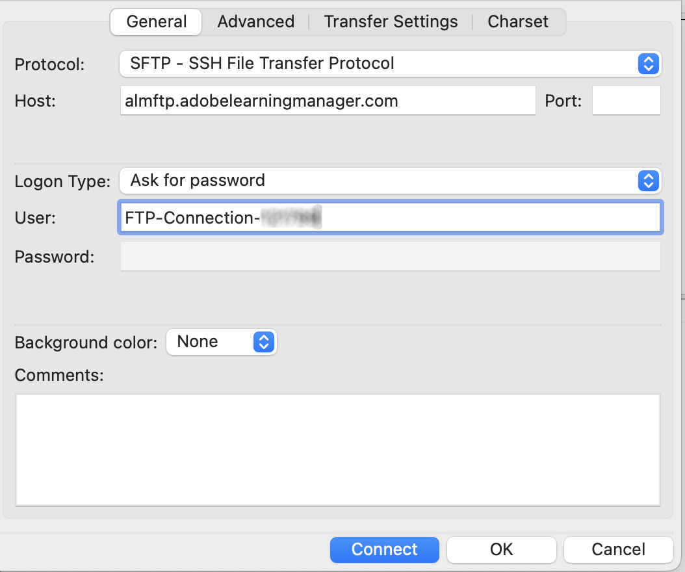

# Übergang vom Adobe FTP Manager

Adobe Learning Manager unterstützt einen neuen Connector mit dem SFTP-Protokoll der AWS Transfer-Familie.

Sie können jeden Open-Source-FTP-Client durch Adobe FTP Manager ersetzen.

Einige von AWS empfohlene FTP-Clients sind hier [aufgelistet](https://docs.aws.amazon.com/transfer/latest/userguide/transfer-file.html):

* FileZilla (Windows, macOS und Linux)
* OpenSSH (macOS und Linux) – Hinweis: Dieser Client funktioniert nur mit Servern, die für das Secure Shell (SSH) File Transfer Protocol (SFTP) aktiviert sind.
* WinSCP (nur Microsoft Windows)
* Cyberduck (Windows, macOS und Linux)

## Konfigurieren des AWS-basierten FTP-Connectors

Sie müssen den neuen AWS-basierten FTP-Connector im Integrations-Admin konfigurieren.

*Wählen Sie die FTP-Option aus*

Sobald Sie eine Verbindung hergestellt haben, wird die Seite Verbindungsdetails angezeigt.

*Seite mit den Verbindungsdetails anzeigen*

Es gibt drei Authentifizierungsoptionen:

### Erstellen der Authentifizierung durch Generieren neuer SSH-Schlüssel

Wenn Sie den SSH-Schlüssel in Ihrem System selbst generieren möchten, können Sie dies tun. Klicken Sie auf SSH-Schlüssel generieren.

Der private Schlüssel wird auf Ihren Computer heruntergeladen und der öffentliche Schlüssel in unseren Diensten gespeichert. Nachdem Sie auf &quot;Verbinden&quot; geklickt haben, wird der FTP-Benutzer mit den öffentlichen und privaten Schlüsseln als Authentifizierung erstellt.

Sie haben eine FTP-Verbindung erstellt.

### Erstellen einer Authentifizierung mithilfe vorhandener SSH-Schlüssel

Wenn Sie bereits über einen SSH-Schlüssel verfügen, fügen Sie den öffentlichen Schlüssel in das Feld &quot;**[!UICONTROL FTP Public Key]**&quot; ein und klicken Sie dann auf &quot;Verbinden&quot;.

*Schlüssel einfügen*

### Erstellen einer einfachen Authentifizierung mit Kennwort

Dies ist der grundlegende Authentifizierungsmechanismus. Wählen Sie die erste Option aus: **[!UICONTROL Erstellen einer Standardauthentifizierung mit einem Kennwort]**. Geben Sie das Kennwort ein und klicken Sie dann auf **[!UICONTROL Verbinden]**.

Dadurch wird eine Verbindung erstellt.

## Nächste Schritte

### Einrichten des FTP-Clients

Richten Sie die Verbindung auf einem FTP-Client ein (im Abschnitt weiter oben empfohlen). Verwenden Sie dabei die heruntergeladenen Schlüssel oder vorhandene Schlüssel oder das Kennwort.

### Beispiel-Testexport

* Ändern Sie auf dem FTP-Client den Speicherort von ExaVault-FTP in den neuen FTP-Speicherort. Die neue Domäne ist `http://almftp.adobelearningmanager.com/`.
* Sie müssen auch die IP-Adresse &quot;`18.195.107.67`&quot; in die Positivliste aufnehmen.
* Nach der Authentifizierung müssen Sie einige Beispieldateien mithilfe externer FTP-Clients oder Automatisierungsskripte auf den neuen FTP-Speicherort hochladen und von dort herunterladen.
* Sie müssen die Daten vom alten zum neuen Speicherort übertragen.
* Die Datenaufbewahrungsrichtlinie für den Connector bleibt unverändert. ExaVault unterstützte zusätzlich zur offiziellen Richtlinie auch einige Datenaufbewahrungsrichtlinien. Solche Datenaufbewahrungsrichtlinien sind für den neuen Connector nicht verfügbar. Überprüfen Sie, ob Ihr Connector eine Datenaufbewahrung verwendet, die außerhalb der offiziell unterstützten Richtlinien liegt.

### Was passiert mit den Migrationsprojekten?

| Status | Empfehlung |
|---|---|
| Neue Migration | Sie können keine neuen Migrationen vom alten FTP starten. Sie müssen das neue FTP für die neuen Migrationen verwenden. Weitere Unterstützung erhalten Sie vom Customer Success Team. |
| Migration läuft | Erstellen eines Sprints: Sie können das alte FTP weiterhin verwenden, aber wir empfehlen die Verwendung des neuen FTP. Wenden Sie sich an das Customer Success Team für jeden vorhandenen Sprint, der nicht verschoben werden kann. |
| Geschlossene Migration | Keine Aktion. |

## Herstellen einer Verbindung mit Adobe Learning Manager über den FileZilla-FTP-Client

1. Stellen Sie eine Verbindung mit dem neuen ALM-FTP-Connector her. Klicken Sie auf Verbinden.

   
   *Verbindung mit neuem ALM-FTP-Connector herstellen*

1. Um eine Verbindung mithilfe einer Standardauthentifizierung über ein Kennwort herzustellen, geben Sie den Domänennamen und den FTP-Benutzernamen ein und richten Sie ein Kennwort ein, das den Kriterien für die Kennwortüberprüfung entspricht. Klicken Sie auf Verbinden. Die neue FTP-Verbindung wird erstellt und ist über jeden SFTP-Client zugänglich.

   
   *über einfache Authentifizierung über Kennwort*

1. Installieren Sie einen beliebigen SFTP-Client, z. B. FileZilla. Starten Sie Datei Zilla, und klicken Sie oben links auf Site-Manager öffnen.

   
   *Verbindung über SFTP-Client herstellen*

1. Klicken Sie auf **[!UICONTROL Neuer Server]**, um einen neuen Server zu erstellen. Benennen Sie den Server nach Bedarf um.

   
   *Site erstellen*

1. Ordnen Sie die Details von der Seite mit den Connector-Anmeldeinformationen zu.

   * Protokoll als &quot;SFTP - SSH File Transfer Protocol&quot; auswählen
   * Geben Sie als Server die FTP-Domäne ein.
   * Anmeldetyp als &quot;Kennwort anfordern&quot;
   * Geben Sie als Benutzer den FTP-Benutzernamen ein.

1. Klicken Sie auf Verbinden.

   
   *Anmeldeinformationen eingeben*

   >[!NOTE]
   >
   >Führen Sie diesen Schritt im FileZilla-Client aus.

1. Geben Sie das Kennwort ein.

   (Optional) Aktivieren Sie das Kontrollkästchen „Passwörter speichern“, um das Kennwort zu speichern.

   
   *Kennwort eingeben*

   (Optional) Aktivieren Sie das Kontrollkästchen **[!UICONTROL Diesem Host immer vertrauen]**, um dem Host zu vertrauen.

1. Klicken Sie auf OK.

   
   *Hostschlüssel*

1. Überprüfen Sie im oberen Bereich den Status und den Fortschritt der Verbindung.

   Die linke Hälfte zeigt den lokalen Computer, die rechte Hälfte den Remoteserver.

   So verschieben Sie Dateien vom lokalen Computer auf den Server und umgekehrt:

   * Sie können Dateien per Drag &amp; Drop verschieben.
   * Doppelklicken Sie auf die Datei.

   
   *Verbindungsstatus überprüfen*

Sie können den Authentifizierungstyp jederzeit ändern und aktualisieren.

SSH-Schlüssel sind eine weitere Authentifizierungsmethode:

Fügen Sie Ihren öffentlichen Schlüssel in das Textfeld ein, um vorhandene SSH-Schlüssel zu verwenden. Klicken Sie auf Verbinden/Speichern.

Um neue SSH-Schlüssel zu generieren, klicken Sie auf die Schaltfläche &quot;**[!UICONTROL SSH-Schlüssel generieren]**&quot;. Der private Schlüssel wird heruntergeladen. Klicken Sie auf **[!UICONTROL Verbinden/Speichern]**.

*SSH-Schlüssel generieren*

Ordnen Sie die Details zu. Wählen Sie „Schlüsseldatei“ als Verbindungsart aus. Wählen Sie die private Schlüsseldatei aus.

Klicken Sie auf **[!UICONTROL Verbinden]**.

## Was passiert, sobald ExaVault veraltet ist?

Sobald ExaVault veraltet ist, werden alle vorhandenen Migrationsprojekte, die in Bearbeitung sind, auf das neue FTP als Quellspeicherort umgestellt. Anschließend müssen Sie den neuen FTP-Connector konfigurieren und den Migrationsvorgang fortsetzen.

## Empfehlungen zum Migrieren von Sprints

Zum Erstellen eines Migrationsprojekts empfiehlt Adobe die Verwendung des neuen AWS-SFTP-Connectors, um eine spätere Sprint-Migration von ExaVault zu AWS zu vermeiden.

Wenn eine Migration ausgeführt wird, schließen Sie den aktuellen Sprint, der Exavault als Datenquelle verwendet. Erstellen Sie die AWS-SFTP-Verbindung, testen Sie die Einrichtung und wenden Sie sich an das Customer Success-Team, um zur neuen AWS-SFTP-Datenquelle zu wechseln. Erstellen Sie nach dem Wechsel einen neuen Sprint im selben Migrationsprojekt. Die Sprint-Ordner werden am neuen Speicherort erstellt und Sie können die Migrations-CSVs hochladen, um die Aktivität fortzusetzen.

**Fälle, in denen ein Migrationsprojekt nicht geschlossen werden kann**

* Die Kurs-ID-Zuordnung erfolgt im aktuellen Projekt für Kurse, die von externen älteren Systemen zu Adobe Learning Manager migriert werden. Dies ist nur möglich, wenn Sie dieselben Kurse in demselben Projekt aktualisieren möchten. Nachdem Sie das Projekt geschlossen haben, können Sie die zugehörigen Details nicht mehr ändern.
* Für API-basierte Migrationsprojekte, bei denen Sie ein Projekt nicht schließen dürfen.
