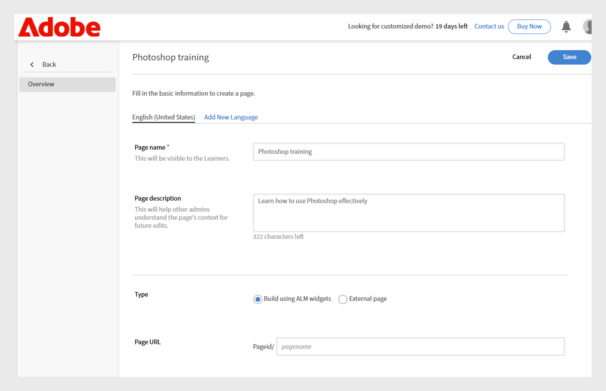
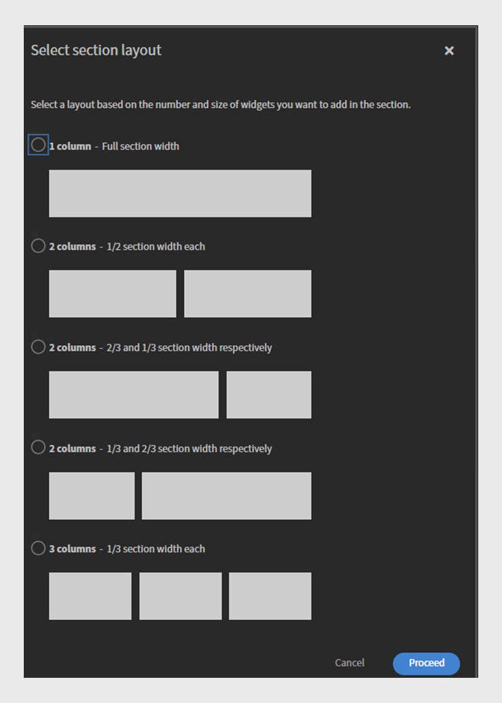

# Künftige Änderungen in Adobe Learning Manager

<!-- >>[!IMPORTANT]
>
>The Adobe Learning Manager October 2025 release is now live. View [What's New](/help/migrated/whats-new.md) for more information on the latest features and enhancements. This page will be updated with the new features and enhancements for the next release. Stay tuned for more updates. -->

## Überblick über die Version

Die Adobe Learning Manager-Version vom April 2026 enthält eine Reihe von Verbesserungen, die das Lernen für Teilnehmer reibungsloser, für Administratoren leichter zu verwalten und für Kursleiter flexibler machen. Dazu gehören eine klarere Navigation im Fluidic Player mit einer Beschriftung &quot;Nächstes Modul&quot; und einer speziellen Schaltfläche &quot;Beenden&quot;, die Unterstützung mehrerer gleichzeitiger Zoom-Sitzungen, sodass Teams parallele virtuelle Klassen ohne manuelle Einrichtung ausführen können, und eine bessere Übersicht über freigegebene Kurse, indem der eigentliche Autor anstelle von &quot;Externer Autor&quot; in Peer-Konten angezeigt wird. Das Update zeigt auch Ablaufdaten für Lernobjekte in Teilnehmer-APIs an, damit LXPs zeitabhängige Schulungen hervorheben können, fügt Unterstützung für mehrere Sprachen für Arbeitshilfen hinzu, sodass eine Arbeitshilfe alle Sprachversionen enthalten kann, und ermöglicht es Administratoren, einzuschränken, wann Module gestartet werden können, indem sie Start-/Endfenster definieren, die für Kohorten oder zeitgesteuerte Programme nützlich sind.

Externe Systeme, die LTI verwenden, können die Player-Sprache jetzt automatisch festlegen, sodass die Teilnehmer eine einheitliche Spracherfahrung über verschiedene Plattformen hinweg erhalten. Darüber hinaus werden verschiedene Checklisten-Upgrades durchgeführt, darunter eine gewichtete Punktzahl, mehrsprachiger Fragentext und optionale Kommentare von Überprüfern, die für umfangreicheres Feedback sorgen. ALM erfasst jetzt mehrere Quizversuche, die innerhalb von SCORM-Inhalten gesteuert werden, und meldet jeden Versuch in der L2-Berichterstellung sauber. Kursleiter können auch selbst QR-Codes generieren, um die sofortige Registrierung und die Anwesenheitsverfolgung während persönlicher Sitzungen zu ermöglichen, und Captivate-Inhalte werden mit einem einheitlichen Inhaltsverzeichnis, Vervollständigungsticks auf Folienebene und zuverlässigen Notizenexporten sauberer wiedergegeben. Insgesamt konzentriert sich die Version auf Klarheit, Konsistenz, mehrsprachige Eignung, effiziente Verwaltung und flexiblere Schulungen.

## Fluidic Player-Navigation: Zeigt den Namen des nächsten Moduls an.

### Überblick

Diese Verbesserung war bereits in der Version November 2025 von Adobe Learning Manager enthalten.

Die Aktion &quot;Weiter&quot; im Player zeigt an, was passiert, wenn auf den Button geklickt wird, indem der Name des nächsten Moduls oder Kurses angezeigt und explizit signalisiert wird, wann der Teilnehmer den Player beenden wird.

### Neue Funktionen

**Bezeichnung &quot;Nächstes Modul: {ModuleName}&quot; im Player**

Das Symbol Weiter im Fluidic Player zeigt jetzt den Namen des nächsten Moduls im Kurs an. Beispiel: Nächstes Modul: Lektion 2 - Erste Schritte.

Dies gilt, wenn der Teilnehmer innerhalb desselben Kurses von einem Modul zum nächsten wechselt.

**Aktion zum Beenden des letzten Moduls löschen**

Wenn sich der Teilnehmer im letzten Modul eines Kurses befindet, wird eine neue Schaltfläche &quot;Aktion beenden&quot; angezeigt, die angibt, dass der Player durch Klicken geschlossen und wieder in den Kurskontext eingefügt wird.

**Responsives Verhalten für Inhalte für Mobilgeräte und PDF**

Bei kleineren Viewports (z. B. ~320 px Breite) wird die Beschriftung &quot;Weiter&quot; möglicherweise verkürzt oder ausgeblendet, sodass nur das Symbol angezeigt wird, um Überschneidungen mit den PDF-Steuerelementen zu vermeiden.

Bei PDF-Modulen passt der Player die Steuerelemente an eine separate Zeile an, sodass Navigationsbeschriftungen und PDF-Steuerelemente sich nicht gegenseitig stören.

**Admin > Branding > Player-Vorschau aktualisiert**

Die Player-Vorschau in Admin > Branding spiegelt jetzt die neue Beschriftung wider, z. B. Nächstes Modul: Lektion 2. Dadurch können Administratoren das aktualisierte Navigationsverhalten anzeigen.

### Wichtigste Vorteile

**klarere Navigation für Teilnehmer**

Die Teilnehmer müssen nicht mehr raten, was passiert, wenn sie &quot;Weiter&quot; auswählen. Auf dem Etikett ist klar angegeben, was als Nächstes kommt, ob es sich um ein Modul oder einen Kurs handelt. Diese Verringerung der Mehrdeutigkeit hilft, Zögern und Verwirrung zu lindern, insbesondere bei großen Zielgruppen im Kundenschulungsbereich, bei denen viele Teilnehmer nicht mit LMS-Schnittstellen vertraut sind.

**Höhere Kursabschlussraten**

Das klare Angeben des nächsten Schritts (nächstes Modul: {ModuleName}) und das Hinzufügen einer deutlichen Exit-Aktion für das letzte Modul verringert die Wahrscheinlichkeit, dass Teilnehmer den Kurs beenden oder den letzten Abschlussschritt übersehen.

**Berechenbarere Benutzererfahrung auf allen Geräten**

Die aktualisierten Beschriftungen entsprechen dem Verhalten &quot;Nächste&quot; oder &quot;Vorherige&quot; und den Symbolen auf Desktop, Tablet und Smartphone. Layouteinschränkungen werden auf allen Geräten und PDF-Flows beachtet, sodass Steuerelemente weiterhin verwendbar und zugänglich sind.

Dies ist besonders wichtig für Headless-Implementierungen, bei denen der Fluidic Player in ein benutzerdefiniertes Lernerlebnis eingebettet ist.

### Anwendungsszenarien

**Schulungsportale für Kunden und Partner (Headless oder AEM integriert)**

Konten, die Adobe Learning Manager in einem Headless-Setup nutzen und die Teilnehmer von externen Marketing-Kanälen leiten Diese Teilnehmer:

* Häufig werden Videoinhalte in langen Sequenzen konsumiert.

* Sie sollten ein Erlebnis wie im Lehrplan erwarten, bei dem das System die nächste Episode/das nächste Modul deutlich anzeigt.

In diesen Umgebungen wird die Bezeichnung &quot;**Nächstes Modul:{ModuleName}**&quot; wie folgt angezeigt:

* Bekräftigt die Führung der Reise.

* Minimiert das Ablegen zwischen Modulen.

**Compliance- und Zertifizierungskurse mit bestellten Modulen**

In regulierten oder Compliance-intensiven Szenarien:

* Teilnehmer müssen eine strikte Abfolge von Modulen abschließen.

* Autoren deaktivieren oft das Inhaltsverzeichnis, um ein Überspringen zu vermeiden.

Hier wird **Nächstes Modul:{ModuleName}** angezeigt:

* Bestätigt den Teilnehmern, dass sie die richtige Reihenfolge befolgen.

* Vermindert die Wahrscheinlichkeit, dass sie die nächste Aktion falsch interpretieren und den Dienst vorzeitig beenden.

**Lernpfade, in denen Kurse aufeinander folgen**

Wo Lernpfade oder Äquivalente mehrere Kurse verknüpfen. Dies ist nützlich, wenn Sie Sequenzen im Curriculum-Stil für ein großes Publikum erstellen.

**Erste Verwendung für Mobilgeräte**

Für Teilnehmer, die hauptsächlich Smartphones oder Tablets verwenden:

* Aktualisierte Beschriftungen und ein reaktionsfähiges Verhalten stellen sicher, dass die Navigation verständlich bleibt, ohne auf winzige Schließen-Symbole oder ausgeblendete Steuerelemente angewiesen zu sein.

* Dies ist wichtig für Kundenschulungen, Gig Worker oder Teilnehmer an vorderster Front, die in kurzen Sitzungen auf mobilen Geräten auf Inhalte zugreifen können.

## Zoom-Connector - Erstellen mehrerer gleichzeitiger Zoom-Sitzungen

### Überblick

Das bevorstehende Upgrade auf den Zoom-Connector wird die Verwaltung von Virtual Instructor-Led Training (VILT) durch Adobe Learning Manager erheblich verbessern. Früher konnten Benutzer jeweils nur eine Zoom-Sitzung erstellen. Mit dem neuen Update können Administratoren und Autoren über die Standardintegration mehrere Zoom-Sitzungen gleichzeitig planen.

### Neue Funktionen

#### Unterstützung für mehrere gleichzeitige Zoom-Sitzungen über den Connector

* Mit dem Zoom-Connector können jetzt mehr als eine VILT-Sitzung zum gleichen Datum/zur gleichen Zeit aus ALM erstellt werden.

* Die Planungslogik erzwingt nicht mehr die Einschränkung &quot;ein Zoom-Meeting nach dem anderen&quot; auf Konto-/Connector-Ebene.

* Administratoren und Autoren können überlappende VILT-Sitzungen (z. B. regionale Klassenzimmer, parallele Tracks oder wiederholte Sitzungen für verschiedene Partnergruppen) ohne Umgehungslösungen konfigurieren.

#### Meetings werden mit der Zoom-Identität des Kursleiters erstellt (nicht mit dem Zoom-Superadministrator)

Um gleichzeitige Meetings sicher zu unterstützen, wurde der Connector aktualisiert, sodass:

* Zoom-Meetings werden jetzt mit der E-Mail-Adresse des Kursleiters anstelle der E-Mail &quot;Zoom Super Admin&quot; erstellt.

* Das Zoom-Konto jedes Kursleiters kann parallel zu anderen Kursleitern eigene Meetings veranstalten, vorbehaltlich der Einschränkungen des bestehenden Zoom-Plans.

**Hinweis**:

* Es wird nur noch ein Kursleiter pro Meeting unterstützt.

* Wenn die E-Mail-Adresse eines Kursleiters später in Adobe Learning Manager aktualisiert wird, bleiben bestehende Meetings mit der ursprünglichen E-Mail-Adresse verknüpft, die bei der Erstellung verwendet wurde.

#### Das manuelle Einfügen der Zoom-URL für gleichzeitige Sitzungen ist nicht mehr erforderlich

Früher, als eine zweite oder dritte Zoom-Sitzung gleichzeitig ausgeführt werden musste:

* Autoren mussten Zoom-Meetings außerhalb von ALM manuell erstellen und dann die Zoom-Join-URL in die Kursinstanzkonfiguration einfügen.

* Dies war fehleranfällig und hat nicht von Connector-Funktionen wie der Anwesenheitsverfolgung profitiert.

Mit dem aktualisierten Connector:

* Alle Sessions können mithilfe des Zoom-Connectors direkt über die ALM-Benutzeroberfläche erstellt werden, auch wenn sie sich zeitlich überlappen.

* Der Sitzungslebenszyklus (Erstellung/Abbruch) wird weiterhin zentral über die Integration verwaltet.

### Wichtigste Vorteile

#### Bessere VILT-Planung im benötigten Umfang.

Organisationen haben jetzt folgende Möglichkeiten:

* Führen Sie mehrere Zoom-basierte virtuelle Klassenzimmer gleichzeitig aus (z. B. parallele Kurse an einem virtuellen Gipfel, regionale Kohorten oder separate Partnerschulungen).

* Vermeiden Sie Engpässe, die Administratoren zuvor zwangen, Sitzungen zu serialisieren, oder nutzen Sie die manuelle Zoom-Verwaltung.

#### Verringerter Administrator- und Autorenaufwand

Durch die Verbesserung entfällt Folgendes:

* Manuelle Erstellung von Zoom-Meetings außerhalb von Adobe Learning Manager.

* Kopieren Sie Zoom-URLs und fügen Sie sie für überlappende Sitzungen in jede Kursinstanz ein.

* Risiko falsch konfigurierter Links, falscher Meetings oder fehlender Anwesenheitsverfolgung.

Administratoren und Autoren können alle Zoom-Sitzungen über Adobe Learning Manager mithilfe vertrauter Workflows verwalten.

#### Bessere Ausrichtung an Zoom-Bereitstellung und Kursleiterrollen

Durch Verbinden von Meetings mit einzelnen Kursleiter-Zoom-Konten:

* Jeder Kursleiter kann innerhalb seiner eigenen Zoom-Lizenzbeschränkungen arbeiten.

* Unternehmen können ihr bestehendes Zoom-Bereitstellungsmodell nutzen (ein Konto pro Trainer, pro Geschäftseinheit usw.) und dennoch vollständig in Adobe Learning Manager integrieren.

* Dadurch wird der Single-Point-Engpass vermieden, den die Verwendung eines gemeinsamen Super-Admin-Zoom-Benutzers für alle Sitzungen verursacht.

### Anwendungsszenarien

#### Multitrack-Veranstaltungen und -Gipfeltreffen

Kundenschulungsteams, die große Veranstaltungen durchführen (z. B. Produkt-Bootcamps, Partnergipfel oder Zertifizierungswochen), können:

* Konfigurieren Sie mehrere Zoom-basierte Sitzungen im selben Zeitfenster (für verschiedene Spuren oder Themen).

* Verwalten Sie sie alle als VILT-Module in den Kursen und Lernpfaden von Adobe Learning Manager.

* Bieten Sie Teilnehmern ein einheitliches Erlebnis, während der Connector die gesamte Erstellung von Zoom-Meetings übernimmt.

#### Globale Partner- und Kundenschulungen

Organisationen, die Kunden und Partner in verschiedenen Regionen schulen, können Folgendes:

* Führen Sie separate Zoom-Sitzungen für EMEA, APAC und Nord- und Südamerika zu überlappenden Zeiten durch, um die lokalen Arbeitszeiten abzugleichen.

* Vermeiden Sie es, einen einzelnen globalen Zeitschlitz oder manuellen Zoom-Setup für zusätzliche Kohorten zu erzwingen.

#### Interne Aktivierung

Interne Enablement-Teams (Vertrieb, Support usw.) können:

* Planen Sie parallele Onboarding-Sitzungen oder rollenbasierte Breakout-Sessions (z. B. separate Zoom-Räume für Entwickler, Administratoren und geschäftliche Stakeholder) in ALM.

* Bewahren Sie alle Sitzungen im VILT-Modell von ALM zu Reporting- und Compliance-Zwecken auf, anstatt teilweise zu nicht verwalteten Zoom-Meetings zu wechseln.

## Ursprünglichen Autor für freigegebene Kurse in Peer-Konten anzeigen

### Überblick

Wenn ein Kurs über den Katalog für ein Peer-Konto freigegeben wird, kennzeichnet Adobe Learning Manager den Autor derzeit in der Teilnehmer-, Administrator- und Autorenansicht des empfangenden Kontos als &quot;Externer Autor&quot;. Dies kann zu Herausforderungen für Teilnehmer und Administratoren führen, insbesondere in großen Unternehmen, da es schwierig wird, den entsprechenden Inhaltseigentümer zu identifizieren und zu kontaktieren, wenn Probleme oder Fragen auftreten.

Durch die Verbesserung wird sichergestellt, dass Autoreninformationen beibehalten und für freigegebene Kurse in Peer-Konten angezeigt werden, anstatt durch einen generischen Platzhalter ersetzt zu werden.

### Neue Funktionen

Anzeigen des tatsächlichen Autorennamens für freigegebene Kurse in Peer-Konten

Bei Kursen, die über externe oder Peer-Kataloge freigegeben wurden, wird der ursprüngliche Autorenname aus dem Quellkonto jetzt im empfangenden Konto anstelle von &quot;Externer Autor&quot; angezeigt.

Dies gilt für:

* Teilnehmer-App (Kurskarte oder Kursdetails).

* Administrator- und Autorenansichten bei der Vorschau als Teilnehmer.

### Wichtigste Vorteile

#### Direkte Eigentümersichtbarkeit für freigegebene Inhalte

Teilnehmer und Administratoren in Peer-Konten können jetzt:

* Sehen Sie, wer den Kurs erstellt hat, auch wenn er über einen freigegebenen Katalog erworben wurde.

* Vermeiden Sie die generische und wenig hilfreiche Beschriftung &quot;Externer Autor&quot;.

#### Konsistentere Erlebnisse für mehrere Mandanten und Peer-Accounts

Für Kunden, die mehrmandantenfähige oder erweiterte Unternehmensszenarien ausführen:

* Derselbe Kurs wird mit konsistentem Branding für Autoren auf allen Konten angezeigt.

* Das Teilnehmererlebnis wird den Erwartungen des primären Kontos angepasst (z. B. wird &quot;Cloud Academy Team&quot; anstelle von &quot;Externer Autor&quot; angezeigt).

### Anwendungsszenarien

#### Großunternehmen mit Peer-Konten

Das Unternehmen verwendet ALM mit:

* ein Hauptkonto, dem die kanonischen Kurse gehören, und

* Peer-Konten, die Inhalte über freigegebene Kataloge erwerben.

Teilnehmer in Peer-Konten müssen wissen, welches Unternehmensteam einen Kurs erstellt hat, um Fragen oder Verbesserungsvorschläge korrekt weiterzuleiten.

Mit dieser Verbesserung:

* Freigegebene Kurse zeigen jetzt den richtigen Unternehmensautorennamen in Peer-Konten an.

* Die interne Supportlast des Unternehmens wird verringert, da Teilnehmer und lokale Administratoren wissen, an wen sie sich wenden müssen.

#### Interne Multi-BU-Freigabe

Wo eine Geschäftseinheit das Lernen für andere kuratiert:

* Die Eigentümer-BU kann im Autorenfeld für alle konsumierenden Konten identifiziert werden.

* Lokale L&amp;D-Administratoren können schnell erkennen, ob ein Kurs lokal oder von einer anderen Geschäftseinheit verwaltet wird, und entsprechend zusammenarbeiten.

## Verfügbarmachen des Ablaufdatums des Lernobjekts (automatische Einstellung) in Teilnehmer-APIs

### Überblick

Durch diese Verbesserung wird das Datum der automatischen Einstellung eines Lernobjekts (LO) direkt über die APIs für Teilnehmer in Adobe Learning Manager verfügbar gemacht. Wenn ein Kurs, ein Lernpfad oder eine Zertifizierung mit einem Ablaufdatum oder einem Datum für die automatische Einstellung konfiguriert ist, sind diese Informationen jetzt Teil der LO-Daten, die von wichtigen Teilnehmerendpunkten zurückgegeben werden.

### Neue Funktionen

#### Neues Feld für das Ablaufen/automatische Einstellen in Teilnehmer-LO-APIs

* Die Teilnehmer-LO-APIs (z. B. die Endpunkte, die Lernobjekte an die Teilnehmererfahrung und an externe Plattformen zurückgeben) enthalten jetzt das LO-Ablaufdatum (das für dieses Lernobjekt konfigurierte Datum für die automatische Einstellung).

* Dieses Feld wird als Teil der LO-Entität in Antworten wie den folgenden zurückgegeben:

   * Lernobjekt abrufen (LO-Details).

   * LO-Daten, die zum Füllen der Startseite, des Katalogs und der Suchergebnisse der Teilnehmer verwendet werden.

* Das Feld ergänzt die vorhandene Frist für Fertigstellung, die bereits auf Instanzebene vorhanden ist. Das neue Feld ist speziell das Datum der automatischen Einstellung auf LO-Ebene.

#### Verfügbarkeit von durchsuchten Teilnehmererlebnissen

Da das Ablaufdatum als Teil der suchbasierten LO-Darstellung angezeigt wird, ist es jetzt überall verfügbar, wo ALM oder eine externe Plattform verwendet:

* Such-APIs oder

* suchgesteuerte Kataloge und Vorschläge zum Erstellen von Teilnehmeransichten.

**Umfang und Ausschlüsse**

Die Verbesserung gilt nur für Teilnehmer-APIs.

### Wichtigste Vorteile

#### Expiry-bewusste Teilnehmererfahrung in benutzerdefinierten LXPs

Für große und mittlere Unternehmen kann das benutzerdefinierte LXP jetzt LO-Ablaufinformationen direkt von ALM abrufen, sodass sie:

* Auf Kurskarten und Detailseiten die Beschriftungen &quot;Ablaufdatum am {date}&quot; oder &quot;Bald ablaufen&quot; anzeigen.

* Kommunizieren Sie mit der Dringlichkeit klarer, sodass die Teilnehmer Schulungen, die demnächst eingestellt werden, priorisieren.

Dies ist besonders wichtig für Compliance- oder zeitgebundene Produktschulungen, bei denen Lernobjekte regelmäßig aktualisiert werden und ältere Versionen eingestellt werden.

#### Bessere Anleitung für Teilnehmer, an denen jetzt Schulungen absolviert werden sollen

Indem das LO-Ablaufdatum angezeigt wird, kann die Teilnehmererfahrung Folgendes tun:

* Markieren Sie die Kurse, die noch gültig sind, im Vergleich zu denen, die demnächst eingestellt werden.

* Helfen Sie Teilnehmern dabei, sich nicht für Schulungen zu registrieren, die in naher Zukunft nicht mehr verfügbar oder gültig sind.

#### Übereinstimmung mit den Daten zum Abschlusstermin

Bisher haben Teilnehmer-APIs bereits das Abschlussdatum auf Instanzebene, aber nicht das Datum der automatischen Einstellung auf LO-Ebene angezeigt. Mit dieser Änderung:

Folgende Aspekte einer Schulung stehen zur Verfügung:

* &quot;Bis wann muss ich diese Instanz beenden?&quot; (Ausfülltermin).

* &quot;Bis wann wird diese Schulung angeboten?&quot; (automatische Einstellung/Ablaufdatum).

### Anwendungsszenarien

#### Ein globales Unternehmen mit striktem Management des Kurslebenszyklus

Unternehmen, die regelmäßig Kurse einstellen und ersetzen (z. B. durch Aktualisierungen von Vorschriften, Produkten oder Methoden), haben folgende Möglichkeiten:

* Vermeiden Sie Verwirrung bei den Teilnehmern darüber, ob eine Schulung schrittweise eingestellt wird.

* Motivieren Sie Teilnehmer zu aktuellen, langfristigen Angeboten.

Benutzerdefinierte Portale und interne Tools können das Ablaufdatum jetzt direkt aus ALM über die Teilnehmer-APIs lesen.

#### Externe Kunden- oder Partnerakademien

Bei Schulungen für Kunden und Partner stehen für Marketing-Seiten und -Portale oft aktuelle Schulungen im Vordergrund.

Ablaufdaten in der LO-API ermöglichen es Experience Buildern:

* Blenden Sie Inhalte aus, die kurz vor dem Eintritt in den Ruhestand stehen, oder heben Sie deren Hervorhebung auf.

* Kampagnen für den letzten Schliff entwickeln.

## Unterstützung mehrerer Sprachen für Arbeitshilfen

### Überblick

Durch die Erweiterung wird das Lokalisierungsmodell von Adobe Learning Manager auf Arbeitshilfen erweitert, sodass Autoren verschiedene Inhaltsdateien pro Sprache an eine einzelne Arbeitshilfe anhängen können. Anstatt separate Arbeitshilfen für jede Sprache zu erstellen, können Autoren jetzt alle lokalisierten Versionen als eine logische Arbeitshilfe verwalten.

### Neue Funktionen

#### Sprachspezifischer Inhalt für Arbeitshilfen hochladen

Autoren können verschiedene Dateien pro unterstützte Sprache an eine einzelne Arbeitshilfe anhängen, z. B. an Kurse und andere LOs.

Die Funktion zum Erstellen/Bearbeiten von Arbeitshilfen unterstützt jetzt Folgendes:

* Auswählen einer Sprache.

* Hochladen der sprachspezifischen Datei für diese Sprache in derselben Arbeitshilfeentität.

#### Konsistente Sprachverarbeitung in der Benutzeroberfläche für Player und Teilnehmer

Der Fluidic Player wurde aktualisiert, sodass beim Öffnen einer Arbeitshilfe durch einen Teilnehmer die der Sprache des Teilnehmers entsprechende Inhaltsvariante angezeigt wird (sofern verfügbar).

Administratoren und Autoren können Arbeitshilfen als einzelne Objekte mit Sprachvarianten anzeigen, anstatt separate Elemente pro Sprache.

### Wichtigste Vorteile

#### Einzelarbeitshilfe für alle Sprachen

Autoren können die Erstellung separater Arbeitshilfen pro Sprache vermeiden.

Alle Sprachvarianten derselben Arbeitshilfe (z. B. eine Prozedur, SOP, Checklisten-PDF oder ein Referenzhandbuch) können an einem Ort verwaltet werden.

#### Bessere Erlebnisse für globale Teilnehmer

Die Teilnehmer sehen die Arbeitshilfe automatisch in ihrer bevorzugten Sprache, d. h. es gibt Folgendes:

* Weniger Verwirrung darüber, welche Version geöffnet werden soll.

* Geringeres Risiko beim Zugriff auf veraltete oder überholte Kopien.

Dies ist besonders in mehrsprachigen Organisationen nützlich, in denen dieselbe Prozess- oder Produktdokumentation in mehreren Sprachen verfügbar sein muss.

### Anwendungsszenarien

#### Globale Bereitstellung von Referenzinhalten

Ein Unternehmen muss Teilnehmern weltweit Arbeitshilfen in mehreren Sprachen zur Verfügung stellen, z. B.:

* Produktreferenzen.

* Prozesschecklisten.

* Unterstützung von Playbooks

Anstatt separate Arbeitshilfen wie &quot;Product Quick Start - EN&quot;, &quot;Product Quick Start - DE&quot;, &quot;Product Quick Start - JP&quot; usw. zu erstellen, können sie eine Arbeitshilfe erstellen, lokalisierte Dateien für jede Sprache anhängen und es zulassen, dass ALM jedem Teilnehmer die richtige Version basierend auf den Spracheinstellungen bereitstellt.

#### Kunden- oder Partner-orientierte Dokumentation für mehrere Märkte

Für Kunden- und Partnerakademien können Arbeitshilfen Folgendes umfassen:

* Produktübersicht

* Integrationsleitfäden

* Support-Arbeitsabläufe

Mit mehrsprachigen Arbeitshilfen:

* Jeder Partner sieht die lokalisierte Version, ohne zwischen sprachspezifischen Einträgen wählen zu müssen.

* Marketing- und Enablement-Teams können eine Arbeitshilfe pro Thema in allen Sprachen verwalten.

## Einschränkung für Startzeit des Moduls festlegen

### Überblick

Mithilfe der Erweiterung können Autoren und Administratoren in Adobe Learning Manager ein Zeitfenster definieren, in dem Teilnehmer ein Modul starten dürfen. Außerhalb des konfigurierten Start-/Endfensters bleibt das Modul in der Kursstruktur sichtbar, aber die Teilnehmer können es nicht initiieren.

Diese Funktion ist von entscheidender Bedeutung für Benutzer, die eine strengere Kontrolle darüber benötigen, wann bestimmte Inhalte verfügbar werden, oder die ihre Initiierung beenden sollten, z. B. in zeitgesteuerten Programmen, kohortenbasierten Schulungen oder zeitabhängigen Übungen.

### Neue Funktionen

Autoren können jetzt auf Modulebene innerhalb eines Kurses ein Startdatum/-uhrzeit sowie ein Enddatum/-uhrzeit konfigurieren, das bestimmt, wann Teilnehmer dieses Modul starten dürfen. Innerhalb dieses Fensters verhält sich das Modul wie gewohnt. Vor der Startzeit oder nach der Endzeit sieht der Teilnehmer das Modul in der Kursübersicht, kann es aber nicht starten.

Die Konfiguration wird in der Benutzeroberfläche für die Kurserstellung als zusätzliche Planungssteuerung für bestimmte Modultypen angezeigt, z. B. zum Selbststudium vorgesehene Inhalte, Tests oder Aktivitäten. Administratoren können diese Steuerelemente verwenden, um Module zu erstellen, die in Phasen geöffnet werden, oder um späte Starts in Programmen zu verhindern, in denen Inhalte innerhalb eines definierten Zeitraums belegt werden müssen.

#### Wichtigste Vorteile

Der Hauptvorteil besteht in der Möglichkeit, zu steuern, wann auf Module zugegriffen werden kann. Schulungsteams können die Modulverfügbarkeit mit Ereignissen aus der Praxis synchronisieren, z. B. neuen Produkteinführungen, gesetzlichen Fristen und internen Programmen. Dadurch wird sichergestellt, dass Teilnehmer erforderliche Inhalte abschließen, bevor sie auf spätere Module zugreifen können.

Beispiel: Die Kohorte 1 kann nur in Woche 2 auf Modul 2 zugreifen, während Modul 3 bis Woche 3 gesperrt bleibt. Dadurch müssen Inhalte nicht mehr manuell ein- und ausgeblendet werden und es müssen keine separaten Kursversionen erstellt werden.

Dies verbessert die Lernerfahrung der Teilnehmer: Anstatt auf Module zu schauen, auf die technisch zugegriffen werden kann, die aber zu diesem Zeitpunkt nicht sein sollten (oder bereits abgeschlossen sein sollten), sehen die Teilnehmer eine Kursstruktur, in der die Module, die sie beginnen dürfen, eindeutig mit dem beabsichtigten Zeitplan ausgerichtet sind.

#### Anwendungsszenarien

* **Kohortenbasiertes Aktivierungsprogramm**: In diesem Programm wird jede Woche ein neues Modul freigegeben. Der Inhalt für Woche 1 ist sofort verfügbar, während Woche 2 sichtbar ist, kann aber erst zu einem bestimmten Datum gestartet werden. Woche 3 folgt dem gleichen Absperrverfahren. Die Teilnehmer können den gesamten Lernpfad sehen, aber das System steuert, wann sie tatsächlich jeden Schritt beginnen können.

* **Zeitgebundene Produkt- oder Kampagnentraining**: Marketing- oder Produktteams können ein Schulungsmodul erstellen, auf das nur zugegriffen werden darf, wenn eine Kampagne aktiv ist oder eine bestimmte Version eines Produkts noch verfügbar ist. Dieses festgelegte Startfenster stellt sicher, dass Teilnehmer kein Modul zu einer eingestellten Produktversion nach der angegebenen Endzeit beginnen.

* **Bewertungs- oder Prüfungsumgebungen**: Organisationen können ein Modul (z. B. einen Test) für ein kurzes, gut definiertes Fenster öffnen (z. B. &quot;Sie können die Prüfung jederzeit zwischen 9:00 und 12:00 an einem bestimmten Datum beginnen&quot;). Die Teilnehmer können die Prüfung nicht außerhalb dieses Fensters beginnen, was eine faire Planung über Zeitzonen und Kohorten hinweg unterstützt.

## Player-Sprache über benutzerdefinierten LTI-Parameter steuern

### Überblick

Dank der Erweiterung können externe Plattformen, die LTI (Learning Tools Interoperability) verwenden, die Sprache für Adobe Learning Manager-Inhalte zum Zeitpunkt des Starts angeben. Anstatt davon abhängig zu sein, dass der Teilnehmer die Sprache im Fluidic Player ändert, kann der LTI-Benutzer einen Sprachcode über einen benutzerdefinierten LTI-Parameter senden. Adobe Learning Manager verwendet diesen Code dann, um die entsprechende Sprachvariante auszuwählen.

### Neue Funktionen

Externe Plattformen, die als LTI-Verbraucher fungieren, können jetzt beim Starten von ALM-Inhalten einen benutzerdefinierten Sprachparameter (und die zugehörigen Player-Einstellungen) übergeben. ALM liest diesen Parameter und:

* Legt die Sprache des Players entsprechend fest.

* Startet die entsprechende Sprachvariante des Moduls, wenn mehrsprachiger Inhalt konfiguriert ist.

Das bedeutet, dass ein erstmaliger Teilnehmer, der Französisch auf der externen Plattform auswählt, den ALM-Player und das Modul direkt auf Französisch starten sieht, ohne etwas in ALM anpassen zu müssen.

Die Erweiterung ermöglicht auch Szenarien, in denen die externe Plattform ALM als Headless Content Player behandelt. So können z. B. Navigationselemente und das Inhaltsverzeichnis ausgeblendet werden, indem benutzerdefinierte Parameter zum Anpassen bestimmter Einstellungen der Benutzeroberfläche gesendet werden. Diese Einstellungen arbeiten mit dem Sprachparameter zusammen, sodass die externe Plattform ein reibungsloses Markenerlebnis bieten und gleichzeitig ALM für die Wiedergabe und das Tracking verwenden kann.

### Wichtigste Vorteile

* **Einheitliche Spracherfahrung zwischen Systemen**: Wenn ein Teilnehmer eine Sprache im externen Portal auswählt, wird diese Auswahl sofort in ALM widergespiegelt. Dadurch wird sichergestellt, dass die Teilnehmer keine Diskrepanz zwischen der Sprache des Portals und dem Kurs haben. Daher müssen sie nicht nach einem Sprachschalter im Player suchen.

* **Sprachspezifische Berichterstellung**: Die Sprachauswahl auf der Plattform ist konsistent mit ALM, wodurch die Genauigkeit der Analyse und der Teilnehmerverfolgung verbessert wird. Diese Ausrichtung unterstützt auch Konfigurationen, bei denen die ALM-eigenen Sprachsteuerelemente für bestimmte Kurse absichtlich deaktiviert oder im Fluidic Player ausgeblendet werden. In diesen Fällen dient die externe Plattform als alleinige Quelle der Wahrheit für die Sprache.

### Anwendungsszenarien

* Ein wichtiger Anwendungsfall sind große Unternehmen, die LTI-basierte Integrationen nutzen. Die Teilnehmer registrieren sich zuerst und wählen eine Sprache auf der Plattform aus. Anschließend starten sie ALM-Schulungen über LTI. Wenn ein Teilnehmer Spanisch auswählt, wird mit dieser Verbesserung das ALM-Modul automatisch auf Spanisch geöffnet. Das bedeutet, dass die Teilnehmer die Spracheinstellungen in ALM nicht anpassen müssen. Darüber hinaus bleibt das sprachbasierte Reporting konsistent mit dem, was die Teilnehmer in ALM sehen und erleben.

* Eine weitere Anwendung ist die Bereitstellung von Headless-Kurserlebnissen innerhalb eines Kunden- oder Partnerportals. In diesem Setup kann das Portal ALM-Inhalte mithilfe eines iframe einbetten, während alle Navigations- und Sprachbenutzerfunktionen (UX) außerhalb von ALM verwaltet werden. Durch die Verwendung benutzerdefinierter LTI-Parameter kann das Portal sicherstellen, dass der ALM-Player in der richtigen Sprache angezeigt wird und dass alle unnötigen Elemente der Benutzeroberfläche (z. B. das Inhaltsverzeichnis und die Navigationsschaltflächen) ausgeblendet werden. Dadurch können die Teilnehmer eine einzelne, zusammenhängende Anwendung anstelle einer unzusammenhängenden Sammlung von Tools wahrnehmen.

* Dies ist von Vorteil für Unternehmen, die umfangreiche Schulungen in mehreren Sprachen mit einem anderen LMS oder einer anderen Lernplattform durchführen. Sie können die Nutzung dieser Plattform standardisieren, um Teilnehmerprofile zu verwalten, Gebietsschemas auszuwählen und Kataloge zu präsentieren. In der Zwischenzeit dient ALM als zuverlässige Content- und Tracking-Engine, die die Sprachpräferenzen und Benutzerinteraktionen berücksichtigt, die vom externen System während jedes LTI-Starts festgelegt werden.

## Checklistenfragengewichtung für Kursleiterbewertungen

### Überblick

Die Verbesserung führt gewichtete Checklisten ein, sodass Kursleiter und Manager die Teilnehmer mithilfe von abgestuften Skalierungen und Gesamtergebnissen bewerten können, anstatt jede Checklistenfrage als gleich zu behandeln. Ziel ist es, die Erstellung von Checklisten zu erleichtern, indem gewichtete Evaluierungen von Fragen durchgeführt werden, die es ermöglichen, die relative Bedeutung verschiedener Aktionen oder Fähigkeiten innerhalb einer einzigen Checkliste widerzuspiegeln.

### Neue Funktionen

Checklisten unterstützen die folgenden Typen:

1. Ja/Nein
Das Verhalten bleibt unverändert: Jede Frage lautet Ja/Nein und die Kriterien für das Bestehen basieren auf der Anzahl der Ja-Antworten.

2. Gleichgewichtige Fragen

   * Fragen werden auf einer numerischen Skala (standardmäßig 0-10) bewertet, wobei Folgendes gilt:

      * Die max/min-Werte auf der Skala können auf Checklistenebene angepasst werden.

      * Die Skala kann jetzt bei 0 beginnen (die vorherige Mindestpunktzahl war 1).

   * Alle Fragen haben dieselbe Höchstpunktzahl, sodass sich die Checkliste für jede Frage wie eine einheitliche Bewertungsskala verhält.

3. Different-weight questions

   * Jede Frage hat ihre eigene Höchstpunktzahl (Gewicht).

   * Die Kriterien für das Bestehen hängen vom Prozentsatz der gesamten möglichen Punktzahl ab, die der Teilnehmer über die Checkliste hinweg erreicht (z. B. &quot;Bestanden&quot;, wenn der Teilnehmer ≥ 70 % der gesamten verfügbaren Punktzahl erreicht&quot;).

Für alle Checklistentypen:

* Der **Reviewer** (Kursleiter oder Manager) wertet den Teilnehmer entsprechend dem konfigurierten Checklistentyp aus:

   * Auswählen von Ja/Nein.

   * Wählen Sie die Punktzahl auf der definierten Skala aus.

* Der **Checkliste**-Bericht wird aktualisiert, um bei Fragen mit unterschiedlicher Gewichtung Folgendes einzuschließen:

   * Die maximale Punktzahl für jede Frage.

   * Die von jedem Teilnehmer für diese Frage erreichte Punktzahl.

Dies ermöglicht eine Analyse der Gesamtleistung und der fragenspezifischen Leistung auf der Grundlage der vorgesehenen Gewichte.

### Wichtigste Vorteile

* **Richtigere, realistischere Bewertungen**: Kursleiter können die Prioritäten der realen Welt widerspiegeln, indem sie mehr Punkte für kritische Verhaltensweisen und weniger bis zu geringfügigen geben, während sie gleichzeitig einen Checklisten-Workflow verwenden, der für beobachtete oder praktische Aufgaben geeignet ist.

* **Bestanden/Nicht bestanden mit der Gesamtpunktzahl**: Bewertungen können auf der Gesamtpunktzahl in Prozent basieren, nicht nur darauf, wie viele Fragen einen Schwellenwert überschreiten, sondern auch stärker an typischen Kompetenz- oder Bewertungsschemata ausgerichtet werden.

* **Bessere Berichterstellung**: Aktualisierte Checklistenberichte zeigen die maximale Punktzahl und die erreichte Punktzahl pro Frage an, sodass Programmbesitzer und Qualitätsteams bestimmte Schwachstellen identifizieren und Schulungs- oder Evaluierungsleitfäden verfeinern können.

### Anwendungsszenarien

* **Bewertungen der Fähigkeiten von Unternehmen**: Ingenieure werden anhand praktischer, szenarienbasierter Checklisten bewertet, bei denen bestimmte Diagnose- oder Kommunikationsschritte mehr Gewicht haben müssen als kosmetische oder risikoarme Schritte. Gewichtete Fragen und Kriterien für das Bestehen der Gesamtpunktzahl machen diese Bewertungen glaubwürdiger und berechenbarer für die Leistung der realen Welt.

* **Sicherheits- und Compliance-Beobachtungen**: Im Gesundheitswesen, in der Fertigung oder im Außendienst können kritische Sicherheitsschritte mit höheren Höchstwerten versehen werden, wodurch sichergestellt wird, dass das Fehlen einer sicherheitskritischen Aktion einen größeren Einfluss auf die Gesamtpunktzahl hat als das Fehlen eines geringfügigen Verfahrensschritts.

* **Coaching und Kalibrierung**: Mit der maximalen und erreichten Punktzahl pro Frage im Bericht können Manager genau sehen, wo die Teilnehmer unterdurchschnittlich abschneiden, und die Kursleiter auf die konsistente Punktzahl kalibrieren.

## Unterstützung mehrerer Sprachen für Checklistenfragen

### Überblick

Die Verbesserung führt mehrsprachige Unterstützung für Checklistenfragen ein, sodass Prüfer Checklisten in ihrer bevorzugten Sprache bewerten und bewerten können. Diese Funktion ist besonders in mehrsprachigen Regionen und bei globalen Bereitstellungen nützlich, da sie Autoren die Möglichkeit bietet, lokalisierte Checklistenfragen für jede unterstützte Inhaltssprache zu erstellen und gleichzeitig ein einzelnes Checklistenmodul und einen konsistenten Evaluierungsprozess beizubehalten.

In Adobe Learning Manager:

* Alle teilnehmerseitigen Module (SCORM, PDF, HTML usw.) können in mehreren Inhaltssprachen bereitgestellt werden, sodass die Teilnehmer die Sprache auswählen können, die sie bevorzugen.

* In einem Checklistenmodul bewerten Prüfer (Kursleiter/Manager) Teilnehmer anhand der in dieser Checkliste definierten Fragen.

### Neue Funktionen

**Authoring**

* Autoren können jetzt Checklistenfragen in allen auf Kursebene ausgewählten Sprachen hinzufügen.

* Für jede Checkliste:

   * Es wird erwartet, dass der Autor in jeder Inhaltssprache, in der der Kurs vorhanden ist, den gleichen Fragentext bereitstellt.

   * Der Verfasser ist dafür verantwortlich, dass die Bedeutung jeder Frage in allen Sprachen konsistent ist.

**Überprüfungserlebnis**

* Reviewer sehen Checklistenfragen und die Benutzeroberfläche für die Bewertung in ihrer ausgewählten Inhaltssprache.

* Wenn eine Frage in einer Sprache ausgewertet wird:

   * Die Bewertung (Punktzahl, Ja/Nein, Status) ist in allen Sprachen logisch identisch. Es handelt sich um eine einzelne Checkliste mit mehreren Sprachansichten, nicht um separate Checklisten pro Sprache.

**Berichte**

Der Checklistenbericht zeigt den Fragentext in der Inhaltssprache des Benutzers an:

* Ein Administrator oder Reviewer, der den Bericht in jeder Sprache ausführt, sieht die lokalisierten Fragenamen für diese Sprache.

* Die zugrunde liegenden Antworten und Punktzahlen bleiben unverändert; nur Fragenbezeichnungen werden übersetzt.

### Wichtigste Vorteile

* **Bessere Prüfererfahrung**: Prüfer können vollständig in ihrer eigenen Sprache arbeiten, Fragen lesen und Bewertungen ohne Sprachbarrieren aufzeichnen.

* **Angleichung von Vorschriften und Richtlinien**: In Regionen mit Anforderungen an die Sprachgleichheit (z. B. Niederländisch/Französisch in Belgien) können Checklisten jetzt die gleichen Standards erfüllen wie andere Lernmaterialien, wodurch das Compliance-Risiko verringert wird.

* **Konsistente Auswertungslogik**: Während der Text lokalisiert ist, werden Auswertung und Bewertung in allen Sprachen gemeinsam genutzt, um sicherzustellen, dass die Ergebnisse vergleichbar und zentral verwaltet sind.

### Anwendungsszenarien

* Franchise-Unternehmen mit mehreren Ländern, die in mehreren Sprachen operieren, können einen Kurs und eine Checkliste bereitstellen und gleichzeitig lokalisierte Prüferlebnisse in jedem Gebiet bereitstellen.

* Jedes globale Unternehmen mit lokalen Kursleitern (z. B. EMEA, LATAM, APAC) kann Überprüfer in ihrer lokalen Sprache arbeiten lassen, während sie das gleiche Design und die gleiche Berichterstattung für globale Checklisten verwenden.

## Checkliste mit Kommentarfunktion für Reviewer

### Überblick

Die Verbesserung führt eine Kommentarfunktion für Checklistenbewertungen ein, mit der Prüfer wie Kursleiter und Manager neben den numerischen Punktzahlen qualitatives Feedback abgeben können. Dieses Feedback kann den Teilnehmern bei Bedarf angezeigt werden.

Ziel ist es, auf Checklisten basierende Evaluierungen zu unterstützen, bei denen das Mentor-Feedback ebenso entscheidend ist wie das numerische Ergebnis. Dazu gehört das Hervorheben spezifischer Stärken, verbesserungswürdiger Bereiche oder das Bereitstellen von Kontext für die jeweilige Punktzahl.

Heute haben Überprüfer folgende Möglichkeiten:

* Checkliste für jeden Teilnehmer auswerten, Frage für Frage.

* Zeigen Sie Ergebnisse an und bewerten Sie Teilnehmer, die einen Fehler gemacht haben, erneut.

In realen Szenarien, wie der Luftfahrt, bewerten Außendienstmitarbeiter Werkstattagenten und Flughafenmitarbeiter. Ebenso verwenden Ausbilder und Mentoren in kleinen und mittleren Unternehmen (KMU) häufig Checklisten, um die Arbeitsleistung zu bewerten. Diese Checklisten enthalten jedoch in der Regel keinen strukturierten Abschnitt zum Erfassen von erzählerischem Feedback, das sich auf die Bewertung bezieht.

### Neue Funktionen

#### Authoring-Optionen

Autoren können jede Checkliste für Folgendes konfigurieren:

* Aktivieren oder deaktivieren Sie die Kommentarfunktion für Reviewer.

* Legen Sie fest, ob den Teilnehmern der Name des Überprüfers zusammen mit den Kommentaren angezeigt werden soll.

Auf diese Weise können Organisationen die Sichtbarkeit von Kommentaren an ihre Kultur- und Datenschutzanforderungen anpassen.

#### Ablauf beim Überprüfer

Wenn das Kommentieren aktiviert ist:

* Reviewer (Kursleiter/Manager) können während der Auswertung einer Checkliste optionale Kommentare hinzufügen.

* Sie können basierend auf den Einstellungen der Checkliste auswählen, ob Kommentare für Teilnehmer sichtbar sind.

Wenn sie einen Teilnehmer neu bewerten, können sie die Kommentare aktualisieren oder ändern, um die neueste Bewertung abzustimmen.

#### Berichterstattung und Benachrichtigungen

* Der Checklistenbericht erhält eine neue Spalte für die Anmerkungen des Überprüfers, in der der während der Bewertung abgegebene Kommentar erfasst wird.

* Teilnehmer erhalten Benachrichtigungen (in Plattform und E-Mail), wenn eine Checklistenbewertung erfolgt. Diese Benachrichtigungen umfassen Folgendes:

   * Der Kommentar und

   * Name des Reviewers, falls diese so konfiguriert wurden, dass sie sichtbar sind.

Dadurch wird sichergestellt, dass Feedback nicht nur gespeichert, sondern auch den Teilnehmern aktiv angezeigt wird.

### Wichtigste Vorteile

* **Richtigeres, coachähnliches Feedback**: Numerische Punktzahlen werden durch kontextbezogene Anmerkungen ergänzt, sodass Checklisten ein effektiveres Werkzeug für Coaching sind, nicht nur für die Einhaltung von Vorschriften.

* **Rückverfolgbarkeit und Überprüfbarkeit**: Unternehmen erhalten eine dauerhafte Aufzeichnung darüber, wer wen, wann und was sie gesagt haben, was in regulierten Umgebungen und bei Rollen mit hohem Einsatz wichtig ist.

* **Bessere Interaktion der Teilnehmer**: Die Teilnehmer erhalten klare Anleitungen in Verbindung mit bestimmten Bewertungen, wodurch sie ihre Erwartungen und nachfolgenden Schritte besser verstehen.

### Anwendungsszenarien

* Organisationen mit regulierten Umgebungen können Kommentare verwenden, um klinische Urteile oder Verfahrensfeedback für Mitarbeiter zu dokumentieren, die vor Ort beobachtet werden.

* Luftfahrt- und Bodenabfertigungsorganisationen können detaillierte Notizen zur Betriebsleistung, zu Sicherheitspraktiken und zum Kundenverhalten anhängen und so eine Checkliste in ein strukturiertes Tool für die Beratung verwandeln.

* In Mentoring und KMU-Bewertung können Kursleiter nuancierte Beobachtungen erfassen, die nicht nur in eine Punktzahl passen, z. B. &quot;Eskalation gut gehandhabt, aber Zeit-Management verbessern müssen&quot; oder &quot;hervorragender Fluss der Fehlerbehebung; einen Dokumentationsschritt verpasst.&quot;

## Mehrere Versuche auf Inhaltsebene und Quizberichte

### Überblick

>[!IMPORTANT]
>
>Beachten Sie, dass die Funktion erst verfügbar ist, nachdem sie im Konto aktiviert wurde. Wenden Sie sich an den ALM-Support oder an Customer Success Manager.


Derzeit unterstützt ALM mehrere Versuche auf LMS-Ebene über die Funktion &quot;Mehrere Quizversuche (MQA)&quot;:

* Autoren können Versuche auf Kursebene (angewendet auf alle Quiz tragenden Module im Kurs) oder auf Modulebene (pro Quizmodul) konfigurieren.

* Folgende Versuche sind möglich:

   * Eine bestimmte Zahl (z. B. 3 Versuche) oder

   * Unendliche Versuche, gesteuert auf LMS-Ebene.

* Wenn ein Teilnehmer ein Modul über den Fluidic Player absolviert und dann den Player schließt oder das Modul abschließt, wird diese Sitzung als einzelner LMS-Versuch behandelt.

* Jeder LMS-Versuch wird im L2-Quizbericht als neue Zeile erfasst.

Wenn die Inhaltsdatei selbst (z. B. ein Articulate SCORM-Quiz) jedoch eine eigene Logik für mehrere Versuche implementiert, unterscheidet oder verfolgt der L2-Quizbericht von ALM diese internen Versuche derzeit nicht ordnungsgemäß.

Diese Verbesserung führt eine Verfolgung mehrerer Versuche auf Inhaltsebene für Tests ein, sodass Adobe Learning Manager jeden Versuch innerhalb des Inhalts selbst im L2-Quizbericht genau erfassen kann. Es wurde für Situationen entwickelt, in denen das Content-Authoring-Tool (z. B. Articulate SCORM) Quizversuche unabhängig verwaltet. Mit dieser Funktion werden Versuche in der ALM-Berichterstellung korrekt widergespiegelt, ohne von den MQA-Einstellungen (Multiple Quiz Attempt) auf LMS-Ebene abhängig zu sein.

### Neue Funktionen

#### Autorenflag für Versuche auf Inhaltsebene

* Beim Hochladen von Inhalten in die Inhaltsbibliothek können Autoren jetzt angeben, dass in eine bestimmte Inhaltsdatei mehrere Versuche eingebettet sind.

* Dies ist eine Pro-Content-Einstellung, die ALM anweist, Versuche, die innerhalb des Inhalts definiert wurden, als Quelle der Wahrheit zu behandeln.

#### Kurs-/Modulverhalten

Wenn solche Inhalte in einem Kurs verwendet werden:

* Das Modul leitet seine Versuche vom Inhalt ab, nicht von LMS MQA.

* Teilnehmer sehen nur einen Versuch auf LMS-Ebene:

   * Die Kursübersicht und die Modulansicht zeigen keine LMS-Schaltfläche &quot;Erneut versuchen&quot; für dieses Modul an.

   * Die Handhabung von Versuchen (z. B. Wiederholungsversuche innerhalb des Quiz) wird durch den Inhalt selbst gesteuert.

#### Berichte

Der L2-Quizbericht wird aktualisiert, um jeden Versuch auf Inhaltsebene als separate Versuchszeile zu behandeln:

* Jeder im Inhalt konfigurierte interne Quizversuch wird im L2-Quizbericht als eigene Zeile angezeigt, z. B. wie Versuche auf LMS-Ebene heute dargestellt werden.

* Das Format jeder Zeile bleibt mit den vorhandenen Mehrfachzeilen in L2-Berichten identisch (gleiche Spalten, Struktur und Semantik).

* So erhalten Sie ein konsistentes Reporting-Erlebnis:

   * Unabhängig davon, ob Versuche von LMS MQA oder vom Inhalt gesteuert werden, zeigt der L2-Quizbericht eine Zeile pro Versuch an.

#### Wichtigste Vorteile

* Präziser Versuchsverlauf für SCORM-Quiz, bei denen Versuche intern von Tools wie Articulate gesteuert werden, ohne dass die MQA-Konfiguration auf LMS-Ebene obenauf erzwungen wird.

* Übersichtlicheres Erlebnis für Teilnehmer: Bei inhaltsgesteuerten Versuchen sehen die Teilnehmer einen einzelnen Steckplatz auf LMS-Ebene und müssen nicht mit den LMS-Steuerelementen für erneute Versuche interagieren. Alle erneuten Versuche werden innerhalb der Quiz-Benutzeroberfläche durchgeführt, die sie bereits kennen.

* Flexible Architektur: Benutzer können auswählen, ob ALM MQA oder Versuche auf Content-Ebene das Verhalten pro Modul steuern sollen, je nachdem, wie ihr Content erstellt wurde und wie sie es vorziehen, Versuche zu verwalten.

* Konsistentes Berichtsmodell: Nachgeschaltete Benutzer des L2-Quizberichts können jede Zeile als &quot;einen Versuch&quot; behandeln, unabhängig davon, wo die Versuchslogik ihren Ursprung hat.

#### Anwendungsszenarien

* Unternehmen, die Articulate SCORM verwenden, können eine eigenständige Quizlogik innerhalb des SCORM-Pakets beibehalten und gleichzeitig ein präzises Reporting auf Versuchsebene in ALM ohne zusätzliche LMS-Konfiguration erreichen.

* Unternehmen, die von Anbietern bereitgestellte SCORM-Inhalte verwenden, müssen keine zusätzlichen Versuche und Wiederholungen mehr mit MQA auf LMS-Ebene durchführen oder diese ändern.

## QR-Codes von Kursleitern für die Instanzenregistrierung und die Sitzungsteilnahme

### Überblick

Diese Verbesserung bietet Kursleitern die Möglichkeit, selbst QR-Codes für folgende Zwecke zu generieren:

* Registrierung für Kursinstanzen,

* Sitzungsteilnahme oder

* Anmeldung + gemeinsame Teilnahme

auf Sitzungsebene. Es wurde für Situationen entwickelt, in denen Teilnehmer einen physischen oder hybriden Klassenzimmer betreten und eine schnelle Self-Service-Option benötigen, um sich mit einem QR-Code zu registrieren und ihre Teilnahme aufzuzeichnen.

### Neue Funktionen

#### Von einem Kursleiter generierte QR-Codes

* Kursleiter können QR-Codes auf Sitzungsebene für folgende Aufgaben generieren:

   * In Instanz registrieren: Teilnehmer können sich für die Instanz registrieren, die die aktuelle Sitzung enthält.

   * Sitzungsteilnahme vermerken: Die Teilnehmer scannen während/nach der Sitzung, um die Teilnahme an dieser bestimmten Sitzung aufzuzeichnen.

   * Instanz registrieren + Sitzungsteilnahme markieren : Ein kombinierter QR für Teilnehmer, die noch nicht registriert sind und ihre Teilnahme in einem Schritt markieren müssen.

* Kursleiter können die benötigten QR-Codes basierend auf dem Szenario (Registrierung, Teilnahme oder beides) exportieren.

#### Verpacken von QR-Codes

Die exportierte QR-Code-PDF enthält:

* Kursname

* Instanzname

* Sitzungsname

Diese erleichtern es Kursleitern und Koordinatoren, den richtigen QR-Code für jede Sitzung zu identifizieren und zu drucken.

### Wichtigste Vorteile

* **Eigenständigkeit des Kursleiters**: Kursleiter müssen nicht mehr warten, bis Administratoren QR-Codes erstellen. Sie können sie direkt für jede Sitzung generieren und so die Agilität verbessern und den Koordinations-Overhead reduzieren.

* **Bessere Klassenzimmerlogistik**: Für begehbare oder Vor-Ort-Zielgruppen (z. B. Außendienstmitarbeiter, Verkaufsraummitarbeiter oder externe Teilnehmer) können Kursleiter die Anmeldung und die Anwesenheit vor Ort mithilfe von QR-Codes verwalten.

* **Geringere Administrator-Arbeitslast**: Admin-Teams können sich auf die Konfiguration und Governance konzentrieren, anstatt routinemäßige QR-Code-Generierungsanforderungen für jede Sitzung zu behandeln.

### Anwendungsszenarien

* Unternehmen, die große Mengen an Vor-Ort-Sitzungen durchführen (z. B. Produktschulungen für Fachleute), können es den Kursleitern ermöglichen, sitzungsspezifische QR-Codes zu drucken, die die Teilnahme mit einem Scan registrieren und markieren.

* Bei Schulungen für Einzelhandel, Fertigung und Gesundheitswesen, bei denen Teilnehmer oft direkt vom Boden aus oder ohne vorherige Anmeldung an Sitzungen teilnehmen, kann ein QR-Code &quot;Anmeldung + Teilnahme&quot; an der Tür platziert werden. Dies ermöglicht es Teilnehmern, ihre Anmeldung und Anwesenheit über ihre Telefone selbst zu bearbeiten.

* Schulungen für Partner oder Kunden ermöglichen es dem Trainer vor Ort, sich einfach an Änderungen im Raum, zusätzliche Sitzungen oder zusätzliche Teilnehmer anzupassen, ohne den Administrator um neue QR-Codes bitten zu müssen.

## Verbesserungen am Captivate- und ALM-Player

### Überblick

Diese Erweiterung verbessert die Wiedergabe von Adobe Captivate-Inhalten im Adobe Learning Manager-Player (ALM), insbesondere nach den jüngsten Änderungen an der Captivate-Architektur. Ziel ist es, Teilnehmern die native Interaktion mit Captivate-Modulen in ALM zu ermöglichen und gleichzeitig sicherzustellen, dass Navigation, Abschlussverfolgung und Notizen klar, konsistent und zuverlässig sind.

### Neue Funktionen

#### Einheitliches Inhaltsverzeichniserlebnis

* Nur das ALM-Inhaltsverzeichnis wird auf der linken Seite des Players angezeigt.

* Das Inhaltsverzeichnis des Captivate wird ausgeblendet, wenn das Modul in ALM abgespielt wird.

* Dadurch werden doppelte Darstellungen entfernt, eine einzige Quelle für die Navigation sichergestellt und Platz auf dem Bildschirm frei.

#### Feedback zum visuellen Abschluss

* Im ALM-Inhaltsverzeichnis werden grüne Häkchen (oder entsprechende visuelle Hinweise) angezeigt, die auf den Abschluss der Folie hinweisen.

* Wenn die Teilnehmer durch die Captivate-Folien blättern, gibt das ALM-Inhaltsverzeichnis an, welche Folien abgeschlossen wurden, und stimmt mit den Erwartungen der Teilnehmer an moderne Kursspieler überein.

#### Kontextbezogene Fortschrittssteuerungen

* Die Steuerelemente des Players werden je nach Folientyp angepasst:

   * Für Videofolien:

      * Zeigt eine Zeitverlaufsleiste an, die die Videowiedergabe widerspiegelt.

* Für Nicht-Video-Folien:

   * Zeigt die Steuerelemente für die Foliennavigation (nächste/vorherige Folie usw.) anstelle einer nicht funktionierenden Zeitleiste an.

      * Dadurch wird vermieden, dass bei bestimmten Folientypen irrelevante oder nicht funktionierende Steuerelemente angezeigt werden.

#### Optimierte Navigation

* Die separate Modulnavigationsleiste (ALM) und die Kursnavigationsleiste werden zu einer einzigen, intuitiven Leiste zusammengeführt.

* Diese einheitliche Navigation:

   * Es unterscheidet deutlich zwischen dem Wechsel durch das Captivate-Modul und dem Wechsel zurück zur Kurs-/Modulebene.

   * Reduziert Verwechslungen, die durch mehrere Balken mit sich überschneidenden Zwecken entstehen.

#### Verlässliche Notizverknüpfungen

* Notizen werden mit Foliennummern und nicht mit Zeitstempeln verknüpft.

* Diese Änderung:

   * Behebt Exportfehler, die durch fehlende oder falsche Zeitstempel verursacht wurden.

   * Stellt sicher, dass Notizen konsistent als PDF exportiert werden können, mit einer zuverlässigen Zuordnung zwischen Notizen und dem Folienkontext, zu dem sie gehören.

### Wichtigste Vorteile

* Übersichtlicheres Einzelspielererlebnis: Die Teilnehmer interagieren mit einem Inhaltsverzeichnis und einem Navigationsmodell und reduzieren so Verwirrung und kognitive Belastung.

* Genaue Angaben zum Abschluss und Fortschritt: Ticks auf Folienebene und Kontextsteuerelemente helfen Teilnehmern zu verstehen, wo sie sich befinden und was noch übrig ist.

* Stabilere Notizen und Exporte: Durch die Verknüpfung von Notizen mit Folien anstelle fragiler Zeitstempel erhalten Benutzer einen zuverlässigen Workflow für Notizen zum PDF, selbst bei folienbasierten Captivate-Inhalten.

* Beibehaltener Autorenworkflow: Autoren behalten die Einfachheit der direkten Veröffentlichung auf ALM durch Captivate bei, während Teilnehmer ein modernes, integriertes Wiedergabeerlebnis ohne zusätzlichen Authoring-Aufwand erhalten.

### Anwendungsszenarien

* Aktivierungsprogramme, die für interaktive Simulationen auf Captivate setzen, können Inhalte in ALM bereitstellen, um sicherzustellen, dass Navigation, Abschlussverfolgung und Anmerkungen für die Teilnehmer konsistent funktionieren.

* Unternehmen, die Captivate als ihr wichtigstes Werkzeug zum Erstellen von Inhalten verwenden, können die Veröffentlichung mit einem Klick verwalten und Verwechslungen mit doppelten Inhaltsverzeichnissen und nicht funktionalen Steuerelementen für Teilnehmer vermeiden.

* Organisationen, die Notizen verwenden, die aus Captivate-Inhalten in ALM exportiert wurden (für Coaching, Compliance oder Datensätze), können auf Folgendes zugreifen:

   * Notizen werden korrekt mit Folien verknüpft.

   * PDF werden wie erwartet generiert.

## Verbesserte Berechnung des Zeitaufwands für das Lernen in Teilnehmertranskripten

### Überblick

Adobe Learning Manager hat mit der Version vom April 2026 überarbeitet, wie die Lernzeit in Teilnehmertranskripten berechnet wird. Früher konnte die Berichtslogik zu ungenauen Zeiten führen, wenn Teilnehmer den Player offen ließen, ohne mit dem Inhalt zu interagieren, was zu Diskrepanzen führte. Die neue Methode verfolgt jetzt die aktive Zeit basierend auf Benutzerinteraktionen, insbesondere wenn die Registerkarte aktiv ist und Benutzeraktivitäten vorhanden sind. Diese Änderung führt zu genaueren Daten.

Dieses Update verbessert Berichte und Dashboards, sodass Administratoren die Compliance besser gewährleisten und den Fortschritt der Teilnehmer verfolgen können. Überprüfen Sie nach der Veröffentlichung Ihre Teilnehmertranskripte, um diese Verbesserungen anzuzeigen.

Die aktualisierte Berechnungsmethode konzentriert sich auf die tatsächliche Interaktion, z. B. den aktiven Tabulatorfokus und die jüngsten Benutzerinteraktionen, wodurch die Genauigkeit der Zeitberichte in den folgenden Bereichen verbessert wird:

* Teilnehmertranskripte (UI)
* Metriken zum Admin Dashboard
* Kursregistrierungsberichte
* APIs und Connectors

### Änderungen

Die Spalte **Zeitaufwand zum Lernen** in den Teilnehmertranskripten verwendet jetzt eine verbesserte Logik, um die Zeit genauer zu berechnen. Anstatt einfach die Öffnungs-/Schließzeiten des Players zu verfolgen, unterscheidet das System jetzt basierend auf der Interaktion des Benutzers zwischen aktiven und Leerlaufzeiten.

* **Aktive Zeit**: Zeitpunkt, zu dem der Teilnehmer aktiv aktiv beteiligt ist (z. B. auf der richtigen Registerkarte, Ausführen von Aktionen wie Bildlauf oder Anzeigen von Videos).
* **Leerlaufzeit**: Zeit, zu der der Teilnehmer nicht aktiviert ist (z. B. Tabulatorwechsel, keine Aktivität für mehr als 10 Minuten), was von der Gesamtzahl ausgeschlossen ist.

Dies gilt für die meisten Modultypen, mit Ausnahme der SCORM-, Captivate- und XAPI-Module, bei denen die Originallogik beibehalten wird.

### Funktionsweise

Die neue Berechnung variiert je nach Modultyp:

* **Video- und Audiomodule**: Aktiv, wenn der Inhalt abgespielt wird, selbst wenn der Teilnehmer zu einer anderen Registerkarte wechselt. Der Tabulatorfokus ist für die Verfolgung der Wiedergabezeit nicht erforderlich.
* **Statische Module (PDF, PPT, Excel usw.)**: Aktiv, wenn auf der Registerkarte und Ausführen von Aktivitäten (Mausbewegung, Scrollen, Klicken, Tastatureingabe) innerhalb der letzten 10 Minuten. Wenn 10 Minuten lang keine Aktivität erfolgt, wechselt sie in den Leerlauf.
* **SCORM und Captivate** behalten die ursprüngliche Öffnungs-/Schließlogik bei.
* **xAPI** verwendet jetzt die tabulatorbasierte aktive Zeiterkennung, wobei die Zeit nur gezählt wird, wenn die Registerkarte aktiv ist. Beachten Sie, dass AICC-Inhalt **nicht** unterstützt wird.
* **HTML, LTI und andere Inhalte**: Kann abweichen; überprüfen Sie die Teilnehmertranskripte auf Richtigkeit.

Die Leerlaufzeit wird abgezogen, um sicherzustellen, dass nur die tatsächliche Interaktionszeit gemeldet wird.

### Zusammenfassungstabelle

| **Modultyp** | **Aktive Zeit (gezählt)** | **Leerlaufzeit (ausgeschlossen)** |
| --- | --- | --- |
| **Video/Audio** | Wiedergabezeit | Nicht gestartet; beendet; **\>10 Min. angehalten** |
| **Statisch (PDF/PPT/DOC)** | Registerkarte aktiv **und** Aktivität in den letzten **10 Min.** | Keine Aktivität **\>10 Min.**; Registerkarte inaktiv |
| **SCORM** | Von der Content-Laufzeit gemeldete Zeit | Leerlauf kann nicht erkannt werden |
| **Captivate** | Slide-basiertes Timing | Leerlauf kann nicht erkannt werden |
| **xAPI** | Tabulator aktiv | Tabulator inaktiv |
| **HTML** | Player-Öffnungszeit mit aktiver Registerkarte | Tabulator inaktiv |
| **LTI-Hersteller/Verbraucher** | Wenn LTI-Inhalte innerhalb des ALM-Players abgespielt werden (d. h. ALM verwendet LTI-Inhalte, die auf einem anderen LMS gehostet werden, das als Hersteller fungiert), gilt diese zeitaufwendige Logik.<br><br>Wenn der Inhalt jedoch außerhalb des LMS abgespielt wird (d. h., der Inhalt wird in ALM gehostet, dann ist ALM der Producer, aber die Wiedergabe erfolgt in einem externen Player), gilt dieser Teil der Zeitberechnungslogik nicht.  <br>**Hinweis**: LTI-Verbraucher wird in Adobe Learning Manager nicht unterstützt. | Tabulator inaktiv |

**Hinweis**:

* **Erneute Besuche und parallele Sitzungen**: Zählen Sie als aktiv, wenn die oben genannten Bedingungen erfüllt sind.
* **Alle Geräte, Browser, Sprachen**: Inbegriffen; mobile Offlinenutzung wird nach der Synchronisierung hinzugefügt.

### Vorteile der neuen Berechnung

* **Genaue Berichterstellung**: Eliminiert überhöhte Zeiten durch unbeaufsichtigte Spieler und bietet realistische Lerndauern.
* **Bessere Compliance**: Unterstützt eine genaue Nachverfolgung für obligatorische Schulungen (z. B. die monatliche Anforderung eines Unternehmens von 5 Stunden).
* **Verbesserte Dashboards**: Diagramme für Benutzeraktivitäten und Berichte zu Zeitaufwand geben jetzt die tatsächliche Interaktion wieder.
* **Einblicke zu Teilnehmern**: Hilft Administratoren dabei, echte Fortschritte zu identifizieren und unengagierte Teilnehmer anzusprechen.

### Auswirkungen von Reporting und Analysen

* **Teilnehmertranskripte:** &quot;Aufgewandte Lernzeit&quot; spiegelt jetzt **die tatsächliche Interaktion wider**.
* **Admin-Dashboard:** Metriken, die die Zeit enthalten (z. B. Kacheln für &quot;aufgewendete Zeit&quot;, Trends), zeigen **niedrigere, aber realistischere** Werte in Szenarien, in denen die Leerlaufzeit zuvor zu überhöhten Ergebnissen geführt hat.
* **Kursregistrierungsberichte:** Zeitbezogene Felder übernehmen die **neue Berechnung** nach dem Start.
* **Vergleichbarkeitshinweis:** Da historische Daten nicht neu berechnet werden, kann bei Zeitreihenanalysen, die sich über das Veröffentlichungsdatum erstrecken, eine **Schrittänderung** angezeigt werden. Berücksichtigen Sie in den Analyse-Tools Anmerkungen oder Segmentierung nach Datum.

### API und Connectors

* **Es wurden keine Schemaänderungen** an vorhandenen Endpunkten/Feldern vorgenommen, die Zeitaufwand melden.
* **Feldsemantik** wird aktualisiert, um _Berechnung der aktiven Zeit_ für Sitzungen **nach dem** Funktionsstart widerzuspiegeln.
* **Connectors und Exporte**, die zeitaufwendige Felder verbrauchen, erhalten die aktualisierten Werte automatisch in der Zukunft.

### Abwärtskompatibilität und Datenmigration

* **Verlaufssitzungen:** Nicht neu berechnet.
* **Neue Sitzungen:** Verwenden Sie die **Neue**-Berechnung zur aktiven Zeit.
* **Gemischte Zeiträume:** Segmentieren Sie bei Audits oder Längsschnittberichten nach **vor/nach dem Start**, um Fehlinterpretationen zu vermeiden.

### Bekannte Einschränkungen

* **Interaktiver Inhalt** (SCORM/Captivate) ist weiterhin auf Timing angewiesen, das vom Inhalt bereitgestellt wird. Eine Leerlauferkennung im Inhalt ist nicht verfügbar.
* **Iframe-basierter Inhalt** (HTML/xAPI) schränkt die Erkennung feinkörniger Interaktionen ein. Stattdessen wird der Registerkartenfokus verwendet.

### Häufige Fragen

**Ändert dieses Update historische Datensätze?**

Anzahl Die Änderung gilt nur für Sitzungen nach dem Start der Funktion.

**Wie überprüfe ich die Änderungen?**

Überprüfen Sie die Teilnehmertranskripte für die letzten Module, und vergleichen Sie die Zeiten mit den erwarteten Dauern.

**Betrifft dies alle Konten?**

Ja, es handelt sich um ein globales Update für alle Adobe Learning Manager-Konten.

**Müssen Teilnehmer aktiv werden?**

Anzahl Die Änderung erfolgt automatisch und ist für die Teilnehmer transparent.

**Was passiert, wenn Teilnehmer Inhalte offen lassen?**

Die Leerlaufzeit ist nun ausgeschlossen, sodass Übermeldungen vermieden werden.

**Werden Video-/Audiositzungen automatisch angehalten, wenn die Registerkarte inaktiv ist?**

Anzahl Das Wiedergabeverhalten bleibt unverändert. Die Zeit ist ausgeschlossen, wenn sie länger als 10 Minuten angehalten wurde oder wenn sie nicht aktiv gespielt wird.

**Wird die Offline-Aktivität für mobile Endgeräte widergespiegelt?**

Ja. Die Offline-Nutzung ist bei der Synchronisierung des Geräts enthalten.

**Was soll ich tun, wenn meine Dashboards jetzt niedrigere Durchschnittswerte anzeigen?**

Dies wird erwartet, wenn die Leerlaufzeit zuvor die Ergebnisse überhöht hatte. Versieh Anmerkungen in Dashboards, und passe die Ziele nach Bedarf an.

**Sind Voraussetzungen vorhanden?**

Keine, die Änderung erfolgt automatisch.


<!-- See this [article](/help/migrated/administrators/feature-summary/reports/learner-transcripts.md) for more information on Learner Transcript report.

The downloaded Learner Transcript report contains the new column: Mark Completed Date (UTC TimeZone).


_Learner Transcript report displays a new column in yellow highlighting individual completion dates for each user_

## Enhanced User Report with extended data fields

**Overview**

The User Report now includes additional fields to improve user tracking and organizational mapping.

**What's new**

* Internal User ID column: Provides unique internal identifiers for smooth user tracking across different systems and API endpoints.
* Manager Email column: Includes direct manager contact information for organizational hierarchy tracking.

**Key benefits**

* Simplified user identification and eliminates issues when mapping users across multiple systems.
* Supports downstream user management workflows through integration capabilities.
* Improved organizational mapping and better understanding of reporting relationships.
* Maintains organizational boundaries and prevents accidental cross-communication.

### User Report with the new column

See this [article](/help/migrated/administrators/feature-summary/reports.md#user-activity-dashboards) to learn how to download the User Report. 

The downloaded User Report file contains the new columns: Internal User ID and Manager Email.

 
_User Reports highlighting internal user IDs and manager email addresses to streamline user management_

## FTP User Report with Internal User ID support

**Overview**

The FTP-based User Report now includes Internal User ID support, providing a unified approach to data export and integration for headless implementations.

**What's new**

* User Reports are now available through [Custom FTP](/help/migrated/integration-admin/feature-summary/connectors.md#custom-ftp) alongside existing reports (Gamification Transcripts, Learner Transcripts, Trainings Report).
* The Internal User ID column is now consistent across all export methods (FTP, Jobs API, and UI).

**Key benefits**

* Simplified data management with a single source for all necessary reports.
* Better data consistency by ensuring uniform user identification across reporting periods.
* Automated workflow support by enabling bulk operations and analytics workflows with consistent identifiers.
The User Report downloaded from FTP folder contains the new column, Internal User ID.

## Include suspended users in Learner Transcripts

**Overview**

Organizations can now include suspended users (those with disabled external profiles) in Learner Transcripts, ensuring comprehensive historical learning data retention.

**What's new**

* Configurable suspended user visibility with an account-level flag to include suspended users in the Learner Transcripts.
* Historical data retention even after deactivation of suspended external profiles.

**Implementation requirements**

* Contact your Customer Success Manager (CSM) to enable the account-level flag.

>[!NOTE]
>
>This flag is disabled by default for existing accounts and must be explicitly requested for new accounts.

## Scoped announcement permissions for custom administrators

**Overview**

Custom administrators can now create announcements, but only for their assigned user groups or catalogs. This prevents unintended communication across organizational boundaries.

**What's new**

* Custom administrators can only create announcements for users within their assigned scope.
* Announcements can be scoped to specific user groups or catalogs.
* Full administrators maintain visibility and control over all announcements, including those created by scoped custom administrators.

**Key benefits**

* Targeted communication ensuring announcements reach only relevant audiences.
* Reduced information overload by preventing irrelevant notifications from reaching unintended users.
* Maintains organizational boundaries and prevents accidental cross-communication.

**Important considerations**

* If a custom administrator's scope changes, affected announcements display a warning icon and require individual scope resets.
* Each announcement must be updated individually when scope changes occur.
* The Notification Announcement report shows only learners within the custom administrator's assigned scope.

**Use cases**

* Franchise organizations where regional managers need to communicate only with their franchisees.
* Large organizations with regional or departmental administrators targeting announcements to their teams.

### Create announcement for the assigned scope

A custom administrator can create announcements limited to their assigned user groups and catalogs, ensuring messages reach the right audience and preventing unnecessary notifications.

To create an announcement for the assigned scope:

1. Log in to Adobe Learning Manager as an administrator.
2. Select **[!UICONTROL Announcement]** in the left navigation pane.
3. Select **[!UICONTROL Add]**. 
   
   
   _Announcements page in Adobe Learning Manager, where administrators can create and manage announcements for targeted user groups_

4. Select the **[!UICONTROL Announcement Type]** from the dropdown menu.
        a. **[!UICONTROL As Notification]**
        b. **[!UICONTROL As Masthead]**
        c. **[!UICONTROL As Recommendation]**
        d. **[!UICONTROL As Email]**
5. Select **[!UICONTROL As Masthead]**. 
6. Select the language and upload an image for the masthead. 
7. Optionally, add a URL for the action button. 
   
   
   _Create Announcement screen allowing administrators to set announcement type, upload attachments, and add action buttons_

    The assigned scope is pre-selected in the **[!UICONTROL Scope]** section and cannot be modified by administrators.
    
    >[!NOTE]
    >
    >**[!UICONTROL For Notification]** and **[!UICONTROL Email]** announcements, they can include additional user groups and catalogs if these overlap with their assigned scope.

8. Select **[!UICONTROL Save]**.

Only learners within the custom administrator's scope will be able to view the announcement. See this [article](/help/migrated/administrators/feature-summary/announcements.md) to learn how to create multiple types of announcements. 

### Reset the scope by Custom administrators

Custom administrators can reset the scope of their published announcements if an administrator has changed the scope of them. Once the scope is reset, the updated scope will be applied to the announcement, and only learners within the new scope will be able to see the announcement.

To reset the scope:

1. Log in to Adobe Learning Manager as a custom administrator.
2. Select **[!UICONTROL Announcement]** in the left navigation pane.
3. Select **[!UICONTROL Published]** tab.
4. Select any announcement and then select setting icon. 
5. Select **[!UICONTROL Edit]**. 

   
   _Announcement screen showing the published announcements with edit, publish and other options_

6. Select **Reset**. 

   
   _Announcement showing a scope change notification, with an option for custom administrators to reset and update the scope selection to reflect new access permissions_

The scope will be updated, and only users within the updated scope will be able to view the announcement.

### Edit the announcement through administrator UI

Administrators can view announcements created by custom administrators through their interface. They have the ability to edit these announcements only by modifying or removing the assigned scope. If scope changes are not made, administrators cannot make further edits to the announcement.

To edit the announcement through administrator UI:

1. Log in to Adobe Learning Manager as an administrator.
2. Select **[!UICONTROL Announcement]** in the left navigation pane.
3. Select **[!UICONTROL Published]** tab.
4. Select any announcement and then select setting icon.
5. Select **[!UICONTROL Edit]**. 

   
   _Announcement screen showing the published announcements with edit, publish and other options_

6. Select **[!UICONTROL Remove]**. 
   
   
   _Announcement screen indicating that scope must be removed to allow administrators to edit announcements created for scoped user groups_

Administrator can edit the announcement after removing the scope.

## Tag users in social boards

**Overview**

Social learning boards now support user tagging functionality, enabling more targeted discussions and improved collaboration within learning communities. Learners can be tagged in social learning posts and comments through the learner app, APIs, and Adobe Learning Manager reference site.

**What's new**

* **@username tagging**: Users can tag other board members using the "@username" format.
* **Scope-restricted tagging**: Only users with access to the specific board can be tagged, ensuring privacy and relevance.
* **Multi-channel notifications**: Tagged users receive both in-app and email notifications with direct links to relevant posts or comments.

**Key features**

* Users outside the board's scope cannot be tagged, preventing unwanted notifications.
* If a tagged user is deleted from the system, their mention appears as "anonymous".
* Tagging user groups or "@all" is not permitted to prevent notification spam.

**Use cases**

* Healthcare professionals seeking input from specific colleagues on medical cases.
* Subject matter experts being consulted on specialized topics.
* Team discussions requiring input from specific stakeholders.
* Knowledge sharing sessions with targeted expert involvement.

### Tag users in social board posts

Learners can now tag specific board members in posts or comments using @username. Tagging is limited to members with access to that board.

To tag users in a social board:

1. Log in to Adobe Learning Manager as a learner. 
2. Select **[!UICONTROL Social Learning]** in the left navigation pane.
   
   
   _Enable collaborative learning by selecting Social Learning to access discussion boards, share insights, and tag users for interactive engagement_

3. Select **[!UICONTROL New Post]**.
   
   
   _Start a new discussion by selecting New Post in Social Learning to share knowledge with the tagged users_

4. Before tagging users, select the board from the **[!UICONTROL Post this to a Discussion Board]** option.

   
   _Select a discussion board to post and tag users, enabling targeted collaborative conversations in Social Learning_

5. Type your post details, then tag a user by entering the @ symbol followed by their name (for example, @andrew). When you type @ followed by the first three letters of the user's name, it displays a list of matching users.
 
   
   _Tag users in your discussion post by typing @ followed by the username to enable targeted collaboration within Social Learning boards_

6. Select the desired user from the list.
7. Select **[!UICONTROL Post]**. 

The tagged users receive both in-app and email notifications with a direct link to the post, making discussions more targeted and collaborative.

### Tag users based on the board's scope

Scope-restricted tagging allows users to tag only those learners who have permission to access a specific board. This helps maintain privacy by preventing tagging of users outside the scope. 

If you try tagging learners who are outside the board's scope, no suggestions will appear, and you won't be able to tag them. Refer to this [article](/help/migrated/administrators/feature-summary/social-learning-configurations-as-an-admin.md) to learn more about Social Learning Scope. 

## Tag deleted users in comments

If a user who has been deleted is tagged in a Social Learning post, their name will show as Anonymous in the post. The comment and tag remain visible for context, but profile link or details are not shown.

 
_Social Learning post highlighting how a deleted user appears as Anonymous when tagged_

## Job Aids report with direct access links

**Overview**

The Job Aids report has been enhanced to include direct download links to job aids, streamlining content management and audit processes for administrators and authors.

**What's new**

* Job Aid Link column: Direct access to job aid files and external URLs from within the report.
* Role-based access control: Link accessibility depends on user roles and catalog permissions.
* Deleted job aids remain accessible if still linked to active courses.

**Key benefits**

* Direct file downloads and URL access from within the report.
* Eliminates manual effort in locating and downloading job aids for compliance or accessibility audits. 

**Use cases**

* Authors or administrators conduct regular accessibility audits on job aids, as required by large organizations.
* Any scenario where quick, role-based access to job aid files is needed for review or compliance.

### Job Aids Report with the new column

See this [article](/help/migrated/administrators/feature-summary/reports.md#job-aids-report) to learn how to download Job Aids Report.

The Job Aids Report can be downloaded from the Reports section and now includes direct download links for each job aid.

 
_Job Aids Report displays direct download links, making it easy to access and download job aids in Adobe Learning Manager_

## API updates

### Learner API enhancements for quiz performance tracking

**Overview**

The `GET /loResourceGrades` API has been enhanced to provide detailed quiz performance data, enabling more sophisticated analytics and automated decision-making.

**What's new**

The API response now includes two additional fields:

* **[!UICONTROL highestScore]**: The best score achieved by a learner across all quiz attempts
* **[!UICONTROL maxScore]**: The total possible score for the quiz

**API response example**

```
{
    "links": {
        "self": "https://learningmanagerstage1.adobe.com/primeapi/v2/loResourceGrades/course:15067_30122_41715_1_3400468"
    },
    "data": {
        "id": "course:15067_30122_41715_1_3400468",
        "type": "learningObjectResourceGrade",
        "attributes": {
            "completed": false,
            "duration": 0,
            "hasPassed": false,
            "highestScore": 0,
            "maxScore": 0,. 
            "progressPercent": 0,
            "score": 0
        },
        "relationships": {
            "loResource": {
                "data": {
                    "id": "course:15067_30122_41715_1",
                    "type": "learningObjectResource"
                }
            }
        }
    }
}
```

In response, **course:15067_30122_41715_1_3400468** is the ID of the Learning Object resource grade for which the information is being requested. The `learningObjectResourceGrad`e id can be obtained from the `GET /enrollments/{id}` API.  

**Key benefits**

* Enables detailed quiz performance analysis for learning effectiveness measurement.
* Supports progression rules based on highest achievement rather than most recent attempts.
* Provides complete picture of learner quiz performance over time.

**How the API works**

1. A user attempts a quiz multiple times; each attempt is recorded.
2. The API provides both the highest score achieved and the maximum possible score for the quiz.
3. External systems can use this data to trigger automated actions, such as enrolling users in new courses based on their best performance.

**Use cases**

* Headless learning systems require automated enrollment decisions.
* Learning analytics platforms tracking learner achievement patterns.
* Compliance systems with performance-based progression requirements.

### Migration API enhancements

**Overview**
Adobe Learning Manager now supports the migration of various data objects into an account via the migration process. This process can be initiated via both APIs and the User Interface. When a migration fails, errors are available for download via the interface. These errors are useful in debugging migration errors and managing the migration runs. 

With this release, the error logs will also be available to download via the APIs for efficient, programmatic error tracking and debugging.

**API changes**

There is a new migration API, `runStatus`, which allows integration administrators to check the status of migration runs triggered via the API, something not possible in previous versions of Adobe Learning Manager. 

Additionally, `runStatus` API now provides a direct link to download error logs (CSV) for completed runs. Note that the link is valid for seven days only, and the logs are retained for one month.

The `startRun` API's response has been updated to include the migration project ID, sprint ID, and sprint run ID, which are required to query the new status endpoint. 

#### runStatus API

**Description**

Retrieves the status of an existing migration run.

**Endpoint**

```
GET /bulkimport/runStatus
```

**Parameters**

* **migrationProjectId**: (Required). A unique identifier for a migration project. A migration project is used to transfer data and content from an existing Learning Management System (LMS) to Adobe Learning Manager. Each migration project can consist of multiple sprints, which are smaller units of migration tasks.

* **sprintId**: (Required). A unique identifier for a sprint within a migration project. A sprint is a subset of migration tasks that includes specific learning items (e.g., courses, modules, learner records) to be migrated from an existing LMS to Adobe Learning Manager. Each sprint can be executed independently, allowing for phased migration.

* **sprintRunId**: (Required). A unique identifier used to track the execution of a specific sprint within a migration project. It's associated with the actual migration process for the items defined in a sprint. The sprintRunId helps in monitoring, troubleshooting, and managing the migration job.

**Response**

```
{
  "sprintId": 2510080,
  "sprintRunId": 2740845,
  "migrationProjectId": 2509173,
  "startTime": 1746524711052,
  "endTime": 1746524711052,
  [
    {
      "id": 2609923,
      "lastHeartbeatTime": 1746524711052,
      "objectName": "content",
      "jobState": "COMPLETED",
      "errorCsvLink": "",
      "errorLogLink": "migration/5830/2509173/2510080/2740845/content_err.csv",
      "sequenceNumber": 1
    },
    {
      "id": 2609922,
      "lastHeartbeatTime": 1746524713577,
      "objectName": "course",
      "jobState": "WAITING_IN_QUEUE",
      "errorCsvLink": "",
      "errorLogLink": null,
      "sequenceNumber": 2
    }
  ]
}
```

#### startRun API

The `startRun` API response was updated to include three additional fields- migrationProjectId, sprintId, and sprintRunId. These fields allow users to track and query the status of specific migration runs using the new runStatus API.

```
curl -X GET --header 'Accept: text/html' 'https://learningmanager.adobe.com/primeapi/v2/bulkimport/runStatus?migrationProjectId=001&sprintId=10001&sprintRunId=7'
```

Produces the following response. The response contains:

* migrationId
* sprintId
* sprintRunId

**Response**

```
{
  "status": "OK",
  "title": "BULKIMPORT_RUN_INITIATED_SUCCESSFULLY",
  "source": {
    "info": "Success",
    "migrationInfo": {
      "migrationProjectId": "001",
      "sprintId": "10001",
      "sprintRunId": "7"
    }
  }
}
```

### Social API changes (user tag, comments, and replies)

**Overview**

Adobe Learning Manager now supports @user tagging functionality in Social Learning boards, enabling learners to mention and notify peers within posts, comments, and replies. This feature enhances collaboration and content discovery across the platform.

This release introduces new API capabilities to support user mentions, including enhanced POST and GET endpoints, as well as a new search functionality for tagged users.

**API changes overview**

* Updated POST APIs for creating posts/comments/replies with user mentions
* Updated GET APIs with user mention data in responses

**Format of user mentions**

A user is mentioned using the format: @(user:userId)

#### Create post with mentions

**Endpoint**

```
POST /primeapi/v2/posts
```

**Description**

Create a new social learning post with user mentions.

**Request body**

```
{
  "data": {
    "type": "post",
    "attributes": {
      "boardId": 13282,
      "accountId": 11152,
      "text": "<p>This is a new post mentioning @[user:11257229]</p>",
      "createdByUserId": 11257228,
      "postType": "discussion"
    },
    "id": null
  }
}
```

**Response**

Standard post creation response with mention data included in the _userMentions_ relationship.

#### Create comment with mentions

**Endpoint**

```
POST /primeapi/v2/comments
```

**Description** 

Add a comment to a post with user mentions.

**Request body**

```
{
  "data": {
    "type": "comment",
    "attributes": {
      "postId": 20746,
      "accountId": 11152,
      "text": "<p>Test Comment @[user:11257229]</p>",
      "createdByUserId": 11257228,
      "commentLevel": 0
    },
    "id": null
  }
}
```

#### Create reply with mentions

**Endpoint**

```
POST /primeapi/v2/replies
```

**Description**

Reply to a comment with user mentions.

**Request body**

```
{
  "data": {
    "type": "reply",
    "attributes": {
      "postId": 20746,
      "accountId": 11152,
      "text": "<p>Thanks for the update @[user:11257229]</p>",
      "createdByUserId": 11257228,
      "commentLevel": 1,
      "parentCommentId": 55621
    },
    "id": null
  }
}
```

#### Retrieve posts with mentions

**Endpoint**

```
GET /primeapi/v2/posts/{id}
```

**Description**

Retrieve post details, including mentioned users.

**Response**

```
{
  "links": {
    "self": "https://learningmanager.adobe.com/primeapi/v2/posts/7522"
  },
  "data": {
    "id": "7522",
    "type": "post",
    "attributes": {
      "commentCount": 3,
      "dateCreated": "2025-06-10T11:33:29.000Z",
      "dateUpdated": "2025-06-25T14:52:04.000Z",
      "downVote": 0,
      "postingType": "DEFAULT",
      "richText": "<p>my updated fourth post @[user:14707776] second mention my first post</p>",
      "state": "ACTIVE",
      "text": "my updated fourth post @[user:14707776] second mention my first post",
      "upVote": 0,
      "viewsCount": 0
    },
    "relationships": {
      "createdBy": {
        "data": {
          "id": "14707776",
          "type": "user"
        }
      },
      "parent": {
        "data": {
          "id": "3971",
          "type": "board"
        }
      },
      "userMentions": {
        "data": [
          {
            "id": "14707776",
            "type": "user"
          }
        ]
      }
    }
  },
  "included": [
    {
      "id": "14707776",
      "type": "user",
      "attributes": {
        "avatarUrl": "https://cpcontents.adobe.com/public/images/default_user_avatar.svg",
        "binUserId": "45664b87-75a3-43ec-b0b7-5064958eac6f",
        "email": "user@example.com",
        "enrollOnClick": false,
        "fields": {
          "Location": "BLR"
        },
        "gamificationEnabled": true,
        "lastLoginDate": "2025-06-27T11:21:17.000Z",
        "name": "John Doe",
        "pointsEarned": 1690,
        "pointsRedeemed": 0,
        "preferredResolution": "AUTO",
        "profile": "admin",
        "roles": [
          "Learner",
          "Admin",
          "Author",
          "Instructor",
          "Integration Admin",
          "Manager"
        ],
        "state": "ACTIVE",
        "userType": "Internal"
      },
      "relationships": {
        "account": {
          "data": {
            "id": "9238",
            "type": "account"
          }
        }
      }
    }
  ]
}
```

### Social API changes (user search)

**Endpoint**

```
GET /primeapi/v2/users/search?q={searchTerm}&context=tagging
```

**Description**

Search for users available for tagging based on social scope settings.

**Request parameters**


* q (required): Search term (minimum 3 characters).
* context: Set to "tagging" to get users eligible for mentions.
* boardId (optional): Board ID to filter users based on access permissions.

**Response**

```
{
  "data": [
    {
      "id": "11257229",
      "type": "user",
      "attributes": {
        "name": "Jane Smith",
        "email": "jane.smith@example.com",
        "avatarUrl": "https://cpcontents.adobe.com/public/images/default_user_avatar.svg",
        "userType": "Internal",
        "state": "ACTIVE"
      }
    }
  ]
}
```

### Implementation guidelines

#### Character limits

* Posts: 4000-character limit applies, with each tagged user reducing available characters by a fixed amount.
* Comments: 1000-character limit.

#### Mention validation

* Users can only be tagged by username or email (not UUID).
* Internal users cannot tag external users and vice versa.
* Tagging availability follows existing social scope settings.
* Board permissions determine tagging eligibility (Public/Private).

#### Notifications

* Multiple mentions of the same user in one post result in a single notification.
* Original post owner receives notifications only when specifically tagged.

#### Error handling

* Invalid user IDs in mentions return validation errors.
* GDPR and soft-deleted users appear anonymous in tagged content.

### Language-based learner progress

Currently, learner progress is tracked only for the selected locale language, causing significant progress loss when switching languages/locales in the player. This limitation creates poor user experience where learners lose their learning progress when exploring content in different languages.

**Current issues**

* **Progress override**: The progress for each module in the player is tracked at both the user and module levels. This leads to a situation where a user's progress is overridden when they switch back to a previously used locale for the same module.
* **Progress reset**: For instance, if a learner achieves 75% progress in Locale A (English) and then switches to Locale B (Spanish), upon returning to Locale A, their progress resets to 0% instead of resuming from 75%.

To resolve these limitations, the API has been enhanced to support locale-specific progress tracking:

* **Locale-specific storage**: When a learner switches locales (for example, from Locale A to Locale B) within the player, the system now saves the progress state separately for each locale of the content.
* **Progress resumption**: When the user switches back to a previously used locale (from Locale B back to Locale A), the content resumes from where they left off in that specific locale.
* **Independent progress tracking**: Each locale maintains its own state of progress, allowing learners to explore content in multiple languages without losing their individual progress in each language.

#### API changes

The following APIs have been enhanced to support the new locale parameter:

* GET Player State API
* POST Player State API

#### GET Player State API

**Endpoint**

```
GET /primeapi/v2/users/{userId}/playerState
```

**Description**

Retrieves the current state of a learning object for a specific user and locale.

**Parameters**

|Parameter |Type |Location |Required |Description |
|---|---|---|---|---|
|userId |String |Path |Yes |Unique identifier of the user |
|loId |String |Query |Yes |Learning Object identifier in format lo:{id} |
|loResourceId |String |Query |Yes |Learning Object resource identifier in format course:{loId_loInstanceId_moduleId_moduleVersion}|
|csrf_token |String |Query |Yes |CSRF protection token |
|locale |String |Query |Optional |Locale identifier for language-specific progress (e.g., "en-US", "es-ES") |

**Example request**

```
GET /primeapi/v2/users/12345/playerState?loId=lo:67890&loResourceId=course:67890_1_mod123_v2&csrf_token=abc123&locale=en-US
```

**Response behavior**

* If the locale parameter is provided and a locale-specific state exists, the API returns the progress for that locale.
* If the locale parameter is provided but no locale-specific state exists, the API performs a fallback search for the default state.
* If the locale parameter is omitted, the API returns the default state (maintains backward compatibility).
* For headless requests where the locale is null, the API falls back to the default state lookup.

#### POST Player State API

**Endpoint**

POST /primeapi/v2/users/{userId}/playerState

**Description**

Updates or creates the current state of a learning object for a specific user and locale.

**Parameters**

|Parameter |Type |Location |Required |Description |
|---|---|---|---|---|
|userId |String |Path |Yes |Unique identifier of the user |
|loId |String |Query |Yes |Learning Object identifier in format lo:{id} |
|loResourceId |String |Query |Yes |Learning Object resource identifier in format course:{loId_loInstanceId_moduleId_moduleVersion} |
|csrf_token |String |Query |Yes |CSRF protection token |
|locale |String |Query |Optional |Locale identifier for language-sp|

**Request body**

The request body contains the Learning Object state data specific to the locale.

**Example request**

```
POST /primeapi/v2/users/12345/playerState?loId=lo:67890&loResourceId=course:67890_1_mod123_v2&csrf_token=abc123&locale=en-US
```

```
{
  "progress": 75,
  "completionStatus": "incomplete",
  "timeSpent": 1800,
  "lastAccessedPage": 5,
  // Additional state data
}
```

The API creates or updates the Learning Object state for the specified locale.

## Go1 integration enhancements

**Overview**

Go1 integration is enhanced to allow direct curation of Go1 courses for creating Learning Programs (LP) within Adobe Learning Manager. This update supports the inclusion of Go1 courses in recurring certifications and introduces a new version of the Go1 content hub experience, enabling more efficient course curation.

**What's new**

* Create and manage playlists directly within Go1 using AI chat assistance or manual selection.
* Include Go1 courses in recurring certification cycles with automatic progress reset.
* Upgraded content discovery interface for improved browsing and content curation.

**Key benefits**

* AI-assisted playlist creation significantly speeds content grouping and delivery.
* Enables use of Go1 content for recurring regulatory training requirements.
* Clear preview-and-purchase model supports informed content investment decisions.
* Improved discovery and curation tools for better content management.

**Important notes**

* All Go1 features require an active Go1 license.
* Previous free Go1 content will be decommissioned. Organizations must preview and purchase required content bundles.
* Administrators and authors can create and manage playlists; learners maintain view-only access.

**Use cases**

* Organizations requiring extensive external content libraries for comprehensive training programs.
* Compliance-focused training programs needing regular content updates and delivery cycles.
* Learning teams are seeking to reduce content curation overhead through AI assistance.

### Add Go1 playlist to a Learning Path

Administrators can create a learning path that includes a Go1 playlist, so learners can access selected third-party courses as part of their training.

To create a learning path:

1. Log in to Adobe Learning Manager as an administrator.
2. Select **[!UICONTROL Learning Paths]** in the left navigation pane. 
3. Select **[!UICONTROL Add]**. 

   
   _Select Add in the Learning Paths section to create and organize new structured training programs for your learners_

4. Type the required details and select **[!UICONTROL Save]**. See this [article](/help/migrated/administrators/feature-summary/learning-paths.md) for more information. 
5. Select **[!UICONTROL Add Go1 Courses]**.

   
   _Add Go1 courses to your Sales Engineers Skill Development playlist to expand learning options with curated third-party content_

6. In the **[!UICONTROL Library]**, search for and select **[!UICONTROL Create playlist]** and choose from one of the following:
    a. **[!UICONTROL with AI]**: Create a playlist with the help of AI.
    b. **[!UICONTROL by myself]**: Create a playlist by manually adding courses to it. 

**Create a playlist with AI**

Administrators can type the playlist description in the AI prompt. The AI will curate the related courses and create a playlist based on the requirements. AI generates playlists by interpreting the learning goal or prompt provided by the user. When creating a playlist, admins can select to curate content 'with AI' which allows the system to use large language models to understand the specified learning objectives and content preferences like duration and type. The AI then searches the content library for relevant learning objects that match these criteria.

To create a playlist with AI:

1. Select **[!UICONTROL Create playlist]** and then select **[!UICONTROL with AI]**.
   
   
   _Create curated playlists with AI, which enables automated course recommendations tailored to learner needs_

2. Type a short description about your playlist in the **[!UICONTROL Enter your learning goal]** text field.
3. Select **[!UICONTROL Next]**. 
   
   
   _Type your learning goal to create a custom playlist, helping Adobe Learning Manager recommend targeted courses tailored to your learners' needs_

4. Choose the skills from the list.
   
   
   _Choose the skills from the list to curate the courses for the Sales Engineer_
5. Select the course duration and type for your playlist.
6. Select **[!UICONTROL Generate playlist]**. The playlist is created with 10 courses, and administrators can use it to create a Learning Path.
   
   
   _Review your curated Sales Engineer Skills Enhancement Playlist in Adobe Learning Manager_
7. Select **[!UICONTROL Add to Library]**.
8. Select **Yes** in the confirmation prompt.
9. Select the playlist from the **[!UICONTROL Select playlist to import prompt]**. 

   
   _Select and import the Sales Engineer Skills Enhancement Playlist from the Go1 Library in Adobe Learning Manager_

10. Select **[!UICONTROL Add Playlists to Learning Path]** and then **[!UICONTROL Publish]**. 

The courses in the playlist will be added to the Learning Path. Administrators can then enroll learners, who can immediately begin taking the courses.

**Create a playlist manually**

Manually select courses that best match learners' requirements and curate additional relevant courses.

To create a playlist manually:

1. Select **[!UICONTROL Create playlist]** and then select **[!UICONTROL by myself]**.
   
   
   _Manually create a playlist giving administrators full control to curate courses based on specific learner needs_

2. Type the title and description of your playlist.
 
   
   _Add a title and description to your playlist in Adobe Learning Manager to clearly define its purpose and help guide learners toward targeted skill development_

3. Select **[!UICONTROL Create]**. 
4. Select **[!UICONTROL Add item]** to add the related courses. 
   
   
   _Add items to your Sales Engineers Skill Development playlist in Adobe Learning Manager to curate targeted courses_

5. Search and select the required courses. 

The playlist has been created with related courses, and administrators can use it to create a learning path. 

## Save player state progress for languages

**Overview**

The Fluidic Player now saves your progress separately for each language within a module. This means you can switch between languages and pick up exactly where you left off in each one, instead of losing your progress and starting over.

**Key benefits**

* Jump between languages and resume from your exact position in each one.
* Perfect for learners who need to access content in multiple languages during their learning journey.
* Complete the module in any language while maintaining progress in all languages you've accessed.

**Use cases**

* Global organizations with employees who speak multiple languages and may need to reference content in their native language and English.
* Compliance training where learners might start in one language but need to complete in another for certification purposes.
* Technical training programs where learners might understand concepts better in their native language but need English terminology for their work.

**Important notes**

* The Fluidic Player's language preference is retained within a session. If a learner changes the language and moves to another module, the new language is used for subsequent modules, as long as the player remains open.
* The grade (completion status) is still tracked at the module level, not per locale. The first locale in which the completion criteria are met will update the grade for the module. If a learner completes the module in one language and then switches to another, any further grade updates will be overwritten from the previous grade, but progress for each locale is still preserved.

## Custom roles import support in incremental user import

Adobe Learning Manager now supports custom role imports in the existing multi-incremental user import workflow (regular full user import + incremental enabled flow). This enhancement allows role.csv and user_role.csv files to be uploaded and processed incrementally, without requiring full data uploads each time.

Previously, role.csv and user_role.csv files could only be uploaded in full mode, meaning administrators had to include all previously added role definitions and assignments in every upload. With this new incremental support, only new or modified role data needs to be uploaded, reducing overheads and improving efficiency.

**What's new**

1. Incremental support for custom roles and role assignments:

    * role.csv  and  user_role.csv can now be processed incrementally in the multi-file incremental workflow.
    * No need to upload all existing role and user role data with every import.

2. Enhanced multi-incremental workflow implementation:

    * Create separate folders in FTP for each uploaded user import file.
    * Each folder contains:

        * The user import file- (File1.csv)
        * Corresponding role and role assignment files- (File1_role.csv, File1_user_role.csv)

    For example, user1.csv corresponds to user1_role.csv (custom roles) and user1_user_roles.csv (user-role mapping).

    **Example FTP structure before processing:**

    ```
    import/user/internal/  
         File1.csv  
         File2.csv  
        File3.csv  

    UserRole/  
        File1_role.csv  
        File1_user_role.csv  
        File2_role.csv  
        File2_user_role.csv  
        File3_role.csv  
        File3_user_role.csv  
    ```
 
3. Adobe Learning Manager also supports up to 20 incremental user CSVs and their corresponding custom roles CSVs, making it suitable for large-scale operations.

**Use cases**

* Global companies manage regional teams by uploading multiple incremental user files for each region (EU, America, Asia), allowing administrators to update users and assign new roles for each region in a single workflow.
* Large enterprises automate onboarding and permissions by regularly ingesting incremental user updates from HR systems. This supports seamless updates to user profiles and granular role assignments without manual intervention.

### New columns added to CSV files

Three new columns have been introduced to enhance the data captured in user, role, and user-role CSV exports/imports:

* **User Registration State (user.csv)**: Indicates the current registration status of the user.
* **Role State (role.csv)**: Indicates the current status of roles within the system.
* **User Role State (user_role.csv)**: Indicates the status of the user-role association. 

>[!NOTE]
>
>The above CSV changes apply only to the accounts that use incremental users.

Download the [sample CSVs](assets/sample-csv-Incremnetal.zip) here. 

## Reset recommendations in Salesforce app

**Overview**

Previously, learners using the Adobe Learning Manager Salesforce app could only select roles and recommendation preferences once. If their role changed, they were required to access the native Adobe Learning Manager app to update their profile and receive relevant course recommendations. This made the learning experience and contributed to lower engagement within the Salesforce environment.

**What's new**

Adobe Learning Manager now features a  **[!UICONTROL Reset Interests]** button within the Salesforce app. Learners can now reset their roles and learning preferences without needing to leave Salesforce or sign in into the native Adobe Learning Manager app. This enhancement streamlines access to personalized learning content, ensuring recommendations remain relevant as users' roles evolve.

**Use cases**

* Learners who change job roles, teams, or responsibilities can quickly reset their preferences to receive updated and relevant course recommendations all within the Salesforce app.
* By removing the need to switch to the native Adobe Learning Manager app, the learning journey is smoother, encouraging ongoing engagement and consumption of recommended content through Salesforce.
* Administrators benefit from higher rates of learning completion and better alignment between user roles and recommended content, without extra support or guidance on switching platforms.

### Reset interest in the Salesforce app

To reset the interests and recommendations from the Salesforce app:

1. Log in to Adobe Learning Manager app for Salesforce as a learner.
2. Select **[!UICONTROL Reset Interests]** option at the bottom.

The learner's recommendation or interest will be reset from the Adobe Learning Manager Salesforce app. 

## Create learning portals with Experience Builder

>[!IMPORTANT]
>
>We are excited to announce that Experience Builder, the innovative tool for creating customizable learning portals, will be available following the October 2025 release of Adobe Learning Manager.
>
>Stay tuned for more updates as we approach the release date. We look forward to seeing how you use Experience Builder to transform your learning portals.
>
>For any questions or additional information, contact your Customer Success Manager.

**Introduction**

Experience Builder is a no-code/low-code tool in Adobe Learning Manager that helps you create customized learning portals. It allows you to design branded, user-friendly learning portals without needing technical skills or extensive coding knowledge.
With Experience Builder, you can create new pages, menus, and widgets to deliver personalized learning experiences for your audience quickly and easily. With Experience Builder, you can quickly create new pages, menus, and widgets to deliver personalized learning experiences for your audience.

**Problem statement**

Before Experience Builder, organizations faced several challenges:

1. **Limited customization**: Portals had fixed designs with few options to reflect your brand. Administrators could only make basic changes, such as modifying headers, footers, or colors, which limited the ability to create unique experiences.
2. **Cost**: Building custom portals required expensive developers and long timelines, often taking 6 to 9 months to complete. This approach increased the total cost of ownership and delayed deployment.
3. **Generic experiences**: Everyone saw the same content, even if it wasn't relevant to their role or needs. This lack of personalization reduced learner engagement and satisfaction.
4. **Technical barriers**: Non-technical administrators struggled to create or update portals because they needed coding knowledge or external support.

Experience Builder solves these problems by providing a simple, no-code/low-code solution for creating personalized, branded portals.

It allows administrators to design portals that meet their organization's needs without relying on technical expertise or external developers.

**Key benefits**

**Easy customization**

* Design portals that match your brand with custom headers, footers, logos, and layouts.
* Use widgets to add dynamic content like courses, categories, and HTML elements.
* Create pages and menus tailored to specific audiences, ensuring learners see relevant content.

**No-code/low-code solution**

* Administrators can create and manage portals without coding knowledge, making it accessible to non-technical users.
* Drag-and-drop functionality simplifies the process of building pages and menus.

**Personalized learning**

* Configure pages and menus to display content relevant to specific user groups, such as sales teams, designers, or engineers.
* Use hidden pages to provide exclusive content accessible only through direct links.

**Global reach**

* Create multilingual pages to support learners around the world.
* Localize content to cater to diverse audiences and improve accessibility.

**Mobile-friendly**

* Learners can access content on any device, including phones and tablets.
* Preview pages in both desktop and mobile views to ensure a smooth experience.

**Real-world use cases**

**Branded portals**

* Create a learning portal that looks like your company's website, complete with logos, colors, and layouts.
* For example, a healthcare company can design a portal that matches its corporate branding while integrating learning content.

**Role-based learning**

* Build pages for specific roles, like engineers, sales teams, or designers.
* For instance, sales teams might see product training, while engineers access technical courses.

**Product training**

* Set up separate pages for different products, such as Photoshop, Illustrator, or other offerings.
* Each page can include widgets displaying courses, certifications, and resources related to the product.

**Employee and customer training**

* Use the portal for onboarding new employees, training external partners, or educating customers about your products.
* For example, a software company can create a portal for customer tutorials and troubleshooting guides.

**Localized content**

* Offer content in multiple languages for global learners.
* For instance, a multinational company can create pages in English, Spanish, and French to cater to its diverse workforce.

### Building blocks of Experience Builder

The main components and building blocks of Experience Builder are structured to provide flexibility, ease of use, and targeted learning experiences. Below is a detailed breakdown:

#### Pages

Pages are the foundation of building a learning portal in Experience Builder. Administrators can create new pages tailored to specific audiences or purposes. Additionally, administrators can:

* Create custom pages with flexible layouts (rows and columns).
* Add widgets to populate pages with content.
* Manage page lifecycle with draft and published states.
* Hide pages from menus while keeping them accessible via direct links.

For example, a page for sales training might include widgets displaying relevant courses, testimonials, and a calendar of upcoming sessions.

#### Menus

Menus organize pages into navigable structures for learners. Administrators can:

* Create custom menus to group pages for specific user groups.
* Add hierarchy and ordering to prioritize visibility for specific audiences.
* Include submenus for grouping related pages.

For example, a menu called Resources might include pages for eBooks, videos, and FAQs.

#### Widgets

Widgets allow administrators to add dynamic content and functionality to pages. The following widgets are available:

* Calendar
* Categories
* Compliance Status
* Courses & Paths
* Content Box
* Gamification
* HTML
* Iframe
* My Learning
* Social Learning

For example, a page might include a Courses & Paths widget to display recommended courses and a Calendar widget for upcoming training sessions.

#### Branding tools

Experience Builder provides tools to customize the appearance of the portal. Administrators can:

* Customize headers, footers, and layouts to match corporate branding.
* Use CSS and JavaScript for advanced styling.

For example, a healthcare company might use branding tools to create a portal that matches their corporate website's look and feel.

### Get started with Experience Builder

A software company wants to build a training portal for its customers. The portal will have pages for different products like Photoshop and Illustrator, organized in menus. It will include widgets that show courses, certifications, and upcoming training sessions.

#### Create a page

To create a page in Adobe Learning Manager:

1. Log in to Adobe Learning Manager as an administrator. 
2. Select **[!UICONTROL Branding]** in the left navigation pane. 
3. Select **[!UICONTROL Custom Pages]**.
4. Select **[!UICONTROL Create page]**.

   
   _Custom Pages screen showing the Create page option to design new custom learning experiences_

5. Type the **[!UICONTROL Page name]** (for example, Photoshop training).
6. Type the **[!UICONTROL Page description]** (for example, Learn how to use Photoshop effectively). 
7. Select the page type from the following:

    * **[!UICONTROL Build using ALM widgets]**: Administrator can create a page using the existing Adobe Learning Manager widgets.
    * **[!UICONTROL External page]**: The administrator can add a URL for the external page. If you select the page type as external, add the URL in the Page URL text field.

8. Select the **[!UICONTROL Change icon]** to change the page's icon.
 
   
   _Courses page creation screen displaying options to type the page name, description, type, and icon for a customized learner page_
9. Select **[!UICONTROL Add New Language]** to add the default language for the page. 
10. Select **[!UICONTROL Save]**. 

The page has been created and saved as a draft in the Custom Pages section. Administrators can edit and design the drafted pages using the widgets. 

#### Design page in Experience Builder

Adobe Learning Manager enables administrators to design pages tailored to their requirements using customizable widgets.
To design the page in Experience Builder:

1. Log in to Adobe Learning Manager as an administrator. 
2. Select **[!UICONTROL Branding]** in the left navigation pane. 
3. Select **[!UICONTROL Custom Pages]** and then select the required page. 
4. Select **[!UICONTROL Page Design]**.  
5. Select **[!UICONTROL Edit]**. 
 
   
   _Edit mode allows administrators to design course pages by organizing sections and adding widgets in their preferred language_

6. Choose the options from **[!UICONTROL Select section layout]** dropdown.
7. Select a section from the following based on the number and size of the widgets you want to add in the section:

    * **[!UICONTROL 1 column-Full section width]**: Content spans the entire section width for maximum space.
    * **[!UICONTROL 2 columns-1/2 section width each]**: Two equal-width columns split the section evenly.
    * **[!UICONTROL 2 columns-2/3 and 1/3 section width respectively]**: Main content takes two-thirds, side content one-third.
    * **[!UICONTROL 2 columns-1/3 and 2/3 section width respectively]**: Side content takes one-third, main content two-thirds.
    * **[!UICONTROL 3 columns-1/3 section width each]**: Three equal-width columns divide the section into thirds.
 
   
   _Section layout selection dialog allows administrators to choose single or multi-column widget arrangements for custom page design_

8. Select **[!UICONTROL Proceed]**.
9. Select **[!UICONTROL Add widget]**.
 
   
   _The page design screen allows administrators to select and add widgets to customize their course pages_

10. Choose the required widget and then select **[!UICONTROL Proceed]**. 
11. Configure the widget and select **[!UICONTROL Add widget]**. See this [section](#add-and-configure-widgets) for adding and configuring the widgets.
12. Select **[!UICONTROL Save]** and choose from the following options:

    * **[!UICONTROL Save as Draft]**: The page will be saved as a draft. The administrator can edit the page later.
    * **[!UICONTROL Save & Publish]**: The page will be published, and the administrator can add this page to the Menu. 
   
   
   _Save options allow administrators to choose between saving a page as a draft for future editing or publishing it for learner access_

The page can be saved as a draft or published. Administrators can edit drafts before publishing and can also update and republish published pages.

#### Add and configure widgets

**Calendar widget**

This widget visually presents courses and schedules in calendar format. It supports filters by catalog, enrollment status, location, product, and role. The responsive design adapts to various grid sizes.

To configure the Calendar widget:

1. Follow steps 1-9 from the [Design page in Experience Builder](#design-page-in-experience-builder). 
2. Select **[!UICONTROL Calendar]** and then select **[!UICONTROL Proceed]**.
 
   
   _Widget selection screen highlighting the Calendar widget option to display training sessions in a calendar_

3. Type a **[!UICONTROL Widget title]** and **[!UICONTROL Widget description]**.
 
   
   _Calendar widget customization screen, where administrators can set the widget title, description, and select catalogs_

4. Select a catalog by searching to display its courses and learning paths within the **[!UICONTROL Calendar]** widget.
5. Select **[!UICONTROL Add Widget]**.

The Calendar widget will be added to the page. Administrator can add other widgets and publish the page.

**Categories widget**

This widget displays categories (e.g., roles, catalogs) as tiles, leading to filtered views or specific pages.

To configure the Categories widget:

1. Follow steps 1-9 from the [Design page in Experience Builder](#design-page-in-experience-builder).  
2. Select **[!UICONTROL Categories]** and then select **[!UICONTROL Proceed]**. 
 
   
   _Widget selection screen highlighting the Categories widget option to organize learning content by catalog, product, or role for easy navigation_

3. Select the details to display on the category cards:

    * **[!UICONTROL Category Image]**
    * **[!UICONTROL Category Description]**

4. Type a **[!UICONTROL Widget title]** and **[!UICONTROL Widget description]**.
5. Search for and choose a catalog from the **[!UICONTROL Category source]**.
 
   
   _Configure Categories widget options to set widget title and description, and select the category source_

6. Select **[!UICONTROL Add Widget]**.

The Categories widget will be added to the page. Administrators can add other widgets and publish the page.

**Compliance widget**

This widget supports filtering similar to a calendar, but is focused on compliance-related learning objects. It allows learners to modify or remove compliance label filters dynamically.

To configure the Compliance widget:

1. Follow steps 1-9 from the [Design page in Experience Builder](#design-page-in-experience-builder).  
2. Select **[!UICONTROL Compliance Status]** and then select **[!UICONTROL Proceed]**.
 
   
   _Widget selection screen highlighting the Compliance Status widget used to display learner enrollments with deadlines and status indicators_

3. Type a **[!UICONTROL Widget title]** and **[!UICONTROL Widget description]**.
 
   
   _Compliance Status widget screen, where administrators can set the widget title and description to display enrollment deadlines and status for learners_

4. Select **[!UICONTROL Add widget]**.

The Compliance status widget will be added to the page. Administrators can add other widgets and publish the page.

**Courses and paths widget**

This widget displays a strip of course or path tiles, customizable to show different details. 

To configure the Courses and Paths widget:

1. Follow steps 1-9 from the [Design page in Experience Builder](#design-page-in-experience-builder). 
2. Select **[!UICONTROL Courses & Paths]**.
 
   
   _Widget selection screen highlighting the Courses & Paths widget for displaying courses, learning paths, certifications, and job aids as interactive cards for learners_

3. Select **[!UICONTROL Proceed]**. 
4. Type **[!UICONTROL Widget title]** and **[!UICONTROL Widget description]**. 
5. Select the catalogs or manually choose up to 25 courses to display.
    
   
   _Courses & Paths widget where administrators set the widget title, description, and select courses or learning paths to display as interactive cards_

6. Select **[!UICONTROL Add widget]**. 

The Courses & Paths widget will be added to the page. Administrators can add other widgets and publish the page.

**Content Box widget**

This widget allows creating sections with titles, descriptions, images, and CTAs. 

To configure Content Box widget:

1. Follow steps 1-9 from the [Design page in Experience Builder](#design-page-in-experience-builder).
2. Select **[!UICONTROL Content Box]** and then select **[!UICONTROL Proceed]**. 
 
   
   _Widget selection screen highlighting the Content Box widget for displaying custom images, text, and action buttons to enhance learner engagement_

3. Type the **[!UICONTROL Title]** and **[!UICONTROL Description]**.
4. Type the text into the **[!UICONTROL Action button label]** and provide a link. 
5. Select any of the options for Background fill:

    * **[!UICONTROL Color]**: Select the color from the color picker or type the color code in the text field.
    * **[!UICONTROL Image]**: Browse and upload a picture.

6. Adjust the box height using the **[!UICONTROL Content box height]** option. 
7. Select the text formatting options.
 
   
   _Content Box widget customization screen, where administrators can enter a title, description, action button label, and link_

8. Select **[!UICONTROL Add widgets]**. 

The Content Box widget will be added to the page. Administrators can add other widgets and publish the page.

**Gamification widget**

This widget shows gamification and points earned by learners in a leaderboard format. It has been updated for Experience Builder with a name, description, and localization customization.

To configure the Gamification widget:

1. Follow steps 1-9 from the [Design page in Experience Builder](#design-page-in-experience-builder).
2. Select **[!UICONTROL Gamification]** and then select **[!UICONTROL Proceed]**. 
 
   
   _Widget selection screen highlighting the Gamification widget used to display learning activities and achievements on the leaderboard_

3. Type the **[!UICONTROL Widget title]** and **[!UICONTROL Widget description]**. 
4. Select **[!UICONTROL Add widgets]**. 

The Gamification widget will be added to the page. Administrators can add other widgets and publish the page.

**HTML widget**

This widget allows custom HTML, CSS, and JS code to be embedded, providing flexibility for static content like testimonials. 

To configure the HTML widget:

1. Follow steps 1-9 from the [Design page in Experience Builder](#design-page-in-experience-builder).
2. Select **[!UICONTROL HTML]** and then select **[!UICONTROL Proceed]**. 
 
   
   _Widget selection screen highlighting the HTML widget for customizing pages using HTML, CSS, and JavaScript code_

3. Type your **[!UICONTROL HTML]**, **[!UICONTROL CSS]**, and **[!UICONTROL JavaScript]** code in the respective fields. 
4. Select **[!UICONTROL Add widget]**. 

The HTML widget will be added to the page. Administrators can add other widgets and publish the page.

**IFrame widget**

This widget allows embedding external web applications or webpages directly within the page. Includes options to name, describe, and localize the iframe content.

To configure the Iframe widget:

1. Follow steps 1-9 from the [Design page in Experience Builder](#design-page-in-experience-builder).
2. Select **[!UICONTROL Iframe]** and then select **[!UICONTROL Proceed]**. 
 
   
   _Widget selection screen highlighting the Iframe widget for embedding external applications or web pages within a selected section_

3. Type the URL in the **[!UICONTROL Page linked to Action button]** option.
4. Adjust the Iframe height using the **[!UICONTROL Iframe height]** option.     
 
   
   _Iframe widget customization screen, where administrators can enter a page URL and specify iframe height to embed external content_

5. Select **[!UICONTROL Add widget]**. 

The Iframe widget will be added to the page. Administrators can add other widgets and publish the page.

**My Learning widget**

This widget is similar to the Courses and Paths widget, but filters content specifically for each learner, showing their personalized set of enrolled learning objects.

To configure the My Learning widget:

1. Follow steps 1-9 from the [Design page in Experience Builder](#design-page-in-experience-builder). 
2. Select **[!UICONTROL My Learning]** and then select **[!UICONTROL Proceed]**. 
 
   
   _Widget selection screen, highlighting the My Learning widget used to display the learner's personalized list of enrolled courses_

3. Type the **[!UICONTROL Widget title]** and **[!UICONTROL Widget description]**.
4. Select **[!UICONTROL Add widget]**.

My Learning widget will be added to the page. Administrators can add other widgets and publish the page.

**Social Learning widget**

This widget enables social collaboration functionalities such as posts, comments, and user tagging within the platform. It is enhanced for Experience Builder with customization options, including name and localization.

To configure the Social Learning widget:

1. Follow steps 1-9 from the [Design page in Experience Builder](#design-page-in-experience-builder). 
2. Select **[!UICONTROL Social Learning]** and then select **[!UICONTROL Proceed]**. 
 
    
   _Widget selection screen highlighting the Social Learning widget for displaying a posts to encourage collaboration and engagement_

3. Type the **[!UICONTROL Widget title]** and **[!UICONTROL Widget description]**.
4. Select **[!UICONTROL Add widget]**. 

The Social Learning widget will be added to the page. Administrators can add other widgets and publish the page.

#### Organize pages into a menu

Menus help organize and link pages in Experience Builder, making it easy for learners to navigate your learning portal. Administrators can create menus, add pages to them, and customize which menus are shown to specific audiences. 

**Create a menu**

To create a menu:

1. Log in to Adobe Learning Manager as an administrator.
2. Select **[!UICONTROL Branding]** in the left navigation pane.
3. Select **[!UICONTROL Menu]** and then select **[!UICONTROL Create]**.
 
   
   _Menu screen showing options to view, organize, and create customized menus for different learner groups_

4. Type the **[!UICONTROL Menu name]** (for example, Product Training) and select the user group in the **[!UICONTROL Visible to]** option.
   
   
   _Create menu screen, where administrators can enter a menu name for internal use and specify user groups to control menu visibility_

5. Choose the custom page from the **[!UICONTROL Select pages]** option. 
 
   
   _Page selection screen, highlighting the option to include the custom page for user groups and customize the menu order_

6. Select **[!UICONTROL Preview menu]** to view the menu before saving it. 
7. Select **[!UICONTROL Save]**.

The created menu will be visible for the selected learners. They can access the custom pages through their Learner UI. 
 

_Learner UI displaying the custom page with featured training modules and easy navigation from the sidebar menu_

#### Manage pages lifecycle

Administrators can use the Custom Pages section to edit, delete, and duplicate the pages.

**Edit the page**

To edit the custom pages:

1. Log in to Adobe Learning Manager as an administrator.
2. Select **[!UICONTROL Branding]** in the left navigation pane.
3. Select **[!UICONTROL Custom Pages]**.
4. Select the required page and then select **[!UICONTROL Edit]**. 
5. Select **[!UICONTROL Save]**.

The page will be updated with the changes. 


_Edit the custom page, allowing administrators to update the page name, description, and type_

**Delete the page**

To delete the page:

1. Log in to Adobe Learning Manager as an administrator.
2. Select **[!UICONTROL Branding]** in the left navigation pane.
3. Select **[!UICONTROL Custom Pages]**.
4. Select the required page.
5. Select **[!UICONTROL Action]** and then select **[!UICONTROL Delete]**. 
 

_Custom Pages screen displaying options to delete custom pages created for product training_

**Duplicate the page**

To duplicate the page:

1. Log in to Adobe Learning Manager as an administrator.
2. Select **[!UICONTROL Branding]** in the left navigation pane.
3. Select **[!UICONTROL Custom Pages]**.
4. Select the required page.
5. Select **[!UICONTROL Action]** and then select **[!UICONTROL Duplicate]**. 
 

_Custom Pages screen displaying options to duplicate the custom pages created for product training_

#### Preview the pages

To preview the pages:

1. Log in to Adobe Learning Manager as an administrator.
2. Select **[!UICONTROL Branding]** in the left navigation pane.
3. Select **[!UICONTROL Custom Pages]**.
4. Select the required page and then select **[!UICONTROL Page Design]**
5. Select **[!UICONTROL Edit]** and then select **[!UICONTROL Preview page]** to view the portal's preview. 


_Page preview showing a custom page layout with a banner, featured courses_

#### Localize the pages

When an admin adds multiple languages to the custom pages, add the widget details for each language in the corresponding language tab next to the default language tab.

 
_Administrators can add widget details for additional languages, such as French, alongside the default language_

#### Set up hidden pages

The hide pages option allows administrators to keep the Learner UI clean by showing fewer pages. Administrators can hide pages from the menu so learners don't see them in learner UI, but learners can still reach those pages in other ways. For example, the Catalog page can be hidden from the menu but accessed through other navigation paths.
 

_Menu configuration screen showing hidden pages such as Catalog, Social Learning, Skills, and Badges_ -->


<!-- We're excited to share several important updates coming to Adobe Learning Manager with the upcoming releases. These enhancements aim to streamline admin workflows, improve data reporting accuracy, and strengthen role-based controls.

These changes are designed to reduce manual effort, support automation, and improve governance across training operations.

## Capture instructor-marked completions in Learner Transcript

### Audience  

Administrator and automation owners 

### Overview 

In Adobe Learning Manager, when using incremental Learner Transcripts (LT) for automation workflows, instructor-marked completions made after the session date are not captured. The completion timestamp reflects the original session end time (not the time the instructor marked the completion). Since these updates fall outside the one-day change window used for incremental LT generation, as a result, learners' attendance and completion data are excluded from reports, leading to inaccurate or incomplete downstream reporting and potential compliance gaps. 

### What has changed 

Learner Transcript (LT) reports include completions marked by instructors after the session date. This ensures that any delayed attendance marking is correctly reflected in the transcript export. 

Attendance states like "Attended with pass/fail" will appear automatically in incremental LT exports. 

### What's new 

* New column: Mark Completed Date (UTC TimeZone). 
* Completion Source is available at module level. 
* Compatible with connector-based or job API-generated LT reports. 


**Action required**

* If your automation depends on column positions, ensure logic accounts for the new column. 
* If using column names, no changes are required. 
* Retrofitted completions (manual imports) are not included. 

## Download links in Job Aids report

### Audience 

Administrator, custom administrator, and automation owners 

### Overview 

The Job Aids report includes a direct download link for each job aid, allowing quick access from the report itself. 

### What's new  

A new column, **[!UICONTROL Job Aid Link]**, has been added to the third position in the report. It links directly to the job aid if it's a file or shows the external URL provided by the author. 

Users with access (admin/authors and custom roles) can download the job aid using this link. 

 

### Action required 

* Review automated workflows using Job Aids reports (using Jobs API). 
* If the script is based on column position, update scripts accordingly. 
* No action is needed if using column names. 

## Internal User ID and Manager Email columns added to User Report

### Audience 

Administrators (and custom administrators) using the **[!UICONTROL User Report]** (**[!UICONTROL Admin]** > **[!UICONTROL Users]** > **[!UICONTROL Internal]** > **[!UICONTROL Export User data]**) downloaded from the administrator User Interface. 

### Overview 

To assist in user identification and integration workflows, two columns, **[!UICONTROL Internal User ID]** and **[!UICONTROL Manager Email]** have been added to the User report, exported via the User Interface. 

### What's new 

The User report includes a user's internal user ID and their manager's email address, to map them uniquely across different tools or API endpoints. 

### Action required 

* If using this report in automated flows, then this newly added column should be taken care of in automation.  
* No changes are needed if workflows are not impacted. 

## Scoped announcement permissions for custom administrators

### Audience 

Custom administrators 

### Overview 

Custom administrators can create announcements only for the user groups or catalogs within their defined scope. 

### What's new 

* Scoping rules allow custom administrators to create announcements for specific user groups or catalogs only. 
* When defining a custom role, administrators can assign announcement permissions with scope on user groups or catalogs. 
* Custom administrators are limited to creating announcements within their given scope. 
* The notification announcement report for custom administrators will display learners only within their assigned scope. 

### Action required 

* The format of the report will remain unchanged. If custom administrators download it from the User Interface, the content of the report will be subject to their scope. 
* No modifications are necessary if this report is not utilized in any automated or downstream workflow.

See the [Release notes](https://experienceleague.adobe.com/de/docs/learning-manager/using/introduction/release-notes) article for a cumulative list of new features and changes to Adobe Learning Manager.-->
