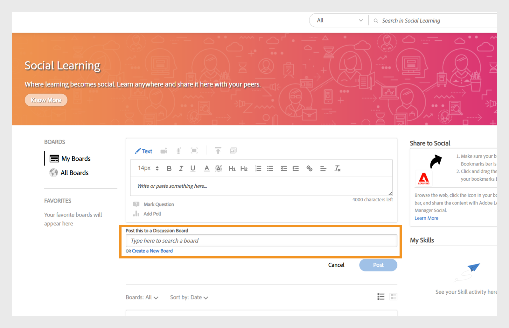
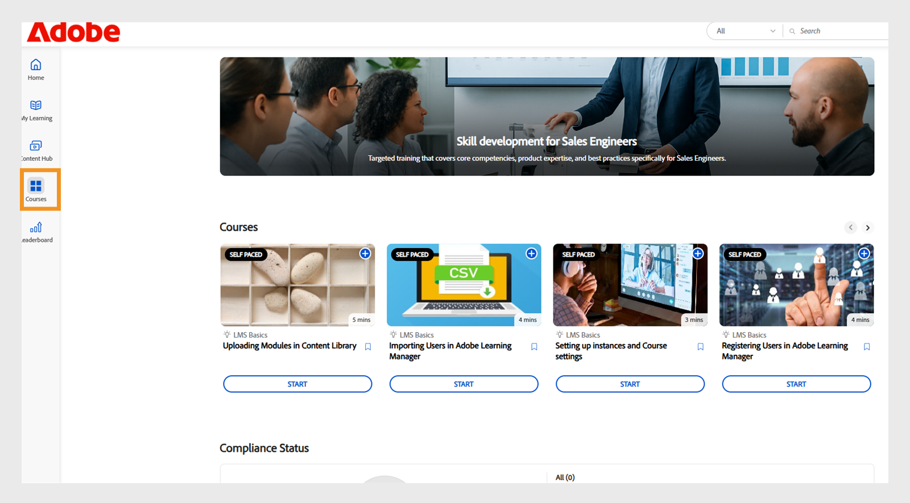

# Neue Funktionen in der Adobe Learning Manager-Version Oktober 2025

>[!IMPORTANT]
>
>Bitte beachten Sie, dass die beschriebenen Funktionen vorläufig und vorbehaltlich Änderungen sind. Ausführlichere Informationen und eine Bestätigung erhalten Sie von Ihrem zuständigen Customer Success Manager. Wenn Probleme auftreten, wenden Sie sich an unser Support-Team unter [learningmanagersupport@adobe.com](mailto:learningmanagersupport@adobe.com).

## Überblick über die Version

Die Version Oktober 2025 von Adobe Learning Manager enthält wichtige Verbesserungen zur Verbesserung der Berichtsgenauigkeit, zur Erweiterung der Integrationsfunktionen und zur Verbesserung des Lernerlebnisses für Administratoren, Autoren und Teilnehmer. Zu den wichtigsten Verbesserungen gehören verbesserte Teilnehmertranskripte, die Abschlüsse mit Kursleiter-Zeichen korrekt erfassen, erweiterte Benutzerberichte mit zusätzlichen Identifizierungsfeldern und Arbeitshilfeberichte mit direkten Download-Links.

Diese Version enthält außerdem bereichsspezifische Ankündigungsberechtigungen für benutzerdefinierte Administratoren, Funktionen für Benutzer-Tags in sozialen Lerntafeln und sprachbasierte Fortschrittsverfolgung, die den Fortschritt der Teilnehmer in verschiedenen Sprachen beibehält. Weitere Funktionen umfassen Go1-Integrationsverbesserungen mit KI-gestützter Erstellung von Wiedergabelisten, verbessertes benutzerdefiniertes Rollenmanagement mit inkrementeller Importunterstützung und verbesserte APIs für eine bessere Quizleistungsverfolgung und Migrationsstatusüberwachung.

## Mit Kursleitern markierte Abschlüsse in Teilnehmertranskripten

**Übersicht**

Inkrementelle Teilnehmertranskripte erfassen jetzt vom Kursleiter markierte Abschlüsse, auch wenn die Anwesenheit nach dem Sitzungsdatum aufgezeichnet wird.
Diese Verbesserung behebt eine kritische Lücke in inkrementellen Teilnehmertranskripten, bei der vom Kursleiter markierte Abschlüsse zuvor verpasst wurden, wenn die Teilnahme nach dem ursprünglichen Sitzungsdatum aufgezeichnet wurde.

Inkrementelle Teilnehmertranskripte sind geplante Berichte, die nur die Änderungen (z. B. Abschlüsse oder Fortschrittsaktualisierungen) erfassen, die innerhalb eines bestimmten Zeitraums auftreten, anstatt einen vollständigen historischen Datenabbild bereitzustellen. Sie werden häufig für die Automatisierung, für Dashboards und Integrationen verwendet, sodass Benutzer aktuelle Lernaktivitäten effizient verfolgen können, ohne jedes Mal den gesamten Transkriptverlauf verarbeiten zu müssen.

**Neue Funktionen**

* **Spalte &quot;Abgeschlossenes Datum markieren (UTC-Zeitzone)&quot;**: Eine neue Zeitstempelspalte, die das genaue Datum und die exakte Uhrzeit erfasst, wenn ein Kursleiter eine Sitzung oder ein Modul als abgeschlossen markiert.
* **Verbesserte Vervollständigungsquellenverfolgung**: Verfolgt den spezifischen Kursleiter und das Modul (z. B. &quot;Klassenzimmer&quot;), in dem Abschlüsse aufgezeichnet wurden.

Diese Änderungen stellen sicher, dass nach dem Sitzungsdatum markierte Abschlüsse in den inkrementellen Teilnehmertranskripten genau widergespiegelt werden.

**Wichtigste Vorteile**

* Alle Abschlüsse werden in inkrementellen Berichten erfasst, unabhängig davon, wann die Anwesenheit markiert wurde.
* Bietet einen klaren Prüfpfad für Compliance und Reporting.
* Unterstützung von Automatisierung und Dashboards für gesetzliche Anforderungen.

**Anwendungsfälle**

* Organisationen mit Klassenzimmersitzungen, bei denen Kursleiter die Anwesenheit Tage nach der tatsächlichen Sitzung vermerken können.
* Automatisierte Systeme oder Dashboards, die inkrementelle Teilnehmertranskripte für Compliance oder Reporting nutzen.

### Teilnehmertranskript mit der neuen Spalte

In diesem [Artikel](/help/migrated/administrators/feature-summary/learner-transcripts.md) erfahren Sie, wie Sie das Teilnehmertranskript herunterladen.

Der heruntergeladene Teilnehmertranskriptbericht enthält die neue Spalte &quot;Abgeschlossenes Datum markieren (UTC-Zeitzone)&quot;.


_Der Teilnehmertranskriptbericht zeigt eine neue Spalte in Gelb an, in der die einzelnen Abschlussdaten für jeden Benutzer hervorgehoben werden._

## Erweiterter Benutzerbericht mit erweiterten Datenfeldern

**Übersicht**

Der Benutzerbericht enthält jetzt zusätzliche Felder zur Verbesserung der Benutzerverfolgung und der Organisationszuordnung.

**Neue Funktionen**

* Spalte &quot;Interne Benutzer-ID&quot;: Bietet eindeutige interne Kennungen für eine reibungslose Benutzerverfolgung über verschiedene Systeme und API-Endpunkte hinweg.
* Spalte &quot;Manager-E-Mail&quot;: Enthält direkte Manager-Kontaktinformationen für die Verfolgung der Organisationshierarchie.

**Wichtigste Vorteile**

* Vereinfachte Benutzeridentifizierung und Vermeidung von Problemen bei der Zuordnung von Benutzern zu mehreren Systemen.
* Unterstützt nachgelagerte Benutzerverwaltungs-Workflows durch Integrationsfunktionen.
* Verbesserte Zuordnung von Organisationen und besseres Verständnis von Berichtsbeziehungen.
* Behält Organisationsgrenzen bei und verhindert eine versehentliche Kommunikation.

### Benutzerbericht mit der neuen Spalte

In diesem [Artikel](/help/migrated/administrators/feature-summary/reports.md#user-activity-dashboards) erfahren Sie, wie Sie den Benutzerbericht herunterladen.

Die heruntergeladene Benutzerberichtsdatei enthält die neuen Spalten Interne Benutzer-ID und Manager-E-Mail.


_Benutzerberichte, die interne Benutzer-IDs und Manager-E-Mail-Adressen hervorheben, um die Benutzerverwaltung zu optimieren_

## FTP-Benutzerbericht mit Unterstützung für interne Benutzer-ID

**Übersicht**

Der FTP-basierte Benutzerbericht enthält jetzt Unterstützung für die interne Benutzer-ID und bietet einen einheitlichen Ansatz für den Datenexport und die Integration für Headless-Implementierungen.

**Neue Funktionen**

* Benutzerberichte sind jetzt über [benutzerdefiniertes FTP](/help/migrated/integration-admin/feature-summary/connectors.md#custom-ftp) neben vorhandenen Berichten (Gamification-Transkripte, Teilnehmertranskripte, Schulungsbericht) verfügbar.
* Die Spalte &quot;Interne Benutzer-ID&quot; ist jetzt für alle Exportmethoden (FTP, Jobs-API und Benutzeroberfläche) konsistent.

**Wichtigste Vorteile**

* Vereinfachtes Daten-Management mit einer einzigen Quelle für alle erforderlichen Berichte.
* Bessere Datenkonsistenz durch Gewährleistung einer einheitlichen Benutzeridentifizierung über Berichtszeiträume hinweg.
* Unterstützung automatisierter Workflows durch die Bereitstellung von Massenvorgängen und Analyse-Workflows mit konsistenten Identifikatoren.
Der Benutzerbericht, der aus dem FTP-Ordner heruntergeladen wurde, enthält die neue Spalte Interne Benutzer-ID .

## Ausgesetzte Benutzer in Teilnehmertranskripte einschließen

**Übersicht**

Unternehmen können jetzt suspendierte Benutzer (mit deaktivierten externen Profilen) in die Teilnehmertranskripte einbeziehen, um eine umfassende Aufbewahrung von historischen Lerndaten zu gewährleisten.

**Neue Funktionen**

* Konfigurierbare Sichtbarkeit unterbrochener Benutzer mit einem Flag auf Kontoebene, um unterbrochene Benutzer in die Teilnehmertranskripte aufzunehmen.
* Historische Datenaufbewahrung auch nach Deaktivierung unterbrochener externer Profile.

**Implementierungsanforderungen**

* Wenden Sie sich an Ihren Customer Success Manager (CSM), um das Flag auf Kontoebene zu aktivieren.

>[!NOTE]
>
>Dieses Flag ist standardmäßig für vorhandene Konten deaktiviert und muss explizit für neue Konten angefordert werden.

## Berechtigungen für Ankündigungsbereiche für benutzerdefinierte Administratoren

**Übersicht**

Benutzerdefinierte Administratoren können jetzt Ankündigungen erstellen, jedoch nur für ihre zugewiesenen Benutzergruppen oder Kataloge. Dadurch wird eine unbeabsichtigte Kommunikation über Organisationsgrenzen hinweg verhindert.

**Neue Funktionen**

* Benutzerdefinierte Administratoren können Ankündigungen nur für Benutzer innerhalb ihres zugewiesenen Bereichs erstellen.
* Ankündigungen können auf bestimmte Benutzergruppen oder Kataloge beschränkt werden.
* Vollständige Administratoren behalten die Sichtbarkeit und Kontrolle über alle Ankündigungen, einschließlich der von benutzerdefinierten Administratoren mit Umfang erstellten Ankündigungen.

**Wichtigste Vorteile**

* Zielgerichtete Kommunikation, die sicherstellt, dass Ankündigungen nur die relevanten Zielgruppen erreichen.
* Verringerte Informationsüberlastung, indem verhindert wurde, dass irrelevante Benachrichtigungen unbeabsichtigte Benutzer erreichen.
* Behält Organisationsgrenzen bei und verhindert eine versehentliche Kommunikation.

**Wichtige Überlegungen**

* Wenn sich der Umfang eines benutzerdefinierten Administrators ändert, wird für die betroffenen Ankündigungen ein Warnsymbol angezeigt und es müssen einzelne Bereichsvorgaben zurückgesetzt werden.
* Jede Ankündigung muss einzeln aktualisiert werden, wenn sich der Umfang ändert.
* Der Bericht &quot;Benachrichtigungsankündigung&quot; zeigt nur Teilnehmer im zugewiesenen Bereich des benutzerdefinierten Administrators an.

**Anwendungsfälle**

* Franchiseorganisationen, bei denen regionale Manager nur mit ihren Franchisenehmern kommunizieren müssen.
* Große Organisationen mit Regional- oder Abteilungsadministratoren, die Ankündigungen an ihre Teams senden.

### Ankündigung für den zugewiesenen Bereich erstellen

Ein benutzerdefinierter Administrator kann Ankündigungen erstellen, die auf die zugewiesenen Benutzergruppen und Kataloge beschränkt sind, um sicherzustellen, dass Nachrichten die richtige Zielgruppe erreichen, und um unnötige Benachrichtigungen zu vermeiden.

So erstellen Sie eine Ankündigung für den zugewiesenen Bereich:

1. Melden Sie sich bei Adobe Learning Manager als Administrator an.
2. Wählen Sie im linken Navigationsbereich **[!UICONTROL Ankündigung]** aus.
3. Wählen Sie **[!UICONTROL Hinzufügen]** aus.

   
   _Seite &quot;Ankündigungen&quot; in Adobe Learning Manager, auf der Administratoren Ankündigungen für Zielbenutzergruppen erstellen und verwalten können_

4. Wählen Sie im Dropdown-Menü den **[!UICONTROL Ankündigungstyp]** aus.
a. **[!UICONTROL Als Benachrichtigung]**
b. **[!UICONTROL Als Mastertitel]**
c. **[!UICONTROL Als Empfehlung]**
d. **[!UICONTROL Als E-Mail]**
5. Wählen Sie **[!UICONTROL Als Mastertitel]** aus.
6. Wählen Sie die Sprache aus und laden Sie ein Bild für den Mastertitel hoch.
7. Optional können Sie eine URL für die Aktionsschaltfläche hinzufügen.

   
   _Bildschirm &quot;Ankündigung erstellen&quot;, mit dem Administratoren den Ankündigungstyp festlegen, Anhänge hochladen und Aktionsschaltflächen hinzufügen können_

   Der zugewiesene Bereich ist im Abschnitt **[!UICONTROL Bereich]** vorausgewählt und kann von Administratoren nicht geändert werden.

   >[!NOTE]
   >
   >**[!UICONTROL Für Benachrichtigungen]** und **[!UICONTROL E-Mail]**-Ankündigungen können sie zusätzliche Benutzergruppen und Kataloge enthalten, wenn diese sich mit ihrem zugewiesenen Bereich überschneiden.

8. Wählen Sie **[!UICONTROL Speichern]**.

Nur Teilnehmer im Bereich des benutzerdefinierten Administrators können die Ankündigung anzeigen. In diesem [Artikel](/help/migrated/administrators/feature-summary/announcements.md) erfahren Sie, wie Sie mehrere Arten von Ankündigungen erstellen.

### Setzen Sie den Bereich durch benutzerdefinierte Administratoren zurück.

Benutzerdefinierte Administratoren können den Bereich ihrer veröffentlichten Ankündigungen zurücksetzen, wenn ein Administrator den Bereich geändert hat. Sobald der Umfang zurückgesetzt wurde, wird der aktualisierte Umfang auf die Ankündigung angewendet und nur Teilnehmer innerhalb des neuen Bereichs können die Ankündigung sehen.

Zurücksetzen des Gültigkeitsbereichs:

1. Melden Sie sich bei Adobe Learning Manager als benutzerdefinierter Administrator an.
2. Wählen Sie im linken Navigationsbereich **[!UICONTROL Ankündigung]** aus.
3. Wählen Sie die Registerkarte **[!UICONTROL Veröffentlicht]** aus.
4. Wählen Sie eine beliebige Ankündigung und dann das Einstellungssymbol aus.
5. Wählen Sie **[!UICONTROL Bearbeiten]**.

   
   _Ankündigungsbildschirm mit den veröffentlichten Ankündigungen mit Bearbeitungs-, Veröffentlichungs- und anderen Optionen_

6. Wählen Sie **Zurücksetzen**.

   
   _Ankündigung mit einer Benachrichtigung zur Bereichsänderung, wobei benutzerdefinierte Administratoren die Möglichkeit haben, die Bereichsauswahl zurückzusetzen und zu aktualisieren, um neue Zugriffsberechtigungen anzuzeigen_

Der Umfang wird aktualisiert und nur Benutzer innerhalb des aktualisierten Bereichs können die Ankündigung anzeigen.

### Ankündigung über die Administrator-Benutzeroberfläche bearbeiten

Administratoren können Ankündigungen anzeigen, die von benutzerdefinierten Administratoren über ihre Oberfläche erstellt wurden. Sie können diese Ankündigungen nur bearbeiten, indem sie den zugewiesenen Bereich ändern oder entfernen. Wenn keine Bereichsänderungen vorgenommen werden, können Administratoren keine weiteren Änderungen an der Ankündigung vornehmen.

So bearbeiten Sie die Ankündigung über die Administrator-Benutzeroberfläche:

1. Melden Sie sich bei Adobe Learning Manager als Administrator an.
2. Wählen Sie im linken Navigationsbereich **[!UICONTROL Ankündigung]** aus.
3. Wählen Sie die Registerkarte **[!UICONTROL Veröffentlicht]** aus.
4. Wählen Sie eine beliebige Ankündigung und dann das Einstellungssymbol aus.
5. Wählen Sie **[!UICONTROL Bearbeiten]**.

   
   _Ankündigungsbildschirm mit den veröffentlichten Ankündigungen mit Bearbeitungs-, Veröffentlichungs- und anderen Optionen_

6. Wählen Sie **[!UICONTROL Entfernen]** aus.

   
   _Ankündigungsbildschirm, der angibt, dass der Bereich entfernt werden muss, damit Administratoren Ankündigungen bearbeiten können, die für Benutzergruppen mit Umfang erstellt wurden_

Der Administrator kann die Ankündigung bearbeiten, nachdem er den Bereich entfernt hat.

## Benutzer in sozialen Boards taggen

**Übersicht**

Soziale Lerntafeln unterstützen jetzt Benutzer-Tagging-Funktionen, die zielgerichtetere Diskussionen und eine verbesserte Zusammenarbeit innerhalb von Lern-Communities ermöglichen. Teilnehmer können in Social-Learning-Beiträgen und Kommentaren über die Teilnehmer-App, APIs und die Adobe Learning Manager-Referenzseite mit Tags versehen werden.

**Neue Funktionen**

* **@username Tagging**: Benutzer können andere Board-Mitglieder mithilfe des Formats &quot;@username&quot; mit Tags versehen.
* **Bereichsbeschränktes Tagging**: Nur Benutzer mit Zugriff auf das jeweilige Board können markiert werden, um Datenschutz und Relevanz zu gewährleisten.
* **Multi-Channel-Benachrichtigungen**: Benutzer mit Tags erhalten sowohl In-App- als auch E-Mail-Benachrichtigungen mit direkten Links zu relevanten Beiträgen oder Kommentaren.

**Wichtigste Funktionen**

* Benutzer außerhalb des Bereichs des Boards können nicht mit Tags versehen werden, um unerwünschte Benachrichtigungen zu verhindern.
* Wenn ein mit Tags versehener Benutzer aus dem System gelöscht wird, wird er als &quot;anonym&quot; erwähnt.
* Das Markieren von Benutzergruppen oder &quot;@all&quot; ist nicht zulässig, um Benachrichtigungs-Spam zu verhindern.

**Anwendungsfälle**

* Fachkräfte im Gesundheitswesen, die Anregungen von bestimmten Kollegen zu medizinischen Fällen benötigen.
* Fachexperten werden zu speziellen Themen konsultiert.
* Teamdiskussionen, die Beiträge bestimmter Interessengruppen erfordern.
* Wissensaustauschsitzungen unter gezielter Beteiligung von Experten.

### Benutzer in Social-Board-Beiträgen taggen

Teilnehmer können jetzt bestimmte Board-Mitglieder in Beiträgen oder Kommentaren mit @username taggen. Das Markieren ist auf Mitglieder mit Zugriff auf dieses Board beschränkt.

So markieren Sie Benutzer in einem sozialen Board:

1. Melden Sie sich bei Adobe Learning Manager als Teilnehmer an.
2. Wählen Sie im linken Navigationsbereich **[!UICONTROL Soziales Lernen]** aus.

   
   _Aktivieren Sie kooperatives Lernen, indem Sie &quot;Soziales Lernen&quot; auswählen, um auf Diskussionsforen zuzugreifen, Erkenntnisse zu teilen und Benutzer für interaktives Engagement zu taggen_

3. Wählen Sie **[!UICONTROL Neuer Beitrag]**.

   
   _Starten Sie eine neue Diskussion, indem Sie &quot;Neuer Beitrag in Soziales Lernen&quot; auswählen, um Wissen mit den getaggten Benutzern zu teilen_

4. Bevor Sie Benutzer mit Tags versehen, wählen Sie das Board aus der Option **[!UICONTROL In einem Diskussions-Board veröffentlichen]** aus.

   
   _Wählen Sie ein Diskussions-Dashboard aus, um Benutzer zu posten und zu taggen, und aktivieren Sie so gezielte gemeinsame Unterhaltungen im Sozialen Lernen_

5. Geben Sie Ihre Beitragsdetails ein und markieren Sie dann einen Benutzer, indem Sie das @-Symbol gefolgt vom Namen eingeben (z. B. @andrew). Wenn Sie @ gefolgt von den ersten drei Buchstaben des Benutzernamens eingeben, wird eine Liste der entsprechenden Benutzer angezeigt.

   
   _Markieren Sie Benutzer in Ihrem Diskussionsbeitrag, indem Sie @ gefolgt vom Benutzernamen eingeben, um eine zielgerichtete Zusammenarbeit in den Boards für soziales Lernen zu ermöglichen_

6. Wählen Sie den gewünschten Benutzer aus der Liste aus.
7. Wählen Sie **[!UICONTROL Post]** aus.

Die getaggten Benutzer erhalten sowohl In-App- als auch E-Mail-Benachrichtigungen mit einem direkten Link zum Beitrag, wodurch die Diskussionen zielgerichteter und kooperativer werden.

### Benutzer entsprechend dem Umfang des Boards mit Tags versehen

Das bereichsbeschränkte Tagging ermöglicht es Benutzern, nur die Teilnehmer mit Tags zu versehen, die die Berechtigung haben, auf ein bestimmtes Board zuzugreifen. Dies trägt dazu bei, den Datenschutz zu wahren, indem verhindert wird, dass Benutzer außerhalb des Anwendungsbereichs getaggt werden.

Wenn Sie versuchen, Teilnehmern, die sich außerhalb des Bereichs des Boards befinden, Tags zuzuweisen, werden keine Vorschläge angezeigt und Sie können sie nicht mit Tags versehen. Weitere Informationen zum Umfang für soziales Lernen finden Sie in diesem [Artikel](/help/migrated/administrators/feature-summary/social-learning-configurations-as-an-admin.md).

## Gelöschte Benutzer in Kommentaren mit Tags versehen

Wenn ein gelöschter Benutzer in einem Social-Learning-Beitrag mit Tags versehen ist, wird sein Name in dem Beitrag als Anonym angezeigt. Der Kommentar und das Tag bleiben für den Kontext sichtbar, aber der Profillink oder die Details werden nicht angezeigt.


_Social-Learning-Beitrag, in dem hervorgehoben wird, wie ein gelöschter Benutzer als anonym angezeigt wird, wenn er mit Tags versehen wird_

## Bericht zu Arbeitshilfen mit direkten Zugriffsverknüpfungen

**Übersicht**

Der Bericht zu Arbeitshilfen wurde verbessert und enthält jetzt direkte Download-Links zu Arbeitshilfen, wodurch das Content Management und Audit-Prozesse für Administratoren und Autoren optimiert werden.

**Neue Funktionen**

* Spalte &quot;Arbeitshilfeverknüpfung&quot;: Direkter Zugriff auf Arbeitshilfedateien und externe URLs innerhalb des Berichts.
* Rollenbasierte Zugriffskontrolle: Die Zugänglichkeit von Links hängt von Benutzerrollen und Katalogberechtigungen ab.
* Gelöschte Arbeitshilfen bleiben verfügbar, wenn sie noch mit aktiven Kursen verknüpft sind.

**Wichtigste Vorteile**

* Direktes Herunterladen von Dateien und URL-Zugriff vom Bericht aus.
* Keine manuelle Suche und kein Download von Arbeitshilfen für Compliance- oder Barrierefreiheitsprüfungen mehr erforderlich.

**Anwendungsfälle**

* Autoren oder Administratoren führen regelmäßige Überprüfungen der Barrierefreiheit bei Arbeitshilfen durch, wie sie von großen Organisationen verlangt werden.
* Szenarien, in denen ein schneller, rollenbasierter Zugriff auf Arbeitshilfedateien für die Überprüfung oder Einhaltung von Vorschriften erforderlich ist.

### Bericht zu Arbeitshilfen mit der neuen Spalte

In diesem [Artikel](/help/migrated/administrators/feature-summary/reports.md#job-aids-report) erfahren Sie, wie Sie den Bericht zu Arbeitshilfen herunterladen.

Der Bericht zu Arbeitshilfen kann im Bereich &quot;Berichte&quot; heruntergeladen werden und enthält jetzt direkte Download-Links für jede Arbeitshilfe.


_Der Bericht zu Arbeitshilfen zeigt direkte Download-Links an, wodurch der Zugriff auf und das Herunterladen von Arbeitshilfen in Adobe Learning Manager erleichtert wird_

## API-Updates

### Verbesserungen an der Teilnehmer-API für die Quizleistungsverfolgung

**Übersicht**

Die `GET /loResourceGrades`-API wurde verbessert, um detaillierte Quizleistungsdaten bereitzustellen, die eine ausgefeiltere Analyse und eine automatisierte Entscheidungsfindung ermöglichen.

**Neue Funktionen**

Die API-Antwort enthält jetzt zwei zusätzliche Felder:

* **[!UICONTROL höchste Punktzahl]**: Die beste Punktzahl, die ein Teilnehmer bei allen Quizversuchen erzielt hat
* **[!UICONTROL maxScore]**: Die gesamte mögliche Punktzahl für das Quiz

**Beispiel für API-Antwort**

```
{
    "links": {
        "self": "https://learningmanagerstage1.adobe.com/primeapi/v2/loResourceGrades/course:15067_30122_41715_1_3400468"
    },
    "data": {
        "id": "course:15067_30122_41715_1_3400468",
        "type": "learningObjectResourceGrade",
        "attributes": {
            "completed": false,
            "duration": 0,
            "hasPassed": false,
            "highestScore": 0,
            "maxScore": 0,. 
            "progressPercent": 0,
            "score": 0
        },
        "relationships": {
            "loResource": {
                "data": {
                    "id": "course:15067_30122_41715_1",
                    "type": "learningObjectResource"
                }
            }
        }
    }
}
```

Als Antwort ist **Kurs:15067_30122_41715_1_3400468** die ID der Lernobjektressourcenklasse, für die die Informationen angefordert werden. Die `learningObjectResourceGrad`e-ID kann von der `GET /enrollments/{id}`-API abgerufen werden.

**Wichtigste Vorteile**

* Ermöglicht eine detaillierte Quizleistungsanalyse für die Messung der Lernaktivität.
* Unterstützt Progressionsregeln, die auf der höchsten Leistung und nicht auf den neuesten Versuchen basieren.
* Bietet ein vollständiges Bild der Quizleistung der Teilnehmer im Laufe der Zeit.

**Funktionsweise der API**

1. Ein Benutzer versucht ein Quiz mehrmals; jeder Versuch wird aufgezeichnet.
2. Die API bietet sowohl die höchste erreichte Punktzahl als auch die höchstmögliche Punktzahl für das Quiz.
3. Externe Systeme können diese Daten verwenden, um automatisierte Aktionen auszulösen, z. B. die Registrierung von Benutzern für neue Kurse basierend auf ihrer besten Leistung.

**Anwendungsfälle**

* Headless-Lernsysteme erfordern automatisierte Anmeldungsentscheidungen.
* Lernanalyseplattformen zur Verfolgung von Lernerfolgsmustern.
* Compliance-Systeme mit Performance-basierten Progressionsanforderungen.

### Verbesserungen der Migrations-API

**Übersicht**
Adobe Learning Manager unterstützt jetzt die Migration verschiedener Datenobjekte in ein Konto über den Migrationsvorgang. Dieser Prozess kann sowohl über APIs als auch über die Benutzeroberfläche initiiert werden. Wenn eine Migration fehlschlägt, können Fehler über die Oberfläche heruntergeladen werden. Diese Fehler sind nützlich beim Debuggen von Migrationsfehlern und beim Verwalten der Migrationsläufe.

Mit dieser Version stehen die Fehlerprotokolle auch über die APIs zum Download zur Verfügung, um eine effiziente, programmgesteuerte Fehlerverfolgung und Fehlersuche zu ermöglichen.

**API-Änderungen**

Es gibt eine neue Migrations-API, &quot;`runStatus`&quot;, mit der Integrationsadministratoren den Status von Migrationsläufen überprüfen können, die über die API ausgelöst wurden. Dies ist in früheren Versionen von Adobe Learning Manager nicht möglich.

Darüber hinaus stellt die `runStatus`-API jetzt einen direkten Link zum Herunterladen von Fehlerprotokollen (CSV) für abgeschlossene Ausführungen bereit. Beachten Sie, dass der Link nur sieben Tage lang gültig ist und die Protokolle einen Monat lang aufbewahrt werden.

Die Antwort der `startRun`-API wurde aktualisiert und enthält nun die ID des Migrationsprojekts, die Sprint-ID und die Sprint-Lauf-ID, die zum Abfragen des neuen Statusendpunkts erforderlich sind.

#### runStatus-API

**Beschreibung**

Ruft den Status eines vorhandenen Migrationslaufs ab.

**Endpunkt**

```
GET /bulkimport/runStatus
```

**Parameter**

* **migrationProjectId**: (Erforderlich). Ein eindeutiger Bezeichner für ein Migrationsprojekt. Ein Migrationsprojekt wird verwendet, um Daten und Inhalte aus einem vorhandenen LMS (Learning Management System) in Adobe Learning Manager zu übertragen. Jedes Migrationsprojekt kann aus mehreren Sprints bestehen, die kleinere Einheiten von Migrationsaufgaben sind.

* **sprintId**: (Erforderlich). Ein eindeutiger Bezeichner für einen Sprint innerhalb eines Migrationsprojekts. Ein Sprint ist eine Teilmenge von Migrationsaufgaben, die bestimmte Lernobjekte (z. B. Kurse, Module, Teilnehmerdatensätze) umfasst, die von einem bestehenden LMS zu Adobe Learning Manager migriert werden sollen. Jeder Sprint kann unabhängig ausgeführt werden, was eine phasengesteuerte Migration ermöglicht.

* **sprintRunId**: (Erforderlich). Eine eindeutige Kennung, die zum Verfolgen der Ausführung eines bestimmten Sprints innerhalb eines Migrationsprojekts verwendet wird. Es ist mit dem eigentlichen Migrationsvorgang für die in einem Sprint definierten Elemente verknüpft. Die sprintRunId hilft bei der Überwachung, Fehlerbehebung und Verwaltung des Migrationsauftrags.

**Antwort**

```
{
  "sprintId": 2510080,
  "sprintRunId": 2740845,
  "migrationProjectId": 2509173,
  "startTime": 1746524711052,
  "endTime": 1746524711052,
  [
    {
      "id": 2609923,
      "lastHeartbeatTime": 1746524711052,
      "objectName": "content",
      "jobState": "COMPLETED",
      "errorCsvLink": "",
      "errorLogLink": "migration/5830/2509173/2510080/2740845/content_err.csv",
      "sequenceNumber": 1
    },
    {
      "id": 2609922,
      "lastHeartbeatTime": 1746524713577,
      "objectName": "course",
      "jobState": "WAITING_IN_QUEUE",
      "errorCsvLink": "",
      "errorLogLink": null,
      "sequenceNumber": 2
    }
  ]
}
```

#### startRun-API

Die `startRun`-API-Antwort wurde aktualisiert und enthält drei zusätzliche Felder: migrationProjectId, sprintId und sprintRunId. Mithilfe dieser Felder können Benutzer den Status bestimmter Migrationsausführungen mithilfe der neuen runStatus-API verfolgen und abfragen.

```
curl -X GET --header 'Accept: text/html' 'https://learningmanager.adobe.com/primeapi/v2/bulkimport/runStatus?migrationProjectId=001&sprintId=10001&sprintRunId=7'
```

Erstellt die folgende Antwort. Die Antwort enthält:

* migrationId
* sprintId
* sprintRunId

**Antwort**

```
{
  "status": "OK",
  "title": "BULKIMPORT_RUN_INITIATED_SUCCESSFULLY",
  "source": {
    "info": "Success",
    "migrationInfo": {
      "migrationProjectId": "001",
      "sprintId": "10001",
      "sprintRunId": "7"
    }
  }
}
```

### Änderungen an der Social-API (Benutzer-Tag, Kommentare und Antworten)

**Übersicht**

Adobe Learning Manager unterstützt jetzt @user Tagging-Funktionen in Boards für soziales Lernen, die es Teilnehmern ermöglichen, Peers in Beiträgen, Kommentaren und Antworten zu erwähnen und zu benachrichtigen. Diese Funktion verbessert die Zusammenarbeit und die Suche nach Inhalten auf der gesamten Plattform.

Diese Version enthält neue API-Funktionen zur Unterstützung von Benutzererwägungen, einschließlich verbesserter POST- und GET-Endpunkte, sowie eine neue Suchfunktion für Benutzer mit Tags.

**Übersicht über API-Änderungen**

* Aktualisierte POST-APIs zum Erstellen von Beiträgen/Kommentaren/Antworten mit Benutzererwägungen
* Aktualisierte GET-APIs mit Benutzererwähnungsdaten in Antworten

**Format der Benutzererwägungen**

Ein Benutzer wird im folgenden Format erwähnt: @(Benutzer:userId)

#### Beitrag mit Erwähnungen erstellen

**Endpunkt**

```
POST /primeapi/v2/posts
```

**Beschreibung**

Erstellen Sie einen neuen Social-Learning-Beitrag mit Benutzererwägungen.

**Anforderungstext**

```
{
  "data": {
    "type": "post",
    "attributes": {
      "boardId": 13282,
      "accountId": 11152,
      "text": "<p>This is a new post mentioning @[user:11257229]</p>",
      "createdByUserId": 11257228,
      "postType": "discussion"
    },
    "id": null
  }
}
```

**Antwort**

Standardantwort nach der Erstellung mit Erwähnungsdaten in der Beziehung _userMentions_.

#### Kommentar mit Erwähnungen erstellen

**Endpunkt**

```
POST /primeapi/v2/comments
```

**Beschreibung**

Fügen Sie einem Beitrag einen Kommentar mit Benutzererwägungen hinzu.

**Anforderungstext**

```
{
  "data": {
    "type": "comment",
    "attributes": {
      "postId": 20746,
      "accountId": 11152,
      "text": "<p>Test Comment @[user:11257229]</p>",
      "createdByUserId": 11257228,
      "commentLevel": 0
    },
    "id": null
  }
}
```

#### Antwort mit Erwähnungen erstellen

**Endpunkt**

```
POST /primeapi/v2/replies
```

**Beschreibung**

Antworten Sie auf einen Kommentar mit Benutzererwägungen.

**Anforderungstext**

```
{
  "data": {
    "type": "reply",
    "attributes": {
      "postId": 20746,
      "accountId": 11152,
      "text": "<p>Thanks for the update @[user:11257229]</p>",
      "createdByUserId": 11257228,
      "commentLevel": 1,
      "parentCommentId": 55621
    },
    "id": null
  }
}
```

#### Beiträge mit Erwähnungen abrufen

**Endpunkt**

```
GET /primeapi/v2/posts/{id}
```

**Beschreibung**

Rufen Sie Beitragsdetails ab, einschließlich der genannten Benutzer.

**Antwort**

```
{
  "links": {
    "self": "https://learningmanager.adobe.com/primeapi/v2/posts/7522"
  },
  "data": {
    "id": "7522",
    "type": "post",
    "attributes": {
      "commentCount": 3,
      "dateCreated": "2025-06-10T11:33:29.000Z",
      "dateUpdated": "2025-06-25T14:52:04.000Z",
      "downVote": 0,
      "postingType": "DEFAULT",
      "richText": "<p>my updated fourth post @[user:14707776] second mention my first post</p>",
      "state": "ACTIVE",
      "text": "my updated fourth post @[user:14707776] second mention my first post",
      "upVote": 0,
      "viewsCount": 0
    },
    "relationships": {
      "createdBy": {
        "data": {
          "id": "14707776",
          "type": "user"
        }
      },
      "parent": {
        "data": {
          "id": "3971",
          "type": "board"
        }
      },
      "userMentions": {
        "data": [
          {
            "id": "14707776",
            "type": "user"
          }
        ]
      }
    }
  },
  "included": [
    {
      "id": "14707776",
      "type": "user",
      "attributes": {
        "avatarUrl": "https://cpcontents.adobe.com/public/images/default_user_avatar.svg",
        "binUserId": "45664b87-75a3-43ec-b0b7-5064958eac6f",
        "email": "user@example.com",
        "enrollOnClick": false,
        "fields": {
          "Location": "BLR"
        },
        "gamificationEnabled": true,
        "lastLoginDate": "2025-06-27T11:21:17.000Z",
        "name": "John Doe",
        "pointsEarned": 1690,
        "pointsRedeemed": 0,
        "preferredResolution": "AUTO",
        "profile": "admin",
        "roles": [
          "Learner",
          "Admin",
          "Author",
          "Instructor",
          "Integration Admin",
          "Manager"
        ],
        "state": "ACTIVE",
        "userType": "Internal"
      },
      "relationships": {
        "account": {
          "data": {
            "id": "9238",
            "type": "account"
          }
        }
      }
    }
  ]
}
```

### Änderungen an der Social-API (Benutzersuche)

**Endpunkt**

```
GET /primeapi/v2/users/search?q={searchTerm}&context=tagging
```

**Beschreibung**

Suche nach Benutzern, die für Tagging verfügbar sind, basierend auf den Einstellungen des sozialen Bereichs.

**Anforderungsparameter**


* q (erforderlich): Suchbegriff (mindestens 3 Zeichen).
* context: Setzen Sie die Option auf &quot;Tagging&quot;, damit Benutzer für Erwähnungen berechtigt sind.
* boardId (optional): Board-ID, um Benutzer basierend auf Zugriffsberechtigungen zu filtern.

**Antwort**

```
{
  "data": [
    {
      "id": "11257229",
      "type": "user",
      "attributes": {
        "name": "Jane Smith",
        "email": "jane.smith@example.com",
        "avatarUrl": "https://cpcontents.adobe.com/public/images/default_user_avatar.svg",
        "userType": "Internal",
        "state": "ACTIVE"
      }
    }
  ]
}
```

### Implementierungsrichtlinien

#### Zeichenbeschränkungen

* Beiträge: Es gilt eine Begrenzung auf 4000 Zeichen, wobei jeder getaggte Benutzer die verfügbaren Zeichen um einen festen Betrag reduziert.
* Kommentare: Maximal 1000 Zeichen.

#### Erwähnungsvalidierung

* Benutzer können nur mit Benutzernamen oder E-Mail-Adressen (nicht mit UUID) markiert werden.
* Interne Benutzer können keine externen Benutzer mit Tags versehen und umgekehrt.
* Die Verfügbarkeit von Tags folgt den vorhandenen Einstellungen für den sozialen Bereich.
* Board-Berechtigungen bestimmen die Berechtigung für Tags (öffentlich/privat).

#### Benachrichtigungen

* Mehrere Erwähnungen desselben Benutzers in einem Beitrag führen zu einer einzigen Benachrichtigung.
* Der ursprüngliche Eigentümer des Beitrags erhält Benachrichtigungen nur, wenn er explizit markiert wurde.

#### Fehlerbehandlung

* Ungültige Benutzer-IDs in Erwähnungen geben Validierungsfehler zurück.
* Die DSGVO und weich gelöschte Benutzer erscheinen in markierten Inhalten anonym.

### Sprachbasierter Teilnehmerfortschritt

Derzeit wird der Teilnehmerfortschritt nur für die ausgewählte Gebietsschemasprache verfolgt, was beim Wechseln der Sprachen/Gebietsschemas im Player zu erheblichen Fortschrittsverlusten führt. Diese Einschränkung führt zu einer schlechten Benutzererfahrung, wenn Teilnehmer ihren Lernfortschritt verlieren, wenn sie Inhalte in verschiedenen Sprachen durchsuchen.

**Aktuelle Probleme**

* **Überschreibung des Fortschritts**: Der Fortschritt für jedes Modul im Player wird sowohl auf der Benutzer- als auch auf der Modulebene verfolgt. Dies führt zu einer Situation, in der der Fortschritt eines Benutzers überschrieben wird, wenn er zu einem zuvor verwendeten Gebietsschema für dasselbe Modul zurückkehrt.
* **Zurücksetzen des Fortschritts**: Wenn ein Teilnehmer beispielsweise einen Fortschritt von 75 % in Gebietsschema A (Englisch) erzielt und dann nach der Rückkehr zu Gebietsschema A zu Gebietsschema B (Spanisch) wechselt, wird sein Fortschritt auf 0 % zurückgesetzt, anstatt von 75 % wieder aufgenommen zu werden.

Um diese Einschränkungen zu beheben, wurde die API verbessert und unterstützt jetzt die gebietsschemaspezifische Fortschrittsverfolgung:

* **Gebietsschemaspezifischer Speicher**: Wenn ein Teilnehmer im Player das Gebietsschema wechselt (z. B. von Gebietsschema A zu Gebietsschema B), speichert das System den Fortschrittsstatus jetzt separat für jedes Gebietsschema des Inhalts.
* **Fortsetzen des Fortschritts**: Wenn der Benutzer wieder zu einem zuvor verwendeten Gebietsschema wechselt (von Gebietsschema B zurück zu Gebietsschema A), wird der Inhalt an der Stelle fortgesetzt, an der er an diesem bestimmten Gebietsschema aufgehört hat.
* **Unabhängige Fortschrittsverfolgung**: Jedes Gebietsschema behält seinen eigenen Fortschrittsstatus bei, sodass Teilnehmer Inhalte in mehreren Sprachen erkunden können, ohne ihren individuellen Fortschritt in jeder Sprache zu verlieren.

#### API-Änderungen

Die folgenden APIs wurden verbessert, um den neuen Gebietsschemaparameter zu unterstützen:

* GET Player-Status-API
* POST Player-Status-API

#### GET Player-Status-API

**Endpunkt**

```
GET /primeapi/v2/users/{userId}/playerState
```

**Beschreibung**

Ruft den aktuellen Status eines Lernobjekts für einen bestimmten Benutzer und ein bestimmtes Gebietsschema ab.

**Parameter**

| Parameter | Typ | Standort | Erforderlich | Beschreibung |
|---|---|---|---|---|
| userId | Zeichenfolge | Pfad | Ja | Eindeutiger Bezeichner des Benutzers |
| loID | Zeichenfolge | Abfrage | Ja | Lernobjekt-ID im folgenden Format: {id} |
| loResourceId | Zeichenfolge | Abfrage | Ja | Ressourcenbezeichner für Lernobjekte im Formatkurs: {loId_loInstanceId_moduleId_moduleVersion} |
| csrf_token | Zeichenfolge | Abfrage | Ja | CSRF-Schutztoken |
| Gebietsschema | Zeichenfolge | Abfrage | Optional | Gebietsschemabezeichner für sprachspezifischen Fortschritt (z. B. &quot;en-US&quot;, &quot;es-ES&quot;) |

**Beispielanforderung**

```
GET /primeapi/v2/users/12345/playerState?loId=lo:67890&loResourceId=course:67890_1_mod123_v2&csrf_token=abc123&locale=en-US
```

**Antwortverhalten**

* Wenn der Locale-Parameter angegeben wird und ein gebietsschemaspezifischer Status vorhanden ist, gibt die API den Fortschritt für dieses Gebietsschema zurück.
* Wenn der Locale-Parameter angegeben wird, aber kein gebietsschemaspezifischer Status vorhanden ist, führt die API eine Fallback-Suche nach dem Standardstatus durch.
* Wenn der Locale-Parameter nicht angegeben wird, gibt die API den Standardstatus zurück (unter Beibehaltung der Abwärtskompatibilität).
* Bei Headless-Anforderungen, bei denen das Gebietsschema null ist, wird die API auf die Standardstatussuche zurückgesetzt.

#### POST Player-Status-API

**Endpunkt**

POST /primeapi/v2/users/{userId}/playerState

**Beschreibung**

Aktualisiert oder erstellt den aktuellen Status eines Lernobjekts für einen bestimmten Benutzer und ein bestimmtes Gebietsschema.

**Parameter**

| Parameter | Typ | Standort | Erforderlich | Beschreibung |
|---|---|---|---|---|
| userId | Zeichenfolge | Pfad | Ja | Eindeutiger Bezeichner des Benutzers |
| loID | Zeichenfolge | Abfrage | Ja | Lernobjekt-ID im folgenden Format: {id} |
| loResourceId | Zeichenfolge | Abfrage | Ja | Ressourcenbezeichner für Lernobjekte im Formatkurs: {loId_loInstanceId_moduleId_moduleVersion} |
| csrf_token | Zeichenfolge | Abfrage | Ja | CSRF-Schutztoken |
| Gebietsschema | Zeichenfolge | Abfrage | Optional | Gebietsschemabezeichner für language-sp |

**Anforderungstext**

Der Anforderungstext enthält die für das Gebietsschema spezifischen Statusdaten des Lernobjekts.

**Beispielanforderung**

```
POST /primeapi/v2/users/12345/playerState?loId=lo:67890&loResourceId=course:67890_1_mod123_v2&csrf_token=abc123&locale=en-US
```

```
{
  "progress": 75,
  "completionStatus": "incomplete",
  "timeSpent": 1800,
  "lastAccessedPage": 5,
  // Additional state data
}
```

Die API erstellt oder aktualisiert den Lernobjektstatus für das angegebene Gebietsschema.

## Verbesserungen der Go1-Integration

**Übersicht**

Die Go1-Integration wurde verbessert, um die direkte Kuratierung von Go1-Kursen zum Erstellen von Lernprogrammen (LP) in Adobe Learning Manager zu ermöglichen. Dieses Update unterstützt die Einbindung von Go1-Kursen in wiederkehrende Zertifizierungen und führt eine neue Version des Go1-Content-Hub-Erlebnisses ein, die eine effizientere Kurskuration ermöglicht.

**Neue Funktionen**

* Erstellen und verwalten Sie Wiedergabelisten direkt in Go1 mithilfe von KI-Chat-Unterstützung oder manueller Auswahl.
* Schließen Sie Go1-Kurse in wiederkehrende Zertifizierungszyklen mit automatischem Zurücksetzen des Fortschritts ein.
* Aktualisierte Benutzeroberfläche für die Inhaltserkennung für eine verbesserte Suche und Kuration von Inhalten.

**Wichtigste Vorteile**

* Die KI-gestützte Erstellung von Wiedergabelisten beschleunigt die Gruppierung und Bereitstellung von Inhalten erheblich.
* Ermöglicht die Verwendung von Go1-Inhalten für wiederkehrende Schulungsanforderungen.
* Ein klares Vorschau- und Kaufmodell unterstützt fundierte Entscheidungen über Investitionen in Inhalte.
* Verbesserte Such- und Kuratierungswerkzeuge für besseres Content-Management.

**Wichtige Hinweise**

* Für alle Go1-Funktionen ist eine aktive Go1-Lizenz erforderlich.
* Frühere kostenlose Go1-Inhalte werden eingestellt. Unternehmen müssen die erforderlichen Content-Pakete in der Vorschau anzeigen und erwerben.
* Administratoren und Autoren können Wiedergabelisten erstellen und verwalten. Teilnehmer verwalten den schreibgeschützten Zugriff.

**Anwendungsfälle**

* Unternehmen, die umfangreiche externe Inhaltsbibliotheken für umfangreiche Schulungsprogramme benötigen.
* Compliance-orientierte Schulungsprogramme, die regelmäßige Aktualisierungen von Inhalten und regelmäßige Bereitstellungszyklen erfordern.
* Lernteams versuchen, den Overhead für die Kuration von Inhalten durch KI-Unterstützung zu reduzieren.

### Hinzufügen einer Go1-Wiedergabeliste zu einem Lernpfad

Administratoren können einen Lernpfad erstellen, der eine Go1-Wiedergabeliste enthält, sodass Teilnehmer im Rahmen ihrer Schulung auf ausgewählte Kurse von Drittanbietern zugreifen können.

So erstellen Sie einen Lernpfad:

1. Melden Sie sich bei Adobe Learning Manager als Administrator an.
2. Wählen Sie im linken Navigationsbereich **[!UICONTROL Lernpfade]** aus.
3. Wählen Sie **[!UICONTROL Hinzufügen]** aus.

   
   _Wählen Sie Hinzufügen im Abschnitt &quot;Lernpfade&quot; aus, um neue strukturierte Schulungsprogramme für Ihre Teilnehmer zu erstellen und zu organisieren_

4. Geben Sie die erforderlichen Details ein und wählen Sie **[!UICONTROL Speichern]**. Weitere Informationen finden Sie in diesem [Artikel](/help/migrated/administrators/feature-summary/learning-paths.md).
5. Wählen Sie **[!UICONTROL Go1-Kurse hinzufügen]**.

   
   _Fügen Sie Ihrer Wiedergabeliste für die Entwicklung von Vertriebsingenieuren Go1-Kurse hinzu, um die Lernoptionen mit kuratierten Inhalten von Drittanbietern zu erweitern_

6. Suchen Sie in der **[!UICONTROL Bibliothek]** nach **[!UICONTROL Wiedergabeliste erstellen]**, wählen Sie sie aus und wählen Sie eine der folgenden Optionen aus:
a. **[!UICONTROL mit AI]**: Erstellen Sie mithilfe von AI eine Wiedergabeliste.
b. **[!UICONTROL Eigene(r)]**: Erstellen Sie eine Wiedergabeliste, indem Sie ihr manuell Kurse hinzufügen.

**Wiedergabeliste mit AI erstellen**

Administratoren können die Beschreibung der Wiedergabeliste in die AI-Eingabeaufforderung eingeben. Die KI kuratiert die entsprechenden Kurse und erstellt eine auf den Anforderungen basierende Wiedergabeliste. AI generiert Wiedergabelisten, indem es das vom Benutzer bereitgestellte Lernziel oder die vom Benutzer bereitgestellte Aufforderung interpretiert. Beim Erstellen einer Wiedergabeliste können Administratoren Inhalte &quot;mit KI&quot; kuratieren, sodass das System große Sprachmodelle verwenden kann, um die angegebenen Lernziele und Inhaltsvoreinstellungen wie Dauer und Typ zu verstehen. Die KI durchsucht dann die Inhaltsbibliothek nach relevanten Lernobjekten, die diesen Kriterien entsprechen.

Erstellen einer Wiedergabeliste mit KI:

1. Wählen Sie **[!UICONTROL Wiedergabeliste erstellen]** aus, und wählen Sie dann **[!UICONTROL mit AI aus]**.

   
   _Erstellen kuratierter Wiedergabelisten mit KI, die automatisierte Kursempfehlungen ermöglicht, die auf die Anforderungen der Teilnehmer zugeschnitten sind_

2. Geben Sie eine kurze Beschreibung Ihrer Wiedergabeliste in das Textfeld **[!UICONTROL Lernziel eingeben]** ein.
3. Wählen Sie **[!UICONTROL Weiter]**.

   
   _Geben Sie Ihr Lernziel ein, um eine benutzerdefinierte Wiedergabeliste zu erstellen, damit Adobe Learning Manager zielgerichtete Kurse empfehlen kann, die auf die Bedürfnisse Ihrer Teilnehmer zugeschnitten sind_

4. Wählen Sie die Kenntnisse aus der Liste aus.

   
   _Wählen Sie die Kenntnisse aus der Liste aus, um die Kurse für den Sales Engineer zu kuratieren_
5. Wählen Sie die Kursdauer und geben Sie die Dauer für Ihre Wiedergabeliste ein.
6. Wählen Sie **[!UICONTROL Wiedergabeliste generieren]**. Die Wiedergabeliste wird mit 10 Kursen erstellt und Administratoren können sie verwenden, um einen Lernpfad zu erstellen.

   
   _Überprüfen Sie Ihre kuratierte Wiedergabeliste für die Verbesserung der Verkaufsfähigkeiten in Adobe Learning Manager_
7. Wählen Sie **[!UICONTROL Zur Bibliothek hinzufügen]**.
8. Wählen Sie in der Bestätigungsmeldung **Ja** aus.
9. Wählen Sie die Wiedergabeliste aus **[!UICONTROL Wiedergabeliste zum Importieren der Eingabeaufforderung auswählen]**.

   
   _Wählen und importieren Sie die Wiedergabeliste für die Verbesserung der Vertriebsingenieur-Kenntnisse aus der Go1-Bibliothek in Adobe Learning Manager_

10. Wählen Sie **[!UICONTROL Wiedergabelisten zum Lernpfad hinzufügen]** und anschließend **[!UICONTROL Publish]**.

Die Kurse in der Wiedergabeliste werden dem Lernpfad hinzugefügt. Administratoren können dann Teilnehmer registrieren, die sofort mit den Kursen beginnen können.

**Wiedergabeliste manuell erstellen**

Wählen Sie manuell Kurse aus, die den Anforderungen der Teilnehmer am besten entsprechen, und kuratieren Sie zusätzliche relevante Kurse.

So erstellen Sie manuell eine Wiedergabeliste:

1. Wählen Sie **[!UICONTROL Wiedergabeliste erstellen]** aus, und wählen Sie dann selbst **[!UICONTROL aus]**.

   
   _Erstellen Sie manuell eine Wiedergabeliste, die Administratoren die vollständige Kontrolle über die Kursgestaltung auf der Grundlage bestimmter Teilnehmeranforderungen gibt_

2. Geben Sie den Titel und die Beschreibung Ihrer Wiedergabeliste ein.

   
   _Fügen Sie Ihrer Wiedergabeliste in Adobe Learning Manager einen Titel und eine Beschreibung hinzu, um den Zweck klar zu definieren und die Teilnehmer bei der Entwicklung zielgerichteter Fähigkeiten zu unterstützen_

3. Wählen Sie **[!UICONTROL Erstellen]** aus.
4. Wählen Sie **[!UICONTROL Element hinzufügen]**, um die zugehörigen Kurse hinzuzufügen.

   
   _Fügen Sie Ihrer Wiedergabeliste Sales Engineers Skill Development in Adobe Learning Manager Elemente hinzu, um zielgerichtete Kurse zu kuratieren_

5. Suchen und wählen Sie die erforderlichen Kurse aus.

Die Wiedergabeliste wurde mit zugehörigen Kursen erstellt, und Administratoren können sie verwenden, um einen Lernpfad zu erstellen.

## Fortschritt des Player-Status für Sprachen speichern

**Übersicht**

Der Fluidic Player speichert Ihren Fortschritt jetzt separat für jede Sprache innerhalb eines Moduls. Das bedeutet, dass Sie zwischen den Sprachen wechseln und genau an der Stelle weiterarbeiten können, an der Sie in den einzelnen Sprachen aufgehört haben, anstatt Ihren Fortschritt zu verlieren und von vorne anzufangen.

**Wichtigste Vorteile**

* Wechseln Sie zwischen den Sprachen und nehmen Sie an jeder beliebigen Stelle den Lebenslauf vor.
* Ideal für Teilnehmer, die während ihrer Lernreise auf Inhalte in mehreren Sprachen zugreifen müssen.
* Schließen Sie das Modul in einer beliebigen Sprache ab, während Sie den Fortschritt in allen Sprachen beibehalten, auf die Sie zugegriffen haben.

**Anwendungsfälle**

* Globale Organisationen mit Mitarbeitern, die mehrere Sprachen beherrschen und möglicherweise auf Inhalte in ihrer Muttersprache und auf Englisch verweisen müssen.
* Compliance-Schulungen, bei denen Teilnehmer in einer Sprache beginnen, jedoch für Zertifizierungszwecke in einer anderen absolvieren müssen.
* Technische Schulungsprogramme, bei denen die Teilnehmer Konzepte in ihrer Muttersprache besser verstehen, aber für ihre Arbeit englische Terminologie benötigen.

**Wichtige Hinweise**

* Die Spracheinstellung des Fluidic Players wird innerhalb einer Sitzung beibehalten. Wenn ein Teilnehmer die Sprache ändert und zu einem anderen Modul wechselt, wird die neue Sprache für die nachfolgenden Module verwendet, solange der Player geöffnet ist.
* Die Stufe (Abschlussstatus) wird weiterhin auf Modulebene verfolgt, nicht pro Gebietsschema. Das erste Gebietsschema, in dem die Abschlusskriterien erfüllt sind, aktualisiert die Stufe für das Modul. Wenn ein Teilnehmer das Modul in einer Sprache abschließt und dann zu einer anderen wechselt, werden alle weiteren Aktualisierungen der Stufe von der vorherigen Stufe überschrieben, aber der Fortschritt für jedes Gebietsschema bleibt erhalten.

## Unterstützung für den Import benutzerdefinierter Rollen beim inkrementellen Benutzerimport

Adobe Learning Manager unterstützt jetzt den Import benutzerdefinierter Rollen im bestehenden Arbeitsablauf für den Import von mehreren inkrementellen Benutzern (regulärer Import für vollständige Benutzer + inkrementell aktivierter Fluss). Mit dieser Verbesserung können die Dateien role.csv und user_role.csv inkrementell hochgeladen und verarbeitet werden, ohne dass jedes Mal ein vollständiger Daten-Upload erforderlich ist.

Früher konnten die Dateien role.csv und user_role.csv nur im Vollmodus hochgeladen werden, d. h. Administratoren mussten alle zuvor hinzugefügten Rollendefinitionen und -zuweisungen in jeden Upload einbeziehen. Mit dieser neuen inkrementellen Unterstützung müssen nur neue oder geänderte Rollendaten hochgeladen werden, was den Overhead reduziert und die Effizienz verbessert.

**Neue Funktionen**

1. Inkrementelle Unterstützung für benutzerdefinierte Rollen und Rollenzuweisungen:

   * role.csv und user_role.csv können jetzt im inkrementellen Workflow mit mehreren Dateien inkrementell verarbeitet werden.
   * Es ist nicht erforderlich, bei jedem Import alle vorhandenen Rollen- und Benutzerrollendaten hochzuladen.

2. Verbesserte Implementierung mehrstufiger Arbeitsabläufe:

   * Erstellen Sie für jede hochgeladene Benutzerimportdatei separate Ordner auf FTP.
   * Jeder Ordner enthält:

      * Die Benutzerimportdatei (File1.csv)
      * Entsprechende Rollen- und Rollenzuweisungsdateien: (Datei1_role.csv, Datei1_user_role.csv)

   Beispielsweise entspricht user1.csv user1_role.csv (benutzerdefinierte Rollen) und user1_user_roles.csv (Benutzerrollenzuordnung).

   **Beispiel einer FTP-Struktur vor der Verarbeitung:**

   ```
   import/user/internal/  
        File1.csv  
        File2.csv  
       File3.csv  
   
   UserRole/  
       File1_role.csv  
       File1_user_role.csv  
       File2_role.csv  
       File2_user_role.csv  
       File3_role.csv  
       File3_user_role.csv  
   ```

3. Adobe Learning Manager unterstützt auch bis zu 20 inkrementelle Benutzer-CSVs und die entsprechenden CSVs für benutzerdefinierte Rollen, sodass sie für großformatige Vorgänge geeignet sind.

**Anwendungsfälle**

* Globale Unternehmen verwalten regionale Teams, indem sie mehrere inkrementelle Benutzerdateien für jede Region (EU, Amerika, Asien) hochladen. Dadurch können Administratoren Benutzer aktualisieren und neue Rollen für jede Region in einem einzigen Arbeitsablauf zuweisen.
* Große Unternehmen automatisieren Onboarding und Berechtigungen, indem sie regelmäßig inkrementelle Benutzer-Updates von HR-Systemen importieren. Dies unterstützt nahtlose Aktualisierungen von Benutzerprofilen und granulare Rollenzuweisungen ohne manuelle Eingriffe.

### Neue Spalten zu CSV-Dateien hinzugefügt

Es wurden drei neue Spalten eingeführt, um die in CSV-Exporten/Importen von Benutzern, Rollen und Benutzerrollen erfassten Daten zu verbessern:

* **Benutzerregistrierungsstatus (user.csv)**: Gibt den aktuellen Registrierungsstatus des Benutzers an.
* **Rollenstatus (role.csv)**: Gibt den aktuellen Status der Rollen im System an.
* **Benutzerrollenstatus (user_role.csv)**: Gibt den Status der Benutzerrollenzuordnung an.

>[!NOTE]
>
>Die oben genannten CSV-Änderungen gelten nur für Konten, die inkrementelle Benutzer verwenden.

Laden Sie hier die [Beispiel-CSVs](assets/sample-csv-Incremnetal.zip) herunter.

## Empfehlungen in der Salesforce-App zurücksetzen

**Übersicht**

Früher konnten Teilnehmer, die die Adobe Learning Manager Salesforce-App verwendeten, Rollen und Empfehlungsvoreinstellungen nur einmal auswählen. Wenn sich ihre Rolle geändert hat, mussten sie auf die native Adobe Learning Manager-App zugreifen, um ihr Profil zu aktualisieren und die entsprechenden Kursempfehlungen zu erhalten. Dadurch wurde das Lernerlebnis verbessert und die Interaktion in der Salesforce-Umgebung wurde verringert.

**Neue Funktionen**

Adobe Learning Manager verfügt jetzt über die Schaltfläche **[!UICONTROL Interessen zurücksetzen]** in der Salesforce-App. Teilnehmer können jetzt ihre Rollen und Lernvoreinstellungen zurücksetzen, ohne Salesforce verlassen oder sich bei der nativen Adobe Learning Manager-App anmelden zu müssen. Diese Verbesserung vereinfacht den Zugriff auf personalisierte Lerninhalte und stellt sicher, dass Empfehlungen bei der Entwicklung der Rollen der Benutzer relevant bleiben.

**Anwendungsfälle**

* Teilnehmer, die ihre Rollen, Teams oder Zuständigkeiten ändern, können ihre Voreinstellungen schnell zurücksetzen, um aktuelle und relevante Kursempfehlungen über die Salesforce-App zu erhalten.
* Da der Wechsel zur nativen Adobe Learning Manager-App nicht mehr erforderlich ist, erfolgt der Lernfortschritt reibungsloser, und die fortlaufende Interaktion und Nutzung empfohlener Inhalte über Salesforce wird gefördert.
* Administratoren profitieren von höheren Abschlussraten beim Lernen und einer besseren Ausrichtung zwischen Benutzerrollen und empfohlenen Inhalten, ohne dass zusätzliche Unterstützung oder Anleitungen zum Wechseln der Plattformen erforderlich sind.

### Interesse an der Salesforce-App zurücksetzen

So setzen Sie die Interessen und Empfehlungen aus der Salesforce-App zurück:

1. Melden Sie sich als Teilnehmer bei der Adobe Learning Manager-App für Salesforce an.
2. Wählen Sie unten die Option **[!UICONTROL Interessen zurücksetzen]**.

Die Empfehlung oder das Interesse des Teilnehmers wird über die Adobe Learning Manager Salesforce-App zurückgesetzt.

## Lernportale mit Experience Builder erstellen

>[!IMPORTANT]
>
>Wir freuen uns, bekannt geben zu können, dass Experience Builder, das innovative Tool zur Erstellung anpassbarer Lernportale, nach der Version Oktober 2025 von Adobe Learning Manager verfügbar sein wird.
>
>Du hast jederzeit Zugriff auf weitere Updates, sobald die Version demnächst verfügbar ist. Wir freuen uns darauf zu sehen, wie ihr Experience Builder einsetzt, um eure Lernportale zu transformieren.
>
>Bei Fragen oder zusätzlichen Informationen wenden Sie sich an Ihren Customer Success Manager.

**Einführung**

Experience Builder ist ein Programm ohne oder mit wenig Code in Adobe Learning Manager, mit dem Sie benutzerdefinierte Lernportale erstellen können. Sie ermöglicht es Ihnen, markenfreundliche, benutzerfreundliche Lernportale zu entwerfen, ohne technische Fähigkeiten oder umfassendes Programmierwissen zu benötigen.
Mit Experience Builder können Sie neue Seiten, Menüs und Widgets erstellen, um Ihrem Publikum schnell und einfach personalisierte Lernerlebnisse bereitzustellen. Mit Experience Builder könnt ihr schnell neue Seiten, Menüs und Widgets erstellen, um personalisierte Lernerlebnisse für eure Zielgruppe bereitzustellen.

**Problemstellung**

Vor Experience Builder standen Unternehmen vor mehreren Herausforderungen:

1. **Eingeschränkte Anpassung**: In Portalen gab es feste Designs mit wenigen Optionen, die Ihr Branding widerspiegeln. Administratoren konnten nur grundlegende Änderungen vornehmen, z. B. das Ändern von Kopf- und Fußzeilen oder Farben, wodurch die Möglichkeit zum Erstellen einzigartiger Erlebnisse eingeschränkt wurde.
2. **Kosten**: Die Erstellung benutzerdefinierter Portale erforderte teure Entwickler und lange Zeitpläne, deren Fertigstellung oft 6 bis 9 Monate in Anspruch nimmt. Dieser Ansatz hat die Gesamtbetriebskosten erhöht und die Bereitstellung verzögert.
3. **Allgemeine Erfahrungen**: Jeder hat den gleichen Inhalt gesehen, auch wenn er für seine Rolle oder Bedürfnisse nicht relevant war. Dieser Mangel an Personalisierung verringerte die Interaktion und Zufriedenheit der Teilnehmer.
4. **Technische Barrieren**: Nicht-technische Administratoren hatten Schwierigkeiten, Portale zu erstellen oder zu aktualisieren, weil sie Programmierkenntnisse oder externen Support brauchten.

Experience Builder löst diese Probleme mit einer einfachen Lösung ohne oder mit geringem Code für die Erstellung personalisierter Portale für Marken.

Sie ermöglicht es Administratoren, Portale zu entwerfen, die die Anforderungen ihres Unternehmens erfüllen, ohne auf technisches Fachwissen oder externe Entwickler angewiesen zu sein.

**Wichtigste Vorteile**

**Einfache Anpassung**

* Designportale, die zu eurer Marke passen, mit individuellen Kopf- und Fußzeilen, Logos und Layouts.
* Verwenden Sie Widgets, um dynamische Inhalte wie Kurse, Kategorien und HTML-Elemente hinzuzufügen.
* Erstellen Sie Seiten und Menüs, die auf bestimmte Zielgruppen zugeschnitten sind, um sicherzustellen, dass die Teilnehmer relevante Inhalte sehen.

**Lösung ohne/mit niedrigem Code**

* Administratoren können Portale ohne Programmierkenntnisse erstellen und verwalten, sodass sie für Benutzer ohne technische Kenntnisse zugänglich sind.
* Drag-and-Drop-Funktionen erleichtern das Erstellen von Seiten und Menüs.

**Personalisiertes Lernen**

* Konfigurieren Sie Seiten und Menüs, um Inhalte anzuzeigen, die für bestimmte Benutzergruppen relevant sind, z. B. Vertriebsteams, Designer oder Techniker.
* Verwenden Sie ausgeblendete Seiten, um exklusive Inhalte bereitzustellen, auf die nur über direkte Links zugegriffen werden kann.

**Globale Reichweite**

* Erstellen Sie mehrsprachige Seiten, um Lernende auf der ganzen Welt zu unterstützen.
* Lokalisieren Sie Inhalte, um verschiedene Zielgruppen anzusprechen und die Zugänglichkeit zu verbessern.

**Mobilfreundlich**

* Teilnehmer können auf jedem Gerät auf Inhalte zugreifen, einschließlich Smartphones und Tablets.
* Überprüfe deine Website auf dem Desktop oder in der Mobile App.

**Nutzungsszenarien in der realen Welt**

**Markenportale**

* Erstellen Sie ein Lernportal, das wie die Website Ihres Unternehmens aussieht, inklusive Logos, Farben und Layouts.
* Ein Unternehmen im Gesundheitswesen kann beispielsweise ein Portal entwerfen, das zu seinem Branding passt und gleichzeitig Lerninhalte integriert.

**Rollenbasiertes Lernen**

* Erstellt Seiten für spezifische Rollen wie Techniker, Vertriebsteams oder Designer.
* So finden Vertriebsteams beispielsweise Produktschulungen, während Ingenieure auf technische Kurse zugreifen.

**Produktschulung**

* Richten Sie separate Seiten für verschiedene Produkte wie Photoshop, Illustrator oder andere Angebote ein.
* Jede Seite kann Widgets enthalten, die Kurse, Zertifizierungen und Ressourcen im Zusammenhang mit dem Produkt anzeigen.

**Mitarbeiterschulung und Kundenschulung**

* Über das Portal könnt ihr neue Mitarbeiter einarbeiten, externe Partner schulen oder Kunden über eure Produkte informieren.
* Ein Softwareunternehmen kann beispielsweise ein Portal für Kunden-Tutorials und Anleitungen zur Fehlerbehebung erstellen.

**Lokalisierter Inhalt**

* Bieten Sie globalen Teilnehmern Inhalte in mehreren Sprachen an.
* Ein multinationales Unternehmen kann beispielsweise Seiten auf Englisch, Spanisch und Französisch erstellen, um seinen vielfältigen Mitarbeitern gerecht zu werden.

### Bauteile von Experience Builder

Die Hauptkomponenten und Bausteine von Experience Builder sind so strukturiert, dass sie Flexibilität, Anwenderfreundlichkeit und ein zielgerichtetes Lernerlebnis bieten. Im Folgenden finden Sie eine detaillierte Aufschlüsselung:

#### Seiten

Seiten sind die Grundlage für den Aufbau eines Lernportals in Experience Builder. Administratoren können neue Seiten erstellen, die auf bestimmte Zielgruppen oder Zwecke zugeschnitten sind. Darüber hinaus können Administratoren:

* Gestalte Seiten mit flexiblen Layouts (Zeilen und Spalten).
* Fügen Sie Widgets hinzu, um Seiten mit Inhalten zu füllen.
* Verwalten des Seitenlebenszyklus mit Entwurfs- und Veröffentlichungsstatus.
* Blenden Sie Seiten aus Menüs aus, während sie über direkte Links zugänglich sind.

Eine Seite für Vertriebsschulungen kann beispielsweise Widgets mit relevanten Kursen, Erfahrungsberichten und einem Kalender für bevorstehende Sitzungen enthalten.

#### Menüs

Menüs organisieren Seiten in navigierbaren Strukturen für Teilnehmer. Administratoren haben folgende Möglichkeiten:

* Erstellen Sie benutzerdefinierte Menüs, um Seiten für bestimmte Benutzergruppen zu gruppieren.
* Bindet Hierarchie und Anordnung ein, um die Sichtbarkeit für bestimmte Zielgruppen zu priorisieren.
* Einschließlich Untermenüs zum Gruppieren zugehöriger Seiten.

Beispielsweise kann ein Menü mit dem Namen Ressourcen Seiten für eBooks, Videos und FAQs enthalten.

#### Widgets

Mithilfe von Widgets können Administratoren dynamische Inhalte und Funktionen zu Seiten hinzufügen. Die folgenden Widgets sind verfügbar:

* Kalender
* Kategorien
* Compliance-Status
* Kurse und Pfade
* Inhaltsbox
* Gamification
* HTML
* Iframe
* Eigenes Lernen
* Soziales Lernen

Eine Seite kann beispielsweise das Widget &quot;Kurse und Pfade&quot; enthalten, um empfohlene Kurse anzuzeigen, sowie ein Kalender-Widget für bevorstehende Schulungssitzungen.

#### Branding-Tools

Experience Builder bietet Tools, mit denen Sie das Erscheinungsbild des Portals anpassen können. Administratoren haben folgende Möglichkeiten:

* Passe Kopf- und Fußzeilen sowie Layouts an das Branding deines Unternehmens an.
* CSS und JavaScript für die erweiterte Formatierung verwenden.

Ein Unternehmen im Gesundheitswesen kann beispielsweise Branding-Tools verwenden, um ein Portal zu erstellen, das dem Erscheinungsbild seiner Unternehmenswebsite entspricht.

### Erste Schritte mit Experience Builder

Ein Softwareunternehmen möchte ein Schulungsportal für seine Kunden aufbauen. Das Portal enthält Seiten für verschiedene Produkte wie Photoshop und Illustrator, die in Menüs organisiert sind. Es enthält Widgets, die Kurse, Zertifizierungen und bevorstehende Schulungssitzungen anzeigen.

#### Seiten erstellen.

So erstellen Sie eine Seite in Adobe Learning Manager:

1. Melden Sie sich bei Adobe Learning Manager als Administrator an.
2. Wählen Sie im linken Navigationsbereich **[!UICONTROL Branding]** aus.
3. Wählen Sie **[!UICONTROL Benutzerdefinierte Seiten]** aus.
4. Wählen Sie **[!UICONTROL Seite erstellen]** aus.

   
   _Bildschirm &quot;Benutzerdefinierte Seiten&quot; mit der Option &quot;Seite erstellen&quot; zum Entwerfen neuer benutzerdefinierter Lernerlebnisse_

5. Geben Sie den **[!UICONTROL Seitenname]** ein (z. B. Photoshop Training).
6. Geben Sie die **[!UICONTROL Seitenbeschreibung]** ein (z. B. Erfahren Sie, wie Sie Photoshop effektiv verwenden).
7. Wählen Sie einen der folgenden Seitentypen aus:

   * **[!UICONTROL Mithilfe von ALM-Widgets erstellen]**: Der Administrator kann eine Seite mithilfe der vorhandenen Adobe Learning Manager-Widgets erstellen.
   * **[!UICONTROL Externe Seite]**: Der Administrator kann eine URL für die externe Seite hinzufügen. Wenn Sie als Seitentyp &quot;external&quot; auswählen, fügen Sie die URL in das Feld &quot;Seiten-URL&quot; ein.

8. Wählen Sie das Symbol **[!UICONTROL Ändern]** aus, um das Symbol der Seite zu ändern.

   
   _Bildschirm zur Erstellung von Kursseiten mit Optionen zur Eingabe des Seitennamens, der Beschreibung, des Typs und des Symbols für eine benutzerdefinierte Teilnehmerseite_
9. Wählen Sie **[!UICONTROL Neue Sprache hinzufügen]**, um die Standardsprache für die Seite hinzuzufügen.
10. Wählen Sie **[!UICONTROL Speichern]**.

Die Seite wurde erstellt und als Entwurf im Abschnitt &quot;Benutzerdefinierte Seiten&quot; gespeichert. Administratoren können die entworfenen Seiten mithilfe von Widgets bearbeiten und entwerfen.

Führe dieselben Schritte aus, um Seiten für andere Produkte wie Illustrator zu erstellen.

#### Design-Seite in Experience Builder

Mit Adobe Learning Manager können Administratoren Seiten mithilfe von anpassbaren Widgets an ihre Anforderungen anpassen.
So gestalten Sie die Seite in Experience Builder:

1. Melden Sie sich bei Adobe Learning Manager als Administrator an.
2. Wählen Sie im linken Navigationsbereich **[!UICONTROL Branding]** aus.
3. Wählen Sie **[!UICONTROL Benutzerdefinierte Seiten]** aus, und wählen Sie dann die gewünschte Seite aus.
4. Wählen Sie **[!UICONTROL Seitendesign]** aus.
5. Wählen Sie **[!UICONTROL Bearbeiten]**.

   
   _Im Bearbeitungsmodus können Administratoren Kursseiten entwerfen, indem sie Abschnitte organisieren und Widgets in ihrer bevorzugten Sprache hinzufügen_

6. Wählen Sie die Optionen aus der Dropdown-Liste **[!UICONTROL Abschnittslayout auswählen]** aus.
7. Wählen Sie anhand der Anzahl und Größe der Widgets, die Sie dem Abschnitt hinzufügen möchten, einen Abschnitt aus der folgenden Liste aus:

   * **[!UICONTROL 1 Spalte - Breite des gesamten Abschnitts]**: Der Inhalt erstreckt sich über die gesamte Abschnittsbreite für den maximalen Abstand.
   * **[!UICONTROL 2 Spalten - 1/2 Abschnittsbreite je]**: Zwei Spalten gleicher Breite teilen den Abschnitt gleichmäßig.
   * **[!UICONTROL 2 Spalten-2/3 bzw. 1/3 Abschnittsbreite]**: Hauptinhalt beträgt zwei Drittel, Seiteninhalt ein Drittel.
   * **[!UICONTROL 2 Spalten-1/3 bzw. 2/3 Abschnittsbreite]**: Seiteninhalt beträgt ein Drittel, Hauptinhalt zwei Drittel.
   * **[!UICONTROL 3 Spalten - 1/3 Abschnittsbreite jeweils]**: Drei Spalten gleicher Breite teilen den Abschnitt in Drittel.

   
   _Das Dialogfeld für die Auswahl des Abschnittslayouts ermöglicht es Administratoren, eine einspaltige oder mehrspaltige Widgetanordnung für ein benutzerdefiniertes Seitendesign auszuwählen_

8. **[!UICONTROL Fortfahren]** auswählen.
9. Wählen Sie **[!UICONTROL Widget hinzufügen]**.

   
   _Der Seitenentwurfsbildschirm ermöglicht es Administratoren, Widgets auszuwählen und hinzuzufügen, um ihre Kursseiten anzupassen_

10. Wählen Sie das erforderliche Widget aus, und wählen Sie dann **[!UICONTROL Weiter]**.
11. Konfigurieren Sie das Widget, und wählen Sie **[!UICONTROL Widget hinzufügen]**. Weitere Informationen zum Hinzufügen und Konfigurieren der Widgets finden Sie in [Abschnitt](#add-and-configure-widgets).
12. Wählen Sie **[!UICONTROL Speichern]** aus und wählen Sie aus den folgenden Optionen:

   * **[!UICONTROL Als Entwurf speichern]**: Die Seite wird als Entwurf gespeichert. Der Administrator kann die Seite später bearbeiten.
   * **[!UICONTROL Speichern &amp; Publish]**: Die Seite wird veröffentlicht, und der Administrator kann diese Seite dem Menü hinzufügen.


_Speicheroptionen ermöglichen es Administratoren, zwischen dem Speichern einer Seite als Entwurf für die zukünftige Bearbeitung oder der Veröffentlichung für den Teilnehmerzugriff zu wählen_

Die Seite kann als Entwurf gespeichert oder veröffentlicht werden. Administratoren können Entwürfe vor der Veröffentlichung bearbeiten und veröffentlichte Seiten aktualisieren und erneut veröffentlichen.

#### Widgets hinzufügen und konfigurieren

**Kalender-Widget**

Dieses Widget stellt Kurse und Zeitpläne visuell im Kalenderformat dar. Es unterstützt Filter nach Katalog, Registrierungsstatus, Speicherort, Produkt und Rolle. Das responsive Design passt sich an verschiedene Rastergrößen an.

So konfigurieren Sie das Kalender-Widget:

1. Führen Sie die Schritte 1-9 auf der [Design-Seite in Experience Builder aus](#design-page-in-experience-builder).
2. Wählen Sie **[!UICONTROL Kalender]** aus, und wählen Sie dann **[!UICONTROL Weiter]**.

   
   _Bildschirm zur Widget-Auswahl, in dem die Kalenderwidget-Option hervorgehoben wird, um Schulungssitzungen in einem Kalender anzuzeigen_

3. Geben Sie einen **[!UICONTROL Widget-Titel]** und eine **[!UICONTROL Widget-Beschreibung]** ein.

   
   _Bildschirm zur Anpassung des Kalender-Widgets, auf dem Administratoren den Widget-Titel, die Beschreibung und die Kataloge festlegen können_

4. Wählen Sie einen Katalog aus, indem Sie nach seinen Kursen und Lernpfaden innerhalb des **[!UICONTROL Kalender]**-Widgets suchen.
5. Wählen Sie **[!UICONTROL Widget hinzufügen]**.

Das Kalender-Widget wird der Seite hinzugefügt. Der Administrator kann andere Widgets hinzufügen und die Seite veröffentlichen.

**Kategorien-Widget**

Dieses Widget zeigt Kategorien (z. B. Rollen, Kataloge) als Kacheln an, was zu gefilterten Ansichten oder bestimmten Seiten führt.

So konfigurieren Sie das Kategorien-Widget:

1. Führen Sie die Schritte 1-9 auf der [Design-Seite in Experience Builder aus](#design-page-in-experience-builder).
2. Wählen Sie **[!UICONTROL Kategorien]** aus, und wählen Sie dann **[!UICONTROL Weiter]** aus.

   
   _Bildschirm zur Widget-Auswahl, in dem die Widget-Option für Kategorien hervorgehoben wird, um Lerninhalte nach Katalog, Produkt oder Rolle für eine einfache Navigation zu organisieren_

3. Wählen Sie die auf den Kategoriekarten anzuzeigenden Details aus:

   * **[!UICONTROL Kategoriebild]**
   * **[!UICONTROL Beschreibung der Kategorie]**

4. Geben Sie einen **[!UICONTROL Widget-Titel]** und eine **[!UICONTROL Widget-Beschreibung]** ein.
5. Suchen Sie nach einem Katalog und wählen Sie ihn aus der **[!UICONTROL Kategoriequelle]** aus.

   
   _Konfigurieren Sie Widget-Optionen für Kategorien, um Widget-Titel und -Beschreibung festzulegen, und wählen Sie die Kategoriequelle aus_

6. Wählen Sie **[!UICONTROL Widget hinzufügen]**.

Das Widget &quot;Kategorien&quot; wird der Seite hinzugefügt. Administratoren können andere Widgets hinzufügen und die Seite veröffentlichen.

**Kompatibilitäts-Widget**

Dieses Widget unterstützt das Filtern ähnlich wie bei einem Kalender, konzentriert sich jedoch auf Lernobjekte, die sich auf die Einhaltung von Vorschriften beziehen. Es ermöglicht Teilnehmern, Compliance-Beschriftungsfilter dynamisch zu ändern oder zu entfernen.

Konfigurieren des Kompatibilitäts-Widgets

1. Führen Sie die Schritte 1-9 auf der [Design-Seite in Experience Builder aus](#design-page-in-experience-builder).
2. Wählen Sie **[!UICONTROL Kompatibilitätsstatus]** aus, und wählen Sie dann **[!UICONTROL Weiter]**.

   
   _Bildschirm zur Widgetauswahl, auf dem das Widget &quot;Konformitätsstatus&quot; hervorgehoben wird, das verwendet wurde, um Teilnehmerregistrierungen mit Fristen und Statusanzeigen anzuzeigen_

3. Geben Sie einen **[!UICONTROL Widget-Titel]** und eine **[!UICONTROL Widget-Beschreibung]** ein.

   
   _Bildschirm für das Widget &quot;Konformitätsstatus&quot;, auf dem Administratoren den Widget-Titel und die Beschreibung festlegen können, um Registrierungsfristen und den Status für Teilnehmer anzuzeigen_

4. Wählen Sie **[!UICONTROL Widget hinzufügen]**.

Das Widget &quot;Konformitätsstatus&quot; wird der Seite hinzugefügt. Administratoren können andere Widgets hinzufügen und die Seite veröffentlichen.

**Widget für Kurse und Pfade**

Dieses Widget zeigt einen Streifen von Kurs- oder Pfadkacheln an, die angepasst werden können, um verschiedene Details anzuzeigen.

So konfigurieren Sie das Widget &quot;Kurse und Pfade&quot;:

1. Führen Sie die Schritte 1-9 auf der [Design-Seite in Experience Builder aus](#design-page-in-experience-builder).
2. Wählen Sie **[!UICONTROL Kurse und Pfade]** aus.

   
   _Bildschirm zur Widgetauswahl, auf dem das Widget &quot;Kurse und Pfade&quot; zur Anzeige von Kursen, Lernpfaden, Zertifizierungen und Arbeitshilfen als interaktive Karten für Teilnehmer hervorgehoben wird_

3. **[!UICONTROL Fortfahren]** auswählen.
4. Geben Sie **[!UICONTROL Widget title]** und **[!UICONTROL Widget description]** ein.
5. Wählen Sie die Kataloge aus oder wählen Sie bis zu 25 anzuzeigende Kurse manuell aus.

   
   _Widget &quot;Kurse und Pfade&quot;, in dem Administratoren den Titel, die Beschreibung des Widgets festlegen und Kurse oder Lernpfade auswählen, die als interaktive Karten angezeigt werden sollen_

6. Wählen Sie **[!UICONTROL Widget hinzufügen]**.

Das Widget &quot;Kurse und Pfade&quot; wird der Seite hinzugefügt. Administratoren können andere Widgets hinzufügen und die Seite veröffentlichen.

**Inhaltsfeld-Widget**

Dieses Widget ermöglicht das Erstellen von Abschnitten mit Titeln, Beschreibungen, Bildern und CTAs.

So konfigurieren Sie das Inhaltsfeld-Widget:

1. Führen Sie die Schritte 1-9 auf der [Design-Seite in Experience Builder aus](#design-page-in-experience-builder).
2. Wählen Sie **[!UICONTROL Inhaltsfeld]** aus, und wählen Sie dann **[!UICONTROL Weiter]** aus.

   
   _Bildschirm zur Widgetauswahl, auf dem das Inhaltsfeld-Widget zur Anzeige benutzerdefinierter Bilder, Texte und Aktionsschaltflächen hervorgehoben wird, um die Interaktion der Teilnehmer zu verbessern_

3. Geben Sie **[!UICONTROL Titel]** und **[!UICONTROL Beschreibung]** ein.
4. Geben Sie den Text in die **[!UICONTROL Aktionsschaltflächenbezeichnung]** ein und geben Sie einen Link an.
5. Wählen Sie eine der Optionen für die Hintergrundfüllung aus:

   * **[!UICONTROL Farbe]**: Wählen Sie die Farbe im Farbwähler aus, oder geben Sie den Farbcode in das Textfeld ein.
   * **[!UICONTROL Image]**: Durchsuchen Sie ein Bild und laden Sie es hoch.

6. Passen Sie die Höhe des Felds mithilfe der Option **[!UICONTROL Höhe des Inhaltsfelds]** an.
7. Wählen Sie die Textformatierungsoptionen aus.

   
   _Anpassungsbildschirm für das Inhaltsfeld-Widget, auf dem Administratoren einen Titel, eine Beschreibung, eine Aktionsschaltflächenbezeichnung und einen Link eingeben können_

8. Wählen Sie **[!UICONTROL Widgets hinzufügen]**.

Das Inhaltsfeld-Widget wird der Seite hinzugefügt. Administratoren können andere Widgets hinzufügen und die Seite veröffentlichen.

**Gamification-Widget**

Dieses Widget zeigt Gamification und Punkte, die von Teilnehmern in einem Leaderboard-Format gesammelt wurden. Es wurde für Experience Builder mit einem Namen, einer Beschreibung und einer Lokalisierungsanpassung aktualisiert.

Konfigurieren des Gamification-Widgets:

1. Führen Sie die Schritte 1-9 auf der [Design-Seite in Experience Builder aus](#design-page-in-experience-builder).
2. Wählen Sie **[!UICONTROL Gamification]** und anschließend **[!UICONTROL Fortfahren]**.

   
   _Auswahlbildschirm für Widgets, in dem das Gamification-Widget hervorgehoben wird, das zum Anzeigen von Lernaktivitäten und -leistungen auf der Rangliste verwendet wurde_

3. Geben Sie den **[!UICONTROL Widget-Titel]** und die **[!UICONTROL Widget-Beschreibung]** ein.
4. Wählen Sie **[!UICONTROL Widgets hinzufügen]**.

Das Gamification-Widget wird der Seite hinzugefügt. Administratoren können andere Widgets hinzufügen und die Seite veröffentlichen.

**HTML-Widget**

Dieses Widget ermöglicht das Einbetten von benutzerdefiniertem HTML-, CSS- und JS-Code und bietet Flexibilität für statischen Inhalt wie Erfahrungsberichte.

HTML-Widget konfigurieren:

1. Führen Sie die Schritte 1-9 auf der [Design-Seite in Experience Builder aus](#design-page-in-experience-builder).
2. Wählen Sie **[!UICONTROL HTML]** und anschließend **[!UICONTROL Fortfahren]**.

   
   _Bildschirm zur Widget-Auswahl, in dem das HTML-Widget zur Anpassung von Seiten mithilfe von HTML-, CSS- und JavaScript-Code hervorgehoben wird_

3. Geben Sie den **[!UICONTROL HTML]**-, **[!UICONTROL CSS]**- und **[!UICONTROL JavaScript]**-Code in die entsprechenden Felder ein.
4. Wählen Sie **[!UICONTROL Widget hinzufügen]**.

Das HTML-Widget wird der Seite hinzugefügt. Administratoren können andere Widgets hinzufügen und die Seite veröffentlichen.

**IFrame-Widget**

Mit diesem Widget können externe Webanwendungen oder Webseiten direkt auf der Seite eingebettet werden. Enthält Optionen zum Benennen, Beschreiben und Lokalisieren des iFrame-Inhalts.

So konfigurieren Sie das Iframe-Widget:

1. Führen Sie die Schritte 1-9 auf der [Design-Seite in Experience Builder aus](#design-page-in-experience-builder).
2. Wählen Sie **[!UICONTROL Iframe]** aus, und wählen Sie dann **[!UICONTROL Weiter]** aus.

   
   _Bildschirm zur Widget-Auswahl, in dem das Iframe-Widget zum Einbetten von externen Anwendungen oder Webseiten in einen ausgewählten Abschnitt hervorgehoben wird_

3. Geben Sie die URL in die Option **[!UICONTROL Seite, die mit der Aktionsschaltfläche]** verknüpft ist, ein.
4. Passen Sie die Framehöhe mithilfe der Option **[!UICONTROL Framehöhe]** an.

   
   _Bildschirm zur Anpassung des IFrame-Widgets, auf dem Administratoren eine Seiten-URL eingeben und die IFrame-Höhe angeben können, um externe Inhalte einzubetten_

5. Wählen Sie **[!UICONTROL Widget hinzufügen]**.

Das Iframe-Widget wird der Seite hinzugefügt. Administratoren können andere Widgets hinzufügen und die Seite veröffentlichen.

**Eigenes Lern-Widget**

Dieses Widget ähnelt dem Widget &quot;Kurse und Pfade&quot;, filtert jedoch den Inhalt speziell für jeden Teilnehmer und zeigt seinen personalisierten Satz von registrierten Lernobjekten an.

So konfigurieren Sie das Widget &quot;Eigenes Lernen&quot;:

1. Führen Sie die Schritte 1-9 auf der [Design-Seite in Experience Builder aus](#design-page-in-experience-builder).
2. Wählen Sie **[!UICONTROL Eigenes Lernen]** und anschließend **[!UICONTROL Fortfahren]**.

   
   _Auswahlbildschirm für Widgets, in dem das Widget &quot;Eigenes Lernen&quot; hervorgehoben wird, das verwendet wurde, um die personalisierte Liste der registrierten Kurse des Teilnehmers anzuzeigen_

3. Geben Sie den **[!UICONTROL Widget-Titel]** und die **[!UICONTROL Widget-Beschreibung]** ein.
4. Wählen Sie **[!UICONTROL Widget hinzufügen]**.

Mein Lern-Widget wird der Seite hinzugefügt. Administratoren können andere Widgets hinzufügen und die Seite veröffentlichen.

**Social-Learning-Widget**

Dieses Widget ermöglicht Funktionen für soziale Zusammenarbeit wie Beiträge, Kommentare und Benutzer-Tagging innerhalb der Plattform. Es wurde für Experience Builder um Anpassungsoptionen wie Namen und Lokalisierung erweitert.

So konfigurieren Sie das Social-Learning-Widget:

1. Führen Sie die Schritte 1-9 auf der [Design-Seite in Experience Builder aus](#design-page-in-experience-builder).
2. Wählen Sie **[!UICONTROL Soziales Lernen]** aus, und wählen Sie dann **[!UICONTROL Fortfahren]**.

   
   _Widget-Auswahlbildschirm, auf dem das Social-Learning-Widget für die Anzeige von Beiträgen zur Förderung der Zusammenarbeit und Interaktion hervorgehoben wird_

3. Geben Sie den **[!UICONTROL Widget-Titel]** und die **[!UICONTROL Widget-Beschreibung]** ein.
4. Wählen Sie **[!UICONTROL Widget hinzufügen]**.

Das Social-Learning-Widget wird der Seite hinzugefügt. Administratoren können andere Widgets hinzufügen und die Seite veröffentlichen.

#### Seiten in einem Menü verwalten

Mit Menüs können Sie Seiten in Experience Builder organisieren und verknüpfen, sodass die Teilnehmer ganz einfach in Ihrem Lernportal navigieren können. Administratoren können Menüs erstellen, Seiten hinzufügen und anpassen, welche Menüs bestimmten Zielgruppen angezeigt werden.

**Menü erstellen**

So erstellen Sie ein Menü:

1. Melden Sie sich bei Adobe Learning Manager als Administrator an.
2. Wählen Sie im linken Navigationsbereich **[!UICONTROL Branding]** aus.
3. Wählen Sie **[!UICONTROL Menü]** und anschließend **[!UICONTROL Erstellen]** aus.

   
   _Menübildschirm mit Optionen zum Anzeigen, Organisieren und Erstellen benutzerdefinierter Menüs für verschiedene Teilnehmergruppen_

4. Geben Sie den **[!UICONTROL Menünamen]** ein (z. B. Produktschulung), und wählen Sie die Benutzergruppe unter der Option **[!UICONTROL Sichtbar für]** aus.

   
   _Menübildschirm erstellen, auf dem Administratoren einen Menünamen für die interne Verwendung eingeben und Benutzergruppen angeben können, um die Menüsichtbarkeit zu steuern_

5. Wählen Sie die benutzerdefinierte Seite aus der Option **[!UICONTROL Seiten auswählen]** aus.

   
   _Seite auswählen, wobei die Option hervorgehoben wird, die benutzerdefinierte Seite für Benutzergruppen einzuschließen und die Menüreihenfolge anzupassen_

6. Wählen Sie **[!UICONTROL Vorschaumenü]**, um das Menü vor dem Speichern anzuzeigen.
7. Wählen Sie **[!UICONTROL Speichern]**.

Das erstellte Menü wird für die ausgewählten Teilnehmer angezeigt. Sie können über die Teilnehmer-Benutzeroberfläche auf die benutzerdefinierten Seiten zugreifen.


_Teilnehmer-Benutzeroberfläche, die die benutzerdefinierte Seite mit den Schulungsmodulen und der einfachen Navigation über das Seitenleistenmenü anzeigt_

#### Verwalten des Seitenlebenszyklus

Administratoren können den Abschnitt Benutzerdefinierte Seiten verwenden, um die Seiten zu bearbeiten, zu löschen und zu duplizieren.

**Seite bearbeiten**

Bearbeiten der benutzerdefinierten Seiten:

1. Melden Sie sich bei Adobe Learning Manager als Administrator an.
2. Wählen Sie im linken Navigationsbereich **[!UICONTROL Branding]** aus.
3. Wählen Sie **[!UICONTROL Benutzerdefinierte Seiten]** aus.
4. Wählen Sie die gewünschte Seite aus, und wählen Sie dann **[!UICONTROL Bearbeiten]**.
5. Wählen Sie **[!UICONTROL Speichern]**.

Die Seite wird mit den Änderungen aktualisiert.


_Bearbeiten Sie die benutzerdefinierte Seite, sodass Administratoren den Seitennamen, die Beschreibung und den Typ aktualisieren können_

**Seite löschen**

Löschen der Seite:

1. Melden Sie sich bei Adobe Learning Manager als Administrator an.
2. Wählen Sie im linken Navigationsbereich **[!UICONTROL Branding]** aus.
3. Wählen Sie **[!UICONTROL Benutzerdefinierte Seiten]** aus.
4. Wählen Sie die gewünschte Seite aus.
5. Wählen Sie **[!UICONTROL Aktion]** und anschließend **[!UICONTROL Löschen]** aus.


_Bildschirm für benutzerdefinierte Seiten mit Optionen zum Löschen benutzerdefinierter Seiten, die für die Produktschulung erstellt wurden_

**Seite duplizieren**

So duplizieren Sie die Seite:

1. Melden Sie sich bei Adobe Learning Manager als Administrator an.
2. Wählen Sie im linken Navigationsbereich **[!UICONTROL Branding]** aus.
3. Wählen Sie **[!UICONTROL Benutzerdefinierte Seiten]** aus.
4. Wählen Sie die gewünschte Seite aus.
5. Wählen Sie **[!UICONTROL Aktion]** und anschließend **[!UICONTROL Duplizieren]**.


_Bildschirm für benutzerdefinierte Seiten mit Optionen zum Duplizieren der für die Produktschulung erstellten benutzerdefinierten Seiten_

#### Seitenvorschau

Vorschau der Seiten:

1. Melden Sie sich bei Adobe Learning Manager als Administrator an.
2. Wählen Sie im linken Navigationsbereich **[!UICONTROL Branding]** aus.
3. Wählen Sie **[!UICONTROL Benutzerdefinierte Seiten]** aus.
4. Wählen Sie die gewünschte Seite aus, und wählen Sie dann **[!UICONTROL Seitendesign]** aus.
5. Wählen Sie **[!UICONTROL Bearbeiten]** aus, und wählen Sie dann **[!UICONTROL Vorschauseite]** aus, um die Vorschau des Portals anzuzeigen.


_Seitenvorschau, die ein benutzerdefiniertes Seitenlayout mit einem Banner zeigt, Kurse_

#### Seiten lokalisieren.

Wenn ein Administrator den benutzerdefinierten Seiten mehrere Sprachen hinzufügt, fügen Sie die Widget-Details für jede Sprache auf der entsprechenden Sprachenregisterkarte neben der Standardsprachenregisterkarte hinzu.


_Administratoren können neben der Standardsprache Widget-Details für zusätzliche Sprachen, z. B. Französisch, hinzufügen_

#### Ausgeblendete Seiten einrichten

Mit der Option &quot;Seiten ausblenden&quot; können Administratoren die Teilnehmer-Benutzeroberfläche sauber halten, indem sie weniger Seiten anzeigen. Administratoren können Seiten aus dem Menü ausblenden, sodass Teilnehmer sie nicht in der Teilnehmer-Benutzeroberfläche sehen, aber Teilnehmer können diese Seiten dennoch auf andere Weise erreichen. Beispielsweise kann die Katalogseite im Menü ausgeblendet werden, aber der Zugriff über andere Navigationspfade ist möglich.


_Menükonfigurationsbildschirm mit ausgeblendeten Seiten wie Katalog, Soziales Lernen, Kenntnisse und Abzeichen_


<!-- We're excited to share several important updates coming to Adobe Learning Manager with the upcoming releases. These enhancements aim to streamline admin workflows, improve data reporting accuracy, and strengthen role-based controls.

These changes are designed to reduce manual effort, support automation, and improve governance across training operations.

## Capture instructor-marked completions in Learner Transcript

### Audience  

Administrator and automation owners 

### Overview 

In Adobe Learning Manager, when using incremental Learner Transcripts (LT) for automation workflows, instructor-marked completions made after the session date are not captured. The completion timestamp reflects the original session end time (not the time the instructor marked the completion). Since these updates fall outside the one-day change window used for incremental LT generation, as a result, learners' attendance and completion data are excluded from reports, leading to inaccurate or incomplete downstream reporting and potential compliance gaps. 

### What has changed 

Learner Transcript (LT) reports include completions marked by instructors after the session date. This ensures that any delayed attendance marking is correctly reflected in the transcript export. 

Attendance states like "Attended with pass/fail" will appear automatically in incremental LT exports. 

### What's new 

* New column: Mark Completed Date (UTC TimeZone). 
* Completion Source is available at module level. 
* Compatible with connector-based or job API-generated LT reports. 


**Action required**

* If your automation depends on column positions, ensure logic accounts for the new column. 
* If using column names, no changes are required. 
* Retrofitted completions (manual imports) are not included. 

## Download links in Job Aids report

### Audience 

Administrator, custom administrator, and automation owners 

### Overview 

The Job Aids report includes a direct download link for each job aid, allowing quick access from the report itself. 

### What's new  

A new column, **[!UICONTROL Job Aid Link]**, has been added to the third position in the report. It links directly to the job aid if it's a file or shows the external URL provided by the author. 

Users with access (admin/authors and custom roles) can download the job aid using this link. 

 

### Action required 

* Review automated workflows using Job Aids reports (using Jobs API). 
* If the script is based on column position, update scripts accordingly. 
* No action is needed if using column names. 

## Internal User ID and Manager Email columns added to User Report

### Audience 

Administrators (and custom administrators) using the **[!UICONTROL User Report]** (**[!UICONTROL Admin]** > **[!UICONTROL Users]** > **[!UICONTROL Internal]** > **[!UICONTROL Export User data]**) downloaded from the administrator User Interface. 

### Overview 

To assist in user identification and integration workflows, two columns, **[!UICONTROL Internal User ID]** and **[!UICONTROL Manager Email]** have been added to the User report, exported via the User Interface. 

### What's new 

The User report includes a user's internal user ID and their manager's email address, to map them uniquely across different tools or API endpoints. 

### Action required 

* If using this report in automated flows, then this newly added column should be taken care of in automation.  
* No changes are needed if workflows are not impacted. 

## Scoped announcement permissions for custom administrators

### Audience 

Custom administrators 

### Overview 

Custom administrators can create announcements only for the user groups or catalogs within their defined scope. 

### What's new 

* Scoping rules allow custom administrators to create announcements for specific user groups or catalogs only. 
* When defining a custom role, administrators can assign announcement permissions with scope on user groups or catalogs. 
* Custom administrators are limited to creating announcements within their given scope. 
* The notification announcement report for custom administrators will display learners only within their assigned scope. 

### Action required 

* The format of the report will remain unchanged. If custom administrators download it from the User Interface, the content of the report will be subject to their scope. 
* No modifications are necessary if this report is not utilized in any automated or downstream workflow.

See the [Release notes](https://experienceleague.adobe.com/de/docs/learning-manager/using/introduction/release-notes) article for a cumulative list of new features and changes to Adobe Learning Manager.-->
