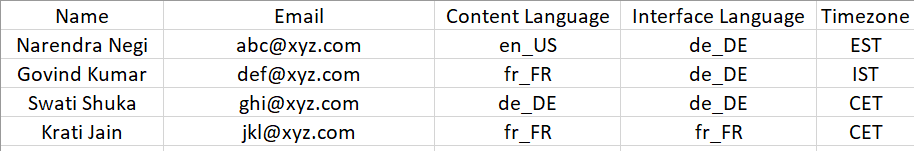

# Neue Funktionen in dieser Version (November 2022)

<!--
IN-PROGRESS

<https://helpx.adobe.com/learning-manager/whats-new-nov-2022.html>
-->

## Konfiguration mehrerer SSO-Methoden

Adobe Learning Manager unterstützt derzeit eine Anmeldemethode für interne und eine Anmeldemethode für externe Benutzer. Dies führt zu Einschränkungen in Fällen, in denen Kunden ihre Mitarbeiter und ihre eigenen Kunden und Vertriebspartner in demselben Konto verwalten.

Mit der Ziel, mehrere Typen von Benutzergruppen zu unterstützen, die sich bei der Plattform anmelden, unterstützt Adobe Learning Manager jetzt sowohl für interne als auch für externe Benutzer mehrere Anmeldemethoden über mehrere SSO-Konfigurationen.

Weitere Informationen finden Sie unter [Mehrere SSO-Anmeldungen](/help/migrated/administrators/feature-summary/multiple-sso-logins.md).

## Unterstützung für die Funktion ohne Anmeldung

Das native Portal von Adobe Learning Manager unterstützt jetzt Zugriffe ohne Anmeldung auf ein Schulungsportal.

Die Teilnehmer können sich jetzt auf der Schulungsseite informieren und darauf zugreifen, verschiedene verfügbare Kurse und Inhalte ansehen und sich dann anmelden, um die Kurse zu nutzen.

Diese Funktion erleichtert die Erstellung eines kundenseitigen Lernportals, in dem Teilnehmer verschiedene Kurse durchsuchen können, ohne sich zunächst anmelden zu müssen.

Weitere Informationen finden Sie unter [Oberfläche für nicht angemeldete Teilnehmer](/help/migrated/administrators/feature-summary/non-logged-in-experience-learners.md).

## Verbesserungen der Schulungsübersichtsseite

Die Benutzeroberfläche der Seite „Schulungsübersicht“ wurde aktualisiert, damit die Teilnehmer während der Bearbeitung eines Kurses von einem verbesserten Benutzererlebnis profitieren.

Weitere Verbesserungen:

* Lesezeichen für Schulungen
* Empfehlung verwandter Kurse
* Lernpfadinformationen für Kurse und Lernpfade.
* Klickbare Autorennamen
* Breadcrumbs für einfachere Navigation

## Verbesserungen der Schulungsübersichtsseite

Die Benutzeroberfläche der Seite „Schulungsübersicht“ wurde aktualisiert, damit die Teilnehmer während der Bearbeitung eines Kurses von einem verbesserten Benutzererlebnis profitieren.

Weitere Verbesserungen:

* Lesezeichen für Schulungen
* Empfehlung verwandter Kurse
* Lernpfadinformationen für Kurse und Lernpfade.
* Klickbare Autorennamen
* Breadcrumbs für einfachere Navigation

## Autorenprofilseite

Auf der Seite mit dem Autorenprofil werden alle Schulungen angezeigt, die von einem bestimmten Autor erstellt wurden.

So können Teilnehmer autorenspezifische Informationen und alle vom Autor erstellten Schulungen leicht finden.

## Mit Lesezeichen versehene Schulungen

Teilnehmer können Schulungen über die Kurskachel oder die Übersichtsseite speichern (mithilfe der Schaltfläche „Speichern“) oder mit Lesezeichen versehen. Alle mit einem Lesezeichen versehenen Kurse stehen auf der Teilnehmerstartseite zur Verfügung.

## Player-Anpassung

In dieser Version können Sie den Fluidic Player an die Markenanforderungen eines Kurses anpassen.

Sie können je nach Inhaltsanforderung verschiedene Player-Einstellungen und -Optionen ein- und ausblenden und Teilnehmern basierend auf dem Inhaltstyp Steuerungsmöglichkeiten erteilen. Sie können diese Änderung sowohl auf native als auch auf Headless-Implementierungen anwenden.

Folgende Optionen können geändert werden:

* Ein-/Ausschalten des Inhaltsverzeichnisses
* Hinweise
* Sprache
* Geschwindigkeit
* Beschriftung
* Lautstärke
* Steuerelemente für die Wiedergabe

## Annehmen der Identität eines Teilnehmers und Managers

Administratoren können eine Sitzung starten, in der sie die Identität eines beliebigen Benutzers in ihrem Konto in der Teilnehmer- und Manager-Rolle übernehmen können.

Weitere Informationen finden Sie unter [Annehmen der Identität eines Teilnehmers und Managers](/help/migrated/administrators/feature-summary/impersonation-learner-manager.md).

## Sonstige Verbesserungen

### Überwachungsprotokoll von E-Mails

Administratoren können jetzt über einen Bericht zur E-Mail-Überwachung auf alle vom System gesendeten E-Mail-Protokolle zugreifen.

Dieses Protokoll erfasst alle Daten zu E-Mails, die in den letzten 30 Tagen gesendet wurden, und wird täglich aktualisiert. Darüber hinaus enthält der Bericht Informationen wie den Zustellungsstatus, den Absender, den Empfänger, den Betreff sowie Inhaltsmetadaten.

Laden Sie den Bericht unter Berichte > Benutzerdefinierte Berichte > Excel-Berichte > E-Mail-Bericht herunter. Eine Benachrichtigung wird angezeigt, über die Sie den Bericht herunterladen können.

Dieser Bericht enthält Felder mit den folgenden Informationen:

* E-Mail-Auslösezeit (UTC-Zeitzone)
* Zeit des letzten Ereignisstatus (UTC-Zeitzone)
* Zustellungsstatus
* Empfänger-E-Mail
* Benutzer-ID des Absenders
* E-Mail-Betreff
* Entitätstyp
* Entitätsname
* Entitäts-ID

### Benachrichtigung von Teilnehmern auf Wartelisten

Wenn ein Autor eine neue Instanz hinzufügt, kann er eine E-Mail auslösen, um Teilnehmer auf der Warteliste über weitere Instanzen zu informieren. Die Teilnehmer erhalten eine E-Mail zur Änderung.

### E-Mail-Vorlagen auf Instanzebene

Sie können E-Mails für jede Instanz einer Schulung anpassen.

Wo immer der Autor oder Administrator eine neue Instanz hinzufügen kann, kann die Vorlage für eine einzelne Instanz bearbeitet werden.

Wenn ein Kurs beispielsweise über unterschiedliche Arten von Zielgruppen verfügt, können Sie die E-Mail-Vorlage entsprechend ändern.


Die Priorität der Vorlage ist unten aufgeführt:

1. Vorlage auf Instanzebene
2. Vorlage auf Schulungsebene
3. Vorlage auf Kontoebene

### Kursleiterkommentare beim Annehmen von Einreichungen

Kursleiter können jetzt Kommentare hinzufügen, wenn sie die von den Teilnehmern eingereichten Beiträge akzeptieren. Der Teilnehmer erhält eine E-Mail-Benachrichtigung und eine In-App-Benachrichtigung (sofern aktiviert), sobald die Einreichung vom Kursleiter genehmigt wurde. Die übermittlungsbezogenen Kommentare sind in den Teilnehmertranskripten sowohl für den Administrator als auch für die Teilnehmer vorhanden.

### Verbesserte Suchfunktionen

Der aktuelle Suchverlauf eines Teilnehmers wird angezeigt, sodass er alle früheren Suchvorgänge sehen kann.

Die Suchergebnisse sind jetzt für alle formellen und informellen Schulungen (soziales Lernen) konsistent. Die Ergebnisse umfassen Schulungen, soziales Lernen und Übereinstimmungen auf dem Inhalts-Marketplace.

Die Suche ist fokussierter und zielgerichteter, und Sie können die Suchergebnisse an drei Stellen einsehen: beim formellen Lernen, beim sozialen Lernen und auf dem Inhalts-Marketplace.


#### Ausdrucksgesteuerte Suche

In dieser Version von Adobe Learning Manager haben wir die Typeahead-Suche durch die ausdrucksgesteuerte Suche ersetzt.

#### Letzte Suchvorgänge

Ein Teilnehmer kann seine zuletzt durchgeführten Suchvorgänge nur in der aktuellen Sitzung anzeigen.

### Katalog für kostenlose Kurse auf dem Inhalts-Marketplace

Auf dem Inhalts-Marketplace für Teilnehmer steht jetzt eine Reihe von 50 kuratierten, hochwertigen, kostenlosen Katalogen zu Gratiskursen zur Verfügung.

### Unterstützung für Indonesisch

Indonesisch wurde jetzt als Benutzeroberflächensprache in den Teilnehmer- und Manager-Apps hinzugefügt.

### Pflichtfeld „Autor“

Beim Erstellen eines Kurses ist das Feld „Autor“ obligatorisch.

### Änderungen am Inhalts-Marketplace

* Neu erstellte Testkonten listen einen neuen Katalog für 50 kostenlose Kurse im Inhalts-Marketplace auf, die für Benutzer verfügbar sind.
* Ein Teilnehmer kann jetzt die Anzahl der Suchergebnisse sehen und eingebettete Links verknüpfen, um zum Inhalts-Marketplace weitergeleitet zu werden.

### Änderungen für immersive Web-Umgebung auf Mobilgeräten

In dieser Version können Benutzer der immersiven Web-Umgebung auf Mobilgeräten die unten aufgeführten Aufgaben ausführen:

* Erstellen – Umfragebeiträge.
* Beitrag bearbeiten – alle Typen, RTE.
* E-Commerce-Workflow.
* Vorschau eines Moduls: Teilnehmer verfügen über die Modulvorschau-Funktion in der immersiven Mobilanwendung. Diese Änderung ermöglicht es Teilnehmern, vor der Registrierung für einen Kurs eine Vorschau des Moduls anzuzeigen.
* Kopieren einer URL.
* Löschen eines Boards.

### Änderungen am Zoom-Connector.

Der JWT-App-Typ wird im Juni 2023 veraltet sein. Es empfiehlt sich, Server-zu-Server-OAuth oder OAuth-Apps zu erstellen, um die Funktionalität einer JWT-App in Ihrem Konto zu ersetzen.

### Bericht für Gamification

In dieser Version erhalten Sie Zugriff auf einen Bericht, der verschiedene Kurse anzeigt, in denen Gamification aktiviert wurde.

### Sprachvoreinstellung über CSV importieren

Beim Importieren einer CSV-Datei enthält die CSV-Datei die Felder &quot;Interface Language&quot;, &quot;Content Language&quot; und &quot;Time Zone&quot;.

Der Administrator kann auch einen Bericht exportieren, der die gleichen Felder wie oben enthält.

* Sprache der Benutzeroberfläche
* Inhaltssprache
* Zeitzone

Außer Administratoren kann auch ein benutzerdefinierter Administrator diesen Bericht exportieren.



#### Auswirkungen auf die Lokalisierung

* Die Spaltennamen können nicht lokalisiert werden und müssen unverändert bleiben („Interface Language“, „Content Language“, „Timezone“).
* Bei den Gebietsschemacodes wird nicht zwischen Groß- und Kleinschreibung unterschieden.
* Obwohl es keine Einschränkung für die Angabe des Ländercodes gibt, können Sie nur den Sprachcode angeben. Zum Beispiel sind sowohl &quot;it_IT&quot; als auch &quot;it&quot; gültig.
* Wenn der Bericht aufgrund eines falschen Gebietsschemacodes Diskrepanzen enthält, wird die CSV-Verarbeitung wie gewohnt fortgesetzt und der Fehler wirkt sich nicht auf die anderen Datensätze in der CSV-Datei aus. Die Gebietsschemavoreinstellung des Benutzers mit einem falschen Gebietsschema wird nicht aktualisiert. Der Rest der Daten wird aktualisiert.

## Änderungen und Verbesserungen der API

### VC-Connectors

Wenn eine Administrator-E-Mail-ID zum Konfigurieren des VC-Connectors verwendet wird, muss der entsprechende Administrator über die Berechtigung für folgende Aufgaben verfügen:

* Erstellen eines Meetings
* Aktualisieren eines Meetings
* Abrufen eines Anwesenheitsberichts

Beim Erstellen oder Aktualisieren des VC-Meetings müssen die Kursleiter das Meeting innerhalb von 30 Minuten nach der geplanten Endzeit des Meetings BEENDEN.

### Lesezeichen

Die folgenden APIs wurden hinzugefügt, um einen Kurs auf der Seite „Schulungsübersicht“ mit einem Lesezeichen zu versehen:

* Alle Lesezeichen abrufen: `primeapi/v2/bookmarks`
* Erstellen eines Lesezeichens: `primeapi/v2/learningObjects/{id}/bookmark`
* Lesezeichen löschen: `primeapi/v2/learningObjects/{id}/bookmark`

### Unterstützung für Metadaten und Inhalte aus mehreren Gebietsschemata durch Migration

Für alle Arten von Schulungen, die auf der Plattform unterstützt werden (Kurse, Lernpläne, Module, Zertifizierungen und Arbeitshilfen), kann die Migration in mehreren Sprachen jetzt über CSV-Dateien unterstützt werden, wobei für weitere Sprachen zusätzliche Spalten verwendet werden.

#### Voraussetzungen

Erstellen Sie das Migrationsprojekt als Integrations-Admin und geben Sie dann die migrationProjectId für das ALM-Support-Team frei, damit das Flag &quot;Multi-Locale&quot; vom Backend aus aktiviert werden kann.

#### Gültigkeitsbereich von Migrationsobjekten mit mehreren Gebietsschemas

* Modul
* Kurs
* Modulversion
* Zertifizierung
* Lernprogramm
* Arbeitshilfe
* Version der Arbeitshilfe

#### CSV-Spezifikation

Adobe Learning Manager bietet Ihnen eine Reihe von CSV-Standardspezifikationen für die Migration in Verbindung mit mehreren Gebietsschemata. Es empfiehlt sich, diese CSV-Spezifikationen vor Beginn des Migrationsvorgangs durchzugehen. Der Integrationsadministrator des Unternehmens kann die vorhandenen Datenformate analysieren und den entsprechenden von Learning Manager bereitgestellten CSV-Vorlagenelementen zuordnen.

#### Änderungen mit Unterstützung mehrerer Gebietsschemata

* Die Spalte module_version wird in module_version.csv und course_module.csv nicht unterstützt.
* Die Aktualisierung von module_version ist nicht in derselben Ausführung möglich (das Modul kann nicht in derselben Ausführung mit zwei Versionen migriert werden).
* Das Inhalts- oder Metadatenupdate wird als Modulversionsupdate von module_version.csv betrachtet.
* Das Job_Aid_Version-Update kann nicht über job_aid_version.csv unterstützt werden.

### Authentifizierungstoken und Cookies widerrufen

Eine Headless-LMS-Anwendung erhält das refresh_token bei der ersten Anmeldung. Anschließend wird das refresh_token zum Generieren des access_token verwendet, damit die zugehörigen Clientanwendungen API-Aufrufe durchführen können. In ähnlicher Weise verwendet die Inhaltswiedergabe den OAuth-Endpunkt zum Generieren von Cookies für die Verwaltung der Wiedergabe. Dies umfasst mehrere Inhaltsdateien sowie API-Aufrufe, die von diesen Dateien mithilfe von Cookies aufgerufen werden. Cookies, die von OAuth generiert werden, besitzen genau wie das access_token eine Gültigkeitsdauer von sieben Tagen. Nachdem ein Cookie generiert wurde, gibt es, anders als bei der typischen Abmeldung von Web-Anwendungen, keine Möglichkeit, es zu löschen. Das OAuth-Cookie und das Web-Anwendungs-Cookie sind zwei unterschiedliche Cookies, die voneinander unabhängig sind.

Zum Löschen des Cookies haben wir daher einen neuen Endpunkt eingeführt, der refresh_token und Cookie sowohl einzeln als auch zusammen widerruft.

**Details**

**Endpunkt**

`POST oauth/o/revoke`

**Abfrageparameter**

* `cookie=true|false` - gibt an, dass das Cookie widerrufen werden muss
* `refresh_token=true|false` - zeigt an, dass die Aktualisierung

**Anforderungstext**

Text, der für das Widerrufen von refresh_token oder (refresh_token und Cookie) erforderlich ist

```
{
      "client_id": <>,
      "client_secret": <>,
      "refresh_token": <>
}
Body required for revoking oauth cookie only
{
      "access_token": <>
}
```

### Veröffentlichte APIs

In dieser Version haben wir einige APIs veröffentlicht.

| API | Typ | Beschreibung |
|---|---|---|
| /social/search | GET | Hiermit wird eine Suche in sozialen Netzwerken durchgeführt. |
| /Ankündigungen | GET | Rufen Sie detaillierte Informationen zur Ankündigung auf dem Mastertitel ab, der dem Teilnehmer zugewiesen ist. |
| /annoements/`{id}` | GET | Rufen Sie detaillierte Informationen zur Ankündigung auf dem Mastertitel ab, der dem Teilnehmer zugewiesen ist. |
| /learningObjects/`{id}`/loResources/{loResourcesId} | GET | Laden Sie die URL der Datei für loResource vom Typ &#39;Aktivität&#39; hoch, wenn die Dateiübermittlung erforderlich ist. |
| /jobAid/`{jobAidId}`/jobAidDownloaded | GET | Bericht zum Herunterladen der Arbeitshilfe festlegen |
| /bulkimport/startrun | POST | Hiermit wird ein Massenimport ausgeführt. |
| /bulkimport/cansync | GET | Hiermit wird der Massenimport synchronisiert. |
| /search | GET | DELETEMEBOB |
| /uploadInfo | GET | Informationen zu Inhaltsaktualisierungen abrufen. |
| /uploadSigner | GET | Unterschrift des To_Sign-Inhalts einholen |
| /avatar | POST | Aktualisiert das Avatarbild des Teilnehmers mit einem neuen Bild. |
| /avatar | DELETE | Löscht das Avatarbild des Teilnehmers. |

### Salesforce-App

Die Option **LO mit höherer Reihenfolge ignorieren** muss in der Salesforce-App aktiviert sein, damit alle Kurse, Lernprogramme und Zertifikate gleichzeitig angezeigt werden können.

### APIs zur Player-Anpassung

In dieser Version haben wir APIs bereitgestellt, um einen Player anzupassen. Sie haben folgende Möglichkeiten:

* Starten oder laden Sie den Player.
* Navigieren Sie zu einem bestimmten Modul.
* Schalten Sie das Inhaltsverzeichnis ein-/aus.
* Ändern Sie die Sprache.
* Schließen Sie den Player.
* Nutzen Sie die Funktionen Wiedergabe, Pause, Vor- oder Zurückspulen, Suchen, Lautstärkeregelung oder Geschwindigkeitsänderung.
* Erfassen Sie vom Player ausgegebene Ereignisse.

### Anzeigen der Wartelistenposition eines Teilnehmers

Die GET /enrollments/{id}/waitlistPosition-API unter der LO-API ruft die Wartelistenposition eines Benutzers für eine angegebene Registrierung ab.

### Einreichung des Abschlussdatums in externen Zertifizierungen

Die /primeapi/v2/learningObjects/certification:xxxxx-API verfügt über das Attribut &quot;completeDateSameAsApprovalDate&quot;, um anzugeben, dass für das Zertifikat zusammen mit dem &quot;true/false&quot;-Flag&quot; Abschlussdatum der Zertifizierung&quot; für den Teilnehmer aktiviert ist oder nicht.

### Abrufen von LO-Vorschaudaten

Die GET /preview/learningObjects/{id}-API wird zum Abrufen von Vorschauinformationen über ein Lernobjekt hinzugefügt.

### Verschieben externer Benutzer innerhalb von Profilen

Der `PUT primeapi/v2/externalProfiles/{currentep}/users/{userid}?`-Aufruf unterstützt das Verschieben eines Benutzers in ein anderes externes Profil, indem eine neue externalProfile-ID angegeben wird.

### Hinzufügen von Benutzern zu externen Profilen

&quot;`POST /externalProfiles/{id}/users`&quot; fügt externen Benutzern externe Profile hinzu.

## Versionshinweise

Weitere Informationen zu aktuellen und früheren Versionen der Learning Manager-Webanwendung und -Geräte-App finden Sie in den [Versionshinweisen](/help/migrated/release-note/release-notes.md).

## Fehlerbehebungen

Um die Fehler anzuzeigen, die in diesem Update behoben wurden, lesen Sie die Liste [Behobene Fehler](release-note/release-notes.md#bugs-fixed-in-this-release).

## Systemanforderungen

[Systemanforderungen für Learning Manager](/help/migrated/system-requirements.md)
