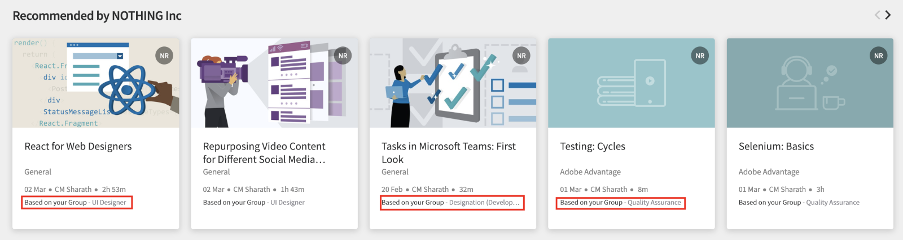
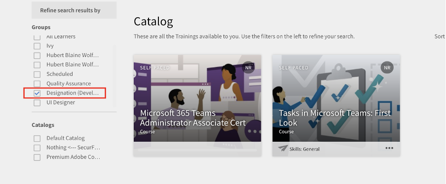
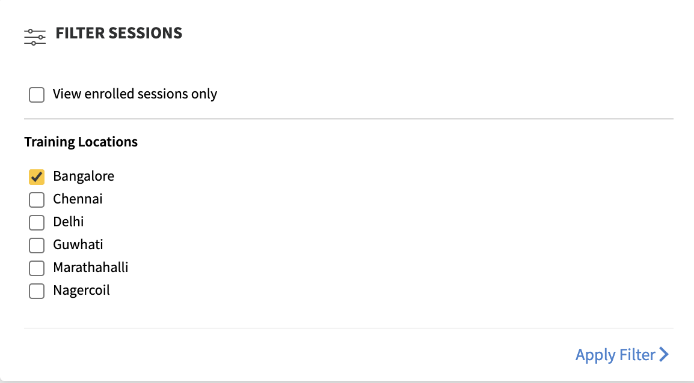

# Neue Funktionen in dieser Version (April 2023)

## Adobe Learning Manager-App für Microsoft Teams

Die neue Adobe Learning Manager-App für Microsoft Teams soll das Lernen im Arbeitsfluss fördern und das soziale Lernen steigern. Teilnehmende können auf der Microsoft Teams-Plattform auf die Lerninhalte zugreifen, ohne zu einem Browser wechseln zu müssen. Wenden Sie sich an Ihren CSAM, um die Betaversion der Adobe Learning Manager-App für MS Teams zu erhalten.

Weitere Informationen finden Sie unter [Adobe Learning Manager-App für Microsoft Teams](/help/migrated/adobe-learning-manager-app-microsoft-teams.md).

## Verbesserungen der ILT-Erfahrung (Instructor-Led Training)

Mehrere Verbesserungen wurden an der ILT-Erfahrung (Instructor Led Training) vorgenommen. Zu den wichtigsten Verbesserungen gehören die Möglichkeit, Sitzungen basierend auf dem Standort zu filtern, die Möglichkeit, Instanzen zu wechseln (VILT), ohne den Fortschritt zu verlieren, ein neuer &quot;Planungsassistent&quot; zum Verwalten von Konflikten in Buchungssitzungen, die Möglichkeit, &quot;Kenntnisse&quot; an Kursleiter anzuhängen und Kursleiter basierend auf Kenntnissen auszuwählen.

### Was hat sich verändert

* Die Seite &quot;Kenntnisse&quot; der Admin-App bietet die Möglichkeit, eine Kenntnisse-Kursleiter(in)-Zuordnung hochzuladen.
* Auf der Seite &quot;Kenntnisse&quot; gibt es eine neue Spalte &quot;Kursleiter&quot;. Die Spalte zeigt die Anzahl der Kursleiter für die Kenntnisse an. Wenn Sie auf die Nummer in der Spalte &quot;Kursleiter&quot; klicken, werden Sie zu einem Popup-Fenster weitergeleitet, in dem die Anzahl der Kursleiter angezeigt wird, die Kenntnissen zugewiesen sind.

Weitere Informationen finden Sie unter [Kursleiter(innen) Kenntnisse zuweisen](/help/migrated/administrators/feature-summary/skills-levels.md#assign-skills-to-instructors).


### Planungsassistent

Konflikte bei der Buchung von Kursleitern und Klassenzimmern oder virtuellen Klassenzimmern bewältigen. Wenn Sie wissen möchten, zu welcher Zeit und zu welchem Datum ein Kursleiter verfügbar ist, bevor Sie ihn dem Kurs zuweisen, verwenden Sie den Scheduling Assistant.

Autor(inn)en, Administrator(inn)en und benutzerdefinierte Administrator(inn)en/Autor(inn)en können den Planungs-Assistenten verwenden.

Weitere Informationen finden Sie unter [Planungs-Assistent](/help/migrated/authors/feature-summary/courses.md#scheduling-assistant).

## Neue mobile Adobe Learning Manager-App

Eine brandneue mobile Adobe Learning Manager-App für Android und iOS, die Teilnehmenden einen reibungslosen Zugang zum Lernen unterwegs bietet. Mit der App können Teilnehmende Schulungen auf ihren Mobilgeräten absolvieren und später auf ihren Desktops fortsetzen. Mit Unterstützung für Benachrichtigungen, Hochladen von Dateien, einfaches Bookmarking und Freigeben von Lerninhalten, soziales Lernen und mehr bietet die mobile App Teilnehmenden zusätzliche Flexibilität und unterstützt Just-in-Time-Lernen.


Laden Sie das Mobilgerät aus dem Google Play Store und der Apple App Store herunter. Benutzer der älteren Version der Applikation werden aufgefordert, die neue Applikation herunterzuladen und zu installieren.

In dieser Version unterstützt die App die folgenden Funktionen:

Die neue mobile App unterstützt die folgenden Hauptfunktionen in dieser Version:

* Verbesserte Suche, einschließlich der Anzeige aktueller Suchen durch Teilnehmende und beliebter Suchen in der Organisation im Sucheingabefeld.
* Möglichkeit zum Herunterladen von Teilnehmertranskripten.
* Verbessertes Benachrichtigungscenter - stellt wichtige Aktualisierungen für Teilnehmer als Benachrichtigungen in der App bereit
* Möglichkeit zum Sortieren und Filtern von Lernobjekten auf den Seiten „Katalog/Eigenes Lernen“
* Möglichkeit, Lesezeichen für Lernobjekte (LOs) zu setzen - mit Lesezeichen versehene LOs sind im Abschnitt &quot;Gespeichert von mir&quot; auf der Teilnehmer-Startseite verfügbar.
* Unterstützung für erweiterte LPs
* Möglichkeit, die Sprache der mobilen Benutzeroberfläche in eine beliebige von Adobe Learning Manager unterstützte Sprache zu ändern.
* Unterstützung für Datei-Uploads in externen Zertifizierungen, CR/VC-Sitzungen und Aktivitätsmodulen.
* Möglichkeit, L1-Kursfeedback innerhalb der App einzureichen.
* Unterstützung für Deep-Links.
* Unterstützung für soziales Lernen.
* Unterstützung für Abzeichen.
* Unterstützung für die Anmeldung als externe Benutzende.

**Was wird in dieser Version nicht unterstützt**

* Unterstützung für mehrere Versuche, ein Quizmodul in einem Kurs zu erstellen, wenn der Kurs von der mobilen App aus absolviert wird.
* Suchoptionen, mit denen Sie Suchparameter wie Kurs-Metadaten, Tags und Kenntnisse zum Festlegen des Suchbereichs angeben können.
* Benutzerdefinierte Ankündigungen mit Administratorfunktion, die Benutzenden in der mobilen App als Popup angezeigt werden.
* Sie können auf der Kenntnisseite in der App keine Kenntnisse hinzufügen.
* Absolvieren von Kursen, während Sie offline sind.

Weitere Informationen finden Sie in der [Adobe Learning Manager-Mobile App](/help/migrated/learners/feature-summary/ipad-android-tablet-users.md).

## QR-Code-Scan-App verwenden, um QR-Codes von Learning Manager zu scannen

Adobe Learning Manager unterstützt jetzt eine benutzerfreundlichere Methode zum Scannen von QR-Codes mithilfe der nativen Kamera-App, sodass keine App zum Scannen eines QR-Codes heruntergeladen werden muss.

Um den vorherigen Arbeitsablauf zu unterstützen, bei dem Sie einen QR-Code über das Menü der ALM-App scannen konnten, haben wir in dieser Version Informationen über den Wechsel zum neuen Arbeitsablauf bereitgestellt.

Mit Verbesserungen an QR-Code-basierten Workflows werden alte QR-Codes, die vor dieser Version generiert wurden, nicht mehr unterstützt. Wenn Sie also einen QR-Code mit einer älteren Version von Learning Manager für eine Klassenzimmer- oder VC-Sitzung generiert haben, die nach dieser Version durchgeführt wird, müssen Sie einen neuen QR-Code generieren.

### Verbesserungen der Empfehlungsankündigung

In dieser Version haben wir den Empfehlungsstreifen von einer Organisation auf eine Empfehlung basierend auf der Benutzergruppe aktualisiert, zu der der Teilnehmer gehört, um die relevanten Kurse für den Teilnehmer anzuzeigen.

Administratoren können bestimmte Kurse oder Schulungen auf Teilnehmer basierend auf den Profilen der Teilnehmer ausrichten. Teilnehmer können dann nach Kursen suchen, basierend auf dem Profil, zu dem sie gehören.

**Änderungen**

Auf der Ankündigungsseite wird einem Teilnehmer über eine Option angezeigt, warum ihm dieser Kurs oder diese Schulung empfohlen wurde.


### Neue Administratoreinstellung

Der Administrator hat eine neue Option namens &quot;Gruppen&quot; in &quot;Einstellungen“ > &quot;Filterfelder anzeigen&quot;. Wenn &quot;Gruppen&quot; aktiviert ist, wird der Gruppenfilter auf der Teilnehmer-Startseite angezeigt. Der Teilnehmer kann dann die Kurse basierend auf den Benutzergruppen anzeigen.

|   | Wenn die Option aktiviert ist | Wenn die Option deaktiviert ist |
|--- |--- |--- |
| Die Option &quot;Gruppen&quot; ist aktiviert. | <ul><li> Zeigt die Benutzergruppe auf der Kachel zusammen mit dem Link zur Katalogseite an.</li><li> Die Benutzergruppe wird im Katalogfilter angezeigt.</li></ul> | <ul><li>Der Name der Benutzergruppe wird nicht auf der Kachel angezeigt.</li><li>Die Benutzergruppe wird nicht im Katalogfilter aufgeführt.</li></ul> |
| Gruppenoption ist deaktiviert | <ul><li>Zeigt den Namen der Benutzergruppe auf der Kurskachel als reinen Text an.</li><li>Die Benutzergruppe wird nicht im Katalogfilter aufgeführt.</li></ul> | <ul><li>Auf der Kurskachel wird weder der Text noch der Name der Benutzergruppe angezeigt.</li><li>Die Benutzergruppe wird nicht im Katalogfilter aufgeführt.</li></ul> |

**Funktionsweise**

Administrator(inn)en erstellen eine Ankündigung, indem sie den Kurs für eine beliebige Benutzergruppe hinzufügen und ihn veröffentlichen.

Was ein Teilnehmer sieht, ist ein Streifen mit empfohlenen Kursen auf der Startseite und einem Link zum Kurs auf der Kachel.



Wenn der Teilnehmer auf den Link oder die Schaltfläche &quot;Zum Katalog&quot; klickt, wird der Teilnehmer zur Kurskatalogseite umgeleitet. Der Teilnehmer zeigt dann die Liste der Benutzergruppen an, die basierend auf den Benutzergruppen im Katalog und auf der Seite &quot;Meine Lernprogramme&quot; gefiltert werden sollen.



## Sitzungen über Standorte suchen

### Verwalten von Standorte für Klassenzimmer

Manchmal möchten Sie, dass Teilnehmende eine Sitzung im Kalender nach dem Standort filtern. Nach dem Hinzufügen eines Standorts über das Dialogfeld &quot;Standorte für Klassenzimmer&quot; oder die CSV-Datei können Teilnehmende dann filtern.


Weitere Informationen finden Sie unter [Standorte für Klassenzimmer hinzufügen](/help/migrated/administrators/feature-summary/settings.md#classroom-locations).

### Kalender-Widget

Als Teilnehmer(in) können Sie Sitzungen filtern, die Ihnen nach Standort zugewiesen sind. Navigieren Sie zum Kalender-Widget, wählen Sie „Sitzungen filtern“ und wählen Sie den Standort.





Außerdem wird der Schulungsort jetzt auf der Kursübersichtsseite angezeigt, wenn der Ort vom Autor beim Erstellen des Kurses hinzugefügt wird.

### Administrator

Als Administrator(in) können Sie steuern, ob Teilnehmende Kurse nach Standorten filtern können. Aktivieren oder deaktivieren Sie unter „Einstellungen > Allgemein“ die Option „Schulungsorte“.

Weitere Informationen finden Sie unter [Administratoreinstellungen](/help/migrated/administrators/feature-summary/settings.md).

## Änderungen an der Testversion

Nachdem das Testkonto erstellt wurde, werden die Kurse im Inhalts-Marketplace unverzüglich verfügbar.

## Chatbot

Chatten Sie mit einem Agenten oder mehreren Agenten, die einen Chatbot verwenden. Nur Administratoren und benutzerdefinierte Administratoren von Testkonten können diese Funktion verwenden.

Der Chatbot macht Folgendes:

* Er begrüßt Sie mit einer Nachricht.
* Bieten eine Option für Produktinformationen oder eine Produktdemo.
* Er übergibt den Chat einem Live-Agenten.
* Er speichert Ihren Chat-Verlauf.


## Verbesserungen der Beobachtungs-Checkliste

Autoren können jetzt Manager und Filial-/Standortmanager als Reviewer für Checklisten auswählen. Manager und Filial-/Standortmanager können, sofern sie als Reviewer ausgewählt wurden, auch die Checklisten ihrer Teams anzeigen und abschließen, ohne zu den Kursleiterrollen wechseln zu müssen. Die Kursleiter überprüfen weiterhin die Checklisten. Eine neue Benachrichtigung &quot;Checkliste überprüfen&quot; wird an die Reviewer (Kursleiter/Manager) einer Instanz für die Checkliste für Registrierungen gesendet.

Wenn ein Manager als Reviewer im Checklistenmodul hinzugefügt wird, kann er die Checkliste in der Manager-App überprüfen. Die Kursleiter überprüfen die Checkliste wie erwartet.

Weitere Informationen finden Sie unter [Beobachtungs-Checkliste](/help/migrated/authors/feature-summary/courses.md#observation-checklist).

## Sonstige Verbesserungen

### Teilnehmendensuche

Die Suchergebnisse werden auch wie folgt kategorisiert:

* Zuletzt von Ihnen gesuchte Dateien
* Beliebte Suchvorgänge in Ihrer Organisation

Die Suchfunktion wurde auch für Teilnehmende verbessert. Teilnehmer können jetzt doppelte Anführungszeichen &quot;...&quot; sowie die Operatoren &quot;+&quot; und &quot;-&quot; und &quot;-&quot; verwenden, um relevante Ergebnisse schneller zu finden und eine Google-Suche durchzuführen.

* Verwenden Sie doppelte Anführungszeichen (&quot;...&quot;), um nach Kursen zu suchen, die den genauen Ausdruck oder das Wort enthalten. Bei der Eingabe von &quot;Data Science&quot; werden beispielsweise Kurse angezeigt, die mit dem Begriff &quot;Data Science&quot; beginnen.
* Verwenden Sie den Operator &quot;+&quot;, um sicherzustellen, dass nur die Ergebnisse angezeigt werden, die den spezifischen Ausdruck oder das spezifische Wort enthalten. Mit Computer-Programmierung +python werden beispielsweise nur die Computerprogrammierkurse angezeigt, die das Wort &quot;python&quot; enthalten.
* Verwenden Sie den Operator -, um sicherzustellen, dass nur die Ergebnisse angezeigt werden, die den spezifischen Ausdruck oder das spezifische Wort nicht enthalten. Computer Programming -python zeigt z. B. alle Computerprogrammierkurse an, mit Ausnahme der Kurse, die das Wort &quot;python&quot; enthalten.

### Widersprüchliches Popup für Lernobjekte

Auf der Seite &quot;Übersicht&quot; wird ein Popup-Fenster zur Registrierung angezeigt, wenn ein Teilnehmer in Konflikt stehende Sitzungen hat. Wenn Sie sich von der Katalogseite oder der Übersichtsseite aus registrieren und ein Teilnehmer bereits Sitzungen hat, die Konflikte verursachen, wird ein Popup-Fenster mit Details zu konfliktverursachenden Sitzungen ausgelöst. Auch wenn ein Teilnehmer eine Sitzung hat, die einen Konflikt verursacht, können sie sich für die neue Sitzung registrieren.


Beachten Sie, dass diese Meldung nur eine Warnung ist. Sie können sich weiterhin für einen Kurs registrieren.

### Neue Vorlage

Wir haben eine neue E-Mail-Vorlage mit dem Namen „Sitzung wegen Aufhebung der Registrierung storniert“ hinzugefügt. Wenn die Registrierung von Benutzenden für eine Schulung aufgehoben wird, erhalten sie die Stornierungs-E-Mail.

### Neue Preisfunktion für Kurse

Administrator(inn)en können jetzt die Währung für das Konto im Abschnitt „Administratoreinstellungen > Grundlegende Informationen“ festlegen. Administrator(inn)en können sowohl das Symbol als auch den ISO-Währungscode angeben, z. B. USD, GBP usw. Der Standardwert für alle neuen Konten ist $. Diese Änderung gilt nur für Nicht-Teilnehmer-Apps. Administratoren können die Änderung sehen, wenn sie den Kurs als Teilnehmer in der Vorschau anzeigen. Das Währungssymbol wird auch in Teilnehmertranskripten und Schulungsberichten angezeigt.

Weitere Informationen finden Sie unter [Administratoreinstellungen](/help/migrated/administrators/feature-summary/settings.md).

### Instanzen wechseln

Teilnehmende, die in einer bestimmten Instanz eines Kurses registriert sind, können eine Liste aller verfügbaren Instanzen des Kurses anzeigen und zu einer anderen Instanz wechseln, die für sie besser geeignet ist. Der Grund für den Wechsel könnte sein, dass Teilnehmende die Teilnahme an der vorherigen Instanz verpasst haben, der Sitzungszeitpunkt für die neue Instanz geeigneter ist, oder etwas anderes.

Alle Fortschritte, die Teilnehmende im Rahmen des Kurses, der Teilnehmenden-Quizergebnisse usw. erzielt haben, werden auf die neue Instanz übertragen. Diese Funktion ist in erster Linie für Klassenzimmer- und gemischte Kurse gedacht, aber wir unterstützen alle Arten von Kursen, einschließlich Kursen zum Selbststudium.

Die Option &quot;Alle Instanzen anzeigen&quot; wird unabhängig von den Einstellungen für den Instanzwechsel angezeigt. Teilnehmer können jetzt alle Instanzen anzeigen, wenn mehrere Instanzen eines Kurses vorhanden sind.

Wenn die Option &quot;Instanz-Wechsel&quot; aktiviert ist, können Teilnehmer zu verschiedenen Instanzen wechseln, bis sie den Kurs abgeschlossen haben. Wenn die Option deaktiviert ist, können Teilnehmer die Instanzen anzeigen, sich aber nicht für den Kurs registrieren.

Wenn Teilnehmende **Alle Instanzen anzeigen** auswählen, können sie alle Kursinstanzen sehen.


_Alle Instanzseiten aus der Teilnehmerkonsole anzeigen_


_Instanz von Teilnehmerseite wechseln_

Ein Administrator kann die Instanzen für Teilnehmer wechseln. Wählen Sie in der Admin Console einen Kurs aus, wechseln Sie zum Abschnitt **[!UICONTROL Teilnehmer]**, wählen Sie einen Benutzer aus und klicken Sie auf die Schaltfläche **[!UICONTROL Aktion]**. Wählen Sie dann **[!UICONTROL Instanz wechseln]** und anschließend die gewünschte Instanz aus.


_Instanz von der Admin Console wechseln_

 auswählen
_Aufforderung zum Wechseln der Instanz_

Sie können die Instanzen erst wechseln, wenn eine Instanz des Kurses über die Teilnehmer- oder Admin-App abgeschlossen wurde.

Autoren können beim Erstellen eines Kurses zwischen dem Aktivieren oder Deaktivieren des &quot;Instanzwechsels&quot; wechseln. Der Instanzwechsel ist nur für kostenlose Kurse verfügbar.

Weitere Informationen finden Sie unter [Instanzkonfiguration](/help/migrated/authors/feature-summary/courses.md).

**Teilnehmer**

Teilnehmende können von einer auf die Warteliste gesetzten Kursinstanz zu einer anderen Instanz wechseln. Sie können auch eine Kursinstanz in einem Lernpfad oder einer Zertifizierung wechseln.

Nach der Registrierung für den Lernpfad oder die Zertifizierung können sie auf der Kursseite auf &quot;Instanzen anzeigen&quot; klicken und dann eine Instanz wechseln.

>[!NOTE]
>
>Die Konfiguration des Instanz-Switches wird für die vom Manager nominierten Registrierungstypen nicht unterstützt.
>
>Wenn Sie Instanzen von einem Flex-LP wechseln, wird der Fortschritt auf die andere Instanz übertragen.

### Benutzerprüfpfad

Der Bericht &quot;Benutzerprüfpfad&quot; erfasst Informationen über Teilnehmer, die Instanzen gewechselt haben, z. B. &quot;von der Instanz&quot; zur &quot;Instanz&quot;, die nach Zeit, Datum usw. gewechselt haben.


Weitere Informationen finden Sie unter [Bericht &quot;Benutzerprüfpfad&quot;](/help/migrated/administrators/feature-summary/reports.md#useraudittrailreports).

### Auslastungsbericht des Kursleiters

Dieser Bericht erfasst die Zeit (in Minuten), die Kursleiter(innen) täglich mit zugewiesenen Sitzungen verbringen. Der Bericht kann für einen Zeitraum von drei Monaten ab dem ausgewählten Startdatum heruntergeladen werden.

Weitere Informationen finden Sie unter [Bericht zur Kursleiterauslastung](/help/migrated/administrators/feature-summary/reports.md#instructor-utilization-report).


### Bericht zu Arbeitshilfen

Ein neuer Bericht, in dem die im Konto vorhandenen Arbeitshilfen und verschiedene Informationen zu den Arbeitshilfen, z. B. Sprache, Typ, Dauer, Autor, Tags usw. erfasst werden.

Weitere Informationen finden Sie unter [Bericht zur Registrierung von Arbeitshilfen](/help/migrated/administrators/feature-summary/reports.md).

### Gezieltes Senden von Ad-hoc-E-Mails an Teilnehmende, die sich für eine bestimmte Kursinstanz registriert haben

Administrator(inn)en und Autor(inn)en können gezielte Ad-hoc-E-Mail-Kommunikation an Teilnehmende senden, die sich für eine bestimmte Instanz eines Kurses registriert haben. Die Option zum Senden von E-Mails gemäß Instanzebene wurde für Kurse und Lernprogramme hinzugefügt.


*E-Mails auf Instanzebene senden*

Im Dialogfeld &quot;Ankündigung erstellen&quot; sind die Optionen &quot;Als E-Mail-Adresse eingeben&quot; und &quot;Schulung&quot; zusammen mit der Instanz standardmäßig ausgewählt. Geben Sie den Betreff an, geben Sie die Nachricht ein und klicken Sie auf Speichern.

Weitere Informationen finden Sie unter [E-Mails auf Instanzebene](/help/migrated/administrators/feature-summary/courses.md#send-instance-level-emails).

### Ad-hoc-E-Mails an Teilnehmer über Ankündigungen durch den Administrator

Für Administrator(inn)en wurde ein neuer Ankündigungstyp hinzugefügt: &quot;Als E-Mail senden&quot;. So können zielgerichtete Ad-hoc-E-Mails an Teilnehmende einer ausgewählten Benutzergruppe oder Teilnehmende, die sich für eine bestimmte Schulung registriert haben, gesendet werden.

Benutzerdefinierte Administratoren und Autoren können diese Option auch auf Instanzebene anzeigen, wenn sie über den erforderlichen Zugriff verfügen.

Weitere Informationen finden Sie unter [Ankündigungen](/help/migrated/administrators/feature-summary/announcements.md#as-email).

### Neue E-Mail-Vorlagen

In dieser Version haben wir E-Mail-Vorlagen für Stufe-überspringen-Manager hinzugefügt. Diese Vorlagen sind für den Fall vorgesehen, dass Manager(innen) E-Mails zu ihren Berichten der zweiten Ebene erhalten, in denen Fristen für Kurse, Lernpfade oder Zertifizierungen fehlen. Darüber hinaus erhalten sie E-Mails, wenn ihre Berichte der zweiten Ebene die Abschlussfristen für diese Kurse, Lernpfade oder Zertifizierungen erreichen.

* Stufe-überspringen-Eskalation für Kursabschluss – vor Ablauf der Frist
* Eskalation der Stufe für versäumte Kursfrist überspringen
* Stufe-überspringen-Eskalation für Abschluss des Lernpfads – vor Ablauf der Frist
* Stufe-überspringen-Eskalation für versäumte Lernpfadfrist
* Stufe-überspringen-Eskalation für Abschluss der Zertifizierung – vor Ablauf der Frist
* Stufe-überspringen-Eskalation für versäumte Zertifizierungsfrist

Die Optionen sind standardmäßig aktiviert.

## API-Änderungen in dieser Version

### Neue Berichte

Wir haben der Jobs-API das neue Attribut jobType hinzugefügt. Das Attribut akzeptiert die folgenden Werte:

* **generateInstructorUtilisationReport**: Gibt den Nutzungsbericht eines Kursleiters zurück.
* **generateJobAidMetadataReport**: Gibt die Metadaten eines Arbeitshilfeberichts zurück.

**Endpunkt**: POST /primeapi/v2/jobs

generateJobAidMetadataReport-Anforderung:

```javascript {line-numbers="true"}
{ 
    "data": { 
        "type": "job", 
            "attributes": { 
                "description": "description of your choice", 
                "jobType": "generateJobAidMetadataReport" 
            } 
    }
} 
```

generateJobAidMetadataReport-Antwort:

```javascript {line-numbers="true"}
{ 
  "links": { 
    "self": "https://learningmanagerstage1.adobe.com/primeapi/v2/jobs" 
  }, 
  "data": { 
    "id": "31126", 
    "type": "job", 
    "attributes": { 
      "dateCreated": "2023-02-28T18:36:48.000Z", 
      "description": "description of your choice", 
      "jobType": "generateJobAidMetadataReport", 
      "status": { 
        "code": "Submitted" 
      } 
    } 
  } 
} 
```

generateInstructorUtilisationReport-Anforderung:

```javascript {line-numbers="true"}
{
    "data": { 
        "type": "job", 
            "attributes": { 
                "description": "description of your choice", 
                "jobType": "generateInstructorUtilisationReport", 
                "payload": { 
                    "year": "2023", 
                    "month": "2" 
                } 
            } 
    } 
}
```

generateInstructorUtilisationReport-Antwort:

```javascript {line-numbers="true"}
{ 
  "links": { 
    "self": "https://learningmanagerstage1.adobe.com/primeapi/v2/jobs" 
  }, 
  "data": { 
    "id": "31130", 
    "type": "job", 
    "attributes": { 
      "dateCreated": "2023-02-28T18:43:43.000Z", 
      "description": "description of your choice", 
      "jobType": "generateInstructorUtilisationReport", 
      "payload": { 
        "month": "2", 
        "year": "2023" 
      }, 
      "status": { 
        "code": "Submitted" 
      } 
    } 
} 
} 
```

Weitere Informationen finden Sie in der [Dokumentation zur API-Referenz](https://captivateprime.adobe.com/docs/primeapi/v2/).

### Teilnehmerinstanzwechsel

Mit der Teilnehmer-API für die Registrierung können Sie auf alle verfügbaren Instanzen zugreifen und zu einer anderen Instanz eines Kurses wechseln. Die neue Instanz erbt alle Eigenschaften des vorherigen Kurses.

Wir haben einen neuen Abfrageparameter, &quot;enrollmentID&quot;, hinzugefügt, für den die Informationen angefordert werden.

>[!NOTE]
>
>Der Textkörper ist nur in den folgenden Szenarien erforderlich:
>
>1. Flexibler Lernplan
>1. Kursinstanzwechsel

### Konten

Die Antwort enthält ein neues Attribut, „currencyCode“.

**Endpunkt**: GET /primeapi/v2/account

### Kompetenz- und Kompetenzstufenzuordnung für Ausbilder

Wir haben eine neue Funktion eingeführt, die das Fachwissen der Kursleiter erfasst, d. h. für jeden Kursleiter wird ihr Fachwissen beibehalten, und dies kann für nachgelagerte Vorgänge wie Suchen und Filtern zur Verfügung gestellt werden.

Die folgenden Attribute werden hinzugefügt:

* instructorSkills
* instructorSkillLevel

**Endpunkt**: GET /primeapi/v2/account /&lt;Konto-ID>/instructorskill/search

### ILT-Änderungen

| Beschreibung | Neuer Parameter/neue Antwort | Endpunkt |
|--- |--- |--- |
| Alle Städte auflisten | filter.cityName=true/false | GET /primeapi/v2/data |
| Städte suchen und filtern | filter.cityName=city_name<br>Unterstützt außerdem eine durch Kommas getrennte Liste von Städten |
| GET /primeapi/v2/search |
| Details zum Rückgaberaum | include=room | GET /primeapi/v2/users/`<id>`/calendar |
| Lernobjekt zum Filtern von Städten | filter.cityName=city_name <br> Unterstützt auch eine durch Kommas getrennte Liste von Städten. | GET /primeapi/v2/learningObjects |
| Städtebedienfeld hinzufügen | Die Antwort enthält ein neues Attribut, filterPanelSetting=true/false. | GET /primeapi/v2/account |

### Konfliktbehaftete Teilnehmersitzungen

Rufen Sie eine Liste aller in Konflikt stehenden Sitzungen für eine Instanz ab.

Wir haben diese Felder hinzugefügt:

* loID
* loInstanceID

**Endpunkt**: `GET /primeapi/v2/learningObjects/{loId}/instances/loInstanceId/conflictingSessions?page[offset]=0&page[limit]=10`

### Klassenzimmer in VC

Führen Sie eine standortbasierte Suche nach VC-Kursen durch. Im Ressourcenmodell ist ein neues Attribut roomLocation vorhanden, das den beim Erstellen eines VC-Kurses angegebenen Freiformspeicherort angibt.

Wir haben die folgenden Änderungen vorgenommen:

**LO**

Ein neuer Abfrageparameter filter.loFormat=Virtuelles Klassenzimmer für die learningObjects-API.

**Endpunkt**: GET /primeapi/v2/learningObjects

**Kalender**

Ein neuer Abfrageparameter filter.allSessions=false für die Kalender-API. Der Standardwert des Parameters ist „false“. Wenn dieser Wert auf &quot;true&quot; gesetzt ist, gibt die API alle Kalendersitzungen von Teilnehmenden zurück.

**Endpunkt**: `GET /primeapi/v2/users/<id>/calendar?filter.allSessions=false`

### Verlauf der Teilnehmersuche

**Suche**

Ein neuer Abfrageparameter persistSearchHistory. Der Standardwert ist „true“, mit dem die Abfrage für die Suchvorschläge beibehalten wird.

**Endpunkt**: GET /primeapi/v2/search?persistSearchHistory=true

**Vorschläge**

Ein neuer Abfrageparameter suggestionType. Folgende Werte werden akzeptiert:

* learnerHistory (Standard)
* accountHistory

**Endpunkt**: GET /primeapi/v2/search/suggestions/?suggestionType=learnerHistory

### Filterung von Benutzergruppen

Lernobjekt- und Such-APIs bieten Filter, um alle Lernobjekte, die zur Benutzergruppe gehören, über angegebene Filter abzurufen. Die APIs unterstützen Filter als durch Kommas getrennte Liste.

Wir haben einen neuen Filter bereitgestellt, filter.lo.announcementGroups, um alle LOs abzurufen, die zu den angegebenen Benutzergruppenfiltern gehören.

Dies kann der Flexibilität wegen eine durch Kommas getrennte Liste mit mehreren Werten sein, und die Verarbeitung würde auf dem &quot;OR&quot;-Vorgang zwischen mehreren Gruppen basieren. d. h. Abrufen aller LOs, die unter die angegebenen Benutzergruppen fallen.

### Benutzerdefinierte Gruppe

Sie können externe Benutzende über die API benutzerdefinierten Gruppen hinzufügen und aus diesen entfernen.

**POST**

POST /userGroups/{id}/users

**Haupttext**

```javascript {line-numbers="true"}
"data": [ 
     { 
           "type": "user",  
           "id": "{id}"   
     }  
]  
```

**DELETE**

DELETE /userGroups/{id}/users

**Haupttext**

```javascript {line-numbers="true"}
"data": [  
     {  
          "type": "user",  
           "id": "11218291"  
     }  
]   
```

### Ankündigungsbenutzergruppenfilterung für Verluste in der Teilnehmer-App

* Die GET /users/{userId}/userGroups-API verfügt über einen neuen Parameter, filter.announcementGroupsOnly, der einen booleschen Wert (true/false) annimmt. Dadurch werden nur Benutzergruppen gefiltert, die der Administrator ankündigt. Der Standardwert des Parameters ist &quot;false&quot;.
* Die GET/learningObjects-API verfügt über einen neuen Parameter, filter.announcementGroups, der Ankündigungsgruppen-IDs zum Filtern der Ergebnisse akzeptiert.
* Die GET/search-API verfügt über einen neuen Parameter, filter.announcementGroups, der Ankündigungsgruppen-IDs zum Filtern der Ergebnisse akzeptiert.

Beispielantwort unten:

```javascript {line-numbers="true"}
{
  "links": {
    "self": "https://learningmanagerstage1.adobe.com/primeapi/v2/recommendations?page[offset]=0&page[limit]=10&strip=1&filter.recType=announcement&filter.loTypes=course"
  },
  "data": [
    {
      "id": "course:5836866_10855885_recommendation",
      "type": "recommendation",
      "attributes": {
        "reason": [
          "Based on your Group - UGforAnnouncement"
        ],
        "reasonModel": [
          {
            "modelId": 1781592,
            "modelType": "userGroup",
            "modelValues": {
              "group_name": "UGforAnnouncement"
            },
            "template": "Based on your Group - {{group_name}}"
          }
        ]
      },
      "relationships": {
        "learningObject": {
          "data": {
            "id": "course:5836866",
            "type": "learningObject"
          }
        }
      }
    },
    {
      "id": "course:7013328_10855885_recommendation",
      "type": "recommendation",
      "attributes": {
        "reason": [
          "Based on your Group - All Learners"
        ],
        "reasonModel": [
          {
            "modelId": 1410724,
            "modelType": "userGroup",
            "modelValues": {
              "group_name": "All Learners"
            },
            "template": "Based on your Group - {{group_name}}"
          }
        ]
      },
      "relationships": {
        "learningObject": {
          "data": {
            "id": "course:7013328",
            "type": "learningObject"
          }
        }
      }
    },
    {
      "id": "course:6408989_10855885_recommendation",
      "type": "recommendation",
      "attributes": {},
      "relationships": {
        "learningObject": {
          "data": {
            "id": "course:6408989",
            "type": "learningObject"
          }
        }
      }
    },
    {
      "id": "course:6409761_10855885_recommendation",
      "type": "recommendation",
      "attributes": {},
      "relationships": {
        "learningObject": {
          "data": {
            "id": "course:6409761",
            "type": "learningObject"
          }
        }
      }
    },
    {
      "id": "course:6979586_10855885_recommendation",
      "type": "recommendation",
      "attributes": {},
      "relationships": {
        "learningObject": {
          "data": {
            "id": "course:6979586",
            "type": "learningObject"
          }
        }
      }
    }
  ]
}
```

## Versionshinweise

Weitere Informationen zu aktuellen und früheren Versionen der Learning Manager-Webanwendung und -Geräte-App finden Sie in den [Versionshinweisen](/help/migrated/release-note/release-notes.md).

## Fehlerbehebungen

Um die Fehler anzuzeigen, die in diesem Update behoben wurden, lesen Sie die Liste [Behobene Fehler](release-note/release-notes.md#bugs-fixed-in-this-release).

## Systemanforderungen

[Systemanforderungen für Learning Manager](/help/migrated/system-requirements.md)
