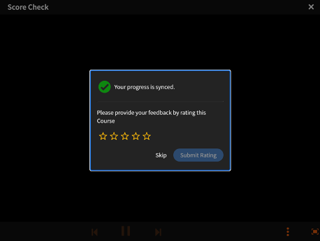
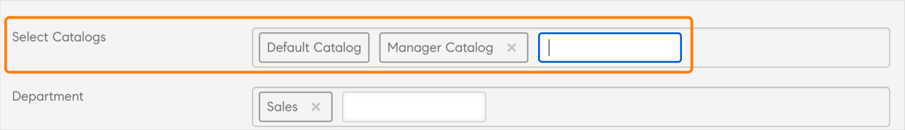

# Neue Funktionen in dieser Version (Juli 2023)

## Verbesserte Empfehlungen

Adobe Learning Manager hat ein neues und überarbeitetes Empfehlungssystem für Kurse eingeführt. Diese Empfehlungsfunktion nutzt KI-Algorithmen und Nutzerinteressen wie Produkte, Rollen und Stufen, um personalisierte Inhaltsempfehlungen bereitzustellen.

Weitere Informationen finden Sie unter [Empfehlungen in Adobe Learning Manager](recommendations-adobe-learning-manager.md).

## Mehrfachregistrierung

In dieser Version von Adobe Learning Manager führen wir eine Mehrfachregistrierung für Teilnehmende ein, die Teilnehmenden ermöglicht, sich in mehr als einer Instanz eines Kurses in einem oder verschiedenen Zeiträumen zu registrieren.

Weitere Informationen finden Sie unter [Mehrere Registrierungen](/help/migrated/authors/feature-summary/courses.md).

### Mehrfachregistrierungen in der mobilen App oder immersiv

Teilnehmende können sich nicht über eine mobile App/immersiv für mehrere Instanzen registrieren. Die Mehrfacheinschreibung wird in der mobilen App und im immersiven mobilen Web nicht unterstützt.

>[!NOTE]
>
>Wenn Sie die Mehrfachregistrierung aktivieren, werden dem Teilnehmertranskriptbericht für jeden Kurs mehrere Zeilen hinzugefügt (eine Zeile für jede Instanz).
>
>Wenn Sie die Berichtsautomatisierung eingerichtet haben, die nur eine Zeile pro Kurs vorwegnimmt, müssen Sie die erforderlichen Anpassungen an der Berichtsautomatisierung vornehmen, bevor Sie die Funktion zur Mehrfacheinschreibung aktivieren.

### Format der Abzeichen in einer Instanz mit mehreren Registrierungen

Um Abzeichen in einer Instanz mit mehreren Registrierungen zu unterstützen, wird das Abzeichenformat in `userId_badgeId_COURSE_courseId_courseInstanceId`.

### Starten des Players mit mehreren Registrierungen mithilfe eines Headless-Modus

In dieser Version haben wir die Bibliothek geändert, die für die Kommunikation mit dem Headless-Player verwendet wird.

Bei der Mehrfachregistrierung müssen Sie die Argumente übergeben, die in ein Objekt eingeschlossen sind.

```
{{startplayer(argument_object) ,
where
argument_object=
{ loId = <loId>, accountId = <accountId>, userId =<userId>, accessToken = <accessToken>, domId = <elementId>, onModuleLoaded = fn(), isMultiEnrolled=<boolean>, instanceId=<instanceId> }
}}
```

## Abschaffung des exavault-Connectors

Diese Version von Adobe Learning Manager enthält einen neuen Connector, der das SFTP-Protokoll der AWS Transfer-Familie verwendet.

Diese Änderung ersetzt auch den ExaVault-Connector, der neuen Benutzer(inne)n nicht mehr zur Verfügung steht. Sie können jeden Open-Source-FTP-Client als Ersatz für ExaVault verwenden. Weitere Informationen finden Sie unter [Übergang vom Adobe FTP Manager](transition-from-ftp-manager.md).

## Erinnerungen in Outlook für Unterrichtsräume und virtuelle Sitzungen

In Adobe Learning Manager erstellte Klassenzimmer- und virtuelle Klassenzimmersitzungen, die dem Outlook-Kalender des Teilnehmers hinzugefügt wurden, unterstützen jetzt Erinnerungen aus Outlook konsistent (ähnlich wie Erinnerungen in Outlook).

## Verbesserungen beim Zuweisen von Kenntnissen zu Kursen

Wir haben den Arbeitsablauf für die Zuweisung von Kenntnissen für Autoren verbessert. Die Liste der Kenntnissevorschläge auf der Kurseinstellungen-Seite enthält jetzt eine Typeahead-Suchfunktion. Autoren können jetzt nach Kenntnissen suchen, indem sie die ersten Zeichen eingeben, und Vorschläge werden basierend auf der Eingabe in der Kenntnisse-Dropdown-Liste angezeigt. Dank dieser Verbesserung müssen Autor(inn)en nicht durch die vollständige Liste blättern, um Kenntnisse zu suchen und sie Kursen zuzuweisen.

## Verbesserungen des vom Manager genehmigten Kursarbeitsablaufs

Von einem Manager genehmigte Kurse stellen jetzt sowohl Manager(inne)n als auch Teilnehmenden geeignete Fehlerinformationen zur Verfügung.


Manager(innen) können jetzt relevante Fehlermeldungen mit Informationen anzeigen (z. B., das die Registrierungsfrist abgelaufen ist), wenn sie eine Kursanforderung nicht genehmigen können. Teilnehmenden werden der Fehler und die Abhilfemaßnahme angezeigt.

## Neuer Lernplanbericht

Administrator(inn)en/benutzerdefinierte Administrator(inn)en können jetzt eine Liste aller Lernpläne im Konto und Metadaten wie Status, relevante Benutzergruppen, Auslöserinformationen, Kurse/Lernpfade im Lernplan und Erinnerungsinformationen exportieren.

## Bericht zum Verfolgen anstehender eingestellter Instanzen

Der Schulungsbericht enthält eine zusätzliche Spalte, in der der Fristablauf der in den Kursen oder Lernpfaden vorhandenen Instanzen angezeigt wird, sodass Administrator(inn)en und Autor(inn)en wissen, welche Instanzen eingestellt werden, und die erforderlichen Maßnahmen ergreifen können.

## Verbesserungen zum Erfassen von Kursbewertungen von Teilnehmern

Ein Popup-Fenster zum Erfassen der Sternebewertung für einen Kurs wird angezeigt, sobald die/der Benutzer(in) das letzte Modul im Kurs abgeschlossen hat.



## E-Mail-Vorlagen anpassen

E-Mail-Vorlagen im Learning Manager enthalten jetzt vollständig bearbeitbare Abschnitte, was eine größere Flexibilität bei der Anpassung der E-Mail-Kommunikation basierend auf Messaging- und Branding-Präferenzen bietet.

Weitere Informationen finden Sie unter [E-Mail-Vorlage anpassen](/help/migrated/administrators/feature-summary/email-templates.md#flexibility-in-customizing-the-templates).

## Verbesserungen für den Planungsassistenten

Optimieren Sie den Prozess der Auswahl eines Kursleiters für Klassenzimmer oder virtuelle Sitzungen. Dem Feld &quot;Kursleiter&quot; im Planungsassistenten wurde ein Benutzergruppenfilter hinzugefügt. Autoren können Kursleiter jetzt basierend auf &quot;Kursleiterkenntnisse&quot; und beliebigen zusätzlichen Parametern wie Standort, Sprache, Bezeichnung usw. filtern.

Weitere Informationen finden Sie unter [Benutzergruppenfilter im Planungsassistenten](/help/migrated/authors/feature-summary/courses.md#user-group-filter).

## Verbesserungen am Arbeitsablauf für das Einstellen von Lernobjekten

Autor(inn)en können jetzt ein **Automatisch einstellen**-Datum für einen Kurs angeben. Dies hilft, eine Kataloginflation im Laufe der Zeit und die Notwendigkeit, Kurse manuell einstellen zu müssen, zu verhindern.

Administratoren können auch auf Kontoebene die Art des Zugriffs auf eingestellte Lernobjekte festlegen.

Der Schulungsbericht enthält eine neue Spalte, **Automatisches Abgangsdatum**, um das Einstellungsdatum für jedes Lernobjekt anzuzeigen (sofern festgelegt).

## Katalogbeschriftungswerte nach Autoren

Autor(inn)en können jetzt ihre Werte für Katalogbeschriftungen beim Erstellen oder Bearbeiten eines Kurses hinzufügen. Administrator(inn)en können diese Funktion auf Kontoebene aktivieren. Nachdem ein(e) Autor(in) einen neuen Katalogbeschriftungswert hinzugefügt hat, wird er Teil der Typeahead-Suche.



## Verbesserungen an der Kurssuche für Administrator-, Autoren- und Managerrollen

Es wurden Suchverbesserungen für Administrator-, Autor- und Manager-Rollen vorgenommen. Sie können jetzt mit Stichwörtern nach den Titeln suchen. Dies gilt für Kurse, Lernpfade und Zertifizierungen.

## Benachrichtigungen für Migrationsfehler

Integrations-Administrator(inn)en werden per E-Mail benachrichtigt, wenn bei Import- oder Exportvorgängen während der Migration oder bei Verwendung von Daten-Connectors wie PowerBI, FTP, Box usw. Fehler auftreten.

## Konfiguration mehrerer Manager über APIs

Der “Verwaltetes Büro“-Gruppe von APIs wurde eine neue API zur Unterstützung der Konfiguration mehrerer Manager(innen) hinzugefügt.

## Verbesserungen an der Registrierungs-API

Die Registrierungs-API wurde verbessert, um Massenregistrierungen in großem Umfang zu unterstützen und zu optimieren.

## Mobile App - Anzeigen von Inhalten offline

Teilnehmer können Inhalte im Offline-Modus herunterladen und nutzen. Verschachtelte und flexible Lernpfade werden für die Offline-Ansicht nicht unterstützt.

*In dieser Version wird die Offline-Inhaltsanzeige nur für englische Inhalte unterstützt.*

## Eingabehilfen

Es wurden mehrere Verbesserungen der Barrierefreiheit implementiert, einschließlich Verbesserungen zur Optimierung der Lesbarkeit für Bildschirmleseprogramme.

## Unterstützung für mobile Apps

Mit der nächsten Hauptversion unterstützt die mobile Adobe Learning Manager-App nur die drei neuesten mobilen Betriebssystemversionen.

## Inhalte auf LinkedIn

LinkedIn-Inhalte werden in der Immersive-App im Safari-Browser nicht wie erwartet geladen. Um dieses Problem zu umgehen, führen Sie die folgenden Schritte aus:

1. Wählen Sie auf dem Gerät **[!UICONTROL Einstellungen]** > **[!UICONTROL Safari]**.
1. Deaktivieren Sie **Site-übergreifendes Tracking verhindern**.
1. Deaktivieren Sie **Alle Cookies blockieren**.
1. Melden Sie sich bei der Immersive-App an.
1. Spielen Sie den Inhalt ab.
1. Lassen Sie die Popups zu.

## Sonstige Verbesserungen

### Wechseln von Instanzen in MS Teams

Teilnehmende können bis zu deren Abschluss zu einer anderen Kursinstanz wechseln und den Kursfortschritt beibehalten.

### Unterstützung mehrerer Anmeldungen in MS Teams

Teilnehmende können sich unabhängig vom Abschlussstatus in allen vorherigen Instanzen in einer anderen Kursinstanz registrieren. So können sich Teilnehmende in mehreren Instanzen desselben Kurses registrieren.

### Kurshinweise unterstützen die Mehrfachregistrierung in MS Teams

Kurshinweise sind auf Kursinstanzebene verfügbar, um die Mehrfachregistrierung zu unterstützen.

## API-Änderungen

Weitere Informationen zu den API-Änderungen finden Sie unter [API-Referenz für Adobe Learning Manager](https://captivateprime.adobe.com/docs/primeapi/v2/).

### API-Unterstützung für neue Empfehlungen

**GET /account**

Gibt zurück, ob prlRecommendations aktiviert ist.

**Anfrage**

`https://learningmanagerstage1.adobe.com/primeapi/v2/account`

**GET /data?filter.recommendationCriteria=product**

Gibt die Liste der Produkte/Themen zurück. Die Ergebnisse hängen von den Kontoeinstellungen ab, die bestätigen, ob alle Produkte für die/den Teilnehmende(n) oder den Katalog sichtbar sind, die/der für Produkte/Themen sichtbar ist.

**Anfrage**

`https://learningmanagerqe.adobe.com/primeapi/v2/data?filter.recommendationCriteria=product&filter.showAllRecommenda`

**`GET /data?filter.recommendationCriteria=role`**

Gibt die Liste der empfohlenen Rollen zurück.

**Anfrage**

`https://learningmanagerqe.adobe.com/primeapi/v2/data?filter.recommendationCriteria=role&filter.showAllRecommendationCriteria=false`

**`GET /data?filter.recommendationCriteria=level`**

Gibt die Liste der empfohlenen Rollen zurück.

**Anfrage**

`https://learningmanagerqe.adobe.com/primeapi/v2/data?filter.recommendationCriteria=level&filter.showAllRecommendationCriteria=false`

**POST /search/query**

Die Suche umfasst auch Produkte und Rollenparameter in der Abfrage. Abfrage und Text werden nicht geändert. Wir werden neue Sortieroptionen hinzufügen.

**Anfrage**

`https://learningmanagerstage1.adobe.com/primeapi/v2/search/query?...`

**GET /learningObjects**

Das Lernobjektmodell gibt Empfehlungen mit dem Tag &quot;Autor&quot; zurück, wenn die PRL-Empfehlung live ist.

**Anforderungs-URL**

`https://learningmanagerstage1.adobe.com/primeapi/v2/learningObjects?sort=recommendationScore&filter.recommendationProducts=...&filter.recommendationRoles=...&filter.excludeIgnoredRecommendations=true`

POST /learningObjects/query

Die folgenden Attribute werden im Hauptteil des Abfrageaufrufs unterstützt:

```javascript {line-numbers="true"}
{
  "filter.announcedGroups": [
    "string"
  ],
  "filter.bookmarks": true,
  "filter.catalogIds": [
    "string"
  ],
  "filter.cityName": [
    "string"
  ],
  "filter.duration.range": [
    "string"
  ],
  "filter.effectiveModifiedDate.fromDate": "string",
  "filter.effectiveModifiedDate.toDate": "string",
  "filter.excludeIgnoredRecommendations": true,
  "filter.ignoreEnhancedLP": true,
  "filter.ignoreHigherOrderLOEnrollment": true,
  "filter.lang.subLOs": true,
  "filter.lang.twoLetterCode": true,
  "filter.learnerState": [
    "string"
  ],
  "filter.loFormat": [
    "string"
  ],
  "filter.loTypes": [
    "string"
  ],
  "filter.price": "string",
  "filter.priceRange": [
    "string"
  ],
  "filter.recommendationLevels": [
    "string"
  ],
  "filter.skill.level": [
    "string"
  ],
  "filter.skillName": [
    "string"
  ],
  "filter.tagName": [
    "string"
  ],
  "language": [
    "string"
  ],
  "preferredSortPartitionOrder": [
    "string"
  ],
  "showLoContentSource": true,
  "useCache": true,
  "filter.recommendationProducts": [
    {
      "levels": [
        "string"
      ],
      "name": "string"
    }
  ],
  "filter.recommendationRoles": [
    {
      "levels": [
        "string"
      ],
      "name": "string"
    }
  ]
}
```

**GET /recommendationProducts**

Ruft das PRL-Produkt nach recommendationProduct-Id ab.

**Anforderungs-URL**

`https://learningmanagerstage1.adobe.com/primeapi/v2/recommendationProducts`

GET /recommendationRoles

Ruft das PRL-Produkt nach recommendationProduct-Id ab. Es werden nur sichtbare Rollen von (Lernobjekten) zurückgegeben.

**Anforderungs-URL**

`https://learningmanagerstage1.adobe.com/primeapi/v2/prlRecommendations/roles`

`POST /users/{id}/recommendationPreferences`

Erstellen/Neuerstellen (Überschreiben) von PRL-Empfehlungsvoreinstellungen Beispiel-Nutzlast:

```javascript {line-numbers="true"}
{
    "data": {
        "id": "userRecommendationPreferences:14755328",
        "type": "userRecommendationPreferences",
        "attributes": {
            "products": [
                {
                    "id": "recommendationProduct:1",
                    "dateCreated": "2023-05-07T20:00:00.000Z"
                },
                {
                    "id": "recommendationProduct:37",
                    "dateCreated": "2023-05-07T21:00:00.000Z"
                }
            ],
            "roles": [
                {
                    "id": "recommendationRole:23",
                    "dateCreated": "2023-05-07'T'21:00:00.000'Z'"
                },
                {
                    "id": "recommendationRole:1",
                    "dateCreated": "2023-05-07'T'20:01:00.000'Z'"
                },
                {
                    "id": "recommendationRole:2",
                    "dateCreated": "2023-05-07'T'19:02:00.000'Z'"
                },
                 {
                    "id": "recommendationRole:3",
                    "dateCreated": "2023-05-07'T'18:02:00.000'Z'"
                },
                {
                    "id": "recommendationRole:20",
                    "dateCreated": "2023-05-07'T'17:02:00.000'Z'",
                    "levels": [
                        "INTERMEDIATE"
                    ]
                }
            ]
        }
    }
}
```

**`GET /users/{id}/recommendationPreferences`**

**Anforderungs-URL**

`https://learningmanagerstage1.adobe.com/primeapi/v2//users/123/recommendationPreferences`

**`DELETE /users/{id}/recommendationPreferences`**

Löscht die Benutzereinstellungen für PRL-Empfehlungen für ein Produkt oder eine Rolle.

**Anforderungs-URL**

`https://learningmanagerstage1.adobe.com/primeapi/v2/users/123/recommendationPreferences?ids=recommendationRole:123,recommendationRole:234`

Parameter:

IDs = Liste der zu löschenden IDs

**PATCH /users/{id}/recommendationPreferences**

Teilweise Hinzufügung/Aktualisierung. Beispiel-Nutzlast:

```javascript {line-numbers="true"}
{
  "data": {
    "id": "userRecommendationPreferences:<USER_ID>",
    "type": "userRecommendationPreferences",
    "attributes": {
      "roles": [
        {
          "id": "recommendationRole:123",
          "type": "recommendationRole",
          "attributes": {
            "levels": [
              "INTERMEDIATE"
            ]
          }
        },
        {
          "id": "recommendationRole:123",
          "type": "recommendationRole",
          "attributes": {
            "levels": [
              "ADVANCED"
            ]
          }
        }
      ]
    }
  }
}
```

**POST /recommendationPreferences/learningObjects/{id}/ignore**

Fügen Sie gesperrten Empfehlungen LO hinzu.

**Anforderungs-URL**

`https://learningmanagerstage1.adobe.com/primeapi/v2/recommendationPreferences/learningObjects/{id}/ignored`

**`DELETE /recommendationPreferences/learningObjects/{id}/ignore`**

Löscht LO aus gesperrten Empfehlungen.

**Anforderungs-URL**

`https://learningmanagerstage1.adobe.com/primeapi/v2/recommendationPreferences/learningObjects/{id}/ignored`

**`GET /users/{id}/recommendationStrips`**

Ruft alle Streifen ab, die zum Anzeigen von PRL-Empfehlungen verwendet werden sollen

### Unterstützung mehrerer Registrierungen für API

**GET /primeapi/v2/account**

Zwei neue Attribute werden hinzugefügt:

* instanceSwitchEnabled
* multiEnrollmentEnabled

**GET /users/{userId}/userNotifications**

Die Kursinstanz-ID wurde in Benachrichtigungen im neuen Metadatenattribut hinzugefügt.

**GET /learningObjects**

In der Registrierungsbeziehung wird nur die primäre Registrierung angezeigt, d. h. die zuerst registrierte oder zuerst abgeschlossene Registrierung.

**`GET /learningObjects/{id}`**

In der Registrierungsbeziehung wird nur die primäre Registrierung angezeigt, d. h. die zuerst registrierte oder zuerst abgeschlossene Registrierung.

**`GET /learningObjects/{loId}/instances/{loInstanceId}`**

Dem LO-Instanzmodell wird eine neue Beziehung hinzugefügt.

**`GET /enrollments/{id}`**

Abrufen der Registrierung für Kurse mit mehreren Registrierungen.

**`DELETE /enrollments/{id}`**

Hebt die Registrierung für eine bestimmte Lernobjektinstanz auf.

**POST /Registrierungen**

Unterstützt die Registrierung in verschiedenen Instanzen.

**GET /enrollments**

Ruft Registrierungen nur für primäre Registrierungen für das Lernobjekt ab.

**`GET /learningObjects/{id}/note`**

Ruft eine Liste mit Notizen für einen Kurs ab.

**`GET /learningObjects/{lo_id}/instances/{loi_id}/note`**

Ruft eine Liste mit Notizen für einen Kurs und die Instanz ab.

**`GET /learningObjects/{id}/resources/{loResourceId}/note`**

Ruft eine Liste mit Notizen für eine Ressource in einem Kurs ab.

**`POST /learningObjects/{id}/resources/{loResourceId}/note`**

Fügt eine Notiz in einem Modul für einen Kurs für einen bestimmten Kurs hinzu.

**`DELETE /learningObjects/{id}/resources/{loResourceId}/note/{noteId}`**

Löscht bestimmte Notizen aus einem gegebenen Modul für eine bestimmte Instanz (Teil der loResource-ID).

**`GET /learningObjects/{id}/resources/{loResourceId}/note/{noteId}`**

Ruft eine bestimmte Notiz in einem Modul in einem Kurs für eine bestimmte Instanz ab (Teil von loResourceId).

**`PATCH /learningObjects/{id}/resources/{loResourceId}/note/{noteId}`**

Aktualisiert bestimmte Notizen aus einem gegebenen Modul für eine bestimmte Instanz (Teil der loResource-ID).

**Änderungen an der Admin-API**

* GET /users/{id}/enrollments
* POST /users/{id}/enrollments
* DELETE /users/{id}/enrollments/{enrollmentId}
* PATCH /users/{id}/enrollments/{enrollmentId}

### Erzwungene Felder für Endpunkte

Produkte und Rollen werden nur geladen, wenn sie erzwungen werden.

Beispielanforderung

* GET `https://learningmanagerstage1.adobe.com/primeapi/v2/learningObjects/course%3A7418798?enforcedFields[learningObject]=products`
* GET `https://learningmanagerstage1.adobe.com/primeapi/v2/users/11255638/userBadges?include=model&page[offset]=0&page[limit]=10&sort=dateAchieved&enforcedFields[learningObject]=products,roles`

### API-Änderungen in der Stemmingimplementierung für die Suche (englisches Gebietsschema)

Wortstamm ist der Prozess, bei dem ein Wort auf seine Grundform reduziert wird. Dadurch wird sichergestellt, dass die Varianten eines Wortes bei einer Suche übereinstimmen. Gehen und Gehen können beispielsweise auf das gleiche Wort wie im Stamm zurückgeführt werden: Gehen. Nach dem Wortstamm würde ein Vorkommen eines der Wörter dem anderen in einer Suche entsprechen.

In dieser Version haben wir Stemming für englische Gebietsschemas hinzugefügt, der die folgenden Varianten enthält: en_US, en_AU, en_GB.

Das Attribut „stemmed“ gibt an, ob Stemming in den Suchergebnissen erforderlich ist. Dieser Wert ist standardmäßig auf &quot;False&quot; festgelegt.

API-Abfrageparameter:

* matchType=phrase_and_match
* stemmed=true

### Entfernen von V1-Endpunkten

V1-APIs funktionieren ab dieser Version nicht mehr. Weitere Informationen finden Sie im [Entwicklerhandbuch](/help/migrated/integration-admin/feature-summary/developer-manual.md).

### Benachrichtigungen für die Kursregistrierung oder -abmeldung

Diese Version bietet Unterstützung für die Kursinstanzen-ID mit Benachrichtigungen im neuen Metadatenattribut.

### L1-Feedback-Unterstützung

Ermöglicht den Teilnehmenden, auf jeder Instanzebene des Features Mehrfachregistrierung Feedback zu geben.

**API:** `POST /enrollments/{id}/l1Feedback`

### LO-erzwungene Feldliste

In dieser Version müssen Sie Abschnitte, prequisiteConstraints, prerequisiteLOs, subLOs, additionalResources, additionalLOs, Instanzen, catalogLabels explizit an das learningObject senden.

Beispiel:

`enforcedFields[learningObject]=prerequisiteLOs,instances`

### Hinweis zum Verwerfen für die nächste Version

* Überschreiben-Flag für Teilnehmenden-APIs.
* Wir ändern den Standardwert für highlightResults=false. Außerdem ändern wir den Standard von snippetType=courseName.
* Wir verwerfen matchType=bool im Suchendpunkt.
* autoCompleteMode verfügt über das Attribut [Veraltet] -Tag und um dieselbe Funktionalität von autoCompleteMode =false bereitzustellen, wurde ein matchType mit dem Namen Match hinzugefügt.

### Abzeichen-ID-Format mit mehrfacher Registrierung

Um Abzeichen mit mehreren registrierten Instanzen zu unterstützen, ändern wir das Format von Kursabzeichen von `userId_badgeId_COURSE_courseId to userId_badgeId_COURSE_courseId_courseInstanceId` zur eindeutigen Identifizierung von Abzeichen.

## Versionshinweise

Weitere Informationen zu aktuellen und früheren Versionen der Learning Manager-Webanwendung und -Geräte-App finden Sie unter [Versionshinweise](/help/migrated/release-note/release-notes.md).

## Bekannte Probleme oder Einschränkungen in dieser Version

Im Folgenden sind die Einschränkungen dieser Version aufgeführt:

### Anzeigen von Offline-Inhalten in der mobilen App

Folgendes wird beim Anzeigen von Offline-Inhalten in der App nicht unterstützt:

* Flexible Kurse, Lernpläne oder Zertifizierungen.
* Erweiterte Kurse, Lernpläne oder Zertifizierungen.
* Für mehrere Quiz aktivierte Kurse, Lernpläne oder Zertifizierungen.
* Harvard Manage Mentor, Content Marketplace, GetAbstract oder LinkedIn Courses, Learning Plans oder Certifications.
* Lernpläne und Zertifikate mit aktivierten Voraussetzungen.
* Eingestellte Kurse, Lernpläne oder Zertifizierungen.
* Kurse, Lernpläne oder Zertifizierungen, deren Frist abgelaufen ist.
* Externe Zertifikate.
* E-Commerce-fähige Kurse, Lernpläne oder Zertifizierungen.

Bei den folgenden Lernpfaden, Kursen oder Zertifizierungen gibt es einige Probleme mit der Offline-Synchronisierung:

* Alle Lernpfade.
* Alle internen Zertifikate.
* Inhalt mit POST-Aufrufen.

### Empfehlungen

Folgende Komponenten werden im neuen Empfehlungssystem nicht für Produkt/Rolle/Ebene unterstützt:

* Adobe Experience Manager, Teams, SFDC und Teilnehmende ohne Anmeldung.
* Die mobile App unterstützt nicht das Bearbeiten von Produkten und Rollen auf der Empfehlungsseite.
* Die Zuordnung ist während der Migration nicht möglich.
* Automatisches Tagging von LinkedIn, Inhalts-Marketplace und anderen externen Kursen, Lernplänen oder Zertifizierungen.
* Rückkehr zu „Kenntnisbasiert“ oder „Klassisch“ nach der Live-Schaltung.
* Das Suchmenü für Produkte und Rollen in der Teilnehmer-App.
* Massen-Zuordnung von Kursen, Lernplänen oder Zertifizierungen und Benutzern in der Admin-App.

## Systemanforderungen

[Systemanforderungen für Learning Manager](/help/migrated/system-requirements.md)
