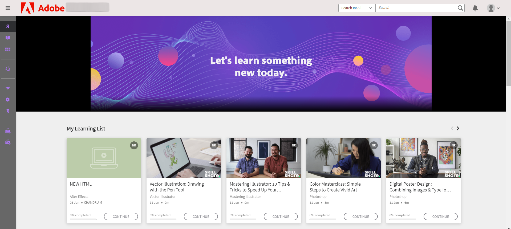

# Neue Funktionen in dieser Version {#whatsnewandchanged}

Erfahrt mehr über die neuen Funktionen und Verbesserungen im Juli 2024 Release von Adobe Learning Manager.

## Verbesserung im Compliance-Dashboard

### Was ist ein Compliance-Dashboard? {#whatiscompliancedashboard}

Das **[!UICONTROL Compliance-Dashboard]** in **Adobe Learning Manager** ermöglicht es Managern, den Fortschritt der Teilnehmer in Bezug auf ihre Lernziele zu überwachen und zu überwachen. Sie können überprüfen, ob Die Team-Mitglieder Termine einhalten und mit ihrem Lernprozess Schritt halten, um die Compliance zu gewährleisten. Der Administrator kann das Compliance-Dashboard einrichten und an die Manager weitergeben.

Um auf das Compliance-Dashboard in der Admin-Applikation zuzugreifen, wähle **[!UICONTROL Reports]** > **[!UICONTROL Learning Summary]** > **[!UICONTROL Compliance Dashboard aus]**.

### Änderungen im Release

Mit dem erweiterten Compliance-Dashboard können Administratoren und Manager Kurse, Lernpfade oder Zertifizierungen in Bezug auf ihre spezifische Kategorie (z. B. Vertrieb, Marketing und Rechtsabteilung) anzeigen. Administratoren können benutzerdefinierte Compliance-Kurse in bestimmte Kategorien kategorisieren. Benutzerdefinierte Compliance-Kategorien basieren auf Katalog-Labels.  Administratoren können ein Kurs-Dashboard erstellen und an Manager weitergeben. Manager können dann dasselbe Dashboard für ihre jeweiligen Instanzen anzeigen. Verbessert wurden auch die Benutzeroberfläche des Compliance-Dashboards und E-Mail-Benachrichtigungen zur Compliance.

#### Workflow

Die folgenden Schritte für die Verwendung des erweiterten Compliance-Dashboards:

| Rolle | Aufgabe | Zusatzinformation |
|---|---|---|
| Administration | Benutzerdefinierte Compliance-Labels erstellen | In diesem Artikel [erstellst du benutzerdefinierte Compliance-Labels](/help/migrated/administrators/feature-summary/reports.md#compliance-dashboard) für weitere Informationen. |
| Autor | Beschriftungen zu Kursen hinzufügen | Weitere Informationen findest du in diesem Artikel [. Füge Compliance-Labels zu Kursen, Lernpfaden und Zertifizierungen](/help/migrated/authors/feature-summary/courses.md#add-compliance-labels-to-courselearning-pathcertification) hinzu. |
| Administration | Erstellt das Dashboard mit dem Compliance-Kurs, und gebt es an Manager weiter. | Weitere Informationen findest du in diesem Artikel [. Erstelle und teile ein Compliance-Dashboard](/help/migrated/administrators/feature-summary/reports.md#create-and-share-a-compliance-dashboard) . |
| Manager | Compliance-Dashboard anzeigen | Weitere Informationen findest du in diesem Artikel [zum Compliance-Status](/help/migrated/managers/feature-summary/manager-dashboard.md#compliance-status) . |

## Benutzeroberfläche des Teilnehmers wird überarbeitet.

>[!IMPORTANT]
>
>Die neue Benutzeroberfläche für Teilnehmer wird in Phasen veröffentlicht.

Die **Benutzeroberfläche** der Teilnehmer wurde mit einem eleganteren und moderneren Design aktualisiert. Die **[!UICONTROL Landingpages &quot;Learner Home]**&quot;, **[!UICONTROL &quot;My Learning&quot;, &quot;My Learning]**&quot;, **[!UICONTROL &quot;Catalog]**&quot; und **[!UICONTROL &quot;Course Overview]** &quot; erhalten einen neuen und modernen Look. Kurskarten haben auch ein neues Design, um Details auf moderne Weise anzuzeigen. Die Mauszeiger auf einer Kurskarte zeigen die Kursbeschreibung und das Veröffentlichungsdatum an.

>[!NOTE]
>
>Die überarbeitete Benutzeroberfläche gilt nur für das immersive Layout. Diese Änderungen werden im Mobilen Web oder in der App noch nicht unterstützt und in einem zukünftigen Release aktualisiert.


_Alte Benutzeroberfläche_


_Neue Benutzeroberfläche_

### Was sich in dieser Version ändert

**Look-and-Feel modernisieren.**

Die neuen, aufgefrischten visuellen Elemente passen sich an moderne Design-Trends an, sodass das Produkt intuitiv und ansprechend wirkt. Dazu gehören ein neuer Kopf, ein Seitenfenster und moderne Widgets.

**Verbessertes Anwendererlebnis.**

Teilnehmer erhalten nun eine ähnliche Kartenansicht auf den Seiten Homepage, Katalog, Mein Lernen und Kursüberblick, die ein einheitliches Erlebnis bieten.

Weitere [Informationen findest du auf der Startseite](/help/migrated/learners/feature-summary/learner-home-page.md) der Teilnehmer.

**Änderungen an Kursveröffentlichungsterminen**

Mit dieser Erweiterung werden die Veröffentlichungsdaten für LinkedIn- und Go1-Kurse, die in Adobe Learning Manager importiert wurden, die tatsächlichen Veröffentlichungsdaten an LinkedIn und Go1 sein. Sie können auch die tatsächlich veröffentlichten Termine für die LinkedIn- und Go1-Kurse auf der Benutzeroberfläche anzeigen. Weitere [Informationen findest du auf Kurskarten](/help/migrated/learners/feature-summary/learner-home-page.md#course-cards) .

## Updates für nicht angemeldete Erlebnisse

Das nicht angemeldete Erlebnis ermöglicht die Erstellung eines Echtzeiterlebnisses für nicht angemeldete Kunden. Dies dient als Landingpage für ihre Marketing-Kampagnen und bietet genügend Informationen, um Anmeldungen zu fördern.

### Was ändert sich in dieser Version?

Kunden können ein Premium-Abo erwerben, um diese hochgradig skalierbaren, nicht angemeldeten Erlebnisse zu erstellen. Dieses nicht protokollierte Erlebnis auf Basis des Schulungsdatenzugriffs](/help/migrated/integration-admin/feature-summary/connectors.md#training-data-access) bietet Mithilfe von [Adobe Learning Manager-APIs Echtzeitdaten zu Sitzbeschränkungen, Lizenzen, Wartezeiten und Wartelistenzählungen. Mit diesen APIs können Kunden nicht angemeldete Teilnehmer Such- und Filterfunktionen sowie eine vollständige Kursübersicht anbieten.

>[!NOTE]
>
>Bitte wende dich an das Support-Team oder CSAM, um das Premium-Abo zu erwerben.

## Unterstützung mehrerer Stock-Keeping Units (SKUs)

Teilnehmer können nun mehrere Kurse, Lernpfade oder Zertifizierungen in den Warenkorb legen und sie gemeinsam erwerben.

### Änderungen im Release

Früher konnten Teilnehmer jeweils nur einen Kurs kaufen. In dieser Version von **Adobe Learning Manager** können sie mit dem Warenkorb mehrere Kurse, Lernpfade oder Zertifizierungen gleichzeitig erwerben.

Diese Funktion ist nur in den Programmen der Teilnehmer (vorhandene Benutzeroberfläche, neue Benutzeroberfläche für Teilnehmer und immersive App für Smartphones und Tablets) verfügbar.

Warenkorb mit mehreren Artikeln in ALM anzeigen [](/help/migrated/learners/feature-summary/multi-item-cart.md)

## Unterstützung von HTML5-Inhalten in Fluidic Player

**Adobe Learning Manager** unterstützt jetzt das Hochladen von HTML5-Inhalten als .zip datei in die Content-Bibliothek. Nach dem Upload können diese Dateien als Module in einem Kurs enthalten sein. Autoren können auch die Abschlusskriterien für selbstgesteuerte HTML5-Module definieren, sodass der Abschluss entweder vom Teilnehmer markiert oder beim Start automatisch abgeschlossen werden kann.

### Was ändert sich in dieser Version?

Adobe Learning Manager unterstützt jetzt HTML5-gestützte Inhalte in kursbasierten Kursen. Autoren können HTML5-Inhalte als .zip datei zu selbst erstellten Inhalten hinzufügen. Teilnehmer können die HTML5-Inhalte im Fluidic Player anzeigen. Mit der neuen Funktion können Teilnehmer den Kurs nun direkt im Fluidic Player markieren, um kurse mit Selbststudium durchzuführen. Ansicht [. Füge html5-Dateitypen in der Inhaltsbibliothek](/help/migrated/authors/feature-summary/content-library.md#add-html5-file-type-in-the-content-library) hinzu, um weitere Informationen zu erhalten.

Mit der neuen Erweiterung wird der Kurs mit dem externen Link automatisch als abgeschlossen markiert, wenn der URL besucht wird, solange der Autor die Abschlusskriterien auf die neue Option **[!UICONTROL &quot;Inhalte]** starten&quot; gesetzt hat. Die neue Option **[!UICONTROL Abschlusskriterien]** wurde auf der Seite Aktivitätsmodul hinzugefügt, auf der der Autor die Abschlusskriterien für die externen Links festlegen kann. Ansicht [. Füge im Aktivitätsmodul](/help/migrated/authors/feature-summary/courses.md#add-html-link-in-the-activity-module) HTML Link hinzu, um weitere Informationen zu erfahren.


_Abschlusskriterien – Option-Aktivitätsmodul_

## Überfällige Push-Benachrichtigungen über die Mobile App

Teilnehmer erhalten Push-Benachrichtigungen, wenn sie einen Kurstermin verpassen. Mit dieser neuen Verbesserung haben Teilnehmer jetzt die Möglichkeit, eine Erinnerung entweder 24 Stunden lang zu noozieren oder nächste Woche für jede überfällige Erinnerung erinnert zu werden. Dies gilt nur für fristüberfällige Benachrichtigungen. Ansicht [Push-Benachrichtigung planen](/help/migrated/learners/feature-summary/user-notifications.md#schedule-the-push-notification)

## API-Änderungen in dieser Version

### API durchsuchen

Der Such-API umfasst die folgenden Änderungen:

Teilnehmer können über die API innerhalb von ```GET /search``` Katalogfiltern nach Tags suchen. Teilnehmer können die Tags durchsuchen, indem sie ```tag``` den Wert für ```filter.loTypes``` den Parameter auswählen.

**Curl-Beispiel**

```
curl -X GET --header 'Accept: application/vnd.api+json' --header 'Authorization: oauth 5a858f23924f4feafa38ae8d6c4d97b6' 'https://example.com/primeapi/v2/search?page[limit]=10&query=Business&autoCompleteMode=true&filter.loTypes=tag&sort=relevance&filter.ignoreEnhancedLP=true&matchType=phrase&persistSearchHistory=true&stemmed=false&highlightResults=true'
```

Die neuen Filter, die verfügbaren Plätze, die Warteliste und der Zeitbereichsfilter wurden zu den folgenden APIs hinzugefügt: ```GET /search``` und `GET /learningObjects`.

Die neuen Filter `filter.session.includeEnrollmentDeadline` wurden zu den folgenden API ```GET /search```hinzugefügt.

### Konto-API

Die neue Spalte `custom_injections``showComplianceLabel`, und `complianceLabelDefaultID` wurden im ```GET /account``` API hinzugefügt, um Kontodaten des Benutzerendpunkts zu erhalten.

### Lernobjekt-API

Die folgenden Änderungen am Lernobjekt API in diesem Update:

Die neue Antwort-Author-ID und weitere Details, die `GET /learningObjects` im `authorDetails` API hinzugefügt wurden. Außerdem wurde ein neuer Filter hinzugefügt, `filter.authors`um ältere Autoren und ihre Kurse zu filtern.

Das neue Attribut namens `effectivenessIndex` hilft Ihnen, die Kurseffektivitätsdaten zu erhalten.

**Curl-Beispiel**

```
curl --location 'https://example.com/primeapi/v2/learningObjects/course%3A9790045?enforcedFields%5BlearningObject%5D=effectivenessData' \
--header 'Accept: application/vnd.api+json' \
--header 'Authorization: oauth 598665ab5c8a99bea0e774d9faf7f3ca'
```

Die neue Antwort `whoShouldTake`, die Details darüber enthält, wer diesen Kurs belegen sollte, wurde den folgenden APIs hinzugefügt: `POST /learningObjects/query`, , `GET /learningObjects/{id}`und `GET /learningObjects`.

**Curl-Beispiel**

```
curl -X GET --header 'Accept: application/vnd.api+json' --header 'Authorization: oauth 28a83fb8c87579af8ebc4434cc80f0c0' 'https://example.com/primeapi/v2/learningObjects/course%3A1131255' 
```

Die neue Antwort `waitlistLimit`, die Details zur Einschränkung der Warteliste enthält, wurde dem `GET /learningObjects` API hinzugefügt.

Die neue Antwort `count` , die die Gesamtzahl der Lernobjekte ergibt, wurde zu den APIs `GET/ learningObjects` und `POST/ learningObjects/query`hinzugefügt.

Die neuen Antworten `catalogFieldId` `fieldValueId` und wurden in `GET/ learningObjects` API hinzugefügt`catalogLabels`.

Teilnehmer können die Katalogetikettenwerte in der API `GET /preview/learningObjects`abrufen.

### Neue API für die Anzahl der Marketplace-Erlebnisse

In dieser Version wurde eine neue API `GET /search/marketplace/count` hinzugefügt. So erhaltet ihr die Zählung der verfügbaren Lernobjekte auf dem Content-Markt.

**Curl-Beispiel**

```
curl -X GET --header 'Accept: application/vnd.api+json' --header 'Authorization: oauth d8631c7b0e3b5d2ae00422ef30aaecfc' 'https://example.com/primeapi/v2/search/marketplace/count?query=course'
```

**Beispielantwort**

```
{
  "count": 54910
}
```

### Lernobjektinstanzen API

Die folgenden Änderungen an der Lernobjektinstanz API in diesem Update:

In dieser Version wurde der Lernobjektinstanz `GET /learningObjects/{loId}/instances/{loInstanceId}`API ein neuer Schlüssel namens `gamificationEnabled` hinzugefügt.

**Curl-Beispiel**

```
curl --location 'http://example.com/acapapi/primeapi/v2/learningObjects/learningProgram:12756/instances/learningProgram:12756_15644' 
```

Das neue `gamificationSettings` Attribut zu den obigen API, um die Details der Gamification-Einstellungen zu erhalten. Beispiel: `GET /learningObjects/{loId}/instances/{loInstanceId}/gamificationSettings`.

**Curl-Beispiel**

```
curl --location 'http://example.com/acapapi/primeapi/v2/learningObjects/learningProgram:103852/instances/learningProgram:103852_103526/gamificationSettings'
```

Das neue `leaderboard` Attribut zu den obigen API, um die Details der Gamification-Einstellungen zu erhalten. Beispiel: `GET /learningObjects/{loId}/instances/{loInstanceId}/leaderboard`.

**Curl-Beispiel**

```
curl --location 'https://example.com/primeapi/v2/learningObjects/learningProgram:106339/instances/learningProgram:106339_105775/leaderboard' \
--header 'Accept: application/vnd.api+json' \
--header 'Authorization: oauth de4b5ee6efdd42375130db27ff503dd4'
```

### Änderungen an Versatzgrenzen

Um die Systemleistung zu verbessern und die Ressourcennutzung effektiver zu verwalten, hat Adobe hohe Offset-Werte im Endpunkt &quot;GET/Anwender&quot; sowohl für ADMIN als auch für TEILNEHMER deaktiviert. Wir empfehlen, die Jobs-API zu verwenden, um die Datensätze mit einem Versatzwert abzurufen.

### Veraltete APIs

Eine [kumulative Liste aller veralteten APIs im Produkt API-Deprecations in Adobe Learning Manager](/help/migrated/api-deprecations-list.md) anzeigen.

## Änderungen am Reporting

### Kompatibilitäts-Dashboard

In dieser Version enthält der Bericht zum Compliance-Dashboard zwei neue Spalten:

* Status
* Kompatibilitätstyp

Dies ist zusätzlich zu den bereits vorhandenen Spalten:

* Benutzername
* Benutzer-E-Mail
* LP/Zertifizierung/Kurs
* Typ
* Registrierungsdatum (UTC-Zeitzone)
* Termin (UTC-Zeitzone)
* Abschlussdatum (UTC-Zeitzone)
* Fortschritt %

### Schulungsbericht

Der Schulungsbericht in **Admin** > **Reports** > **Benutzerdefinierte Berichte** und die Jobs API **früher Spalten mit den** Bezeichnungen **Skill(s)** und **Tag(s) enthalten**. Diese Spalten werden jetzt in **&quot;Skills and Tags&quot; (Skills** and **Tags**) umbenannt.

### Content-Audit-Bericht

In dieser Version enthält der **[!UICONTROL Bericht &quot;Content Audit Trail]** &quot; jetzt die folgenden neuen Attribute in der Spalte &quot;Modifikationstyp&quot;:

* Anwendergruppe hinzufügen
* Benutzergruppe entfernen
* Eigenes Label hinzufügen
* Benutzerdefiniertes Etikett entfernen
* Freigegebener Katalog hinzufügen
* Freigegebener Katalog entfernen
* Aktualisierung freigegebener Kataloge

## Fehler in diesem Update behoben

**Einreichung von Aktivitäten**

* Der Versuch, eine Datei erneut in das Modul für die Einreichung von Aktivitäten hochzuladen, schlägt mit der Fehlermeldung 500 im Netzwerkaufruf fehl.

**API**

* Die Erstellung eines Connect VC-Meetings schlägt fehl, wenn mehrere Lehrkräfte dieselbe E-Mail-Adresse haben.
* Nach der Anmeldung für einen Lernpfad zeigt die MS Teams VC auf der Übersichtsseite eine falsche URL an.
* Der vorsignierte Anwenderbericht URL, der im Rahmen des Auftrags API Antwort bereitgestellt wird, endet nach sechs Stunden.
* Während der Erstellung eines Anmeldeberichts für einen Kurs wird in der Spalte &quot;Kursname&quot; ein falscher Kursname angezeigt.
* Der Migrationsmitarbeiter sendet beim Aufruf des Großteils der API nicht die eindeutige Lo-ID für den Kurs, aber die ID wird entfernt.
* Wenn ein Kurs in einem bestimmten Katalog enthalten ist, auf den ein Anwender zugreifen kann (während der Standardkatalog deaktiviert ist), kannst du trotz der Einstellung, die verhindert, dass nicht abgerollte Teilnehmer den Kurs anzeigen, die Metadaten des Kurses über den Endpunkt &quot;LearningObject/ID&quot; abrufen.
* Der Skills-Filter funktioniert nicht wie erwartet, wenn der Skillname im Namen im GET/learningObject API Kommas hat.
* Im Datenspeicherungs-Worker für SFTP gibt es Inkonsistenzen in den Zeitstempel-Metadaten der Datei.
* Wenn ein Connector entfernt und neu konfiguriert wurde, scheint der Projektmigrationsstatus geschlossen zu sein.
* Der Schulungsbericht hat &quot;Tag(s)&quot; als Spaltenüberschrift anstelle von &quot;Tags&quot;.
* Der Commerce-Connector-Export schlägt fehl, wenn der Katalog deaktiviert wurde und wenn einer der exportierten Kurse nur Teil des deaktivierten Katalogs ist.

**Zertifizierung**

* Manchmal schlägt die erneute Anmeldung eines Anwenders für eine wiederkehrende Zertifizierung fehl.

**Benutzerdefinierte Rolle**

* In einigen Fällen wird Fehler 403 angezeigt, wenn ein benutzerdefinierter Administrator versucht, in eine Lehrerrolle zu wechseln.

**E-Mail-Vorlage und Benachrichtigung**

* Die E-Mail-Benachrichtigungen, nachdem eine Sitzung abgebrochen wurde, werden nicht an die letzte Gruppe von Kursleitern gesendet, wenn die Kursleiter aus der Sitzung entfernt wurden.
* Der Organisator erhält keine E-Mail-Benachrichtigungen für MS Teams nach der Erstellung einer virtuellen Schulung mit Kursleiter. Erst nach Veröffentlichung des Kurses und aktivierten E-Mail-Vorlagen werden die E-Mails ausgelöst.
* Manchmal besteht eine E-Mail-Vorlage aus einem falschen Datumsformat und einer falschen Übersetzung.

**Teilnehmer**

* Wenn ein Teilnehmer an mehreren Instanzen eines Kurses angemeldet ist und sie den Anwesenheitsbericht herunterladen, enthält der Bericht falsche Informationen.
* Ein Anwender kann die privaten Posts eines anderen Benutzers anzeigen, wenn er zu einer öffentlichen Story hinzugefügt wurde.
* In einigen Fällen ist es Ihnen nicht möglich, Teilnehmer aus einer Zertifizierung abwickeln zu können. Beim Abrollen wird eine Fehlermeldung angezeigt.
* Eine Zertifizierung wird auch nach der Auswahl eines Kurses als abgeschlossen gekennzeichnet.
* Ein Administrator ist nicht in der Lage, einen VC als abgeschlossen zu markieren, wenn die Endzeit der Sitzung in ein vorheriges Datum geändert wurde.
* Der Sitzungsteilnahmebericht wird für Teilnehmer, die auf einer Warteliste stehen, als &quot;Nicht berücksichtigt&quot; angezeigt.

**Teilnehmer-App**

* Nachdem du die Kursnotizen als PDF heruntergeladen hast, werden die Notizen zufällig angezeigt. Sie befolgen nicht die Reihenfolge.

**Lernpfad**

* Nachdem du eine Fertigkeit in einem Lernpfad ausgewählt hast, wird das Dropdown-Menü nicht wie erwartet angezeigt, wenn du das Textfeld auswählst.
* In einigen Fällen ist es nicht möglich, Fähigkeiten aus einem Lernpfad zu entfernen.

**Lernprogramm**

* Wenn ein flexibles Lernprogramm über viele Kurse verfügt, wird der Lernplan auch dann nicht abgeschlossen, nachdem ein Administrator ihn markiert hat.
* Die Spalte last_modified_by im Anmeldebericht wird nicht aktualisiert, wenn ein Teilnehmer Instanzen ändert.

**Bericht**

* In einigen Fällen kann ein Administrator den Schulungsbericht nicht exportieren.
* Wenn ein SCORM-Inhalt Fragen oder Antworten mit mehr als 32.767 Zeichen enthält, ist es nicht möglich, den Kurs-Testbericht in Excel herunterzuladen.
* Nachdem du &quot;Gamification zurücksetzen&quot; ausgewählt hast, wird das Datum der erreichten Stufe nicht zurückgesetzt.

**Suche**

* Nach dem Exportieren aller Benutzergruppen sind gelöschte Benutzergruppen derzeit auch in der Ausgabe verfügbar.
* Aufgrund gelegentlicher Suchprobleme ist die Suche nach einer Zertifizierung nicht möglich.

## Bekanntes Problem in dieser Version

Der Offline-Player für Mobilgeräte lädt den HTML5-Inhalt nicht.

## Systemanforderungen

Systemanforderungen für](/help/migrated/system-requirements.md) Adobe Learning Manager anzeigen[.

## Frühere Versionen von Adobe Learning Manager

* [Release März 2024](/help/migrated/whats-new-march-2024.md)
* [Release November 2024](/help/migrated/whats-new-november-2023.md)
